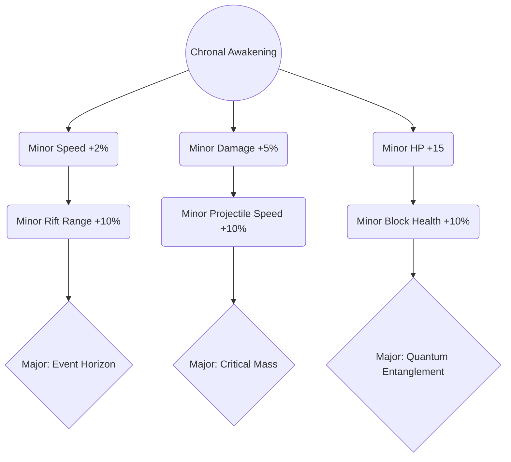
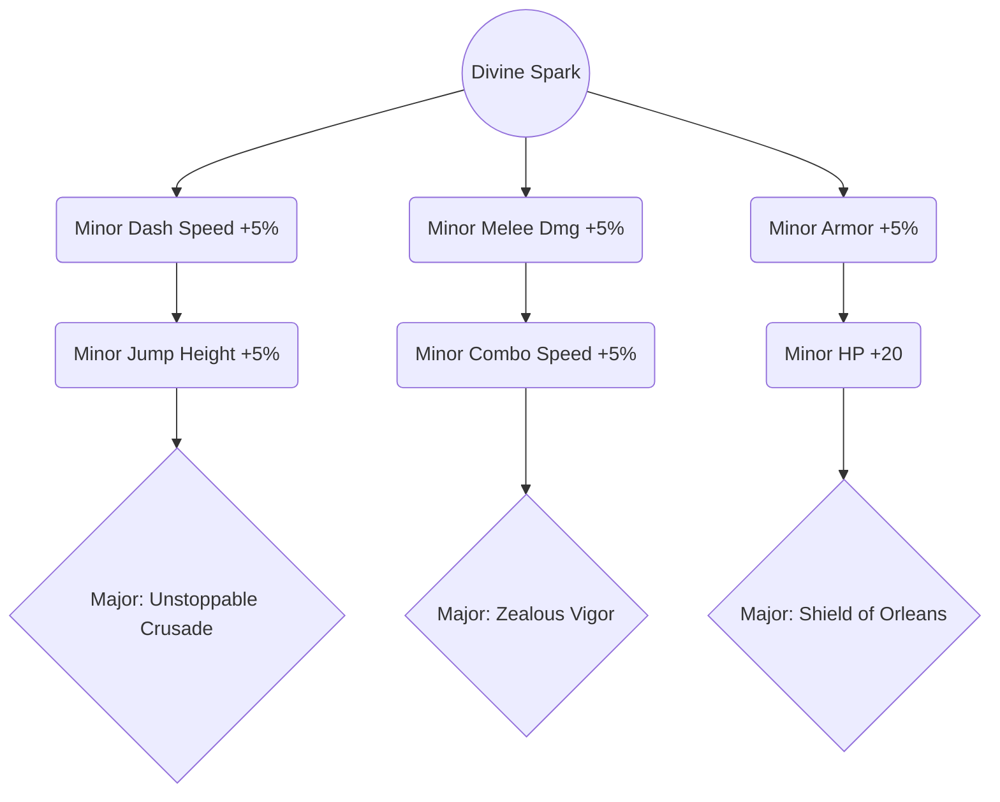
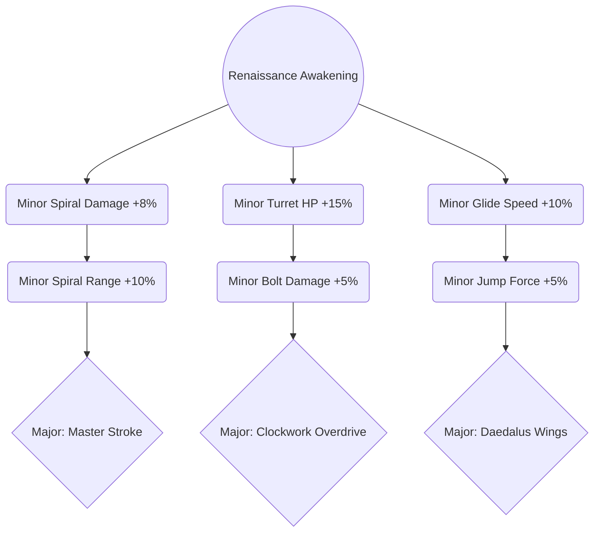
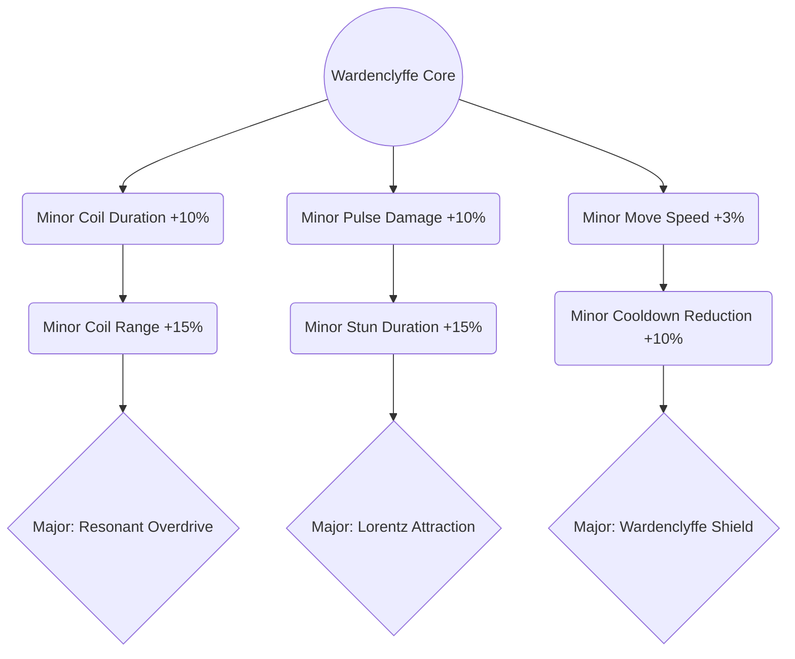
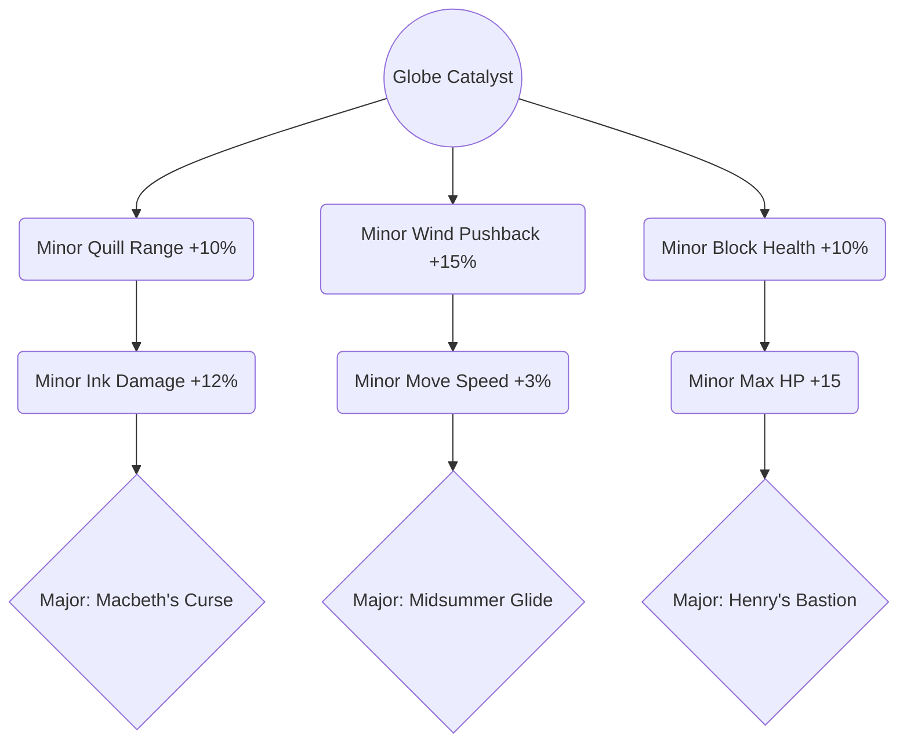
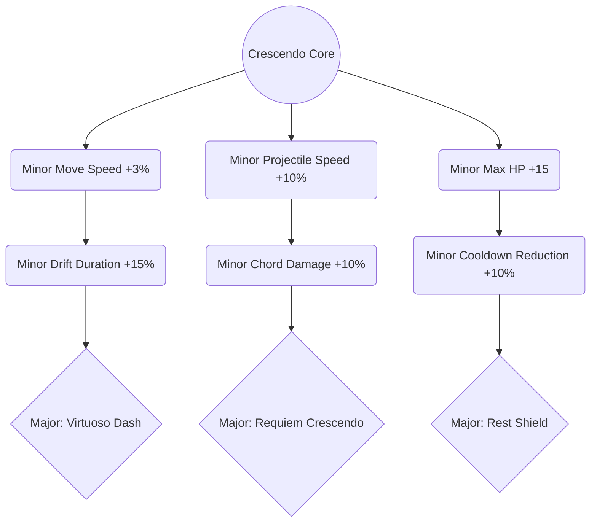
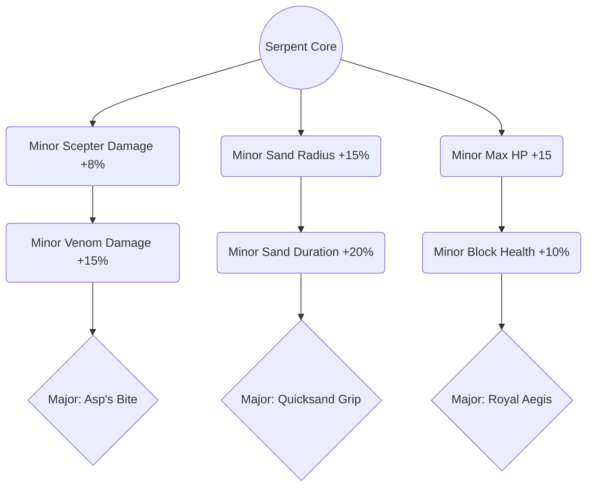
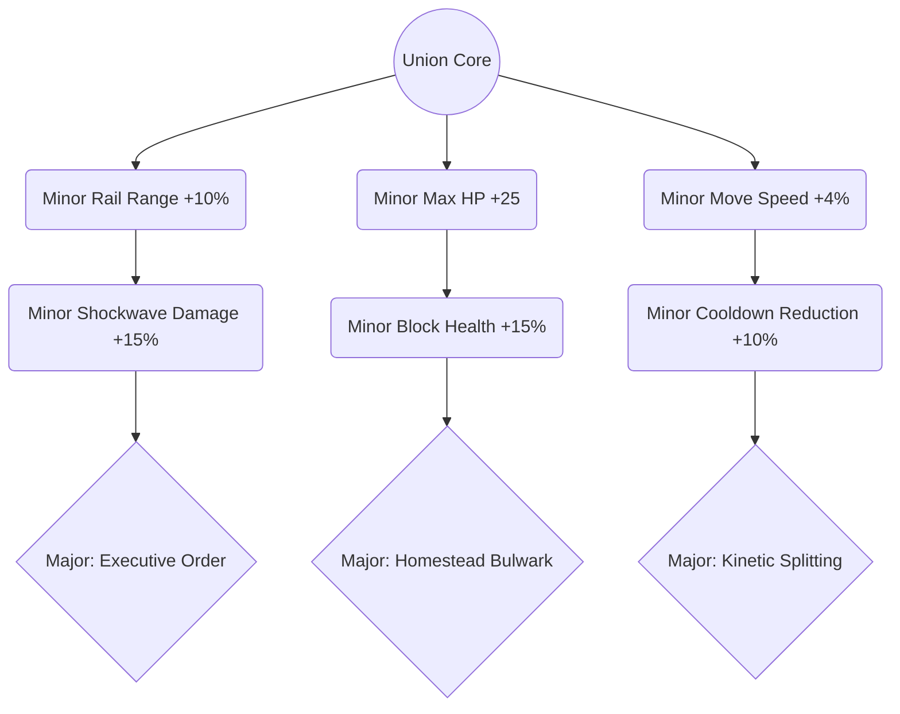
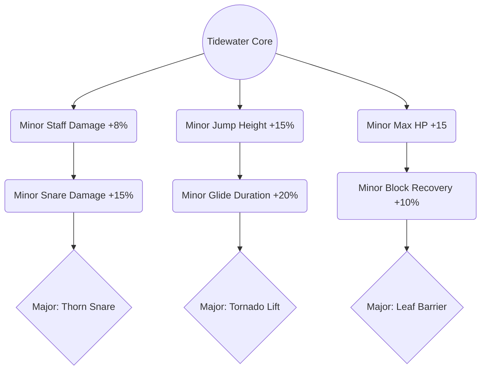
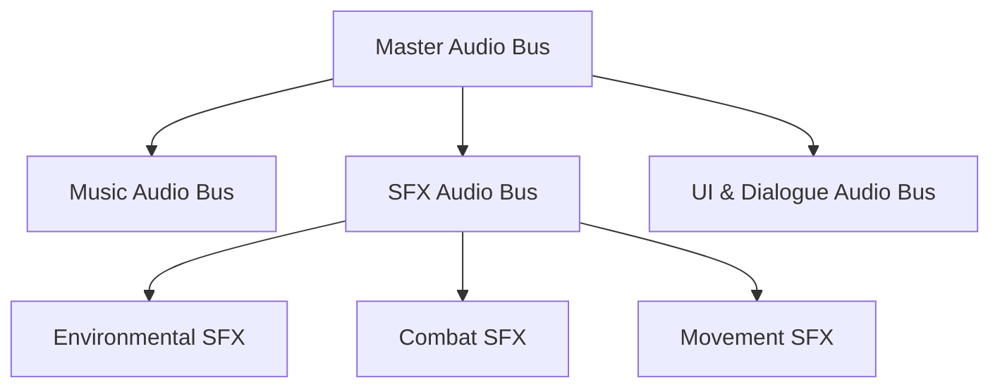

# **Fighters Through Time - Game Design Document V6-Godot**

## **1. Game Overview & Core Philosophy**
*   **Core Hook:** Play as iconic historical figures wielding exaggerated, context-specific abilities (e.g., Stephen Hawking manipulating gravity/black holes).
*   **Genre Blend:** 2D Action-Adventure (Story) meets Platform Fighter (Versus/Online).
*   **Design Pillar:** Abilities must feel cohesive across both modes. A move used to solve a puzzle or clear minions in Story Mode should translate naturally to ring-outs or damage-building in Fighting Mode.

### **Health System**
*   **Decision:** Standard Health Bar (HP) system over the Super Smash Bros. percentage-based knockback system.
*   **Rationale:** Percentage-based knockback works well in a constrained arena with blast zones, but in an Action-Adventure mode, players fight mobs and bosses in sprawling levels—trying to "ring-out" a mob down a hallway doesn't work. Standard HP bars allow traditional boss fights and mob encounters for Story Mode, while still enabling thrilling HP-depleting combat in Fighter Mode (0 HP = knockout; falling off the bottom of the stage = deduction of one stock life).

### **Core Modes**

#### **Adventure / Story Mode**
*   **Focus:** Narrative, platforming, and PvE (Player vs. Environment) combat.
*   **Structure:** Linear levels themed around specific historical eras, each tied to a playable character's timeline.
*   **Gameplay Loop:** Platforming challenges, mob encounters, environmental puzzles, and culminating boss fights against Archive forces.
*   **Progression:** All 9 characters are unlocked from the start for the initial build. Story Mode progression (Temporal Resonance Grid) is strictly isolated from Fighter Mode to preserve competitive balance. Ability upgrades apply only to Story Mode (there are no alternate costumes or cosmetic items).

#### **Versus / Fighting Mode**
*   **Inspiration:** Platform fighter in the style of Super Smash Bros.
*   **Win Condition:** Players deplete their opponent's HP to 0 for a knockout. Falling off the bottom of the stage results in the loss of a stock life. Players have a set number of stock lives per match. The sides and top of the screen are bounded by solid physical boundaries.
*   **Stage Design:** Dynamic, multi-tiered platforms based on historical events (e.g., the deck of the Titanic, the Apollo 11 moon landing, the signing of the Declaration of Independence).
*   **Local & Online Multiplayer:** Fighter Mode supports **1v1 matches only** for initial release across both local shared-screen/LAN and online GGPO rollback netcode. Delay-based netcode is unacceptable. **Post-Launch Expansion:** 4-Player Free-For-All and 2v2 Team Mode are deferred to a dedicated post-launch expansion phase and must not be implemented during initial development.


---

## **2. Narrative & Worldbuilding**

### **The Antagonists: The Apex Archive**
In the distant future, humanity has discovered that a vast amount of temporal energy surrounds key points in history—crucial moments where paradigm-shifting discoveries were made, major battles were fought, or revolutions took place. While normal society strictly forbids traveling back in time to siphon this energy due to the catastrophic risks of temporal collapse, a rogue technocratic cult known as the Apex Archive (placeholder name) believes it is their only option. The future is plagued by catastrophic energy shortages, and Earth is on the brink of collapse. Believing this is the only way to save their world, the cult sends their operatives back in time to extract this energy from history's most critical nexus points.

### **The Inciting Incident: The Temporal Overload**
The cult's first major operation targeted the Library of Alexandria. They sent operatives back to extract the temporal energy concentrated around the massive accumulation of ancient knowledge. However, the sheer volume of temporal energy at this anchor point was far greater than their equipment could handle. The extraction apparatus overloaded, triggering a cataclysmic temporal explosion. This overload shattered timeline stability, sending shockwaves across history that caused all key historical points to explode with volatile temporal energy and created **Chronal Rifts** across all eras.

### **Temporal Resonance: Why the Heroes Have Powers**
Time acts as a self-correcting force. When the shockwave from the Library of Alexandria cataclysm ripples across history, it strikes multiple key historical figures. This impact simultaneously imbues them with Temporal Resonance powers (based on the collective memory of their achievements) and violently pulls them out of their respective timelines, flinging them forward into a future era. For instance, when the energy shockwave hits Albert Einstein, he is infused with the power to manipulate spacetime and gravity; when it strikes Joan of Arc, she manifests radiant light and spectral banners of war. The collective human memory of these figures' historical importance materializes as literal superpowers—this is **Temporal Resonance**.

### **The Hub World: The Archive Time-Ship**
A hijacked, futuristic Archive Time-Ship—a sleek, advanced vessel stranded in the space between timelines. It has been repurposed by a future resistance group called the Chrono-Resistance, led by Commander Sarah. The Resistance rescues the player's displaced historical figure as they arrive in the future. The Time-Ship serves as the central hub and the space between levels, staffed by Resistance commanders, engineers, medics, and crew. From here, the player steps through time portals to travel to corrupted historical eras to halt the cult's operations. This setting provides a strong visual contrast: sleek future-resistance technology clashing with the rustic environments of the Renaissance or Ancient Rome. No other playable roster characters appear on the Time-Ship or in the campaign narrative — the story follows only the player's selected character alongside the Chrono-Resistance crew.

### **The Enemy Faction**
*   **Standard Mobs:** Future-tech synthetic drones and heavily armored Archive shock-troopers deployed across history.
*   **Elites — "Erasers":** Bounty hunters armed with weapons specifically designed to nullify historical powers.
*   **Bosses:** High-ranking Archive Overseers who wield stolen technology from other eras (e.g., a futuristic commander using a plasma-infused Excalibur).

### **Level & Boss Concepts**

### **Level Concepts & Historical Events**
The game features 10 main historical levels, each set during a pivotal historical event. The Apex Archive cult is attempting to siphon temporal energy from these milestones, and players must navigate the events to stop them:

1.  **The Steampunk Renaissance (Florence, 1503)**
    *   **Historical Event:** Leonardo da Vinci designing his flying machines and printing presses.
    *   **Cult Sabotage:** Operatives supply local nobles with steam-powered drones and laser-guided heavy weaponry to burn Florence's printing houses, attempting to stop the spark of modern humanism.
    *   **Event Integration:** Players traverse scaffoldings and print shops. Hitting levers rotates giant wooden cogs to change platform orientations. The boss is a power-hungry Duke piloting a steam-powered siege mech.

2.  **The Siege of Orléans (France, 1429)**
    *   **Historical Event:** Joan of Arc leading the French army to lift the siege of Orléans.
    *   **Cult Sabotage:** Operatives supply the English forces with futuristic kinetic shield generators and defensive mortar cannons, pinning the French vanguard behind energy barriers.
    *   **Event Integration:** Players must break through English lines, using Joan's hyper-armor dash to avoid defensive cannon fire. You must sabotage shield towers to allow historical cavalry charges to progress.

3.  **The Chicago World's Fair (USA, 1893)**
    *   **Historical Event:** The historic lighting of the World's Columbian Exposition using Tesla's alternating current system.
    *   **Cult Sabotage:** Operatives place energy siphon coils on the fairgrounds, threatening to trigger a massive overload that will destroy the Exposition and frame Tesla's AC system as a lethal danger.
    *   **Event Integration:** Players solve logic/routing puzzles by aligning conductive mirror coils to bounce energy beams safely away from crowds.

4.  **The Storming of the Bastille (France, 1789)**
    *   **Historical Event:** The storming of the Bastille fortress, the flashpoint of the French Revolution.
    *   **Cult Sabotage:** The cult sets up automated forcefields and neural-dampening projectors inside the Bastille to suppress the citizen uprising.
    *   **Event Integration:** Traverse searchlight security zones. Avoid neural-dampening beams (which drain the player's Ultimate Meter). Blow up lock mechanisms to free political prisoners to help breach the inner courtyard.

5.  **The Fall of Pompeii (Roman Empire, 79 AD)**
    *   **Historical Event:** The volcanic eruption of Mount Vesuvius.
    *   **Cult Sabotage:** The cult installs giant thermal anchors near the caldera to capture the eruption's volcanic energy, accelerating the eruption and volcanic collapse before citizens can escape.
    *   **Event Integration:** A high-speed escape sequence with falling debris, volcanic ash clouds, and lava flow geysers. Players solve weight puzzles to clear volcanic rocks from pathways and rescue Roman civilians.

6.  **The Golden Age of Pirates (Nassau, 1715)**
    *   **Historical Event:** The self-governing pirate republic of Nassau declaring independence.
    *   **Cult Sabotage:** Cultists deploy futuristic sub-aquatic torpedoes and naval targeting grids to guide the British Navy fleet in completely obliterating Nassau, extinguishing early maritime democracy.
    *   **Event Integration:** Swinging on ropes between ships, dodging mortar fire. Combat takes place on the deck of a listing, burning pirate flagship.

7.  **Cleopatra's Alexandria Palace (Egypt, 30 BC)**
    *   **Historical Event:** The Siege of Alexandria by Octavian's Roman forces.
    *   **Cult Sabotage:** Cultists provide Octavian's legionnaires with advanced plasma swords and heavy centurion armor.
    *   **Event Integration:** Evading shifting sand dunes that slow movement, solving hieroglyph puzzle locks in the tomb networks below, and routing Octavian's advanced forces away from Cleopatra's inner chambers.

8.  **The Division of Berlin (Germany, 1961)**
    *   **Historical Event:** The division of Berlin and building of the Berlin Wall.
    *   **Cult Sabotage:** Operatives install futuristic cloaked radar towers and prepare to hijack nuclear communications to provoke a preemptive Cold War strike.
    *   **Event Integration:** Stealth elements, climbing high guard towers, cutting electromagnetic surveillance feeds, and fighting in snowy ruined urban blocks.

9.  **The Globe Theatre (London, 1599)**
    *   **Historical Event:** The premiere performance of Shakespeare's legendary tragedy *Hamlet* at the wooden Globe Theatre.
    *   **Cult Sabotage:** Cultists install neural-manipulators in the audience galleries and rig structural collapse charges around the stage to disrupt the performance and cause a fatal stampede, aiming to crush the spirit of Elizabethan theatre.
    *   **Event Integration:** Players fight on the open-air wooden stage. Use ropes to swing between levels, navigate shifting trapdoors, and leap to the tiered gallery balconies. The audience acts as an active hazard, throwing objects if players remain idle for too long.

10. **The Gettysburg Battlefield (Pennsylvania, 1863)**
    *   **Historical Event:** The Battle of Gettysburg and President Lincoln's historic Gettysburg Address.
    *   **Cult Sabotage:** Cultists supply Confederate forces with futuristic laser-guided artillery cannons and electromagnetic shielding, pinning Union forces and attempting to rewrite the outcome of the war.
    *   **Event Integration:** A linear side-scrolling assault across a battlefield. Players must dodge mortar shell fire, take cover behind split-rail wooden fences, sandbags, and broken cannons, and destroy the cult's shielding arrays to let Union forces advance.

### **The Campaign Goal: Restoring the Timeline**
The primary objective of the campaign is to stop the Apex Archive cultists. Players will travel back through history to key points where the cult is attempting to extract temporal energy, putting a stop to their operations and stabilizing local timelines. The ultimate goal is to return to the **Library of Alexandria**—the site of the initial overload—to face the final boss, restore the extracted temporal energy to its source, and fully repair the fractured timelines.

### **Fighting Mode Narrative Justification**
Within the Archive Time-Ship, the heroes can use a **"Temporal Arena"** to spar against each other. Because they are fueled by the collective memory of humanity, the fighting mode is a clash of pure historical legacies.

---

## **3. Campaign Structure & Progression**

### **The Singular Narrative & Progression Path**
Story Mode follows a unified narrative campaign. When starting a new campaign slot, the player selects a specific historical figure from the main cast (all 9 characters are unlocked and available to play from the start of the campaign, deferring starting cast limitations and progressive character unlocking to a post-development phase) gathered on the Time-Ship. The player then plays through the entire campaign as that chosen character, investing earned Chronal Dust into their specific Temporal Resonance Grid. Because progression is tied to that character's talent tree, swapping characters mid-campaign is disabled. To match this assumed character power progression, level difficulty scales up progressively across the campaign's stages.

**The Game Loop:**
1.  **Select Character (Campaign Start):** Choose a character from the starting cast (all 9 characters are available). This selection is locked for the duration of this save slot's campaign.
2.  **Hub Preparation & Upgrades:** Access the Archive Time-Ship between levels to view the Chronal Repository, spend deposited Chronal Dust, and progress through your character's Resonance Grid.
3.  **Enter the Portal:** Step through a time portal to choose and enter the next corrupted historical era.
4.  **Play the Level:** Side-scrolling PvE action against increasingly difficult Archive forces, utilizing physics puzzles to progress.
5.  **Defeat the Overseer:** Defeat the local era boss to stabilize the timeline and prevent the cult from siphoning its energy.
6.  **Timeline Restoration & Deposit:** Secure the era's energy and return to the Archive Time-Ship, where all earned Chronal Dust is deposited into the ship's Chronal Repository. Completing each era stabilizes and anchors that historical timeline.

**Character Unlocking:** For the initial build, all 9 characters are unlocked and available immediately for both Story Mode and Fighter Mode. Detailed starting cast restrictions, progressive unlocking sequences, and unlocking alerts are deferred to a post-development balance phase.

### **Campaign Progression Outline**
The campaign progresses through a sequence of linear acts, combining standard historical levels with special narrative-advancing stages. 

#### **Typical Campaign Length & Level Count**
Based on industry standards for action-adventure platforming games (e.g., *Shovel Knight*, *Celeste*, and classic *Mega Man*), an optimal length for a focused, highly replayable campaign is **12 to 15 levels** (approximately 6–8 hours of gameplay per character playthrough).
*   **10 Main Historical Levels:** Self-contained eras under assault by the cult.
*   **2 Midpoint Special Levels:** High-stakes narrative departures.
*   **3 Final Act Levels:** The final assault on the cult's future and the restoration of Alexandria.

#### **High-Level Flow of the Campaign**
A cohesive narrative thread runs through each of these Acts (focusing on the resistance's efforts to trace the cult's command center), leaving specific character subplots and dialogue open to be expanded in the future. Each act concludes with a high-stakes, narrative-advancing special level integrated into a major historical event:

*   **Act I: The Displacement & Gathering**
    *   **Level 0 (Intro Level):** The cataclysmic event. A tutorial level showing the character getting hit by the Library of Alexandria shockwave and pulled forward to the Time-Ship.
    *   **Levels 1–4 (Historical Eras):** Sequential linear progression through Florence (Level 1, 1503), Orléans (Level 2, 1429), Chicago (Level 3, 1893), and Paris (Level 4, 1789) to shut down initial cult operations.
    *   **Level 5 (Act I Finale — The Sinking Titanic, 1912):** The cult attempts to siphon the massive emotional and historical weight of the disaster. The player must escape a flooding, listing deck while battling elite Archive forces. Defeating the boss reveals a encrypted data lead pointing to an orbital communications relay.
*   **Act II: Chronal Fractures & Space-Time Shifts**
    *   **Levels 6–11 (Continued Historical Eras):** Play through the remaining six historical eras (Pompeii, Nassau, Cleopatra's Palace, Berlin, The Globe Theatre, and The Gettysburg Battlefield), introducing more complex hazards and enemy units.
    *   **Level 12 (Act II Finale — The Lunar Landing, 1969):** Set on an Archive-controlled lunar outpost during the Apollo 11 moon landing. The cult is attempting to hijack the broadcast and siphon the global energy of the milestone. Features low-gravity physics, vacuum hazards, and high-altitude platforming. Defeating the Overseer allows the resistance to trace the exact coordinate signature of the cult's headquarters in the far future.
*   **Act III: The Core Assault**
    *   **Level 13 (Special — The Chronal Void):** A transitional level set inside the rift between dimensions where time is shattered. Platforms from different eras float together in dynamic, shifting gravity.
    *   **Level 14 (Special — Neo-Earth / Far Future):** Portal to the cult's actual home timeline. The players assault the Apex Archive's core laboratory, navigating laser security grids and anti-gravity containment fields.
    *   **Level 15 (Final Level — The Library of Alexandria Restoration):** The final stand. The player returns to Alexandria at the moment of the initial cataclysm to face the Leader of the Apex Archive, deposit all accumulated temporal energy back into the anchor, and repair the timeline.

### **Tutorial & Onboarding (Level 0: Chronal Integration)**

#### **Part 1: The Cataclysmic Event (The Fracture)**
*   **Narrative Context:** The level begins at the character's historic nexus point (e.g., Einstein in his Princeton study; Joan of Arc on the vanguard of Orléans). The sky tears open as the Apex Archive's Alexandria extraction machine overloads, triggering a timeline collapse.
*   **Gameplay Objectives:**
    *   **Movement Controls:** The player learns horizontal movement and jump controls as they navigate a crumbling environment. Large, floating text prompts guide them (e.g., *"Press [A/D] or Left Stick to Move"*, *"Press [Space] or [A Button] to Jump"*).
    *   **Hazard Evasion:** The player is forced to jump over static environmental hazards (chronal cracks, falling debris) to reach a glowing temporal rift.
    *   **The Translation:** Stepping into the temporal rift triggers the Act I intro cinematic, showing the character being siphoned forward through time and landing on the deck of the Archive Time-Ship.

#### **Part 2: Arrival at the Archive Time-Ship (The Calibration)**
*   **Narrative Context:** The character wakes up in the Time-Ship's high-tech temporal bay. Commander Sarah, a leader of the Chrono-Resistance, welcomes them via on-screen dialogue boxes. She explains that they have been siphoned from their timeline and imbued with **Temporal Resonance**, and outlines the threat of the Apex Archive cultists and their altered thralls before initiating calibration.
*   **Calibration Dialogue Script:** For the canonical script dialogue text, see the [Level 0 Calibration Dialogue Script in Section 16](#level-0-chronal-integration-calibration-bay).
*   **Gameplay Objectives:**
    *   **Basic Attack Calibration:** The system prompts the player to perform standard attacks. Dynamic text boxes explain the basic 3-hit combo mechanics. The player must land three standard hits on a stationary hologram dummy.
    *   **Defense & Blocking Calibration:** The hologram dummy launches slow, glowing projectile rings. The player is prompted to hold the block button, learning how shield health decreases under impact and how a guard break occurs.
    *   **Special Ability Calibration:** The system activates the character's unique Special 1 and Special 2 abilities (e.g., Einstein's E=mc² and Relativity Rift). The tutorial displays a description of each special, teaches the player about the flat 10-second cooldown, and requires the player to hit moving target shields with both abilities.
    *   **Ultimate Attack Calibration ("The History Maker"):** The simulation fills the player's Influence Meter to 100%. A dramatic screen prompt tells the player to trigger their Ultimate. Doing so executes their custom cinematic move, obliterating a group of combat holograms.

#### **Part 3: Advanced Mobility Calibration**
*   **Narrative Context:** Commander Sarah remarks: *"Your combat resonance is calibrated. Now let's test your spatial awareness — you'll need every advantage to navigate the fractured timelines."* The Calibration Bay reconfigures into a vertical platforming section with floating platforms and ledges.
*   **Gameplay Objectives:**
    *   **Movement Ability Calibration:** The system prompts the player to activate their unique Movement Ability (e.g., Einstein's Relativity Warp, Joan's Ascendant Wings). A text prompt explains the 5-second cooldown and aerial usability. The player must use the movement ability to cross a gap too wide for a standard jump.
    *   **Ledge Grab Calibration:** The player encounters a platform positioned just out of normal jump reach. A text prompt instructs: *"Move toward the ledge while falling — you will grab and hang automatically. Press Up to pull up, or Down to drop."* The player must successfully grab a ledge, hang, and pull up to proceed.
    *   **Platform Drop-Through Calibration:** The player stands on a raised one-way platform with a target below. A text prompt instructs: *"Double-tap Down to drop through thin platforms."* The player must drop through the platform and land on the target zone below to complete the section.
    *   **Hologram Combat Trial:** To complete Level 0, the player must defeat a small wave of active hologram enemies (synthetic drones) simulating a real PvE skirmish. Once defeated, the time portals unlock, and the player is cleared to select Act I levels from the Time-Ship deck.

### **Hub World: The Archive Time-Ship (Interactivity & Systems)**
The Archive Time-Ship acts as the central hub world between Story Mode missions. It is a navigable 2D side-scrolling environment where the player controls their active historical character.

#### **Interactive Elements & Hub Systems**
1.  **Chronal Repository (Upgrades Terminal):**
    *   *Interaction:* A high-tech physical terminal located in the ship's center command deck.
    *   *Gameplay:* Interacting with the Repository prompts the player to deposit all **Chronal Dust** collected during their last campaign run. Once deposited, the player can spend this currency to unlock stat upgrades and major ability modifiers in their active character's **Temporal Resonance Grid** (skill tree).
2.  **Holodeck Arena Console (AI Combat Simulator):**
    *   *Interaction:* An holographic terminal in the training wing of the ship.
    *   *Gameplay:* Interacting with the console opens the **Arena Simulator** menu. The player can configure and start simulated matches against customizable AI opponents. These fights take place on any unlocked Fighter Mode stages, serving as a safe training environment to test character combos, block timing, and matchups in a single-player VS format.
3.  **NPC Interactions & Dialogue:**
    *   *Interactive Entities:* The ship's halls are populated by Chrono-Resistance members and ship staff (Commander Sarah, engineers, medics, and crew). No other playable roster characters appear as NPCs.
    *   *Dialogue & Lore:* Talking to NPCs triggers dialogue box sequences showing hand-drawn visual portraits, conveying backstory, lore hints, and gameplay tips.
4.  **Temporal Portal & Sequential Campaign Progression:**
    *   *Interaction:* A massive glowing chronal gate situated at the front of the bridge.
    *   *Linear Sequential Portal:* Campaign progression is strictly **linear and sequential** (Level 0 $\rightarrow$ Level 1 $\rightarrow$ Level 2 $\rightarrow$ ... $\rightarrow$ Level 15). There is always only **one single active portal destination** available to select at any time on the Time-Ship bridge, pointing directly to the next sequential story level. Players cannot select non-linear branch paths or skip ahead.
    *   *Level Activation:* The temporal portal remains inactive when the player first arrives in the hub. To activate it and unlock the next campaign level, the player must seek out and converse with key Resistance NPCs on the ship (e.g., Commander Sarah or Resistance officers).
    *   *Travel:* Engaging in dialogue with these key Resistance NPCs triggers the narrative sequence that charges the portal. Once charged, stepping into the single active Temporal Portal immediately transports the player to the next sequential era. Level difficulty scales progressively along this fixed linear path.

> **Interim Implementation Note:** For initial builds prior to NPC authoring completion, the Temporal Portal activates automatically upon hub entry (bypassing the NPC conversation requirement). NPC-gated portal activation will be integrated when dialogue content is authored.

#### **Hub World Layout & NPC Specifications (Deferred)**
> **Status: Deferred to the level design and narrative authoring phases.**
> The spatial layout of the Archive Time-Ship (room dimensions, area connections, walking paths between interactive stations) and individual NPC specifications (placement coordinates, dialogue trees, portrait art, and quest triggers) will be authored during dedicated hub world production.
>
> **Hub World Design Checklist:**
> - [ ] Total hub room count and interconnection map
> - [ ] Chronal Repository station exact placement and visual design
> - [ ] Holodeck Arena Console station exact placement and visual design
> - [ ] Temporal Portal station exact placement and visual design
> - [ ] Calibration Bay spawn anchor location
> - [ ] NPC roster with assigned positions (Resistance commanders, engineers, medics, ship staff)
> - [ ] NPC dialogue content and branching dialogue trees
> - [ ] NPC portrait art specifications
> - [ ] Walking path distances and transition trigger locations between rooms

### **The Temporal Resonance Grid**
*   **Purpose:** The primary power-scaling mechanic for Story Mode. Strictly isolated to Story Mode to preserve Fighter Mode balance.
*   **Mechanic:** A constellation-style skill tree unique to each character—a sprawling, interconnected web of nodes presented as a glowing celestial constellation in the UI. The starting node is in the center, branching outward into three distinct paths (e.g., Survivability, Utility, Raw Damage).

#### **Currency: Chronal Dust**
*   **Acquisition & Economy Rates:**
    *   *Standard Mobs:* Defeating basic enemies yields a minor drop of **1–2 Chronal Dust** per kill.
    *   *Elite Mobs:* Defeating larger, elite enemies yields a significant drop of **20 Chronal Dust** per kill.
    *   *Level Bosses:* Defeating a campaign boss rewards a large drop of **50 Chronal Dust**.
    *   *Chronal Extractors (Level Hazards/Caches):* Each side-scrolling campaign level contains **3 to 4** hidden, destructible environmental machines called "Chronal Extractors". Extractors possess **100 HP**. As they take damage and break, they trigger localized **Chronal Hazards** (erratic energy bursts and shockwaves around the machine) that deal heavy damage, high-velocity knockback, and **drain the player's Ultimate Meter by 20%** per discharge. Players must actively dodge while attacking. When completely shattered, a Chronal Extractor drops **25 Chronal Dust**.
    *   *Balance Note:* These default drop rates serve as baseline placeholders. Overall total dust budgets per level and economy scaling are left open-ended for initial implementation and will be balanced and fine-tuned in a later phase of development.
*   **Visual Pickups (Single Icon Rule):** Chronal Dust drops spawn as a single physical pickup object rendering an icon sprite matched to its quantity size tier:
    *   *Small Dust Sprite:* Drops containing **1 to 5 Dust** (e.g., standard mobs).
    *   *Medium Dust Sprite:* Drops containing **6 to 24 Dust** (e.g., Chronal Extractors).
    *   *Large Dust Sprite:* Drops containing **25+ Dust** (e.g., Elite mobs, Campaign Bosses).
*   **No Level Replays / Dust Farming:** Previously completed campaign levels cannot be re-entered or replayed to farm Chronal Dust. The Archive Time-Ship features only a single active Temporal Portal on the bridge, which exclusively transports the player to their current active story level.
*   **Character-Specific Pooling:** Chronal Dust collected during a campaign run belongs strictly to the **specific active character being played**. Dust is not shared between characters or across different playthroughs. Depositing dust into the Time-Ship Chronal Repository adds it exclusively to that character's personal pool.
*   **Repository System:** Upon returning to the Archive Time-Ship from a mission, the player deposits all accumulated Chronal Dust into the ship's **Chronal Repository**.
*   **Function:** Deposited dust is spent from the character's personal Repository pool to unlock adjacent nodes on their character-specific Resonance Grid.

#### **Node Types**
*   **Stat Nodes (Minor):** Small, incremental mathematical buffs. Examples: +10 Max HP, +2% Movement Speed, +5% Basic Attack Damage.
*   **Major Perk Nodes:** Located at the end of specific grid branches. These fundamentally alter the mechanical properties of special abilities (e.g., granting Joan of Arc an extra jump, increasing the radius of Einstein's Relativity Rift by 15%).

#### **Technical Implementation**
Since the save system uses encrypted JSON, storing grid progress requires saving a `List<string>` of unlocked Node IDs for each character. On scene load, the system reads the unlocked node list, sets boolean flags, and applies the stat modifiers to the base Resource values at runtime.

#### **Node Data Schema (`ResonanceNodeData` Resource)**
```csharp
[GlobalClass]
public partial class ResonanceNodeData : Resource {
    [Export] public string nodeID;                // Unique identifier (e.g., "einstein_u1")
    [Export] public string displayName;           // UI label (e.g., "Minor Speed +2%")
    [Export(PropertyHint.MultilineText)] public string description; // Tooltip text
    [Export] public int chronalDustCost;          // Currency cost to unlock
    [Export] public string[] prerequisiteNodeIDs; // Nodes that must be unlocked first
    [Export] public bool isMajorPerk;             // True for branch-end major nodes
    [Export] public StatModifier[] statModifiers; // Stat changes applied on unlock
}

public struct StatModifier {
    public StatType stat;   // Enum: MaxHP, MoveSpeed, AttackDamage, CooldownReduction, etc.
    public float value;     // Flat or percentage modifier
    public bool isPercent;  // If true, value is a percentage multiplier
}

public enum StatType {
    MaxHP, MoveSpeed, Acceleration, JumpForce, AirControl,
    BasicAttackDamage, SpecialDamage, AttackRange, KnockbackForce,
    CooldownReduction, BlockCharges, UltimateBuildRate
}
```

*   **Node Costs (Default Progression):**
    *   **Tier 1 Minor Nodes:** 50 Chronal Dust
    *   **Tier 2 Minor Nodes:** 75 Chronal Dust
    *   **Tier 3 Major Perk Nodes:** 200 Chronal Dust
*   **Adjacency Storage:** Each node stores its prerequisite IDs. The UI draws connections between prerequisite and dependent nodes. Unlocking a node requires all prerequisites to be unlocked and sufficient Chronal Dust balance.

*   **Preliminary Economy Estimate:** A full 9-node Resonance Grid (3 Tier 1 Minor Nodes at 50 dust + 3 Tier 2 Minor Nodes at 75 dust + 3 Tier 3 Major Perks at 200 dust) costs approximately **975 Chronal Dust**. Estimated total dust per campaign playthrough is **1,200–1,800** (across 15 levels, accounting for mob drops, elite kills, boss rewards, and Chronal Extractors). This budget allows completion of one full tree per playthrough with surplus. Final economy tuning is deferred to the balance phase.

> [!NOTE]
> **Resonance Grid Expansion (Deferred):** The current 3-path × 3-node grid structure is the baseline for initial implementation. Expanding the grid with additional nodes, branching paths, or deeper tier progressions is deferred to a later design phase.

#### **Resonance Grid UI Flow**
*   **Access Point:** The Resonance Grid is opened by interacting with the **Chronal Repository terminal** on the Archive Time-Ship hub. The standard interaction prompt (`[E]` / `[B]`) appears when the player is within range.
*   **Display:** The full constellation map renders with unlocked nodes highlighted (glowing cyan pulsing aura) and locked nodes dimmed (grey outline with amber cost indicator). Connection lines between nodes glow when the prerequisite is met.
*   **Navigation:** D-pad or left analog stick navigates between adjacent nodes. Hovering a node displays a tooltip panel showing: node name, description, Chronal Dust cost, stat effect values, and prerequisite status.
*   **Purchase:** Pressing the Confirm button (`A` / `Cross`) on an eligible node (prerequisites met and sufficient dust balance) displays a brief purchase confirmation prompt: *"Unlock [Node Name] for [Cost] Chronal Dust?"* with Confirm/Cancel options. On confirmation, dust is deducted, the node activates with a visual unlock animation (expanding light ring), and stat modifiers are applied immediately.
*   **Insufficient Funds:** Attempting to purchase a node without enough Chronal Dust triggers a "Not Enough Chronal Dust" tooltip shake animation on the cost indicator. No purchase prompt appears.
*   **Exit:** Pressing the Cancel/Back button (`B` / `Circle`) exits the Resonance Grid UI and returns the player to hub world navigation.

---

## **4. Engine & Architecture (Godot 4)**

### **Project Setup & Configuration**

#### **Godot Version & Render Pipeline**
*   **Engine:** Godot 4.4+ with .NET (C# / .NET 8)
*   **Render Pipeline:** Godot's native 2D renderer (CanvasItem) with **Light2D** nodes, **CanvasModulate** for global tinting, and custom **CanvasItem shaders** for sprite-lit materials and visual effects. The 2D renderer provides sprite lighting, shadow casting via `LightOccluder2D`, and normal-mapped materials while maintaining performance budgets on low-end hardware.
*   **Target Frame Rate:** 60 FPS (locked). Physics tick rate synchronized at 60Hz via Project Settings (`physics/common/physics_ticks_per_second = 60`).

#### **Required Addons & Dependencies**
| Addon / Dependency | Source | Purpose |
|---|---|---|
| Klotho | Godot Asset Library / NuGet | Deterministic rollback netcode framework (FP64 fixed-point, ECS, physics, replay) |
| GdUnit4 | Godot Asset Library | Automated unit and integration testing (Section 14) |
| Steam Networking Sockets (Steamworks SDK) | Steamworks | NAT traversal, relay fallback, encrypted P2P transport |

> [!NOTE]
> Addon versions should be pinned in the project's `addons/` directory and `.csproj` NuGet references at development start to ensure reproducible builds. C# NuGet dependencies (e.g., Klotho, Newtonsoft.Json, K4os.Compression.LZ4, LiteNetLib) are managed via the project `.csproj` file and restore automatically on build.

#### **Project Folder Structure**
```
project_root/
├── addons/
│   ├── klotho/            (Klotho rollback netcode framework)
│   └── gdunit4/           (GdUnit4 test framework)
├── scripts/
│   ├── Core/              (GameManager, SaveManager, AudioManager, EventBus, SessionData)
│   ├── Characters/        (PlayerController, FSM states, BaseSpecial, ability implementations)
│   ├── Enemies/           (EnemyController, BossController, AI states, mob behaviors)
│   ├── Combat/            (HitboxSystem, StatusController, UltimateMeter, DamageCalculator)
│   ├── Environment/       (PuzzleManager, HazardController, Checkpoint, LevelManager)
│   ├── UI/                (HUDController, MenuManager, DialogueManager, ResonanceGridUI)
│   └── Networking/        (Deferred — online multiplayer implementation is a later phase)
├── resources/
│   ├── Characters/        (CharacterData .tres assets per character)
│   ├── Abilities/         (AbilityData .tres assets per ability)
│   ├── Enemies/           (EnemyData, BossData .tres assets)
│   ├── Resonance/         (ResonanceNodeData, ResonanceGridData .tres per character)
│   └── SpriteFrames/      (SpriteFrames .tres per character animation set)
├── scenes/
│   ├── characters/        (Player character scene trees with controllers)
│   ├── enemies/           (Mob and boss scene trees)
│   ├── projectiles/       (Ability projectile scene trees)
│   ├── vfx/               (Visual effect scene trees)
│   ├── ui/                (Reusable UI component scene trees)
│   ├── menus/             (MainMenu, CharacterSelect, StageSelect)
│   ├── campaign/          (HubWorld, Level_00 through Level_15)
│   └── fighter/           (FighterStage_Florence through FighterStage_Gettysburg)
├── assets/
│   ├── sprites/           (Character sprite sheets, UI elements)
│   ├── tilemaps/          (TileSet resources and TileMapLayer data)
│   └── fonts/             (Custom font files for UI)
├── audio/
│   ├── music/             (BGM stems per level)
│   ├── sfx/               (Categorized sound effects)
│   └── buses/             (AudioBusLayout resources)
├── localization/          (en.json, es.json, fr.json, etc.)
├── tests/
│   ├── unit/              (Unit tests — FSM, status effects, damage calc)
│   └── integration/       (Integration tests — gameplay scenarios)
├── project.godot          (Project settings)
└── FightersThroughTime.csproj  (.NET project file with NuGet references)
```

#### **Namespace Conventions**
*   **Root Namespace:** `FTT`
*   **Sub-Namespaces:** `FTT.Core`, `FTT.Combat`, `FTT.Characters`, `FTT.Enemies`, `FTT.UI`, `FTT.Environment`, `FTT.Audio`
*   **Folder-Based Organization:** C# scripts are organized by namespace folder under `scripts/`. Godot does not use assembly definitions; instead, all game code compiles into a single `.csproj`. Namespace boundaries enforce logical separation.

#### **Input System Action Schema**
Gameplay and UI control schemes are managed by Godot's **InputMap** system using named input actions defined in Project Settings > Input Map. All default key and gamepad bindings are specified authoritatively in the **Default Input Action Mapping Table** (Section 5).


#### **Dependency & Reference Management**
To optimize performance and decoupled design:
*   **Global Managers:** Singletons like `GameManager`, `SaveManager`, `AudioManager`, and `InputManager` are registered as **Godot autoload singletons** (Project Settings > Autoload) and persist across all scene changes automatically. They are accessed through typed static `Instance` fields or via `GetNode<T>("/root/ManagerName")`.
*   **Local Scene References:** Node scripts (such as character/enemy controllers and puzzle objects) locate references directly via exported fields `[Export]` set in the inspector, or via `GetNode<T>()` with explicit `NodePath` references. Scripts must not use heavy runtime lookups such as `FindChild()` with recursive flags or string-based tree traversals.
*   **Event-Based Decoupling:** Non-adjacent systems communicate via Godot **signals** and a centralized C# **EventBus autoload** singleton (e.g., `OnPlayerDamaged`, `OnUltimateMeterFull`) to ensure character scripts remain separate from UI.

### **Scene Architecture & Loading Strategy**

#### **Scene List**
All scenes are stored as `.tscn` files in the `scenes/` directory.

| Scene Name (`.tscn`) | Type | Description |
|---|---|---|
| `MainMenu` | Menu | Title screen with Story Mode, Fighter Mode, Settings, Quit |
| `HubWorld` | Gameplay | Archive Time-Ship hub (navigable 2D environment) |
| `Level_00_Tutorial` | Gameplay | Intro/tutorial level (The Fracture + Calibration) |
| `Level_01_Florence` | Gameplay | The Steampunk Renaissance |
| `Level_02_Orleans` | Gameplay | The Siege of Orléans |
| `Level_03_Chicago` | Gameplay | The Chicago World's Fair |
| `Level_04_Paris` | Gameplay | The Storming of the Bastille |
| `Level_05_Titanic` | Gameplay | Act I Finale — The Sinking Titanic |
| `Level_06_Pompeii` | Gameplay | The Fall of Pompeii |
| `Level_07_Nassau` | Gameplay | The Golden Age of Pirates |
| `Level_08_Egypt` | Gameplay | Cleopatra's Alexandria Palace |
| `Level_09_Berlin` | Gameplay | The Division of Berlin |
| `Level_10_Globe` | Gameplay | The Globe Theatre |
| `Level_11_Gettysburg` | Gameplay | The Gettysburg Battlefield |
| `Level_12_Lunar` | Gameplay | Act II Finale — The Lunar Landing |
| `Level_13_ChronalVoid` | Gameplay | The Chronal Void (transitional) |
| `Level_14_NeoEarth` | Gameplay | Neo-Earth / Far Future |
| `Level_15_Alexandria` | Gameplay | Final Level — Library of Alexandria Restoration |
| `CharacterSelect` | Menu | Fighter Mode character selection screen |
| `StageSelect` | Menu | Fighter Mode stage selection screen |
| `FighterStage_Florence` | Gameplay | Florence Workshop arena |
| `FighterStage_Orleans` | Gameplay | Orléans Vanguard arena |
| `FighterStage_Chicago` | Gameplay | Chicago Exposition arena |
| `FighterStage_Paris` | Gameplay | Paris Bastille arena |
| `FighterStage_Pompeii` | Gameplay | Vesuvius Caldera arena |
| `FighterStage_Nassau` | Gameplay | Nassau Flagship arena |
| `FighterStage_Egypt` | Gameplay | Alexandria Chambers arena |
| `FighterStage_Berlin` | Gameplay | Berlin Wall arena |
| `FighterStage_Globe` | Gameplay | Globe Theatre Stage arena |
| `FighterStage_Gettysburg` | Gameplay | Gettysburg Ridge arena |

#### **Persistent Managers (Autoload Singletons)**
The following singleton managers are registered as Godot **autoload** entries (Project Settings > Autoload) and persist across all scene changes automatically:
*   **`GameManager`:** Stores `SessionData` (selected character ID, stage ID, difficulty, active save slot, match settings), manages scene transitions, holds a `LoadingScreen` overlay `CanvasLayer` for async loading.
*   **`SaveManager`:** Handles all read/write operations to `StorySaveData` and `GlobalSaveData`. Checkpoint scripts call `SaveManager.Instance.SaveCheckpoint(checkpointID)`.
*   **`AudioManager`:** Controls the `AudioServer` bus pipeline, manages dynamic BGM stem layering, and coordinates bus effect transitions.
*   **`InputManager`:** Manages Godot's `InputMap` action bindings and handles device assignment for local multiplayer via `Input.GetConnectedJoypads()` and the `Input.JoyConnectionChanged` signal.

#### **Scene Loading Strategy**
*   **Method:** Single-scene replacement via `SceneTree.ChangeSceneToPacked()` using `ResourceLoader.LoadThreadedRequest()` for asynchronous background loading. Autoload singletons persist across all scene changes automatically.
*   **Loading Screen:** A full-screen overlay `CanvasLayer` (child of the `GameManager` autoload) displays a transition effect during async scene loads. To prevent screen flashing on fast hardware, the overlay enforces a **minimum display duration of 2.0 seconds** before fading out.
    *   *Story Mode (Campaign & Hub):* Plays a full-screen **Shimmering Portal Effect** (cyan portal swirls, chromatic aberration, and refracting particle effects) to simulate time travel. The transition is visually synchronized with the player stepping into the time-portal in-game.
    *   *Fighter Mode (Versus):* Displays **Dynamic VS Matchup Cards**. Two large character portrait cards slide onto the screen from opposite sides (Player 1 from the left, Player 2 from the right), displaying player names and character stats. A glowing digital chronal circle/hourglass loader spins in the center.
*   **Data Flow Between Scenes:** The `GameManager` autoload holds a `SessionData` struct that persists across scene changes:
    ```csharp
    public struct SessionData {
        public string SelectedCharacterID;  // Character for campaign or fighter
        public string SelectedStageID;      // Fighter Mode stage scene path
        public int ActiveSaveSlot;          // Story Mode save profile index
        public Difficulty Difficulty;        // Easy, Normal, Hard
        public MatchSettings MatchSettings; // Multi-parameter match settings struct
    }

    public struct MatchSettings {
        public MatchMode Mode;                    // Default: MatchMode.Stock
        public int StockCount;                    // Default: 3 (range: 1-5)
        public float TimeLimit;                   // Default: 480.0f (8 minutes in seconds)
        public bool ItemsEnabled;                 // Default: true (all items enabled toggle)
        public ChronalOrbFrequency ItemSpawnRate; // Default: ChronalOrbFrequency.High (5-6 orbs/min)
        public bool StageHazardsEnabled;          // Default: true (all hazards enabled toggle)
        public HazardTriggerFrequency HazardRate; // Default: HazardTriggerFrequency.High (every 30-45s)

        public static MatchSettings GetDefault() {
            return new MatchSettings {
                Mode = MatchMode.Stock,
                StockCount = 3,
                TimeLimit = 480.0f,
                ItemsEnabled = true,
                ItemSpawnRate = ChronalOrbFrequency.High,
                StageHazardsEnabled = true,
                HazardRate = HazardTriggerFrequency.High
            };
        }
    }

    public enum MatchMode {
        Stock,
        TimeLimit,
        Hybrid
    }

    public enum ChronalOrbFrequency {
        Off,
        Low,      // ~1 orb per minute
        Medium,   // 2-3 orbs per minute
        High      // 5-6 orbs per minute
    }

    public enum HazardTriggerFrequency {
        Off,
        Low,      // Every 60-90 seconds
        Medium,   // Every 45-60 seconds
        High      // Every 30-45 seconds
    }
    ```

### **Core Systems**
*   **Input Handling:** Godot **InputMap** system with named input actions for multiplayer controller support. Device assignment managed via `Input.GetConnectedJoypads()` and the `Input.JoyConnectionChanged` signal. Critical for local multiplayer in Fighter Mode.
*   **Data Containers:** Base stats abstracted into **Resource** subclasses (`.tres` files) for static character data. Variations can be created and tweaked in the Godot Editor inspector without recompiling code.
*   **State Machine:** A strict **Finite State Machine (FSM)** using the canonical `CharacterState` enum (defined below) managing what inputs are valid at any given time.

#### **Canonical Character State Enum**
```csharp
public enum CharacterState {
    Idle,                 // Default grounded state, accepting all inputs
    Running,              // Horizontal movement on ground
    Dashing,              // Universal fast grounded burst; keeps combatant pushbox and has no invulnerability
    Rolling,              // Universal evasive roll with startup, pass-through travel, and punishable recovery
    Skidding,             // Direction reversal skid on ground (3-frame turn lag)
    Crouching,            // Low-profile ducking on ground (-30% hurtbox height)
    Airborne,             // Jumping, falling, double-jumping, or any aerial state
    Attacking,            // Basic attack combo chain (Hits 1–3), executed while grounded, crouching, or airborne
    UsingSpecial,         // Special 1 or Special 2 execution
    UsingUltimate,        // Ultimate cinematic sequence (pauses standard gameplay)
    Blocking,             // Holding block — energy barrier active
    Stunned,              // Hitstun from taking damage (duration = attack's hitstun frames)
    Dazed,                // Guard break stun (1.0 second vulnerability window)
    LedgeHanging,         // Hanging from a platform edge (max 5 seconds)
    Dead,                 // 0 HP reached — triggers Chronal Rewind or stock loss
    Respawning,           // Invincibility window after rewind/stock respawn
    UsingMovementAbility  // Execute unique mobility move (e.g. dash, blink, glide)
}
```

#### **State Transition Table**
| From State | To State | Trigger |
|---|---|---|
| `Idle` | `Running` | Horizontal input detected |
| `Idle` | `Dashing` | Double-tap digital direction or flick analog direction on ground |
| `Idle` | `Rolling` | Roll input on ground; held direction selects travel direction |
| `Idle` | `Crouching` | Down input held on ground |
| `Idle` | `Airborne` | Jump input (or walk off edge) |
| `Idle` | `Attacking` | Basic Attack input |
| `Idle` | `UsingSpecial` | Special 1 or Special 2 input (if off cooldown) |
| `Idle` | `UsingUltimate` | Ultimate input (if meter = 100) |
| `Idle` | `Blocking` | Block input held |
| `Idle` | `UsingMovementAbility` | Movement Ability input (if off cooldown) |
| `Running` | `Idle` | Horizontal input released |
| `Running` | `Dashing` | Double-tap digital direction or flick analog direction |
| `Running` | `Rolling` | Roll input on ground |
| `Dashing` | `Idle` | 12-frame dash completes or meets an opposing pushbox/wall |
| `Dashing` | `Airborne` | Jump cancel after the 4-frame commitment window |
| `Dashing` | `Attacking` | Basic attack cancel after the 4-frame commitment window |
| `Rolling` | `Idle` | Startup, travel, and recovery sequence completes while grounded |
| `Rolling` | `Airborne` | Roll sequence completes after leaving a platform edge |
| `Running` | `Skidding` | Reverse horizontal input detected on ground |
| `Skidding` | `Running` | Turnaround skid animation completes (3 frames / 0.05s) |
| `Running` | `Crouching` | Down input held while running |
| `Crouching` | `Idle` | Down input released |
| `Crouching` | `Attacking` | Basic Attack input while crouching (crouch attack) |
| `Running` | `Airborne` | Jump input (or walk off edge) |
| `Running` | `Attacking` | Basic Attack input |
| `Running` | `Blocking` | Block input held |
| `Running` | `UsingMovementAbility` | Movement Ability input (if off cooldown) |
| `Airborne` | `Idle` | Landing on ground (grounded check = true) |
| `Airborne` | `LedgeHanging` | Hand-level collider overlaps Ledge trigger (downward velocity) |
| `Airborne` | `Attacking` | Basic Attack input (aerial attack) |
| `Airborne` | `UsingSpecial` | Special input (if off cooldown) |
| `Airborne` | `UsingUltimate` | Ultimate input (if meter = 100) |
| `Airborne` | `UsingMovementAbility` | Movement Ability input (if off cooldown) |
| `Attacking` | `Attacking` | Next combo input within 0.4s buffer |
| `Attacking` | `Idle` | Combo buffer/animation expires (reset to Hit 1) and grounded check = true |
| `Attacking` | `Airborne` | Combo buffer/animation expires (reset to Hit 1) and grounded check = false |
| `Attacking` | `UsingSpecial` | Special input pressed (cancels basic attack if special off cooldown) |
| `Attacking` | `Blocking` | Block input during recovery frames only |
| `UsingSpecial` | `Idle` | Ability animation completes and grounded check = true |
| `UsingSpecial` | `Airborne` | Ability animation completes and grounded check = false |
| `UsingUltimate` | `Idle` | Cinematic sequence completes and grounded check = true |
| `UsingUltimate` | `Airborne` | Cinematic sequence completes and grounded check = false |
| `Blocking` | `Idle` | Block input released |
| `Blocking` | `Dazed` | Shield shattered (0 charges) |
| `LedgeHanging` | `Idle` | Pull Up input (Up or toward stage to climb onto platform) |
| `LedgeHanging` | `Airborne` | Drop Down input (Down), Jump input (jump off), or 5s timer expires |
| `LedgeHanging` | `Stunned` | Taking any damage while hanging (forces player off ledge) |
| `UsingMovementAbility` | `Idle` | Movement duration completes (and grounded check = true) |
| `UsingMovementAbility` | `Airborne` | Movement duration completes (and grounded check = false) |
| `Stunned` | `Idle` | Hitstun duration expires |
| `Dazed` | `Idle` | Daze duration (1.0s) expires |
| `Dead` | `Respawning` | Chronal Rewind / stock respawn initiated |
| `Respawning` | `Idle` | Invincibility window expires |
| **Any State** | `Stunned` | Hit by an attack (highest priority interrupt; bypassed if using an ability with active Hyper-Armor) |
| **Any State** | `Dead` | `currentHP` reaches 0 |

#### **Player Movement & Feedback Defaults**
*   **Run Acceleration:** Grounded movement reaches the character's normal maximum speed over 8 simulation frames. Air control retains its faster 4-frame acceleration response.
*   **Universal Dash:** Digital controls double-tap Left/Right within 15 frames; analog controls flick from neutral past 85% magnitude. A dash lasts 12 frames at `1.35x` normal run speed, retains the combatant pushbox, grants no invulnerability, and may cancel into Jump or Basic Attack after a 4-frame commitment.
*   **Universal Evasive Roll:** The dedicated Roll action defaults to `O` on keyboard and Right Trigger on controller. Direction comes from horizontal input or falls back to facing direction. The roll uses 4 startup frames, 12 travel frames at `1.5x` run speed, and 10 recovery frames. Only the first 8 travel frames are invulnerable. The combatant pushbox is disabled during travel so the roller can cross ordinary enemies/fighters; terrain remains solid and explicitly immovable bosses can block crossing.
*   **Coyote Time Window:** `0.1s` (6 frames at 60Hz). Allows a grounded jump up to 6 frames after walking off a platform edge.
*   **Jump Buffer Window:** `0.1s` (6 frames at 60Hz). Buffers jump inputs pressed up to 6 frames prior to landing on ground.
*   **Double Jump Audio/Visual Feedback:** Executing a double jump instantiates an expanding cyan shockwave ring particle burst (`FX_DoubleJump_Ring`) at the character's feet and plays a pitch-shifted secondary jump SFX (`SFX_Jump_Secondary`).
*   **Guard Break Knockback Vector:** Depleting a character's block charges to 0 applies a fixed knockback vector of `Vector2(2.0, 1.0)` away from the attacker and forces a 1.0s `Dazed` state.

### **Object Pooling System**
To maintain a locked 60 FPS frame rate and avoid garbage collection (GC) allocation spikes that cause frame stutters, all temporary, high-frequency game assets must be managed by a pre-allocated object pooling system. 

#### **Pooling Architecture & Scene Warm-Up**
The system is built on a persistent autoload manager, `PoolManager` (accessible via `PoolManager.Instance`), which maintains a registry of active pools. Under the hood, it coordinates queue-based collections of hidden nodes using a reparenting pattern — pooled nodes are removed from the scene tree (`RemoveChild`) and stored in an inactive container, then re-added (`AddChild`) on spawn with `Visible = true` and `ProcessMode = ProcessModeEnum.Inherit`.

1. **Scene Load Warm-Up Timing:** Pool pre-warming executes asynchronously during loading screen transitions (`ResourceLoader.LoadThreadedRequest()`) *before* calling `SceneTree.ChangeSceneToPacked()`. This guarantees zero instantiation overhead occurs during active combat.
2. **Data-Driven Scene Configuration (`ScenePoolConfig.cs`):** Every stage/level scene references a data-driven Resource (`ScenePoolConfig : Resource`) defining its required scene templates, pre-warm counts, and overflow policies.
3. **Lifecycle Interfaces:** Scene root scripts implement an `IPoolable` interface to handle custom initialization and cleanup operations:
   - `OnSpawn()`: Triggered immediately when retrieved from the pool (replaces `_Ready()` for initialization).
   - `OnDespawn()`: Triggered immediately before returning to the pool (replaces `_ExitTree()` for cleanup, resetting velocity, timers, and particle emissions).

```csharp
namespace FTT.Core {
    public interface IPoolable {
        void OnSpawn();
        void OnDespawn();
    }

    public enum PoolOverflowPolicy {
        Grow,           // Expand pool capacity by instantiating new nodes (Projectiles, Mobs, Damage Numbers)
        RecycleOldest,  // Recycle oldest active instance immediately (Hit VFX & Particles)
        Reject          // Suppress spawning new instances when max capacity is reached (Audio SFX & Loot Drops)
    }

    public struct PoolDefinition {
        [Export] public PackedScene SceneTemplate;
        [Export] public int WarmUpCount;
        [Export] public int MaxCapacity;
        [Export] public PoolOverflowPolicy OverflowPolicy;
    }

    [GlobalClass]
    public partial class ScenePoolConfig : Resource {
        [Export] public PoolDefinition[] PoolDefinitions;
    }

    public partial class PooledNode : Node2D {
        public PackedScene SceneOrigin { get; internal set; }
        
        public void ReturnToPool() {
            PoolManager.Instance.Release(this);
        }
    }
}
```

#### **Pooled Scene Categories, Warm-Up Budgets & Overflow Policies**
The following default warm-up configurations are enforced to pre-allocate memory and eliminate runtime allocations during gameplay:

| Scene Category | Warm-Up Size | Max Capacity | Overflow Policy | Active Lifecycle Trigger | Return-to-Pool Trigger |
|---|---|---|---|---|---|
| **Projectiles** (e.g., Einstein apple, Tesla bolts) | 20 per character active | 50 | `Grow` | Ability activation | Projectile collision / out-of-bounds / timeout |
| **Status/Combat VFX** (e.g., spark particles, hit flares) | 30 per character active | 100 | `RecycleOldest` | Hit confirmation / status start | VFX animation play completion / timeout |
| **Environmental Particles** (e.g., sand dust, steam geysers) | 15 per active emitter | 50 | `RecycleOldest` | Hazard cycle activation | Hazard cycle deactivation / particle duration end |
| **Story Mode Enemies (Mobs)** (e.g., Chrono-Slashers) | 10 per active type in level | 25 | `Grow` | Level zone transition / trigger | Reaching 0 HP (following death animation) |
| **Loot / Currency Drops** (e.g., Chronal Dust) | 30 | 50 | `Reject` | Enemy death / chest shatter | Player contact collection / 10s idle expiration |
| **Floating Damage Numbers** | 50 | 100 | `Grow` | Damage application event | 1.0s shimmer-float and fade-out animation |

### **Persistent Object System**
Characters can deploy persistent stage objects (e.g., Nikola Tesla's Tesla Coils, Leonardo da Vinci's Crossbow Turrets) that remain in the level, perform active attacks, take damage, and have specific lifecycle constraints.

#### **Object Data Schema (`PersistentObjectData` Struct)**
Each persistent object in the game is tracked using a generic runtime structure to standardize attributes and behaviors:
```csharp
public struct PersistentObjectData {
    public string ObjectName;         // Display name of the object (e.g., "Tesla Coil")
    public string ObjectTypeID;       // Unique ID for filtering (e.g., "tesla_coil")
    public float CurrentHP;           // Active health pool
    public float MaxHP;               // Maximum health pool
    public float BaseDamage;          // Attack damage value
    public float AttackRange;         // Radius or distance threshold to target enemies
    public float ActionCooldown;      // Frequency of actions/attacks in seconds
    public int MaxDeployLimit;        // Maximum active count allowed on screen simultaneously
    public float ActiveDuration;      // Maximum active duration in seconds (0 for infinite)
    public float CurrentLifetime;     // Time elapsed since spawning
}
```

#### **Object Lifecycle & Rules (Story & Fighter Modes)**
1. **Durability and Damage:** Persistent objects carry their own hurtboxes and implement `IDamageable`. They can be targeted, damaged, and destroyed by enemies, opposing players, and **environmental stage hazards** (e.g., lava, steam vents, falling rocks) in both Story Mode and Fighter Mode. When `currentHP` reaches 0, the object plays a destruction effect (VFX/SFX) and is returned to the pool (or destroyed).
2. **Movement & Pathing Obstacle:** Persistent objects carry physical collision shapes (`CollisionShape2D` on a `StaticBody2D`) that physically block horizontal movement and AI navigation pathing for enemies in Story Mode and opposing fighters in Fighter Mode.
3. **Persistence Across Player Death:** When the deploying player character dies, is knocked out, or respawns, deployed persistent objects **do not despawn**. They remain fully active in the level/arena, continuing to block movement and execute attacks until they are destroyed by damage or their lifespan timer expires.
4. **Lifespan Expiration:** Each persistent object tracks its active lifespan. The object updates `currentLifetime` every frame. Once `currentLifetime >= activeDuration` (if `activeDuration > 0`), the object is automatically destroyed (released back to the object pool).
5. **Deploy Limit and Queue Replacement:**
   - The spawning character's runtime controller tracks active persistent objects in a list: `public List<Node2D> ActivePersistentObjects`.
   - Each object type enforces its `maxDeployLimit`.
   - If a character attempts to spawn a new persistent object of a specific `objectTypeID` when the count of active objects of that type already equals `maxDeployLimit`, the **oldest active object** of that type is immediately destroyed (released back to the object pool) to make room.
6. **Block Interaction (Fighter Mode):** Any damage dealt by a persistent object's attacks counts as a **basic attack** for the purposes of the defense blocking system. Blocking it consumes exactly **1 block charge** and does not trigger an instant shield shatter (unlike special attacks).
7. **Friendly Fire Immunity:** Deployed persistent objects do NOT apply friendly fire damage, hitstun, or status effects to their owner or allied teammates. Attacks and hazard zones strictly affect enemy units and opposing fighters.
8. **Owner Visual Differentiation:** In multiplayer matches, deployed persistent objects render a floating 50% opacity owner indicator icon above the object and a ground aura ring tinted to the owner's player slot color (P1 Cyan `#00f0ff`, P2 Red `#ff3366`, P3 Yellow `#ffd700`, P4 Green `#00ff88`).

#### **Nikola Tesla: Tesla Coil Specification**
- **Durability:** 25 HP (Max HP)
- **Active Lifespan:** 30 seconds (activeDuration)
- **Base Attack:** Shoots individual electrical arcs at the nearest enemy target, dealing **5 HP** basic damage (standard block cost: 1 charge) every 2.0 seconds.
- **Alternating Current Link (Joined Coils):** When two coils are placed within a linking range of 8.0 units, a continuous electrical fence barrier connects them.
  - The fence deals **8 HP** basic damage per tick (0.5-second interval) to any enemy crossing or standing in the barrier.
  - Applies a brief **Static Charge** status effect (slowing the enemy and priming them for Lorentz Pulse chains).

#### **Leonardo da Vinci: Clockwork Turret Specification**
- **Durability:** 20 HP (Max HP). Hurtbox enabled, takes damage from enemies, and is destroyed when HP hits 0.
- **Active Lifespan:** 15 seconds (activeDuration), or until 3 bolts have been fired (whichever comes first). The turret self-destructs after firing its third bolt.
- **Targeting Range:** 30.0 units (approx. 30 meters/yards) in line-of-sight. If in a small arena, targeting is bounded by visible screen edges.
- **Base Attack:** Fires clockwork ballista bolts at the nearest enemy target within range, dealing **5 HP** basic damage (standard block cost: 1 charge) every 2.0 seconds. Maximum of **3 bolts** per deployment.
#### **Pickups & Loot Instantiation Defaults**
*   **Chronal Dust Auto-Collect Radius:** `2.5 world units`. When the player character moves within 2.5 units of a dropped Chronal Dust orb, the orb automatically magnetizes and interpolates toward the player at `15.0 units/sec`, depositing currency on contact.
*   **Enemy Death Loot Drop Timing:** Chronal Dust and item drops instantiate **instantly on the 0 HP KO frame** at the enemy's center transform coordinate (before playing the 0.5s death fade/collapse animation).
*   **Hub World Return Transition:** Returning from a completed campaign level triggers a 1.0s reverse portal fade-to-black transition, spawning the player at the Calibration Bay spawn anchor directly in front of the Chronal Repository on the Archive Time-Ship.

### **Movement Mechanics**

#### **Physics Constants & Unit Conventions**
| Constant | Value | Description |
|---|---|---|
| World unit scale | 1 unit = 1 meter | Basis for all spatial measurements |
| Project gravity | `(0, 30)` | Snappier than real gravity for arcade feel (Godot Y-axis is down-positive) |
| Base gravity multiplier | `1.0` | Default for all characters |
| Fall gravity multiplier | `2.5` | Applied when vertical velocity > 0 downward (fast-fall feel) |
| Short-hop gravity multiplier | `3.5` | Applied on early jump button release |
| Physics tick rate | `0.01667s` (60Hz) | `physics/common/physics_ticks_per_second = 60` in Project Settings |
| Ground check | `0.15` units | `ShapeCast2D` / `CharacterBody2D.IsOnFloor()` at character's feet |
| Coyote time | `0.1s` (6 frames) | Grace period for jumping after leaving ground edge |
| Jump buffer | `0.1s` (6 frames) | Input buffer for jump pressed before landing |
| Direction reversal penalty | `0.7x` | Multiplier on acceleration when reversing horizontal direction |
| `CharacterBody2D` motion mode | `Grounded` | With `UpDirection = Vector2.Up` and `FloorStopOnSlope = true` |

#### **Horizontal Movement (Forward/Back)**
*   **Mechanic:** Digital or analog horizontal movement with defined `acceleration`, `topSpeed`, and `groundFriction`.
*   **Implementation:** Read X-axis input via `Input.GetAxis()` and set `CharacterBody2D.Velocity`. Reversing direction applies the direction reversal penalty (`0.7x` acceleration) before accelerating in the new direction to give weight to the movement.
*   **Physics:** `CharacterBody2D` with `MoveAndSlide()` called each `_PhysicsProcess()` tick. Velocity is clamped to `maxMoveSpeed` to prevent wall-clipping.

#### **Standard Jumping**
*   **Mechanic:** Variable-height jump based on how long the jump button is held (short hop vs. full hop).
*   **Implementation:**
    *   Grounded check using `CharacterBody2D.IsOnFloor()` (backed by a `ShapeCast2D` for fine control) every physics tick.
    *   Apply an immediate vertical velocity impulse on button press by setting `Velocity.Y` directly.
    *   If the jump button is released early, manually increase the gravity multiplier applied to `Velocity.Y` in `_PhysicsProcess()` to snap the character back to the ground faster.

#### **Special Jump Abilities**
*   **Mechanic:** Character-specific aerial mobility (e.g., Double Jump, Float/Hover, Teleport, Glide).
*   **Implementation:** Create an `IAerialMobility` C# interface. Each character implements their own variant. Example: Da Vinci implements a `Glide` class that overrides the character's downward Y velocity to a slow constant while held.

#### **Ledge Grabbing & Edge Recovery**
*   **Mechanic:** Characters falling or moving toward a stage platform edge can grab and hang from the ledge.
    *   **Trigger:** If a character's hand-level collision box overlaps with a platform's designated Ledge grab trigger (and their vertical velocity is downward or neutral), they transition to the `LedgeHanging` state.
    *   **Hang Time Limit:** A character can hang for a maximum of **5 seconds**. If they do not input an action before this timer expires, they automatically slip off, transitioning back to the falling state.
    *   **Vulnerability:** Hanging characters do **not** gain invincibility frames. They remain fully targetable and can be hit off the ledge by opponent attacks.
    *   **Single Occupancy:** Only one character can grab a specific ledge trigger at a time. If another character attempts to grab an occupied ledge, they will slip and continue falling.
*   **Edge Recovery Actions:** While hanging, the player can perform two inputs:
    1.  **Pull Up (Up / Toward Stage):** The character plays a climbing animation and moves onto the solid platform, returning to the `Idle` state.
    2.  **Drop Down (Down / Away):** The character releases the ledge, immediately entering the falling state (where they can double-jump or use recovery moves).
*   **Implementation:** Platform corners feature narrow `Area2D` nodes with `CollisionShape2D` (using `RectangleShape2D`) placed at ledge positions. The character's controller script tracks state transitions; grabbing a ledge resets the character's velocity to zero, disables gravity processing, and sets the FSM state to `LedgeHanging`.

#### **One-Way Platforms (Drop-Through)**
*   **Mechanic:** Walkable from above, pass-through from below, and drop-through via **Double-tap Down** input.
*   **Godot Physics Setup:**
    *   One-way platforms use a `StaticBody2D` with `CollisionShape2D` and `one_way_collision = true`, or `TileMapLayer` tiles with one-way collision enabled in the physics layer.
    *   **One-Way Configuration:** `CollisionShape2D.OneWayCollision = true` with `OneWayCollisionMargin` set appropriately (aligning colliders to only block downward forces from the top).
*   **Drop-Through Action Flow:**
    *   *Input:* When a player stands on a one-way platform and **double-taps Down** (`S S` or D-Pad Down pressed twice within **0.3 seconds**), the drop-through script is activated.
    *   *Drop Animation:* Plays a 3-frame "Platform Drop" startup animation pose.
    *   *Collision Disabling:* The player's `PlayerController` temporarily disables the platform's collision for the player by setting the platform's `CollisionLayer` to exclude the player's mask, or by using `AddCollisionExceptionWith()`:
        ```csharp
        platformBody.AddCollisionExceptionWith(playerBody);
        ```
    *   *Duration Timer:* Start a **0.25-second timer** (15 physics frames at 60Hz) during which collision remains ignored, allowing the player to fall entirely past the platform boundary.
    *   *Collision Restoring:* Once the timer expires, collision is re-enabled:
        ```csharp
        platformBody.RemoveCollisionExceptionWith(playerBody);
        ```
*   **State & Action Lockout Rules:**
    *   *Allowed States:* Drop-through can only be initiated when the player is in `Idle`, `Running`, `Crouching`, `Blocking`, or `Attacking`.
    *   *Forbidden States (Lockout):* A player is locked out from dropping through a platform if their current state is `Stunned`, `Dazed`, or `Dead`. This prevents accidental drops or clipping during active combat stun.
    *   *Enemy Restriction:* Enemies and Bosses **cannot** drop through one-way platforms.

### **Combat Mechanics**
Hit detection is the lifeblood of the platform fighter. Instead of relying purely on standard physics collisions (which can miss fast-moving frames), attacks use **Hitboxes** (damage dealing) and **Hurtboxes** (damage receiving) driven by **AnimatedSprite2D frame callbacks** for frame-perfect accuracy.

#### **Basic Attack & 3-Hit Combo String**
*   **Mechanic:** Basic attacks are executed as a sequential 3-hit combo string. Rather than complex fighting-game links or cancels, the player inputs consecutive basic attacks within a specific buffer window to cycle through three distinct attacks:
    *   **Hit 1 (Starter):** Fast startup, low damage, and minimal knockback. Designed to stagger the opponent.
    *   **Hit 2 (Bridge):** Slightly different animation and swipe direction (e.g., diagonal slash transitioning from Hit 1's horizontal swing). Deals standard base damage and short knockback.
    *   **Hit 3 (Finisher):** Slower wind-up with a highly distinct animation (e.g., heavy downward smash or thrust). Deals **50% bonus damage** and significant knockback to launch or push back enemies.
*   **Combo Rules:**
    *   **Input Buffering:** Subsequent attacks must be inputted within a **0.4-second buffer window** starting after the active frames of the previous strike.
    *   **Combo Reset:** If the player fails to input the next attack before the buffer window expires, the state machine resets the combo counter to Hit 1.
    *   **Interruption:** Moving, jumping, blocking, or being hit immediately cancels the sequence and resets the chain.
*   **Implementation:** The player's FSM manages a `comboCounter` integer (0, 1, or 2). Upon transitioning to `Attacking`, the FSM triggers the animation state corresponding to the active index. An `AnimatedSprite2D` frame callback activates the hitbox `Area2D` at the precise frame of impact to detect Hurtbox overlaps via `Area2D.GetOverlappingBodies()`. When the animation finishes, a `SceneTreeTimer` starts the buffer timer; if the timer runs out without a subsequent input, `comboCounter` is set back to 0.

#### **Aerial Combat & Aerial Attacks**
*   **Aerial Basic Attacks:** Basic attacks can be executed while in the `Airborne` state. They perform an aerial 3-hit combo string (`comboCounter` = 0, 1, or 2) utilizing character-specific mid-air animations (e.g., jump slash, spinning strike, downward lance thrust).
*   **Separation of Combo Chains:** Ground basic combos and aerial basic combos maintain independent counters.
    *   Transitioning from ground to air (entering the `Airborne` state via jumping or walking off a ledge) immediately resets the ground `comboCounter` to 0.
    *   Transitioning from air to ground (landing) immediately resets the aerial `comboCounter` to 0.
*   **Landing Cancel (No Lockout):**
    *   **Cancel Rule:** If the character touches the ground (`isGrounded` becomes true) while in the middle of an aerial basic attack (during startup, active hit, or recovery animation frames), the active attack is immediately cancelled, any active attack hitboxes are destroyed/aborted, and the `comboCounter` resets to 0.
    *   **Smooth Transition:** Landing from an aerial attack smoothly transitions the character from `Airborne` to `Idle` without any lockout frames. There is no landing lag penalty.
*   **Mid-Air Specials & Ultimates:** Special 1, Special 2, and Ultimate abilities are fully usable while airborne.
    *   **Special 1 & Special 2:** Casting either Special 1 or Special 2 while airborne temporarily reduces the character's gravity scale by **50%** for the active startup and execution frames of the ability. Gravity returns to normal once the active cast completes.
    *   **Ultimate Attack:** When executed in the air, the character freezes in mid-air (gravity set to 0) during the wind-up and cinematic freeze-frame. If the Ultimate animation finishes while still in the air, gravity resumes and the character returns to the `Airborne` state.
*   **Dynamic Hitbox Shifting:**
    *   Unlike ground basic attacks which use fixed geometric offsets relative to the character pivot, aerial attacks require hitboxes that follow the character's mid-air rotation, tucks, and flips.
    *   **Implementation:** At the exact frame of the `TriggerHitbox` callback on `AnimatedSprite2D`, the hitbox script resolves the center position of the overlap area by reading the position of a designated `Marker2D` child node (e.g., `WeaponHitbox` or `HandR` marker) that is positioned per-frame in the sprite sheet, ensuring the hitbox matches the visual rotation and frame position.

#### **Special Attacks (Primary & Secondary)**
*   **Mechanic:** The defining historical abilities that dictate the character's archetype.
    *   **Special 1:** Typically a signature projectile, trap, or mobility move.
    *   **Special 2:** Often a directional attack (e.g., anti-air or recovery move to get back on stage).
*   **Cooldown System:** To prevent players from spamming Special 1 and Special 2, a cooldown mechanic is enforced.
    *   **Baseline Duration:** A flat **10-second cooldown** is applied to both special abilities (Special 1 and Special 2). The cooldown timers run independently.
    *   **Cooldown Start Timing:** The cooldown timer begins counting down **immediately upon ability cast** (initiated on the first frame of the cast action, rather than waiting for the animation or damage frames to finish).
    *   **State Interactions (Stuns & Death):**
        *   *No Pausing on Stun:* Being placed in a `Stunned` or `Dazed` state does **not** pause active cooldown timers. They continue counting down in real-time.
        *   *No Reset on Death:* Dying and respawning does **not** reset or clear active cooldowns. The timers persist across deaths, resuming from their current remaining duration on the new stock life.
    *   **Cooldown Reduction (CDR):** No mathematical limit is clamped on cooldown reduction percentages. However, since CDR can only be acquired through specific nodes on the character's campaign **Temporal Resonance Grid** (talent tree), the maximum reduction is naturally capped by the tree's node layout (e.g., maximum 30% reduction if all CDR talent nodes are unlocked).
    *   **UI Indicator:** Cooldown state displays as a shaded radial progress clock mask over the ability slot on the HUD, accompanied by a digital countdown timer in seconds.
    *   **Input Blocking:** The FSM blocks ability inputs if its corresponding cooldown variable is greater than 0.

#### **Hyper-Armor Technical Specification**
*   **Definition & Behavior:** Certain special abilities are flagged with `grantsHyperArmor = true` in their `AbilityData`. When cast, the player controller enters a hyper-armored state during the active startup and execution frames of the ability.
    *   *Damage:* The character still takes standard health damage from incoming hits.
    *   *Interrupt/Knockback Immunity:* The character ignores all hitstun, stagger, and knockback forces. The FSM blocks transitions to the `Stunned` state from incoming attacks, allowing the current ability to execute to completion.
    *   *Ultimate Bypassing:* Ultimate attacks (which freeze standard gameplay and execute cinematic sequences) bypass hyper-armor, successfully interrupting the character.
*   **Visual & Auditory Aesthetics (Chronal Armoring):**
    *   *Visual Effect:* Activating a hyper-armor ability triggers a translucent, golden-cyan chronal crystalline shell overlay (the **"Chronal Armor"** effect) surrounding the character's sprite. The armor shell shimmers and emits subtle chronal refraction particle sparks, fading out immediately upon ability completion.
    *   *Auditory Feedback:* A sharp, metallic chronal hum SFX rings when the armor activates, followed by a resonant metallic clashing sound if hit during the hyper-armor window.

#### **Ability Data Schema (`AbilityData` Resource)**
Every special and ultimate ability is defined as a data-driven Resource (`.tres`):

| Category | Variable | Type | Description |
|---|---|---|---|
| **Identity** | `AbilityName` | `string` | Display name (e.g., "E=mc²") |
| **Identity** | `AbilityIcon` | `Texture2D` | HUD cooldown slot icon |
| **Identity** | `AbilityDescription` | `string` | Tooltip text for UI |
| **Damage** | `BaseDamage` | `float` | HP damage dealt on hit |
| **Damage** | `IsMultiHit` | `bool` | If true, ability hits multiple times |
| **Damage** | `HitCount` | `int` | Number of hits (if `IsMultiHit`) |
| **Physics** | `KnockbackForce` | `Vector2` | (X, Y) knockback velocity applied to target |
| **Physics** | `ProjectileSpeed` | `float` | Travel speed in units/second (0 for melee) |
| **Physics** | `ProjectileScene` | `PackedScene` | Scene to instantiate (null for melee abilities) |
| **Physics** | `GrantsHyperArmor` | `bool` | If true, caster ignores knockback and hitstun during active frames (default: false) |
| **Hitbox** | `HitboxSize` | `Vector2` | Width × Height of the `Area2D` collision shape |
| **Hitbox** | `HitboxOffset` | `Vector2` | Offset from character pivot (auto-flipped by `IsFacingRight`) |
| **Timing** | `CooldownDuration` | `float` | Cooldown in seconds (default `10.0`) |
| **Status** | `AppliedStatus` | `StatusType` | Status effect applied on hit (`None` if N/A) |
| **Status** | `StatusDuration` | `float` | Duration of applied status in seconds |
| **Status** | `StatusIntensity` | `float` | Intensity multiplier for applied status |
| **Animation** | `AnimationName` | `string` | `SpriteFrames` animation name to play |
| **Audio** | `CastSFX` | `AudioStream` | Sound effect on ability activation |
| **Audio** | `ImpactSFX` | `AudioStream` | Sound effect on hit confirmation |
| **VFX** | `CastVFXScene` | `PackedScene` | Visual effect scene spawned on cast |
| **VFX** | `ImpactVFXScene` | `PackedScene` | Visual effect scene spawned on hit |
| **Projectile** | `ProjectileLifetime` | `float` | Auto-destroy timer in seconds for projectiles (default `5.0`; 0 for melee) |
| **Feedback** | `ScreenShakeIntensity` | `float` | Camera shake intensity on hit (0.0-1.0; default `0.2`; Lincoln heavy strikes: `0.8`) |
| **Feedback** | `ScreenShakeDuration` | `float` | Camera shake duration in seconds (default `0.15`; Lincoln heavy strikes: `0.3`) |

> [!TIP]
> Complete baseline numeric overrides for all characters' special and ultimate abilities are documented in [ability_numeric_data.md](./ability_numeric_data.md).

#### **Movement Ability Data Schema (`MovementAbilityData` Resource)**
Every character's unique Movement Ability is defined as a data-driven Resource (`.tres`), specifying mobility parameters and cooldown tracking:

| Category | Variable | Type | Description |
|---|---|---|---|
| **Identity** | `AbilityName` | `string` | Display name (e.g., "Relativity Warp") |
| **Identity** | `AbilityIcon` | `Texture2D` | HUD cooldown slot icon |
| **Identity** | `AbilityDescription` | `string` | Tooltip text for UI |
| **Mobility** | `MovementType` | `MovementType` (Enum) | Type of travel: `Blink`, `Glide`, `Dash`, `Teleport`, `Warp`, `Float` |
| **Mobility** | `Duration` | `float` | Duration of active movement in seconds |
| **Mobility** | `DistanceMoved` | `float` | Target distance of movement in units/meters |
| **Mobility** | `Speed` | `float` | Velocity during movement in units/second |
| **Mobility** | `ResetsDoubleJump` | `bool` | True if using this ability refreshes extra jumps |
| **Physics** | `GrantsHyperArmor` | `bool` | True if caster ignores knockback and hitstun during movement (default: false) |
| **Timing** | `CooldownDuration` | `float` | Cooldown in seconds (locked to `5.0` seconds) |
| **Animation** | `AnimationName` | `string` | `SpriteFrames` animation name to play |
| **Audio** | `CastSFX` | `AudioStream` | Sound effect on ability activation |
| **VFX** | `CastVFXScene` | `PackedScene` | Visual effect scene spawned on cast |

```csharp
public enum MovementType {
    Blink,       // Instant translation with short window (e.g., 0.2s)
    Glide,       // Slow constant downward Y velocity while falling
    Dash,        // Direct forward/horizontal acceleration
    Teleport,    // Instant coordinate change
    Warp,        // Folding space (e.g. Einstein folding spacetime)
    Float        // Suspending vertical movement (zero gravity)
}
```

#### **`BaseSpecial` Abstract Class**

```csharp
namespace FTT.Combat {
    public abstract partial class BaseSpecial : Node {
        [Export] public AbilityData AbilityData;

        /// <summary>Execute the ability (called by FSM on valid input).</summary>
        public abstract void Execute(PlayerController caster);

        /// <summary>Called when the hitbox confirms contact with an IDamageable target.</summary>
        public abstract void OnHitConfirmed(PlayerController caster, IDamageable target);

        /// <summary>Instantiate a projectile scene traveling in the given direction.</summary>
        protected virtual void SpawnProjectile(Vector2 origin, Vector2 direction) {
            // Instantiate AbilityData.ProjectileScene, set velocity, apply auto-destroy timer
        }

        /// <summary>Activate the hitbox Area2D at the specified position and query overlapping bodies.</summary>
        protected virtual Godot.Collections.Array<Node2D> ActivateHitbox(Vector2 position, Vector2 size, uint targetLayers) {
            var spaceState = GetWorld2D().DirectSpaceState;
            var query = new PhysicsShapeQueryParameters2D();
            query.Shape = new RectangleShape2D { Size = size };
            query.Transform = new Transform2D(0, position);
            query.CollisionMask = targetLayers;
            // Returns array of collision results
            var results = spaceState.IntersectShape(query);
            var bodies = new Godot.Collections.Array<Node2D>();
            foreach (var result in results) {
                if (result["collider"].As<Node2D>() is Node2D body)
                    bodies.Add(body);
            }
            return bodies;
        }
    }

    public interface IDamageable {
        void TakeDamage(float damage, Vector2 knockback, StatusType status, float statusDuration, float statusIntensity);
        bool IsAlive { get; }
    }
}
```

#### **Ability Execution Flow**
1.  Player presses Special input → FSM checks cooldown timer (`> 0` = blocked)
2.  FSM transitions to `UsingSpecial` state → calls `BaseSpecial.Execute(caster)`
3.  `Execute()` plays the `AnimationName` on the `AnimatedSprite2D` and plays `CastSFX`
4.  An **AnimatedSprite2D frame callback** at the exact impact frame calls `ActivateHitbox()` (melee) or `SpawnProjectile()` (ranged)
5.  On hitbox overlap with an `IDamageable` hurtbox → `OnHitConfirmed()` applies damage, knockback, and status effects
6.  Cooldown timer starts counting down from `cooldownDuration` on the first frame of step 2

#### **Ultimate Attack ("The History Maker") & Influence Meter**
*   **Mechanic:** A high-impact, cinematic move that deals massive damage or alters the stage.
*   **Influence Meter Build-Up Rules:**
    *   **Meter Capacity:** The meter has a maximum capacity of **100 points**. Every character starts a match or level with **0 points**.
    *   **Damage Dealt:** Dealing damage is the primary builder. Each **1 HP** of damage dealt to an opponent increases the meter by **1.0 point**.
    *   **Damage Taken:** Taking damage also builds meter. Each **1 HP** of damage taken increases the meter by **0.25 points** (a quarter of the dealt rate).
    *   **Death Carryover:** If a player dies (loses a stock life), their accumulated meter carries over to their next life but suffers a **25% penalty** (e.g., if a player dies at 80 points, they respawn with `80 * 0.75 = 60` points).
    *   **Unstealable:** The meter cannot be interrupted, frozen, or stolen by opponent attacks or status effects.
*   **Implementation:** A centralized `UltimateMeter` class tracking a float value from `0.0` to `100.0`. When the value reaches `100.0`, the Ultimate activation input is unlocked. Firing it resets the meter to `0.0` and pauses standard gameplay logic temporarily to execute the character's cinematic move.

#### **Knockback & Launch Physics**
*   **Mechanic:** Successful hits apply knockback force to the target, displacing them along the X and Y axes. The knockback force is determined at hit-time and depends on the specific attack:
    *   **Basic Attacks:** Apply minor, fixed horizontal knockback (just enough to stagger or interrupt, keeping the opponent within combo range).
    *   **Special/Ultimate Attacks:** Apply higher knockback force. The knockback velocity is proportional to the base damage of the special attack (higher damage = further knockback).
*   **Weight Mitigation:** The target's `weight` stat dynamically dampens received knockback. The final knockback velocity is scaled inversely with weight (e.g., `FinalKnockback = BaseKnockback / (1 + weight)`). Heavy characters (like Abraham Lincoln) resist launch forces, while lighter characters (like Cleopatra) travel further when hit.
*   **Stage Boundaries:**
    *   **Sides and Top:** The sides and ceiling of stages are bounded by solid physical colliders (screen limits). Characters cannot be launched or walk through the sides or top of the screen.
    *   **Bottom Void:** The bottom of the stage has a wide, open blast zone. Falling off the bottom of the screen (into a pit or void) results in the immediate loss of one stock life in Fighter Mode (or a major HP/checkpoint penalty in Story Mode).

#### **Damage Calculation Formulas**
All damage calculations use the following explicit formulas:

*   **Basic Attack Damage (3-Hit Combo):**
    *   Hit 1 (Starter): `damageDealt = basicAttackDamage * 0.8`
    *   Hit 2 (Bridge): `damageDealt = basicAttackDamage * 1.0`
    *   Hit 3 (Finisher): `damageDealt = basicAttackDamage * 1.5`
*   **Crouch & Aerial Attack Rule:** Pressing the Attack input while crouching or airborne executes the character's standard basic attack combo string (Hits 1–3). Crouch and aerial attacks share identical hitboxes, damage formulas, knockback vectors, and frame timing with grounded basic attacks.
*   **Special Attack Damage:** `damageDealt = abilityData.baseDamage`
*   **Ultimate Attack Damage:** `damageDealt = abilityData.baseDamage` (per hit, multiplied by `hitCount` if multi-hit)
*   **Difficulty Scaling (Story Mode Only):** Enemy damage output, HP, spawn rates, rewind counts, and drop rates scale dynamically based on the campaign difficulty setting. All difficulty scaling parameters are defined authoritatively in the **Unified Difficulty Scaling Table** (Section 5). Combat damage and HP scaling formulas use: `enemyDamageDealt = enemyBaseDamage * difficultyDamageMultiplier` and `enemyHP = enemyBaseHP * difficultyHPMultiplier`.


*   **Knockback Formula:** `finalKnockback = baseKnockback / (1.0 + target.weight)`
*   **No Armor/Defense Stat:** There is no damage reduction or armor stat. Damage is applied directly as `currentHP -= damageDealt` (clamped to 0).

#### **Hitbox & Hurtbox Geometry**
All hitbox and hurtbox dimensions use world units (1 unit = 1 meter). Offsets are relative to the character's pivot point and are automatically flipped horizontally based on `isFacingRight`.

*   **Character Hurtbox (Universal Template):** A single `Area2D` with `CollisionShape2D` (using `RectangleShape2D`, on the `Hurtbox` collision layer) sized **0.8 × 1.6 units** centered on the character pivot. Per-character overrides where physique differs significantly:
    *   Abraham Lincoln (tall/heavy): `0.9 × 1.9 units`
    *   Cleopatra (slim): `0.7 × 1.5 units`

*   **Basic Melee Attack Hitboxes (Default Template):**

| Attack | Hitbox Size (W × H) | Hitbox Offset (X, Y) | Notes |
|---|---|---|---|
| Hit 1 (Starter) | `1.2 × 1.0` | `(1.0, 0.0)` | Forward of character center |
| Hit 2 (Bridge) | `1.4 × 1.2` | `(1.0, 0.2)` | Slightly larger, lifted |
| Hit 3 (Finisher) | `1.8 × 1.4` | `(1.2, 0.0)` | Widest reach, heaviest impact |

*   **Ranged Projectile Colliders:** Default `Area2D` with `CollisionShape2D` (using `CircleShape2D`, radius `0.2 units`). Travel speed defined per-ability in `AbilityData.ProjectileSpeed` (typical range: 10–15 units/second). Projectiles auto-destroy after `ProjectileLifetime` seconds (default `5.0s`) if they have not collided with a target or gone out of bounds.
*   **Special Ability Hitboxes:** Defined individually in each character's `AbilityData` Resource via `HitboxSize` and `HitboxOffset` fields.

#### **Combatant Pushboxes / Jostling**
Attack hitboxes and damage-receiving hurtboxes never block movement. Players, enemies, bosses, and Fighter combatants instead use a dedicated lower-torso pushbox for character-to-character spacing.

*   Story Mode uses opposing `Area2D` pushbox volumes on the existing `Player` and `Enemy` body layers. A bounded soft solver separates overlaps horizontally, cancels only velocity moving farther into the opponent, and never treats another combatant as a floor.
*   Fighter Mode applies the same rule in Klotho fixed-point state after authoritative movement. Stable Player IDs break exact-position ties, and the pushbox result is included in snapshots/hashes.
*   Normal running and dashing cannot cross an opposing pushbox. Roll travel temporarily opts out of jostling, then restores separation for recovery.
*   Ordinary Story enemies are roll-through. Large or immovable bosses may set `BlocksRollThrough`; a roll stops on the original side when it reaches one.

#### **Hitbox Activation Timing**
*   **Single-Frame Overlap Checks (Melee Attacks):** Basic melee attacks and single-hit special abilities use instantaneous `PhysicsServer2D` shape queries triggered by a single `AnimatedSprite2D` frame callback at the precise impact frame. The check executes once, collects all overlapping hurtboxes in that frame, and applies damage/knockback to each. No persistent collider is spawned.
*   **Repeated Scheduled Checks (Multi-Hit & DoT Zones):** Multi-hit abilities, persistent damage zones (e.g., Tesla Coil arcs, Cleopatra's Sandstorm Vortex, Einstein's Relativity Rift), and deployed objects use **repeated overlap checks** executed at their specified `damageTickInterval`. A `SceneTreeTimer` or `_PhysicsProcess`-based scheduler fires the overlap query every tick interval for the ability's active duration.
*   **Projectile Colliders (Continuous):** Ranged projectile scenes carry a persistent `Area2D` with `CollisionShape2D` that detects hurtbox overlap every physics frame via the `Area2D.BodyEntered` signal. The projectile is destroyed or returned to pool on first valid hit (unless flagged as piercing).

#### **Physics Layer Matrix**
Godot 2D physics collision layers (1–32) are configured to enforce clean collision separation between gameplay categories. Layer names are set in Project Settings > Layer Names > 2D Physics. The following layers and collision rules are defined:

| Layer Name | Layer Bit | Purpose |
|---|---|---|
| `Player` | 1 | Player character body colliders (`CharacterBody2D`) |
| `Enemy` | 2 | Enemy/Boss body colliders (`CharacterBody2D`) |
| `PlayerHitbox` | 3 | Player attack hitbox `Area2D` nodes |
| `EnemyHitbox` | 4 | Enemy/Boss attack hitbox `Area2D` nodes |
| `PlayerHurtbox` | 5 | Player damage receiver `Area2D` nodes |
| `EnemyHurtbox` | 6 | Enemy/Boss damage receiver `Area2D` nodes |
| `Environment` | 7 | Solid terrain, walls, ground `StaticBody2D` / `TileMapLayer` colliders |
| `OneWayPlatform` | 8 | Pass-through platforms (`StaticBody2D` with `one_way_collision`) |
| `Trigger` | 9 | Checkpoints, item pickups, dialogue triggers, interaction zones |
| `PersistentObject` | 10 | Deployed turrets, Tesla Coils, Vine Snares, Serpent Nests |
| `Projectile` | 11 | In-flight ability projectiles |

**Collision Matrix Rules:**
*   `PlayerHitbox` collides with: `EnemyHurtbox`, `PersistentObject` (enemy-owned)
*   `EnemyHitbox` collides with: `PlayerHurtbox`, `PersistentObject` (player-owned)
*   `Player` collides with: `Environment`, `OneWayPlatform`, `PersistentObject`
*   `Enemy` collides with: `Environment`, `OneWayPlatform`, `PersistentObject`
*   `Projectile` collides with: `PlayerHurtbox`, `EnemyHurtbox`, `Environment`, `PersistentObject`
*   `PlayerHitbox` does NOT collide with: `PlayerHurtbox` (no friendly fire)
*   `EnemyHitbox` does NOT collide with: `EnemyHurtbox` (no enemy self-damage)
*   `Trigger` does NOT collide with any physics layer (overlay triggers only, detected via `Area2D.BodyEntered` signal)
*   `Player` and `Enemy` body colliders remain excluded from one another's physical masks. Their child pushbox Areas detect the opposing body layer and resolve horizontal jostling explicitly, avoiding vertical standing, wall-surfing, and `MoveAndSlide()` order jitter.

### **Defense Mechanics: Blocking**
*   **Front-Facing Energy Barrier:** Holding the block button spawns a glowing, semi-transparent chronal energy barrier in front of the character. 
    *   *Directional Protection:* The shield only blocks attacks coming from the direction the player is facing (the front). Any attacks originating from behind the player bypass the shield entirely, dealing full damage, hitstun, and knockback.
    *   *Block Movement:* Movement speed is locked to zero while holding the block button.
*   **Block Capacity (3 Charges):**
    *   *Basic Attacks:* The shield can block up to **3 basic attacks**. Each blocked basic hit consumes exactly 1 block charge.
    *   *Special Attacks:* Blocking any Special attack immediately consumes **all 3 block charges**, shattering the shield instantly.
    *   *Ultimate Attacks:* Ultimate attacks are completely **unblockable**; they bypass the energy barrier entirely.
*   **Guard Break (Shield Shatter):**
    *   If the shield loses all 3 block charges (either from 3 basic attacks or 1 special attack), the shield shatters.
    *   Upon shattering, the player is knocked back slightly and enters a **Daze (stun)** state for **1.0 second**, leaving them entirely vulnerable to follow-up attacks.
    *   *Cooldown:* Once shattered, the block ability is locked and cannot be used again for a cooldown duration of **5 seconds**.
*   **Recharge:** If the player releases the block button before it shatters, the consumed charges regenerate at a rate of 1 charge every 2.0 seconds. Regeneration occurs in **all states except `Blocking` and `Dead`** — charges regenerate while Idle, Running, Jumping, Attacking, using Specials, or even while Stunned/Dazed. Only actively holding block or being dead pauses the regeneration timer.

#### **Gravity & Fall Speed Physics Parameters**
*   **Base Gravity Acceleration:** Constant downward gravity acceleration set to $g = 30.0\text{ m/s}^2$ ($30.0\text{ world units/s}^2$).
*   **Effective Gravity Formula:** $g_{\text{effective}} = g \times (0.8 + 0.4 \times \text{weight})$. Higher character `weight` increases downward gravity acceleration and fall speed.
*   **Terminal Velocity:** Maximum downward fall speed is clamped to $v_{\text{term}} = 20.0\text{ m/s}$.
*   **Fast Fall:** Disabled (no fast-fall input). Downward speed is governed strictly by character `weight` and gravity acceleration.

#### **Ledge Hanging Mechanics**
*   **Eligible Surfaces:** All platform edges (solid stage terrain and pass-through one-way platforms) can be grabbed.
*   **Auto-Snap Range:** Character hand-level trigger grabs an edge when within **1.0–2.0 world units** while moving downward (`velocity.y < 0`).
*   **Occupancy Rule:** Maximum **1 player** per ledge. If a second player attempts to grab an occupied ledge, the grab is rejected and they continue falling.
*   **Invincibility:** **0 frames** (no invincibility on ledge grab or hang).
*   **Damage Behavior:** Taking any damage while hanging forces the character off the ledge into `Stunned` / `Airborne` state.
*   **Available Actions:**
    *   *Pull Up:* Input Up or Direction toward stage -> Climbs onto platform (`Idle`).
    *   *Drop Down:* Input Down -> Drops straight down (`Airborne`).
    *   *Jump Off:* Input Jump -> Performs aerial jump off the ledge (`Airborne`).
*   **Hang Time Limit:** Maximum **5.0 seconds** before automatically dropping (`Airborne`).
*   **Mode Consistency:** Ledge mechanics are identical across Story Mode and Fighter Mode.

#### **One-Way Platform Drop-Through Mechanics**
*   **Trigger Input:** **Double-tap Down** (`S S` or D-Pad Down twice within 0.3s) while standing on a one-way platform.
*   **Drop Animation:** Plays a 3-frame "Platform Drop" startup animation pose.
*   **State Restrictions:** Cannot drop while in `Stunned` or `Dazed` state. Can drop from `Idle`, `Running`, `Crouching`, `Blocking`, or `Attacking`.
*   **Collider Disabling Mechanism:** Temporarily disables platform collision for the character via a **0.25-second timer** (`AddCollisionExceptionWith()` or collision layer mask toggle).
*   **Enemy Restriction:** Enemies and Bosses **cannot** drop through one-way platforms.

#### **Persistent Stage Objects Specification**
*   **Tesla Coils (Tesla):** Duration 30s, 25 HP (destroyable by enemy/opponent attacks), max 2 active per Tesla. Persists after owner death/respawn.
*   **Clockwork Turret (Da Vinci):** Duration 15s (or 3 bolts fired), 20 HP (destroyable), max 1 active. Persists after owner death/respawn.
*   **Serpent Nest (Cleopatra):** Duration 12s, 15 HP (destroyable), max 1 active. Applies `Root` (1.0s) then `Venom` (4.0s) on contact. Persists after owner death/respawn.
*   **Vine Snare (Pocahontas):** Duration 10s, 15 HP (destroyable), max 2 active. Applies `Root` (1.5s) + light damage on contact. Persists after owner death/respawn.
*   **General Rules:** All persistent stage objects are destructible by enemy/opponent attacks, carry physical collision shapes (`CollisionShape2D` on `StaticBody2D`) that block horizontal movement and AI navigation pathing, persist across owner death/respawn (remaining active until destroyed or duration expires), and serialize in rollback netcode snapshots as stage entities.

#### **Combo & Ability Cancel Rules**
*   **Sequential Attacks:** Basic attacks consist of 3 sequential attacks (Hit 1, Hit 2, Hit 3).
*   **Input Buffer:** 0.4s input buffer window evaluated per hit.
*   **Cancel into Specials:** Players can cancel a basic attack into Special 1 or Special 2 at any time if the special is off cooldown.
*   **No Visual Counter:** No on-screen visual combo counter overlay.
*   **No Juggling:** No juggle decay or juggle height mechanics.

#### **Story Mode Rewind Enemy & Projectile Rules**
*   **Enemy State During Rewind:** All enemies in the level are **frozen in place** (`timeScale = 0` for AI/FSM) while the player performs the interpolated rewind animation.
*   **Projectile Clearing:** All active enemy projectiles on screen are **instantly despawned/cleared** when rewind initiates.
*   **Post-Rewind Enemy Location:** Enemies remain at their current locations when play resumes.
*   **Invincibility:** Player receives 2.0 seconds of spawn invincibility upon landing to safely react.


### **Character Data Architecture**

#### **Static Data — CharacterData (Resource)**
The unchangeable base stats defining the unique "feel" of each historical figure. Defined as a `CharacterData : Resource` subclass with `[Export]` properties, stored as `.tres` files.

| Category | Variable | Type | Description |
|---|---|---|---|
| **Identity** | `CharacterName` | `string` | Display name (e.g., "Albert Einstein") |
| **Identity** | `CharacterPortrait` | `Texture2D` | HUD and character select screen portrait |
| **Health** | `maxHP` | `int` | Total health pool |
| **Health** | `maxBlockCharges` | `int` | Maximum shield hit count (defaults to 3 basic hits) |
| **Physics** | `weight` | `float` | Determines fall speed and knockback resistance. Heavy characters (Lincoln) get knocked back less than light characters. |
| **Movement** | `maxMoveSpeed` | `float` | Top horizontal speed |
| **Movement** | `acceleration` | `float` | How quickly they reach top speed |
| **Movement** | `groundFriction` | `float` | How quickly they stop when input is released |
| **Movement** | `maxJumpForce` | `float` | Upward thrust for a full jump |
| **Movement** | `maxJumpCount` | `int` | 1 = standard, 2 = double jump, etc. |
| **Movement** | `airControlMultiplier` | `float` | Horizontal control while airborne (e.g., 0.5 = half speed in air) |
| **Combat** | `attackRangeType` | `CombatStyle` (Enum) | `Melee`, `Ranged`, or `Hybrid` |
| **Combat** | `basicAttackDamage` | `float` | Base damage dealt by basic attack |
| **Combat** | `basicAttackKnockback` | `float` | Base physical force applied to enemy |
| **Abilities** | `specialAttackOne` | `AbilityData` | Reference to Special 1 module |
| **Abilities** | `specialAttackTwo` | `AbilityData` | Reference to Special 2 module |
| **Abilities** | `movementAbility` | `MovementAbilityData` | Reference to Movement Ability module |
| **Abilities** | `ultimateAttack` | `AbilityData` | Reference to Ultimate module |

#### **Character Base Stat Values**
Concrete baseline numeric values for each `CharacterData` Resource across the roster. See [character_base_stats.md](./character_base_stats.md) for complete archetype breakdown and rationale. Einstein serves as the 1.0x baseline reference. `maxBlockCharges` defaults to 3 for all characters.

| Character | Style | maxHP | Weight | maxMoveSpeed | Acceleration | GroundFriction | maxJumpForce | maxJumpCount | AirControl | BasicDamage | BasicKnockback |
|---|---|---|---|---|---|---|---|---|---|---|---|
| **Albert Einstein** | Hybrid | 100 | 1.00 | 8.0 m/s | 40.0 m/s² | 20.0 m/s² | 14.0 m/s | 2 | 0.60 | 10.0 | 3.0 |
| **Joan of Arc** | Melee | 110 | 1.10 | 9.0 m/s | 50.0 m/s² | 22.0 m/s² | 13.5 m/s | 1 | 0.50 | 12.0 | 3.5 |
| **Leonardo da Vinci** | Hybrid | 95 | 0.90 | 7.5 m/s | 35.0 m/s² | 18.0 m/s² | 13.0 m/s | 1 | 0.70 | 9.0 | 2.5 |
| **Abraham Lincoln** | Melee | 130 | 1.60 | 5.5 m/s | 25.0 m/s² | 15.0 m/s² | 11.0 m/s | 1 | 0.40 | 15.0 | 5.0 |
| **Cleopatra** | Ranged | 80 | 0.70 | 8.5 m/s | 45.0 m/s² | 24.0 m/s² | 14.5 m/s | 2 | 0.70 | 8.0 | 2.0 |
| **Nikola Tesla** | Ranged | 90 | 0.85 | 7.0 m/s | 38.0 m/s² | 20.0 m/s² | 13.0 m/s | 1 | 0.55 | 9.0 | 2.5 |
| **William Shakespeare** | Hybrid | 95 | 0.90 | 7.5 m/s | 36.0 m/s² | 19.0 m/s² | 13.5 m/s | 1 | 0.60 | 10.0 | 3.0 |
| **Wolfgang Amadeus Mozart** | Ranged | 85 | 0.75 | 8.0 m/s | 42.0 m/s² | 22.0 m/s² | 14.0 m/s | 2 | 0.65 | 8.0 | 2.5 |
| **Pocahontas** | Melee | 90 | 0.80 | 9.0 m/s | 48.0 m/s² | 22.0 m/s² | 15.0 m/s | 2 | 0.75 | 9.0 | 2.5 |

#### **Runtime Data — PlayerController (CharacterBody2D)**
Fluctuating values that change frame-by-frame during gameplay. The `PlayerController` is a C# script attached to a `CharacterBody2D` node.

| Variable | Type | Description |
|---|---|---|
| `CurrentHP` | `int` | Tracks damage taken. 0 = death/knockout. |
| `CurrentBlockCharges` | `int` | Tracks remaining shield hits (0 to 3). |
| `CurrentUltimateMeter` | `float` | 0–100. Builds via dealing and taking damage. |
| `ActiveStatus` | `StatusEffectData` | Struct storing the current status type and remaining duration. |
| `IsGrounded` | `bool` | Checked every physics tick via `IsOnFloor()` / `ShapeCast2D`. |
| `IsFacingRight` | `bool` | Tracks sprite flip direction (`AnimatedSprite2D.FlipH`). |
| `RemainingJumps` | `int` | Decrements on jump; resets to `MaxJumpCount` when grounded. |
| `SpecialOneCooldownTimer` | `float` | Tracks remaining cooldown time for Special 1 (active if > 0). Counts down in seconds. |
| `SpecialTwoCooldownTimer` | `float` | Tracks remaining cooldown time for Special 2 (active if > 0). Counts down in seconds. |
| `MovementAbilityCooldownTimer` | `float` | Tracks remaining cooldown time for Movement Ability (active if > 0). Counts down in seconds (cooldown is 5.0 seconds). |
| `ActivePersistentObjects` | `List<Node2D>` | List of active persistent objects spawned by this character |
| `CurrentState` | `CharacterState` (Enum) | Current FSM state (see Canonical Character State Enum above for the full list of 15 states) |

### **Enemy & Boss Data Architecture**

#### **Static Data — `EnemyData` (Resource)**

| Category | Variable | Type | Description |
|---|---|---|---|
| **Identity** | `enemyName` | `string` | Display name (e.g., "Archive Shock-Trooper") |
| **Stats** | `maxHP` | `int` | Lower than player HP, scaled by level |
| **Stats** | `weight` | `float` | Determines how easily the player can juggle or knock them back |
| **Movement** | `moveSpeed` | `float` | Usually slower than the player to allow evasion |
| **Movement** | `jumpForce` | `float` | For navigating platforms or obstacles |
| **Combat** | `attackDamage` | `float` | HP deducted from the player on hit |
| **Combat** | `attackKnockback` | `float` | Force applied to the player |
| **Combat** | `attackRange` | `float` | Distance to trigger attack |
| **Combat** | `attackCooldown` | `float` | Seconds between attacks |
| **Elite** | `isElite` | `bool` | Enables elite-tier stats, special visual indicators (e.g., scale multiplier, particle outline), and activates elite abilities |
| **Elite** | `eliteAbilities` | `AbilityData[]` | Specialized high-damage or crowd-control attacks available only to elite mobs |
| **Elite** | `eliteAbilityCooldown` | `float` | Cooldown timer in seconds between elite ability uses |
| **Elite** | `stunResistance` | `float` | Percentage reduction (0.0 to 1.0) in hitstun duration (e.g., 0.5 cuts player hitstun in half) |
| **AI (Reflexes)** | `reactionDelayMinFrames` | `int` | Min reflex delay in frames at 60Hz (Standard: 30 frames, Elite: 15 frames) |
| **AI (Reflexes)** | `reactionDelayMaxFrames` | `int` | Max reflex delay in frames at 60Hz (Standard: 45 frames, Elite: 25 frames) |
| **AI** | `aggroRadius` | `float` | Detection distance to start chasing |
| **AI** | `deAggroRadius` | `float` | Distance at which the enemy gives up and returns to patrol |
| **AI** | `defaultBehavior` | `BehaviorType` (Enum) | `Patrol`, `StandGuard`, `Flying` |

*   **Mob AI States:** `Idle` → `Patrolling` → `Chasing` → `Attacking` → `Stunned` (if hit) → `Dead`
*   **Mob Hazards & Recovery Rules:** Mobs and bosses are immune to environmental hazards (they take no hazard damage). Standard mobs cannot recover when knocked into pits (they fall and die). Elite mobs and bosses are bounded to stage platforms and cannot be knocked off the stage.
*   **Elite Mob Integration:** If `isElite` is `true`, the `EnemyController` (script on `CharacterBody2D`) state machine alternates between standard attacks and special `eliteAbilities` when within range and off cooldown. The `Stunned` state checks `stunResistance` to reduce incoming stun timers.
*   **Mob Hitbox Implementation:** Simple `Area2D` trigger nodes directly on their model (sword, fist, etc.) that activate during their attack animation via `AnimatedSprite2D` frame callbacks. Elites may instantiate custom projectile scenes or shockwaves for elite abilities.

##### **Enemy Base Stat Values**
Concrete baseline numeric values for each `EnemyData` Resource across all 26 campaign mobs. See [enemy_and_boss_numeric_data.md](./enemy_and_boss_numeric_data.md) for complete mob profiles.

| Enemy Name | Tier | maxHP | Weight | MoveSpeed | JumpForce | AttackDmg | AttackKB | AttackRange | AttackCD | StunRes | ReactionFrames | DefaultBehavior |
|---|---|---|---|---|---|---|---|---|---|---|---|---|
| **Chrono-Slasher** | Standard | 40 | 0.80 | 5.0 m/s | 10.0 m/s | 10.0 HP | 2.0 Force | 1.5 m | 2.0s | 0.00 | 30–45 frames | `Patrol` |
| **Tech-Enforcer** | Elite | 150 | 1.30 | 4.0 m/s | 8.0 m/s | 18.0 HP | 3.5 Force | 8.0 m | 3.0s | 0.50 | 15–25 frames | `StandGuard` |
| **Cyber-Guard** | Standard | 45 | 0.90 | 4.5 m/s | 9.0 m/s | 12.0 HP | 2.5 Force | 2.0 m | 2.2s | 0.00 | 30–45 frames | `Patrol` |
| **Steam Automaton v2** | Elite | 180 | 1.50 | 3.5 m/s | 7.0 m/s | 22.0 HP | 4.0 Force | 3.0 m | 3.0s | 0.50 | 15–25 frames | `StandGuard` |
| **Laser Archer** | Standard | 35 | 0.70 | 4.0 m/s | 9.0 m/s | 10.0 HP | 1.5 Force | 12.0 m | 2.5s | 0.00 | 30–45 frames | `Patrol` |
| **Neural-Linked Knight** | Elite | 200 | 1.40 | 4.2 m/s | 8.0 m/s | 24.0 HP | 4.2 Force | 2.2 m | 2.8s | 0.60 | 15–25 frames | `StandGuard` |

---

#### **Static Data — `BossData` (Resource)**

| Category | Variable | Type | Description |
|---|---|---|---|
| **Identity** | `bossName` | `string` | Display name (e.g., "Archive Overseer Vex") |
| **Stats** | `maxHP` | `int` | Massive health pool, displayed on dedicated UI bar |
| **Stats** | `isKnockbackImmune` | `bool` | Usually `true` (or extremely high weight) to prevent player attacks from interrupting boss animations |
| **Combat** | `bossAbilities` | `AbilityData[]` | Array of attacks (e.g., Melee Swipe, Ranged Laser, Summon Minions) |
| **Combat AI** | `attackWeights` | `float[]` | Selection probability weights corresponding to each ability in `bossAbilities` for Weighted Random selection |
| **Combat AI** | `restCooldownDuration` | `float` | Rest time in seconds between attack executions/combos (e.g., 1.5s in Phase 1) |
| **Combat AI** | `meleeRangeThreshold` | `float` | Distance threshold in units to trigger melee-weighted ability selection |
| **Combat AI** | `rangedRangeThreshold` | `float` | Distance threshold in units to trigger ranged-weighted ability selection |
| **Phases** | `phaseThresholds` | `float[]` | HP percentage marks (e.g., 50%, 25%) that trigger new behaviors, faster attacks, or more dangerous abilities |
| **Phases** | `phaseTransitionInvincibilityDuration` | `float` | Invincibility duration in seconds during phase shifts (e.g., 2.0s) |
| **AI (Reflexes)** | `reactionDelayMinFrames` | `int` | Minimum reflex delay in frames at 60Hz (4 frames for boss-level reflexes) |
| **AI (Reflexes)** | `reactionDelayMaxFrames` | `int` | Maximum reflex delay in frames at 60Hz (8 frames) |
| **AI** | `attackPattern` | `BossPatternType` (Enum) | `Random`, `Sequential`, `DistanceBased`, `WeightedRandom` |

*   **Boss AI States:** `IntroCinematic` → `ChoosingAttack` → `ExecutingAttack` → `PhaseTransitioning` → `Defeated`
*   **Boss Hitbox Implementation:** Because bosses have multiple abilities, they use an **Attack Spawner** or **AnimatedSprite2D frame callback** system. For example: when a boss winds up a punch, a frame callback at the exact frame of impact activates an `Area2D` hitbox query on the fist. For ranged attacks, a separate projectile scene is instantiated.

##### **Boss Base Stat Values**
Concrete baseline numeric values for each `BossData` Resource across all 15 campaign boss encounters. See [enemy_and_boss_numeric_data.md](./enemy_and_boss_numeric_data.md) for complete boss profile specifications.

| Boss Name | Level | maxHP | KB Immune | Phases | Phase Marks | Rest CD | Melee Thresh | Ranged Thresh | Pattern |
|---|---|---|---|---|---|---|---|---|---|
| **The Borgia Inquisitor** | L1. Florence | 500 | `true` | 2 | `[0.50]` | 1.2s | 3.0 m | 7.0 m | `DistanceBased` |
| **The Siegemaster Duke** | L2. Orléans | 650 | `true` | 2 | `[0.50]` | 1.5s | 4.0 m | 9.0 m | `WeightedRandom` |
| **The Chronal Inventor** | L3. Chicago | 800 | `true` | 2 | `[0.50]` | 1.4s | 3.5 m | 10.0 m | `DistanceBased` |
| **The Revolutionary Tribunal** | L4. Paris | 900 | `false` | 2 | `[0.66, 0.33]` | 1.0s | 2.5 m | 8.0 m | `Sequential` |
| **The Tidal Eraser** | L5. Titanic | 1050 | `true` | 2 | `[0.50]` | 1.5s | 5.0 m | 12.0 m | `DistanceBased` |
| **The Vulcan Decimator** | L6. Pompeii | 1200 | `true` | 2 | `[0.50]` | 1.8s | 4.5 m | 11.0 m | `WeightedRandom` |
| **The Dread Admiral** | L7. Nassau | 1350 | `true` | 2 | `[0.50]` | 1.4s | 3.0 m | 10.0 m | `DistanceBased` |
| **The Jackal Priest** | L8. Egypt | 1500 | `true` | 2 | `[0.50]` | 1.2s | 3.0 m | 8.0 m | `DistanceBased` |
| **The Iron Chancellor** | L9. Berlin | 1700 | `true` | 2 | `[0.50]` | 2.0s | 5.0 m | 12.0 m | `WeightedRandom` |
| **The Tragedy King** | L10. London | 1850 | `true` | 2 | `[0.50]` | 1.3s | 3.0 m | 9.0 m | `Sequential` |
| **The Siege Cannon** | L11. Gettysburg | 2000 | `true` | 2 | `[0.50]` | 1.6s | 6.0 m | 15.0 m | `DistanceBased` |
| **The Gravity Overseer** | L12. Lunar | 2200 | `true` | 3 | `[0.66, 0.33]` | 1.2s | 4.0 m | 12.0 m | `WeightedRandom` |
| **The Mirror Paradox** | L13. Void | 1000 | `false` | 1 | None | 0.8s | 3.0 m | 8.0 m | `DistanceBased` |
| **The Archive Prime** | L14. Neo-Earth | 2500 | `true` | 3 | `[0.66, 0.33]` | 1.0s | 5.0 m | 14.0 m | `WeightedRandom` |
| **The Apex Eraser** | L15. Alexandria | 3000 | `true` | 3 | `[0.66, 0.33]` | 1.0s | 4.0 m | 12.0 m | `DistanceBased` |

---

#### **Runtime AI Variables (CharacterBody2D Script)**
Attached to the Enemy/Boss scene tree root (`CharacterBody2D`). Reads the `EnemyData` / `BossData` Resource and controls the unit.

| Variable | Type | Description |
|---|---|---|
| `CurrentHP` | `int` | Tracks health. Bosses send C# events to update Boss UI on change. |
| `CurrentTarget` | `Node2D` | Usually the Player node, set when player enters `AggroRadius` |
| `CurrentAttackCooldown` | `float` | Timer counting down to 0 before next strike |
| `CurrentState` | `EnemyState` / `BossState` (Enum) | Current AI behavior state |

---

### **Rollback Netcode & Physics Architecture**
Full technical specification for determinism, input serialization, state snapshotting, and physics architecture choices for online multiplayer.

#### **Determinism & Physics Engine Evaluation (Klotho Framework)**
Standard Godot dynamic physics (`RigidBody2D` with `PhysicsServer2D`) is **non-deterministic** due to internal solver state and cross-architecture floating-point drift (x86_64 vs ARM64). The native physics engine cannot be used for rollback combat physics.

To achieve frame-perfect rollback without structural friction, *Fighters Through Time* uses the **Klotho framework** — a C# rollback netcode framework with built-in deterministic physics:

1.  **Physics Mode:** During online Fighter Mode matches, Godot's native `PhysicsServer2D` is bypassed for gameplay entities. All combat physics run through Klotho's **`FPPhysicsWorld`** using `FPRigidBody` components within the Klotho ECS. Godot's native `CharacterBody2D` physics remain active only in Story Mode (which does not require determinism).
2.  **Math Engine:** Movement, acceleration, friction, knockback velocity vectors, and hitstun timers execute using Klotho's built-in **`FP64` (64-bit fixed-point)** type and **`FPVector2`** struct. These guarantee bit-identical results across all target platforms (Windows x86_64, macOS ARM64, Linux).
3.  **Collision Sweeps:** Klotho's `FPPhysicsWorld` provides deterministic collision detection including swept shapes, CCD (continuous collision detection), and trigger queries. Collision shapes are defined as Klotho `FPCollider` components within the ECS world.

#### **State Snapshot Data Schema (`FighterStateSnapshot.cs`)**
Fast binary state serialization (`SaveState()` and `LoadState()`) executes in $< 0.1\text{ ms}$ per tick:

```csharp
public struct PlayerSnapshot {
    public int FrameNumber;
    public FPVector2 Position;
    public FPVector2 Velocity;
    public CharacterState CurrentState;
    public int CurrentHP;
    public int CurrentBlockCharges;
    public FP64 UltimateMeter;
    public FP64 SpecialOneCooldown;
    public FP64 SpecialTwoCooldown;
    public FP64 MovementCooldown;
    public bool IsGrounded;
    public bool IsFacingRight;
    public int RemainingJumps;
    public StatusType ActiveStatusType;
    public FP64 ActiveStatusDuration;
}

public struct PersistentObjectSnapshot {
    public string ObjectTypeID;
    public int OwnerPlayerIndex;
    public FPVector2 Position;
    public int CurrentHP;
    public FP64 RemainingLifespan;
    public int RemainingBolts;     // Turret-specific (0 if N/A)
}

public struct ProjectileSnapshot {
    public string AbilityTypeID;
    public int OwnerPlayerIndex;
    public FPVector2 Position;
    public FPVector2 Velocity;
    public FP64 RemainingLifetime;
}

public struct GameStateSnapshot {
    public int FrameNumber;
    public PlayerSnapshot Player1;
    public PlayerSnapshot Player2;
    public PersistentObjectSnapshot[] ActivePersistentObjects;
    public ProjectileSnapshot[] ActiveProjectiles;
    public uint Checksum;
}
```

#### **Rollback Loop Budget & Execution Flow (60Hz Tick)**
*   **Tick Rate:** 60Hz (16.66ms fixed timestep). Inputs are stored in a 30-frame ring buffer ($0.5\text{ seconds}$).
*   **Rollback Budget:** Maximum rollback depth is **7 frames** ($116\text{ms}$ latency tolerance). Re-simulation of up to 7 frames executes within an $8.0\text{ms}$ budget per tick.
*   **Execution Sequence:**
    1.  Local input captured and transmitted immediately over UDP to remote peer.
    2.  If remote input for frame $T$ arrives, advance simulation normally and save snapshot $S_T$ to ring buffer.
    3.  If remote input for frame $T$ is late/missing, predict remote input (repeat previous frame input) and advance provisionally.
    4.  When actual remote input for past frame $T_{\text{past}}$ arrives, restore snapshot $S_{T_{\text{past}}-1}$, apply actual input, re-simulate frames $T_{\text{past}} \to T_{\text{current}}$, and update visual render interpolation.

#### **Desync Hash Protocol**
*   If `LocalChecksum != RemoteChecksum` for frame $T$, the match pauses for up to 30 frames to allow the host to send an authoritative `FullStatePayload` packet to restore client sync.

#### **Online Lobby UI & Match Flow Architecture**
The online multiplayer match creation flow enforces streamlined, low-friction navigation for both Public Random Queues and Private Lobbies:

*   **The Lobby Screen:** The **Character Select Screen (CSS)** acts as the online "Lobby". Upon pairing (public queue match found or private room code entered), both players enter the active CSS directly.
*   **Character Lock-In:** Both players select their character portrait from the unlocked roster grid and confirm `Ready`.
*   **Level Selection Rules:**
    *   **Private Matches:** Once both players confirm `Ready` on the CSS, the **Lobby Host (Creator)** transitions to the Stage Select Screen, chooses the historical arena, and clicks **Start Match**.
    *   **Public Random Matches:** Once both players confirm `Ready` on the CSS, the game engine **randomly selects a level** automatically and initiates a 3-second countdown to match start.
*   **Match Settings & Configuration:**
    *   **Public Random Matches:** Always enforce **Public Match Rules** (3 Stocks, 8-Minute Time Limit, Items / Chronal Orbs Disabled, Stage Hazards Enabled). These are a separate, hardcoded configuration independent of `MatchSettings.GetDefault()`, which defines the defaults for private/local matches.
    *   **Private Matches:** The **Lobby Creator (Host)** selects all match settings (Stock Count, Time Limit, Items Toggle, Stage Hazards Toggle) via a configuration menu **BEFORE creating the room**. Private matches use `MatchSettings.GetDefault()` as the initial configuration, which the host can then customize.
    *   **Settings Lock:** Once a private lobby is created, match settings are **permanently locked** and displayed as read-only in the CSS header. Changing match settings inside an active lobby is disabled; hosts must exit and create a new room to alter match rules.

#### **Local & 4-Player Lobby Management Architecture**
> **Status: Post-Launch Expansion.**
> The initial release supports **1v1 matches only** across all modes (local, LAN, and online). The following 4-player specifications are documented for the post-launch expansion and should not be implemented during the initial development phase.

To support up to **4 Players** in Local Multiplayer and Private Online Lobbies (post-launch):

*   **Player Capacity:**
    *   **Local Multiplayer:** Supports 1 to 4 local players (Free-For-All 4-Player combat or 2v2 Teams).
    *   **Private Online Lobbies:** Supports 2 to 4 remote players over P2P rollback netcode.
    *   **Public Matchmaking:** Restricted strictly to 1v1 casual queues (2 players).
*   **Device Binding & Joining Workflow:**
    *   Uses a custom `PlayerJoinManager` autoload that monitors `Input.GetConnectedJoypads()` and the `Input.JoyConnectionChanged` signal on the Character Select Screen (CSS).
    *   Pressing any face button (`South Button / A` on Gamepads or `Spacebar` on Keyboard) binds the device to an open slot ($0 \dots 3$) and instantiates a UI token.
    *   **Keyboard Coexistence:** Player 1 can use Keyboard/Mouse or Joypad 0. Players 2, 3, and 4 require dedicated gamepads.
*   **Player Color & Visual Differentiation:**
    *   Each player slot is assigned a unique color theme for HUD health bars, nametag overlays, and sprite outline shaders:
        *   **Player 1 (P1):** Cyan Blue (`#00f0ff`)
        *   **Player 2 (P2):** Crimson Red (`#ff3366`)
        *   **Player 3 (P3):** Golden Yellow (`#ffd700`)
        *   **Player 4 (P4):** Emerald Green (`#00ff88`)
    *   In mirror matches (duplicate character selections), outline shaders automatically tint character sprites with their assigned player slot color.
*   **Stage Instantiation & Spawn Anchors:**
    *   Stage scenes define 4 explicit spawn anchor `Marker2D` nodes (`SpawnP1`, `SpawnP2`, `SpawnP3`, `SpawnP4`) spaced across the main floor.
    *   `GameManager` reads the player count and instantiates player scenes at their corresponding spawn anchor positions.

### **Status Effect Architecture**

#### **Status Data Structures**
Both player characters and enemies share a unified status structure. A character can hold only **one active status effect** at a time (debuffs/buffs do not stack).
*   **Runtime Status Representation (`StatusEffectData.cs`):**
    ```csharp
    public struct StatusEffectData {
        public StatusType Type;
        public float RemainingDuration;
        public float Intensity; // Multiplier for base effect strength/potency (e.g., 1.0 = standard, 1.5 = +50% strength)
    }
    ```
*   **Status Type Enum (`StatusType.cs`):**
    ```csharp
    public enum StatusType {
        None,
        TimeDilation, // Slows speed/animations
        Venom,        // Damage over time (DoT)
        StaticCharge, // Dazes/stuns entity
        RadiantBurn,  // Amplifies damage taken
        Root          // Immobilizes target (disables movement and jump inputs)
    }
    ```

#### **Status Effect Rules**
*   **No Stacking:** Stacking is not supported. An entity can only have a single debuff active at a time.
*   **Overwrite Rule:** If an entity receives a new status effect while already under another, the **latest status effect completely overwrites** the old one, resetting the active type and duration.
*   **Cleanse & Immunity:** There are no cleanse or purge mechanics (the status must run its full duration or be overwritten). No temporary immunity rules exist after an effect expires.
*   **Visual Feedback & Shader Indicators:**
    *   `TimeDilation`: Blue (`#3366ff`) `Sprite2D.Modulate` / `AnimatedSprite2D.Modulate` tint + cyan ghost trail sprites + 50% animation play speed.
    *   `Venom`: Shifting purple-green gradient `ShaderMaterial` tint (`#9900ff` to `#00ff66`) + rising venom bubble `GPUParticles2D`.
    *   `StaticCharge`: Pulsing yellow outline `ShaderMaterial` (`#ffd700`) + crackling lightning sparks + brief stagger/daze (interrupts current action and prevents new inputs for the status duration).
    *   `RadiantBurn`: Glowing orange-red `ShaderMaterial` glow (`#ff4500`) + rising ember `GPUParticles2D` + 1.25x damage taken multiplier.
    *   `Root`: Earthy brown-green vine tendrils (`#556b2f`) wrapping the character's lower body + pulsing ground glow at feet + movement and jump inputs completely disabled (attacks, specials, and blocking remain usable).

### **Event Bus & Signal Architecture**
To maintain strict architectural decoupling across gameplay subsystems (Combat, HUD UI, Audio, Dialogue, and Save System), the engine enforces a **centralized C# Event Bus** pattern implemented as a Godot **autoload singleton** (`EventBus`). Subsystems do NOT hold direct references to each other; instead, producers invoke static C# events on the `EventBus`, and listeners subscribe via standard C# `event` delegates. This combines the performance of C# events with the persistence of Godot autoloads.

#### **Core Event Bus Schema (`EventBus.cs`)**
```csharp
namespace FTT.Core.Events {
    using System;
    using Godot;

    /// <summary>
    /// Centralized event bus autoload singleton.
    /// Registered as an autoload in Project Settings > Autoload.
    /// </summary>
    public partial class EventBus : Node {
        public static EventBus Instance { get; private set; }

        public override void _Ready() {
            Instance = this;
        }

        // Void events (signal triggers without payload data)
        public event Action OnMatchReset;
        public void RaiseMatchReset() => OnMatchReset?.Invoke();

        // Typed events (payload-carrying)
        public event Action<PlayerHPPayload> OnPlayerHPChanged;
        public void RaisePlayerHPChanged(PlayerHPPayload payload) => OnPlayerHPChanged?.Invoke(payload);

        public event Action<int> OnPlayerDied;
        public void RaisePlayerDied(int playerIndex) => OnPlayerDied?.Invoke(playerIndex);

        // ... additional events follow the same pattern
    }
}
```

#### **Core Runtime Event Channels Registry**
The following C# events on the `EventBus` autoload decouple system interaction throughout the game:

| Event Channel Asset | Payload Type | Raised By | Subscribed By (Listeners) | Description |
|---|---|---|---|---|
| `OnPlayerHPChanged` | `PlayerHPPayload` | `HealthComponent` | HUD HP Bar, Camera Shake | Triggers on damage or healing |
| `OnPlayerDied` | `int` (Player Index) | `PlayerController` | Match Manager, Audio Manager, SaveManager | Triggers when HP hits 0 |
| `OnPlayerRespawned` | `int` (Player Index) | `PlayerController` | Camera Controller, Invincibility FX, HUD | Triggers upon stock or checkpoint respawn |
| `OnBlockBroken` | `int` (Player Index) | `BlockComponent` | HUD Shield UI, Audio Manager, VFXManager | Triggers on shield break daze |
| `OnCooldownStarted` | `CooldownPayload` | `AbilitySystem` | HUD Cooldown Radials, Audio Manager | Triggers when ability starts CD |
| `OnCooldownComplete` | `AbilitySlot` | `AbilitySystem` | HUD Cooldown Radials, SFX | Triggers when ability CD finishes |
| `OnMovementAbilityUsed` | `MovementAbilityPayload` | `AbilitySystem` | HUD, VFXManager, AudioManager | Triggers when movement ability is executed |
| `OnUltimateMeterChanged` | `float` (0.0 to 1.0) | `CombatEngine` | HUD Ultimate Gauge, Character Aura | Triggers on ultimate energy gain |
| `OnRewindTriggered` | `Vector2` (Target Pos) | `ChronalRewindManager` | Audio Snapshot, Post-Processing FX, CameraController | Triggers on story lethal rewind |
| `OnDialogueTriggered` | `DialogueSequenceData` | Level Trigger, Boss Controller | Dialogue Manager UI, InputManager | Triggers dialogue box sequence |
| `OnDialogueComplete` | `string` (Dialogue ID) | Dialogue Manager UI | Level Flow Controller, InputManager, GameManager | Triggers when dialogue closes |
| `OnHazardStateChanged` | `HazardStatePayload` | `HazardController` | Environmental Audio, Visual FX, HUD | Triggers hazard warning/active |
| `OnTalentNodeUnlocked` | `string` (Node ID) | Resonance Grid UI | Save Manager, Stat Resolver, AudioManager | Triggers on talent unlock |
| `OnMatchStateChanged` | `MatchState` Enum | `GameManager` | HUD Match Timer, Win Screen Modal, SaveManager | Triggers match flow transitions |
| `OnChronalDustDeposited` | `int` (Total Dust) | Time-Ship Repository Trigger | Save System, Upgrade UI | Triggers on depositing dust |
| `OnEnemyKilled` | `EnemyKilledPayload` | `EnemyController` | SpawnManager, DropManager, HUD | Triggers when an enemy is defeated |
| `OnLevelComplete` | `string` (Level ID) | `LevelManager` | SaveManager, GameManager | Triggers upon level victory |
| `OnCheckpointReached` | `string` (Checkpoint ID) | `CheckpointTrigger` | SaveManager, HUD | Triggers when player activates a rift checkpoint |
| `OnChronalDustCollected` | `int` (Amount) | `DropPickup` | HUD, PlayerController | Triggers when Chronal Dust pickup is collected |
| `OnStatusEffectApplied` | `StatusEffectPayload` | `StatusController` | VFXManager, HUD | Triggers when status effect is applied |
| `OnBossPhaseChanged` | `int` (Phase Index) | `BossController` | AudioManager, HUD | Triggers when boss transitions phases |

### **Dialogue System Architecture**
Data schemas, event-driven triggers, and UI layout specifications for narrative conversations during campaign gameplay and cutscenes. Full branching choices and voiceover trees are deferred to subsequent development phases.

#### **Data Schemas (`DialogueSequenceData.cs` & `DialogueEntry.cs`)**
*   **Dialogue Entry Struct (`DialogueEntry.cs`):**
    ```csharp
    public struct DialogueEntry {
        [Export] public string SpeakerName;          // Display name of character speaking
        [Export] public Texture2D SpeakerPortrait;   // Character portrait texture
        [Export] public SpeakerPosition Position;    // Left or Right side alignment
        [Export(PropertyHint.MultilineText)]
        public string DialogueText;                  // Text string (supports typewriter reveal)
        [Export] public AudioStream AudioBlip;       // Optional voice blip or sound effect per character
        [Export] public Texture2D EmotionIcon;       // Optional status/expression emote overlay icon
    }

    public enum SpeakerPosition {
        Left,
        Right
    }
    ```

*   **Dialogue Sequence Resource (`DialogueSequenceData.cs`):**
    ```csharp
    [GlobalClass]
    public partial class DialogueSequenceData : Resource {
        [Export] public string DialogueID;               // Unique string identifier (e.g., "DLG_L01_INTRO")
        [Export] public DialogueEntry[] Entries;          // Sequential list of dialogue lines
        [Export] public bool PausesGameplay = true;       // Suspends gameplay physics and inputs while active
        [Export] public bool AutoAdvance = false;         // Automatically advances lines after typewriter finishes
        [Export] public float AutoAdvanceDelay = 2.0f;    // Delay in seconds before auto-advancing
    }
    ```

#### **Event-Driven Trigger Architecture**
Dialogue sequences are triggered strictly via the decoupled Event Bus rather than hardcoded collider polling:
*   **Trigger Event:** Level triggers, boss encounters, or rift interactions publish `OnDialogueTriggered(string dialogueID)` or pass a `DialogueSequenceData` asset to the `DialogueManager`.
*   **State Pause:** If `PausesGameplay == true`, `DialogueManager` suspends gameplay physics and combat inputs while maintaining UI action map navigation.
*   **Typewriter Reveal:** Text is rendered character-by-character at a rate of **30 characters per second**. Pressing Submit (`Enter` / `Space` / `Button A`) while typing instantly completes the current line reveal. Pressing Submit after the line completes advances to the next entry.
*   **Completion Event:** When the final entry in `Entries` completes, the UI box closes, gameplay resumes, and `DialogueManager` publishes `OnDialogueComplete(string dialogueID)` to notify downstream systems.

#### **Chronal Visual Dialogue Box Layout**
*   **Placement & Aesthetics:** Anchored to the bottom-center of the screen. Utilizes a dark cyan/violet glassmorphism container with glowing brass/gold geometric border trim (`#d4af37` / `#00f0ff` accent outline), matching the time-ship temporal aesthetic.
*   **Portrait Frames:** Dual portrait slots on the left and right edges. The active speaker's portrait is illuminated at 100% opacity with a glowing border, while the inactive speaker's portrait dims to 40% opacity.
*   **Temporal Prompt Caret:** A flashing golden hourglass / downward caret (`⌛` / `▼`) pulses at the bottom-right corner of the text box when an entry is ready to advance.

#### **Processing Architecture: Strategy Pattern**
To avoid a massive, monolithic class containing nested conditional blocks for every status effect, the system uses the **Strategy Pattern**.
*   **Status Controller (`StatusController.cs`):** A script attached to players, standard enemies, elite mobs, and bosses (`PlayerController`, `EnemyController`, `BossController` — all `CharacterBody2D` nodes). It keeps track of the active `StatusEffectData` and executes its logic during `_PhysicsProcess()`.
*   **Target Interface (`IStatusEffectTarget.cs`):**
    ```csharp
    public interface IStatusEffectTarget : IDamageable {
        StatusEffectData ActiveStatus { get; set; }
        void ApplyStatusEffect(StatusType status, float duration, float intensity);
        void ClearStatusEffect();
        Node2D TargetNode { get; }
    }
    ```
*   **Strategy Interface (`IStatusEffect.cs`):**
    ```csharp
    public interface IStatusEffect {
        void Apply(IStatusEffectTarget target); // Modifies target values on start
        void UpdateTick(IStatusEffectTarget target, float deltaTime); // Processes DoT, movement slow, etc.
        void Remove(IStatusEffectTarget target); // Reverts stat changes on end
    }
    ```
*   Each `StatusType` corresponds to an implementation class (e.g., `TimeDilationEffect`, `StaticChargeEffect`, `VenomEffect`, `RadiantBurnEffect`, `RootEffect`). Because `PlayerController`, `EnemyController`, and `BossController` all implement `IStatusEffectTarget`, all players, standard enemies, elite mobs, and bosses can receive and be affected by status effects.

#### **Visual Indicators System**
To ensure clear gameplay feedback in the 2D cartoon style, active status effects apply distinct visual indicators to the entity's `AnimatedSprite2D` node via `ShaderMaterial` parameters and `Modulate`:
1.  **Time Dilation (Slow):** Applies a light blue character tint shader + trailing cyan ghost sprites matching player movement.
2.  **Venom (DoT):** Applies a purple-green shifting gradient tint + small green bubbles emitting from the sprite's center.
3.  **Static Charge (Daze/Stun):** Applies a pulsing yellow outline shader + random crackling electrical sparks.
4.  **Radiant Burn (Vulnerability):** Applies a bright orange-red glow outline + glowing fire embers floating upward from the player's feet.
5.  **Root (Immobilize):** Applies earthy brown-green vine tendrils wrapping the character's lower body + a pulsing ground glow at feet. Movement and jump inputs are disabled; attacks, specials, and blocking remain usable.

### **Secure Save System**

#### **Design Philosophy**
A completely seamless, zero-friction auto-save system. The player is never prompted to manually save; the system handles all serialization silently in the background.

#### **Autosave Triggers**
*   **Level Completion:** Triggered the moment the end-of-level sequence (or boss defeat) finishes, before scene transition.
*   **Checkpoint Reached:** Triggered when the player passes through an invisible `Area2D` trigger or interacts with a physical checkpoint marker (e.g., a glowing chronological rift).
*   **Roster Unlocks:** Triggered immediately when a new character or stage is unlocked for Fighter Mode, ensuring multiplayer content is never lost.

#### **Checkpoint System**
*   **Placement:** Before major platforming challenges, before boss rooms, and at the start of new major level zones.
*   **Respawn:** When a player dies, they respawn at the active checkpoint. If the player quits mid-level and reloads, the game loads the saved scene and teleports the player's `CharacterBody2D.GlobalPosition` to the exact checkpoint coordinates.
*   **Visual Feedback:** A brief UI toast ("Checkpoint Reached" or a saving icon) flashes to confirm progress is safe.

### **Lives & Stock Systems**

#### **1. Campaign (Story Mode): Chronal Rewind System**
In Story Mode, the player's life count acts as a temporal safety net managed by the time-ship. When a character's HP drops to 0, instead of a standard game-over reload, the player's timeline rewinds to a safe platform state.
*   **Chronal Rewinds (Difficulty-Based Pools):**
    *   **Easy:** **5 rewinds** per checkpoint. On rewind, player HP is fully restored to **100%**.
    *   **Normal:** **3 rewinds** per checkpoint. On rewind, player HP is restored to **50%**.
    *   **Hard:** **1 rewind** per checkpoint. On rewind, player HP is restored to **30%**.
*   **Checkpoint Refresh Rules (Difficulty-Based):**
    *   **Easy:** The rewind pool **resets to full** (5 rewinds) each time the player reaches and activates a new checkpoint.
    *   **Normal:** Reaching a new checkpoint **restores +1 rewind** (capped at the maximum of 3). If the player already has 3 rewinds, no additional rewind is gained.
    *   **Hard:** The rewind pool is **fixed for the entire level** and does not refresh at checkpoints. The single rewind must last the entire stage.
*   **Buffer Tracking & Safe Landing Search (Buffer Architecture):**
    *   **Frame Data Structure (`RewindFrame`):** To execute a smooth visual rewind, the character's controller tracks essential spatial and animation parameters frame-by-frame:
        ```csharp
        public struct RewindFrame {
            public Vector2 Position;
            public bool IsGrounded;
            public bool IsFacingRight;
            public string AnimationName; // Name of active SpriteFrames animation
        }
        ```
    *   **Circular Buffer Capacity:** The buffer records character state in `_PhysicsProcess()` (synchronized with the 60Hz physics timestep). The baseline capacity is **300 frames** (exactly 5.0 seconds).
    *   **Dynamic Safe Position Range:** If a player has been airborne or falling for more than 5.0 seconds (e.g., falling through a large pit or flying over a hazard zone), a standard circular buffer would lose all grounded frames. To prevent this, the buffer dynamically retains the **last known safe grounded frame** or dynamically expands its capacity beyond 300 frames until it contains at least one frame where `IsGrounded == true`.
    *   **Search Path:** When rewind is triggered, the system scans the buffer in reverse order (most recent to oldest). The search goes back a minimum of 300 frames, and continues further back (utilizing the dynamically retained safe frame) until it confirms a frame where `IsGrounded` is true. The coordinates of this frame serve as the landing anchor. If no grounded frame is present in history (e.g., character spawned directly into air), the system falls back to the coordinates of the last physical level checkpoint.
*   **Rewind Animation & Visual Effects:**
    *   **Gameplay Suspension:** When HP reaches 0, standard physics, gravity, and player controls are disabled (`CharacterBody2D.Velocity = Vector2.Zero`, `ProcessMode = ProcessModeEnum.Disabled`, player collision triggers disabled). The player transitions to the `Dead` FSM state.
    *   **Interpolated Rewind Animation:** Instead of an instant teleportation, the character plays a high-speed rewind sequence. The controller reads the recorded `RewindFrame` history in reverse, interpolating the character's transform position back through the path they traveled at **4x normal speed** (skipping 4 frames per playback frame).
    *   **Visual Aesthetics:** During the animation, the sprite renderer is set to a 50% opacity blue-tinted holographic ghost trail. Full-screen post-processing overlays are enabled (maximum Chromatic Aberration, high-frequency scanlines, and a retro cyan color-grading tint).
    *   **Audio Integration:** The BGM volume ducks by 12dB and is pitched downward, while a reverse tape-sweep audio effect and high-speed ticking clock sound play.
    *   **Landing Sequence:** Upon reaching the target safe grounded frame, the animation stops. Physics are re-enabled (`isKinematic = false`, player collision re-enabled), the player's HP is restored according to the difficulty rules, and they enter the `Respawning` state with 2.0 seconds of spawn invincibility.
*   **Post-Rewind Invincibility:** Upon resuming play, the character gains a glowing chronal aura representing **2.0 seconds of spawn invincibility**, during which they are completely immune to all environmental hazards, mob attacks, and stuns.
*   **Timeline Collapse:** If the player's rewinds pool reaches 0, the timeline collapses, triggering the following sequence:
    *   **Hub Respawn:** The player's active level session is aborted, and they respawn back in the Hub World (Archive Time-Ship Calibration Bay).
    *   **Level Restart Options:** Interacting with the Hub's portal console allows them to restart the failed level and select to resume from their last passed checkpoint (Timeline Anchor).
    *   **Enemy State Persistence:** Upon reloading the level from the last checkpoint, any enemies located prior to the checkpoint remain defeated, spawning only the enemies positioned after that checkpoint.
    *   **Player Health:** The player respawns at full health (100% max HP) and their rewind pool is reset.
    *   **Chronal Dust Penalty:** The player takes a penalty of **20% of their unspent/undeposited Chronal Dust** (`levelChronalDust` is reduced by 20% and rounded down; the remaining 80% is retained on the player), while deposited dust in the ship is completely unaffected.

---

#### **2. Fighter Mode: Stock & Match Systems**
Fighter Mode replaces rewinds with traditional competitive platform-fighter stock rules.
*   **Stock Configuration:** The default match ruleset sets player pools to **3 stocks** (adjustable from 1 to 5 in the lobby settings).
*   **Chronal Respawn Platform & Portal:**
    *   **Platform & Coordinates:** Upon losing a stock, a swirling cyan portal opens, and a temporary, translucent cyan **Chronal Respawn Platform** materializes. The platform is positioned at a coordinate offset of `(0.0f, 3.0f)` directly above the highest central platform pivot (or at the stage's horizontal center, clamped to `2.0` units below the ceiling blast zone boundary).
    *   **Spawning Sequence:** The player spawns standing idle on this platform. The platform remains active for a maximum of **5.0 seconds**.
    *   **Player Control:** The player spawns with **all inputs disabled** (no movement, no attacks, no abilities, no blocking, no jumping). The player remains frozen in idle pose while standing on the platform. **Any input** (movement, jump, attack, block, or ability press) immediately causes the player to drop off the platform and the platform to despawn. If no input is received, the platform automatically dissolves after the 5.0-second timer, dropping the player.
*   **Spawn Invincibility:**
    *   **Trigger:** The player is completely invulnerable while standing on the respawn platform.
    *   **Countdown:** The **3.0-second invincibility countdown starts the moment the player leaves the platform** (either by any input triggering the drop or when the 5.0-second platform timer expires and the platform automatically dissolves).
*   **Match Modes (Lobby Settings):**
    *   *Stock Mode:* Players fight until only one combatant has remaining stocks.
    *   *Time Limit Mode:* Players have infinite stocks. The player with the most knockouts when the match timer runs out (default 8:00 minutes) wins the match. If knockout counts are tied when the timer expires, the match ends in a **Draw / Tie**.
    *   *Stock + Time Mode (Hybrid):* Players have limited stocks and a match timer. The player who depletes all opponent stocks wins. If the timer runs out before all stocks are depleted, the player with the most remaining stocks (or highest remaining HP if stocks are tied) wins.

---

#### **Data Structure**

**A. Global Profile Data (`GlobalSaveData.cs`)** — Shared across all save profiles.

| Variable | Type | Description |
|---|---|---|
| `unlockedCharacters` | `List<string>` | Character IDs available in Fighter Mode (defaults to all 9 for initial build) |
| `unlockedStages` | `List<string>` | Arena IDs available in Fighter Mode (defaults to all 10 stage IDs for initial build; progressive unlocking deferred to post-development) |
| `totalPlayTime` | `int` | Accumulated time across all sessions |
| `totalWins` | `int` | Global cumulative wins in Versus Mode |
| `totalLosses` | `int` | Global cumulative losses in Versus Mode |
| `characterWins` | `Dictionary<string, int>` | Map of character ID to cumulative wins |
| `characterLosses` | `Dictionary<string, int>` | Map of character ID to cumulative losses |
| `settingsData` | `SettingsData` | Master Volume, UI scaling, control mappings |
| `saveVersion` | `int` | Save format version number for migration compatibility |

**B. Story Save Profile Data (`StorySaveData.cs`)** — Per-playthrough (unlimited save profiles, loaded dynamically from the save folder).

| Variable | Type | Description |
|---|---|---|
| `selectedCharacterID` | `string` | The locked historical figure selected for this campaign run |
| `difficulty` | `Difficulty` | Selected campaign difficulty (Easy, Normal, Hard) |
| `currentLevelID` | `string` | Godot scene path to load |
| `lastCheckpointID` | `string` | Specific checkpoint ID within the scene |
| `lastViewedDialogueID` | `string` | The ID of the last viewed dialogue sequence in the story to track narrative progression |
| `currentHP` | `int` | Player's health at checkpoint time |
| `currentLives` | `int` | Remaining difficulty-based rewinds (1 to 5) |
| `currentUltimateMeter` | `float` | Player's Ultimate Meter charge (0.0 to 100.0) at checkpoint time |
| `completedLevels` | `List<string>` | List of completed level scene IDs in this run |
| `depositedChronalDust` | `Dictionary<string, int>` | Character-specific deposited Chronal Dust pools stored by character ID (spent to unlock Resonance Grid nodes) |
| `levelChronalDust` | `int` | Unspent Chronal Dust carried in the active level by the current character (lost/reset on death/restart) |
| `gridProgress` | `Dictionary<string, List<string>>` | Per-character list of unlocked Resonance Grid node IDs (talent tree progress) |
| `playTime` | `float` | Display metadata tracking cumulative playthrough time in seconds |
| `isCompleted` | `bool` | Whether this campaign playthrough has been completed (Level 15 boss defeated + credits viewed/skipped). Defaults to `false`. When `true`, the Save Select Screen displays a "Campaign Complete" banner on this save slot. |
| `lastSavedTimestamp` | `string` | Display metadata tracking ISO 8601 timestamp of last save |
| `saveVersion` | `int` | Save format version number for migration compatibility |

#### **Save Data Version & Migration**
On load, the `SaveManager` compares the `saveVersion` field against the current game build's expected save version. If a mismatch is detected:
*   **Forward Migration:** If the loaded `saveVersion` is older than the current version, the `SaveManager` attempts an automatic forward migration by adding any new fields with their default values and incrementing `saveVersion` to the current version.
*   **Incompatible Version:** If the loaded `saveVersion` is newer than the current game build (e.g., loading a save from a future update in an older client), the load is rejected with a user notification: *"This save file was created with a newer version of the game and cannot be loaded."*

#### **Security: AES Encryption + HMAC Checksums**
*   **AES Encryption:** Scrambles JSON strings using **AES-256 in CBC (Cipher Block Chaining) mode** via the `System.Security.Cryptography` API. The compiled save file layout consists of `[HMAC Signature (32 bytes)] + [IV (16 bytes)] + [Ciphertext]`.
*   **Key Obfuscation & Generation:** The 256-bit encryption key is dynamically assembled at runtime to prevent extraction via standard assembly strings inspectors. The key is built by taking a SHA-256 hash of a platform-specific hardware identifier (retrieved via `OS.GetUniqueId()` or equivalent platform API) combined with a hardcoded static salt phrase (`"ChronalTemporalResonanceGridSalt_X92!"`).
*   **Tamper Protection (HMAC-SHA256):** Before encrypting, a cryptographic HMAC-SHA256 hash of the save data is calculated using the key. On load, this signature is recalculated. If any data modification occurred, the load is rejected as tampered.
*   **Write-to-Temp and Swap:** To avoid write-interrupt corruptions, the game writes to a temporary file (`save_slot.tmp`). Once writing completes, the old save is replaced, producing a backup copy (`save_slot.bak`).
*   **Backup Recovery:** If the main save file is corrupted or fails HMAC verification, the system automatically attempts to restore and load from the `.bak` file, alerting the player if a fallback occurred.
*   **Full Corruption Recovery:** If both the main save file and the `.bak` backup fail HMAC verification or are unreadable, the `SaveManager` displays a modal notification: *"Save data is corrupted and cannot be recovered. A new save profile will be created."* The corrupted files are preserved with a `.corrupt` extension (e.g., `save_slot_01.corrupt`, `save_slot_01.bak.corrupt`) for potential manual recovery, and the save slot is reset to an empty state.
*   **Save Flow:** `Serialize → Hash → Combine → Encrypt → Write to Temp → Replace/Swap` in `user://` (maps to `OS.GetUserDataDir()`).
*   **Load Flow:** `Read → Decrypt → Verify HMAC → Deserialize → Fallback to Backup on Failure → Fallback to Corruption Recovery`.

#### **Godot Implementation**
*   **Serialization:** `System.Text.Json` or Newtonsoft.Json for complex data structures.
*   **Storage:** `user://` path (maps to `OS.GetUserDataDir()` — OS-approved user data directories: `%AppData%` on Windows, `~/Library/Application Support` on macOS).
*   **SaveManager:** An autoload singleton persisting across all scene changes. Checkpoint scripts call `SaveManager.Instance.SaveCheckpoint(checkpointID)`. Writes are performed **asynchronously** via `Task.Run()` to prevent game stutter. File I/O uses `Godot.FileAccess` or `System.IO.File` for the `user://` directory.

### **Fighter Mode Netcode**
*   **1v1 Online Rollback Netcode (GGPO Architecture):** Online multiplayer utilizes 2-player Peer-to-Peer Rollback Netcode (GGPO-style) for initial release. State snapshots (`GameStateSnapshot`) serialize `Player1` and `Player2` positions, velocities, hitstun, block charges, ultimate meters, and active projectiles. Delay-based netcode is not acceptable.
*   **4-Player Support:** Local Shared-Screen and LAN modes support up to 4 players simultaneously (Free-For-All or 2v2 Teams). Online 4-player rollback support is deferred to a post-launch host-relay architecture expansion.


### **Online Infrastructure & Matchmaking**

#### **Architecture Model**
The game utilizes a **Hybrid Client-Server / Peer-to-Peer (P2P)** architecture:
*   **Central Matchmaking & Lobby Server:** A lightweight, centralized cloud service handles user logins, regional matchmaking queues, lobby orchestration, and session coordination.
*   **P2P Combat Rooms:** Once players are matched, the gameplay session transitions to a direct Peer-to-Peer connection. Inputs are transmitted between clients using **Rollback Netcode** (GGPO). This model eliminates the need for expensive dedicated game servers while providing the lowest possible frame latency.
*   **Transport Layer Technology:** The recommended network transport is **Steam Networking Sockets** (via Steamworks SDK) for NAT traversal, relay fallback, and encrypted connections. Alternative transport candidates include Epic Online Services (EOS) or direct UDP with a custom relay server. The final technology selection should be confirmed during the networking implementation phase based on platform distribution requirements.

#### **Matchmaking Queues**
*   **Casual Queue Only:** Matchmaking focuses entirely on casual unranked play for the initial release. Players are paired based on latency (ping) and queue time to minimize match delay. Ranking, ELO metrics, and competitive tiers are omitted but noted as future expansion points.
*   **Region Isolation:** At the network selection screen, players must select their home region (e.g., *North America East, North America West, Europe, East Asia*). Players in the matchmaking queue are isolated to their selected region to ensure all matches stay below acceptable latency thresholds (e.g., <80ms ping).

#### **Lobby Types**
1.  **Public Queued Lobbies:**
    *   Players select a character and enter the public matchmaking pool for their active region.
    *   Once a match is found, players are instantly transitioned into the fight.
    *   **No Rematch:** Public queue matches are strictly one-off. Upon completion, players are returned to the Fighter Mode menu or the matchmaking screen.
2.  **Private Lobbies:**
    *   A player can create a private lobby session, which generates a unique 6-digit **room invite code**.
    *   Other players can input this code to join the lobby directly, bypassing regional matchmaking queues.
    *   **Rematch Flow Enabled:** Private lobbies support infinite consecutive rematches. At the end of a match, both players are presented with a "Rematch" or "Return to Lobby" prompt. The match restarts instantly if both players select Rematch.
    *   *Note:* Spectator slots are not supported in this version of private lobbies. Only the two active combatants are allowed in the room.

#### **Desync & Network Failures**
*   **Desync Detection:** The rollback engine checks checksum hashes of the game state every 10 frames. If a state checksum mismatch is detected, the match is paused, a sync notification is shown, and the client states are re-synchronized using the host's authoritative state snapshot.
*   **Disconnect Handling:** If a player disconnects during a public match, the active match terminates immediately, declaring the remaining player the winner. In a private match, the remaining player is returned to the private lobby room to wait for the opponent to rejoin.

#### **Online Account & Profile System (Deferred)**
Online account management, authentication, player display names, friend lists, and player reporting/blocking systems are deferred to the online infrastructure implementation phase. The game will integrate with platform-level identity services (e.g., Steam accounts via Steamworks SDK) for user identification. Detailed account system design will be finalized when the network transport technology selection is confirmed.

### **Accessibility & Controls**

#### **Controls & Input Remapping**
*   **Dynamic Keybinding:** The game supports full input customization. Players can remap any keyboard/mouse button or gamepad controller input to their preferred layout.
*   **Implementation:** Control configurations are stored inside the `SettingsData` class and applied via Godot's `InputMap` API at runtime. Input overrides are serialized to JSON and saved persistently in the `GlobalSaveData.cs` profile.

#### **Default Input Action Mapping Table**
| Action Name | Keyboard/Mouse Default | Gamepad (Xbox / PlayStation) Default | Description & Behavior |
|---|---|---|---|
| `Move` | `A` / `D` (or `Left` / `Right Arrow`) | `Left Stick` / `D-Pad Left/Right` | Horizontal character movement |
| `Dash` | Double-tap `A` / `D` | Flick `Left Stick`; double-tap D-Pad Left/Right | Universal fast grounded approach; derived into a serialized one-tick action |
| `Jump` | `Space` / `W` | `Button South` (`A` / `Cross`) | Jump, double jump |
| `Down` | `S` / `Down Arrow` | `Left Stick Down` / `D-Pad Down` | Crouch; double-tap to drop through one-way platforms |
| `BasicAttack` | `J` / `Left Mouse Button` | `Button West` (`X` / `Square`) | Execute 3-hit basic attack combo string |
| `Special1` | `K` / `Right Mouse Button` | `Button North` (`Y` / `Triangle`) | Execute primary special ability (10s cooldown) |
| `Special2` | `L` / `Middle Mouse Button` | `Right Bumper` (`RB` / `R1`) | Execute secondary special ability (10s cooldown) |
| `MovementAbility` | `Left Shift` | `Left Bumper` (`LB` / `L1`) | Execute unique mobility move (dash, blink, glide; 5s cooldown) |
| `Block` | `I` | `Left Trigger` (`LT` / `L2`) | Hold to project energy block barrier (3 block charges) |
| `Roll` | `O` + horizontal direction | `Right Trigger` (`RT` / `R2`) + Left Stick/D-Pad | Universal evasive roll; neutral input uses facing direction |
| `Ultimate` | `U` | `LB + RB` (`L1 + R1`) | Activate Ultimate attack when Influence Meter = 100% |
| `Interact` | `E` | `Button East` (`B` / `Circle`) | Interact with portals, NPCs, levers, chests, and Time-Ship consoles |
| `Pause` | `Escape` | `Start` / `Menu` | Toggle in-game pause menu |

#### **Interaction System Mechanics**
*   **Trigger Radius:** Interactive objects (Time-Ship consoles, level transition portals, NPCs, levers, loot chests) carry an `Area2D` node with a `CollisionShape2D` (using `CircleShape2D`).
*   **Prompt Visualizer:** When the player character enters the trigger zone, an interactive UI prompt (e.g. `[E]` on Keyboard, `[B]` on Gamepad) fades in floating directly above the object.
*   **FSM Verification:** Pressing the `Interact` input triggers `IInteractable.Interact(PlayerController player)`. Interaction is allowed only while in `Idle` or `Running` states. Inputs are ignored if the player is in `Attacking`, `UsingSpecial`, `UsingUltimate`, `Blocking`, `Stunned`, `Dazed`, `Dead`, or `Respawning` states.

#### **Difficulty Settings**
Story Mode features three distinct, self-contained difficulty levels (no assist mode is included):

#### **Unified Difficulty Scaling Table**
All difficulty-dependent parameters consolidated in a single reference:

| Parameter | Easy | Normal | Hard |
|---|---|---|---|
| Enemy HP multiplier | 0.7x | 1.0x | 1.5x |
| Enemy attack damage multiplier | 0.5x | 1.0x | 1.5x |
| Enemy spawn rate | -30% (fewer mobs) | Baseline | +25% (more mobs) |
| Chronal Rewinds per checkpoint | 5 | 3 | 1 |
| Rewind HP restore | 100% | 50% | 30% |
| Item drop chance | 30% | 15% | 5% |
| Healing pickup HP restore | 50 HP | 25 HP | 10 HP |
| Temporary buff magnitude | +50% / 15s | +25% / 10s | None (no buff drops) |
| Post-rewind invincibility | 2.0s | 2.0s | 2.0s |

#### **Dialogue & Subtitles**
*   **Dialogue Subtitles:** Not needed for this version of the design, as all character dialogues and narrative sequences are strictly text-based and displayed on-screen via UI dialogue panels.

#### **Future Expansion Accessibility Options (Placeholders)**
These features are not planned for the initial release but are noted for future development cycles:
*   **Colorblind Modes:** Standard filter presets for Protanopia, Deuteranopia, and Tritanopia (to be implemented via camera post-processing shaders).
*   **Screen Reader Support:** Text-to-speech integration for menu navigation, HUD readouts, and dialogue narration.
*   **Alternative Input Layouts:** Dynamic toggle mappings (e.g., tap-to-hold for blocking, toggle-sprint, analog stick deadzone sliders) to support players with motor function limitations.

### **Controller Haptic Feedback**
Controller vibration/rumble reinforces combat impact and key game events. All haptic triggers use Godot's `Input.StartJoyVibration(deviceId, weakMagnitude, strongMagnitude, duration)` API.

#### **Haptic Trigger Events**

| Event | Low-Freq Motor | High-Freq Motor | Duration | Notes |
|---|---|---|---|---|
| Hit Confirmation (melee) | 0.3 | 0.5 | 80ms | Quick snap on successful hit |
| Hit Confirmation (heavy/Hit 3) | 0.6 | 0.7 | 120ms | Stronger feedback for finisher |
| Guard Impact (block) | 0.2 | 0.4 | 60ms | Light vibration on successful block |
| Guard Break | 0.8 | 0.9 | 200ms | Heavy rumble when shield breaks |
| Ultimate Activation | 0.4 → 1.0 | 0.4 → 1.0 | 500ms (ramp) | Builds intensity during cinematic startup |
| Taking Damage | 0.4 | 0.3 | 100ms | Moderate feedback when hit |
| KO / Death | 1.0 | 1.0 | 300ms | Full intensity on death |
| Heavy Landing (fall > 3 units) | 0.5 | 0.2 | 100ms | Ground pound feel |
| Stage Hazard Hit | 0.3 | 0.6 | 150ms | Distinct from player attacks |

#### **Settings & Accessibility**
*   **Vibration Intensity:** A slider in Settings (0%–100%, default 70%) that multiplies all motor speed values.
*   **Vibration Toggle:** Master on/off toggle (default: On).
*   **Implementation:** A `HapticFeedbackManager` singleton subscribes to the Event Bus channels (`OnDamageDealt`, `OnGuardBroken`, `OnUltimateActivated`, `OnPlayerKO`) and triggers the appropriate motor pattern. Motor speeds are clamped to [0, 1] after applying the intensity multiplier.

---

### **Performance & Platform Targets**

#### **Platform & Target Specifications**
*   **Target Platform:** PC (Windows, macOS, and Linux/SteamOS). Optimizations will target smooth operability on Steam Deck (console-like handheld performance).
*   **Target Frame Rate:** Locked **60 FPS** (frames per second). Game loop updates (FSM state processing, physics step, input polling) must synchronize at 60Hz. V-Sync will be enabled by default to prevent screen tearing.

#### **Display & Aspect Ratio Strategy**
*   **Reference Resolution:** 1920 x 1080 (16:9). All gameplay, camera framing, and UI layout is authored at this ratio.
*   **Fixed 16:9 Viewport:** The game renders to a fixed 16:9 viewport regardless of the display's native aspect ratio. This ensures competitive fairness in Fighter Mode by guaranteeing all players see the same stage area.
*   **Letterboxing/Pillarboxing:** On non-16:9 displays (ultra-wide 21:9, Steam Deck 16:10, legacy 4:3), black bars are rendered outside the active viewport. The bars use a solid black fill to maintain visual consistency.
*   **Implementation:** Godot's Project Settings configure the viewport: `display/window/size/viewport_width = 1920`, `display/window/size/viewport_height = 1080`, `display/window/stretch/mode = "canvas_items"`, `display/window/stretch/aspect = "keep"`. This automatically applies letterboxing/pillarboxing on non-16:9 displays. A `SubViewportContainer` can be used for additional viewport control if needed.
*   **UI Layout:** Godot `Control` nodes use anchor presets and layout containers (`VBoxContainer`, `HBoxContainer`, `MarginContainer`) within the constrained viewport, ensuring UI elements remain proportionally correct at all resolutions.

#### **Technical Performance Budgets**
To ensure stable frame timings (maximum budget of **16.67ms per frame**), resource allocations are capped as follows:
*   **Frame Time Allocation Budget:**
    *   *Physics & Collisions:* Max **2.5ms** per frame. Uses `CharacterBody2D` with `MoveAndSlide()` and `PhysicsServer2D` shape queries to handle collisions natively.
    *   *AI State Machine & Pathfinding:* Max **3.5ms** per frame. Mob pathfinding calls are paced dynamically (e.g., executing path recalibrations every 5–10 frames, rather than every frame).
    *   *Graphics & Rendering:* Max **8.0ms** per frame.
    *   *Script & Event Updates:* Max **2.67ms** per frame.
*   **Memory (RAM & VRAM) Budget:**
    *   *Runtime RAM Footprint:* Max **4GB** allocated RAM.
    *   *Garbage Collection (GC):* **0ms** allocation spikes allowed during active gameplay. All temporary assets (mobs, project projectiles, clockwork turrets, particle emissions) must use a pre-allocated **Object Pooling** system to avoid runtime garbage accumulation and GC stutters.
*   **Visual & Rendering Limits:**
    *   *Draw Calls / Batches:* Max **150 batches** per frame screen-wide. Built using packed Sprite Atlases for tiles and UI elements, alongside static draw-batching for environment layers.
    *   *Triangles / Vertices:* Max **150,000 vertices** rendered per frame to allow compatibility with low-end integrated graphics units.
    *   *Active Animated Sprites:* Max **60 active `AnimatedSprite2D` nodes** rendering on screen at one time. Animation updates are disabled for off-screen entities via `VisibilityNotifier2D`.
    *   *Active Particle Systems:* Max **500 active particles** screen-wide (`GPUParticles2D` / `CPUParticles2D`). Emission limits (e.g., Cleopatra's sandstorm, Tesla's alternating current barriers) are capped at 50 particles/second per emitter.

### **Camera Shake System**
*   **Story Mode:** Uses a custom `CameraShake` script attached to the `Camera2D` node. When a hit connects, the `AbilityData.ScreenShakeIntensity` value is multiplied by the global Settings `screenShakeSlider` multiplier (0.0–1.0) and applied as a random offset to `Camera2D.Offset`. The shake profile uses an exponential decay curve for natural shake dampening.
*   **Fighter Mode:** Fighter Mode uses a fixed `Camera2D` with the same `CameraShake` script (shared implementation across both modes). The shake script reads the same `ScreenShakeIntensity` and `ScreenShakeDuration` fields from `AbilityData`, applies the global `screenShakeSlider` multiplier, and offsets the camera using Perlin noise (via `FastNoiseLite`) scaled by intensity. Dampening uses an exponential decay curve.
*   **Intensity Scaling:** Shake intensity scales directly with `AbilityData.screenShakeIntensity` (0.0–1.0; default `0.2`; heavy strikes up to `0.8`) and `AbilityData.screenShakeDuration` (default `0.15s`; heavy strikes up to `0.3s`). All values are further scaled by the global Settings `screenShakeSlider` multiplier, allowing players to reduce or disable screen shake entirely.
*   **Event Integration:** Camera shake is triggered by the `OnPlayerHPChanged` event bus channel. The camera controller subscribes to this channel and reads the associated `AbilityData` feedback parameters from the damage payload.

---

## **5. Character Roster, Combat Kits & Talent Trees**
Hit detection relies on Hitboxes and Hurtboxes driven by Animation frame callbacks on `AnimatedSprite2D` rather than standard physics collisions to ensure frame-perfect accuracy. Characters utilize a unified state machine for standard movement (jump, sprint, block).

### **Concept Roster Overview**

| Character | Archetype | Range | Skill Floor | Signature Concept |
|---|---|---|---|---|
| Albert Einstein | Zoner / Setup | Long | Medium | Spacetime manipulation, black holes, energy conversion |
| Joan of Arc | Rushdown / Melee | Close | Low (Beginner) | Divine light, hyper-armor charges, spectral cavalry |
| Leonardo da Vinci | Gadget / Hybrid | Mid | High | Inventions, traps, zoning with paint and turret |
| Abraham Lincoln | Heavy / Juggernaut | Close | Medium | High durability combatant utilizing a massive wooden rail to deliver crushing blows and shockwaves |
| Cleopatra | Puppeteer / Trapper | Long | Very High | Shifting sands alter terrain; spectral asps strike from below stage; "Venom" debuff slows enemies |
| Nikola Tesla | Setup / Ranged | Long | Medium | Places active coils that connect to form damaging electrical fences; alternating current mechanics |
| William Shakespeare | Puppeteer / Summoner | Mid | High | Giant quill scribes barriers; summons spectral play characters |
| Wolfgang Amadeus Mozart | Ranged / Tempo | Long | Medium | Musical notes create sonic shockwaves; floating staff platforms |
| Pocahontas | Scout / Evasion Specialist | Close | Medium | Wind-gliding aerial mobility; vine root traps; nature spirit summons |

### **Character Stat Values**
For the canonical baseline numeric values for every `CharacterData` Resource field, see the authoritative [Character Base Stat Values Table in Section 4](#character-base-stat-values) or [character_base_stats.md](./character_base_stats.md). Baseline numeric values for special and ultimate abilities are documented in [ability_numeric_data.md](./ability_numeric_data.md).


---

### **Albert Einstein: The Master of Spacetime**
*   **Archetype:** Zoner / Setup
*   **Historical Power Source:** Theory of Relativity, Mass-Energy Equivalence. The rift tears through his study in 1955 as he tries to finalize his Unified Field Theory—the rift completes the equation, infusing his body with the raw mechanics of the universe.
*   **Playstyle:** High mobility and stage control. He excels at keeping enemies at a distance and setting up traps that amplify his damage.
*   **Standard Attack (Quantum Strikes):** A fast, mid-range 3-hit combo using a glowing piece of chalk to slash spacetime. The final hit creates a kinetic shockwave to push enemies back.
*   **Special Attack 1 (Mass-Energy Conversion, E=mc²):** A heavy projectile attack with a brief wind-up. Einstein tosses a physical object (like an apple or pocket watch) that detonates into a massive, blinding flash of radiant energy upon impact. Minor physical damage on contact, followed by a massive energy burst.
*   **Special Attack 2 (Relativity Rift):** A localized area-of-effect trap. Creates a spherical distortion field that inflicts Time Dilation, reducing enemy movement speed, jump height, and attack animations by 50% while dealing continuous chip damage (`damageTickInterval = 0.5s`, dealing 1.5 damage per 0.5s tick over its 3.0s duration). **Self-Buff:** If Einstein enters his own rift, his movement speed increases by **+25%** in all modes (Story Mode and Fighter Mode), allowing him to outmaneuver trapped opponents or escape edge-guarding.
*   **Movement Ability (Relativity Warp):** Einstein folds spacetime to warp/blink a short distance in the input direction (horizontal, vertical, or diagonal), usable in the air for horizontal or vertical recovery. The warp movement takes 0.2 seconds and can be canceled into a brief 1.0-second float glide (total duration limit 3 seconds).
*   **Ultimate Attack (The Cosmological Constant):** A screen-clearing cinematic move. Freezes enemies in place, the background fades to a starfield, he scribbles an equation in the air out of light, and collapses it into a miniature black hole that sucks in enemies for massive multi-hit damage before a final explosive launch toward the blast zones.
*   **Godot Implementation Notes:** Heavily utilize **GPUParticles2D** for energy bursts and **custom CanvasItem shaders** (specifically lens distortion and chromatic aberration effects via `BackBufferCopy` + `ShaderMaterial`) to give the Relativity Rift a warped, gravitational feel on screen.

#### **Einstein's Temporal Resonance Grid**


**Major Node Details:**

* **Event Horizon:** Enemies trapped in the Relativity Rift take 20% more damage from E=mc² and have their projectiles slowed.
* **Critical Mass:** E=mc² now applies a "Radiant Burn" status effect, dealing damage over time for 3 seconds after detonation.
* **Quantum Entanglement:** When Einstein's Block is broken, he automatically teleports backward a short distance, preventing immediate follow-up combos from enemies.

---

### **Joan of Arc: The Radiant Vanguard**

* **Archetype:** Rushdown / Melee


* **Historical Power Source:** Divine inspiration, military leadership, and martyrdom.


* **Playstyle:** Relentless forward momentum. Built around closing the gap quickly, shrugging off weak attacks with Hyper-Armor, and overwhelming opponents with fast, chaining melee strikes. Lacks long-range projectiles, so her entire kit is built around closing distance.


* **Standard Attack (Martyr's Flurry):** A rapid, 3-hit melee combo using her broadsword. The first two hits are fast with low knockback designed to lock enemies in hitstun. The sword trails blinding golden light, with each consecutive hit growing brighter, culminating in a heavy downward cleave that slams the opponent into the ground (or floor-bounces them).


* **Special Attack 1 (Righteous Smite):** Joan swings her broadsword downward, creating a holy shockwave along the ground that deals 14.0 damage and applies the "Radiant Burn" status effect (deals damage over time for 3.0 seconds).
* **Special Attack 2 (Divine Piercing):** Joan executes a rapid series of thrust attacks with her broadsword in place, dealing 12.0 damage total and shredding enemy shields (depletes 2 block charges on block).
* **Movement Ability (Ascendant Wings):** A rising vertical leap used for recovery or platform grabbing. Leaps into the air with a sweeping upward slash, flashing ethereal burning wings at the apex. If the button is held, she glides downward for up to 3 seconds. Usable in the air.


* **Ultimate Attack (The Grand Crusade):** A directional, screen-clearing stampede. Joan plants the Banner of Orleans, summoning a massive cavalry charge of glowing spectral knights that tramples everything in their path. Deals massive multi-hit damage and carries opponents toward the blast zone.

* **Godot Implementation Note:** For Joan's melee-heavy kit, ensure Hitboxes (`Area2D` collision queries) are tied strictly to **AnimatedSprite2D frame callbacks** on specific frames of her sword swings for responsive, "snappy" attacks.


#### **Joan's Temporal Resonance Grid**



**Major Node Details:**

* **Unstoppable Crusade:** Righteous Smite gains Hyper-Armor during its active swing frames, and Joan ignores knockback/hitstun for 1.5 seconds after casting.
* **Zealous Vigor:** Successfully landing the final downward cleave of Martyr's Flurry heals Joan for 5% of her missing HP.
* **Shield of Orleans:** Taking damage while blocking builds the Ultimate Meter 25% faster, rewarding aggressive blocking.

---

### **Leonardo da Vinci: The Universal Man**

* **Archetype:** Gadget / Hybrid


* **Historical Power Source:** Renaissance polymath, anatomical studies, and mechanical engineering.


* **Playstyle:** A high-skill-ceiling character controlling the stage via inventions and traps. Blends artistic flair with engineering precision, requiring the player to think two steps ahead and leverage both zoning tools and raw mechanical damage.


* **Standard Attack (Renaissance Strikes):** A 3-hit combo blending art and engineering. Hits 1 & 2 are sweeping mid-range paintbrush strikes that leave arcing ink trails in the air (purely visual). Hit 3 is a heavy overhead compass slam (engineering) dealing bonus damage and higher knockback.


* **Special Attack 1 (Golden Ratio):** Draws a glowing Fibonacci spiral that expands outward, dealing 10.0 damage and minor radial knockback per hit/tick (up to 3 hits for 30.0 total damage).
* **Special Attack 2 (Clockwork Turret):** Deploys a miniature automated Clockwork Turret that fires crossbow bolts at the nearest target (3 bolts before self-destructing).
* **Movement Ability (Ornithopter Flight):** Deploys mechanical bat wings for vertical boost and horizontal glide for up to 3 seconds. Usable in the air for recovery.


* **Ultimate Attack (The Vitruvian Matrix):** A highly cinematic trapping move. Throws a geometric sphere that transports hit enemies into a blueprint dimension, trapping them inside the Vitruvian Man circle while massive gears and cannons bombard them from all sides, resulting in a massive final explosion.

* **Godot Implementation Note:** Use **Object Pooling** (node reparenting pattern) for turrets and bolts to keep memory allocation clean and avoid garbage collection stutters during frantic matches.


#### **Da Vinci's Temporal Resonance Grid**



**Major Node Details:**

* **Master Stroke (Artistry):** Golden Ratio's spiral deals 15% more damage and pulls enemies slightly toward its center on each tick.
* **Clockwork Overdrive (Engineering):** The Clockwork Turret fires 5 bolts in a rapid burst instead of 3 before self-destructing.
* **Daedalus Wings (Aerial Innovation):** The Ornithopter Flight glides leave a trail of damaging steam in their wake, and Da Vinci can cancel the glide directly into a downward melee attack.

### **Nikola Tesla: The Storm Conductor**

* **Archetype:** Setup / Ranged


* **Historical Power Source:** Alternating Current (AC), electromagnetic fields, and wireless power transmission. In 1901, during high-voltage experiments at his Wardenclyffe Tower, a Chronal Rift fractured the local grid, channeling the untamed potential of the electromagnetic spectrum directly into his nervous system.


* **Playstyle:** High stage control and zoning. Tesla excels at deploying nodes (Tesla Coils) to create electrical hazard zones, and manipulating magnetic fields to pull or hold enemies within his electrical nets.


* **Standard Attack (Wardenclyffe Rod):** Tesla swings his copper-wound induction cane in a 3-hit melee combo. The first two strikes release quick electrical sparks, and the final strike is a forward thrust that discharges a localized electromagnetic blast, knocking the enemy back and magnetizing them with a brief "Static Charge" status effect.


* **Special Attack 1 (Tesla Coil / Chain Lightning):** Places a Tesla Coil on the stage that remains active for 30 seconds (max 2 active coils). The coil automatically fires high-voltage electrical arcs at any enemy entering its radius (`damageTickInterval = 0.5s`). If two coils are active and in proximity, a continuous curtain of alternating current links them, creating a barrier that deals constant damage (`damageTickInterval = 0.5s`) to passing enemies.
* **Special Attack 2 (Lorentz Pulse):** Tesla charges his induction cane, releasing an electromagnetic pulse in a circle around him. Enemies caught in the blast are magnetized and immobilized by applying the **`Root`** status effect for 2.0 seconds. If an enemy has the "Static Charge" status effect, the pulse triggers a chain lightning strike between them and any active Tesla Coils.
* **Movement Ability (Lightning Blink):** Tesla turns into pure electrical current and blinks a short distance in the input direction. Usable in the air for horizontal/vertical recovery. Leaves crackling spark particles at his starting and ending locations. Total blink duration is limited to 1 second.


* **Ultimate Attack (Wardenclyffe Cataclysm):** Tesla activates his pocket teleforce controller, summoning a spectral projection of the Wardenclyffe Tower in the background. The tower unleashes a massive electromagnetic shockwave across the entire stage, drawing all enemies toward the center before striking them with a massive column of alternating current. All active Tesla Coils explode in a chain-reaction web of lightning.

* **Godot Implementation Note:** Coils should use dynamic `Line2D` nodes to draw the electric arcs between coils and target enemies. `GPUParticles2D` with random noise should simulate crackling electricity.


#### **Tesla's Temporal Resonance Grid**



**Major Node Details:**

* **Resonant Overdrive:** Tesla Coils last 5 seconds longer and fire electrical arcs 25% faster.
* **Lorentz Attraction:** Lorentz Pulse now pulls enemies toward Tesla before rooting them, and increases root duration by 1 second.
* **Wardenclyffe Shield:** While standing near an active Tesla Coil, Tesla gains a slow-recharging electromagnetic shield that absorbs up to 15% of his max HP in damage.

### **William Shakespeare: The Bard**

* **Archetype:** Puppeteer / Summoner


* **Historical Power Source:** The collective memory of human drama, tragic poetry, and theatrical command. The chronal shockwave crystallized the infinite tragedies, comedies, and histories of the human condition into his physical quill, allowing him to rewrite battlefield reality.


* **Playstyle:** Area control and stage manipulation. Shakespeare uses his quill to scribe physical ink barriers and summons characters from his plays to block paths, zone opponents, and control spacing.


* **Standard Attack (Quill Flourish):** Slashes with a giant feather quill, leaving glowing trails of cursive ink. A 3-hit combo: diagonal slash, horizontal sweep, and a heavy forward thrust that paints a punctuation strike, dealing light knockback.


* **Special Attack 1 (Yorick’s Lament):** Throws a rolling skull that releases a wailing sonic wave on impact, applying the **`TimeDilation`** status effect (30% movement and animation speed reduction for 2.5 seconds). Runs on a flat 10-second cooldown.
* **Special Attack 2 (The Tempest):** Spawns a localized wind storm around him, blowing away adjacent enemies and lifting Shakespeare into the air. Runs on a flat 10-second cooldown.
* **Movement Ability (Prospero's Flight):** Shakespeare summons a magical gust of wind that propels him forward and upward, letting him glide horizontally for up to 3 seconds. Usable in the air for recovery or reaching far platforms.


* **Ultimate Attack (All the World's a Stage):** Summons a Globe Theatre set background where tragic phantoms (Witches, Romeo & Juliet, Hamlet) deliver sequential strikes.

* **Godot Implementation Note:** Use a `Line2D` trail script on the quill to simulate cursive ink writing. Use `GPUParticles2D` noise for the wind storm.


#### **Shakespeare's Temporal Resonance Grid**



**Major Node Details:**

* **Macbeth's Curse:** Yorick's Lament now applies a "Tragic Poison" damage-over-time effect, applying the **`Venom`** status effect (dealing chip damage every 1.0s for 3 seconds).
* **Midsummer Glide:** Prospero's Flight deals 8.0 damage to enemies Shakespeare glides through and increases his maximum glide speed by 20%.
* **Henry's Bastion:** Successfully blocking an attack summons a temporary phantom royal shield guard that absorbs up to 10% of Shakespeare's maximum health in damage.

---

### **Wolfgang Amadeus Mozart: The Sound Conductor**

* **Archetype:** Ranged / Tempo


* **Historical Power Source:** The mathematical symmetry of classical compositions and auditory genius. The Chronal Rift synchronized with his internal tempo, turning musical frequencies into tangible physical forces of kinetic propulsion.


* **Playstyle:** Ranged zoning and tempo-based spacing. Mozart fires musical notes that detonate and draws staff lines in the air to bypass obstacles and position himself dynamically.


* **Standard Attack (Conductor's Strike):** Swings a conducting baton, firing quick treble clef pulses in a 3-hit combo that pushes enemies away.


* **Special Attack 1 (Requiem Chord):** Shoots a projectile chord of musical notes that bursts into a multi-hit sonic shockwave on impact. Runs on a flat 10-second cooldown.
* **Special Attack 2 (Fortissimo Wave):** Mozart conducts a massive wave of sound energy that sweeps forward across the screen, dealing 12.0 damage and pushing enemies back with heavy knockback.
* **Movement Ability (Sonata Drift):** Deploys a floating musical staff platform in the air that Mozart can run on to recover or escape. Usable in the air for recovery, with the platform duration strictly limited to 3 seconds.


* **Ultimate Attack (Symphony of Sorrow):** Mozart hovers and conducts a downpour of glowing piano keys that rain like meteors.

* **Godot Implementation Note:** Implement a custom `Area2D` collision shape script for the Sonata Drift platforms to handle dynamic ground collisions.


#### **Mozart's Temporal Resonance Grid**



**Major Node Details:**

* **Virtuoso Dash:** Drifting on staff paths created by Sonata Drift grants a 20% speed boost and complete immunity to ranged projectiles.
* **Requiem Crescendo:** Requiem Chord now detonates twice, releasing a secondary, wider shockwave that deals 50% damage.
* **Rest Shield:** Standing still or blocking for 1.5 seconds creates a silent bubble shield that absorbs incoming physical projectiles.


---


### **Cleopatra: The Serpent Queen**

* **Archetype:** Puppeteer / Trapper


* **Historical Power Source:** Last active ruler of the Ptolemaic Kingdom, political cunning, and her legendary demise. The Chronal Rift siphoned the dynastic weight of ancient Egypt, manifesting spectral sand dunes and toxic serpent guardians.


* **Playstyle:** Area denial and crowd control. Cleopatra controls the battlefield by creating shifting sand traps that slow enemies, and summoning spectral asps to poison targets.


* **Standard Attack (Scepter Strike):** Swings a golden, asp-wrapped scepter, emitting quick sand waves. A 3-hit combo: diagonal swing, quick sweep, and a forward thrust that releases a small blast of sand, marking the enemy.


* **Special Attack 1 (Serpent Nest):** Cleopatra summons a nest of spectral asps at a target location. Any enemy passing over the nest is bitten, taking light physical damage and receiving the **`Venom`** status effect (deals tick damage every `damageTickInterval = 1.0s` for 4 seconds). Additionally, the initial bite applies a brief **`Root`** status effect for 1.0 second, immobilizing the target while the venom takes hold. Runs on a flat 10-second cooldown.
* **Special Attack 2 (Sandstorm Vortex):** Cleopatra summons a swirling vortex of sand at a target location that pulls adjacent enemies toward the center, dealing 2.0 damage per tick (`damageTickInterval = 0.4s`, 5 ticks total over 2.0s duration) and applying Time Dilation (reduces speed by 40% for 2.0s).
* **Movement Ability (Desert Mirage):** Cleopatra dissolves into a cloud of sand, rushing forward or teleporting a short distance in the input direction. Usable in the air for recovery, with a maximum travel time/duration of 3 seconds.


* **Ultimate Attack (Wrath of the Nile):** Cleopatra summons a massive sandstorm that engulfs the stage. A giant spectral golden sarcophagus slams down in the center, opening to release a swarm of glowing spectral cobras that swarm the screen, dealing multi-hit damage and leaving all hit enemies with a heavy poison debuff.

* **Godot Implementation Note:** Use `GPUParticles2D` with a custom wind-force field to simulate swirling sandstorms. Use a `ShaderMaterial` / CanvasItem shader to warp the ground textures to represent shifting sands.


#### **Cleopatra's Temporal Resonance Grid**



**Major Node Details:**

* **Asp's Bite:** Venom deals double damage to airborne enemies.
* **Quicksand Grip:** Enemies standing on the Sandstorm Vortex are rooted for 1 second when Cleopatra casts Desert Mirage.
* **Royal Aegis:** Cleopatra gains a shield that absorbs 10% of maximum health when she activates Desert Mirage.
### **Abraham Lincoln: The Rail-Splitter**

* **Archetype:** Heavy / Juggernaut


* **Historical Power Source:** Documented history as a champion catch-as-catch-can wrestler, his towering height, and his legacy as the Great Emancipator. The chronal rift infused his body with dense structural kinetic integrity, amplifying his wrestling power and turning a split-rail wooden fence rail into a channel of crushing momentum.


* **Playstyle:** High durability, high damage, and long-range melee sweeps. Lincoln dominates close quarters with heavy slams and sweeps his wooden rail to keep opponents away.


* **Standard Attack (Rail Swing):** Swings a heavy split-rail log in a 3-hit combo. 1st hit: a wide horizontal swipe, 2nd hit: a heavy upward vertical swing that launches enemies, 3rd hit: a downward crush that slams opponents into the ground (causing ground-bounce).


* **Special Attack 1 (The Emancipator):** Lincoln slams his massive wooden rail into the ground, triggering a shockwave that travels forward along the floor. Deals heavy damage, knocks enemies upward, and has high shield-stutter/depletes 2 block charges on contact. Runs on a flat 10-second cooldown.
* **Special Attack 2 (Splitting Strike):** Lincoln swings his split-rail log in a massive downward overhead arc. Deals 18.0 damage, spikes airborne enemies directly downward, and shatters active blocking shields instantly.
* **Movement Ability (Rail Charge):** Lincoln charges forward, shouldering his wooden rail like a ram. Usable in the air for horizontal recovery. Grants armor (takes damage but ignores hitstun) during the charge, limited to a maximum duration of 3 seconds.


* **Ultimate Attack (Union Indestructible):** Lincoln slams his wooden rail into the ground, raising a massive line of split-rail fence barriers that trap enemies. He then leaps high into the air and delivers a cinematic, earth-shaking ground smash with his rail, shattering the barriers and dealing massive knockback.

* **Godot Implementation Note:** Lincoln's heavy strikes should trigger `Camera2D` shake proportional to damage dealt. The shockwave should use a custom `Area2D` overlapping trigger to verify hits along the ground.


#### **Lincoln's Temporal Resonance Grid**



**Major Node Details:**

* **Executive Order:** The shockwave travels 50% further and deals 20% bonus damage.
* **Homestead Bulwark:** When Rail Charge hits an enemy, Lincoln gains 3 seconds of hyper-armor.
* **Kinetic Splitting:** Lincoln's downward crush shatters shields instantly.

### **Pocahontas: The Peace Weaver**

* **Archetype:** Scout / Evasion Specialist


* **Historical Power Source:** Born Matoaka, daughter of Wahunsenacawh (Chief Powhatan of the Powhatan alliance). The chronal rift siphoned the ancestral weight of the Tidewater ecosystems, granting her the ability to command wind currents, manipulate flora, and call upon animal guides.


* **Playstyle:** Extremely agile and slippery. Pocahontas excels at controlling the air with wind-gliding mechanics and trapping opponents on the ground with roots and seed pods.


* **Standard Attack (Wind Staff):** A quick 3-hit combo using her walking staff. Hit 1: A forward thrust with the staff tip. Hit 2: An upward swing that launches the enemy slightly. Hit 3: A final staff strike that releases a gust of wind, pushing the opponent back.


* **Special Attack 1 (Spirit Strike):** Pocahontas summons a spectral eagle that swoops down in a diagonal arc, dealing 14.0 damage and staggering enemies.
* **Special Attack 2 (Vine Snare):** Pocahontas throws a seed pod at the ground or an enemy. Upon hitting the ground or a target, the pod grows into thick, thorny vines. Enemies who step on the vines are immobilized by applying the **`Root`** status effect for 1.5 seconds and take light damage. Runs on a flat 10-second cooldown.
* **Movement Ability (Breeze Glide):** Pocahontas dashes forward, riding a swirling wind current. Usable in the air, resetting her double-jump and allowing a horizontal glide for up to 3 seconds for recovery.


* **Ultimate Attack (Tidewater Tempest):** Pocahontas plants her staff into the ground and channels the spirit of the forest. A massive storm of multi-colored leaves and river water engulfs the screen, lifting all enemies into the air. Spectral shapes of a wolf, an eagle, and a deer dash across the screen, dealing heavy multi-hit damage and throwing enemies outward.

* **Godot Implementation Note:** Use a custom `Area2D` force script tied to the Breeze Glide ability to create a physical wind current that pushes other objects or players. Use `GPUParticles2D` with a noise module to simulate natural, erratic swirling wind patterns for the leaf storm.


#### **Pocahontas's Temporal Resonance Grid**



**Major Node Details:**

* **Thorn Snare:** Rooted enemies take continuous physical damage.
* **Tornado Lift:** Starting a Breeze Glide creates a vertical updraft that launches nearby enemies.
* **Leaf Barrier:** Entering a Breeze Glide grants a temporary shield that absorbs 10% of maximum health.

---

## **6. Enemies & Bosses**

### **Design Philosophy**
*   **Standard Mobs:** Simple, predictable, designed to test the player's mastery of basic combat and movement. One attack ability only.
*   **Elite Mobs:** Intermediate challenges. They are tougher versions of standard mobs with extra health, high stun resistance, and a secondary elite ability that runs on a cooldown to disrupt players.
*   **Bosses:** High-ranking Archive Overseers or "Erasers." Highly capable elite combatants utilizing advanced state machines, multi-phase mechanics, and complex `AnimatedSprite2D` frame callback hitboxes. They act as **powerful enemy characters with special abilities**, not immovable set-pieces.

### **AI Behavior Specification**

#### **Standard Mob Behavior**
*   **Patrol:** Mobs move back-and-forth between two fixed waypoints (placed as child `Marker2D` waypoint nodes on the enemy scene tree). Upon reaching a waypoint, the mob idles for **1.0 second**, then reverses direction.
*   **Aggro/Chase:** When the player enters `aggroRadius`, the mob sets `currentTarget = player.transform` and moves directly toward the player at `moveSpeed`. Standard ground mobs do **not** jump to follow players to higher platforms — they pace horizontally below. Flying mobs (`defaultBehavior = Flying`) track vertically.
*   **Attack:** When the player is within `attackRange`, the mob immediately transitions to `Attacking` state, playing its attack animation. After the animation completes, the mob enters an `attackCooldown` delay before selecting its next action.
*   **De-Aggro:** If the player leaves `deAggroRadius`, the mob returns to its nearest waypoint and resumes patrol.
*   **Stun/Death:** Being hit transitions the mob to `Stunned` (duration reduced by `stunResistance` for elites). Reaching 0 HP transitions to `Dead`, triggering loot drops and a death animation.

#### **Elite Mob Additions**
*   Elites alternate between standard attacks and `eliteAbilities` when within range and off cooldown. Elite ability selection is sequential (cycle through the `eliteAbilities` array).
*   Elites have `stunResistance` that reduces incoming hitstun durations (e.g., `0.5` cuts hitstun in half).

#### **Boss Attack Selection Algorithm**
*   **Weighted Random:** Each entry in `bossAbilities[]` has an associated `weight` value. The boss selects its next attack by normalized probability (e.g., ability weights `[3, 2, 1]` = 50%/33%/17% selection chance).
*   **Distance-Based Override:** If `attackPattern = DistanceBased`, the boss filters abilities by range — using melee abilities when the player is close and ranged abilities when the player is far — before applying weighted random within the filtered set.
*   **Rest Window:** After executing any attack, a global `bossRestCooldown` of **1.5 seconds** (default) enforces a rest window before the next attack selection. During rest, the boss slowly tracks the player's position.
*   **Phase Transitions:** When `currentHP` crosses a `phaseThreshold`, the boss enters `PhaseTransitioning` state, plays a scripted transition animation, and may unlock new abilities or increase attack speed. The rest cooldown is bypassed during transition.

### **Standard & Elite Mobs (Enemy Classes)**
All campaign levels feature a mixture of two distinct enemy factions working together to protect the chronal siphons:

1.  **Future Cultist Mobs:**
    *   *Lore:* Foot soldiers and enforcers native to the future Apex Archive timeline. They have traveled back through the rifts.
    *   *Standard:* **Chrono-Slasher** (fast melee skirmisher with a glowing chronal blade).
    *   *Elite:* **Tech-Enforcer** (heavy guard with a high-impact plasma rifle and a localized energy bubble shield).
2.  **Altered Present Mobs (Brainwashed Locals):**
    *   *Lore:* Historical soldiers, guards, and citizens native to that level's specific era. The Apex Archive uses neural-link siphons to brainwash and mind-control these locals, equipping them with futuristic enhancements (neon visors, cybernetic scepters, temporal gears) to defend their extraction zones.

#### **Era-Specific Enemy Roster (Standard & Elite)**
Every level contains the default Future Cultists alongside these brainwashed, cybernetically altered locals:

*   **Florence (Renaissance):**
    *   *Altered Standard:* **Cyber-Guard** (Renaissance guards equipped with high-voltage shock-pikes).
    *   *Altered Elite:* **Steam Automaton v2** (Da Vinci-style clockwork mech overcharged with glowing plasma tubes).
*   **Orléans (Hundred Years' War):**
    *   *Altered Standard:* **Laser Archer** (English bowmen firing energy arrows that leave trails of light).
    *   *Altered Elite:* **Neural-Linked Knight** (heavy plate knights using laser-infused broadswords and solid-energy bucklers).
*   **Chicago (Industrial Era):**
    *   *Altered Standard:* **Voltaic Shock Drone** (flying copper coils that discharge electric arcs).
    *   *Altered Elite:* **Tesla-Exo Baron** (Gilded Age industrialist piloting an overcharged electrical exoskeleton).
*   **Paris (French Revolution):**
    *   *Altered Standard:* **Chrono-Rioter** (peasant mob brainwashed via head-harnesses, wielding laser-scythes).
    *   *Altered Elite:* **Plasma-Sabre Captain** (National Guard officer armed with high-frequency plasma sabres).
*   **Pompeii (Ancient Rome):**
    *   *Altered Standard:* **Shock-Shield Legionnaire** (Roman soldier carrying rectangular kinetic-barrier shields).
    *   *Altered Elite:* **Cyber-Centurion** (heavy commander with neural-link visor firing mortar flares from a shoulder mount).
*   **Nassau (Golden Age of Piracy):**
    *   *Altered Standard:* **Laser-Pistol Deckhand** (altered pirates firing rapid-fire pulse flintlocks).
    *   *Altered Elite:* **Overcharged Cannon Master** (heavy deckmaster carrying a hand-held chronal mortar cannon).
*   **Cleopatra's Palace (Ancient Egypt):**
    *   *Altered Standard:* **Plasma-Spear Ward** (royal guards throwing repeating energy javelins).
    *   *Altered Elite:* **Chrono-Chariot Raider** (fast chariots floating on anti-gravity repulsors, leaving burning tracks).
*   **Berlin (Cold War):**
    *   *Altered Standard:* **Infrared Border Sentry** (guards equipped with thermal-tracking sniper optics).
    *   *Altered Elite:* **Neural Mech-Walker** (heavy diesel-punk walker drone wired directly into a human pilot's neural paths).
*   **The Globe Theatre (Elizabethan London):**
    *   *Altered Standard:* **Holo-Page** (theatre page-boys throwing holographic throwing daggers that slow on hit).
    *   *Altered Elite:* **Kinetic Royal Guard** (heavy guards wielding halberds that emit kinetic shockwaves).
*   **Gettysburg (Civil War):**
    *   *Altered Standard:* **Laser-Rifle Infantry** (soldiers firing concentrated heat beams from modified muskets).
    *   *Altered Elite:* **Cyber-Cavalry Commander** (mounted officer riding a robotic steam-horse with frontal forcefields).
*   **Lunar Landing (Retro-Future 1969):**
    *   *Altered Standard:* **Vacuum Digger** (astronaut guards firing grav-beams to pull characters).
    *   *Altered Elite:* **Void Enforcer** (heavy astronauts in pressurized suits venting cold gas and firing explosive rockets).
*   **Alexandria (Cataclysm):**
    *   *Altered Standard:* **Rift Phantom** (wraiths corrupted by escaping chronal dust, phasing through walls).
    *   *Altered Elite:* **Chrono-Guard Elite** (heavy templars wielding dual temporal blades that slow speed by 75%).

> **Act III Enemy Roster (Deferred):** Enemy rosters for the three Act III special levels — Level 13: Chronal Void, Level 14: Neo-Earth, and Level 15: Library of Alexandria Restoration — will be finalized during the level design phase. These levels feature unique non-historical environments that require bespoke enemy designs rather than era-altered variants.

> **Special Narrative Levels (Cultist-Only Roster):** Level 5 (The Sinking Titanic, 1912) exclusively uses the base **Future Cultist mob roster** (Chrono-Slashers as standard mobs, Tech-Enforcers as elites). The Titanic is a civilian passenger vessel with no local military population for the Apex Archive to brainwash, so no era-altered local mobs are present. The cult deploys only its own operatives to defend the siphon during the ship's sinking.

### **Level Bosses (Placeholder Designs)**
> [!NOTE]
> **Status: Deferred to the boss design phase.**
> Phase shifts, damage profiles, attack frames, and visual patterns for the 15 campaign bosses will be fully authored at a later point in production. Currently, boss encounters use placeholder Resources based on `BossData` layouts.
>
> **Per-Boss Authoring Checklist (to be completed for each of the 15 bosses):**
> - [ ] Complete attack list with damage values, hitbox dimensions, and frame data
> - [ ] Phase transition HP thresholds and behavior changes per phase
> - [ ] Visual telegraph patterns and audio cues for each attack
> - [ ] Unique stage hazard interactions (if applicable)
> - [ ] Reward table (Chronal Dust drops, unique item drops)

*   *Level 1 (Florence):* **The Borgia Inquisitor** (Dual-blade swift assassin; 2 phases).
*   *Level 2 (Orléans):* **The Siegemaster Duke** (Steam-mech heavy pilot; 2 phases).
*   *Level 3 (Chicago):* **The Chronal Inventor** (High-voltage Tesla coil zoner; 2 phases).
*   *Level 4 (Paris):* **The Revolutionary Tribunal** (Multi-summoner boss squad; 2 phases).
*   *Level 5 (Titanic):* **The Tidal Eraser** (Drowning arena hazard boss; 2 phases).
*   *Level 6 (Pompeii):* **The Vulcan Decimator** (Magma-slinging volcanic behemoth; 2 phases).
*   *Level 7 (Nassau):* **The Dread Admiral** (Gatling gun pirate flagship battle; 2 phases).
*   *Level 8 (Egypt):* **The Jackal Priest** (Sandstorm summoner, teleporting mage; 2 phases).
*   *Level 9 (Berlin):* **The Iron Chancellor** (Heavy tank bunker defense battle; 2 phases).
*   *Level 10 (London):* **The Tragedy King** (Illusion-summoning stage actor; 2 phases).
*   *Level 11 (Gettysburg):* **The Siege Cannon** (High-firepower mechanical railcar; 2 phases).
*   *Level 12 (Lunar Landing):* **The Gravity Overseer** (Low-gravity orbital mech pilot; 3 phases).
*   *Level 13 (Chronal Void):* **The Mirror Paradox** — A mirror clone of the player's active character, driven by the Hard-difficulty CPU Fighter AI decision engine (Section 10). The clone uses the player's exact character model, basic attacks, special abilities, and movement ability. The clone has 1000 HP (as listed in BossData). Unlike standard bosses, the Mirror Paradox does not use phase transitions or the standard `BossData` attack pattern system — it uses the Hard CPU Utility AI Engine with 4–8 frame reaction delay. Single phase, no phase transition thresholds.
*   *Level 14 (Neo-Earth):* **The Archive Prime** (Laser-grid security core supercomputer; 3 phases).
*   *Level 15 (Alexandria):* **The Apex Eraser** (Time-manipulating final boss; 3 phases).

---

## **7. Environment & UI**

### **Level Structure & Camera**
*   **Story Mode Camera System:** Godot's **`Camera2D`** system with a custom follow/confine script. A 2D follow script tracks the player, smoothly following left/right/up/down, while clamping to room or stage boundaries so the player never sees outside the map.
*   **Fighter Mode Camera System (Always Framed):**
    *   *Shared Viewport:* Both fighters are kept within the visible camera viewport bounds at all times. Split-screen displays are explicitly disabled.
    *   *Dynamic Zooming:* The camera automatically pans and dynamically zooms based on the distance between the two combatants. If the characters are close together, it zooms in to focus closely on the action. If they move far apart, it zooms out to frame more (or all) of the level layout.
    *   *Clamping:* Camera movement and zooming out is bounded by the stage's physical blast zones and background boundaries, ensuring the viewport never exposes out-of-bounds space.
*   **Grid & Layout:** Built using Godot's **`TileMapLayer`** system. Paint ground, platforms, and background layers with physics layers for terrain collision.
*   **Scrolling:** Levels scroll both horizontally and vertically, creating expansive, exploration-heavy environments (Metroid/Castlevania style).

#### **Story Mode Camera2D Configuration**
| Setting | Value | Description |
|---|---|---|
| Camera Type | `Camera2D` | Standard 2D follow camera with custom follow/confine script |
| Follow Behavior | Custom follow script | 2D-optimized follow behavior |
| Follow Offset | `(0, 1, -10)` | Slightly above character, standard Z depth |
| Dead Zone Width | `0.1` | Tight horizontal tracking for platforming precision |
| Dead Zone Height | `0.15` | Slightly looser vertical tracking |
| Soft Zone Width | `0.6` | Smooth horizontal catch-up zone |
| Soft Zone Height | `0.5` | Smooth vertical catch-up zone |
| Damping X | `0.5` | Moderate horizontal follow smoothing |
| Damping Y | `0.3` | Snappier vertical follow for jumps |
| Lookahead Time | `0.3s` | Slight camera lead in movement direction |
| Confiner | Custom camera confine script (`Rect2` bounds) | Bounded by `StaticBody2D` with `CollisionPolygon2D` per room |

#### **Fighter Mode Camera Script**
Fighter Mode uses a custom `FighterCameraController` script (not the Story Mode `Camera2D` follow system) that:
*   Calculates the midpoint between both players every frame.
*   Sets the camera position to that midpoint.
*   Adjusts `Camera2D.Zoom` based on the distance between players (clamped between a `minZoom` of `5.0` and `maxZoom` of `9.0` units).
*   Clamps position to prevent the viewport from exposing out-of-bounds space.

### **Environmental Hazards**
Hazards test mastery of movement mechanics. Implemented using objects with colliders set to `Is Trigger`.

*   **Bottomless Pits & Voids:**
    *   **Fighter Mode:** Falling off the bottom of the screen results in stock life loss, respawning the player via the Chronal Respawn Platform.
    *   **Story Mode:** Falling off the bottom of the stage sets the player's HP to 0, triggering an instant death. This consumes one Chronal Rewind and initiates the standard Chronal Rewind sequence, teleporting the player back to the last safe grounded position recorded in the rewind frame buffer. If no rewinds remain, a Timeline Collapse is triggered, ending the run and respawning the player back in the Hub World (Archive Time-Ship Calibration Bay).
*   **Static Damage Areas:** Sharpened wooden stakes, medieval caltrops, exposed electrical wires. Contact causes small knockback and HP deduction.
*   **Crumbling Platforms:** Platforms that shake when landed on (0.8s shake + 1.2s collapse) and disappear after ~2.0 seconds, respawning after 5.0 seconds. Forces continuous movement.
*   **Cyclic Hazards:** Swinging pendulums, intermittent geysers, or rhythmic bursts of flame requiring timing to pass.
*   **Temporal/Chronal Rifts:** Pockets of fractured time. Stepping into a rift applies a Time Dilation field (reducing player movement and action speed by 50%). Staying in the field for more than 2 seconds triggers a "Time-Loop Snap" that resets the player's coordinate position to 3 seconds ago, dealing moderate damage.
*   **Chronal Extractors (Active Hazard + Reward):** Cult extraction machines embedded in levels. While intact, they cycle between idle warnings (red area indicators, low-frequency humming) and explosive discharges that deal heavy damage, high-velocity knockback, and drain the player's Ultimate Meter by 20%. Players can attack them (100 HP) to destroy them, earning 25 Chronal Dust, but must dodge the intensifying hazard emissions while doing so. See Section 3 (Chronal Extractor specifications) for full details on destruction phases and rewards.

### **Puzzle Elements & Historical Integration**
Puzzles rely on the physics engine and specific historical context. Design principle: **"Read, Plan, Execute"** — the player should see all elements on screen, deduce the logic, then use platforming skills to solve.

#### **Example 1: Physics & Weight (Isaac Newton's Orchard)**
*   **Setup:** A vertical level in a sprawling English garden. The path upward is blocked by a drawbridge connected to a counterweight.
*   **Puzzle:** Navigate the canopy of apple trees. Attack specific branches to knock heavy apples onto pressure plates below.
*   **Execution:** Enough weight on the plates shifts the pulley system, lowering the bridge. Requires platforming precision and correct sequence.

#### **Example 2: Logic & Routing (Nikola Tesla's Wardenclyffe)**
*   **Setup:** An industrial, copper-wired laboratory. A vault door is powered by an unlit generator.
*   **Puzzle:** Find a central power node emitting an electricity beam. Push and rotate conductive coils around the room.
*   **Execution:** Align coils so the beam bounces from coil to coil, navigating around walls, until it connects with the generator to open the door.

#### **Example 3: Spatial Manipulation (Leonardo da Vinci's Workshop)**
*   **Setup:** A multi-tiered room with oversized wooden gears and canvas machinery.
*   **Puzzle:** Platforms are attached to a background gear system. Hitting a central lever rotates the gears by 90 degrees.
*   **Execution:** Rotation changes platform orientation (wall becomes floor, staircase becomes ceiling). Jump to safe spots, rotate, navigate the new path to the exit.

#### **Puzzle Controller (C# Architecture)**
Puzzles are managed by a `PuzzleManager` script attached to each puzzle room. It listens for specific triggers (e.g., `OnWeightThresholdReached`, `OnPowerConnected`). When the win condition is met, it emits a Godot **`Signal`**, which can be connected in the editor to open doors, spawn bridges, or drop keys—keeping the code highly modular.

### **Level Design Implementation Template**
Campaign levels follow a standardized construction framework:

#### **Level Dimensions & Tile System**
*   **Level Size:** Approximately `80–120 tiles` wide × `30–50 tiles` tall (tile size: 1 unit = 1 `TileMapLayer` cell = 1 world unit).
*   **Tile Palette Categories:**
    *   **Solid Ground:** Standard walkable terrain with `StaticBody2D` and `CollisionPolygon2D` physics layers.
    *   **One-Way Platform:** Players can jump through from below and stand on top. Drop-through via double-tap Down input.
    *   **Destructible Block:** Breakable by player attacks. Breaks after 1–3 hits depending on block type.
    *   **Hazard Tile:** Triggers damage on contact (tagged for hazard type identification).
    *   **Background Decoration:** Non-collidable visual elements on the background `TileMapLayer`.
    *   **Foreground Decoration:** Non-collidable visual elements rendered in front of the player.

#### **Chronal Rift Checkpoints**
*   **Frequency:** Exactly **2 checkpoints per level** (or **3** if the level is exceptionally long). The first checkpoint is placed approximately halfway through the level progression, and the second checkpoint is placed immediately before the boss encounter.
*   **Visual States:**
    *   *Inactive:* Appears as a floating, closed **Chronal Fracture** (a jagged, narrow tear in spacetime showing moving clock cogs and pixelated background static, glowing a dull orange/red).
    *   *Active:* Appears as a stable, open **Swirling Cyan Chronal Rift** (encircled by rotating clock rings, emitting light rays and particles).
*   **Activation Trigger:** To activate the rift, the player must strike the inactive Chronal Fracture with a **Standard Attack or Special Move**. This discharges the player's localized chronal energy into the crack. The rift expands and stabilizes into its cyan active state, playing a dimensional tearing SFX, saving the player's progress (`SaveManager`), and displaying a HUD notification: "Timeline Anchor Stabilized".
*   **Single Portal Hub Architecture (No Fast Travel / No Level Maps):** Fast travel between active rifts, timeline map overlays, and in-game level maps are completely absent. All campaign progression is linear within each stage. The Archive Time-Ship features a single active Temporal Portal on the bridge that exclusively loads the player's active current story level at their latest reached checkpoint.

#### **Enemy Spawn Rules**
*   **Placement:** Enemies are pre-placed in the tile map editor (not dynamically wave-spawned at runtime).
*   **Activation:** Each enemy scene instance has a child `SpawnTrigger` collider. The enemy activates (begins AI patrol) when the player's camera viewport reaches it, preventing off-screen enemies from consuming AI budget.
*   **Deactivation:** Enemies that move beyond `deAggroRadius` and are off-screen are returned to their idle state to conserve performance.

#### **Room Transitions**
*   Levels are built as **one continuous tile map** (not separate scenes per room).
*   Logical "rooms" are divided by invisible **camera confiner boundaries** (separate `CollisionPolygon2D` shapes per room section).
*   Passing through a room transition trigger updates the active camera confine script's `Rect2` bounds, smoothly transitioning the camera's allowed area.

#### **Example Level Layout — Level 1: Florence (The Steampunk Renaissance)**
```
[Checkpoint 0 — Entry Courtyard]
Room 1 (3 screens wide, horizontal scroll):
  - Outdoor Florence scaffolding with wooden platforms.
  - Enemies: 2x Chrono-Slashers (Future Cultist Standard), 2x Cyber-Guards (Altered Present Standard), 1x Steam Automaton v2 (Altered Present Elite).
  - Hazards: Static spike traps on lower paths.

Room 2 (1.5 screens wide, vertical shaft downward):
  - Interior descent into Da Vinci's print shop basement.
  - Puzzle: Gear rotation (hit lever to rotate platforms 90°, navigate new path).
  - Enemies: 2x Cyber-Guards (Altered Present Standard), 1x Chrono-Slasher (Future Cultist Standard).

[Checkpoint 1 — Print Shop Floor]
Room 3 (2 screens wide, horizontal scroll):
  - Crumbling platforms over a bottomless pit void.
  - Enemies: 3x Chrono-Slashers (Future Cultist Standard), 2x Cyber-Guards (Altered Present Standard), 2x Steam Automatons v2 (Altered Present Elite).
  - Hazards: Crumbling platforms (1.5s before collapse), cyclic steam geysers.

Room 4 (1 screen, boss arena):
  - Flat floor with 2 floating wooden gear platforms.
  - [Checkpoint 2 — Boss Room Entry]
  - Boss: The Borgia Inquisitor (dual-blade assassin, 2 phases).
    Phase 1: Fast dash attacks + throwing knife projectiles.
    Phase 2 (50% HP): Gains a spinning blade whirlwind AoE + increased speed.
```

#### **Remaining Level Layouts & Puzzle Specifications (Deferred)**
> **Status: Deferred to the level design phase.**
> Room-by-room layouts and puzzle designs for Levels 2–15 will be authored during dedicated level design production. The Level 1 Florence layout above serves as the structural template.
>
> **Per-Level Design Checklist (to be completed for each of Levels 2–15):**
> - [ ] Room count and approximate screen dimensions per room
> - [ ] Checkpoint placement (minimum 2 per level; 3 for exceptionally long levels)
> - [ ] Enemy population roster with spawn positions and patrol routes
> - [ ] Puzzle type and mechanic description (if applicable)
> - [ ] Environmental hazard placement and timing parameters
> - [ ] One-way platform and vertical shaft layout
> - [ ] Chronal Extractor placement (quantity and location)
> - [ ] Boss arena geometry and platform layout

### **Items & Power-Up System**

#### **1. Story Mode (Campaign) Drop System**
Defeating enemies triggers visual loot drops that aid the player's survival and damage capabilities during levels.
*   **Guaranteed Drops:** All defeated enemies are guaranteed to drop **Chronal Dust** currency (which auto-collects when the player walks nearby).
*   **Random Drops:** Enemies have a randomized chance to drop helper items (Healing or Temporary Buffs).
*   **Difficulty Scaling Rules:**
    *   *Drop Frequency:* Easy difficulty features the highest random item drop rates (e.g., 30% chance). Normal difficulty has standard drop rates (e.g., 15% chance). Hard difficulty has the lowest drop rates (e.g., 5% chance).
    *   *Healing Items (HP Restores):*
        *   **Easy:** Restores **50 HP** on pickup.
        *   **Normal:** Restores **25 HP** on pickup.
        *   **Hard:** Restores **10 HP** on pickup.
    *   *Temporary Buff Items (Damage & Speed):*
        *   **Easy:** Boosts character Damage or Speed stats by **+50%** for **15 seconds**.
        *   **Normal:** Boosts character Damage or Speed stats by **+25%** for **10 seconds**.
        *   **Hard:** **No temporary buff drops** will spawn at all.
*   **Visual Representation:** Items drop as floating, rotating 2D icons with colored glow outlines (Green for health, Red for damage buffs, Cyan for speed buffs) that hover slightly above the ground.

---

#### **2. Fighter Mode (Versus) Rules**
*   **Lobby Setting Toggle:** Lobby settings contain a master **Items Toggle (On/Off)**.
*   **Items Off:** No random power-ups or healing items spawn during the match.
*   **Items On:** Chronal Orbs randomly materialize across the stage platforms. Breaking or capturing an orb yields one of four Chronal Orb types: **Temporal Restoration** (Healing, instantly restores 20% of the player's maximum HP), **Chronal Haste** (Speed Boost, increases horizontal movement speed by 40% and air control multiplier by 20% for 8 seconds), **Tectonic Uplift** (Jump Boost, increases jump force and double-jump height by 30% for 8 seconds), or **Temporal Aegis** (Special Shield, grants a glowing chronal shield bubble that absorbs the next incoming attack, negating all damage and knockback from that hit).

---

### **UI Hierarchy & Screen Flow**
Organized using separate Godot scenes for major UI hubs and a **GameManager** autoload singleton to carry data between scenes (selected character, stage, etc.).

#### **0. Game Boot Sequence**
On application launch, the game executes the following initialization pipeline:
1.  **Splash Screen:** Displays the Godot splash screen (or custom studio logo if configured) while core systems initialize in the background.
2.  **Persistent Manager Initialization:** Registers all autoload singleton managers (`GameManager`, `SaveManager`, `AudioManager`, `InputManager`) in project settings.
3.  **Save Data Load:** `SaveManager` reads and decrypts `GlobalSaveData` from disk (settings, unlock states, statistics). If no save file exists, a fresh default `GlobalSaveData` is created.
4.  **Scene Transition:** Once initialization is complete, the application transitions to the Main Menu scene.
*   **Target Boot Time:** Under 5 seconds on SSD hardware from splash to Main Menu interactable.

#### **1. Main Menu Screen**
*   **Visuals:** Dynamic, thematic background (e.g., shifting timeline or dusty museum archive).
*   **Options:** Story Mode, Fighter Mode, Settings (Audio/Controls/Display), Quit Game.
*   **Quit Game Behavior:** Selecting "Quit Game" displays a confirmation modal: *"Are you sure you want to quit?"* with **Confirm** and **Cancel** buttons. Selecting Cancel returns to the Main Menu. Selecting Confirm immediately terminates the application process (`GetTree().Quit()`).

#### **2. Story Mode Flow**
1.  **Save Select Screen:** Dynamic scrolling list displaying all saved games (unlimited save profiles).
    *   **New Game:** Selecting this option transitions the player to the **Character Select Screen** to select their character for the campaign run. After confirming a character, the player is presented with a **Difficulty Select Screen** (Easy / Normal / Hard) showing description tooltips for each difficulty tier. Confirming a difficulty locks it for the save profile, then plays a character-specific placeholder intro cinematic, which transitions into Level 0 (Intro/Tutorial Level).
    *   **Load Game:** Bypasses character selection and intro cinematics, loading the selected save profile. Each save file entry displays the selected character (portrait and name), the current level/location, current playtime, and the date/time of the last save. Selecting a save file loads the player directly into the Archive Time-Ship Hub (if between levels) or the start of the current level at the last checkpoint.
    *   **Delete Save:** Selecting an existing save file presents both "Load" and "Delete" options. Choosing "Delete" triggers a confirmation modal: *"Delete this save? This action cannot be undone."* with Confirm and Cancel buttons. Confirmed deletion permanently removes the save file and its `.bak` backup from disk.

#### **3. Fighter Mode Flow**
1.  **Network Select Screen:** Choose **Local Multiplayer** or **Online**.
    *   If Online: Lobby UI to search for matches, invite friends, or view ping/latency.
2.  **Character Select Screen (CSS):**
    *   **Grid of character portraits:** For the initial build, all 9 characters are unlocked and display high-quality active portraits. Locked states, padlocks, and progressive unlock tooltips are deferred to a post-development balance phase. Confirming on a portrait selects it.
    *   **Duplicate Selection Prevention:** Players are disallowed from selecting the same character. When a player hovers over or confirms a character, that slot is flagged as "Reserved/Occupied" by their Player ID. If another player attempts to place their selection token on the same character, the action is blocked, and an unavailable buzz SFX plays.
    *   **Selection States & Visual Previews:** 
        *   *Hovering:* Moving the selection token renders a large 2D preview (idle animation or sprite preview) on that player's respective half of the screen, showing the character's playstyle archetype, speed/weight stat bars, and a difficulty rating (1 to 5 stars).
        *   *Ready Toggle:* Pressing the confirm button locks in the character, plays a character-specific selection vocal SFX, flashes the background card with their theme color, and locks the selection token in place with a "READY" banner overlay. Pressing the cancel button unlocks the state.
    *   **Transition Sequencing:**
        *   The stage transition is blocked until both players are locked in and have reached the `Ready` state.
        *   Once both players are `Ready`, a central **3.0-second countdown** begins.
        *   If any player cancels/unlocks their selection during the countdown, the timer is aborted, and they return to selection mode.
        *   When the countdown reaches 0, the screen transitions to the Stage Select Screen via the custom Loading Screen.
3.  **Stage Select Screen:**
    *   Rotating carousel or grid of unlocked historical arenas.
    *   For the initial build, all 10 Fighter Mode stages are unlocked and available immediately. Detailed progressive stage unlocking is deferred to a post-development phase.
    *   GameManager stores chosen characters and stage, unloads menu scene, loads fight scene.

### **In-Game HUD (Heads-Up Display)**

#### **Story Mode HUD**
*   **Design Goal:** Unobtrusive, allowing focus on environment and platforming.
*   **Placement:** Top-left corner.
*   **Elements:**
    *   Character Portrait
    *   HP Bar (traditional horizontal bar)
    *   Ultimate Meter (circular or smaller bar beneath HP)
    *   Rewind Counter — Small chronal hourglass icon (`32 × 32 px`) with a numeric count (`×3`) displaying remaining Chronal Rewinds for the current checkpoint. Pulses red when only 1 rewind remains.
    *   Block Charges — Three small shield charge icons (`20 × 20 px` each) displayed horizontally below the HP bar. Filled icons represent available charges; empty/dimmed icons represent consumed charges. Icons refill with a brief glow animation as charges regenerate.
    *   Active Status Effect Indicator — A status effect icon (`28 × 28 px`) with a radial duration timer overlay, displayed below the block charges. Only visible when the player is affected by a status effect (Time Dilation, Venom, Static Charge, or Radiant Burn). Hidden when no status is active.
    *   Collectibles/Currency counter (appears briefly in top-right on pickup, then fades out)

#### **Fighter Mode HUD**
*   **Design Goal:** Centralized information so players can track both their health and their opponent's without looking away from the action.
*   **Placement:** Bottom of screen, evenly spaced (P1 left, P2 right).
*   **Elements:**
    *   Character Portrait & Player Tag (P1, P2, or online username)
    *   HP Bar — Prominent, chunky bars that deplete **toward the center** of the screen
    *   Stock Icons — Small icons showing remaining lives
    *   Block Charges — Three small shield charge icons (`20 × 20 px` each) displayed below the HP bar for each player. Filled icons represent available charges; empty/dimmed icons represent consumed charges.
    *   Active Status Effect Indicator — A status effect icon (`24 × 24 px`) with a radial duration timer overlay, displayed adjacent to each player's HP bar. Shows the active status effect on that player. Hidden when no status is active.
    *   Ultimate Meter — Flashes brilliantly when full, signaling to all players
    *   Match Timer — Top-center of screen

#### **Floating Damage Numbers & Health Bars**
*   **Floating Damage Numbers:**
    *   *Visuals:* Rendered as medium-sized white text featuring a subtle cyan chronal shimmer shader effect. This gives hits a temporal aesthetic consistent with the rewind indicators.
    *   *Motion:* Instantiates at the impact coordinate point and moves upward with a quick initial speed (`velocityY = 4.5f` units/second with a linear air drag of `2.0f`), floating dynamically out of the hit character.
    *   *Duration & Fade:* Fades out completely after **1.0 second** (begins fading linearly from `alpha = 1.0f` to `0.0f` starting at 0.5 seconds, then deactivates and returns to the pool).
*   **Enemy Overhead Health Bars:**
    *   *Standard & Elite Mobs:* A small, floating horizontal health bar is rendered at a fixed vertical offset of `0.8` units above standard/elite enemies' heads.
    *   *Interaction:* Displays green health fill (remaining HP) with a delayed red "underfill" bar underneath that slowly catches up (0.5s lag) to emphasize hit impact weight.
    *   *Visibility:* To keep the screen clean, overhead bars are hidden at full HP, only appearing once the enemy is damaged or aggroed, fading out 3 seconds after combat states end.
*   **Boss Health Bars:**
    *   *Layout:* Bosses use a massive, stylized boss health overlay spanning the top-center 50% width of the screen.
    *   *Features:* Displays the boss name in styled text above the bar, phase notches marking transition thresholds (e.g. 50% HP), and a slow-draining red hit-tracker bar.

#### **Godot UI Implementation Notes**
*   **UI System:** Standard **Control node tree** for rapid prototyping with good controller navigation support. Godot's built-in theming system provides consistent styling across menus and HUD elements.
*   **Control Focus System:** Godot's built-in Control focus system ensures players can navigate menus (Main Menu, Character Select, etc.) using gamepad thumbstick or D-pad rather than a mouse.

#### **UI Control Node Hierarchy**
The HUD is structured with explicit Control node hierarchies (with anchors) to ensure proper scaling across various viewport ratios:

*   **Story Mode HUD Hierarchy**
    ```
    HUD_CanvasLayer (CanvasLayer)
    └── SafeArea (Control, Anchors: Full Rect)
        ├── TopLeft_Panel (Anchors: Top-Left)
        │   ├── PlayerPortrait (TextureRect, 64x64)
        │   ├── HealthBar_BG (TextureRect, 200x20)
        │   │   └── HealthBar_Fill (TextureRect, filled horizontal)
        │   ├── BlockCharges_Panel (HBoxContainer, 3 children)
        │   │   ├── ShieldIcon_1 (TextureRect, 20x20, filled/dimmed)
        │   │   ├── ShieldIcon_2 (TextureRect, 20x20, filled/dimmed)
        │   │   └── ShieldIcon_3 (TextureRect, 20x20, filled/dimmed)
        │   ├── StatusEffect_Indicator (TextureRect, 28x28, hidden when inactive)
        │   │   └── StatusEffect_DurationRadial (TextureRect, filled radial overlay)
        │   ├── UltimateMeter_BG (TextureRect, 40x40)
        │   │   └── UltimateMeter_Fill (TextureRect, filled radial)
        │   ├── RewindCounter (HBoxContainer)
        │   │   ├── RewindIcon (TextureRect, 32x32, chronal hourglass)
        │   │   └── RewindCountText (Label, e.g. "×3")
        │   ├── Cooldown1_Icon (TextureRect, 36x36, Special 1)
        │   │   └── Cooldown1_Radial (TextureRect, filled radial overlay)
        │   ├── Cooldown2_Icon (TextureRect, 36x36, Special 2)
        │   │   └── Cooldown2_Radial (TextureRect, filled radial overlay)
        │   └── Cooldown3_Icon (TextureRect, 36x36, Movement Ability)
        │       └── Cooldown3_Radial (TextureRect, filled radial overlay)
        └── TopRight_Panel (Anchors: Top-Right)
            └── CurrencyContainer
                ├── ChronalDustIcon (TextureRect)
                └── ChronalDustText (Label)
    ```

*   **Fighter Mode HUD Hierarchy**
    ```
    Fighter_CanvasLayer (CanvasLayer)
    └── SafeArea (Control, Anchors: Full Rect)
        ├── TimerText (Label, Anchors: Top-Center)
        ├── P1_Status (Anchors: Bottom-Left)
        │   ├── Portrait (TextureRect)
        │   ├── HP_Bar (TextureRect, Anchors Left, fills towards Center)
        │   ├── BlockCharges_Panel (HBoxContainer, 3 children)
        │   │   ├── ShieldIcon_1 (TextureRect, 20x20, filled/dimmed)
        │   │   ├── ShieldIcon_2 (TextureRect, 20x20, filled/dimmed)
        │   │   └── ShieldIcon_3 (TextureRect, 20x20, filled/dimmed)
        │   ├── StatusEffect_Indicator (TextureRect, 24x24, hidden when inactive)
        │   │   └── StatusEffect_DurationRadial (TextureRect, filled radial overlay)
        │   ├── StockLayout (HBoxContainer)
        │   │   └── StockIcons (TextureRects)
        │   └── UltimateMeter (TextureRect, filled radial)
        └── P2_Status (Anchors: Bottom-Right)
            ├── Portrait (TextureRect)
            ├── HP_Bar (TextureRect, Anchors Right, fills towards Center)
            ├── BlockCharges_Panel (HBoxContainer, 3 children)
            │   ├── ShieldIcon_1 (TextureRect, 20x20, filled/dimmed)
            │   ├── ShieldIcon_2 (TextureRect, 20x20, filled/dimmed)
            │   └── ShieldIcon_3 (TextureRect, 20x20, filled/dimmed)
            ├── StatusEffect_Indicator (TextureRect, 24x24, hidden when inactive)
            │   └── StatusEffect_DurationRadial (TextureRect, filled radial overlay)
            ├── StockLayout (HBoxContainer)
            │   └── StockIcons (TextureRects)
            └── UltimateMeter (TextureRect, filled radial)
    ```

#### **UI Layout Dimensions & Typography**
*   **Reference Resolution:** `1920 × 1080` (project stretch mode settings: `canvas_items` stretch mode with match value `0.5` for balanced width/height scaling).
*   **Typography:**
    *   *HUD & Menus:* **Label** / **RichTextLabel** with custom fonts — a clean sans-serif font (e.g., "Outfit" or "Rajdhani" from Google Fonts).
    *   *Dialogue Speaker Names:* A serif or blackletter display font for historical gravitas.
    *   *Dialogue Body Text:* Same sans-serif as HUD, ensuring readability.
*   **Story Mode HUD Sizing:**
    *   Character Portrait: `64 × 64 px`, top-left corner, `16 px` margin from edges.
    *   HP Bar: `200 × 20 px`, immediately right of portrait.
    *   Ultimate Meter: `40 × 40 px` circular indicator beneath the HP bar.
    *   Cooldown Slots (Special 1, Special 2, & Movement Ability): `36 × 36 px` each, right of Ultimate meter, with radial clock overlays.
    *   Rewind Counter: `32 × 32 px` hourglass icon with numeric count text (`×3`), below cooldown slots. Pulses red when only 1 rewind remains.
    *   Block Charges: `20 × 20 px` shield icons below the HP bar. Filled = available, dimmed = consumed. Icons render dynamically based on `maxBlockCharges` (default 3). If modified by Resonance Grid upgrades, additional shield icons are appended to the panel (maximum supported display: 5 icons).
    *   Status Effect Indicator: `28 × 28 px` status icon with radial duration timer, below block charges. Hidden when no status is active.
    *   Currency Counter: Top-right corner, fades in on pickup and fades out after `2.0 seconds`.
*   **Fighter Mode HUD Sizing:**
    *   HP Bars: `400 × 28 px` each, anchored to bottom corners, depleting toward center.
    *   Block Charges: `20 × 20 px` shield icons below each player's HP bar. Filled = available, dimmed = consumed. Default 3 icons; renders dynamically if `maxBlockCharges` differs.
    *   Status Effect Indicator: `24 × 24 px` status icon with radial duration timer, adjacent to each player's HP bar. Hidden when no status is active.
    *   Stock Icons: `24 × 24 px`, displayed below each player's HP bar.
    *   Ultimate Meter: `48 × 48 px` circular indicator, adjacent to HP bar.
    *   Match Timer: `48 px` font size, `MM:SS` format (e.g. `08:00`), top-center of screen. At `00:10` remaining, text pulses red with a 10s audio warning chime. At `00:00`, if stocks and HP are tied, the match terminates immediately in a **Draw / Tie**.
*   **Dialogue Box:**
    *   Full-width (`1720 px`), `200 px` tall, bottom-anchored with `100 px` horizontal margin.
    *   Character Portrait: `160 × 160 px`, left-aligned within the box.
    *   Text Area: Remaining width, `28 px` font size, typewriter reveal at **30 characters/second**.
    *   Speaker Name Label: `22 px` bold, displayed above the text area.

### **Cutscenes & Narrative Delivery**

#### **Dialogue Delivery: On-Screen Text Boxes**
*   **Mechanic:** Standard narrative dialog is delivered using classic on-screen text boxes overlaying the gameplay view.
*   **UI Layout:** Each dialogue box displays:
    *   *Character Portrait:* A high-quality, hand-drawn 2D portrait of the speaking character.
    *   *Speaker Name:* A prominent label indicating the speaker (e.g., "Albert Einstein", "Resistance Officer").
    *   *Text Box:* Scrollable/typewriter-style text displaying the written line.
    *   *Input Advancing:* Pressing confirm while text is typing instantly completes the current line. Pressing confirm after the line is complete advances to the next entry. Players cannot skip entire dialogue sequences.
*   **Gameplay Suspension:** During dialogue sequences, standard player physics, enemy actions, and timers are temporarily paused to prevent taking damage while reading.

#### **In-Level Presentation (No Boss Cinematics)**
*   **Rule:** There are no separate, cutaway cinematic sequences for boss encounters. All boss introductions, phase transitions, and defeats are rendered directly within the gameplay environment:
    *   *Boss Introduction:* Upon entering the boss arena, the camera clamps, normal character control is temporarily locked, and the boss drops/marches into the arena. A brief dialogue exchange occurs using the in-game text box system, after which combat initiates immediately.
    *   *Boss Defeat:* Upon reaching 0 HP, the boss enters a death animation. The game pauses combat frames, a short text-box dialogue exchange plays, and the portal/rift to return to the hub activates.
*   **Why it works:** Keeps the players immersed in the action without interrupting gameplay momentum with heavy loading screens or separate cinematic renders.

#### **Major Plot Cinematics**
*   **Intro & Key Milestones:** Major cinematic sequences are reserved for the game's opening (Intro Level 0 transition to Act I) and key narrative milestones (e.g., Act finales and the ending sequence).
*   **Technical Implementation:** These major events will be handled via:
    *   *AnimationPlayer:* For in-engine, real-time animated sequences using sprite sheet character animations.
    *   *VideoStreamPlayer:* For pre-rendered video playback of finished animatics.
*   **Writing & Story Scripting:** The specific scripting of dialogue lines, character subplots, and detailed scene-by-scene script writing is deferred to a later production phase.

### **Level Completion & Hub Return Flow**
Upon defeating a campaign level's boss, the following sequence executes:
1.  **Boss Defeat Animation:** The boss enters its death animation within the gameplay environment.
2.  **Post-Boss Dialogue:** A brief text-box dialogue exchange plays in-game (boss defeat narrative delivery).
3.  **Level Results Overlay:** A full-screen overlay appears displaying:
    *   Total **Chronal Dust earned** during the level (itemized: mob kills, Chronal Extractors, boss reward).
    *   Total **level completion time**.
4.  **Auto-Deposit:** All accumulated `levelChronalDust` is automatically deposited into the character's `depositedChronalDust` pool in `StorySaveData`. The player does not need to manually interact with the Chronal Repository to deposit level earnings.
5.  **Return Prompt:** A "Return to Time-Ship" button is displayed. Pressing it triggers the 1.0-second reverse portal fade-to-black transition.
6.  **Hub Spawn:** The player spawns at the Calibration Bay spawn anchor directly in front of the Chronal Repository on the Archive Time-Ship. The deposited dust is now available for spending on the Temporal Resonance Grid.

### **Campaign Completion & Credits Flow**
Upon defeating the Level 15 boss (Library of Alexandria Restoration) and completing the ending cinematic, the following sequence executes:
1.  **Ending Cinematic:** The final narrative cutscene plays after the Level 15 boss defeat.
2.  **Credits Sequence:** A scrolling credits sequence plays, listing the development team, special thanks, and attributions. The credits can be skipped at any time by pressing the confirm button.
3.  **Save File Marked Complete:** The `StorySaveData` is updated with `isCompleted = true`. The save file is preserved with all progression data intact.
4.  **Return to Main Menu:** After credits end (or are skipped), the player is returned to the Main Menu. The completed save slot displays a **"Campaign Complete"** banner in the Save Select Screen.
5.  **Post-Campaign:** Level replay and New Game+ are deferred to a post-development phase. The completed save file can be loaded to return to the Archive Time-Ship hub for continued exploration of the Holodeck Arena Console, Resonance Grid, and unlocked content.

---

## **8. Sound & Audio Design**

### **Audio Philosophy & Style**
The auditory experience of *Fighters Through Time* is defined by **"Temporal Fusion."** Because players navigate historical eras corrupted by future forces, the soundtrack and sound effects must reflect this narrative clash.
*   **Temporal Fusion Soundtrack:** BGM tracks combine period-accurate acoustic instruments (lute, harpsichord, lyre, sea shanties) with modern, high-energy electronic beats (synthwave, breakbeat, industrial, trap, metal) to represent the intrusion of the Apex Archive.
*   **Contrast in Sound FX:** Historical figures wield organic, acoustic sounds (clashing swords, wind gusts, fire crackles, wood cracking). In contrast, the Apex Archive forces utilize digital, high-frequency, synthetic sound profiles (pulsing plasma, robotic hums, laser discharges, digital shield deflections).
*   **Dialogue Presentation:** In lieu of spoken character voice lines, all character dialogue is delivered via on-screen text boxes. Dialogue text scrolling is accompanied by character-specific pitch-modulated "text chirps" (e.g., lower, weightier square-wave sounds for Lincoln; fast, whimsical triangle-wave tones for Mozart) to convey character presence without voice actors.

---

### **Audio Engine Integration (Godot AudioServer)**
The audio pipeline is constructed entirely using Godot's built-in **AudioServer** and **AudioBusLayout** system to avoid third-party middleware dependencies while providing dynamic audio mixing.



*   **Audio Bus Hierarchy:**
    *   **Master:** Global output volume, master limiter to prevent clipping.
    *   **Music:** Dedicated to dynamic BGM tracks.
    *   **SFX:** Subdivided into *Movement*, *Combat*, and *Environmental* for precise level-specific ducking.
    *   **UI & Dialogue:** Bypasses many in-game acoustic filters to ensure critical menu prompts and dialogue text chirps remain clear.
*   **Dynamic Audio Effects:**
    *   **Low-Pass Filtering:** Dynamically applied to the *Music* and *SFX* audio buses during pause menus, when the player is in a low-health state (<20% HP), or when submerged under water/liquid hazards.
    *   **Reverb Zones:** `AudioEffectReverb` applied to a dedicated audio bus, activated in specific level sections (e.g., echoey cave tomb networks in Cleopatra's Palace; cathedral reverberation in Orléans).
*   **Audio Snapshots:** `AudioServer` bus effect parameter transitions are blended dynamically at runtime via script to handle transitions:
    *   `NormalGameplay`: Baseline volumes and filter cutoffs.
    *   `GamePaused`: Low-pass filter active on BGM/SFX, UI audio bus volume boosted slightly.
    *   `LowHealth`: Heartbeat rhythmic panning filter applied to BGM/SFX, high-end frequencies muffled to build tension.
    *   `UltimateCinematic`: SFX and BGM volume ducked by 12dB; Ultimate attack sound effects isolated and boosted in the center channel.

---

### **Dynamic Music System**
A C# `MusicManager` script coordinates the playback of multi-channel audio tracks using layered `AudioStreamPlayer` nodes synced frame-by-frame.

*   **Vertical Layering (Combat Intensity):**
    *   Each level's background music contains three pre-rendered, synced stems:
        1.  **Ambient/Exploration Layer:** Light acoustic instrumentation and ambient texture. Plays during puzzle-solving and traversal.
        2.  **Combat Layer:** Adds drums, heavy percussion, and basslines. Fades in when enemies enter the player's aggro radius.
        3.  **Climax/Boss Layer:** Adds lead guitars, heavy synthesizers, or dramatic orchestration. Triggers during boss encounters or final act stages.
    *   *Transition Rule:* Fading between layers uses a linear volume interpolation over 1.0 seconds to prevent abrupt jumps.
*   **Horizontal Transitions (Fighter Mode Climax):**
    *   When a fighter drops to their last stock life or falls below 20% health, the track switches to a double-tempo or pitch-accelerated climax arrangement to ramp up tension.
    *   On a knockout, a sudden high-impact musical stinger plays, and the main track drops out immediately.

---

### **Level BGM Track Specifications**

| Level / Stage | Primary Historical Theme | Modern Electronic Fusion Genre | Key Instruments Used |
|---|---|---|---|
| **Florence (1503)** | Italian Renaissance Classical | Steampunk Industrial Metal | Lute, Harpsichord, Clockwork Percussion, Heavy Synth Bass |
| **Orléans (1429)** | Medieval Choral & Brass | Cinematic Orchestral Trap | Gregorian Chants, Battle Horns, Sub-Bass Drums |
| **Chicago (1893)** | Ragtime / Early Jazz | Glitch-Hop / Electro-Swing | Ragtime Piano, Jazz Trombone, Electric Arpeggiators |
| **Paris (1789)** | Baroque Chamber Strings | Hardcore Gabber / Acid Techno | Violins, Operatic Soprano, Distorted Synthesizer Sirens |
| **Pompeii (79 AD)** | Ancient Roman Brass / Percussion | Dark Drum-and-Bass | Cornu (Roman horn), War Drums, Lava-like Drones, Fast Breaks |
| **Nassau (1715)** | Sea Shanty / Maritime Folk | Pirate Folk Metal | Accordion, Fiddle, Heavy Guitars, Wood-block Percussion |
| **Alexandria (30 BC)** | Middle Eastern Folk | Psytrance | Ney Flute, Oud, Psychedelic Acid Basslines, Shifting Sand Sweeps |
| **Berlin (1961)** | Cold War Shortwave / Industrial | Dark Techno Ambient | Cello, Static Radio Noise, Pulsing Cold Bass Loops |
| **Globe Theatre (1599)** | Elizabethan Theatre Woodwinds | Progressive Rock | Recorder, Virginals, Orchestral Strings, Crowd Gasp FX |
| **Gettysburg (1863)** | American Civil War Fife & Drum | Industrial Rock | Fifes, Snare Drums, Distorted Guitar Riffs, Metallic Clangs |
| **Titanic (1912)** | Edwardian Waltz | Distorted Ambient Glitch | String Quartet (slowly pitch-bent & underwater low-passed) |
| **Lunar Landing (1969)** | Space-Age Pop / Analog Synth | Retro-Futuristic Synthwave | Vintage Synthesizers (Vangelis style), Space Delay FX |
| **Chronal Void** | Cosmic Void Soundscapes | Ambient Drone | Echoing Chords, Shifting Reverb Trails, Spatial Whistles |
| **Neo-Earth / Future** | Cyberpunk Laboratory | Heavy Synth Cyberpunk | Aggressive Bass Synths, Glitched Beeps, Laser Hum Loops |
| **Level 0 / Tutorial** | Origin Event — Chronal Alarm | Cinematic Orchestral + Rising Synth | Alarm Klaxons, Building Strings, Heroic Brass Stabs, Ascending Synth Arpeggios |
| **Hub World (Archive Time-Ship)** | Resistance Base — Ambient Sci-Fi | Lo-fi Chill Synth + Warm Analog Pads | Gentle Engine Hum, Distant Metallic Echoes, Understated Piano, Soft Pad Washes |
| **Library of Alexandria (Final Level)** | Ancient Scholarly / The Prime Anchor | Epic Orchestral Finale + Aggressive Synthwave Climax | Lyre, Choir, Heavy Brass, Building Synthesizer Cascades, War Drums |

---

### **Required Sound Effects (SFX) Asset List**

#### **1. Movement & Physics SFX (Surface-Specific System)**
Movement sounds are triggered via animation events and use a surface detection system (casting a short raycast (`RayCast2D`) downward from the player's position to read the collider's tag or material).

*   **Footsteps:**
    *   *Wood (Florence, Nassau, Globe):* Hollow, organic creaks and solid wooden heel taps.
    *   *Stone/Marble (Alexandria Palace, Pompeii):* Sharp, hard clicks with slight high-frequency reflection.
    *   *Sand/Dirt (Alexandria Dunes, Gettysburg):* Soft, granular crunching and sliding.
    *   *Metal/Future-Tech (Time-Ship, Neo-Earth):* Heavy, resonant clangs and magnetic clicks.
    *   *Snow (Berlin):* Crushing, packing crunch.
*   **Jumping & Airborne:**
    *   *Takeoff:* A quick, aerodynamic fabric swoosh and a short, generic physical effort noise (non-voiced, mechanical).
    *   *Air Glide/Double Jump:* Ethereal wind rush or mechanical clockwork wings flapping.
*   **Landing:**
    *   *Soft Land:* Low-frequency, cushioned thud matching the surface tag.
    *   *Heavy Land (High Falls):* High-impact compression slam, triggering a brief dust particle burst and a louder surface-specific crunch.
*   **Physics Interaction:**
    *   *Object Dragging:* Scraping, grinding loops for pushing wooden crates or stone slabs.
    *   *Heavy Stone Push:* A deep, low-frequency rumbling scrape.

#### **2. Environmental Destruction SFX**
Environmental objects broken by combat or traversal require multi-layered impact sounds.

*   **Wood Break (Crates, Barricades, Fences):** Clean, loud splintering cracks layered with falling debris clicks.
*   **Glass/Ceramic Shatter (Vessels, Mirrors, Light Bulbs):** Sharp, high-frequency shattering bursts accompanied by a scattering ring-out.
*   **Metallic Debris (Gears, Shields, Machinery):** Heavy, metallic clattering and sheets of iron bending/clashing.

#### **3. Combat & Ability SFX**
Combat sounds are prioritized to give attacks mechanical weight.

*   **Melee Weapon Strikes:**
    *   *Light Slash (Joan/Lincoln basic):* Snappy, high-frequency whipping swoosh.
    *   *Heavy Clang (Lincoln rail swing):* Loud, metallic ring-out with substantial mid-bass.
    *   *Block Shield Chime:* A bright, high-frequency metallic "ting" indicating a successful shield block.

*   **Abilities & Projectiles:**
    *   *Laser Fire (Archive Drones):* Classic sci-fi digital pulse discharges with a pitch-bend release.
    *   *Electrical Hum (Tesla Coils):* Constant, low-frequency 60Hz hum, cycling into crackling sparks and line discharges when arcs connect.
    *   *Spacetime Warping (Einstein Rift):* Low-frequency gravity hum, sweeping pitch downward to represent time dilation.
    *   *Poison/Venom (Cleopatra Serpent):* Sizzling, chemical hiss loop indicating damage over time.
    *   *Ground Slam (Lincoln Rail Slam):* Heavy, woody thud leading into an explosive, screen-shaking bass rumble on impact.
*   **Ultimate SFX:**
    *   *Charge Up:* Rising synthetic frequency sweep culminating in a sharp, glass-breaking chime.
    *   *Impacts:* Distorted, sub-bass explosions that briefly mute surrounding high frequencies to emphasize power.

#### **4. Environmental Hazards SFX**
*   **Chronal Rift Hums:** Modulating pitch-shifted delay loops that sound like distorted, reversing clock ticks.
*   **Chronal Extractor Warning Sirens:** Rhythmic, deep klaxon horn alarms followed by a heavy pneumatic compression hiss as the Chronal Extractor discharges.
*   **Ambient Loops:** Dynamic wind rushes, crackling forest fires, ocean waves crashing, and background steam valve leaks.

#### **5. Chronal Systems SFX**
*   **Reverse Tape Sweep:** A reversed, pitched-down magnetic tape audio sweep effect used during the Chronal Rewind sequence. Layered under the rewind animation.
*   **High-Speed Ticking Clock:** Rapid-fire clock tick loop at 4x normal speed, synchronized with the rewind playback animation. Increases in pitch as the rewind nears its landing anchor.
*   **Dimensional Tearing:** A sharp, resonant spacetime crack SFX triggered when the player strikes and stabilizes a Chronal Rift checkpoint. Layers a metallic ring-out with a low-frequency sub-bass rumble.
*   **Timeline Collapse Alarm:** A deep, warping klaxon siren with descending pitch modulation, played when the player's rewind pool reaches 0 and the level session is aborted.

#### **6. UI & Dialogue SFX**
*   **Text Scroll Chirps:**
    *   *Standard:* Modulated retro 8-bit synthetic tone typing click.
    *   *Heavy Characters (Lincoln):* Lower pitch, weightier wooden knocks.
    *   *Intellectual/Zoner Characters (Einstein, Tesla):* Higher pitch, electrical clicks.
*   **Menu Navigation:** Soft, crisp synthesized clicks on cursor movement; bright, metallic chiming chord on selection; flat, mechanical buzz on invalid action or locked profile.

---

## **9. Art Direction & Animation System**

### **Visual Art Style**
The visual identity of *Fighters Through Time* is defined by a **2D hand-drawn cartoonish style**. It features clean, vibrant vector outline art combined with stylized cel-shading. This expressive style allows for fluid, exaggerated animations that fit the historical character concepts (e.g., Einstein manipulating glowing chalk formulas, Da Vinci deploying wooden sketch-drones).

---

### **Animation Pipeline & Asset Strategy**
To build the game efficiently and secure a stable gameplay feel, the animation asset strategy uses a **sprite sheet pipeline** for all character and VFX animation:
*   **Sprite Sheet Implementation:** The game uses standard **2D Sprite Sheets** for all character models and visual effects. Sprite sheets are assembled into `SpriteFrames` resources and played back via **`AnimatedSprite2D`** nodes. This allows the core player finite state machine (FSM), physics, and frame-perfect combat hitboxes/hurtboxes to be wired up and verified quickly using Godot's native **`AnimatedSprite2D`** and **`SpriteFrames`** resources.
*   **Runtime Animation Control:** Animation state transitions are driven by the character FSM, which selects the appropriate animation name in `SpriteFrames` and controls playback speed, looping, and frame events for hitbox activation.
*   **Dynamic Weapon Variants:** Weapon sprite variants (e.g., Da Vinci's paintbrush and compass combo) are handled as separate animation frames or alternate `SpriteFrames` animations swapped at runtime.

#### **AI-Assisted Asset Generation Pipeline**
Character and enemy sprite assets are produced using a three-step AI generation workflow to accelerate art production while maintaining visual consistency across the roster.

*   **Step 1 — Base Character Generation (GPT Image):** Each character's canonical reference image is generated using **GPT Image generation**. The prompt produces a single full-body illustration of the character in a **standing idle pose with arms relaxed at their sides**, rendered from a **front three-quarter (3/4) angle**. The output must contain **only the character on a fully transparent background** — no scenery, props, or environmental elements. This reference image establishes the character's proportions, costume details, color palette, and art style anchor for all subsequent frame generation.
*   **Step 2 — Individual Frame Generation (Custom Workflow):** The base character image from Step 1 is used as a **style and character reference** for a custom image generation workflow. For each required animation, individual frames are generated **one image at a time** using frame-specific prompts. Each prompt describes the exact pose, body position, weapon placement, and visual effects for that single frame. The first frame of each animation receives a fully detailed anchor prompt; subsequent frames describe only what changes relative to the previous frame (limb positions, rotation, expression, VFX state). All frames must maintain strict visual consistency with the Step 1 reference (matching proportions, outfit, colors, and style).
*   **Step 3 — Sprite Sheet Assembly (Python Script):** A Python normalization script processes all generated individual frame images for each animation. The script performs: (a) background removal and alpha cleanup, (b) canvas normalization to uniform dimensions per animation category, (c) center-of-mass alignment to prevent character drift between frames, and (d) horizontal concatenation of all frames into a single sprite sheet image file. Output sprite sheets follow the naming convention `{character}_{animation}.png` (e.g., `einstein_idle.png`, `joan_basic_attack.png`).
*   **Idle Animation Override:** The idle animation frames must depict the character in an **active fighting stance** (weight distributed, hands raised, slight bob/sway) rather than a passive standing or breathing pose, to convey combat readiness at all times.

**Required Sprite Sheets Per Character:**
Each playable character requires the following animation sprite sheets (mapped to FSM states defined in Section 4):

| Sprite Sheet | FSM State(s) | Frame Count Target | Description |
|---|---|---|---|
| Idle (Fighter Stance) | `Idle` | 6 – 8 frames (looping) | Combat-ready stance with subtle weight-shifting bob |
| Run Cycle | `Running` | 8 – 10 frames (looping) | Full horizontal run cycle |
| Jump Rise | `Airborne` (ascending) | 3 – 4 frames | Upward launch through apex |
| Jump Fall | `Airborne` (descending) | 3 – 4 frames | Apex through downward fall |
| Crouch | `Crouching` | 2 – 3 frames | Transition into low crouch |
| Block | `Blocking` | 2 – 3 frames | Shield/guard activation pose |
| Skid / Turnaround | `Skidding` | 3 frames | Reverse momentum slide |
| Basic Attack (3-Hit Combo) | `Attacking` (ground) | 11 – 18 frames per hit (×3) | Full 3-hit ground combo sequence |
| Aerial Attack (3-Hit Combo) | `Attacking` (airborne) | 11 – 18 frames per hit (×3) | Full 3-hit aerial combo sequence |
| Special Attack 1 | `UsingSpecial` | 23 – 41 frames | Character-specific special ability 1 |
| Special Attack 2 | `UsingSpecial` | 23 – 41 frames | Character-specific special ability 2 |
| Movement Ability | `UsingMovementAbility` | 8 – 12 frames | Character-specific mobility move |
| Ultimate Attack (Intro) | `UsingUltimate` | ~165 frames | Cinematic ultimate wind-up and execution |
| Hitstun / Stagger | `Stunned` | 12 – 18 frames | Recoil reaction from taking damage |
| Ledge Grab | `LedgeHanging` | 3 – 4 frames | Grabbing and hanging from platform edge |
| Ledge Pull Up | `LedgeHanging` → `Idle` | 22 – 30 frames | Climbing up from ledge to standing |
| Death / KO | `Dead` | 8 – 12 frames | Knockout collapse animation |

**Required Sprite Sheets Per Enemy:**
Standard and elite enemy types require a reduced animation set:

| Sprite Sheet | Frame Count Target | Description |
|---|---|---|
| Idle | 4 – 6 frames (looping) | Default patrol/guard stance |
| Walk / Patrol | 6 – 8 frames (looping) | Horizontal movement cycle |
| Attack | 8 – 12 frames | Primary attack animation |
| Elite Ability (Elite mobs only) | 10 – 15 frames | Secondary elite-specific ability |
| Hit Reaction | 3 – 4 frames | Damage taken stagger |
| Death | 6 – 8 frames | Destruction/collapse animation |

> [!NOTE]
> The complete library of character-specific and enemy-specific AI generation prompts (Step 1 base image prompts and Step 2 frame-by-frame generation prompts) is maintained in the [Asset Generation Prompts](./docs/assets.html) companion document.

#### **AnimatedSprite2D & SpriteFrames Specification (Deferred)**
`SpriteFrames` animation naming conventions, per-animation frame rates, loop settings, and `AnimatedSprite2D` playback integration details are deferred to the animation pipeline implementation phase. The `AnimationName` strings defined in `AbilityData` Resources will map directly to animation names in each character's `SpriteFrames` resource. The initial implementation will use frame-based playback with animation selection managed by the character FSM, matching the FSM states defined in Section 4.

---

### **Unified Outline & Glow Shader System**
All character aura, outline, and glow effects are rendered programmatically via a single configurable **CanvasItem shader** rather than baked into sprite sheet art. This avoids duplicating art assets per visual state and allows runtime control of color, intensity, and animation.

#### **Design Rationale**
Multiple gameplay systems require distinct colored outlines and glows on character sprites (status effects, hyper-armor, spawn invincibility, player slot differentiation). Baking these into every animation frame would multiply art production cost, inflate sprite atlas memory, and prevent runtime flexibility. A shader-driven approach applies the effect to any sprite at zero additional art cost.

#### **Shader Technique (Alpha-Based Edge Detection)**
The shader detects character silhouette edges by sampling the sprite texture's alpha channel at offset UV positions. If a neighboring texel has `alpha > 0` but the current texel has `alpha == 0`, the current texel is on the silhouette edge and is rendered with the glow color. Multiple sample passes at increasing offsets produce a soft, variable-width glow aura.

*   **Sample Directions:** 8-directional (cardinal + diagonal) UV offsets for smooth, uniform outline coverage.
*   **Glow Falloff:** Outer samples render at decreasing opacity to produce a soft radial falloff rather than a hard edge.
*   **Render Order:** The glow pass renders behind the sprite's primary color pass, ensuring the outline appears as an aura surrounding the character without obscuring sprite detail.

#### **Shader Parameters**
The shader exposes the following configurable material properties:

| Parameter | Type | Default | Description |
|---|---|---|---|
| `_OutlineColor` | Color (RGBA) | `(0, 0, 0, 0)` (transparent / off) | The RGB color and base opacity of the outline glow. When alpha is `0`, no outline is rendered. |
| `_OutlineThickness` | Float | `0.0` | The width of the outline in texel units. Higher values produce a wider, more prominent glow aura. Range: `0.0` – `5.0`. |
| `_GlowIntensity` | Float | `1.0` | A brightness multiplier applied to `_OutlineColor`. Values above `1.0` produce an HDR bloom-like overbright effect when combined with `WorldEnvironment` glow or a custom shader. Range: `0.5` – `3.0`. |
| `_PulseSpeed` | Float | `0.0` | Sinusoidal oscillation speed for the glow opacity. `0.0` = static glow, `1.0` = slow pulse (~1 Hz), `3.0+` = rapid flicker. The pulse modulates `_GlowIntensity` between 60% and 100% of its set value. |

#### **Per-Instance Control via ShaderMaterial**
To avoid creating separate `Material` instances per character per visual state (which would break draw call batching), all runtime glow parameter changes are applied using `ShaderMaterial` uniform parameters on the entity's `AnimatedSprite2D`:

```csharp
var shaderMaterial = animatedSprite2D.Material as ShaderMaterial;
shaderMaterial.SetShaderParameter("_OutlineColor", glowColor);
shaderMaterial.SetShaderParameter("_OutlineThickness", thickness);
shaderMaterial.SetShaderParameter("_GlowIntensity", intensity);
shaderMaterial.SetShaderParameter("_PulseSpeed", pulseSpeed);
```

This allows each entity's `AnimatedSprite2D` to display a unique glow configuration without allocating new materials at runtime, preserving draw call batching and avoiding garbage collection allocations during active gameplay.

#### **Gameplay System Integration**
The following systems drive the outline/glow shader at runtime by setting `ShaderMaterial` uniform parameters on the target entity's `AnimatedSprite2D`:

| Gameplay System | Outline Color | Thickness | Intensity | Pulse Speed | Trigger |
|---|---|---|---|---|---|
| **Hyper-Armor (Chronal Armoring)** | Golden-cyan `#d4af37` / `#00f0ff` | `3.0` | `2.0` | `1.5` | Hyper-armor ability activation; clears on ability completion |
| **Spawn Invincibility** | Cyan `#00f0ff` | `2.5` | `1.8` | `2.0` | Respawn / rewind landing; clears after 2.0s invincibility window |
| **Status: Time Dilation** | Blue `#3366ff` | `2.0` | `1.5` | `0.0` (static) | `OnStatusEffectApplied(TimeDilation)`; clears on status expiry |
| **Status: Static Charge** | Yellow `#ffd700` | `2.5` | `2.0` | `3.0` (rapid) | `OnStatusEffectApplied(StaticCharge)`; clears on status expiry |
| **Status: Radiant Burn** | Orange-red `#ff4500` | `2.0` | `2.5` | `1.0` | `OnStatusEffectApplied(RadiantBurn)`; clears on status expiry |
| **Status: Venom** | Purple-green gradient `#9900ff` → `#00ff66` | `2.0` | `1.5` | `0.5` | `OnStatusEffectApplied(Venom)`; shader lerps between two colors over duration |
| **Status: Root** | Brown-green `#8B4513` | `1.5` | `1.2` | `0.0` (static) | `OnStatusEffectApplied(Root)`; clears on status expiry |
| **Player Slot Indicator (Fighter Mode)** | P1 Cyan `#00f0ff`, P2 Red `#ff3366`, P3 Yellow `#ffd700`, P4 Green `#00ff88` | `1.0` | `1.0` | `0.0` (static) | Match start; persists for match duration as a subtle ownership indicator |

*   **Priority & Overwrite:** When multiple glow sources are active simultaneously (e.g., a player with spawn invincibility who is also hit by a status effect), the highest-priority visual takes control of the outline shader. Status effects override player slot indicators, and hyper-armor / spawn invincibility override status effects. When the higher-priority source clears, the shader reverts to the next active source or disables if none remain.

#### **Complementary PointLight2D Glow**
In addition to the outline shader, character entities with active glow states attach a child **`PointLight2D`** with a small radius (`1.5` – `2.5` world units) and matching color. This causes the glow to cast ambient light onto surrounding environment sprites and tile maps, reinforcing the visual effect without additional art. The light intensity is driven by the same `_GlowIntensity` value to keep shader and lighting in sync.

---

### **Frame Count Targets (at 60 FPS)**
Standardizing animation lengths is critical for tight, responsive platforming and fair combat.

| Attack / Action Category | Startup (Wind-up) Frames | Active (Hitbox) Frames | Recovery (Follow-through) Frames | Total Anim Duration |
|---|---|---|---|---|
| **Basic Strike (Hit 1 & 2)** | 3 – 5 frames (50–83ms) | 2 – 3 frames (33–50ms) | 6 – 10 frames (100–166ms) | 11 – 18 frames |
| **Combo Finisher (Hit 3)** | 8 – 12 frames (133–200ms) | 3 – 5 frames (50–83ms) | 12 – 18 frames (200–300ms) | 23 – 35 frames |
| **Special 1 & 2 Attacks** | 8 – 15 frames (133–250ms) | 3 – 6 frames (50–100ms) | 12 – 20 frames (200–333ms) | 23 – 41 frames |
| **Ultimate Attack (Intro)** | 15 – 20 frames (250–333ms) | Cinematic Freeze (120 frames) | 24 – 30 frames (400–500ms) | ~165 frames |
| **Hitstun / Stagger** | — | — | 12 – 18 frames (recovery duration) | 12 – 18 frames |
| **Ledge Pull Up Climb** | 4 – 6 frames (startup hook) | — | 18 – 24 frames (climb duration) | 22 – 30 frames |

---

### **Animation Priority & State Interrupt Rules**
Character states operate on a strict animation priority hierarchy managed by the Finite State Machine (FSM):

```
Priority 5: Stunned / Hitstun  (Highest - interrupts everything; cannot be cancelled)
        ↓
Priority 4: Blocking            (Interrupts idle, running, and recovery frames)
        ↓
Priority 3: Attacking           (Interrupts idle, running, and overrides previous attack recovery)
        ↓
Priority 2: Running / Jumping   (Interrupts idle and non-combat state recovery frames)
        ↓
Priority 1: Idle                (Lowest - default state)
```

*   **Interrupt Rules:**
    *   **Getting Hit:** Transitioning to `Stunned` cancels any active attack, block, or movement state immediately.
    *   **Block Cancel:** Pressing Block during an attack's *recovery frames* cancels the animation early and initiates a block shield. It cannot interrupt *startup* or *active* frames.
    *   **Combo Chain Cancel:** Inputting basic attacks within the 0.4s buffer window cancels the current attack's recovery frames and triggers the next strike in the combo chain.

---

## **10. Fighter Mode Arena & Stage Design**

### **Stage Architecture & Layout Guidelines**
To keep combat fast, intensely legible, and focused, all Versus arenas adhere to the following stage design standards:
*   **Single-Screen Viewport:** Unlike the scrolling, Metroidvania-style Story Mode levels, Fighter Mode stages are strictly single-screen. The camera employs a smart framing script that dynamically zooms slightly or pans to keep both combatants in frame on a single screen without scrolling the environment.
*   **Stage Width and Height:** Stages have a fixed width (matching standard viewport aspects, e.g., 16:9 widescreen coordinates). Side boundaries have invisible physical walls that prevent characters from walking or being launched off the left/right screen edges.
*   **Platforms & Solid Ground Floor:** Every stage features a main ground floor and 2–3 floating, pass-through platforms arranged vertically:
    *   *Floating Pass-Through Platforms:* Raised upper platforms use one-way colliders (`StaticBody2D` with `one_way_collision = true`), allowing combatants to jump through them from below or drop down (double-tap Down) to lower levels.
    *   *Solid Ground Floor Rule (No Drop-Through):* The lowest/main platform level of every stage features a strictly solid, non-pass-through ground collider (`PlatformType.SolidGround`). Double-tap Down drop inputs are completely ignored on the ground floor, guaranteeing that players cannot accidentally drop through the main floor of the arena into bottomless pits or self-destruct.
*   **Blast Zone:** The only hazard area that results in stock life loss is the bottomless pit at the bottom of the screen beyond the stage edges.

### **Stage Hazard Timing & Behavior**
To keep matches competitive but dynamic, era-themed hazards trigger periodically during gameplay.

*   **Activation Intervals:** Hazards activate randomly every **30 to 60 seconds** of active match time.
*   **Warning Phase (0 Damage):** When a hazard triggers, it enters a visual warning phase for **1.5 seconds**. During this window, the hazard area is telegraphed (e.g., glowing red target outlines, laser sights, or steam valves venting harmless visual-only particles). The hazard deals **0 damage** during this phase, giving players time to react.
*   **Active Phase & Tick Damage:** After the warning phase, the hazard becomes active, dealing **5 to 10 HP damage per tick** (with a tick rate of once every **0.5 seconds**). 
*   **Pulsing Knockback:** Each damage tick pulses outward, applying a **standard knockback force** (base velocity of `Vector2(4.0f, 4.0f)` directed away from the hazard's epicenter) that pushes players out of the threat zone.
*   **Block Compatibility:** Hazard ticks are treated as basic attacks. Players holding block can absorb the tick damage, consuming exactly **1 block charge** per tick.

### **Fighter Mode Stages (Campaign Equivalents)**
Versus Mode features 10 stages corresponding to the campaign eras, sharing their themes but reformatted into single-screen arenas with dynamic hazards:

| Arena Stage | Platform Layout | Random Era-Themed Stage Hazard | Hazard Description |
|---|---|---|---|
| **Florence Workshop** | Central main floor; two wooden floating gears acting as static platforms. | **Siege Mech Steam Pipe** | Steam pipes burst from the background mech, shooting steam vents upward through the gears, dealing minor damage and high knockback. |
| **Orléans Vanguard** | Symmetrical battlements; three stone platforms forming a triangle. | **English Trebuchet Fire** | Ethereal burning debris rolls across the ramparts, acting as a dynamic rolling projectile that players must jump over. |
| **Chicago Exposition** | A flat metallic stage; two high conductor coils as side platforms. | **Tesla Coil Induction** | Conductor coils periodically discharge electrical grids between the platforms, shocking anyone caught in the middle. |
| **Paris Bastille** | Two drawbridge walkways suspended over a central lower pit. | **Neural-Dampening Beam** | A future searchlight sweeps the screen; standing in the light drains 5% of the player's Ultimate meter per second. |
| **Vesuvius Caldera** | Slanted rocky slopes; two narrow stone ledges. | **Volcanic Rockfall** | Flaming rocks fall from the sky, dealing impact damage and creating temporal time-dilation pools on impact. |
| **Nassau Flagship** | Burning pirate ship deck; two horizontal wooden yards as platforms. | **British Navy Mortar** | Red targeting grids appear on the deck, followed 1.5s later by cannon explosions that launch players upward. |
| **Alexandria Chambers** | Sandy floor; two stone sarcophagi acting as raised platforms. | **Shifting Sand Sinkhole** | A section of the main floor turns into shifting quicksand, pulling standing players down and reducing speed by 50%. |
| **Berlin Wall** | A flat snowy street; two high guard-tower balconies as platforms. | **Surveillance Searchlight** | Security lights trigger automated drone lasers if players stay in their path for more than 1.5 seconds. |
| **Globe Theatre Stage** | Flat open wooden stage; two tiered gallery balconies on the sides. | **Audience Heckle** | Disgruntled theatrical patrons throw items (fruit, tankards) at players who remain idle or stand still for too long. |
| **Gettysburg Ridge** | A dirt path; two broken wooden rail fences as platforms. | **Laser Artillery Strike** | Future lasers target a horizontal line across the screen, warning players with a red laser sight line 2 seconds before firing. |

---

### **Power-Up System: Chronal Orbs**
To add variety and tactical choices during local and online play, dynamic items (Power-Ups) can spawn randomly in the arena.

*   **Lobby Frequency Configurations:** Match settings in the Lobby screen allow players to configure Chronal Orb Spawns to `Off`, `Low`, `Medium`, or `High` frequency.
    *   *Low Frequency:* Spawns exactly **1 orb per minute** on average.
    *   *Medium Frequency:* Spawns **2 to 3 orbs per minute** (approx. every 20–30 seconds).
    *   *High Frequency:* Spawns **5 to 6 orbs per minute** (approx. every 10–12 seconds).
*   **Spawn & Despawn Rules:**
    *   *Randomized Spawning:* Orbs materialize at random coordinates on active floating platforms. Spawns occur randomly within the frequency windows, but a strict **10-second minimum cooldown** is enforced between consecutive spawns to prevent items from clustering.
    *   *Despawn Timer:* Once an orb spawns, it remains active for **15 seconds**. If no player collects it, the orb dissolves and despawns.
    *   *No Active Cap:* There is no limit on the maximum number of active orbs allowed on the screen simultaneously, bounded only by the 15-second individual lifetimes.
*   **Collection:** A player collects the orb by walking or jumping through its volume. If two or more fighters overlap a Chronal Orb on the exact same frame, the system selects one of the overlapping players using a **seeded deterministic PRNG** (shared seed synchronized at match start) to ensure rollback-safe determinism.
*   **Chronal Orb Types & Effects:**
    1.  **Temporal Restoration (Healing):** Instantly restores 20% of the player's maximum HP.
    2.  **Chronal Haste (Speed Boost):** Increases horizontal movement speed by 40% and air control multiplier by 20% for 8 seconds.
    3.  **Tectonic Uplift (Jump Boost):** Increases jump force and double-jump height by 30% for 8 seconds.
    4.  **Temporal Aegis (Special Shield):** Grants a glowing chronal shield bubble that absorbs the next incoming attack, negating all damage and knockback from that hit.

---

### **CPU Fighter AI Specifications**
To provide a compelling training experience in the Holodeck Arena Console, the CPU Fighter AI system mimics human player combat decisions using a **State-Weighted Utility AI Engine** combined with a **Reflex Window Delay** simulator.

#### **1. Decision Making & Reaction Model**
*   **Utility AI Decision Engine:** Every 3 frames (at 60Hz), the CPU evaluates potential actions (Move, Jump, Attack, Special1, Special2, MovementAbility, Block) and assigns a score to each based on environmental state, distance to opponent, and relative health ratios. The action with the highest score is executed.
*   **Reaction Time (Reflex Window):** To simulate realistic human limitations, the AI does not read inputs frame-perfectly except on maximum difficulty. An input buffer delays the AI's awareness of player attacks and movement by a set number of frames based on difficulty.

#### **2. Difficulty Settings & Behavior Matrices**

##### **A. Easy (Level 1–3)**
*   **Reaction Delay:** 30–45 frames (500–750ms latency).
*   **Movement Pathing:** Straightforward horizontal walking directly toward the opponent's position. Does not actively run or double jump unless trying to recover from a ledge.
*   **Offensive Kit:** 
    *   **Attacks:** Strictly uses basic ground attacks (`Attack` button strings). Executes simple combos only if the player stands completely still.
    *   **Specials:** Restricted from using Special 1 (projectiles) or Special 2 (directional recovery) in standard neutral play. Special 2 is only triggered when the AI is off-stage and below the main platform Y-coordinate.
    *   **Movement Abilities:** Ignored entirely (`MovementAbility` button is never pressed).
    *   **Ultimate:** Never activated. The AI does not press the Ultimate button regardless of meter charge.
*   **Defensive Kit:** 
    *   **Shielding:** 10% chance to hold block when a threat is detected inside its reaction window. Rarely blocks projectiles.
*   **Recovery Behavior:** No active recovery attempts. When launched off-stage, the AI simply falls without using double jump, movement abilities, or Special 2 to return to the stage.
*   **Chronal Orb Pickup:** Completely ignores spawned Chronal Orbs. Does not path toward them under any circumstances.
*   **Hazard Avoidance:** Does not react to stage hazard warning indicators. Will walk into active hazard zones and take damage freely.

##### **B. Medium (Level 4–7)**
*   **Reaction Delay:** 15–20 frames (250–333ms latency).
*   **Movement Pathing:** Performs simple vertical platform hopping, dashes to close distances, and actively attempts basic spatial zoning (moving backward when the player approaches with active hitboxes).
*   **Offensive Kit:**
    *   **Attacks:** Regularly utilizes basic attack combos on ground and in mid-air.
    *   **Specials:** Uses Special 1 (zoning/projectiles) when at medium-to-long distance (cooldown permitting). Uses Special 2 for simple combo endings or anti-air setups.
    *   **Movement Abilities:** Uses movement abilities occasionally (e.g., Glide or Dash) to cross gaps or speed up stage navigation.
    *   **Ultimate:** Activates the Ultimate immediately when the meter reaches 100%, without waiting for an optimal confirm window.
*   **Defensive Kit:**
    *   **Shielding:** 40% chance to block incoming standard attacks, and will attempt to block projectiles if they are far enough away.
*   **Recovery Behavior:** Attempts basic recovery when launched off-stage by using double jump and Special 2 (directional recovery) to return to the nearest platform edge. Does not chain movement abilities into recovery.
*   **Chronal Orb Pickup:** 25% chance to path toward a spawned Chronal Orb when one is detected within the AI's awareness range. Prioritizes healing orbs when HP is below 40%.
*   **Hazard Avoidance:** Reacts to active hazard zones (after the warning phase ends and damage begins). Attempts to walk or jump out of the damage area but does not preemptively avoid warning indicators.

##### **C. Hard (Level 8–10)**
*   **Reaction Delay:** 4–8 frames (66–133ms latency), simulating high-level professional reflexes.
*   **Movement Pathing:** Dynamic dash-dancing, ledge-cancellation, active wavelanding/slide-offs on platforms, and optimal positioning to control stage center.
*   **Offensive Kit:**
    *   **Attacks:** Executes frame-perfect basic attack strings, aerial follow-ups, and combo starters.
    *   **Specials (High Frequency & Efficiency):** Actively chains specials into combos (e.g., standard attack launches -> Special 1 -> Special 2 finisher). Spams Special 1 for pressure if the player zones. Employs Special 2 instantly as a high-damage anti-air or landing punisher.
    *   **Movement Abilities:** Uses movement abilities dynamically for evasive maneuvers (e.g., blinking through player projectiles or warping to reposition behind the player during attack startup).
    *   **Ultimate:** Holds the Ultimate until a confirmed kill setup is available (e.g., opponent is at low HP in hitstun, or cornered at the edge of the stage with no escape options). Will not waste the Ultimate on shielding opponents or in neutral.
*   **Defensive Kit:**
    *   **Shielding:** 80% shield rate. Blocks incoming attacks and drops block immediately on pressure gaps to initiate counter-attacks.
*   **Recovery Behavior:** Executes optimal recovery chains when launched off-stage, combining double jump + movement ability (e.g., Dash, Blink, Glide) + Special 2 directional recovery in sequence to maximize return distance.
*   **Chronal Orb Pickup:** 75% chance to path toward spawned Chronal Orbs. Actively contests orbs by racing the player to them. Strongly prioritizes healing orbs when HP is below 50% and shield orbs when the opponent's Ultimate meter is near full.
*   **Hazard Avoidance:** Immediately vacates hazard zones during the warning phase (before damage begins). Uses movement abilities to escape warning areas quickly when available. Will attempt to bait the opponent into hazard zones by positioning near them and dodging at the last moment.

#### **3. Holodeck Arena Lobby Configuration**
*   **Difficulty Selection:** The Holodeck Arena Console presents three CPU difficulty options via a dropdown: **Easy**, **Medium**, and **Hard**.
*   **Character Selection:** The player selects the CPU opponent's character from the full roster of unlocked characters. The CPU character is displayed alongside the player's chosen character in the pre-match screen.
*   **Stage & Rules:** Standard Fighter Mode lobby settings apply (stage selection, stock count, time limit, Chronal Orb frequency, hazards toggle).

#### **Training Mode (Deferred)**
> **Status: Deferred to post-development.**
> A dedicated Training Mode with advanced practice tools (infinite HP toggle, hitbox/hurtbox visualization overlay, frame data display, combo damage counter, input history log, and action recording/playback) is planned as a post-development feature. The Holodeck Arena Console serves as the interim training tool for single-player practice matches. The training mode design and feature scope will be specified in a dedicated supplement document when development resources become available.

---

## **11. Post-Match & Pause Systems**

### **Input & Network Error States**

#### **1. Local Multiplayer Input Disconnect**
*   **Detection:** The game monitors device status changes using Godot's `Input.JoyConnectionChanged` signal.
*   **Pause State:** If an active player's controller is disconnected (joy disconnection event), the game instantly triggers a forced pause.
*   **User Interface:** Displays a full-screen warning modal: *"Controller Disconnected: Player [X] controller was lost. Reconnect device or press Confirm on another controller to bind and resume."*
*   **Resolution:** Pressing any face button on a newly connected or reconnected controller registers it to the affected Player ID, clears the warning modal, and unpauses the match. An exit prompt is also provided to forfeit and return to the lobby.

#### **2. Online Network Errors & Latency Jitter**
*   **Latency Monitoring:** The network manager tracks real-time round-trip latency (ping) and packet loss parameters between peers.
*   **HUD Warning ("Chronal Jitter"):** If the ping exceeds **150ms** or packet loss exceeds **5%**, a flashing amber icon labeled *"Chronal Jitter"* appears in the upper-right corner of the HUD, signaling network instability.
*   **Desynchronization Pause:** If a player's client ceases to receive input updates from their opponent for **3.0 consecutive seconds** (180 frames at 60Hz), the match automatically enters a freeze state.
*   **Reconnection Window:** A countdown timer displays: *"Reconnecting to Temporal Stream... [15]s"*.
    *   *Successful Recovery:* If communication re-establishes within 15 seconds, the engine rolls back states, resynchronizes inputs, and resumes the match.
    *   *Connection Loss:* If the timer reaches 0, the match is aborted. The screen transitions back to the lobby with the error: *"Chronal Desynchronization: Connection to timeline lost."*
*   **Match Result Determination:**
    *   If a disconnect occurs before 50% of the match has completed (or before the first stock is lost), the match is voided (no rating changes/penalties apply).
    *   If a disconnect occurs after 50% match completion, the remaining connected player is awarded a default win (+rating), and the disconnected player receives a loss penalty.

### **Pause Screen Rules**
The Pause Screen is available in **Campaign (Story) Mode** and **Local Fighter Mode** (shared-screen and LAN). Pausing is disabled in **Online Fighter Mode** to preserve real-time competitive gameplay. Pausing halts the gameplay frame update loop (`GetTree().Paused = true`, or `Engine.TimeScale = 0`). Pause menu UI nodes are set to `ProcessMode.WhenPaused` so they continue processing while gameplay nodes remain paused.

#### **Online Fighter Mode Forfeit Mechanism**
Since pausing is disabled in Online Fighter Mode, a dedicated forfeit mechanism exists for players who wish to intentionally exit a match without incurring disconnect penalties:
*   **Input:** Hold the Pause/Start button for 3 continuous seconds during active online gameplay.
*   **Visual Feedback:** A circular radial fill timer appears in the forfeiting player's HUD corner, counting up from 0% to 100% over 3 seconds. Releasing the button before completion cancels the forfeit.
*   **Result:** Upon completion, the forfeiting player immediately concedes. The match ends with the forfeiting player recorded as a **loss** and the opponent awarded a **win** (with full rating adjustment). No disconnect timeout penalty is applied.
*   **Restrictions:** Forfeit is unavailable during the first 15 seconds of the match to prevent accidental activation during countdown.

#### **Story Mode Pause Menu**
*   **Resume:** Returns immediately to gameplay, restoring `GetTree().Paused = false` (or `Engine.TimeScale = 1`).
*   **Settings:** Opens the Settings overlay (see Section 12).
*   **Save:** Triggers a background auto-save to the player's active Story Save profile (writing progress to `StorySaveData.cs`).
*   **Restart Level:** Resets the player to the start of the current level's last-reached checkpoint. The player respawns with 100% HP and a full rewind pool. Enemies located prior to the checkpoint remain defeated; only enemies after the checkpoint are respawned. A confirmation prompt ("Are you sure? Unsaved progress will be lost.") is displayed before executing the restart.
*   **Exit:** Displays a confirmation prompt ("Exit to Main Menu? You will lose 50% of undeposited Chronal Dust."). On confirmation, the player retains **50% of their accumulated `levelChronalDust`** (rounded down) — the other 50% is forfeited. The retained dust is saved to the player's `StorySaveData` and available when the level is re-entered at the last checkpoint. The gameplay scene is then unloaded and the player returns to the Main Menu scene.

> **Design Rationale (Graduated Penalty Structure):** The graduated penalty structure incentivizes checkpoint restarts (0% dust loss) over voluntary exit (50% loss) while ensuring Timeline Collapse (20% loss) is less punishing than quitting. This encourages players to attempt recovery rather than rage-quitting, rewarding persistence with preserved resources.

#### **Local Fighter Mode Pause Menu**
Any local player can trigger pause. The following options are displayed:
*   **Resume:** Returns immediately to gameplay, restoring `GetTree().Paused = false` (or `Engine.TimeScale = 1`).
*   **Settings:** Opens the Settings overlay (see Section 12).
*   **Exit:** Unloads the gameplay scene and returns all players to the Fighter Mode character select lobby.

### **Fighter Mode Post-Match Flow**

#### **Match-Ending KO Sequence**
When a player loses their final stock (or the match timer expires with a decisive result), the following cinematic sequence plays:
1.  **Hit-Freeze Frame (0.5s):** Both characters freeze in their current pose on the final killing blow. The screen flashes white briefly on impact.
2.  **Slow-Motion Death Animation (1.5s):** The losing character plays their death/defeat animation at 0.75x speed. The camera tightens slightly toward the center of action.
3.  **Screen Dim & Spotlight (Immediate):** The background dims to 60% brightness. The winning character is illuminated with a chronal glow highlight.
4.  **KO Text Stamp:** A large "KO!" text element stamps onto the center of the screen with a scaling impact animation.
5.  **Victory Pause (2.0s):** The winning character plays their victory pose animation. A brief pause holds the scene before transitioning.
6.  **Audio:** A dramatic stinger SFX plays on the hit-freeze frame. BGM cuts to silence during the slow-motion sequence. A character-themed victory fanfare plays during the victory pause.
7.  **Transition:** After the victory pause, the screen fades to the Post-Match Win/Loss Screen.

#### **Post-Match Results**
*   **No Replays:** To focus development resources, the game does not support saving or rendering full match replays.
*   **Post-Match Win/Loss Screen:** Bypasses detailed match stat sheets. Displays a simple victory/defeat animation screen featuring the winning character's portrait and victory stance alongside a "Player X Wins!" overlay.
*   **Versus Statistics Logging:** The system updates global wins, overall losses, and character-specific win/loss tallies in `GlobalSaveData.cs` immediately upon match conclusion.

#### **Draw/Tie Resolution**
When a match ends in a Draw/Tie (timer expires with equal stocks and equal HP percentage), the following occurs:
*   A **"DRAW"** text stamp replaces the standard KO text overlay at screen center.
*   Neither player's victory or defeat animation plays. Both characters display their idle pose.
*   The result is **NOT logged** as a win or loss in `GlobalSaveData` statistics. The match is counted in the "total matches played" tally but does not affect win/loss ratios.
*   Players proceed to the same Return/Lobby Flow as a normal match conclusion.

*   **Return and Lobby Flow:**
    *   *Local / Private / LAN Match:* At the end of a match, both players are presented with a **"Rematch"** or **"Return to Character Select"** prompt. If both players select Rematch, the match restarts instantly with the same characters and stage. If either player selects Return to Character Select, both players return to the local Versus character select lobby to swap characters and start another match.
    *   *Random Public Matchmaking:* Players are returned to the matchmaking queue screen. Character selection occurs immediately before entering a new match queue.

---

## **12. Game Settings & Customization Options**
The Settings Menu is accessible from the Main Menu and the Story Mode Pause Menu. Options are saved directly into `settingsData` within `GlobalSaveData.cs`.

*   **Audio Settings:**
    *   *Master Volume Slider:* Linear scaling (0% to 100%) mapped to the Master `AudioServer` bus. Default: **100%**.
    *   *Music Volume Slider:* Adjusts BGM stems. Default: **80%**.
    *   *SFX Volume Slider:* Adjusts combat, movement, and environment effects. Default: **100%**.
*   **Display Settings:**
    *   *Resolution Dropdown:* List of supported screen resolutions populated via `DisplayServer.GetScreenSize()` and applied with `DisplayServer.WindowSetSize()`.
    *   *Screen Mode:* Fullscreen, Borderless Window, or Windowed toggle.
    *   *V-Sync Toggle:* Enables/disables vertical synchronization via `DisplayServer.WindowSetVsyncMode()` to prevent screen tearing (locked at 60 FPS).
*   **Controls & Keybindings:**
    *   *Input Remapping:* Allows keyboard and controller button rebindings for all basic moves (Left, Right, Jump, Roll, Block, Basic Attack, Special 1, Special 2, Movement Ability, Ultimate) via Godot's `InputMap` API. Remapped `InputMap` actions are serialized to JSON. Dash remains a gesture derived from the remapped horizontal actions.
*   **Gameplay Settings:**
    *   *Damage Numbers Toggle:* Toggles the floating combat text display on/off.
    *   *HUD Transparency Slider:* Adjusts alpha opacity of on-screen bars.
    *   *Screen Shake Slider:* Scales camera shake intensity on heavy impacts (0.0 to 1.0 multiplier).

---

## **13. Localization Strategy**
*   **Architecture Setup (Day 1 Support):** All UI elements, menu items, HUD labels, and dialogue strings reference key-based string lookups (e.g. `TranslationServer.Translate("UI_CONFIRM")` or the built-in `Tr("UI_CONFIRM")`) rather than hardcoded string literals. This ensures the codebase is structurally ready for localization from day 1 without requiring code refactoring.
*   **Deferred Implementation:** Full multi-language translation passes (Spanish, French, German, Japanese, etc.), localized JSON payload files (`es.json`, `de.json`, `ja.json`) or Godot native `.translation` resources loaded at runtime, language selection UI dropdowns, and CJK font fallback assets (via Godot's `Font` fallback system with `SystemFont` or imported `.ttf`/`.otf`) are **intentionally deferred to later stages of the development cycle**. Initial pre-alpha and alpha builds will run using only the default English string table (`en.json`).

---

## **14. Quality Assurance & Automated Testing**
*   **Automated Unit Testing:**
    *   Core systems are designed as headless C# classes to enable rapid automated validation via **GdUnit4** (or NUnit for C# tests). Unit tests (formerly EditMode) run without the engine scene tree; integration tests (formerly PlayMode) run within a Godot scene tree context. Test methods use GdUnit4 `[TestCase]` or NUnit `[Test]` attributes.
    *   *FSM State Machine Validation:* Automated scripts instantiate character controller scripts, trigger simulated inputs (e.g., getting hit while attacking), and assert that the FSM transitions to the correct state (e.g., `Stunned`).
    *   *Status Effects Processing:* Tests apply buffs or debuffs (e.g., Slow, Venom) to a dummy target, verify that `currentHP` or speed multipliers adjust correctly, and check that durations expire after the designated ticks.
    *   *Rewind Coordinate Buffer:* Unit tests populate a circular frame buffer with mock state frames (some marked grounded, some airborne) and verify that the rewind search successfully locates the latest grounded coordinates.
*   **Playtesting & Continuous Tuning:**
    *   Playtesting methodology and user feedback collection procedures will be established when the game enters a fully playable test mode.

---

## **15. Character Balance Philosophy**
*   **Tuning Placeholder:** Detailed balancing metrics, frame data tweaking, knockback adjustments, and character tier methodologies will be finalized in later production stages after sufficient internal and external playtesting.

---

## **16. Campaign Dialogue & Script Flow**
This section documents the core dialogue sequences and storyboard scripts that drive the narrative of Story Mode, categorized by Act and Level.

### **Dialogue Mechanics**
*   **Typewriter Reveal:** 30 characters per second.
*   **Portraits:** 2D hand-drawn character portraits showing emotional variations (Neutral, Determined, Shocked, Injured).
*   **Interaction:** Pressing the confirm button instantly completes the typing effect if it is currently typing out. Pressing the confirm button after the text is fully typed out advances to the next dialogue slide. Completely skipping dialogue sequences is not allowed.

#### **Character-Specific Narrative Variations (Deferred)**
Character-specific dialogue variations (unique lines when a character plays their "home" era level, e.g., Joan of Arc returning to Orléans or Einstein encountering his own timeline) and per-character narrative adaptations are deferred to the narrative authoring phase. The current dialogue scripts use generic player character lines that work for any selected character.

---

### **Act I: The Displacement & Gathering**

#### **Level 0: Chronal Integration (Calibration Bay)**
*   **Timing:** Triggers immediately when the player wakes up in the Time-Ship after the Level 0 introductory platforming sequence.
*   **Dialogue Script:**
    *   **Commander Sarah:** *"Welcome back to reality, traveler. Or rather, what's left of it. I am Sarah, commander of the Chrono-Resistance. Take a breath — your body is adjusting to the temporal siphon."*
    *   **Player Character (Confused/Disoriented):** *"...Where am I? Princeton? Orléans? The sky... it tore apart."*
    *   **Commander Sarah:** *"You are aboard the Archive Time-Ship. The people who did this to your home call themselves the Apex Archive. They are a futuristic cult siphoning the historical energy of pivotal eras to build their 'perfect' timeline. Your displacement was a side effect — but it also imbued you with Temporal Resonance, the power to fight back."*
    *   **Player Character:** *"Then we must stop them. But what of the soldiers I saw? They looked like my people, but... wrong. Their eyes glowed, their weapons hummed with light."*
    *   **Commander Sarah:** *"That is the cult's doing. When the siphons deploy, the cultists use neural-linking implants to brainwash the local inhabitants of that era, forcing them to defend the siphons as 'Altered Mobs'. They are modified with futuristic armaments — steam automatons overcharged with chronal energy, knights with energy shields. Alongside them, you will face the cult's own elite infantry from the future. We must free them by destroying the siphons."*
    *   **Commander Sarah:** *"But first, we must calibrate your Temporal Resonance. Step up to the bay console."*

#### **Level 1: Florence (The Steampunk Renaissance - Entrance)**
*   **Timing:** Triggers when the player first steps out of the portal into the Florence scaffolding.
*   **Dialogue Script:**
    *   **Player Character:** *"Florence... it's beautiful, but I hear the hum of machinery. These scaffoldings aren't from my books."*
    *   **Commander Sarah (via radio):** *"Stay alert. The cult has deployed a siphon in Da Vinci's workshop. The city guards have been neural-linked. They are armed with shock-pikes. Do not let their electrical discharges lock your movements."*

#### **Level 1: Florence (The Steampunk Renaissance - Exit)**
*   **Timing:** Triggers immediately after destroying the Florence chronal siphon.
*   **Dialogue Script:**
    *   **Player Character:** *"The siphon is shattered. The energy is dispersing."*
    *   *Visual Effect: The cybernetic neon visors on the unconscious Florentine guards dissolve into grey dust.*
    *   **Commander Sarah:** *"Outstanding. With the siphon gone, the neural-link is broken. The altered guards are returning to their normal states. They will wake up with nothing but a headache, thinking it was a strange dream."*
    *   **Player Character:** *"I can feel it. My hands... they are glowing less. The stabilization of the area is dampening my own temporal resonance."*
    *   **Commander Sarah:** *"Yes, that is the cost. Your powers are anchored to the temporal fractures. The more we repair history, the more your resonance will fade. If we restore the timeline completely, the power will disappear entirely. But it is the only way to save your world."*
    *   **Player Character:** *"A small price to pay. Let's return to the ship."*

---

### **Act II: Chronal Fractures & Space-Time Shifts**

#### **Level 8: Cleopatra's Palace (Ancient Egypt - Post-Boss)**
*   **Timing:** Triggers after defeating the Jackal Priest boss in Cleopatra's chambers.
*   **Dialogue Script:**
    *   **Cleopatra:** *"My royal guards... they fought with Roman steel and future fire. They turned their spears on their own queen."*
    *   **Player Character:** *"The cult's mind control leaves no room for loyalty, Majesty. But look — the siphons have dissolved. The roman legionnaires and your guards are breathing normally again. The spell is broken."*
    *   **Cleopatra:** *"They are safe. That is what matters. Yet... the power I held. The sand obeyed my command. I could feel the flow of years in my grasp. Now, it is just dust again."*
    *   **Player Character:** *"Our resonance is a symptom of a sick timeline. As the wound heals, the strength fades. We must see this through to the end."*

#### **Level 12: Lunar Landing (Apollo 11 - Pre-Boss)**
*   **Timing:** Triggers as the players reach the entrance of the lunar outpost.
*   **Dialogue Script:**
    *   **Player Character:** *"To think humanity would walk among the stars... and yet, the cult has built a fortress of metal here."*
    *   **Commander Sarah:** *"This is the Act II siphon nexus. If they extract this milestone, the future's memory of human space exploration will be completely erased. We're going to trigger the final overload process. But be warned: once the prime anchor at Alexandria is restored in the final act, the timeline will snap back to normal."*
    *   **Player Character:** *"And what happens to us then?"*
    *   **Commander Sarah:** *"Every brainwashed local across all eras will be restored to their true self — safe, home, and entirely unaware of this nightmare. You will return to your own time as well. You will carry the memory of this voyage... but you will lose all of your powers since the changes were centered around your displacement. You will be mortal again."*
    *   **Player Character (Determined):** *"Then let us make this final legacy count."*

---

### **Act III: The Core Assault**

#### **Level 15: Library of Alexandria Restoration (Ending Cinematic)**
*   **Timing:** Triggers after defeating the Apex Eraser final boss and inserting the Temporal Core into the Alexandria Anchor.
*   **Dialogue Script:**
    *   **Commander Sarah (static crackling on radio):** *"It's working! The prime anchor is absorbing the feedback! The siphons are shutting down globally!"*
    *   *Visual Montage: In Renaissance Florence, Roman Pompeii, and Civil War Gettysburg, cybernetic gear, laser visors, and glowing energy cells dissolve from guards, soldiers, and citizens. They rub their eyes in confusion, looking around at pristine, restored historical settings.*
    *   **Player Character (looking at their hands, which are fading from golden light to normal):** *"The temporal resonance... it's fading. The weight of the era is returning."*
    *   **Commander Sarah:** *"The timelines are normal. History is safe. The rifts are closed forever. Thank you, traveler. You will wake up back in your Princeton study / your Orléans vanguard / your palace. You will remember the Time-Ship, the battle, and the friends you fought beside... but the magic of the rifts is gone. You are back where you belong."*
    *   **Player Character (smiling as they dissolve into warm golden starlight):** *"History... is ours to write now."*
    *   *Visual: The player character disappears. The Library of Alexandria stands tall, quiet, and untouched by futuristic fire under a clear, ancient sky.*
    *   **[FADE TO BLACK]**
    *   **[CREDITS]**

---

## **17. Asset Generation Specifications**

This section lists all visual, auditory, and environmental assets required to fully build the game, including characters, enemies, environments, and UI.

### **Character Assets**
Each of the 9 playable characters (Einstein, Joan of Arc, Da Vinci, Lincoln, Cleopatra, Tesla, Shakespeare, Mozart, Pocahontas) requires the following assets:
*   **UI Elements:**
    *   `Character Portrait` (512 × 512 px, PNG with transparent background) for character select and HUD panels.
*   **Animations (Sprite Sheets):**
    *   `Idle` (4–8 frames) — Baseline breathing and waiting stance.
    *   `Run` (6–8 frames) — Fast, fluid running cycle.
    *   `Jump / Fall` (2–4 frames) — Takeoff, peak, and falling poses.
    *   `Basic Attack 1 (Starter)` (3–5 frames) — Forward strike.
    *   `Basic Attack 2 (Bridge)` (3–5 frames) — Horizontal follow-up.
    *   `Basic Attack 3 (Finisher)` (5–7 frames) — Heavy impact swing.
    *   `Special Attack 1 Cast` (4–6 frames) — Triggering character's first unique special.
    *   `Special Attack 2 Cast` (4–6 frames) — Triggering character's second unique special.
    *   `Ultimate Cast` (6–10 frames) — High-energy dramatic pose for their ultimate.
    *   `Block Active` (1 frame or 3-frame loop) — Defending posture.
    *   `Guard Break / Daze` (2–4 frames) — Dizzy/unbalanced recovery loop.
    *   `Hitstun` (2 frames) — Staggered frame when taking damage.
    *   `Death / Defeat` (4–6 frames) — Collapse and fade-out animation.
    *   `Movement Ability Cast` (4–6 frames) — Dash, blink, glide, or character-specific mobility pose.
    *   `Skidding / Direction Reversal` (3 frames) — Quick turnaround deceleration.
    *   `Crouching` (2–4 frames) — Ducking pose, looped.
    *   `Ledge Hanging` (2 frames, loop) — Passive grip on platform ledge.
    *   `Ledge Pull Up` (4–6 frames) — Climbing up from a ledge hang.
    *   `Ledge Drop` (2 frames) — Releasing from a ledge hang.
    *   `Respawn Portal Emerge` (4–6 frames) — Fighter Mode stock respawn emergence from the chronal portal.
    *   `Victory Pose` (6–8 frames) — Post-match celebration animation.
    *   `Defeat Pose` (4–6 frames) — Post-match loss animation (slumped or subdued).
*   **VFX & Projectiles:**
    *   Character-specific attack effects (e.g., Einstein's gravity warp bubble, Cleopatra's snakes, Tesla's crackling arcs).

### **Items & Pickups Assets**
*   **Chronal Orb Sprites (Fighter Mode):**
    *   `Temporal Restoration` (Healing) — Green glowing orb with clock motif.
    *   `Chronal Haste` (Speed) — Cyan streaked orb with motion lines.
    *   `Tectonic Uplift` (Jump) — Yellow orb with upward arrow particles.
    *   `Temporal Aegis` (Shield) — Purple orb with barrier ring effect.
*   **Story Mode Item Pickup Sprites:**
    *   `Health Pickup` — Green cross/heart icon.
    *   `Damage Boost` — Red flame/fist icon.
    *   `Speed Boost` — Cyan winged boot icon.
*   **Chronal Extractor (Destructible Prop):**
    *   `Idle` (2 frames, loop) — Pulsing temporal energy glow.
    *   `Damaged` (2 frames) — Cracked casing, flickering energy.
    *   `Destroyed` (4 frames) — Shattering apart, dust burst.
*   **Chronal Dust Orb:**
    *   `Float` (4 frames, loop) — Small golden-amber sparkling orb hovering above drop location.
    *   `Magnetize` (2 frames) — Stretching toward player during auto-collect.

### **Enemy Assets**
Each era's Standard and Elite mob variations require:
*   **Animations (Sprite Sheets):**
    *   `Idle` (4 frames)
    *   `Patrol / Run` (6 frames)
    *   `Standard Attack` (4–6 frames)
    *   `Elite Special Attack` (Elite variants only; 6 frames)
    *   `Hitstun` (2 frames)
    *   `Death` (4 frames)

### **Boss Assets**
Each of the 15 boss encounters requires:
*   **UI Elements:**
    *   `Boss Portrait` (Large headshot for boss health overlay).
*   **Animations (Sprite Sheets):**
    *   `Idle` (6 frames)
    *   `Move` (6–8 frames)
    *   `Melee Attack` (6–8 frames)
    *   `Ranged Attack / Cast` (6–8 frames)
    *   `Phase Transition` (8–12 frames)
    *   `Death` (10 frames)

### **Environment & UI Assets**
*   **Tilesets & Textures:**
    *   2D tile palettes for grounds, background walls, platforms, and environmental obstacles.
    *   Hazards (steam jets, lava pools, falling rocks, searchlights).
*   **UI HUD Sprites:**
    *   Health bar borders, fill textures, ultimate meter frames, status icons, and dialog panels.

### **Audio & Music Assets**
*   **Background Music (BGM Stems):**
    *   Each of the 15 campaign levels, versus arenas, and the Time-Ship Hub requires dynamic background tracks containing three synchronous, mixable stems:
        1.  *Ambient / Exploration Stem:* Light instrumentation for traversal.
        2.  *Combat Stem:* Heavy percussion and bass layers.
        3.  *Climax / Boss Stem:* Dramatic lead orchestration.
*   **Sound Effects (SFX):**
    *   `Character-Specific SFX:` Attack swings, unique casts, ultimate impacts, grunts, and typewriter text blips.
    *   `General Combat SFX:` Flesh impacts, metal/armor impacts, shield deflections, and guard breaks.
    *   `Environment & UI SFX:` Takeoff wooshes, surface-specific footsteps (stone, wood, metal, sand), pickup chimes, and UI button hovers/clicks.
