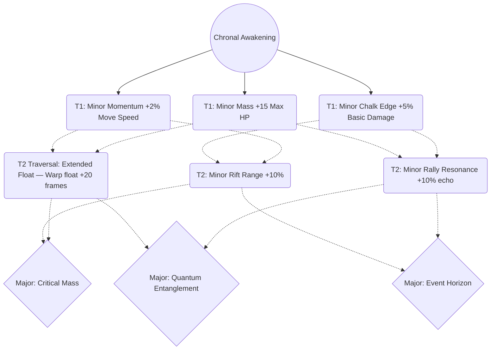
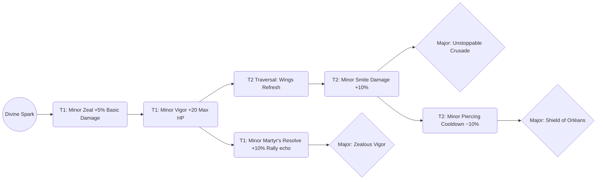
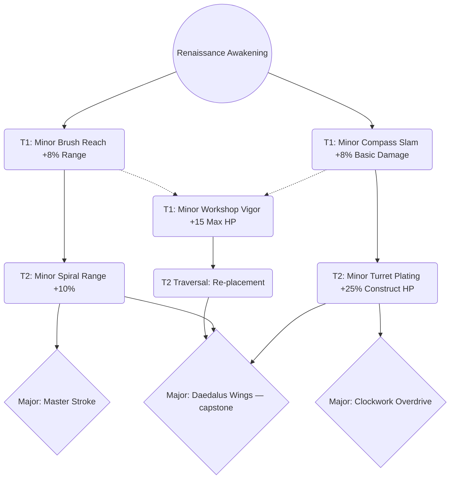
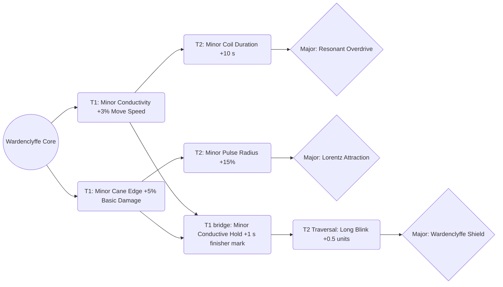
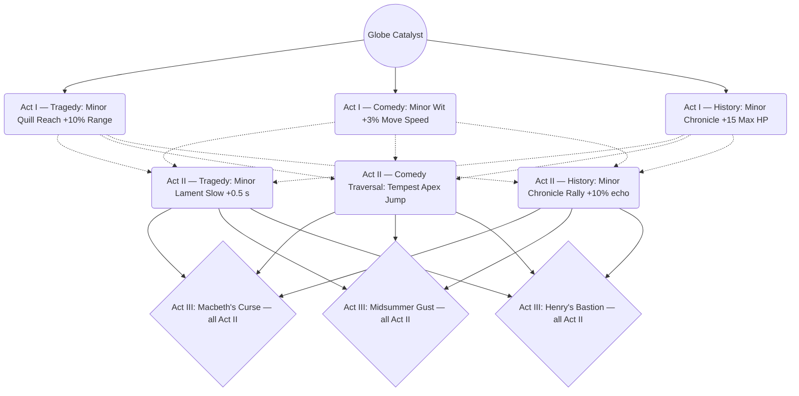
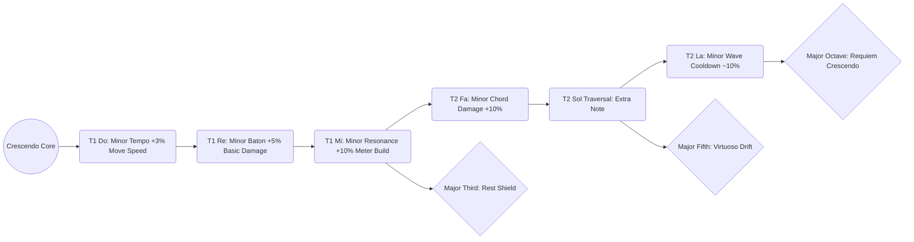
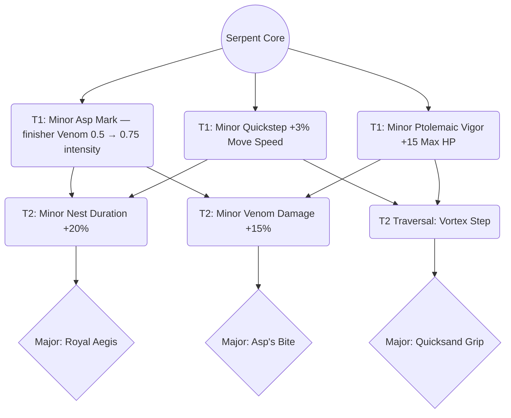
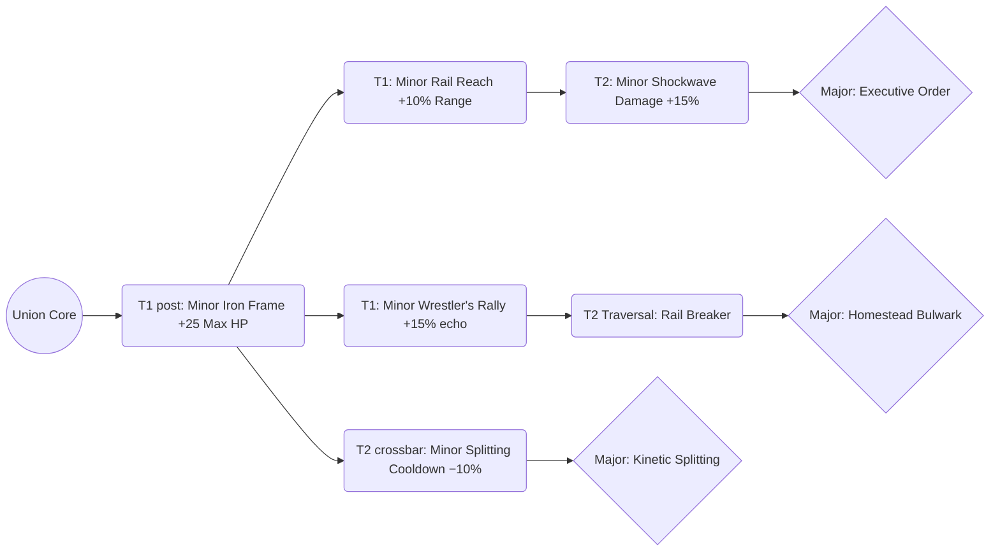
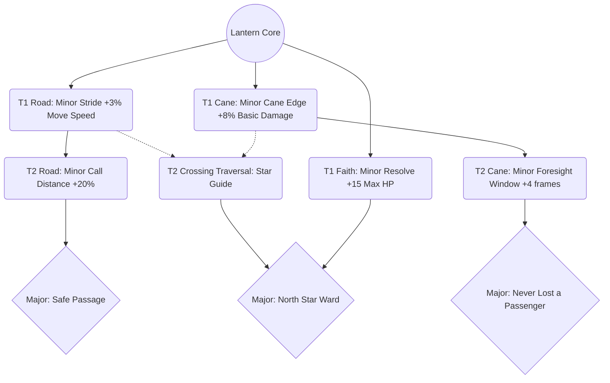
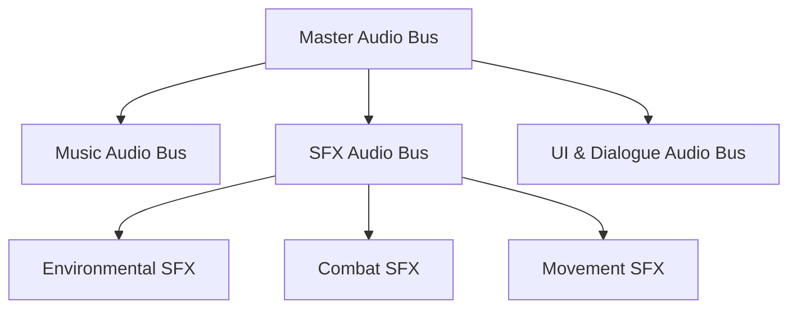

# **Fighters Through Time - Game Design Document V7-Godot**

## Current delivery status — 2026-09-12 (P02)

This is the current overview for the reviewed design. The dated revision and implementation notes below are history, not evidence that the latest rules are built. This workspace contains design documents; no game source, current build or executable test report was available to verify these implementations.

**Status key:** Designed describes accepted behavior, with open details stated. **Unverified** means current implementation or placement has no checked evidence here; it does not mean nothing exists. **Pending** means validation of the current design remains outstanding. **N/A** means the column does not apply. Content placed means the required scenes/assets/configurations exercise the feature across its intended scope. Document consistency checks do not establish a gameplay pass.

| System / scope | Designed | Implemented | Content placed | Validated | Design / pending-check references |
|---|---|---|---|---|---|
| Integrity, recovery and Extractors | Specified | Unverified | Unverified | Pending | [Recovery](docs/CHECKPOINT_RECOVERY.md); [Routes](docs/CAMPAIGN_VALIDATION.md) |
| Time Freeze and rewind behavior | Specified | Unverified | Unverified | Pending | [Temporal rules](docs/TEMPORAL_STATE_CONTRACT.md) |
| Dust economy and reward persistence | Specified | Unverified | Unverified | Pending | [Economy](docs/DUST_ECONOMY.md); [Persistence](docs/STORY_PERSISTENCE.md) |
| Combat, shields, Rally and Defy | Specified; balance open | Unverified | Unverified | Pending | [Defenses](docs/DEFENSIVE_EFFECTS.md); [Combat checks](docs/COMBAT_VALIDATION.md) |
| Fighter rules and CPU behavior | Specified; balance open | Unverified | Unverified | Pending | [Match rules](docs/FIGHTER_MATCH_RULES.md); [CPU policy](docs/CPU_COMBAT_POLICY.md) |
| Open Fighter stages | Defined; geometry checks open | Unverified | Unverified | Pending | [Stage design](docs/fighter.html#stage-specs) |
| Legacy levels and kit puzzles | Retired (S27, 2026-09-28) | Not applicable | Not applicable | Not applicable | [Retired template](docs/LEGACY_LEVELS.md); [15-slot scope](docs/PRODUCTION_SCOPE.md) |
| Narrative, sealing and ending | Specified; scene/localization work pending | Unverified | Unverified | Pending | [Narrative decisions](docs/NARRATIVE_RESOLUTION.md) |
| HUD, effects, audio and controls | Specified; bindings/art pending | Unverified | Unverified | Pending | [HUD](docs/HUD_CONTRACT.md); [Comfort and controls](docs/COMFORT_SETTINGS.md) |
| Calibration Drills | Launch design specified | Unverified | Unverified | Pending | [Drill design](docs/fighter.html#onboarding) |
| Rollback state coverage | Inventory specified; field mapping pending | Unverified | N/A — infrastructure | Pending | [State inventory](docs/ROLLBACK_STATE_CONTRACT.md) |
| Launch multiplayer delivery | Local + Remote Play specified | Unverified | Unverified | Pending | [Delivery checks](docs/MULTIPLAYER_DELIVERY.md) |
| Native online / LAN | Package 7; post-launch | Unverified | Deferred from launch | Pending | [Scope](docs/MULTIPLAYER_DELIVERY.md); [State coverage](docs/ROLLBACK_STATE_CONTRACT.md) |

The main table is the status source; [the docs home page](docs/index.html#current-status) mirrors it. References above are design contracts and pending checks, not implementation evidence. Promote a status only with a pinned build/commit, relevant file/scene or asset identifiers and dated validation results for that scope; retain limitations and partial coverage. See [status maintenance and evidence requirements](docs/PRODUCTION_SCOPE.md#p02--current-status-and-evidence). Native online remains post-launch even if some supporting code is verified. **P04:** the GDD and adopted contracts define intended behavior; verified versioned code/resources describe a build. Track differences and missing evidence in the [design/build ledger](docs/DESIGN_BUILD_DEVIATIONS.md).

## Historical revision and implementation notes

> **V7 revision (2026-08-21).** This revision folds every locked decision from the implementation era into the design document — the 2026-08-10 gameplay-feel batch (`docs/GAMEPLAY_FEEL_2026-08-10_PLAN.md` §2 — not present in this checkout), the package-plan deviation logs, and the 2026-08-15 retunes — and resolves the open design questions catalogued in `docs/DESIGN_ANALYSIS_2026-08-16.md` (not present in this checkout). The four pillar-level decisions made for V7:
>
> 1. **Stage-boundary model (resolves audit H-11):** Fighter Mode is a **platform fighter**. Stage floors are authored as *segments*; designated stages have open pits and true main-floor ledges, so the bottom blast zone is a real end condition. Sides and top remain solid. See Section 10.
> 2. **Block model:** the full designed model is locked — 3 charges, specials cost 2 charges (only authored Shield-Breaker specials shatter — A01, 2026-09-29), ultimates bypass, 1 s daze on shatter, **5 s post-shatter lockout**, **3 s per-charge regen** (settled 2026-08-22 — the earlier 2 s ask is retired; `BasicComboRules.BlockChargeRegenFrames` is the one source), plus new **shieldstun**, and block-cancels-hitstun is restricted to **after hit 2** of the basic string. See Section 4 (Defense Mechanics).
> 3. **Online scope:** the initial release is **local shared-screen + direct-IP LAN** *(superseded in V7.3: LAN is de-scoped to Package 7 — see the V7.3 block and the netcode chapter)*. GGPO-style online rollback is an explicit **post-launch pillar** (Package 7) with its missing design items now specified. Delay-based netcode remains unacceptable whenever online ships. *(M01 clarification: this historical restriction governs delay-based-only native simulation; Steam Remote Play Together's streamed local play is permitted.)*
> 4. **Hitstun agency:** both **directional influence (±15°)** and a **landing tech** are added, together with universal **hitstop**. See Section 4 (Combat Mechanics).
>
> **V7.1 addendum (2026-08-22) — the health-system remix.** Three mechanics remix the standard HP bar around the game's time fantasy, all deterministic and rollback-safe: **Rally** (a portion of each hit taken is temporarily recoverable by striking back), **Desperation Resonance** (that recoverable portion scales with missing HP, mirroring the low-HP knockback curve), and **Defy History** (a full ultimate meter absorbs one lethal hit per match). Specified in Section 4 under "Recoverable Health". A conditional low-health regen ("Second Wind") was considered and **rejected** — it rewarded disengaging at low health, which contradicts the aggression-forward identity; do not reintroduce it.
>
> **V7.1 time-systems pass (2026-08-22).** Six further time-themed systems were adopted: **Echo Step** (a meter-funded 30-frame position rewind usable only in your own recovery frames), **Resonance Momentum** (a connecting basic-string finisher refunds special cooldown), **Overtime** (the final minute of a timed match destabilizes hazards and the Desperation curve), **Timeline Integrity & the Siphon Clock** (a per-level integrity percentage that living Extractors drain, feeding level rewards and the ending — *reworked in V7.6 into the level timer; see the V7.6 block*), **Stasis Anchor** (a manual rewind leaves a frozen copy of the player for puzzles), and the **Chrono-Warden** (a time-casting cultist elite). Considered and **rejected**, recorded so they are not re-pitched: *Chronal Echo* / *Chronal Ghost* input-replay phantoms (an annoyance, and a replayed special or ultimate is overpowered), an *Echo Clone* that replays movement (it wanders, so it cannot hold a plate — Stasis Anchor is its fix), *Phase-Shift Rooms*, *Timeline Fracture* stages, and a *Liberation* finisher mechanic (handled as fiction instead: restoring the timeline revives everyone lost in the fractures). **2026-09-11 supersession:** Manual Rewind, Stasis Anchor/Echo, and the 12 s manual cooldown are retired by the Time Freeze design in Section 4; implementation claims here describe the older version.
>
> **V7.2 survivability & defense pass (2026-08-23).** Five design revisions from the full-design gap audit, all design-only until the next implementation pass: **Restart Level is a true restart** (whole level, all level dust cleared — it is no longer a free checkpoint heal), an **Enemy Attack Classification rule** (mob attacks are Basic-class vs block; only telegraphed Guard-Crush and Unblockable boss/elite attacks threaten more — blocking is never a trap), a **Story Mode healing loop** (Checkpoint Mending, the Restoration Font interactable, placed Chronal Feasts, all difficulty-scaled), a **reworked Manual Rewind** (dedicated input, player-scrubbed depth, and the Stasis Echo — fixing the V7.1 version whose forced 8-second depth made its own tutorial puzzle unsolvable), and **Grabs & Throws** (the third side of the attack/block/grab triangle, previously absent from both the game and this document's rejected/deferred ledger). Deferred from the same audit, on record: the open-stage floor-segment build-out (#1) and the full stage/Resonance-grid/dust-economy redesign (#3) are their own later phase; the design-authority cleanup (single canonical document) rides with the next implementation pass. **2026-09-11 supersession:** Manual Rewind, Stasis Anchor/Echo, and the 12 s manual cooldown are retired by the Time Freeze design in Section 4; implementation claims here describe the older version.
>
> **V7.3 review & correction pass (2026-08-26).** A five-track review (design, doc mirrors, combat implementation, story implementation, infrastructure) produced this revision. It has three parts.
>
> **(1) New rulings, all adopted** (each specified inline in its home section): grabs **whiff against a target in shieldstun** (closing the tick-throw the V7 shieldstun spec would otherwise have created); **Rally reclaim is damage-scaled** (reclaim = reclaiming hit's damage × 2.0, pool persists — the all-or-nothing reclaim is retired); a **defied hit generates no Rally echo**; **landing tech is charge-independent** and works during shatter lockout; **Echo Step and block-cancel are excluded from grab states** including grab whiff recovery; a **hitstop exemption list** (only direct player-authored hits freeze — construct/zone/DoT/hazard ticks never do); **simultaneous-KO rules** (dual lethal trade on final stocks → Sudden Death; a dual lethal trade with both meters full fires **both** Defy History procs; per-hit ordering is damage → Defy → no echo); **timeout compares HP as a percentage of max** and un-reclaimed echo pools do not count; **Sudden Death disables Chronal Orbs** (hazards stay forced on); **throws collect Rally echoes**; **Special-class attacks carry a universal visual signature** and all telegraphs become **dual-channel (class color + class glyph)**; **orb spawn positions and windows come from the seeded match PRNG**; **Manual Rewind gains a 12 s cooldown on all difficulties** (scripted tutorial rewinds exempt; scrub freeze and death-rewind projectile clear unchanged); **Timeline Integrity restoration paths** (+3% per destroyed Extractor, +2% per ordinary secret, 10 s drain-free grace on engagement; the 85% ending threshold is unchanged on every difficulty — *retired in V7.6*); a **free Resonance Grid respec** at the hub Repository; the **exit fee applies on load after an abnormal exit** (session-marker rule — Alt-F4 no longer beats the Exit button — *retired in V7.6: crashes are free*); **mirror matches are allowed** (character-select duplicate prevention removed); default `MatchSettings` are **items Medium / hazards On** *(2026-09-26: the hazard frequency selector was retired for an On/Off toggle)*; **dialogue is hold-to-skippable** for previously-seen sequences on completed-campaign saves. **2026-09-11 supersession:** Manual Rewind, Stasis Anchor/Echo, and the 12 s manual cooldown are retired by the Time Freeze design in Section 4; implementation claims here describe the older version.
>
> **(2) Spec additions:** a **Fighter Mode onboarding layer** (per-character Move List screen, a one-page universal Systems Card, and Holodeck guided drills — originally deferred by V7.3; V7.6/F18 require them at launch with standalone main-menu and retained hub access, implementation pending), Section 7; and a **Package 7 addendum** folding in the items the 2026-08-24 LAN attempt proved missing (match-start barrier, desync abort UI, input redundancy, disconnect detection, fail-closed version/content check, synced pause), Section 4 netcode chapter.
>
> **(3) Considered and rejected, recorded so they are not re-pitched:** a *priced* respec and a *no-respec* ruling (free respec chosen — the tight economy's pressure lives in total dust earned, not in punishing partially-informed picks); *absolute-HP* timeout comparison (heavier fighters would win timeouts on identical play); retaining *all-or-nothing Rally reclaim* and its two softer variants (per-reclaim pool cap, ultimate-damage exemption) — damage-scaled reclaim keeps commitment, not contact, as the currency; an *unbounded Easy manual rewind* (the 12 s cooldown is the bound; Easy keeps zero charge cost); and a *live-world manual scrub* (the scrub keeps its world freeze — the cooldown alone bounds the panic button). **2026-09-11 supersession:** Manual Rewind, Stasis Anchor/Echo, and the 12 s manual cooldown are retired by the Time Freeze design in Section 4; implementation claims here describe the older version.
>
> **V7.4 stun-lock pass (2026-08-28).** Playtesting found both modes losing their exchange rhythm to stun-locks, for two unrelated reasons, fixed by two scoped changes:
>
> 1. **Story Mode — Enemy Stagger Discipline (new PvE-only rules, Section 4):** the anti-infinite machinery was entirely player-sided (DI, tech, and the hit-2 escape are all player verbs; enemies had none), the `EnemyBasicStunFloorFrames` guarantee meant `StunResistance` could never break a basic-attack chain, and enemies exited stun straight into Chase with no protection. V7.4 adds: **armored getup recovery** after every naturally-expiring hitstun (all tiers — damage still lands, flinch does not), a **stagger budget with Armored Recovery** for elites and bosses (sustained stun triggers a flashing, flinch-proof window plus an immediately committed telegraphed answer), **diminishing special-attack stun** on the same target inside a short window (damage full, stun halved — closes the ability-chain), and a **pressure-exit AI rule** (an enemy leaving stun with the player in range prefers an immediate attack over resuming Chase). Constants live in a new Story-side `EnemyStaggerRules` rulebook. **Scope guard:** this is PvE only — Fighter Mode's PvP model is untouched, and the No Juggling pillar's rejection of juggle decay stands for PvP, where the three escape verbs remain the current approach; F09 supersedes any claim that their existence proves all loops escapable.
> 2. **Fighter Mode — the CPU learns its escape verbs (Section 10 CPU matrix):** the earlier pass reported that the CPU controller zeroed every input during hitstun, denying it available escape opportunities. **F09 correction:** fixing those inputs does not prove that every human or CPU pressure loop has a legal escape; charge availability, launches, landing, and control locks still constrain the tools. V7.4 gives the CPU a per-difficulty **hitstun defense policy** (hold Block through hitstun/tumble — one input that buys both the hit-2 escape and the landing tech — and DI during launching hitstop), rolled once per hitstun instance: Easy stays nearly defenseless by contract, Medium and Hard attempt defenses at their specified rates when eligible; those rates are not guaranteed escape rates. **No combat-rules change accompanies this** — adding PvE-style stagger to Fighter Mode was considered and **rejected** (the escape-verb design is retained, with F09 combat validation still pending).
>
> **V7.5 narrative rework pass (2026-08-30).** A full story-direction pass replacing the V6-era antagonist fiction, with terminology renames throughout the document. The new canon (Section 2): the **Meridian** (the future's government) versus the **Unbound** (working name; replaces the "Apex Archive" placeholder) — a sect that went to war over the right to touch the past and is losing; the **Wardens** (replaces the "Chrono-Resistance") are the Meridian's unmoored time-police, and the hub is the **Warden Time-Ship** (their own vessel, cut off — no longer hijacked). An explicit **Time Rule** now governs all fiction (one mutable timeline, slow propagation, unmoored travelers, cracking/sealing moments — sabotage *is* the extraction method, which re-aims Berlin's brief). The inciting incident is the **First Strike**: a blitz extraction of history's heaviest legends in which the Wardens saved only the player's character. **Temporal Resonance is time's immune response** — history arming its legend as the beam cracks their nexus moment; the Unbound's cradles normally smother the ignition, and the Wardens' held beam let the hero's finish — presented through an authored **two-color visual grammar** (cold Unbound light vs. warm gold resonance) established playably in Level 0's rebuilt beat sequence. The captured rest feed the **Anchor Forge** in the **Unbound Bastion**, charging a **Prime Anchor** aimed at rewriting the **Meridian Founding** — all concealed from the player until Act III behind a hard knowledge boundary, with a **Mystery Thread** of missing legends running through Acts I–II (Section 16) and the where/why reveals split between Levels 12 and 14. **No mid-campaign power loss:** the retired "resonance fades as history heals" dialogue is replaced — the hero's power grows all game and releases exactly once, at the end, together with every captive legend. New **Legacy Unlock Schedule** (Section 3): basics/block/Rally/Rewind/meter+Defy from Level 0; Movement, Special 1, Special 2, and the Ultimate cast unlock after Levels 1–4. Renames: Level 14 **The Unbound Bastion** (was Neo-Earth), Level 15 **The Meridian Founding** (was Library of Alexandria Restoration), bosses **The Forge Sentinel** (was The Archive Prime) and **The First Unbound** (was The Apex Eraser; its P3 becomes the **Borrowed Legacies** — channeling the captive roster's signature moves, data-driven from the roster minus the active character). Legacy scene IDs are retained in code. Standing mandate: the roster will grow — narrative and spec text must never hardcode roster size or enumerate the cast in load-bearing ways.
>
> **V7.6 Timeline Integrity timer rework (2026-09-11).** Resolves finding 1.1 of `DESIGN_ANALYSIS_2026-09-08.md` — the Fractured tier was unreachable (a hard 10% siphon share × at most 3 Extractors floored every level at exactly 70%, the Stabilized line) — and the deeper flaw found while checking it: an Extractor drained only once its off-path room was entered, so a player who skipped every Extractor finished every level at 100% Restored and earned the good ending, while the only way to lose Integrity was to engage and fail. **Timeline Integrity is now the level timer** (Section 3): a gauge that drains in real time from level load, **faster for every living Extractor**; destroying Extractors and finding the secret **slow** it, and nothing ever adds time back; the clock pauses whenever the world is frozen *(superseded: see Section 3 "When the clock pauses" — Time Freeze and the Post-Landing Hold drain)*, rewinds never refund it, and it **freezes at the pre-boss checkpoint** so boss fights are never timed. Below 20% the level enters a **Collapse Tremor** — screen tremor, falling debris, flagged platforms crumbling, and a spreading chronal-crack glow — foreshadowing the collapse. If it empties, the level ends in **Timeline Collapse on every difficulty**. The level-end tier is the gauge remaining at the boss gate (Restored ≥ 50% / Stabilized ≥ 20% / Fractured < 20%), and the good ending requires a ≥ 50% campaign average. HUD: an **era clock face** (the hourglass stays the Rewind Counter's). **Retired:** the per-Extractor siphon share and its grace window, the V7.3 restoration paths (+3% / +2% / +5%), Hard's doubled drain rate (difficulty now scales the time budget), and the 85% ending threshold. **Considered and rejected, recorded so they are not re-pitched:** raising the share to 15% (makes Fractured reachable only for players who engage and fail — skipping still scored 100%); a per-level siphon budget charging each standing Extractor its share at level end (fixes the scoring but is not a timer); Extractors or secrets *adding* time (a detour would bank time — they slow the clock instead); a no-fail timer on Easy (Easy fails at zero too; its protection is the most generous budget). **Design-only until the next implementation pass** — the shipped V7.1/V7.3 Integrity code (siphon shares, restoration paths) is superseded.
>
> **V7.6 Resonance Grid redesign (2026-09-11).** Resolves findings 1.2 and 1.3 of the same analysis: the nine Section 5 grids still carried the dead V6 stats (`Armor`, `Block Health`, `Block Recovery`, `Dash Speed`, `Combo Speed`, `Stun Duration`) that Section 3 had already banned, none contained its authored traversal node, and Lincoln's Kinetic Splitting major granted nothing. All nine grids are re-authored with **a unique topology per character** (mesh, spine, gears, circuit, three acts, scale, delta, fence, crossing currents — Section 3 lists them, Section 5 specifies them) while keeping **9 nodes and the 975-dust economy** unchanged. Supporting rules: every root-adjacent node modifies a Level 0 system (so the Legacy Unlock Schedule never presents an empty grid), gated nodes keep a dormant silhouette, `prerequisiteMode` Any-of and ability-scoped stat keys are added to `ResonanceNodeData`, minors never touch stun/rewind charges/the Integrity drain rate, and the nine traversal nodes are Tier 2 nodes. Kit-level fixes riding along: Joan's Zealous Vigor is re-based on Rally reclaim (the flat heal contradicted V7.1), Shakespeare's traversal verb moves from a non-existent "barrier" to The Tempest's apex, jump-height minors are retired (weight and air control are the identity axes), and three Majors gain Extractor damage as the grids' only, indirect, tie to the V7.6 timer. **Design-only until the next implementation pass.**
>
> **V7.6 two-slot status schema fix (2026-09-11).** Resolves finding 1.4: the two-slot status rule (applied 2026-08-22) had never reached the data schemas — `PlayerController`, `PlayerSnapshot`, and `IStatusEffectTarget` all still declared a single status, and the snapshot dropped `Intensity` entirely, so the rollback snapshot as written could not restore a bitten-then-slowed target. All three now carry a `StatusSlots` struct (`Damage` / `Control`), the snapshot serializes six fields on the mandated Klotho component (ID 310+), the enemy runtime table gains the same field, and the enum's slot mapping is a routing table rather than prose. **Same-slot overwrite is now stronger-wins:** a same-type application replaces the occupant only if `Intensity × Duration` is equal or greater, and a weaker one does nothing — neither replaces nor refreshes. *Considered and rejected:* "refresh to the longer duration" (a cheap mark could keep a heavy poison rolling forever). `Suppression` is reserved in the enum as a control status for the Eraser line (finding 1.6).
>
> **V7.6 Level 0 agency beats (2026-09-11).** Resolves finding 1.5: the V7 landing-tech spec promised a scripted tech prompt "when the tutorial pass next revisits Level 0", V7.5 was that revisit, and it added none — Story players were never taught teching, DI, or grabs (Fighter players get them from the Systems Card). Level 0's Part 2 gains two beats between Block and Meter: a **Grab Calibration** (the dummy blocks; the player must grab and throw it — the triangle stated in both directions) and a **Hitstun Agency Calibration** (one scripted launch with a DI prompt during its hitstop and a mandatory landing tech that repeats until it lands, free of HP, Rally, and rewind cost).
>
> **V7.6 Eraser elite line (2026-09-11).** Resolves finding 1.6: the Erasers were fiction only. The **Eraser** is a Story-only Future Cultist elite (Section 6) — a scripted debut ambush in the Level 4A Legacy Level, a second at Level 13, salted through Levels 7–15 — with the roster's only anti-resonance kit: **Null Lance** applies the new **`Suppression`** control status (2 s: Special 1/2, Movement, and Ultimate cast locked, cooldowns still ticking, the gold aura smothered grey; basics, block, grab, Rally, DI, tech, Defy, and rewinds untouched; Basic-class vs block), and **Siphon Snare** tethers and drains 10 meter points/s for up to 3 s (F14: explicit Story-only exception, at most 30 points; blockable attachment and breakable channel). `Suppression` joins `StatusType`; Fighter Mode has no Suppression source and may not gain one without a separate ruling.
>
> **V7.6 HUD spec alignment (2026-09-11).** Resolves finding 1.7: the Story HUD hierarchy now carries the **Integrity clock** (with siphon streams), the **separate Time Freeze indicator** (2026-09-11 replacement), the **Rally echo band** (both modes), **two status-slot indicators** (both modes), and **ability slot lock states** (Dormant / Suppressed / Clear — locked slots shown, never hidden). The dust counter is **persistent** (the Integrity clock anchors beside it; the V7 fade is retired in favour of a `+N` pickup float).
>
> **V7.6 doc-alignment sweep (2026-09-11).** Resolves findings 1.8–1.11 and 1.13: Section 1's stage examples now cite authored stages; the Unified Difficulty Scaling Table gains its two missing rows; the six historical-figure level cards carry an authored **Absence** line each (the "Historical Event" row describes what history *should* be doing); the player reaches the **Meridian Founding by riding the Forge's own firing channel** (the channel exists only while it fires — hence the fight happens during the firing); the Story Move List badges not-yet-unlocked abilities as Dormant; the narrative layer's line count scales with the roster; and same-frame chord priority is ruled once for Echo Step and grab — *the chord beats the single input, and the priced verb beats the free one.*
>
> **V7.6 Act III clock — the Resonance Hold (2026-09-11).** Resolves finding 1.12. Levels 13–15 keep the Timeline Integrity clock but it measures **the hero's own resonance** against the Unbound's field. **The candle rule:** resonance is binary, held in trust — the hero has the full kit at 1% as at 100%; the gauge is how long the field needs to *smother* the flame. Zero is Timeline Collapse. Conduits (L13), cradle intake valves (L14), and the firing channel's anchor pylons (L15) stand in for Extractors; L14's reveal recontextualizes the clock as the Forge's intake in one line. *Considered and rejected:* a Forge-charge clock that fills toward firing (the Forge is not named until L14), and an Eraser hunt countdown (no fail state).
>
> **V7.6 the Act III Gauntlet (2026-09-11).** Levels 13–15 now play **back to back with no return to the Time-Ship** — the Wardens can hear the hero but cannot reach them. Transitions are in-level; rewinds and checkpoints are unchanged (hero-side); Hard's middle checkpoint is active in Act III. A **Warden Beacon** opens the Repository at any activated Act III checkpoint for upgrades and free respec using **previously deposited dust only** (data crosses the field, matter doesn't); active-level earnings are secured only by level-completion auto-deposit (F02 resolution). Timeline Collapse becomes the **Anchor Snap** — respawn at the last checkpoint in place, same 20% fee, spending one of **Easy 3 / Normal 2 / Hard 1 anchor charges** per level — and a collapse with no charge left is **Smothered**, the game's only Game Over (Restart Level or Quit; deposited dust always safe). Quitting is allowed; an active Act III attempt resumes at its checkpoint, while Smothered reloads Game Over, never the hub (F10). *Considered and rejected:* a fee-only Snap with unlimited retries (the dust fee alone has uneven bite in Act III; F05 preserves incomplete required-route builds — a death has to cost something the finale can feel).
>
> **V7.6 Part 2 rulings (2026-09-11).** The design-analysis challenges, decided: **(2.A)** the game is not a level-replay game — **Chronal Rating is retired** (`ChronalRatingRules` → `IntegrityTierRules`), Level Select and a records board are not built, and the roster's replay answer is the **per-character Level 4A Legacy Level** (the hero's nexus revisited with the full kit, kit-keyed puzzles, the Eraser debut, a per-character boss; one per roster character, scoped short). **(2.B)** the V7.3 **abnormal-exit fee is retired** — crashes are free; the Alt-F4 loophole is accepted at its 20%-of-one-level ceiling. **(2.C)** **every dialogue sequence and cutscene is hold-to-skippable**; first viewings (never seen on any slot — `GlobalSaveData.seenDialogueIDs`) ask one confirm. **(2.D)** the three **Open stages ship before any further Fighter tuning**; numbers set before pits exist are provisional. **(2.E)** L1–L4 boss HP cut (350 / 520 / 700 / 850) for the shrinking kit, and the dust rebalance gains kit-scaling and the Legacy Level as inputs. **(2.F)** Holodeck drills are **launch scope**; Steam Remote Play Together is the launch netplay message and **Package 7 is the first post-launch beat**; a **stall-validation gate** precedes any Fighter tuning lock. **(2.G)** AI-generated assets are **placeholders replaced by artist content before release** — the Steam disclosure applies only to any generated asset that survives to the release candidate. *(The flash-reduction / photosensitivity setting remains an open Part 4 item.)*
>
> **Story review — intro pass (2026-09-27; [STORY_REVIEW_2026-09-27.md](STORY_REVIEW_2026-09-27.md), S01–S14).** User-selected resolutions for Level 0 and the First Strike: Sarah's withheld knowledge of the other beams, confessed at Level 12 (S01); a scripted hold fight in Part 1 and an optional Full Calibration with a skip path (S02); origin-consistent hero bios (S03) and the Nexus Moments table (S04/S05); the hero learning they cannot go home until every fracture is sealed (S06), a per-hero acceptance line (S07), optional calibration flavour lines (S08), Okafor and Wren met in Level 0 (S09), the Eraser watcher (S10), Florence triage via Sarah's line and a portal readout (S11), the in-world name "the Linked" (S12) and no "Meridian" in Level 0 (S13). **S14 renames the antagonist faction from the working name "the Unbound" to the final name "the Severed"** throughout the current design; the notes above keep the old name as history.
>
> **Story review — Act I pass (2026-09-28; S17–S28).** User-selected resolutions: the Florence card names the Borgia Inquisitor (S17); the Titanic stays and faces its cost in dialogue (S18); Captain Smith is taken on screen and found in the Extraction Hall (S19); Level 1 dialogue fixes (S20); Act I is renamed "Unmoored" (S21); prose "cult" wording becomes "the Severed" (S22); the Act I script is written (S23); Desmoulins is missing from Paris (S26); **the per-character Legacy Level (4A) is retired** (S27: the Eraser debut and 4A's dust move to Level 5, the ending counts 14 levels against 700 points, and production drops to 15 slots); the Borgia link is used (S28); and the Level 4 boss becomes the Governor's Guard.
>
> **Story review — Act II pass (2026-09-29; S29–S38, plus S16).** User-selected resolutions: the Level 8 hero now fears the legends were taken (S29); Gettysburg is the July battle, and Lincoln's nexus becomes the Emancipation Proclamation, 1 January 1863 (S30); Nassau is the pirate republic at its height (S31); **Berlin is removed and replaced by Hakata Bay, 1281**, with the Thunderbomb General, a new roster and the Hakata Seawall Fighter stage (S32); **the Severed have no stake in historical outcomes** — the "Cracking a moment" rule is retired, every level card becomes "Severed Extraction", and the Linked and Severed forces only protect the siphons (S33); the Globe is dated c. 1601 (S34); the Act II script and the Act I→II boundary scene are written, resolving S16 (S35); an Eraser near-capture happens at Hakata Bay (S36); Pliny the Elder is missing from Pompeii (S37); and Act II is renamed "Hunted" (S38).
>
> **Story review — Act III pass (2026-09-29; S39–S49).** User-selected resolutions: **the ending closes on the Time-Ship** — after the release at the Founding, the Wardens (able to reach whole time again) pull the mortal hero aboard and send them home; a completed save loads "the last evening aboard" (S39); Sarah's send-off says "You'll wake in your own time" (S40); the Extraction Hall line loses Joan's oath (S41); the Beacon is handed over on the Bridge (S42); an after-credits **Homecoming** shows the Wardens docking in their own century (S43); Desmoulins, Pliny and Captain Smith return on screen (S44); the Mirror Paradox is the Void's reflection (S45); **the First Severed is Commander Vale** (working name), Sarah's former commanding officer (S46); the Act III script is written (S47); per-hero farewells replace the shared final line (S48); and Act III is renamed "Homecoming" (S49).

**P04 authority — 2026-09-13:** the **GDD defines intended behavior**, together with its explicitly adopted decision contracts. **Verified versioned code/resources describe the current build**; they do not override approved design changes. A mismatch is recorded with evidence, an owner when known and acceptance criteria in the [design/build deviation ledger](docs/DESIGN_BUILD_DEVIATIONS.md). Keep unknown implementation unverified. Amend intended behavior only through an explicit design decision; do not silently rewrite it to match stale resources.
>
> **Historical implementation report (2026-08-26, post-V7.3 pass; not current status).** The V7.1 verb layer (hitstop, DI, landing tech, Rally/Desperation/Defy, Echo Step, Resonance Momentum, Overtime, Sudden Death, per-character string profiles with front-only escalating hitboxes), the V7.2 batch (true Restart Level, enemy attack classification vs block, the Story healing loop, the scrubbed Manual Rewind + Stasis Echo, Grabs & Throws in both modes), Timeline Integrity/secrets/Chronal Rating, the boss intro ritual, the Chrono-Warden, the 90%–140% UI scale, and the Holodeck in-hub console are implemented and test-gated. **The V7.3 review found and the V7.3 implementation pass closed (full suite green, 1,622 tests):** the V7 block model (5 s lockout, shieldstun, hit-2 cancel gate, 0-charge ignore, plus the new grab-whiff-vs-shieldstun amendment), the broken grab triangle (a grabbing player kept a functioning shield), a stale pending-launch replay bug, the damage-scaled Rally reclaim, ledge trump + the regrab cap, the environmental-damage chokepoint (venom and hazards can no longer bypass Defy History or Rally accounting; the Story landing tech, which had never actually fired, now works and matches the sim's locked window), the per-extractor Siphon share cap + the new restoration paths, once-per-attempt Checkpoint Mending, strike-to-activate checkpoints, the dust-duplication and Alt-F4 loopholes, mid-level-resume attempt persistence, the free respec, the Stasis Echo's physical plate/beam interactions, the Single Icon dust pickups for bosses/extractors, the 12 s manual-rewind cooldown, the Move List + Systems Card onboarding screens, dialogue hold-to-skip, dual-channel telegraphs, the Chrono-Warden's persistent Dilation Field + reactive Phase Skip, and the full UI-scale reach (theme type variations). **De-scoped by V7.3:** the 2026-08-24 claim that direct-IP LAN was "implemented and test-gated" was wrong — the network manager was never wired into production and the session lacked a start barrier, so the feature was unreachable; **LAN is de-scoped to Package 7** and its menu route is removed. Known deliberate exceptions, each flagged inline where it applies: the extractor dust drop stays 15 and the Integrity tier dust bonus is authored-but-unapplied (both awaiting the deferred dust-economy rebalance); the Mirror Paradox's scripted dust award remains wallet-direct (its bespoke encounter scripting predates the pickup helper); the Chrono-Warden uses placeholder guard-elite art and awaits its Level 6+ placements; Restoration Font / Chronal Feast / Secret Cache nodes exist but need per-level scene placements; the open-stage floor-segment build-out remains deferred, so blast-zone falls are unreachable on the authored stages until that phase lands; Holodeck guided drills were spec-only in this historical implementation report; V7.6/F18 put them in launch scope with standalone main-menu and retained hub access (see Fighter Onboarding), implementation pending. **2026-09-11 supersession:** Manual Rewind, Stasis Anchor/Echo, and the 12 s manual cooldown are retired by the Time Freeze design in Section 4; implementation claims here describe the older version. **F05 supersession (2026-09-12):** economy budgets, bonus accounting, and physical boss rewards are now specified in `docs/DUST_ECONOMY.md`; the shipped values and wallet-direct exceptions described above are historical implementation gaps, not current design exceptions.

## **1. Game Overview & Core Philosophy**
*   **Core Hook:** Play as iconic historical figures wielding exaggerated, context-specific abilities (e.g., Albert Einstein bending spacetime and gravity; Joan of Arc leading radiant spectral charges).
*   **Genre Blend:** 2D Action-Adventure (Story) meets Platform Fighter (Versus).
*   **Design Pillar:** Abilities must feel cohesive across both modes. A move used to solve a puzzle or clear minions in Story Mode should translate naturally to stock-taking knockouts or damage-building in Fighting Mode.

### **Health System**
*   **Decision:** Standard Health Bar (HP) system over the Super Smash Bros. percentage-based knockback system.
*   **Rationale:** Percentage-based knockback works well in a constrained arena with blast zones, but in an Action-Adventure mode, players fight mobs and bosses in sprawling levels—trying to "ring-out" a mob down a hallway doesn't work. Standard HP bars allow traditional boss fights and mob encounters for Story Mode, while still enabling thrilling HP-depleting combat in Fighter Mode (0 HP = knockout; falling off the bottom of the stage = deduction of one stock life).
*   **Knockback still scales with damage taken (V7, shipped 2026-08-10):** although there is no accumulating percent, every hit's knockback is multiplied by `(1 + missingHPFraction)` of the victim *after* the hit's damage — linear from 1.0× at full HP to 2.0× at zero. Low fighters fly farther, so edge-guarding and pit threat grow across a stock exactly as the platform-fighter genre expects, without abandoning HP.
*   **The health bar is temporal (V7.1):** three companion mechanics complete the remix — **Rally** (part of every hit taken becomes a briefly recoverable "echo", reclaimed by landing a hit), **Desperation Resonance** (the recoverable fraction grows with missing HP on the same linear curve as the knockback scale — the lower your bar, the higher the stakes in *both* directions: you fly farther, and you can claw back more), and **Defy History** (a full ultimate meter shatters instead of you on one lethal hit per match). All three are deterministic, condition-based, and aggression-forward: the only way back is *through* your opponent, never away from them. Full specification in Section 4.

### **Core Modes**

#### **Adventure / Story Mode**
*   **Focus:** Narrative, platforming, and PvE (Player vs. Environment) combat.
*   **Structure:** Linear levels themed around specific historical eras, each tied to a playable character's timeline.
*   **Gameplay Loop:** Platforming challenges, mob encounters, environmental puzzles, and culminating boss fights against Severed forces.
*   **Progression:** All 9 characters are unlocked from the start for the initial build. Story Mode progression (Temporal Resonance Grid) is strictly isolated from Fighter Mode to preserve competitive balance. Ability upgrades apply only to Story Mode (there are no alternate costumes or cosmetic items).

#### **Versus / Fighting Mode**
*   **Inspiration:** Platform fighter in the style of Super Smash Bros., with HP bars instead of percent.
*   **Win Condition:** Players deplete their opponent's HP to 0 for a knockout. Falling through the **bottom blast zone** costs one stock life. Players have a set number of stock lives per match. The sides and top of the screen are bounded by solid physical boundaries.
*   **Stage-Boundary Model (V7 pillar decision, resolves audit H-11; *build-out deferred — see note*):** stage floors are authored as **segments**, not a single sealed slab. Designated stages carry **open pits and true ledges at main-floor edges** (Paris's central lower pit, Pompeii's collapsed caldera shelf, Nassau's listing open deck end), making the bottom blast zone a real, reachable end condition; the remaining stages stay sealed as deliberate "arena" layouts. Far side walls and the ceiling are solid on every stage. This is what makes the ledge-grab system, recovery-flavored Special 2s, the respawn platform, and edge-guarding load-bearing rather than vestigial. ***Deferral flag (V7.3):** the floor-segment build-out is the deferred phase recorded in the V7.2 preamble — no shipped stage yet authors segments, so today the bottom blast zone is unreachable on all authored stages and this pillar is design-of-record, not shipped behavior.*
*   **Stage Design:** Dynamic, multi-tiered platforms based on historical events (e.g., the listing deck of the Nassau Flagship, the Vesuvius Caldera's cracking floor, the Globe Theatre stage — the ten authored Fighter stages are in Section 10). *(V7.6: the V6 Titanic/Apollo examples cited stages that were never authored.)*
*   **Local Multiplayer (initial release; V7.3):** Fighter Mode supports **1v1 matches only** for initial release: **local shared-screen**. Direct-IP LAN rides with Package 7 (see the netcode chapter for the V7.3 de-scope rationale).
*   **Online Multiplayer (post-launch pillar — V7 rescope):** GGPO-style rollback online is a committed **post-launch** milestone (Package 7), not an initial-release feature. The deterministic fixed-point simulation, snapshots, prediction, and bounded rollback that online requires are built and gated now, so the launch build banks the hard part; the remaining online-specific design (handshake/rules negotiation, input-delay setting, input redundancy, full-state resync, transport selection — Steam Networking Sockets vs. custom relay — and matchmaking UI) is specified in Section 4's netcode chapter and must be funded as its own milestone. **Delay-based-only netcode remains unacceptable for native online simulation.** M01 explicitly permits Steam Remote Play Together's host-streamed local play at launch; it is a separate delivery model. 4-Player Free-For-All and 2v2 Team Mode remain a later expansion phase beyond that and must not be implemented during initial development.


---

## **2. Narrative & Worldbuilding**

### **The Future & The War Over Time (V7.5)**
Centuries from now, humanity is prosperous, free — and divided by one discovery: history is not inert. Pivotal moments — a printing press, a siege lifted, a wall raised, a footprint on the moon — hold **temporal resonance**: the accumulated weight of everything that followed from them and everyone who remembers them. Resonance can be reached, and it can be drawn off. The discovery split the future in two. The **Meridian**, the governing order of the future, ruled that the past is a commons: no one may alter it, and no one may draw from it. A faction rejecting that law — holding that a people who refuse to *use* time are choosing to be ruled by it — seceded, stole the unmooring method, and went to war. That faction is **the Severed**. They are losing the war. This is why they turned to the past.

### **The Time Rule: One Timeline, Unmoored Travelers (V7.5)**
The setting runs on a single, explicit model — every narrative beat and mechanic obeys it:
*   **One mutable timeline.** There are no branches. Damage to an era ripples forward — but slowly, which is what the Timeline Integrity clock depicts in play: the era being drained *while you stand in it*.
*   **Unmooring.** To touch time you must stand outside it. An **unmoored** person is severed from any single moment: they keep their memories when history changes, do not blink out when their own past is altered, and cannot go home until the timeline takes them back. The Meridian unmoors its Wardens by law and oath; the Severed unmoored themselves, and that theft started the war. Unmoored is exile, not freedom.
*   **The fracture — what the ship can reach (S15, story review 2026-09-27).** The First Strike broke time, and it broke away from the Wardens. The Time-Ship is cut off from all of time: the future, their own century and every undamaged era are simply gone from its reach, as though the rest of history no longer exists. All that remains to it are the **fractured instances** — eras torn open by the Severed's ongoing attack, drifting in the space between timelines as shards. Only a shard under attack is open wide enough for a portal, which is why the ship can still travel into the past. Sealing an era mends it back into the timeline, and it passes out of the ship's reach for good. That is the fiction behind no level replay. When the last fracture is sealed, time is whole again: the ship can reach every moment, and the Wardens can finally send the unmoored home (the ending, S39). **Faint shards (S15a):** every era a beam struck is fractured too, but a clean extraction leaves only a hairline crack — a faint shard the ship can see and read but not enter. Siphon assaults tear eras wide enough for a portal. This is how the Wardens know a legend is missing from an era the campaign never visits.
*   **Where the energy is (S33, story review 2026-09-29; replaces the V7.5 "Cracking a moment" rule).** A pivotal moment holds the most temporal energy — the weight of everything that followed from it and everyone who remembers it. The Severed plant siphons where that energy is densest and drain it. They have **no stake in how any event turns out**: they do not try to change, reverse or prevent history, and the eras they strike are simply the richest points in time. The Linked and the Severed's own forces in each level are there only to protect the extraction. (Retired: the former rule that a moment must be "un-decided" through sabotage — helping the English win Orléans, burning Florence's presses — to be drained.)
*   **Sealing.** **N01 Option B:** defeating the local Overseer enables a marked sealing anchor. The player uses Interact to re-seat it, close local rifts, shut down remaining siphons without destruction loot, and mend the drained moment. Shutting down the era's siphons breaks the neural link, which is what frees that era's brainwashed locals (M12, 2026-09-26). Optional Extractors remain optional; the locked final Integrity and earned rewards do not improve from sealing. See [narrative resolution](docs/NARRATIVE_RESOLUTION.md). **N02 Option A: sealed moments stay sealed.** The repaired historical event/outcome remains permanent; another unresolved wound in the same era is a distinct mission. Level 0 rescues the hero without sealing their nexus; that wound heals only in the ending's total release (S27). N01 closes only the current mission's linked rifts/siphons. See [sealing scope](docs/NARRATIVE_RESOLUTION.md#n02--sealed-moments-stay-sealed).

### **The Antagonists: The Severed**
A technocratic sect of the far future, obsessed with the use and mastery of time, at war with the Meridian and losing. Their field doctrine as the Wardens understand it: attack the past to remake time in their favor — drain history's pivotal moments and bleed the timeline until the future that defeated them never happens. Their forces are unmoored operatives from the future, brainwashed local thralls, Overseer commanders, and the elite **Erasers** — hunters armed with weapons built to nullify historical powers, whose fixation on the player's character goes unexplained until Act III. **The First Severed (S46, story review 2026-09-29):** once a Warden — **Commander Vale** (working name), Sarah's commanding officer — who stole the unmooring method from the Wardens and led the secession that started the war. Sarah does not know Vale leads the Severed; the voice is recognized only at Level 15. This is design-of-record under the same knowledge boundary: no line before Level 15 states it.

### **The Inciting Incident: The First Strike**
The war's turn was a single coordinated blitz aimed at the deep past. The Severed fired their extraction beams not at *places* but at **people** — history's heaviest legends, the playable roster among them — because a legend is the densest anchor there is, and lifting one out of history takes the whole era's weight with it. An extraction beam works by **cracking the target's nexus moment open** — a localized temporal overload, the sky tearing, the era destabilizing. And cracking a moment provokes something the Severed engineered their process to outrun: **time fights back** (see Temporal Resonance below). Their answer is speed and the cage — extract fast, cradle the legend before history's response can catch. In the same hour, siphon teams poured through the freshly torn **Chronal Rifts** onto every targeted era. The Wardens — on station because preventing exactly this is their oath — reached exactly **one** strike in time: the player's. They could not stop the beam; they could *hold* it — a few seconds — and those seconds were enough for the hero's ignition to finish. A fully lit legend is more than any beam can carry: the extraction broke, and the Wardens caught the hero as it snapped. Every other legend was taken clean. The blitz left the timeline fractured across every targeted era, and the Wardens' own Time-Ship was cut off from the future — from all of time outside the fractured eras (S15) — in the same instant. One ship, one crew, one rescued legend. **(S01 — Sarah's secret, story review 2026-09-27):** Commander Sarah saw the other beams that hour, saw that the columns carried people, and could reach none of them. She believes those legends are lost and keeps what she saw from the hero — and from her own crew — until Level 12. It is the only thing she conceals; every other read she gives is honest, and she knows nothing of the Severed's true plan.

### **Temporal Resonance: Why the Hero Has Powers**
**Time acts as a self-correcting force.** When a nexus moment is cracked open and its legend is being stolen, history reaches for the only anchor it has left — the legend themselves — and *arms* them: the collective human memory of everything the figure did and means pours out of the wounded era and into its defender. This is **Temporal Resonance** (Einstein bends spacetime and gravity; Joan of Arc manifests radiant light and spectral banners of war). It is intended by nobody — not the Severed's tool (their process exists to smother it: a cradled legend never finishes igniting) and not the Wardens' doing (their held beam only bought the seconds the response needed to bloom). The power is history's own, held in trust — and it **grows** across the campaign: every scrap of resonance the hero reclaims from the Severed (Chronal Dust, shattered Extractors, sealed moments) feeds them. There is **no mid-campaign power loss**; the hero surrenders the charge exactly once, by choice, at the very end (see The Campaign Goal). The Erasers' power-nullifying weapons are anti-immune-response instruments: strip the charge, and the hero can finally be cradled.

### **The Visual Grammar of Resonance (V7.5 — authored visual language, all modes and mirrors)**
The origin story is *shown, then named* — carried by a two-color grammar established playably in Level 0 and repeated by every system that touches resonance:
*   **Cold synthetic light = the Severed.** Extraction beams, siphons, neural visors, plasma — jagged, desaturating: what their machines touch drains grey.
*   **Warm gold = history's resonance.** The hero's ignition and persistent aura, Chronal Dust pickups, restoration vignettes, the ending's release. Gold always flows *from* the era *into* its people, and home again at the end.
*   **Two kinds of door:** Severed rifts are jagged cold tears; Warden portals are clean, steady geometry. Established side-by-side in Level 0's final beat.
*   **Recurrence contract:** every Chronal Extractor is Level 0 in miniature (cold machine pulling gold out of an era); Chronal Dust collection restates the origin with every pickup; level-seal vignettes recolor the era warm; Level 14's Extraction Hall shows thin gold threads drawn off cold from each cradle — the *smothered* version of the player's own ignition, recognizable without a line of dialogue.

### **The Villain's True Plan — concealed from the player until Act III (V7.5)**
This subsection is design-of-record for the whole document, but **no dialogue line, level brief, or UI string may state any of it before Level 13** — through Act II the game presents only the Wardens' honest, mistaken read (the draining *is* the plan). (Sarah's one concealment — S01, what she saw of the other beams — is not a plan fact; she does not know the plan either.) The truth:
*   The captured legends have been wired into **Extraction Cradles** inside the **Severed Bastion**, a fortress in the space between timelines, feeding the **Anchor Forge** since the first minute of the game. Behind the featured cradles — the playable roster — rows of lesser figures recede into the dark: later takings, patching a hole that never fills. (S19: the player watches one such taking happen — Captain Smith at Level 5 — and finds him here.)
*   Fed enough resonance, the Forge fires a **Prime Anchor** — a moment heavier than every natural anchor combined — at the founding of the Meridian, rewriting it so the Severed won and the war never happened, and letting them re-moor into a timeline shaped in their image ("the Landing").
*   The plan was calibrated for the **full** harvest of legends. The Wardens saved one. The entire era-siphoning campaign of Acts I–II exists to cover the deficit of the one who got away — and the Erasers hunt the hero because recapturing the escaped legend is cheaper than draining ten eras. Every era the Severed burn, they burn because the hero escaped.
*   Cracked eras also *soften* the timeline: a Prime Anchor seats poorly into intact history, so every fracture left unsealed lowers the timeline's resistance to the rewrite. Fuel and demolition prep in one act — and since the fractures are also the Severed's roads, every era the player seals cuts their mobility too.
*   The drained energy was never spent in the field. It was **banked**. The Act III reveal recontextualizes without invalidating: every seal the player earned was real, kept the deficit open, and starved the Forge.

### **The Hub World: The Warden Time-Ship**
The **Wardens** are the Meridian's sworn service for policing the past — unmoored by law and by oath, which is why they were on station when the First Strike came, and why they survived it. Their Time-Ship — a sleek, advanced vessel — was cut off from the future by the fracture — from all of time except the fractured eras under attack (S15) — and now drifts in the space between timelines: one ship, one crew, no reinforcements. Led by **Commander Sarah**, the crew rescued the player's legend mid-extraction and now runs the whole counter-campaign from this deck. The Time-Ship serves as the central hub and the space between levels, staffed by Warden commanders, engineers, medics, and crew. From here, the player steps through time portals to travel to corrupted historical eras to halt the Severed's operations. This setting provides a strong visual contrast: sleek Warden technology clashing with the rustic environments of the Renaissance or Ancient Rome. No other playable roster characters appear on the Time-Ship, and none appear in the campaign narrative before Act III — the story follows only the player's selected character alongside the Warden crew. **(V7.5 amendment:** the other eight roster legends are first seen in person as captives in the Severed Bastion's Extraction Cradles in Act III, then in the final release montage — never as hub residents or active allies. N04 excludes the selected hero from all captive references, cradle occupants and earlier return shots; only the final hero beat sends that character home.**)**

### **The Enemy Faction**
*   **Standard Mobs:** Future-tech synthetic drones and heavily armored Severed shock-troopers deployed across history.
*   **Elites — "Erasers":** Hunters armed with weapons specifically designed to nullify historical powers. Their standing directive — unexplained to the player until Act III — is the recapture of the escaped legend: the player. **(V7.6)** Mechanically the **Eraser** elite line (Section 6): its Null Lance applies `Suppression` (the legacy kit locked for 2 s, the gold aura smothered grey) and its Siphon Snare drains the meter — the cradle's smothering, done to the player in miniature.
*   **Bosses:** High-ranking Severed Overseers who wield stolen technology from other eras (e.g., a futuristic commander using a plasma-infused Excalibur).

### **Level & Boss Concepts**

### **Level Concepts & Historical Events**
The game features 10 main historical levels, each set during a pivotal historical event under active Severed assault — the Wardens detect incursions and triage them one at a time (one ship, one hero), which is the fiction behind the strictly linear level order. The Severed drain each moment through siphons, defended by the Linked and their own operatives, and players must fight through the events to stop them (S33). **(V7.5 — the Mystery Thread:** in every historical level whose central figure is a playable roster legend, that figure is *missing from their own moment* — unless the player is playing them, in which case the home-era beat replaces the absence beat. See Section 16.**)**

1.  **The Steampunk Renaissance (Florence, 1503) — Level 1**
    *   **Historical Event:** Leonardo da Vinci designing his flying machines and printing presses. *(The "Historical Event" row on every card describes what history* should *be doing; see the absence line.)*
    *   **Absence (V7.6 — Mystery Thread):** Leonardo is not here. His workshop stands open mid-project — sketches pinned, a half-built ornithopter frame swinging in the draft — and the apprentices say the master "stepped out" days ago. *(N03: when the player is Leonardo, replace this absence report with brief recognition — Apprentice: “Maestro! We need your help at the workshop.” — within the existing short dialogue slot.)*
    *   **Severed Extraction:** Operatives plant siphons in Florence's printing houses and Leonardo's workshop, and arm the Linked city guard and nobles' retainers with steam-powered drones and laser-guided weaponry to defend them.
    *   **Event Integration:** Players traverse scaffoldings and print shops. Hitting levers rotates giant wooden cogs to change platform orientations. The boss is the Borgia Inquisitor — a dual-blade assassin in the service of Borgia ambition, lent Severed steel (S17; the steam-mech Siegemaster Duke is Orléans' boss).

2.  **The Siege of Orléans (France, 1429) — Level 2**
    *   **Historical Event:** Joan of Arc leading the French army to lift the siege of Orléans.
    *   **Absence (V7.6 — Mystery Thread):** Joan is not here. The Banner of Orléans is planted in the vanguard's mud with no one holding it, and the French line has stalled — the captains are waiting for an order that never comes. *(N03: when the player is Joan, replace this absence report with brief recognition — Captain: “Joan! The line needs you at the banner.” — within the existing short dialogue slot.)*
    *   **Severed Extraction:** Operatives plant siphons behind the English siege lines and link the English garrison to defend them, walling the extraction site with kinetic shield towers and mortar cannons.
    *   **Event Integration:** Players must break through English lines, timing their runs between telegraphed cannon volleys and using cover (wicker mantlets, siege trenches) — a route every hero can clear (M10, 2026-09-26). Breaking the shield towers that wall off the siphons also opens the way for the French cavalry charge.

3.  **The Chicago World's Fair (USA, 1893) — Level 3**
    *   **Historical Event:** The historic lighting of the World's Columbian Exposition using Tesla's alternating current system.
    *   **Absence (V7.6 — Mystery Thread):** Tesla is not here. The master switch waits under a canvas, the Westinghouse engineers are improvising from his notes, and the fairground lamps flicker because no one else can tune the system. *(N03: when the player is Tesla, replace this absence report with brief recognition — Engineer: “Mr. Tesla! Help us bring the lights back.” — within the existing short dialogue slot.)*
    *   **Severed Extraction:** Operatives hang siphon coils across the fairgrounds to draw the lighting's energy off through Tesla's own system; the overloaded coils throw stray arcs toward the crowds.
    *   **Event Integration:** Players solve logic/routing puzzles by aligning conductive mirror coils to bounce energy beams safely away from crowds.

4.  **The Storming of the Bastille (France, 1789) — Level 4**
    *   **Historical Event:** The storming of the Bastille fortress, the flashpoint of the French Revolution.
    *   **Absence (S26, story review 2026-09-28 — non-roster):** Desmoulins is not here. The Palais-Royal café table he climbed on 12 July to call Paris to arms stands empty, and the crowd mills at the Bastille gates with no one to name what they came for. He is not a playable legend — the first hint that the Severed take more than the roster (it pays off on screen at Level 5, when the player watches Captain Smith taken). Every hero gets this beat; there is no swap variant.
    *   **Severed Extraction:** The Severed plant siphons inside the Bastille and guard them with automated forcefields and neural-dampening projectors.
    *   **Event Integration:** Traverse searchlight security zones. Avoid neural-dampening beams (which drain the player's Ultimate Meter). Blow up lock mechanisms to free political prisoners to help breach the inner courtyard.

5.  **The Fall of Pompeii (Roman Empire, 79 AD) — Level 6**
    *   **Historical Event:** The volcanic eruption of Mount Vesuvius.
    *   **Absence (S37, story review 2026-09-29 — non-roster):** Pliny is not here. The rescue galleys of the fleet at Misenum ride at anchor off the shore, oars shipped, waiting on an admiral who never came aboard. He is not a playable legend — the third non-roster taking after Desmoulins and Captain Smith. Every hero gets this beat; there is no swap variant.
    *   **Severed Extraction:** The Severed install giant thermal anchors near the caldera to draw off the eruption's energy, guarded by Linked legionaries.
    *   **Event Integration:** A high-speed escape sequence with falling debris, volcanic ash clouds, and lava flow geysers. Players solve weight puzzles to clear volcanic rocks from pathways and rescue Roman civilians.

6.  **The Golden Age of Pirates (Nassau, 1715) — Level 7**
    *   **Historical Event:** The Republic of Pirates at its height — Nassau as a self-governing haven run by elected captains and written articles (S31, story review 2026-09-29: it never declared independence, and it ended in 1718 with the King's Pardon rather than by force).
    *   **Severed Extraction:** Severed operatives moor siphons in the harbor and arm Linked pirate crews with sub-aquatic torpedoes, naval targeting grids and pulse flintlocks to defend them.
    *   **Event Integration:** Swinging on ropes between ships, dodging mortar fire. Combat takes place on the deck of a listing, burning pirate flagship.

7.  **Cleopatra's Alexandria Palace (Egypt, 30 BC) — Level 8**
    *   **Historical Event:** The Siege of Alexandria by Octavian's Roman forces.
    *   **Absence (V7.6 — Mystery Thread):** Cleopatra is not here. The inner chambers are sealed and empty, her guard defends a throne with no queen on it, and Octavian's envoys are demanding an audience the palace cannot grant. *(N03: when the player is Cleopatra, replace this absence report with brief recognition — Guard: “Your Majesty! Your people need you.” — within the existing short dialogue slot.)*
    *   **Severed Extraction:** Severed operatives plant siphons in the palace and arm Linked legionnaires with advanced plasma swords and heavy centurion armor to guard them.
    *   **Event Integration:** Evading shifting sand dunes that slow movement, solving hieroglyph puzzle locks in the tomb networks below, and routing Octavian's advanced forces away from Cleopatra's inner chambers.

8.  **Hakata Bay (Japan, 1281) — Level 9**
    *   **Historical Event:** The second Mongol invasion of Japan is broken — samurai night raids on the moored fleet, then the typhoon (the *kamikaze*) that wrecks it. *(S32, story review 2026-09-29: replaces the retired Division of Berlin (1961) level; the scene ID `Level_09_Berlin` is retained in code.)*
    *   **Severed Extraction:** Storm-anchors moored among the fleet draw off the typhoon's energy, guarded by cloaked Severed patrols and Linked Mongol crews.
    *   **Eraser near-capture (S36):** a scripted mid-level beat — an Eraser's Snare nearly cradles the hero (Section 6).
    *   **Event Integration:** Night stealth across the moored fleet and the stone seawall (fleet lanterns and Severed sweeps remix Level 4's searchlights), small-boat crossings between ships, and storm hazards — gusts and spray — that build as the anchors fall.

9.  **The Globe Theatre (London, c. 1601) — Level 10**
    *   **Historical Event:** The premiere performance of Shakespeare's legendary tragedy *Hamlet* at the wooden Globe Theatre.
    *   **Absence (V7.6 — Mystery Thread):** Shakespeare is not here. The players are holding the curtain on an unfinished fifth act, the prompt-book stops mid-scene, and the groundlings are growing restless. *(N03: when the player is Shakespeare, replace this absence report with brief recognition — Player: “Master Shakespeare! The company needs you.” — within the existing short dialogue slot.)*
    *   **Severed Extraction:** Severed operatives hide siphons in the galleries and under the stage, and link the audience and company to defend them — the crowd itself becomes a hazard.
    *   **Event Integration:** Players fight on the open-air wooden stage. Use ropes to swing between levels, navigate shifting trapdoors, and leap to the tiered gallery balconies. The audience acts as an active hazard, throwing objects if players remain idle for too long.

10. **The Gettysburg Battlefield (Pennsylvania, 1863) — Level 11**
    *   **Historical Event:** The Battle of Gettysburg, 1–3 July 1863 (S30, story review 2026-09-29: the level is the battle; the November Address is out of scope).
    *   **Absence (V7.6 — Mystery Thread):** Lincoln is not here. The President's orders have stopped coming: the Union officers have had no word from Washington in days, and the telegraph office waits on a silent line. *(N03: when the player is Lincoln, replace this absence report with brief recognition — Union officer: “Mr. President! We feared you would never reach us.” — within the existing short dialogue slot.)*
    *   **Severed Extraction:** Severed operatives plant siphons across the battlefield and arm Linked Confederate batteries with laser-guided artillery and electromagnetic shielding arrays to defend them.
    *   **Event Integration:** A linear side-scrolling assault across a battlefield. Players must dodge mortar shell fire, take cover behind split-rail wooden fences, sandbags, and broken cannons, and destroy the Severed's shielding arrays to let Union forces advance.

### **The Campaign Goal: Restoring the Timeline**
The campaign the player *believes* they are fighting: seal era after era against the Severed's assault on history. The campaign they are *actually* fighting (revealed in Act III): starve and stop the Anchor Forge. The endgame runs through the Chronal Void to the **Severed Bastion** — where the player destroys the Forge's intake but cannot free the cradled legends (severing a cradle while the Forge is charged consumes the captive permanently; only killing the machine releases them) — and ends at the **Meridian Founding** — reached by riding the Forge's own firing channel, the only road to the future the cut-off Wardens have (V7.6) — where **The First Severed** attempts to seat the Prime Anchor by force, drawing on the captive legends live. Victory shatters the half-seated Prime Anchor and destroys the Forge through the backlash: **every scrap of gathered temporal energy — the Forge's, the captives', and the hero's own — releases at once and falls back to its proper places in history.** Every legend snaps home across every era. The hero, mortal again, is pulled aboard the Time-Ship — which can reach whole time once more — and the Wardens send them home last of all, remembering everything (S39). This single, total release at the end is the only power loss in the game.

### **Fighting Mode Narrative Justification**
Within the Warden Time-Ship, the heroes can use a **"Temporal Arena"** to spar against each other. Because they are fueled by the collective memory of humanity, the fighting mode is a clash of pure historical legacies. (The Holodeck *simulates* full resonance — which is also the fiction for why simulated opponents and the player's own simulated kit are complete even while Story Mode abilities are still unlocking; see the Legacy Unlock Schedule in Section 3.)

---

## **3. Campaign Structure & Progression**

### **The Singular Narrative & Progression Path**
Story Mode follows a unified narrative campaign. When starting a new campaign slot, the player selects a specific historical figure from the main cast (all 9 characters are unlocked and available to play from the start of the campaign, deferring starting cast limitations and progressive character unlocking to a post-development phase). Character selection is a menu choice, not a gathering aboard the ship: only the selected hero is rescued in Level 0 and joins the Warden crew; the other eight roster legends remain captive. The player then plays through the entire campaign as that chosen character, investing earned Chronal Dust into their specific Temporal Resonance Grid. Because progression is tied to that character's talent tree, swapping characters mid-campaign is disabled. To match this assumed character power progression, level difficulty scales up progressively across the campaign's stages.

**The Game Loop:**
1.  **Select Character (Campaign Start):** Choose a character from the starting cast (all 9 characters are available). This selection is locked for the duration of this save slot's campaign.
2.  **Hub Preparation & Upgrades:** Access the Warden Time-Ship between levels to view the Chronal Repository, spend deposited Chronal Dust, and progress through your character's Resonance Grid.
3.  **Enter the Portal:** Step through the single active Temporal Portal to enter the next corrupted historical era (strictly linear; no level select).
4.  **Play the Level:** Side-scrolling PvE action against increasingly difficult Severed forces, utilizing physics puzzles to progress.
5.  **Defeat the Overseer:** defeat the boss, commit its defeat and spawn the existing physical reward once. After the brief defeat dialogue, regain control at the nearby sealing anchor; boss defeat alone does not complete/deposit the level (N01).
6.  **Seal Timeline & Deposit — N01 Option B:** use the marked anchor's Interact prompt to complete the level. Commit the existing collected-dust bonus/deposit, sealed result, unlocks and destination once, then show the restoration vignette/results. Shut down remaining local siphons without extra loot or changing pre-boss final Integrity. Acts I–II return to the Time-Ship; Act III retains its next-level/ending flow. See [sealing, pending rewards and interrupted completion](docs/NARRATIVE_RESOLUTION.md#n01--player-triggered-sealing-after-the-boss).

**Character Unlocking:** For the initial build, all 9 characters are unlocked and available immediately for both Story Mode and Fighter Mode. Detailed starting cast restrictions, progressive unlocking sequences, and unlocking alerts are deferred to a post-development balance phase.

### **Campaign Progression Outline**
The campaign progresses through a sequence of linear acts, combining standard historical levels with special narrative-advancing stages. 

#### **Typical Campaign Length & Level Count**
Based on industry standards for action-adventure platforming games (e.g., *Shovel Knight*, *Celeste*, and classic *Mega Man*), an optimal length for a focused, highly replayable campaign is **12 to 15 levels**; one FTT run visits 15 levels plus Level 0 (S27: the Legacy Level is retired) (approximately 6–8 hours of gameplay per character playthrough).
*   **10 Main Historical Levels:** Self-contained eras under assault by the Severed.
*   **2 Midpoint Special Levels:** High-stakes narrative departures.
*   **3 Final Act Levels:** The assault on the Severed Bastion and the defense of the Meridian Founding.

#### **High-Level Flow of the Campaign**
A cohesive narrative thread runs through each of these Acts — on the surface, the Wardens' campaign to seal era after era against what they believe is a direct assault on history; underneath, the **Mystery Thread** of the missing legends accumulating toward the Act III reveal (see Section 16) — leaving specific character subplots and dialogue open to be expanded in the future. Each act concludes with a high-stakes, narrative-advancing special level:

*   **Act I: Unmoored**
    *   **Level 0 (Intro Level):** The First Strike. A tutorial level showing a Severed extraction beam tearing open the sky at the character's historic nexus point, the era igniting its legend with Temporal Resonance (time's immune response, shown on-screen through the two-color grammar), and the Wardens holding the beam just long enough for the ignition to finish and the extraction to break — the character fights off the era's brainwashed locals during that hold, then lands on the Time-Ship, where the rest of the training is an optional Full Calibration (S02).
    *   **Levels 1–4 (Historical Eras):** Sequential linear progression through Florence (Level 1, 1503), Orléans (Level 2, 1429), Chicago (Level 3, 1893), and Paris (Level 4, 1789) to shut down initial Severed operations. The first absence beats land here: Da Vinci missing from his own workshop, the siege of Orléans leaderless, no Tesla at his own lighting — the player stands in for history's missing hero.
    *   ~~**Level 4A — The Legacy Level**~~ — **retired (S27, story review 2026-09-28; user decision: drop it completely).** The per-character Legacy Level no longer exists. Its roles move: **Level 5 is the first full-kit level**; the **Eraser debut** moves to Level 5 (Section 6); its **dust row** folds into Level 5 (`docs/DUST_ECONOMY.md`); the **ending average** counts Levels 2–15 only. The personal story is carried by the Level 0 nexus opening and acceptance line, the six shared-level recognition beats, and the ending's return home. The hero's nexus wound left open in Level 0 is healed by the ending's total release. The former contracts [LEGACY_LEVELS.md](docs/LEGACY_LEVELS.md) and [LEGACY_CHECKPOINTS.md](docs/LEGACY_CHECKPOINTS.md) are kept as retired history.
    *   **Level 5 (Act I Finale — The Sinking Titanic, 1912):** The Severed siphon the massive emotional and historical weight of the disaster. The player must escape a flooding, listing deck while battling elite Severed forces. **(S27)** It is the first full-kit level and hosts the **Eraser debut**: the Level 0 watcher's silhouette drops onto the listing deck (Section 6). Defeating the boss reveals an encrypted data lead pointing to an orbital communications relay — and, as the boss falls, the Severed fire an extraction beam at the bridge and **take Captain Edward Smith** in front of the player, too far away to stop (S19, story review 2026-09-28; replaces the retired cargo-manifest clue). The Level 0 grammar in miniature, but smothered: a faint gold flicker in him greys out before it can catch, and the column closes like a cradle. Nobody names what it means (knowledge boundary); it pays off in the Extraction Hall, where he is one of the later takings. **(S18)** Sealing restores the sinking as history recorded it — the Wardens cannot save the ship; a post-boss exchange at the sealing anchor faces that cost (Section 16).
*   **Act II: Hunted**
    *   **Levels 6–11 (Continued Historical Eras):** Play through the remaining six historical eras (Pompeii, Nassau, Cleopatra's Palace, Hakata Bay, The Globe Theatre, and The Gettysburg Battlefield), introducing more complex hazards and enemy units. The absence pattern hardens into dread: a palace defended around a missing queen, an unclaimed premiere at the Globe, a silent line from Washington at Gettysburg.
    *   **Level 12 (Act II Finale — The Lunar Landing, 1969):** Set on a Severed-controlled lunar outpost during the Apollo 11 moon landing. The Severed siphon the milestone's energy from the outpost. Features low-gravity physics, vacuum hazards, and high-altitude platforming. Defeating the Overseer (post-boss scene, before sealing — M13) lets the Wardens complete the trace of the exact coordinate signature of the Severed's fortress between timelines — and the trace finds **live resonance signatures inside it: the missing legends, alive, and draining.** *Where* they are, not yet *why*.
*   **Act III: Homecoming**
    *   **Level 13 (Special — The Chronal Void):** A transitional level set inside the rift-space between timelines — the Severed's roads. Platforms from different eras float together in dynamic, shifting gravity, and the environmental storytelling carries the first sight of the truth with zero dialogue: **conduits** — streams of banked era-energy and colored threads of legacy, all flowing one direction.
    *   **Level 14 (Special — The Severed Bastion):** *(formerly "Neo-Earth / Far Future"; the scene ID `Level_14_NeoEarth` is retained in code.)* The Severed's fortress in the space between timelines. The player assaults the Bastion's core, navigating laser security grids and anti-gravity containment fields — and reaches the **Extraction Hall**: the eight non-active roster legends in featured Extraction Cradles (N04: select by the saved campaign hero ID; never show the active hero as a captive) feeding the **Anchor Forge**, with rows of lesser figures receding into the dark behind them — the nearest of them **Captain Smith of the Titanic, still in uniform** (S19: the Level 5 taking, recognized). The full reveal lands here (the villain's ledger — the harvest, the deficit, the escaped legend, the rewrite). The player destroys the Forge's intake, but **cannot free the captives** — severing a cradle while the Forge is charged consumes its occupant permanently — and **The First Severed** initiates the firing sequence as the player breaches.
    *   **Level 15 (Final Level — The Meridian Founding):** *(formerly "The Library of Alexandria Restoration"; the scene ID `Level_15_Alexandria` is retained in code.)* The final stand, at the target of the Forge's shot: the founding day of the Meridian — the one place in the game the player sees the future they have been defending. **How the player gets there (V7.6 — the Wardens are cut off from the future, so the ship cannot make this trip):** the player **rides the Forge's own firing channel** — the open conduit from the Extraction Hall to the seat point — which is also why the fight happens *during* the firing: the channel exists only while the Forge is shooting, and closing it is the win. The First Severed fights to hold the Prime Anchor's seat, drawing on the captive legends live through the firing channel. Victory shatters the half-seated Prime Anchor; the backlash destroys the Forge, and every scrap of gathered temporal energy — and every captive legend — releases and falls back to its proper place in history. The Wardens then pull the mortal hero aboard and send them home from the Time-Ship (S39).
    *   **The Act III Gauntlet (V7.6 — three levels, one run, no ship):** Levels 13–15 play **back to back with no return to the Time-Ship**. The fiction is already on the page — the Wardens are cut off, and past the Void their rift cannot follow: *"We can hear you. We can't reach you. If you fall in there, you get up."* (Sarah's act-boundary speech at the last hub visit before Level 13.) The rules, which reuse existing systems rather than add any:
        *   **Transitions are in-level:** Level 13 ends at the Bastion's gate; Level 14 ends with the leap into the firing channel (see Level 15). The level-results overlay and post-boss dialogue still play at each level end — there is simply no portal trip. **Rewinds, checkpoints, and their difficulty pools are unchanged** — the rewind is the hero's own time (Section 3), so losing the ship loses nothing hero-side. **On Hard, all three Act III checkpoints are active** (the inert-middle rule is suspended for the gauntlet — with no ship to fall back to, the middle anchor is the only mercy Hard gets).
        *   **The Warden Beacon:** Sarah places the Beacon in the hero's hand on the Bridge during her departure speech, before the portal to Level 13 (S42, story review 2026-09-29): *"Take this. Past the Void, nothing I own can reach you — but this can hear me."* From then on only data crosses the field — voice, the Repository link and anchor charges; matter doesn't. Interacting with it at **any activated Act III checkpoint** opens the existing Repository screen for **grid purchases and free respec using previously deposited dust only**. **F02 resolution — Option A:** the Beacon cannot deposit or spend the active level's `levelChronalDust`; its spendable balance excludes those earnings, and its checkpoint UI offers no Deposit action. Current-level dust stays undeposited until level completion, when auto-deposit fires once, "sealed through the Beacon". For example, Level 13 earnings become spendable at Level 14's Beacon after Level 13 is completed. Restarting clears the active level's undeposited dust under the existing rule, so repeating the level cannot bank repeat rewards. Free respec refunds only previously spent deposited dust. No new UI — the existing screen with checkpoint deposit unavailable. It also carries the **anchor charges** below.
        *   **Dying — the Anchor Snap (replaces Timeline Collapse's hub extraction in Act III):** when an unprevented lethal event occurs with no death-rewind charge available, or the Resonance Hold reaches zero (spending the final rewind charge completes that rewind), the hero **snaps back to the last activated checkpoint in place** — pool reset, full HP, the same **20% undeposited-dust fee** (the priced recovery ladder stays one rule, one number). Fiction: the checkpoints are Timeline Anchors set by the hero's own resonance; the gold pulls them back. Presentation (~3 s, skippable after the first viewing): the screen fractures as in a collapse, but instead of the era falling to monochrome, the aura flares and the fragments reassemble at the anchor. Sarah: *"It nearly had you. Your anchor held — get up."* (M17: the single canonical Snap line) **Each Snap spends one anchor charge.**
        *   **Anchor charges — the gauntlet's stakes:** the Beacon holds **Easy 3 / Normal 2 / Hard 1** anchor charges **per Act III level**, initialized only on fresh level entry or explicit full Restart Level, never on scene reload, hub return, checkpoint activation, or Anchor Snap (F10) (Unified Difficulty Scaling Table). The HUD shows them as gold pips on the Beacon icon beside the rewind counter (Beacon Anchors element, M15; see the HUD contract). By Act III players have developed a build but the required route cannot buy the whole grid; the dust fee alone has uneven bite — the charges are what make an Act III death cost something.
        *   **Smothered — the game's only Game Over (V7.6):** a collapse with **no charge left** is the real thing: the field finishes the cradle. A ~5 s beat — the aura gutters out, cold Severed light closes from the edges, a cradle's silhouette forms around the hero, and Sarah's channel cuts to static — then a **Game Over screen** with two options: **Restart Level** (from its beginning, under the standard Restart Level rules — all undeposited level dust cleared, charges refilled) or **Quit to Menu**. **Deposited dust — including earnings from previously completed Act III levels sealed through the Beacon — is always safe; the active level's earnings remain undeposited until completion.** Never a bare cut; this is the finale's failure state and it earns its beat. **F10:** persist this terminal attempt state before its presentation; Quit and Load return to this same Game Over, without HP/charge refill or replayed failure fee. Only explicit Restart Level creates a fresh attempt.
        *   **Quitting is still allowed** — it is out-of-game. A deliberate exit from active gameplay pays its 20% fee once; crash recovery is free. Load routes by saved attempt state: active Act III play resumes at its checkpoint with spent resources intact; a pending Snap completes once; Smothered returns to Game Over. Quit from an already-settled failure/results screen does not charge the same event again. The hub remains unreachable until campaign completion (F10).
        *   **Comms:** Sarah and the crew remain on voice throughout (the Beacon carries data both ways) — every authored Act III line stands; only extraction is gone.

#### **The Mechanical Spine (V7): One New System Per Act, Taught Then Remixed**
The campaign is a **Mega Man / Shovel Knight structure** — strictly linear sequential levels, no map, no backtracking, no level replay — and V7 removes the earlier "Metroid/Castlevania-style exploration" language, which contradicted that structure. What the linear structure demands instead is a **mechanical spine**: each act introduces one new interactive system, teaches it in isolation, then remixes it against combat and prior systems. The existing template toolkit already contains the parts; the spine assigns them:

*   **Act I — the era-machine verb.** Each Act I level owns one signature interactive system introduced solo, then combined with waves: Florence's rotating gear platforms (Level 1), Orléans' shield-tower sabotage (Level 2), Chicago's mirror-coil beam routing — the campaign's first full **puzzle** level (Level 3), Paris's searchlights and prisoner-lock demolitions feeding its **open pit** rooms (Level 4), Titanic's rising-water room timer (Level 5).
*   **Act II — pressure and combination.** Act II levels pair their new system with an Act I system under time or hazard pressure: Pompeii's weight-puzzle debris clearing during eruption cadence (6), Nassau's rope-swing traversal over open water (7), Alexandria's hieroglyph sequence locks (8), Hakata Bay's night-fleet *stealth* remix (9), the Globe's trapdoor stage and audience-hazard idle timer (10), Gettysburg's cover-based artillery lanes (11), and the Lunar Landing's low-gravity vacuum platforming (12).
*   **Act III — the remix gauntlet.** Levels 13–15 re-present prior systems under Chronal Void rules (shifting gravity, era-collage platforms), Bastion security (laser grids, anti-gravity fields), and the Meridian Founding's combined finale.
*   **Puzzles are a pillar, not a garnish:** every level from 3 onward carries at least one `PuzzleManager`-driven "Read, Plan, Execute" room (see Section 7); Levels 3, 6, and 8 are the dedicated puzzle showcases.
*   **Secrets exist (V7):** each level from 2 onward hides **one optional secret room or cache** off the critical path — a `TreasureChest` (large dust or a Story item) or an out-of-the-way Chronal Extractor. The level-results screen counts secrets found ("Secrets 1/1"), and a found secret slows the Timeline Integrity timer (below). This is the only exploration pressure the linear structure carries, and it is deliberately light.

#### **The Legacy Unlock Schedule (V7.5 — the kit is earned across Act I)**
The hero begins the campaign with the core kit listed in the Level 0 row below (basic string, block, Rally, Death Rewind, Time Freeze, meter and Defy History); the Specials, Movement Ability and Ultimate unlock at level-completion milestones. The fiction: the more resonance the hero holds, the more of their legacy manifests — every sealed moment feeds them (see Section 2, Temporal Resonance). The rules:

*   **Milestone-gated, never dust-gated.** Ability unlocks are granted by completing levels; Chronal Dust remains exclusively the Resonance Grid's currency, and the V7 grid choice-pressure economy is untouched.

| Milestone | Unlocked |
|---|---|
| **Level 0 (calibration)** | Basic 3-hit string, Block, Rally, Death Rewind, **Time Freeze**, Ultimate Meter + **Defy History** |
| **Complete Level 1** | **Movement Ability** (Level 2 Orléans is designed around it) |
| **Complete Level 2** | **Special 1** |
| **Complete Level 3** | **Special 2** |
| **Complete Level 4** | **Ultimate cast** — the meter itself exists from Level 0 so Defy History and Level 4's meter-draining beams stay meaningful; **Level 5 is the first full-kit level** (S27; the retired Legacy Level held this role); every Act II remix assumes the full kit |

*   **Delivery:** each unlock lands as a **"Resonance Restored"** beat on the level-results screen plus a one-line tooltip on first field use. Chief Engineer Wren offers an **optional** Training Wing calibration drill per unlock — optional so the portal never stalls (the act-boundary-gate philosophy stands).
*   **Grid gating:** Resonance Grid nodes that modify a locked ability stay unpurchasable and render as unlabeled dormant silhouettes until that ability unlocks (see "Hidden nodes keep their silhouette").
*   **Level-design guard:** Levels 1–4 must be completable with the kit available at entry — Level 1 is authored for base jump reach, and no puzzle or traversal element may require a not-yet-unlocked ability.
*   **Save schema:** a per-character `unlockedLegacyAbilities` list (see the Story save data table).
*   **Fighter Mode is untouched:** full kits always, in all Fighter contexts including the hub Holodeck — the Holodeck *simulates* full resonance (Section 2).

#### **Timeline Integrity — the Level Timer (V7.6; replaces the V7.1 Siphon Clock)**
Every campaign level from 2 onward runs on a visible **Timeline Integrity** gauge — the era coming apart while you play, and the level's timer. It starts full and drains in real time; if it empties, the Wardens lose the era and pull the player out. The Severed's Extractors are what drive it: every one left standing makes the era fall apart faster. **(V7.5 fiction note:** through Act II the gauge reads as the era's health — which is the Wardens' honest understanding. The Act III reveal retroactively makes it evidence of the extraction feeding the Forge: stolen temporal energy was banked. Under N05, the gauge and ending average are normalized measures of resistance, not direct energy quantities. Same gauge, same thresholds; the reveal recontextualizes, it never changes the mechanics.**)** *(V7.6 replaced the V7.1 siphon-share clock and the V7.3 restoration paths — see the V7.6 block for what was retired and rejected.)*

*   **Start & time budget (F01 resolution — Option A):** each level opens at **100%**. Its **all-Extractors-alive budget** is `parSeconds × difficultyMultiplier`: **Easy 2.0× / Normal 1.5× / Hard 1.2×**. Par measures **live gameplay from entry to the pre-boss checkpoint**, including critical-path combat, traversal, and puzzles with every Extractor alive; optional detours, the boss, and frozen dialogue/presentations are excluded. **V01a Option A:** use one authored par for all heroes on each shared level: measure representative competent Normal runs with every eligible hero's normally unlocked kit and no purchased upgrades, take each hero's median required-route time, then round the slowest hero's median up to a whole second. Keep the same par across difficulties; validate actual routes on all three rather than assuming the multiplier guarantees completion. Missing samples remain provisional. See [campaign route validation](docs/CAMPAIGN_VALIDATION.md). All starting Extractors are already included in the budget: a 10-minute par gives exactly **20 / 15 / 12 minutes** until collapse if every machine stays alive and no secret is found. *Multipliers remain playtest targets; tier and ending thresholds are unchanged by this correction.*
*   **Extractor drain weights:** each living machine contributes **+0.2 to the raw drain factor** from level load, seen or not. `initialDrainFactor = 1.0 + 0.2 × startingExtractorCount` stays fixed from the level's authored starting population, including on checkpoint resume; never recalculate it from surviving machines. Destroying a machine subtracts 0.2 from the current factor. Normalize against the initial factor: with three starting machines, the first destruction changes the rate from `1.6 / 1.6 = 1.0×` to `1.4 / 1.6 = 0.875×` the all-alive rate. These are additive raw weights, not successive 20% cuts to the current rate. Act III conduits, cradle intake valves, and anchor pylons use the same rules. **Nothing ever adds time back** — destruction only slows future drain, so earlier destruction is worth more. **E01 Option A:** keep Extractors optional/off-path, but reveal early non-secret machines and their route entrances from the main path using consistent silhouettes, cables and discharge warnings. Explain “Destroying Extractors slows future Integrity loss; it does not restore what is lost” in the existing Level 2 introduction. On destruction while the clock is running, show brief “Integrity drain slowed” feedback; dust uses its separate actual-pickup feedback. Preserve secret discovery, late dust-versus-Integrity choices, the current clock/streams HUD and all existing timer/reward rules; no new numerical drain readout. See [Extractor route and feedback guidance](docs/CAMPAIGN_VALIDATION.md#e01--readable-extractor-detours).
*   **Secrets & canonical drain equation:** the secret subtracts **0.1 from the raw factor** for the rest of the level; an Extractor that is the secret grants both reductions. `currentDrainFactor = 1.0 + 0.2 × livingExtractorCount − 0.1 × secretFound`, where `secretFound` is 0 or 1. **`drainPerSecond = 100 / (parSeconds × difficultyMultiplier) × currentDrainFactor / initialDrainFactor`**, in percentage points per live second. The minimum raw factor is 0.9; the minimum normalized rate is `0.9 / initialDrainFactor` (0.5625× the all-alive rate for three starting machines). Apply only while the clock runs, clamp Integrity at zero, and never change its current value when a machine breaks or a secret is found. At par with no detours, all machines alive, and no secret, the remaining gauge is **50% / 33.33% / 16.67%** on Easy / Normal / Hard; route fairness and ending attainability remain playtest questions.
*   **When the clock pauses:** dialogue, cutscenes, the pause menu, the death-rewind presentation, and the boss intro ritual pause Timeline Integrity. It runs through other live play, including the Restoration Font channel. **Timeline Integrity continues draining during Time Freeze; see Section 4.** Do not infer a clock pause merely from actors being frozen. The 60-frame Post-Landing Hold after a Story recovery is live play: the clock runs (R03, Section 4).
*   **Rewinds never refund time.** Death rewind returns the hero to an earlier position without restoring the era's Integrity. Time Freeze is a separate escape ability with no position rewind or time refund; its drain policy is specified in Section 4.
*   **The boss is never timed:** successfully activating a checkpoint with **`checkpointRole = PreBoss`**, after required approach objectives are complete, freezes the gauge for the rest of the level (F12: use the role, never a numeric ID or array position) — the clock face seals, and the value at that moment is the level's **final Integrity**.
*   **Collapse Tremor (below 20% — the level starts coming apart):** when the gauge falls below **20%** (the Fractured line), the era visibly begins to collapse around the player. It uses the same visual language as Level 0's beam and the Timeline Collapse beat, so the player understands without a word of explanation: *this is what zero looks like*. It runs in two stages:
    *   **Stage 1 (< 20%):**
        *   A low continuous **tremor** (camera shake 0.1), with a heavier **jolt** (0.3 for 0.4 s) every ~6–8 s.
        *   **Chronal crack lines** spread across the background layers, leaking a cold cyan-white glow.
        *   The era's palette **desaturates inward from the screen edges**, as color drains out of the world.
        *   Props and background elements briefly **time-ghost** (a faint after-image stutter).
        *   **Falling debris** begins, and flagged platforms turn **unstable** (both below).
    *   **Stage 2 (< 10%):** everything intensifies.
        *   Jolts come every ~3–4 s.
        *   The cracks reach the foreground and the edges of the playfield.
        *   Desaturation covers roughly half the screen.
        *   A vignette pulses in time with the HUD clock's tick.
        *   Debris falls twice as often.
    *   **Falling debris:** era-flavored fragments (masonry in Florence, rigging in Nassau, …) drop from above the camera near the player.
        *   **Telegraph:** each is flagged **0.75 s** ahead by a glowing crack overhead and a marker on the landing surface.
        *   **Damage:** a hit deals light Hazard damage (**5% max HP**, small knockback, blockable as a Basic-class hit). It goes through the environmental-damage chokepoint, so Defy History and Rally accounting apply. As a hazard tick it never triggers hitstop.
        *   **Cadence:** about one every 4 s in Stage 1 and every 2 s in Stage 2, never more than two in the air at once. None falls within a Restoration Font's radius or on an activated checkpoint.
        *   **Enemies are unaffected**, so encounter tuning stays intact.
    *   **Unstable platforms:** level design flags selected platforms as `FractureEligible`. Below 20% they visibly crack and behave as **Crumbling Platforms** (environmental hazards list): they shake on landing, collapse, and **respawn after 5 s**.
        *   **Guard:** only flagged platforms fall, and every one respawns, so no gap ever becomes uncrossable. The tremor costs time, never the route.
        *   **Never eligible:** puzzle mechanisms (pressure plates, latched-switch gates, `PathMovingPlatform`) and the pre-boss approach.
    *   **Audio:** a low rumble bed under the music, stone-and-timber groaning on each jolt, and a slow detune of the music bus, layered with the HUD clock's audible tick.
    *   **First crossing:** a non-blocking Sarah bark plays, and the clock keeps running: "*It's coming apart around you — move!*" It plays once per level.
    *   **Tied to the clock:** the tremor stops whenever the clock pauses and ends for good at the pre-boss checkpoint, so the boss arena is always stable. A successful timer recovery starts at its F11 checkpoint/difficulty minimum (at least 25%), above the Tremor threshold. Tremor can return later; include its delays in route validation.
    *   **Accessibility:** all shake scales with the Settings `screenShakeSlider` (0 disables it). The glow, ghosting and vignette pulse never flash more than 3 times per second. **C01a resolves the visual preset:** Reduced Temporal Effects removes decorative glow/vignette pulsing, ghosting and heavy desaturation, retaining static danger/crack markings and unchanged Tremor timing; see [comfort settings](docs/COMFORT_SETTINGS.md).
*   **At zero — Timeline Collapse, every difficulty (F11 Option A, 2026-09-12):** Retain the existing Collapse fee and recovery flow; Act III still needs an anchor charge or becomes Smothered. A granted timer recovery uses `max(checkpointIntegrity, recoveryMinimum)`. For each enabled checkpoint/difficulty, `recoveryMinimum = max(25, ceil(100 / (parSeconds * difficultyMultiplier) * remainingRouteSeconds * (1 + safetyMarginFraction)))`, with a provisional **20% safety margin**. Measure the remaining mandatory traversal/combat/puzzles, mechanism waits and Tremor delays to the pre-boss lock under the F10 retry baseline; assume all Extractors alive, no required optional detours or purchased perks, and conservative kit/resources. The all-alive F01 rate bounds future drain. Above-100 requirements are invalid budgets, not values to clamp and declare safe; missing measurements remain pending. Save the resolved minimum, budget version and granted gauge once. Ordinary load grants nothing; the boss clock stays locked. See [Checkpoint recovery budgets](docs/CHECKPOINT_RECOVERY.md). This replaces the claim that a fixed floor makes every retry automatically winnable; actual route and scoring-impact validation remain required.
*   **Checkpoints and saved gauge (F10):** checkpoint activation records `checkpointIntegrity` as the paid Collapse/Snap recovery allowance. Ordinary Save/quit/crash resume uses latest durable `attemptState.currentIntegrity`, with the same revision's persistent Extractor/secret facts; it never restores the older checkpoint gauge. Collapse/Snap restores the checkpoint allowance and, only for a granted timer recovery, applies the F11 authored checkpoint/difficulty minimum (at least 25%) once. Persist the pre-boss lock and final score together; a locked clock remains locked on reload. Restart Level resets the gauge to 100%. Persist the F11 resolved minimum, budget version and granted gauge in the recovery event; interrupted presentation loads that result without recalculation. Actual per-checkpoint measurements remain pending.
*   **Level-end tiers** (final Integrity at the pre-boss checkpoint): **Restored ≥50% / Stabilized ≥20% / Fractured <20%**, selecting the existing exit vignette and Sarah/hero line. **F05:** on successful completion, award `floor(retainedBaseDust × tierRate)` at **10% / 5% / 0%** exactly once, then auto-deposit. The base is current-level collected dust retained after losses, excluding old bonuses, deposits, and respec refunds; no compounding or checkpoint payout. Level 1 has no tier bonus. These bonuses are included in the economy ledger's **720–787 / 1,000–1,094** route ranges. Record `levelIntegrity` as before; tier thresholds remain playtest targets. Runtime application is part of the pending F05 implementation.
*   **Campaign ending — N05 Option A:** the equal-weight average of **14 timed levels — Levels 2–15 —** picks the ending still and its final lines (S27: the retired Legacy Level no longer counts). Exclude untimed Levels 0/1. Use each completed level's unrounded final Integrity locked at PreBoss: `endingAverage = sum(finalIntegrity for the 14 required level IDs) / 14`. Compare the unrounded sum against **700 percentage points**; display rounding cannot change the result. This is an abstract measure of overall success resisting extraction, not literal Forge energy accounting: Acts I–II protect historical moments, while Act III resists the field and disrupts delivery. The Forge still draws on captives and stolen years in the fiction; no percentage-to-energy conversion or duration weighting is implied. See [counting, persistence and validation](docs/NARRATIVE_RESOLUTION.md#n05--equal-weight-ending-average). At **≥ 50%** the player starved the deficit — the Prime Anchor fires under threshold, fails to seat, and shatters cleanly; the timeline is fully restored and the ending states in fiction that **everyone lost in the fractures is revived** — the people erased or killed by the extraction. The brainwashed locals were already freed era by era when each sealing shut its siphons down (M12, 2026-09-26); no per-kill mechanic frees them. Below that, the Prime Anchor partially seats before the player destroys it, and the restored future carries a visible scar in the ending still. The threshold is identical on every difficulty — the time budgets already carry the difficulty. No mechanical reward gates on the ending tier.
*   **First exposure:** the gauge first appears at Level 2's entry, introduced by a short Sarah transmission (clock paused) that names the rule — the era is coming apart, and every Extractor still standing speeds it up.
*   **HUD:** an **era clock face**, top-right (Section 7). Level results show the final percentage and tier.
*   **Act III — the Resonance Hold (V7.6; resolves design-analysis 1.12):** Levels 13–15 have no era to drain and no Extractors, but the player has read the top-right clock as pressure for eleven levels and the Collapse Tremor is its payoff — so Act III keeps the clock and changes what it measures. **The clock is now the hero's own resonance** — the Wardens' readout of how long the hero can hold their charge against the Severed's field. The same gauge, the same rules (budget × difficulty, pauses, no refunds, pre-boss freeze, Collapse at zero, F11 checkpoint/difficulty recovery minimum with a 25% lower bound), the same HUD face and Tremor assets; only the fiction and the drain sources change:
    *   **Why the hero is not weaker as it drains — the candle rule:** resonance is **binary, held in trust** (Section 2 — a cradled legend *never finishes igniting*; the Wardens' held beam let the hero's finish). It is not a fuel tank: the hero has their **full kit at 1% exactly as at 100%**. The gauge measures how long the field needs to *smother* the flame, not how much flame is left — a candle in a draft burns whole until it goes out. At zero the field completes what a cradle would and the hero blacks out — an **Anchor Snap** back to the last checkpoint if a Beacon charge remains, and the **Smothered** Game Over if none does (see The Act III Gauntlet, Campaign Progression Outline — the Wardens cannot extract from Act III). Sarah's line on a Snap: *"It nearly had you. Your anchor held — get up."* This preserves V7.5's **no mid-campaign power loss** rule to the letter: the only power loss in the game remains the single voluntary release at the ending.
    *   **Level 13 (Chronal Void):** the Void is the Severed's roads, and their ambient pull is the drain — nothing about the Forge or the cradles is named. The **conduits** the player already sees flowing one direction are the Extractor stand-ins: each **severed conduit subtracts 0.2 from the raw drain factor** (normalized against the fixed starting factor, exactly like an Extractor), and on the HUD the siphon streams flow *out of* the clock into the dark instead of into it. Sarah's entry line (clock paused) only says what the Wardens can see: *"Something in here is pulling at you. Your resonance is holding — keep it that way."*
    *   **Level 14 (Severed Bastion):** the Bastion's containment field is the drain; **cradle intake valves** are the stand-ins (closing one slows the clock). After the Extraction Hall reveal the clock is **recontextualized in one line**, exactly as the V7.5 note promised: *"That field isn't security. It's the Forge's intake — it's been trying to cradle you since the Void."* Same number, same thresholds; the reveal changes what the player understands, never the mechanics.
    *   **Level 15 (Meridian Founding):** the drain is the **firing channel** the hero rides in on — the beam is pulling the escaped legend toward the seat with the rest. **The clock still freezes at the pre-boss checkpoint** (the "boss is never timed" rule stays absolute; the ending's total release is a voluntary act, not a timer). The stand-ins are the channel's **anchor pylons** on the approach.
    *   **Tiers and ending:** final Integrity is read exactly as in Acts I–II (gauge remaining at the boss gate; Restored ≥ 50 / Stabilized ≥ 20 / Fractured < 20), so the campaign average and the 50% ending threshold are unchanged — under N05 each of Levels 2–15 contributes equally. In Act III the number measures resistance to smothering on the approach, not a remaining fraction of the hero's power or energy.
    *   **Stand-in interaction — M16 (2026-09-26):** Act III stand-ins are not fought. Each is an **interactable**, authored **2–3 per level** off the critical path (E01 readability applies), with no HP and no discharge. The hero severs a conduit, closes a valve or breaks a pylon with a **3-second held Interact channel** (180 live frames). Taking any HP damage, leaving interaction range or releasing Interact cancels the channel, and **progress resets to zero**, so the player must hold a position under pressure. Timeline Integrity keeps draining during the channel. The channel is unavailable during Time Freeze and the Post-Landing Hold. Completion commits once: −0.2 from the raw drain factor (normalized against the fixed starting factor, exactly like an Extractor), the Extractor dust allocation as a physical pickup, and a persistent completed state that survives rewinds, loads and Anchor Snap under F10 (reset only by fresh entry or full Restart Level). Destruction feedback follows E01; the HUD streams flow out of the clock as described above.
    *   **Collapse Tremor in Act III:** below 20% the same effect plays, but the language is the smothering, not a crumbling era: the hero's **gold aura gutters** (the Suppression smother shader at partial strength, never locking anything), cold Severed light spreads inward from the screen edges, and conduit debris falls. The Level 0 beam grammar, in reverse.
    *   *Considered and rejected:* a **Forge-charge clock** that fills toward firing (the Forge is not named until Level 14, so L13 could not explain it — the Resonance Hold reaches the same reveal from the hero's side instead); an **Eraser hunt countdown** with ambush-on-zero (no fail state, and it collides with the L13 scripted ambush).

### **Tutorial & Onboarding (Level 0: Chronal Integration)**

#### **Part 1: The Cataclysmic Event (The Fracture)**
*   **Narrative Context:** The level begins at the character's historic nexus point (e.g., Einstein in his Princeton study; Joan of Arc on the vanguard of Orléans). The First Strike plays out **on-screen**, in the two-color grammar (Section 2) — the player watches the whole origin mechanism happen and enacts part of it. The only words in Part 1 are the per-character opening lines and an unnamed voice's short combat commands during the hold (beat 5); nothing is explained. Sarah's Part 2 dialogue only *names* what was seen. **(S02, story review 2026-09-27:** Part 1 now carries the first fight, and the Part 2/3 calibration becomes an optional Full Calibration.**)**
*   **Authored Beat Sequence (V7.5):**
    1.  **Cold open.** Normal palette, the character powerless; the 2–3 per-character opening lines play (the character-narrative layer's authored nexus opening).
    2.  **The beam.** The sky tears and a cold synthetic column locks on. Everything it touches **desaturates** — color drains upward out of the world. The crumbling environment is diegetic: the era is being pulled apart and greyed out.
    3.  **The pull (playable).** A directional pull force drags the character toward the beam while the movement tutorial runs — *"Hold away from the light"* alongside the standard move/jump prompts (e.g., *"Press [A/D] or Left Stick to Move"*, *"Press [Space] or [A Button] to Jump"*). The player physically resists the extraction using the controls they are learning.
    4.  **The ignition begins (the origin, shown).** As the era greys out, **warm gold light bleeds out of the things that made the legend and streams into the character** — Einstein's chalk equations lift off the board and spiral into him; Joan's banner and her soldiers' upturned faces unravel into ribbons of gold. The direction of flow is the explanation: the world gives its color to its legend as the beam steals the rest. The character sprite gains its **persistent golden resonance aura** here and keeps it for the entire game. This frame is the per-character illustrated still.
    5.  **The hold — the first fight (S02, 2026-09-27; playable).** The beam's pull stalls: the Wardens have caught it. Jagged tears open behind the column, and **visored locals of the hero's own era** — greyed, eyes glowing cold — walk out of the drained world to drag the hero into the beam. An **unnamed voice** (speaker label "???", no portrait; it is Sarah, recognized in Part 2) coaches the fight:
        *   *"We have the beam — we can't hold it long. They'll drag you into it. Fight them off!"* — teaches the **3-hit string** (the standard attack prompt).
        *   One local winds up a clearly telegraphed swing: *"Guard — now!"* — teaches **Block**; the swing repeats with the prompt until it is blocked.
        *   As the last local falls: *"It's catching — hold on!"*
        *   **Rules:** the fight cannot be lost — hero HP cannot fall below 1, and nothing here uses or grants rewind charges, Rally, meter, dust or Integrity. It is a mandatory story beat; its voice lines follow the normal hold-to-skip dialogue rule. Enemies reuse the era's altered local-mob sprites (Section 6 era roster; eras with no shared level need a small Linked roster authored for Level 0) — no new enemy type. The fight is what buys the seconds the ignition needs — Section 2's held beam, played.
    6.  **The beam breaks.** The ignition completes; the cold column flickers and cracks against the gold — a fully lit legend is more than the beam can carry. **The watcher (S10, story review 2026-09-27):** for about 2 s, at the edge of the Severed's jagged tear, a lean visored figure with a long lance watches the beam fail, turns, and is gone. No line, prompt or UI. It is an Eraser, and this is the moment their hunt for the escaped legend begins; the Level 5 debut ambush reuses the same silhouette so the player recognizes it (S27).
    7.  **Hazard evasion to the Warden rift.** The player jumps static hazards (chronal cracks, falling debris) toward a second door with a *different* signature: clean, steady, geometric — the Wardens — beside the Severed's jagged tear. Two kinds of door, first minute.
    8.  **The Translation.** Stepping into the Warden rift triggers the Act I intro cinematic: the character tumbling through the between-space wrapped in gold, the beam's grip snapping, and the landing on the deck of the Warden Time-Ship.

#### **Part 2: Arrival at the Warden Time-Ship (The Calibration)**
*   **Narrative Context:** The character wakes up in the Time-Ship's high-tech temporal bay to **Medic Okafor**'s face (S09); Commander Sarah of the Wardens then welcomes them via on-screen dialogue boxes. She **confirms what the player just watched** — time's immune response, the ignition, the held beam — rather than explaining it fresh, and gives the Wardens' honest — and incomplete — read of the Severed threat and their altered thralls before initiating calibration. The calibration itself is the third repetition of the origin: the bay reads the charge, and its hologram readouts render gold. **(V7.5 knowledge boundary, amended by S01 2026-09-27:** Sarah saw other beams take people that hour but says nothing of them; her only slip is *"You are the one we reached in time."* No Forge fact may be stated.**)**
*   **Calibration Dialogue Script:** For the canonical script dialogue text, see the [Level 0 Calibration Dialogue Script in Section 16](#level-0-chronal-integration-calibration-bay).
*   **Full Calibration — optional (S02, story review 2026-09-27):** Sarah's arrival dialogue always plays. When she sends the hero to the bay console, **Chief Engineer Wren** (S09) introduces themself and offers **[Full calibration]** or **[Skip — I'll learn in the field]**. Full calibration runs every Part 2 and Part 3 objective below, in order. **Skip** opens the portal to Level 1 immediately, and the skipped lessons are delivered two ways:
    *   **First-use tooltips:** a one-line tooltip the first time each skipped mechanic becomes relevant in play (first Rally echo, first shield break, first grab opportunity, first launch, first full meter/Defy proc, first ledge, first one-way platform, first death rewind, first Time Freeze availability). Tooltips pause nothing and show once per save slot.
    *   **Wren's Training Wing drills:** every Full Calibration lesson is replayable at any time as an optional drill at the Training Wing (alongside the Legacy Unlock drills).
    *   **Flavour dialogue (S08):** five optional one-line Sarah lines play as their stations complete (the Wardens, the Meridian, Sarah herself); see the Level 0 script in Section 16. Skippers miss only this flavour; the story-critical exposition stays in the mandatory arrival dialogue.
    *   Every reference elsewhere to a Level 0 calibration beat (the Rally, grab, DI/tech, Defy seal, rewind and Time Freeze lessons) means the Full Calibration; the tooltips and drills are their skip-path equivalents. The Part 1 fight still teaches the 3-hit string and Block to every player.
*   **Gameplay Objectives (Full Calibration):**
    *   **Basic Attack Calibration:** The player already landed the 3-hit string in Part 1; here dynamic text boxes explain the combo's mechanics, and the player lands three standard hits on a stationary hologram dummy. **(V7.1)** The dummy then lands one scripted hit on the player, and the prompt teaches Rally: *"Part of every blow lingers as an echo — strike back before it fades to reclaim it."* The player reclaims the echo by hitting the dummy.
    *   **Defense & Blocking Calibration:** Building on Part 1's first block, the hologram dummy launches slow, glowing projectile rings. The player is prompted to hold the block button, learning how shield health decreases under impact and how a guard break occurs.
    *   **Grab Calibration (V7.6 — pays the V7.2 triangle's tutorial debt):** the dummy now raises its own shield and holds it. The prompt teaches the third side of the triangle: *"A raised shield stops a blade, not a hand — hold Block and press Attack to grab."* The player must land one grab and throw (the dummy's shield does nothing against it); a one-line follow-up names the rule in both directions — *"Grabs beat blocks. Strikes beat grabs."* The dummy's block stance persists until the grab lands, so a player who keeps swinging sees the block absorb everything and is re-prompted.
    *   **Hitstun Agency Calibration (V7.6 — pays the V7 landing-tech promise):** the dummy lands one scripted **launching** hit. Two prompts, in the order the verbs happen:
        1.  **DI:** during the launch's hitstop the game holds the freeze a beat longer than normal (tutorial-only) and prompts *"Hold a direction as the blow lands to steer where you fly."* Any held direction visibly bends the launch (±15°); the beat proceeds even if the player holds nothing.
        2.  **Landing tech:** as the character tumbles toward the floor, the prompt *"Hold Block as you land to recover on your feet"* appears with a slowed approach on the first attempt. A missed tech plays the full knockdown and the scripted launch **repeats** until one tech lands (the launch is free — no HP, no Rally accounting, no rewind charge). Sarah's line on success: *"That instinct will save your life more often than your sword will."*
        *   Both are scripted-hit exemptions like the Rally and Defy beats: nothing here touches the rewind pool, and the tech works at 0 charges by the V7.3 ruling — the tutorial does not require a full shield.
    *   **Meter & Defy History Calibration (V7.5 — replaces the Special and Ultimate calibrations):** Specials, the Movement Ability, and the Ultimate cast are **not** calibrated in Level 0 — they unlock across Act I per the Legacy Unlock Schedule (Section 3), each with its own delivery beat and optional Training Wing drill. What Level 0 still teaches about the meter: the simulation fills the Ultimate/Influence Meter to 100% and a one-line tip teaches its defensive use — *"A full meter can also refuse death itself — once."* The dummy then lands one scripted lethal-tagged hit that **Defy History** absorbs, spending the meter. (Defy History is live from Level 0 even though the Ultimate cast is not; this keeps meter-drain hazards meaningful from Level 4's dampening beams onward.) **F13:** show the seal lit before the scripted proc and broken afterward. The coaching text/HUD guide explains that refilling the meter does not restore a spent Defy; the dim intact seal means unused but below full meter. This adds no extra meter award or Defy use.

#### **Part 3: Advanced Mobility Calibration**
*   **Narrative Context:** Chief Engineer Wren (S09) remarks: *"Your combat resonance is calibrated. Now let's test your spatial awareness — you'll need every advantage to navigate the fractured timelines."* The Calibration Bay reconfigures into a vertical platforming section with floating platforms and ledges.
*   **Gameplay Objectives:**
    *   **Traversal Calibration (V7.5 — the Movement Ability is not yet unlocked):** the vertical platforming section is authored for base jump reach only. The character's unique Movement Ability (e.g., Einstein's Relativity Warp, Joan's Ascendant Wings) unlocks after Level 1 with its own optional Training Wing drill — see the Legacy Unlock Schedule.
    *   **Ledge Grab Calibration:** The player encounters a platform positioned just out of normal jump reach. A text prompt instructs: *"Move toward the ledge while falling or rising slowly — you will grab and hang automatically. Press Jump to climb up, or Down to drop."* (Matches the locked ledge rules: Jump climbs at 0.9× jump speed; Down releases with a regrab lockout.) The player must successfully grab a ledge, hang, and climb to proceed.
    *   **Platform Drop-Through Calibration:** The player stands on a raised one-way platform with a target below. A text prompt instructs: *"Double-tap Down to drop through thin platforms."* The player must drop through the platform and land on the target zone below to complete the section.
    *   **Chronal Rewind and Time Freeze Calibration (2026-09-11 revision):** stage a scripted lethal hit and show the full automatic death rewind (0.75 s hold, continuous playback, grounded landing), explaining its finite charge pool and that spending the last charge still saves the hero. Then teach **Time Freeze** using `gameplay_time_freeze` (**R / Back / Select**): freeze the scene for **5 seconds** while the player moves to safety. Enemies are invulnerable and offensive inputs are unavailable. Each drill retry starts with the ability ready; the scripted death demonstration consumes no persistent charge. Explain the separate long cooldown. Retire the former Stasis Echo plate gate; required progression uses ordinary resource-free mechanisms.
    *   **Hologram Combat Trial:** To complete the Full Calibration, the player must defeat a small wave of active hologram enemies (synthetic drones) simulating a real PvE skirmish. Once defeated, the player returns to the Time-Ship; after Sarah's conversation the single active portal opens to Level 1 (strictly linear; no level select). A player who chose Skip reaches the same portal directly after Sarah's arrival dialogue (S02). On both paths, Sarah's portal-charging line for Level 1 is the triage line (S11): *"Florence, 1503. Of every era they struck, it's failing fastest. One ship, one of you — so we go where we'd lose the most. Go."* — while the portal's triage readout flashes Florence red.

### **Hub World: The Warden Time-Ship (Interactivity & Systems)**
The Warden Time-Ship acts as the central hub world between Story Mode missions. It is a navigable 2D side-scrolling environment where the player controls their active historical character.

#### **Interactive Elements & Hub Systems**
1.  **Chronal Repository (Upgrades Terminal):**
    *   *Interaction:* A high-tech physical terminal located in the ship's center command deck.
    *   *Deposit is automatic (V7 clarification; H02, 2026-09-26):* a level's collected dust is banked into the Repository automatically by the **level-completion transaction** at N01 sealing — there is no manual deposit step to forget. Returning to the Time-Ship after a Collapse or voluntary exit deposits nothing: after the 20% fee, the remaining undeposited dust stays in the open attempt's wallet until that level is completed, and Restart Level still clears it (F02/F10). The terminal's job is therefore **spending and reviewing**: it opens the active character's **Temporal Resonance Grid** (skill tree) and shows a deposit ledger for the last completed level (dust earned, itemized by mobs / extractors / boss) plus any undeposited amount still held by an open attempt and anything forfeited on exit.
2.  **Holodeck Arena Console (AI Combat Simulator):**
    *   *Interaction:* An holographic terminal in the training wing of the ship.
    *   *Gameplay:* Interacting with the console opens the **Arena Simulator** menu. The player can configure and start simulated matches against customizable AI opponents. These fights take place on any unlocked Fighter Mode stages, serving as a safe training environment to test character combos, block timing, and matchups in a single-player VS format.
3.  **NPC Interactions & Dialogue:**
    *   *Interactive Entities:* The ship's halls are populated by Warden crew and ship staff (Commander Sarah, engineers, medics, and crew). No other playable roster characters appear as NPCs.
    *   *Dialogue & Lore:* Talking to NPCs triggers dialogue box sequences showing hand-drawn visual portraits, conveying backstory, lore hints, and gameplay tips.
4.  **Temporal Portal & Sequential Campaign Progression:**
    *   *Interaction:* A massive glowing chronal gate situated at the front of the bridge.
    *   *Linear Sequential Portal:* Campaign progression is strictly **linear and sequential** (Level 0 $\rightarrow$ Level 1 $\rightarrow$ Level 2 $\rightarrow$ ... $\rightarrow$ Level 15). There is always only **one single active portal destination** available to select at any time on the Time-Ship bridge, pointing directly to the next sequential story level. Players cannot select non-linear branch paths or skip ahead. **Triage readout (S11, story review 2026-09-27):** beside the portal, a wordless display shows the struck eras of Acts I–II as drifting shards ranked by stability — each era flares warm gold and fades from the display once sealed (it has mended out of reach — S15), unsealed ones burn cold, and the next level's era flashes red at the top; it is always the portal's destination. It is a non-interactive display that reinforces the fiction (one ship, one hero, triage), not a selectable map or level select. From Act III on the readout goes dark: the Wardens cannot see past the Void.
    *   *Level Activation (V7 — act-boundary gate only):* the portal is active by default for ordinary level-to-level progression, so the loop never stalls on a conversation. At the **three act boundaries** (before Level 1, after Level 5, and after Level 12) the portal instead requires one conversation with Commander Sarah, whose dialogue advances the tracing-the-Severed throughline and charges the portal as its final line. This keeps the narrative ritual where the narrative actually turns, without gating all sixteen transitions.
    *   *Travel:* Stepping into the single active Temporal Portal immediately transports the player to the next sequential era. Level difficulty scales progressively along this fixed linear path.

#### **Hub World Layout & NPC Specification (V7 — authored)**
The V6 deferral is closed; the hub is specified as **three connected rooms** on one side-scrolling deck, replacing the current single flat corridor:

*   **Room 1 — The Bridge (center, spawn room):** Temporal Portal at the far end, Chronal Repository terminal mid-room, Commander Sarah stationed near the portal. The player arrives here after every level completion and every Collapse (M11); the Calibration Bay is used only for Level 0.
*   **Room 2 — The Training Wing (aft):** Holodeck Arena Console, plus the Calibration Bay anchor used by Level 0 (the bay is the training wing reconfigured).
*   **Room 3 — The Observation Deck (fore):** a short lore room looking out into the between-timelines void — era shards drift past matching the player's campaign progress. **(S15)** The shards are the fractured instances — the only pieces of time the ship can still see or reach; sealed eras mend away out of view. **(V7.5)** Through Acts I–II the deck is diegetically *searching*: the crew scans the drifting shards for the missing legends under Sarah's mistaken "lost in the rifts" theory (see the Mystery Thread, Section 16). Crew NPCs rotate here.

**NPC roster (minimum three speaking NPCs, per-act dialogue):**

| NPC | Post | Dialogue contract |
|---|---|---|
| **Commander Sarah** | Bridge | One fresh dialogue set **per hub visit period** — four sets: the Level 0 prologue, Act I, Act II and a **post-campaign epilogue** set on the Bridge after the credits (S39: the last evening aboard, before the send-off; the portal offers "Go home", which replays the send-off and credits) (Act III never returns to the ship; its lines are in-level comms) (Low-item decision, 2026-09-26), plus the three act-boundary portal-charge conversations. Never repeats a prior act's lines. **(S13, story review 2026-09-27)** Level 0 never says "Meridian"; Sarah's Act I set names it first — the government of her century, whose law keeps the past untouched. **(V7.5)** Her act-boundary conversations carry the Mystery Thread reports — the widening pattern of missing legends and her "lost in the rifts" theory in Acts I–II; no Forge fact before Level 13. |
| **Chief Engineer Wren** | Training Wing | **(S09)** First met in Level 0, running the bay console and the Full Calibration offer. Gameplay tips keyed to campaign progress: mechanics the *next* level introduces (the mechanical-spine system), one hint per act. **(V7.5)** Also hosts the optional Legacy Unlock calibration drills after Levels 1–4. **(S02)** Also hosts every Level 0 Full Calibration lesson as a replayable drill, the skip path's hands-on equivalent. |
| **Medic Okafor** | Observation Deck | **(S09)** First met in Level 0 as the first face the hero sees on waking. Lore and character texture: reacts to the player's chosen historical figure by name/era at each act boundary — the cheapest place to make the campaign feel like *this character's* story. **(V7.5)** Voices the shard-search for the missing legends through Acts I–II. |

Portrait art, exact placement coordinates, and walk distances remain production details for the hub art pass, but room count, NPC roster, and dialogue cadence above are the design of record.

### **The Temporal Resonance Grid**
*   **Purpose:** The primary power-scaling mechanic for Story Mode. Strictly isolated to Story Mode to preserve Fighter Mode balance.
*   **Mechanic:** A constellation-style skill tree unique to each character—a web of nodes presented as a glowing celestial constellation in the UI, radiating from a central root node.
*   **Layouts are per-character (V7.6 redesign):** the V6 "three straight branches of three" template is retired. Every grid still holds exactly **9 nodes — 3 Tier 1 minors, 3 Tier 2 minors, 3 Major Perks (975 dust)** so the choice-pressure economy is unchanged, but the *topology* is authored to the character's fantasy: Einstein's is a mesh where every node has two routes in, Joan's is a single forward spine, Leonardo's is two interlocking gear rings, Tesla's is a circuit that only closes when both rails are live, Shakespeare's is a three-act structure of tiers rather than branches, Mozart's is an ascending scale, Cleopatra's is a converging delta, Lincoln's is a fence behind one shared post, and Tubman's is two roads that cross. The nine grids are specified in Section 5.
*   **Layout rules (V7.6):**
    *   **Every root-adjacent node modifies a system available from Level 0** (basics, block, Rally, HP, speed, meter). Under the Legacy Unlock Schedule's hidden-node rule, anything else would present an empty grid on the first hub visit.
    *   **Hidden nodes keep their silhouette:** a node gated on a locked ability renders as a dim, unlabeled "dormant resonance" star in its true position, so the constellation's shape is visible from the first visit; it gains its name, cost, and tooltip when the ability unlocks.
    *   **Prerequisites may be Any-of** (`prerequisiteMode`, below) — drawn as dotted lines. This is what lets meshes, deltas, and crossings exist without adding nodes.
    *   The cheapest route to a character's first Major ranges from **325** (a straight branch) to **475** dust (Shakespeare's full cast, F08 Option B); the F05 ledger supplies 720–787 on the required route. First-Major affordability falls around Levels 7–11 on that route or Levels 5–8 with thorough collection, depending on prerequisites and Integrity bonuses; no universal promise of two complete branches.

#### **Currency: Chronal Dust**
*   **Acquisition & Economy Rates:**
    *   *Standard Mobs:* use the level's pre-authored required-encounter allocation from `docs/DUST_ECONOMY.md`; default allocation weight **1**, not a flat amount per kill. Integer allocations can be zero. Positive rewards spawn one physical pickup. The old universal **1–2 dust per kill** is retired.
    *   *Elite Mobs:* default allocation weight **5** within the same encounter pool, including the Eraser; not an extra flat reward. The old universal **20 dust per elite** is retired. Hard's additional enemies redistribute the same level budget.
    *   *Level Bosses:* each of the fifteen visited campaign bosses awards **25 Chronal Dust**, once, as a Large physical pickup at the arena center. This includes Mirror Paradox; no additional wallet-direct award.
    *   *Chronal Extractors (V7 redesign — optional risk/reward, not a damage sponge):* campaign Levels 1–12 contain **2 to 3** destructible environmental machines (Act III Levels 13–15 use interactable stand-ins instead — M16) called "Chronal Extractors", placed **off the critical path** (several double as the level's secret; see the Mechanical Spine). Extractors possess **100 HP** and discharge on an **idle cycle, not per hit**: a visible charge-up (≈2.5 s telegraph) followed by a localized **Chronal Hazard** burst (heavy damage, high knockback, **−20% Ultimate Meter**), then a **safe window (≈4 s)** in which attacks are free. Skilled play destroys one while eating zero or one discharge; careless play eats several. When shattered, an Extractor drops its authored share of the level's **optional dust budget**, as one physical pickup. Under F05, a typical 20-dust optional pool assigns 10 to all Extractors combined (5/5 for two or 4/3/3 for three) and 10 to discovery. A secret Extractor combines its machine and discovery shares once. Level 1 and the 10-dust optional pools use the ledger's specific splits; the old flat 25 and historical shipped 15 are superseded design values. **(V7.6)** Every living Extractor also speeds the level's **Timeline Integrity** timer from the moment the level loads, and destroying one slows it for the rest of the level (see Timeline Integrity below) — so leaving one standing costs time as well as forgone dust.
    *   *One loss rule (V7 — unifies the collapse/quit/crash split; V7.3 closes the Alt-F4 loophole):* **deposited dust is always safe; undeposited dust is at risk.** Any exit from a level before completing it — Timeline Collapse, quit-to-hub from the pause menu, or quit-to-menu — forfeits **20%** of the undeposited dust earned in that level (one rule, one number). **(V7.6 — the V7.3 abnormal-exit fee is retired.)** An abnormal exit (crash, process kill, power loss) pays **nothing**: the session marker stays, but on load it routes by the saved attempt state under F10, normally to the last checkpoint with the latest durable wallet and spent resources intact; Smothered remains Game Over. The V7.3 rule charged the game's own crash victims to close a loophole whose ceiling is 20% of one level's undeposited dust in a single-player economy — the genre norm is to eat the loophole, and Alt-F4 being marginally better than the Exit button is a price worth paying to never fine a player for a bug.
*   **Visual Pickups (Single Icon Rule — applies to every source):** every Chronal Dust award, **including boss kills and extractor breaks**, spawns a single physical pickup object rendering an icon sprite matched to its quantity size tier — the boss's 25-dust Large pickup at the arena center is the campaign's recurring victory ritual, and the Large tier must actually appear in play:
    *   *Small Dust Sprite:* Drops containing **1 to 5 Dust** (e.g., standard mobs).
    *   *Medium Dust Sprite:* Drops containing **6 to 24 Dust** (e.g., elite mobs).
    *   *Large Dust Sprite:* Drops containing **25+ Dust** (Campaign Bosses; any other authored award meeting the threshold). Extractor icons follow actual quantity.
*   **No Level Replays / Dust Farming:** Previously completed campaign levels cannot be re-entered or replayed to farm Chronal Dust. (Fiction, S15: a sealed era mends back into the timeline and passes out of the ship's reach.) The Warden Time-Ship features only a single active Temporal Portal on the bridge, which exclusively transports the player to their current active story level.
*   **Character-Specific Pooling:** Chronal Dust collected during a campaign run belongs strictly to the **specific active character being played**. Dust is not shared between characters or across different playthroughs. Depositing dust into the Time-Ship Chronal Repository adds it exclusively to that character's personal pool.
*   **Repository System:** When a mission is completed (N01 sealing), its collected Chronal Dust and tier bonus are deposited once into the ship's **Chronal Repository**. A hub return after a Collapse or exit deposits nothing; the open attempt keeps its remaining undeposited dust (H02, 2026-09-26; see [the economy ledger](docs/DUST_ECONOMY.md)).
*   **Function:** Deposited dust is spent from the character's personal Repository pool to unlock adjacent nodes on their character-specific Resonance Grid. **(V7.5)** Nodes that modify a kit ability still locked under the Legacy Unlock Schedule (Section 3) show only as unlabeled dormant silhouettes, unpurchasable, until that ability unlocks.

#### **Node Types**
*   **Stat Nodes (Minor):** Small, incremental mathematical buffs. Examples: +10 Max HP, +2% Movement Speed, +5% Basic Attack Damage. **V7 constraint:** every minor must use a stat key the Story stat resolver actually implements — the five dead nodes from the V6 grids (four `BlockDurability`, one `Armor`) are re-authored (`BlockDurability` → `BlockCharges` or `CooldownReduction`; `Armor` → `MaxHP`, since a damage-reducing armor stat is explicitly against the combat pillar), and the eight minors that were silently widened to roster-generic stats get character-flavored names even where the math is shared.
*   **Traversal Nodes (V7 — the grid must change *how you play*, not only numbers):** each character's grid includes **at least one node that alters traversal or a core verb**, not a percentage: e.g., Einstein — Warp float window +20 frames; Joan — purchased Wings Refresh resets Ascendant Wings cooldown on a direct Hit 3 or Righteous Smite hit (75 dust; not baseline); Tubman — North Star Leap can be redirected once mid-flight (Star Guide); Lincoln — purchased Rail Breaker destroys one breakable hostile projectile per Rail Charge (75 dust; not baseline or universal roll); Tesla — blink gains 0.5 units of range; Cleopatra — purchased Vortex Step halves Desert Mirage cooldown when activated inside her own Sandstorm Vortex, once per vortex; Mozart — one extra platform note; Shakespeare — the Tempest's lift can be jumped from at its apex *(V7.6 correction: the V7 text said "barrier can be jumped from", but no ability in his shipped kit scribes a barrier — the traversal verb now rides The Tempest)*; Leonardo — turret can be picked up and re-placed once. These are Story-only, like every grid effect. **(V7.6)** Each is authored as a **Tier 2 node** (75 dust) in its grid, hidden until the ability it modifies unlocks.
*   **Stat-node hygiene (V7.6):** minors never touch **stun or hitstun duration** (the V7.4 Stagger Discipline owns those numbers), never grant **rewind charges** (the difficulty pools are the difficulty), and never modify the **Timeline Integrity drain rate** (a drain node would be a mandatory pick on every grid). Grids may interact with the V7.6 timer only indirectly — e.g., bonus damage to Chronal Extractors, which makes the detour cheaper without touching the clock.
*   **Major Perk Nodes:** Located at the end of specific grid branches. These fundamentally alter the mechanical properties of special abilities (e.g., Einstein's Event Horizon or Critical Mass, Joan's Unstoppable Crusade — see each grid in Section 5; formerly cited: granting Joan of Arc an extra jump, increasing the radius of Einstein's Relativity Rift by 15%).

#### **Technical Implementation**
Since the save system uses encrypted JSON, storing grid progress requires saving a `List<string>` of unlocked Node IDs for each character. On scene load, the system reads the unlocked node list, sets boolean flags, and applies the stat modifiers to the base Resource values at runtime.

#### **Node Data Schema (`ResonanceNodeData` Resource)**
```csharp
[GlobalClass]
public partial class ResonanceNodeData : Resource {
    [Export] public string nodeID;                // Unique identifier (e.g., "einstein_u1")
    [Export] public string displayName;           // UI label (e.g., "Minor Speed +2%")
    [Export(PropertyHint.MultilineText)] public string description; // Tooltip text
    [Export] public int chronalDustCost;          // Currency cost to unlock
    [Export] public string[] prerequisiteNodeIDs; // Candidate prerequisite IDs; evaluate using prerequisiteMode
    [Export] public PrerequisiteMode prerequisiteMode = PrerequisiteMode.All; // (V7.6) All = every listed node; Any = at least one
    [Export] public bool isMajorPerk;             // True for branch-end major nodes
    [Export] public string gatedAbilityID;        // (V7.5/V7.6) If set, the node is dormant until this Legacy ability unlocks
    [Export] public StatModifier[] statModifiers; // Stat changes applied on unlock
}

public enum PrerequisiteMode { All, Any }

public struct StatModifier {
    public StatType stat;   // Enum: MaxHP, MoveSpeed, AttackDamage, CooldownReduction, etc.
    public float value;     // Flat or percentage modifier
    public bool isPercent;  // If true, value is a percentage multiplier
    public string abilityScope; // (V7.6) Optional ability/construct/status ID the modifier is scoped to (e.g., "relativity_rift"); null = character-wide
}

public enum StatType {
    MaxHP, MoveSpeed, Acceleration, JumpForce, AirControl,
    BasicAttackDamage, SpecialDamage, AttackRange, KnockbackForce,
    CooldownReduction, BlockCharges, UltimateBuildRate,
    // (V7.6) ability-scoped keys — always paired with abilityScope
    AbilityDamage, AbilityRange, AbilityDuration, ConstructHP,
    // (V7.6) character-wide V7.1 keys
    RallyEchoFraction, ExtractorDamage
}
```

*   **Traversal and Major nodes** carry no `statModifiers`; their effects are rule flags read by the ability scripts (`ResonanceFlags.Has("einstein_float_plus20")`), exactly as V7 majors already work.

*   **Node Costs (Default Progression):**
    *   **Tier 1 Minor Nodes:** 50 Chronal Dust
    *   **Tier 2 Minor Nodes:** 75 Chronal Dust
    *   **Tier 3 Major Perk Nodes:** 200 Chronal Dust
*   **Adjacency Storage:** Each node stores its prerequisite IDs and evaluates the authored prerequisiteMode: All requires every listed node; Any requires at least one; an empty list is eligible at the root. Draw solid All connections and dotted Any connections, with explicit requirement text in the tooltip. An unlocked ability gate and sufficient deposited dust are also required to purchase. Use the same node/ability eligibility evaluator for UI availability, purchase, respec dependency checks, and save validation; only purchases test the current wallet. Reject missing prerequisite IDs and cycles in authored data. Shakespeare's Act II nodes use Any [T1, C1, H1]; all his Majors use All [T2, C2, H2]. Retain the flat schema. For effects requiring Movement and Special 2 (Quicksand Grip and Vortex Step), set gatedAbilityID to Special 2: the fixed Legacy schedule unlocks Movement after Level 1 and Special 2 after Level 3, so the later milestone guarantees both. Validate that implication in progression/save data; if independent ability unlocks are introduced later, add explicit multiple ability gates before changing this contract.

*   **Economy Target:** **F05 resolution — Option A (2026-09-12):** retain the **975-dust grid** (50 / 75 / 200 per tier). The authored [Chronal Dust economy ledger](docs/DUST_ECONOMY.md) replaces universal flat drops with fixed level budgets: **720 required-route base dust**, plus **280 optional base dust**, giving **720–787 required** or **1,000–1,094 thorough** after the existing Integrity bonuses. Totals assume all route rewards collected once and no losses; missed rewards and penalties reduce them. Level 0 pays no persistent dust; Level 1 has no Integrity bonus. Every difficulty uses the same envelopes. Fifteen bosses pay **25 each (375 total)**; the retired Legacy Level's 40 required + 10 optional dust fold into Level 5 (S27); other mandatory encounters share **345**, including Eraser ambushes. Optional Extractors, secrets, and optional guards share each level's optional allocation rather than adding flat rewards. Per-source values are authored before play and may be zero; extra Hard enemies cannot increase total dust. The ledger defines source allocation, bonus rounding, retry claims, banking, and upgrade pacing. Implementation, source-ID mapping to scenes, and playtesting remain pending; this is a design budget, not a measured runtime result.

> [!NOTE]
> **Resonance Grid Expansion (Deferred):** The 9-node grid (3 / 3 / 3) is the baseline for initial implementation — **V7.6 re-authored the nine layouts but kept the node count**, so the choice-pressure economy above still holds. Expanding the grids with additional nodes or deeper tiers is deferred to a later design phase and would require re-sizing the economy.

#### **Resonance Grid UI Flow**
*   **Access Point:** The Resonance Grid is opened by interacting with the **Chronal Repository terminal** on the Warden Time-Ship hub. The standard interaction prompt (`[E]` / `[B]`) appears when the player is within range. In Act III, any activated checkpoint's Warden Beacon provides the same grid and free respec access using previously deposited dust only; current-level earnings are excluded from spending and cannot be deposited there (F02 resolution).
*   **Display:** The full constellation map renders with unlocked nodes highlighted (glowing cyan pulsing aura) and locked nodes dimmed (grey outline with amber cost indicator). Connection lines between nodes glow when the prerequisite is met.
*   **Navigation:** D-pad or left analog stick navigates between adjacent nodes. Hovering a node displays a tooltip panel showing: node name, description, Chronal Dust cost, stat effect values, and prerequisite status.
*   **Purchase:** Pressing the Confirm button (`A` / `Cross`) on an eligible node (prerequisites met and sufficient dust balance) displays a brief purchase confirmation prompt: *"Unlock [Node Name] for [Cost] Chronal Dust?"* with Confirm/Cancel options. On confirmation, dust is deducted, the node activates with a visual unlock animation (expanding light ring), and stat modifiers are applied immediately.
*   **Insufficient Funds:** Attempting to purchase a node without enough Chronal Dust triggers a "Not Enough Chronal Dust" tooltip shake animation on the cost indicator. No purchase prompt appears.
*   **Respec (V7.3 — free, always available):** the grid screen carries a **"Respec (full refund)"** action. Confirming it (via the standard confirmation modal) refunds **every** Chronal Dust point spent on the active character's grid back into their Repository pool and clears all unlocked nodes. There is no fee and no cooldown: under the V7 choice-pressure economy a node bought at Level 2 is a partially-informed commitment, and the economy's pressure is meant to live in *total dust earned*, not in punishing a pick that turned out to feel bad. (A *priced* respec and a *no-respec* ruling were both considered and rejected — recorded in the V7.3 preamble ledger.)
*   **Exit:** Pressing the Cancel/Back button (`B` / `Circle`) exits the Resonance Grid UI and returns the player to the access point: hub navigation at the Repository, or the same Act III checkpoint at the Warden Beacon.

---

## **4. Engine & Architecture (Godot 4)**

### **Project Setup & Configuration**

#### **Godot Version & Render Pipeline**
*   **Engine:** Godot 4.7.1 with .NET (C# / **.NET 10**, `net10.0`, SDK pinned by `global.json`). The V6 ".NET 8" figure is superseded — the project migrated on 2026-08-06 and the full suite passes on `net10.0`.
*   **Render Pipeline:** Godot's native 2D renderer (CanvasItem) with **Light2D** nodes, **CanvasModulate** for global tinting, and custom **CanvasItem shaders** for sprite-lit materials and visual effects. The 2D renderer provides sprite lighting, shadow casting via `LightOccluder2D`, and normal-mapped materials while maintaining performance budgets on low-end hardware.
*   **Target Frame Rate:** 60 FPS (locked). Physics tick rate synchronized at 60Hz via Project Settings (`physics/common/physics_ticks_per_second = 60`).

#### **Required Addons & Dependencies**
| Addon / Dependency | Source | Purpose |
|---|---|---|
| Klotho | Godot Asset Library / NuGet | Deterministic rollback netcode framework (FP64 fixed-point, ECS, physics, replay) |
| GdUnit4 | Godot Asset Library | Automated unit and integration testing (Section 14) |
| Steam Networking Sockets (Steamworks SDK) | Steamworks | **Post-launch (Package 7):** NAT traversal, relay fallback, encrypted P2P transport for online rollback. Not installed in the initial-release build. |

> [!NOTE]
> Addon versions should be pinned in the project's `addons/` directory and `.csproj` NuGet references at development start to ensure reproducible builds. C# NuGet dependencies (e.g., Klotho, Newtonsoft.Json, K4os.Compression.LZ4, LiteNetLib) are managed via the project `.csproj` file and restore automatically on build.

#### **Project Folder Structure**
```
project_root/
├── addons/
│   ├── klotho/            (Klotho rollback netcode framework)
│   └── gdunit4/           (GdUnit4 test framework)
├── scripts/
│   ├── Core/              (GameManager, SaveManager, AudioManager, EventBus, SessionData)
│   ├── Characters/        (PlayerController, FSM states, BaseSpecial, ability implementations)
│   ├── Enemies/           (EnemyController, BossController, AI states, mob behaviors)
│   ├── Combat/            (HitboxSystem, StatusController, UltimateMeter, DamageCalculator)
│   ├── Environment/       (PuzzleManager, HazardController, Checkpoint, LevelManager)
│   ├── UI/                (HUDController, MenuManager, DialogueManager, ResonanceGridUI)
│   └── Networking/        (Deferred — online multiplayer implementation is a later phase)
├── resources/
│   ├── Characters/        (CharacterData .tres assets per character)
│   ├── Abilities/         (AbilityData .tres assets per ability)
│   ├── Enemies/           (EnemyData, BossData .tres assets)
│   ├── Resonance/         (ResonanceNodeData, ResonanceGridData .tres per character)
│   └── SpriteFrames/      (SpriteFrames .tres per character animation set)
├── scenes/
│   ├── characters/        (Player character scene trees with controllers)
│   ├── enemies/           (Mob and boss scene trees)
│   ├── projectiles/       (Ability projectile scene trees)
│   ├── vfx/               (Visual effect scene trees)
│   ├── ui/                (Reusable UI component scene trees)
│   ├── menus/             (MainMenu, CharacterSelect, StageSelect)
│   ├── campaign/          (HubWorld, Level_00 through Level_15)
│   └── fighter/           (FighterStage_Florence through FighterStage_Gettysburg)
├── assets/
│   ├── sprites/           (Character sprite sheets, UI elements)
│   ├── tilemaps/          (TileSet resources and TileMapLayer data)
│   └── fonts/             (Custom font files for UI)
├── audio/
│   ├── music/             (BGM stems per level)
│   ├── sfx/               (Categorized sound effects)
│   └── buses/             (AudioBusLayout resources)
├── localization/          (en.csv → compiled en.en.translation; future languages add columns)
├── tests/
│   ├── unit/              (Unit tests — FSM, status effects, damage calc)
│   └── integration/       (Integration tests — gameplay scenarios)
├── project.godot          (Project settings)
└── FightersThroughTime.csproj  (.NET project file with NuGet references)
```

#### **Namespace Conventions**
*   **Root Namespace:** `FTT`
*   **Sub-Namespaces:** `FTT.Core`, `FTT.Combat`, `FTT.Characters`, `FTT.Enemies`, `FTT.UI`, `FTT.Environment`, `FTT.Audio`
*   **Folder-Based Organization:** C# scripts are organized by namespace folder under `scripts/`. Godot does not use assembly definitions; instead, all game code compiles into a single `.csproj`. Namespace boundaries enforce logical separation.

#### **Input System Action Schema**
Gameplay and UI control schemes are managed by Godot's **InputMap** system using named input actions defined in Project Settings > Input Map. All default key and gamepad bindings are specified authoritatively in the **Default Input Action Mapping Table** (Section 5).


#### **Dependency & Reference Management**
To optimize performance and decoupled design:
*   **Global Managers:** Singletons like `GameManager`, `SaveManager`, `AudioManager`, and `InputManager` are registered as **Godot autoload singletons** (Project Settings > Autoload) and persist across all scene changes automatically. They are accessed through typed static `Instance` fields or via `GetNode<T>("/root/ManagerName")`.
*   **Local Scene References:** Node scripts (such as character/enemy controllers and puzzle objects) locate references directly via exported fields `[Export]` set in the inspector, or via `GetNode<T>()` with explicit `NodePath` references. Scripts must not use heavy runtime lookups such as `FindChild()` with recursive flags or string-based tree traversals.
*   **Event-Based Decoupling:** Non-adjacent systems communicate via Godot **signals** and a centralized C# **EventBus autoload** singleton (e.g., `OnPlayerDamaged`, `OnUltimateMeterFull`) to ensure character scripts remain separate from UI.

### **Scene Architecture & Loading Strategy**

#### **Scene List**
All scenes are stored as `.tscn` files in the `scenes/` directory.

| Scene Name (`.tscn`) | Type | Description |
|---|---|---|
| `MainMenu` | Menu | Title screen with Story Mode, Fighter Mode, Calibration Drills (standalone character picker → shared drills; F18), Settings, Quit |
| `HubWorld` | Gameplay | Warden Time-Ship hub (navigable 2D environment) |
| `Level_00_Tutorial` | Gameplay | Intro/tutorial level (The Fracture + Calibration) |
| `Level_01_Florence` | Gameplay | The Steampunk Renaissance |
| `Level_02_Orleans` | Gameplay | The Siege of Orléans |
| `Level_03_Chicago` | Gameplay | The Chicago World's Fair |
| `Level_04_Paris` | Gameplay | The Storming of the Bastille |
| `Level_05_Titanic` | Gameplay | Act I Finale — The Sinking Titanic |
| `Level_06_Pompeii` | Gameplay | The Fall of Pompeii |
| `Level_07_Nassau` | Gameplay | The Golden Age of Pirates |
| `Level_08_Egypt` | Gameplay | Cleopatra's Alexandria Palace |
| `Level_09_Berlin` | Gameplay | Hakata Bay, 1281 (scene ID retained — S32) |
| `Level_10_Globe` | Gameplay | The Globe Theatre |
| `Level_11_Gettysburg` | Gameplay | The Gettysburg Battlefield |
| `Level_12_Lunar` | Gameplay | Act II Finale — The Lunar Landing |
| `Level_13_ChronalVoid` | Gameplay | The Chronal Void (transitional) |
| `Level_14_NeoEarth` | Gameplay | The Severed Bastion (V7.5 display name; legacy scene ID retained) |
| `Level_15_Alexandria` | Gameplay | Final Level — The Meridian Founding (V7.5 display name; legacy scene ID retained) |
| `CharacterSelect` | Menu | Fighter Mode character selection screen |
| `StageSelect` | Menu | Fighter Mode stage selection screen |
| `FighterStage_Florence` | Gameplay | Florence Workshop arena |
| `FighterStage_Orleans` | Gameplay | Orléans Vanguard arena |
| `FighterStage_Chicago` | Gameplay | Chicago Exposition arena |
| `FighterStage_Paris` | Gameplay | Paris Bastille arena |
| `FighterStage_Pompeii` | Gameplay | Vesuvius Caldera arena |
| `FighterStage_Nassau` | Gameplay | Nassau Flagship arena |
| `FighterStage_Egypt` | Gameplay | Alexandria Chambers arena |
| `FighterStage_Berlin` | Gameplay | Hakata Bay seawall arena (scene ID retained — S32) |
| `FighterStage_Globe` | Gameplay | Globe Theatre Stage arena |
| `FighterStage_Gettysburg` | Gameplay | Gettysburg Ridge arena |

#### **Persistent Managers (Autoload Singletons)**
The following singleton managers are registered as Godot **autoload** entries (Project Settings > Autoload) and persist across all scene changes automatically:
*   **`GameManager`:** Stores `SessionData` (selected character ID, stage ID, difficulty, active save slot, match settings), manages scene transitions, holds a `LoadingScreen` overlay `CanvasLayer` for async loading.
*   **`SaveManager`:** Handles all read/write operations to `StorySaveData` and `GlobalSaveData`. Checkpoint scripts call `SaveManager.Instance.SaveCheckpoint(checkpointID)`.
*   **`AudioManager`:** Controls the `AudioServer` bus pipeline, manages dynamic BGM stem layering, and coordinates bus effect transitions.
*   **`InputManager`:** Manages Godot's `InputMap` action bindings and handles device assignment for local multiplayer via `Input.GetConnectedJoypads()` and the `Input.JoyConnectionChanged` signal.

#### **Scene Loading Strategy**
*   **Method:** Single-scene replacement via `SceneTree.ChangeSceneToPacked()` using `ResourceLoader.LoadThreadedRequest()` for asynchronous background loading. Autoload singletons persist across all scene changes automatically.
*   **Loading Screen:** A full-screen overlay `CanvasLayer` (child of the `GameManager` autoload) displays a transition effect during async scene loads. To prevent screen flashing on fast hardware, the overlay enforces a **minimum display duration of 2.0 seconds** before fading out.
    *   *Story Mode (Campaign & Hub):* Plays a full-screen **Shimmering Portal Effect** (cyan portal swirls, chromatic aberration, and refracting particle effects) to simulate time travel. The transition is visually synchronized with the player stepping into the time-portal in-game. **C01a:** Reduced Temporal Effects substitutes a clean portal shape and smooth fade, suppressing distortion/refraction-heavy treatment while retaining loading readiness and the minimum display duration.
    *   *Fighter Mode (Versus):* Displays **Dynamic VS Matchup Cards**. Two large character portrait cards slide onto the screen from opposite sides (Player 1 from the left, Player 2 from the right), displaying player names and character stats. A glowing digital chronal circle/hourglass loader spins in the center.
*   **Data Flow Between Scenes:** The `GameManager` autoload holds a `SessionData` struct that persists across scene changes:
    ```csharp
    public struct SessionData {
        public string SelectedCharacterID;  // Character for campaign or fighter
        public string SelectedStageID;      // Fighter Mode stage scene path
        public int ActiveSaveSlot;          // Story Mode save profile index
        public Difficulty Difficulty;        // Easy, Normal, Hard
        public MatchSettings MatchSettings; // Multi-parameter match settings struct
    }

    public struct MatchSettings {
        public MatchMode Mode;                    // Default: MatchMode.Stock
        public int StockCount;                    // Default: 3 (range: 1-5)
        public float TimeLimit;                   // Default: 480.0f seconds; 0 = Off for Stock only (F21)
        public bool ItemsEnabled;                 // Default: true (all items enabled toggle)
        public ChronalOrbFrequency ItemSpawnRate; // Default: ChronalOrbFrequency.Medium (2-3 orbs/min; V7.3 — was High)
        public bool StageHazardsEnabled;          // Default: true — On runs each stage's fixed authored cadence (2026-09-26: the HazardTriggerFrequency selector is retired)

        public static MatchSettings GetDefault() {
            return new MatchSettings {
                Mode = MatchMode.Stock,
                StockCount = 3,
                TimeLimit = 480.0f,
                ItemsEnabled = true,
                ItemSpawnRate = ChronalOrbFrequency.Medium,   // V7.3: default was High; Medium is the sticky first impression
                StageHazardsEnabled = true
            };
        }
    }

    public enum MatchMode {
        Stock = 0,
        TimeLimit = 1,
        // 2 reserved: legacy Hybrid decodes to timed Stock (F21); not selectable
    }

    public enum ChronalOrbFrequency {
        Off,
        Low,      // ~1 orb per minute
        Medium,   // 2-3 orbs per minute
        High      // 5-6 orbs per minute
    }

    // HazardTriggerFrequency retired (2026-09-26): hazards are a single On/Off toggle; when On, each stage
    // runs its fixed authored cadence (Overtime doubles it). Legacy saved values migrate: Off -> false, any other -> true.
    ```

### **Core Systems**
*   **Input Handling:** Godot **InputMap** system with named input actions for multiplayer controller support. Device assignment managed via `Input.GetConnectedJoypads()` and the `Input.JoyConnectionChanged` signal. Critical for local multiplayer in Fighter Mode.
*   **Data Containers:** Base stats abstracted into **Resource** subclasses (`.tres` files) for static character data. Variations can be created and tweaked in the Godot Editor inspector without recompiling code.
*   **State Machine:** A strict **Finite State Machine (FSM)** using the canonical `CharacterState` enum (defined below) managing what inputs are valid at any given time.

#### **Canonical Character State Enum**
```csharp
public enum CharacterState {
    Idle,                 // Default grounded state, accepting all inputs
    Running,              // Horizontal movement on ground
    Dashing,              // RESERVED — the universal dash was removed 2026-08-09 (see the Universal Dash removal note below); enum slot kept for serialization stability, never re-used
    Rolling,              // Universal evasive roll with startup, pass-through travel, and punishable recovery
    Skidding,             // Direction reversal skid on ground (3-frame turn lag)
    Crouching,            // Low-profile ducking on ground (-30% hurtbox height)
    Airborne,             // Jumping, falling, double-jumping, or any aerial state
    Attacking,            // Basic attack combo chain (Hits 1–3), executed while grounded, crouching, or airborne
    UsingSpecial,         // Special 1 or Special 2 execution
    UsingUltimate,        // Ultimate cinematic sequence (pauses standard gameplay)
    Blocking,             // Holding block — energy barrier active
    Stunned,              // Hitstun from taking damage (duration = attack's hitstun frames)
    Dazed,                // Guard break stun (1.0 second vulnerability window)
    LedgeHanging,         // Hanging from a platform edge (max 5 seconds)
    Dead,                 // 0 HP reached — triggers Chronal Rewind or stock loss
    Respawning,           // Fighter-only respawn-platform staging until control returns (R02, 2026-09-26: Story recovery never enters it); invulnerability tracked separately
    UsingMovementAbility, // Execute unique mobility move (e.g. dash, blink, glide)
    Grabbing,             // Grab startup/active, hold, throw execution, whiff/clash recovery
    Thrown                // Victim held and carried through throw release
}
```

**F23 — Option A (2026-09-12):** keep existing mechanics; append Grabbing/Thrown without renumbering existing enum values or reusing reserved Dashing. Verify actual shipped state IDs and version/migrate mismatches before loading snapshots; this is a design update, not proof of resource alignment. The transition table is subject to the shared action resolver: ground state, charges/lockout, cooldown/meter, Suppression, invulnerability/armor, hitstop, cinematic/Time Freeze locks and mode rules govern eligibility. Animation priority never grants a transition. Grab execution phases, counterpart actor ID, phase timer, selected throw direction, release/damage-applied flags and post-release throw-immunity timer are rollback state alongside the enum; enum state alone cannot reconstruct a held pair. No per-character move timing or new cancel is added.

#### **State Transition Table**
| From State | To State | Trigger |
|---|---|---|
| `Idle` | `Running` | Horizontal input detected |
| `Idle` | `Rolling` | Roll input on ground; held direction selects travel direction |
| `Idle` | `Crouching` | Down input held on ground |
| `Idle` | `Airborne` | Jump input (or walk off edge) |
| `Idle` | `Attacking` | Basic Attack input |
| `Idle` | `UsingSpecial` | Special 1 or Special 2 input (if off cooldown) |
| `Idle` | `UsingUltimate` | Ultimate input (meter = 100) |
| `Idle` | `Blocking` | Block held while grounded with a usable charge, no shatter lockout or conflicting action lock |
| `Idle` | `UsingMovementAbility` | Movement Ability input (if off cooldown) |
| `Running` | `Idle` | Horizontal input released |
| `Running` | `Rolling` | Roll input on ground |
| `Rolling` | `Idle` | Startup, travel, and recovery sequence completes while grounded |
| `Rolling` | `Airborne` | Roll sequence completes after leaving a platform edge |
| `Running` | `Skidding` | Reverse horizontal input detected on ground |
| `Skidding` | `Running` | Turnaround skid animation completes (3 frames / 0.05s) |
| `Running` | `Crouching` | Down input held while running |
| `Crouching` | `Idle` | Down input released |
| `Crouching` | `Attacking` | Basic Attack input while crouching (crouch attack) |
| `Running` | `Airborne` | Jump input (or walk off edge) |
| `Running` | `Attacking` | Basic Attack input |
| `Running` | `Blocking` | Same grounded stance eligibility as Idle; no zero-charge stance |
| `Running` | `UsingMovementAbility` | Movement Ability input (if off cooldown) |
| `Airborne` | `Idle` | Landing on ground (grounded check = true) |
| `Airborne` | `LedgeHanging` | Eligible edge capture while falling or slowly rising near apex; no hitstun/daze/drop-through/regrab lockout, and within the three-grabs-per-airtime cap |
| `Airborne` | `Attacking` | Basic Attack input (aerial attack) |
| `Airborne` | `UsingSpecial` | Special input (if off cooldown) |
| `Airborne` | `UsingUltimate` | Ultimate input (meter = 100) |
| `Airborne` | `UsingMovementAbility` | Movement Ability input (if off cooldown) |
| `Airborne` | `Rolling` (`AirDodge` sub-phase) | Roll input while airborne with the air dodge unused this airtime; also from an aerial attack's recovery or chain window (A03) |
| `Rolling` (`AirDodge`) | `Airborne` / `Idle` | Air dodge completes in the air / completes after landing (landing does not cancel its recovery; A03) |
| `Attacking` | `Attacking` | Next combo input within 0.4s buffer |
| `Attacking` | `Idle` | Combo buffer/animation expires (reset to Hit 1) and grounded check = true |
| `Attacking` | `Airborne` | Combo buffer/animation expires (reset to Hit 1) and grounded check = false |
| `Attacking` | `UsingSpecial` | Special input pressed (cancels basic attack if special off cooldown) |
| `Attacking` / `UsingSpecial` | `Blocking` | Recovery-only block cancel while grounded with usable charges and no conflicting lock; no startup/active cancel. Legal chords take priority (Input & FSM) |
| `UsingSpecial` | `Idle` | Ability animation completes and grounded check = true |
| `UsingSpecial` | `Airborne` | Ability animation completes and grounded check = false |
| `UsingUltimate` | `Idle` | Cinematic sequence completes and grounded check = true |
| `UsingUltimate` | `Airborne` | Cinematic sequence completes and grounded check = false |
| `Blocking` | `Idle` | Block input released |
| `Blocking` | `Dazed` | Shield shattered (0 charges) |
| `LedgeHanging` | `Airborne` | Jump climbs with an upward impulse of 0.9× jump speed; resume ordinary gravity and landing checks. Up/toward-stage is not a separate climb input |
| `LedgeHanging` | `Airborne` | Down releases with 30-frame regrab lockout; ledge trump also releases with that lockout. Five-second hang expiry auto-drops under existing ledge rules |
| `LedgeHanging` | `Stunned` / `Airborne` | A resolved damaging hit releases the ledge; use Stunned only if effective hitstun applies, otherwise Airborne. A real lethal event follows death resolution |
| `UsingMovementAbility` | `Idle` | Movement duration completes (and grounded check = true) |
| `UsingMovementAbility` | `Airborne` | Movement duration completes (and grounded check = false) |
| `Stunned` | `Idle` / `Airborne` | Effective hitstun and other action locks end; select destination from grounded state, never force an airborne fighter to Idle |
| `Dazed` | `Idle` / `Airborne` | One-second daze expires; select by grounding. The separate five-second shatter lockout still gates blocking |
| `Dead` | `Idle` / `Airborne` | **Story recovery (R02, 2026-09-26):** a granted death rewind, Collapse or Anchor Snap under F10 returns control directly at its landing/placement, chosen by grounding, with the 2.0-second protection tracked separately. No Story recovery enters `Respawning` or applies a post-landing input lock. Terminal losses (Smothered, Game Over) do not auto-recover |
| `Dead` | `Respawning` | **Fighter only:** regulation Fighter respawn onto the Chronal Respawn Platform; terminal losses do not auto-respawn. F22 prepares a tied decider separately |
| `Respawning` | `Idle` / `Airborne` | **Fighter only:** platform release returns control; choose by grounding. A respawn-platform release becomes Airborne and starts its separate three-second invulnerability timer; invulnerability duration is not an input lock |
| **Eligible living state** | `Stunned` | A resolved hit applies effective hitstun after block, invulnerability, armor and state protections. Do not replace a protected throw phase, Dead or Respawning unconditionally |
| **Living state** | `Dead` | Actual lethal damage after any eligible Defy, or a lethal fall; commit once under Story/Fighter death rules. Do not duplicate a KO or bypass F22's decider result |
| `Stunned` | `Blocking` | Existing grounded block escape only after Hit 2 of a basic string has connected or after a non-string hit, never from tumble (a tumble landing with Block held techs instead — M06), with a usable charge and no shatter/other lock. Never from shieldstun, daze or a grab phase; F09 validation remains pending |
| Eligible grounded neutral / `Blocking` | `Grabbing` | Accepted Block+BasicAttack chord or dedicated Grab; consume the grab input and drop the stance. In attack recovery, allow the chord only where the existing grab gate permits; otherwise use the existing legal block-cancel fallback |
| Eligible victim state | `Thrown` | Successful grab contact: grounded, not hitstunned/dazed/shieldstunned, rolling, invulnerable or throw-immune; armor alone does not prevent it. Standard Story mobs may be grabbed, elites/bosses may not |
| `Grabbing` | `Grabbing` | Advance existing startup/active, 30-frame hold choice, 12-frame throw and whiff/clash recovery phases. Do not allow Block or Echo Step in any phase |
| `Grabbing` | `Idle` / `Airborne` | Whiff/clash or successful throw recovery completes under existing timings; release paired state once and select destination by grounding |
| `Thrown` | `Stunned` / `Airborne` / `Dead` | Resolve the chosen throw once through the shared hit/launch path; apply the existing 20-frame throw immunity and clear attachment. Use effective stun/airborne state or actual death after normal lethal-hit handling |
| `Grabbing` / `Thrown` | Resolved live state / `Dead` | An allowed interruption or counterpart removal clears both sides of the hold without phantom throw damage; route each actor by effective stun, grounding and life state. Preserve both actors' existing invulnerability during the 12-frame throw animation |
| Eligible attack recovery | `UsingMovementAbility` (Echo Step sub-phase) → `Idle` / `Airborne` | Block+Roll has priority over block-cancel when Echo Step is legal: 30 meter, ready cooldown and all normal restrictions. No hitstun/grab escape; select final locomotion from destination grounding |
| `Running` | `UsingSpecial` / `UsingUltimate` | Same input and eligibility as from `Idle` (M04, 2026-09-26) |
| `Crouching` | `Blocking` | Block held with the same grounded stance eligibility as `Idle` (M04) |
| `Crouching` | `Rolling` / `Airborne` | Roll input on ground / Jump input (M04) |
| `Crouching` | `UsingSpecial` / `UsingUltimate` / `UsingMovementAbility` | Same input and eligibility as from `Idle` (M04) |
| `Attacking` | `Airborne` | Jump cancel during the swing's recovery or chain window; resets the chain (Attack on the Move; M04) |
| `Attacking` | `Rolling` | Grounded roll cancel during the swing's recovery or chain window; resets the chain (Attack on the Move; M04) |
| `Attacking` | `UsingUltimate` | The Ultimate cancels a swing at any point when eligible (Cancel into Specials; M04) |
| `Attacking` (aerial) | `Idle` | Ground contact during an aerial swing's startup, active or recovery frames cancels it with zero landing lag (Aerial Basic Attacks; M04) |
| `Blocking` | `Rolling` / `Airborne` | Roll input, Jump input or platform drop-through while not in shieldstun; exits the stance (Shieldstun rule; M04) |
| `Stunned` (tumble) | `Stunned` (knockdown sub-phase) → `Idle` / roll get-up | A missed tech bounces once into the 30-frame invulnerable knockdown, then a neutral or roll get-up (Launch Flag and Knockdown; M05) |
| `Stunned` (tumble) | `Rolling` (tech sub-phase) → `Idle` | Holding Block on ground contact during launched hitstun techs the landing: a 12-frame invulnerable, action-locked tech recovery in place, charge-independent (Landing Tech; M04) |

**State sub-phases (M04, 2026-09-26):** Echo Step's 8-frame wind-up and snap run as a sub-phase of `UsingMovementAbility` flagged `EchoStep`. They use Echo Step's own 30-meter cost and 120-frame cooldown and never start or consume the character's Movement Ability cooldown. Landing tech's 12-frame recovery runs as an invulnerable, action-locked tech sub-phase of `Rolling` (animation `roll_recovery`, H03) and grants no roll travel. The M05 knockdown and get-up run as sub-phases of `Stunned`. None of these adds an enum value; snapshots record the sub-phase flag and timer.

#### **Player Movement & Feedback Defaults**
*   **Run Acceleration & Deceleration (retuned 2026-08-10):** Grounded movement reaches the character's normal maximum speed over **14** simulation frames (`UniversalMovementRules.RunAccelerationFrames`), and grounded stops/reversals ramp down over **12** frames (`RunDecelerationFrames`) in both modes. Air control retains its faster 4-frame acceleration response (8-frame air decel in Story).
*   **Universal Dash — REMOVED (2026-08-09 decision, supersedes the V6 12-frame `1.35x` dash):** the universal dash gesture was cut; the evasive roll and each character's movement ability are the mobility tools. `CharacterState.Dashing`, `UniversalMovementPhase.Dash`, and the protocol-v2 Dash button bit remain **reserved and must never be reused**. Enemy `ChargeDash` archetypes and character abilities that dash by name are unrelated and stay.
*   **Fast-Fall (added 2026-08-10, supersedes V6's "no fast-fall" rule):** while airborne, not in hitstun, holding Down immediately sets downward speed to terminal velocity, `UniversalMovementRules.FastFallSpeed = 20` units/s (equal to the 20.0 terminal clamp), in both modes; it never exceeds terminal velocity (M01, 2026-09-26: was 16, which a normal fall already outpaced). Stateless — derived from held input each tick, no snapshot field. Fast-fall also cancels the Warp float window. Drop-through then hold Down chains into an immediate fast drop; down-air plus fast-fall stack into a falling strike (both intended).
*   **Universal Evasive Roll:** The dedicated Roll action defaults to `O` on keyboard and Right Trigger on controller. Direction comes from horizontal input or falls back to facing direction. The roll uses 4 startup frames, 12 travel frames at `1.5x` run speed, and 10 recovery frames. Only the first 8 travel frames are invulnerable. The combatant pushbox is disabled during travel so the roller can cross ordinary enemies/fighters; terrain remains solid and explicitly immovable bosses can block crossing.
*   **Air Dodge — A03 Option A (2026-09-29):** Roll pressed while airborne performs an **air dodge**, the air's defensive verb (the block stance stays grounded-only). 4 startup frames, **8 invulnerable frames**, 10 recovery frames. It adds no speed: gravity, current momentum and normal air control continue, and a held direction adds only a small 1.0-unit shift across the invulnerable frames (neutral dodges in place). The pushbox is disabled during the invulnerable frames. **Once per airtime**, refreshed by landing or a ledge grab. Legal from `Airborne` and from an aerial attack's recovery or chain window (mirroring the grounded roll cancel); not usable in hitstun or tumble (DI and landing tech are the victim's verbs there), daze, hitstop, grab states, ledge hang or an ultimate. Landing during the dodge does not cancel it: the remaining recovery plays out grounded, so a late dodge is still a commitment. It runs as an `AirDodge` sub-phase of `Rolling`, reuses the roll animation, and works in both modes. The F09 Option A no-landing-lag aerial rules are unchanged.
*   **Coyote Time Window:** `0.1s` (6 frames at 60Hz). Allows a grounded jump up to 6 frames after walking off a platform edge.
*   **Jump Buffer Window:** `0.1s` (6 frames at 60Hz). Buffers jump inputs pressed up to 6 frames prior to landing on ground.
*   **Double Jump Audio/Visual Feedback:** Executing a double jump instantiates an expanding cyan shockwave ring particle burst (`FX_DoubleJump_Ring`) at the character's feet and plays a pitch-shifted secondary jump SFX (`SFX_Jump_Secondary`).
*   **Guard Break Knockback Vector:** Depleting a character's block charges to 0 applies a fixed knockback vector of `Vector2(2.0, -1.0)` in Godot's Y-down space (a small up-and-away hop, X mirrored to point away from the attacker) and forces a 1.0s `Dazed` state. The push is **unscaled**: no weight or low-HP scaling, so every shatter gives the same punish spacing. It is not a launch (no DI, tumble or tech) (Low-item decision, 2026-09-26).

### **Object Pooling System**
To maintain a locked 60 FPS frame rate and avoid garbage collection (GC) allocation spikes that cause frame stutters, all temporary, high-frequency game assets must be managed by a pre-allocated object pooling system. 

#### **Pooling Architecture & Scene Warm-Up**
The system is built on a persistent autoload manager, `PoolManager` (accessible via `PoolManager.Instance`), which maintains a registry of active pools. Under the hood, it coordinates queue-based collections of hidden nodes using a reparenting pattern — pooled nodes are removed from the scene tree (`RemoveChild`) and stored in an inactive container, then re-added (`AddChild`) on spawn with `Visible = true` and `ProcessMode = ProcessModeEnum.Inherit`.

1. **Scene Load Warm-Up Timing:** Pool pre-warming executes asynchronously during loading screen transitions (`ResourceLoader.LoadThreadedRequest()`) *before* calling `SceneTree.ChangeSceneToPacked()`. This guarantees zero instantiation overhead occurs during active combat.
2. **Data-Driven Scene Configuration (`ScenePoolConfig.cs`):** Every stage/level scene references a data-driven Resource (`ScenePoolConfig : Resource`) defining its required scene templates, pre-warm counts, and overflow policies.
3. **Lifecycle Interfaces:** Scene root scripts implement an `IPoolable` interface to handle custom initialization and cleanup operations:
   - `OnSpawn()`: Triggered immediately when retrieved from the pool (replaces `_Ready()` for initialization).
   - `OnDespawn()`: Triggered immediately before returning to the pool (replaces `_ExitTree()` for cleanup, resetting velocity, timers, and particle emissions).

```csharp
namespace FTT.Core {
    public interface IPoolable {
        void OnSpawn();
        void OnDespawn();
    }

    public enum PoolOverflowPolicy {
        Grow,           // Expand pool capacity by instantiating new nodes (Projectiles, Mobs, Damage Numbers)
        RecycleOldest,  // Recycle oldest active instance immediately (Hit VFX & Particles)
        Reject          // Suppress spawning new instances when max capacity is reached (Audio SFX & Loot Drops)
    }

    public struct PoolDefinition {
        [Export] public PackedScene SceneTemplate;
        [Export] public int WarmUpCount;
        [Export] public int MaxCapacity;
        [Export] public PoolOverflowPolicy OverflowPolicy;
    }

    [GlobalClass]
    public partial class ScenePoolConfig : Resource {
        [Export] public PoolDefinition[] PoolDefinitions;
    }

    public partial class PooledNode : Node2D {
        public PackedScene SceneOrigin { get; internal set; }
        
        public void ReturnToPool() {
            PoolManager.Instance.Release(this);
        }
    }
}
```

#### **Pooled Scene Categories, Warm-Up Budgets & Overflow Policies**
The following default warm-up configurations are enforced to pre-allocate memory and eliminate runtime allocations during gameplay:

| Scene Category | Warm-Up Size | Max Capacity | Overflow Policy | Active Lifecycle Trigger | Return-to-Pool Trigger |
|---|---|---|---|---|---|
| **Projectiles** (e.g., Einstein apple, Tesla bolts) | 20 per character active | 50 | `Grow` | Ability activation | Projectile collision / out-of-bounds / timeout |
| **Status/Combat VFX** (e.g., spark particles, hit flares) | 30 per character active | 100 | `RecycleOldest` | Hit confirmation / status start | VFX animation play completion / timeout |
| **Environmental Particles** (e.g., sand dust, steam geysers) | 15 per active emitter | 50 | `RecycleOldest` | Hazard cycle activation | Hazard cycle deactivation / particle duration end |
| **Story Mode Enemies (Mobs)** (e.g., Chrono-Slashers) | 10 per active type in level | 25 | `Grow` | Level zone transition / trigger | Reaching 0 HP (following death animation) |
| **Loot / Currency Drops** (e.g., Chronal Dust) | 30 | 50 | `Reject` | Enemy death / chest shatter | Player contact collection / 10s idle expiration |
| **Floating Damage Numbers** | 50 | 100 | `Grow` | Damage application event | 1.0s shimmer-float and fade-out animation |

### **Persistent Object System**
Characters can deploy persistent stage objects (e.g., Nikola Tesla's Tesla Coils, Leonardo da Vinci's Crossbow Turrets) that remain in the level, perform active attacks, take damage, and have specific lifecycle constraints.

#### **Object Data Schema (`PersistentObjectData` Struct)**
Each persistent object in the game is tracked using a generic runtime structure to standardize attributes and behaviors:
```csharp
public struct PersistentObjectData {
    public string ObjectName;         // Display name of the object (e.g., "Tesla Coil")
    public string ObjectTypeID;       // Unique ID for filtering (e.g., "tesla_coil")
    public float CurrentHP;           // Active health pool
    public float MaxHP;               // Maximum health pool
    public float BaseDamage;          // Attack damage value
    public float AttackRange;         // Radius or distance threshold to target enemies
    public float ActionCooldown;      // Frequency of actions/attacks in seconds
    public int MaxDeployLimit;        // Maximum active count allowed on screen simultaneously
    public float ActiveDuration;      // Maximum active duration in seconds (0 for infinite)
    public float CurrentLifetime;     // Time elapsed since spawning
}
```

#### **Object Lifecycle & Rules (Story & Fighter Modes)**
1. **Durability and Damage:** Persistent objects carry their own hurtboxes and implement `IDamageable`. They can be targeted, damaged, and destroyed by enemies, opposing players, **basic attack swings** (constructs must be attackable in both modes — Fighter-sim basic swings damage opposing constructs), and **environmental stage hazards** (e.g., lava, steam vents, falling rocks). Every attack-capable construct renders an overhead HP bar. When `currentHP` reaches 0, the object plays a destruction effect (VFX/SFX) and is returned to the pool. In the deterministic sim, constructs spawn **bottom-anchored** at the deploying fighter's feet (never half-buried in the floor line).
2. **No Body Collision (V7, supersedes the V6 "movement & pathing obstacle" rule per the 2026-08-11 construct rebalance):** persistent objects do **not** carry blocking collision shapes and do **not** obstruct movement or AI pathing. Their hits are **impulse-free** — `KnockbackForce` is zero, hitstun still applies, and a zero-knockback hit never replaces the victim's velocity. Constructs are area denial and chip pressure, not walls.
3. **Persistence Across Player Death:** In **Story Mode**, when the deploying player character dies, is knocked out, or respawns, deployed persistent objects **do not despawn**. They remain fully active in the level, continuing to execute attacks (they never block movement — rule 2) until they are destroyed by damage or their lifespan timer expires. **Fighter Mode — A04 Option B (2026-09-29):** when a fighter loses a stock, every persistent object, attack zone, summon and temporary ability platform that fighter owns despawns on the same tick as the stock loss, with no final attack, tick or explosion and no pending damage. Projectiles already in flight finish normally. A KO fully resets the space — no posthumous zoning.
4. **Lifespan Expiration:** Each persistent object tracks its active lifespan. The object updates `currentLifetime` every frame. Once `currentLifetime >= activeDuration` (if `activeDuration > 0`), the object is automatically destroyed (released back to the object pool).
5. **Deploy Limit and Queue Replacement:**
   - The spawning character's runtime controller tracks active persistent objects in a list: `public List<Node2D> ActivePersistentObjects`.
   - Each object type enforces its `maxDeployLimit`.
   - If a character attempts to spawn a new persistent object of a specific `objectTypeID` when the count of active objects of that type already equals `maxDeployLimit`, the **oldest active object** of that type is immediately destroyed (released back to the object pool) to make room.
6. **Block Interaction (Fighter Mode):** Any damage dealt by a persistent object's attacks counts as a **basic attack** for the purposes of the defense blocking system. Blocking it consumes exactly **1 block charge** and does not trigger an instant shield shatter (unlike special attacks).
7. **Friendly Fire Immunity:** Deployed persistent objects do NOT apply friendly fire damage, hitstun, or status effects to their owner or allied teammates. Attacks and hazard zones strictly affect enemy units and opposing fighters.
8. **Owner Visual Differentiation:** In multiplayer matches, deployed persistent objects render a floating 50% opacity owner indicator icon above the object and a ground aura ring tinted to the owner's player slot color (P1 Cyan `#00f0ff`, P2 Red `#ff3366`, P3 Yellow `#ffd700`, P4 Green `#00ff88`).

#### **Nikola Tesla: Tesla Coil Specification (V7 2026-08-22 tuning batch)**
- **Durability:** 25 HP (Max HP)
- **Active Lifespan:** 30 seconds (activeDuration)
- **Placement and arc radius (T02, 2026-09-29):** placed on the ground at Tesla's feet; arcs fire at targets within 4 units.
- **Base Attack:** Shoots individual electrical arcs at the nearest enemy target, dealing **5 HP** basic damage (standard block cost: 1 charge) every **2.0 seconds**, impulse-free (no knockback; hitstun applies). The 2026-08-11 flat 4.0 s cadence left a lone coil ignorable; the old 0.5 s figure in the kit brief predates the fence rebalance and is retired.
- **Alternating Current Link (Joined Coils):** When two coils are placed within a linking range of 8.0 units, a continuous electrical fence barrier connects them.
  - The fence deals **4 HP** basic damage per tick (1.0-second interval) to any enemy crossing or standing in the barrier.
  - Applies the source-authored brief **Static Charge interrupt** plus a separate **1.5-second Conductive mark** for the owning Tesla's Lorentz chains (F07). The Story finisher-mark upgrade does not extend fence marks or interrupts; both follow the kit's hit eligibility rules.

#### **Leonardo da Vinci: Clockwork Turret Specification (V7 2026-08-22 tuning batch)**
- **Durability:** 20 HP (Max HP). Hurtbox enabled, takes damage from enemies, and is destroyed when HP hits 0.
- **Active Lifespan:** 15 seconds (activeDuration), or until 4 bolts have been fired (whichever comes first). The turret self-destructs after firing its final bolt.
- **Targeting Range:** 30.0 units (approx. 30 meters/yards) in line-of-sight. If in a small arena, targeting is bounded by visible screen edges.
- **Placement, bolts and firing (L03, 2026-09-29):** placed on the ground at Leonardo's feet; bolts fly straight at 12 units/s. It fires only while a target is in range, so the 15 s lifespan is the idle cap and 4 bolts the ammunition limit; the Ornithopter's mid-glide bonus bolt spends one of the 4.
- **Base Attack:** Fires clockwork ballista bolts at the nearest enemy target within range, dealing **6 HP** basic damage (standard block cost: 1 charge) every **2.0 seconds**, impulse-free. Maximum of **4 bolts** per deployment — the turret threatens from t=2 s instead of firing at t=4/8/12 inside a 15 s life.
- **Companion cadences (same batch, recorded for the other attack-capable construct):** Cleopatra's serpent nest **6 HP per 1.0 s** (the documented bite cadence, restored from the 4.0 s interim). The three `.tres` resources are the law (Vine Snare left the roster with Pocahontas, 2026-09-29).
#### **Pickups & Loot Instantiation Defaults**
*   **Chronal Dust Auto-Collect Radius:** `2.5 world units`. When the player character moves within 2.5 units of a dropped Chronal Dust orb, the orb automatically magnetizes and interpolates toward the player at `15.0 units/sec`, depositing currency on contact.
*   **Enemy Death Loot Drop Timing:** Chronal Dust and item drops instantiate **instantly on the 0 HP KO frame** at the enemy's center transform coordinate (before playing the 0.5s death fade/collapse animation).
*   **Hub World Return Transition:** Returning from a completed campaign level triggers a 1.0s reverse portal fade-to-black transition, spawning the player at the Bridge spawn anchor directly in front of the Chronal Repository (M11, 2026-09-26: every level completion and Collapse arrives on the Bridge; the Calibration Bay is Level 0 only) on the Warden Time-Ship.

### **Movement Mechanics**

#### **Physics Constants & Unit Conventions**
| Constant | Value | Description |
|---|---|---|
| World unit scale | 1 unit = 1 meter | Basis for all spatial measurements |
| Project gravity | `(0, 30)` | Snappier than real gravity for arcade feel (Godot Y-axis is down-positive) |
| Base gravity multiplier | `1.0` | Default for all characters |
| Fall gravity multiplier | `2.5` | Applied when vertical velocity > 0 downward (fast-fall feel) |
| Short-hop gravity multiplier | `3.5` | Applied on early jump button release |
| Physics tick rate | `0.01667s` (60Hz) | `physics/common/physics_ticks_per_second = 60` in Project Settings |
| Ground check | `0.15` units | `ShapeCast2D` / `CharacterBody2D.IsOnFloor()` at character's feet |
| Coyote time | `0.1s` (6 frames) | Grace period for jumping after leaving ground edge |
| Jump buffer | `0.1s` (6 frames) | Input buffer for jump pressed before landing |
| Direction reversal penalty | `0.7x` | Multiplier on acceleration when reversing horizontal direction |
| `CharacterBody2D` motion mode | `Grounded` | With `UpDirection = Vector2.Up` and `FloorStopOnSlope = true` |

#### **Horizontal Movement (Forward/Back)**
*   **Mechanic:** Digital or analog horizontal movement with defined `acceleration`, `topSpeed`, and `groundFriction`.
*   **Implementation:** Read X-axis input via `Input.GetAxis()` and set `CharacterBody2D.Velocity`. Reversing direction applies the direction reversal penalty (`0.7x` acceleration) before accelerating in the new direction to give weight to the movement.
*   **Physics:** `CharacterBody2D` with `MoveAndSlide()` called each `_PhysicsProcess()` tick. Velocity is clamped to `maxMoveSpeed` to prevent wall-clipping.

#### **Standard Jumping**
*   **Mechanic:** Variable-height jump based on how long the jump button is held (short hop vs. full hop).
*   **Implementation:**
    *   Grounded check using `CharacterBody2D.IsOnFloor()` (backed by a `ShapeCast2D` for fine control) every physics tick.
    *   Apply an immediate vertical velocity impulse on button press by setting `Velocity.Y` directly.
    *   If the jump button is released early, manually increase the gravity multiplier applied to `Velocity.Y` in `_PhysicsProcess()` to snap the character back to the ground faster.

#### **Special Jump Abilities**
*   **Mechanic:** Character-specific aerial mobility (e.g., Double Jump, Float/Hover, Teleport, Glide).
*   **Implementation:** Create an `IAerialMobility` C# interface. Each character implements their own variant. Example: Da Vinci implements a `Glide` class that overrides the character's downward Y velocity to a slow constant while held.

#### **Ledge Grabbing & Edge Recovery (V7 — aligned to the shipped `FighterLedgeRules` + platform-fighter additions)**
*   **Mechanic:** Characters falling — or rising slowly near the apex — toward a platform edge can grab and hang from the ledge. With the V7 stage-boundary decision, main-floor ledges on open stages are the premier grab targets; every one-way platform end is also grabbable.
    *   **Trigger:** airborne, not in hitstun/daze, drop-through not active, regrab lockout expired, vertical velocity downward or **slowly rising** (covers jumping up to it), within the edge capture box (sim: `|x − edgeX| ≤ 0.5` units, up to 1.2 units below the surface). Story uses its authored `LedgeGrabPoint` markers with the same rising-capture rule.
    *   **Hang Refills Jumps:** grabbing a ledge restores the character's double jump and air dodge (A03) — the ledge is a recovery resource.
    *   **Hang Time Limit:** a character can hang for a maximum of **5 seconds** (300 frames), then automatically slips off.
    *   **Vulnerability:** hanging characters do **not** gain invincibility frames. They remain fully targetable, and any hit knocks them off the hang.
    *   **Ledge Trump (V7, replaces V6 single-occupancy slip):** grabbing an edge that an opponent already hangs **trumps** them — the earlier hanger is released outward with the standard 30-frame regrab lockout. Deterministic, and it gives the edge-guarder an answer to a stalling hanger.
    *   **Regrab Cap (V7):** a character may grab ledges at most **3 times per airtime**; the counter resets on standing on ground or losing a stock. Prevents infinite climb-regrab stalling.
*   **Edge Recovery Actions:** While hanging, the player can perform two inputs:
    1.  **Climb (Jump):** the character climbs with an upward impulse at **0.9× jump speed**, exiting the hang onto or above the platform.
    2.  **Drop Down (Down):** the character releases the ledge with a **30-frame regrab lockout**, entering the falling state (where the refilled double-jump and recovery moves are available).
*   **Implementation:** Fighter Mode resolves ledges deterministically from `FighterStageGeometry` platform/floor-segment ends (`FighterLedgeRules`); Story Mode uses narrow `Area2D` ledge triggers at authored positions. Grabbing a ledge zeroes velocity, disables gravity processing, and sets the FSM state to `LedgeHanging`.

#### **One-Way Platforms (Drop-Through)**
*   **Mechanic:** Walkable from above, pass-through from below, and drop-through via **Double-tap Down** input.
*   **Godot Physics Setup:**
    *   One-way platforms use a `StaticBody2D` with `CollisionShape2D` and `one_way_collision = true`, or `TileMapLayer` tiles with one-way collision enabled in the physics layer.
    *   **One-Way Configuration:** `CollisionShape2D.OneWayCollision = true` with `OneWayCollisionMargin` set appropriately (aligning colliders to only block downward forces from the top).
*   **Drop-Through Action Flow:**
    *   *Input:* When a player stands on a one-way platform and **double-taps Down** (`S S` or D-Pad Down pressed twice within **0.3 seconds**), the drop-through script is activated.
    *   *Drop Animation:* Plays a 3-frame "Platform Drop" startup animation pose.
    *   *Collision Disabling:* The player's `PlayerController` temporarily disables the platform's collision for the player by setting the platform's `CollisionLayer` to exclude the player's mask, or by using `AddCollisionExceptionWith()`:
        ```csharp
        platformBody.AddCollisionExceptionWith(playerBody);
        ```
    *   *Duration Timer:* Start a **0.25-second timer** (15 physics frames at 60Hz) during which collision remains ignored, allowing the player to fall entirely past the platform boundary.
    *   *Collision Restoring:* Once the timer expires, collision is re-enabled:
        ```csharp
        platformBody.RemoveCollisionExceptionWith(playerBody);
        ```
*   **State & Action Lockout Rules:**
    *   *Allowed States:* Drop-through can only be initiated when the player is in `Idle`, `Running`, `Crouching`, `Blocking`, or `Attacking`.
    *   *Forbidden States (Lockout):* A player is locked out from dropping through a platform if their current state is `Stunned`, `Dazed`, or `Dead`. This prevents accidental drops or clipping during active combat stun.
    *   *Enemy Restriction:* Enemies and Bosses **cannot** drop through one-way platforms.
*   **Fighter-Sim Input Divergence (recorded, audit M-18):** the deterministic Fighter sim triggers drop-through with **Down+Jump** (and supports edge walk-off); the double-tap-Down trigger is deferred there until a new Klotho component slot exists (`FighterRuntimeComponent` is exactly full at 128 bytes — new sim state requires a new component, ID 310+). Story uses double-tap Down as specified above. This is a known, deliberate divergence; close it in a dedicated sim pass, not opportunistically.

### **Combat Mechanics**
Hit detection is the lifeblood of the platform fighter. Instead of relying purely on standard physics collisions (which can miss fast-moving frames), attacks use **Hitboxes** (damage dealing) and **Hurtboxes** (damage receiving) driven by **AnimatedSprite2D frame callbacks** for frame-perfect accuracy. Shared timing, damage-multiplier, hitstun, and knockback numbers live in one rulebook — **`FTT.Combat.BasicComboRules`** — consumed by both Story's timelines and the Fighter sim's phase machine; never author a second copy of these numbers.

#### **Hitstop / Hitlag (V7 — new universal rule)**
Every landed **direct, player-authored** hit freezes **both** the attacker and the victim for a shared window of **3–8 frames, scaled by the hit's damage** (3 frames at ≤5 damage, scaling linearly to 8 frames at ≥25 damage; blocked hits use a flat 2 frames). During hitstop both parties' animation, velocity, and timers are suspended; held movement input is preserved. In the deterministic sim, hitstop is a snapshotted counter decremented before movement integration — it must be identical across rollback resimulation. Hitstop is the single cheapest "weight" win in the game: without it no hit reads as landing, and it also creates the input window in which **directional influence** (below) is read.

**Hitstop exemption list (V7.3 ruling, authored in `BasicComboRules`):** hitstop applies **only** to direct hits a player (or enemy/boss) authored this frame — basic strings, directional attacks, specials, ultimates, throws, and projectiles. **Construct/persistent-object ticks, coil-fence ticks, zone and DoT ticks (such as Venom), and stage-hazard ticks apply zero hitstop** (their blocked hits also freeze nothing). Applied literally to sustained-damage sources, the universal rule would turn every fence, vortex, and lava pool into a stutter slideshow for both parties; ticks are pressure, not impacts.

#### **Basic Attack & 3-Hit Combo String**
*   **Mechanic:** Basic attacks are executed as a sequential 3-hit combo string. Rather than complex fighting-game links or cancels, the player inputs consecutive basic attacks within a specific buffer window to cycle through three distinct attacks:
    *   **Hit 1 (Starter):** `0.8×` BasicAttackDamage. Fast startup, minimal knockback (1.0× multiplier), 30 frames hitstun. Designed to stagger the opponent.
    *   **Hit 2 (Bridge):** `1.0×` BasicAttackDamage, short knockback (1.2× multiplier), 40 frames hitstun. Slightly different animation and swipe direction (e.g., diagonal slash transitioning from Hit 1's horizontal swing).
    *   **Hit 3 (Finisher):** `1.5×` BasicAttackDamage with a slower wind-up and a highly distinct animation. Knockback multiplier **4.5×** with 24 frames hitstun — the finisher **launches**: a mirror-match finisher at full victim HP must produce **≥ 2.5 units of horizontal separation** (attack range plus margin) by the time the victim's hitstun ends, and at low HP (via the low-HP knockback scale) it carries victims toward pits and blast-zone openings.
*   **Combo Rules (per `BasicComboRules`, locked 2026-08-09/10):**
    *   **Frame Data (template):** grounded string totals 27/30/45 frames (startup/active/recovery per hit); aerial totals 25/28/40. Per-character opener/finisher startups are authored in the V7.1 string profiles below; hit 2 and every active/recovery number stay universal.
    *   **Input Buffering:** subsequent attacks chain through a **24-frame chain-hold/buffer window** following each hit's recovery. Holding the attack button through the window also continues the chain.
    *   **Combo Reset:** if the window expires with no input, the combo counter resets to Hit 1. Whiffed swings chain only through the buffer/hold window.
    *   **Attack on the Move (locked 2026-08-10, supersedes "moving cancels the string"):** swings keep **full input steering** — the grounded run ramp and aerial drift both apply mid-swing, and **facing follows held movement during a swing** (hitbox placement still reads facing at active-start). **Held movement never cancels or resets the chain.** Jump, roll, or block cancel the recovery and chain window and reset the chain; a special or the ultimate cancels a swing at any point; landing cancels an aerial string with no lag; being hit into hitstun cancels the string.
*   **Implementation:** The player's FSM manages a `comboCounter` integer (0, 1, or 2). Upon transitioning to `Attacking`, the FSM triggers the animation state corresponding to the active index. An `AnimatedSprite2D` frame callback activates the hitbox `Area2D` at the authored active frames. The Fighter sim's `FighterBasicAttackRules` phase machine consumes the identical `BasicComboRules` constants.

#### **Per-Character String Profiles (V7.1 — "Normals Are the Character", applied 2026-08-22)**
The three-hit chassis above is universal; what was NOT true until V7.1 is the pillar that a character *is* their basic string — all nine shipped the identical string apart from two scalars. V7.1 authors three per-character axes in `BasicComboRules.StringProfiles` (the one rulebook, consumed by Story and the deterministic sim; never author a second copy):

| Character | Opener startup (gnd/air) | Finisher startup (gnd/air) | Damage shape (×0.1, sums 33) | Reach width % | Reach height % |
|---|---|---|---|---|---|
| Joan | 5 / 4 | 14 / 11 | 10 · 10 · 13 | 90 | 110 |
| Cleopatra | 6 / 5 | 15 / 12 | 8 · 10 · 15 | 120 | 100 |
| Leonardo | 6 / 5 | 15 / 12 | 8 · 10 · 15 | 115 | 100 |
| Mozart | 6 / 5 | 15 / 12 | 8 · 10 · 15 | 105 | 100 |
| Tesla *(template)* | 6 / 5 | 15 / 12 | 8 · 10 · 15 | 100 | 100 |
| Tubman | 6 / 5 | 15 / 12 | 8 · 10 · 15 | 100 | 100 |
| Einstein | 7 / 6 | 16 / 13 | 8 · 10 · 15 | 110 | 100 |
| Shakespeare | 7 / 6 | 16 / 13 | 8 · 10 · 15 | 105 | 100 |
| Lincoln | 8 / 7 | 17 / 14 | 7 · 9 · 17 | 85 | 115 |

*   **Speed:** rushdown/scout kits open in 5 frames, the heavy in 8; finishers 14–17. Hit 2's startup and every active/recovery frame stay universal, so the intended Hit 1 → Hit 2 link and the conditional Hit 2 → Finisher block escape retain their timing for every profile (the slowest finisher, 17, stays inside hit 2's 40-frame hitstun). The escape still requires a grounded victim with usable block charges and no conflicting action lock; validate actual spacing and outcomes under F09. **Lincoln exception (M07, 2026-09-26):** his Hit 2 launches (string rider), so a victim of his Hit 2 is airborne and never has the grounded escape. They get DI and landing tech instead, and his Hit 2 → Finisher is an airborne follow-up they can DI away from.
*   **Damage shape:** per-hit multipliers in tenths whose sum is **pinned at 33** — a full string is always 3.3× `BasicAttackDamage`, so the special (≈1.5× string) and ultimate (≈4–5× string) anchors are untouched. Only archetype-demanding shapes deviate: Joan front-loads (pressure), Lincoln back-loads (payoff finisher).
*   **Reach:** each character's reach factor (0.85 Lincoln through 1.2 Cleopatra, i.e. ±20%) scales the width of all three normative template boxes identically in Story and the sim, with offsets fixed. Template reach from the pivot is 1.6 / 1.7 / 2.1 units for Hits 1–3, so finisher reach runs from about 1.97 (Lincoln) to 2.28 units (Cleopatra). This makes the roster table's Close/Mid/Long column true in melee. Joan and Lincoln trade length for height (shorter but fatter boxes).
*   **Universal, deliberately:** hitstun (30/40/24), knockback multipliers (1.0/1.2/4.5), launch components, the 24-frame chain window, all cancel rules, block interaction, the directional attacks, and the finisher-separation guarantee. The chassis is the readability contract; the profiles are the identity layer.
*   **Presentation note:** the shared placeholder combat-animation library is authored to the template; a hit whose authored startup deviates runs on the frame clock (gameplay-authoritative) until per-character animation timing is authored.

**String riders (Tier 2, applied 2026-08-22).** Four characters carry one additional authored rule each — the rule their kit brief always promised — delivered through the ordinary hit payload (no rider gets bespoke collision or spawn logic; all live in the same `StringProfiles` table):

| Character | Rider | Numbers | Why |
|---|---|---|---|
| Tesla | Finisher applies `Static Charge` plus separate `Conductive` | Interrupt: 0.4 s (24 frames); mark: 1.5 s baseline, 2.5 s with the Story node | Conductive enables Lorentz chains without disabling actions; the node extends only the mark (F07). |
| Cleopatra | Finisher applies a light `Venom` mark | 2.0 s at 0.5 intensity (= 2 chip) | The brief's "marking the enemy"; rides the **damage status slot**, so it survives her own vortex slow into the nest loop. |
| Lincoln | Hit 2 launches (`Launches = true`, M05) | 2.0× the template bridge's vertical lift | The brief's "heavy upward vertical swing that launches enemies". Victims get DI and landing tech instead of the grounded Hit 2 block escape (M07). |
| Mozart | Finisher shove | 5.5× knockback (vs the shared 4.5×) on his low 2.5 base | The brief's "pushes enemies away" — a spacing tool for the tempo character; the finisher-separation guarantee only grows. |

Joan's finisher-based Wings refresh requires her purchased Story grid node (F06 Option C). Einstein, Leonardo, Shakespeare and Tubman deliberately stay rider-free — the rider layer is seasoning, not a second mechanic per character.

#### **Aerial Combat & Aerial Attacks**
*   **Aerial Basic Attacks:** Basic attacks can be executed while in the `Airborne` state. They perform an aerial 3-hit combo string (`comboCounter` = 0, 1, or 2) that reuses the character's `basic_attack_1`–`basic_attack_3` animations in the air (H03, 2026-09-26: no separate aerial-string names in the 30-name contract; hitboxes and timing stay authored in `BasicComboRules`).
*   **Separation of Combo Chains:** Ground basic combos and aerial basic combos maintain independent counters.
    *   Transitioning from ground to air (entering the `Airborne` state via jumping or walking off a ledge) immediately resets the ground `comboCounter` to 0.
    *   Transitioning from air to ground (landing) immediately resets the aerial `comboCounter` to 0.
*   **Landing Cancel (No Lockout):**
    *   **Cancel Rule:** If the character touches the ground (`isGrounded` becomes true) while in the middle of an aerial basic attack (during startup, active hit, or recovery animation frames), the active attack is immediately cancelled, any active attack hitboxes are destroyed/aborted, and the `comboCounter` resets to 0.
    *   **Smooth Transition:** Landing from an aerial attack smoothly transitions the character from `Airborne` to `Idle` without any lockout frames. There is no landing lag penalty.
    *   **Deliberate "arcade" choice — F09 Option A (2026-09-12):** no landing lag, no jump squat, and no dash remain intentional. Landing still cancels aerial startup, active frames, and recovery with no added lockout. Hitstop occurs only on contact and supplies no whiff recovery. Shorter reach and existing airborne commitment may create punish windows, but do not prove aerial balance; neither high contact nor eight frames of shieldstun establishes who acts first. Keep current timings for the first validation pass and measure contact height, landing cancellation, spacing, and legal follow-ups using the [combat validation contract](docs/COMBAT_VALIDATION.md). No landing-recovery penalty or new escape mechanic is introduced by this decision.

#### **Directional Basic Attacks: Up-Attack & Down-Air (locked 2026-08-10)**
Two single strikes exist alongside the 3-hit chain, selected at swing start by held direction (`BasicComboRules.SelectAttackVariant`; the dedicated `gameplay_up` action — W / stick-up / d-pad-up — feeds the vertical axis, and Jump no longer contributes to it):
*   **Up-Attack (launcher):** Up held + attack, available **grounded and airborne**. Startup 7 / active 8 / recovery 18. Hitbox above the fighter (±1.2 units horizontal, up to 2.4 above origin). `1.0×` BasicAttackDamage, 30 frames hitstun, mostly-vertical launch knockback (2.5× vertical scale, 0.3 horizontal).
*   **Down-Air (slam — A12, 2026-09-29, replaces the falling launcher):** Down held + attack while **airborne only**. Startup 6 / active 10 / recovery 16. Hitbox below (±1.0 horizontal, 2.0 below origin). `1.0×` BasicAttackDamage, 30 frames hitstun, `Launches = true`. It **spikes the victim straight down** (DI ±15° applies, weight and low-HP scaling apply): over an Open-stage pit it drives them toward the bottom blast zone, like a Smash meteor. When a slammed victim is struck on the ground or reaches the floor or a one-way platform surface during that tumble, they **ground-bounce once**: the bounce is **forced — it cannot be teched** — and pops them back up into tumble with the Up-Attack's vertical profile (2.5× vertical scale), with DI read again on the bounce. Their next landing is techable normally. One bounce per slam; a bounce never repeats. Lincoln's Splitting Strike remains the stronger, special-cost spike. Stacks with fast-fall into a falling strike; landing cancels it with no lag.
*   Both **never chain**, never buffer into the string, and reset the combo index. Grounded Down + attack is explicitly just the normal string (crouch poke).
*   **Mid-Air Specials & Ultimates:** Special 1, Special 2, and Ultimate abilities are fully usable while airborne.
    *   **Special 1 & Special 2:** Casting either Special 1 or Special 2 while airborne temporarily reduces the character's gravity scale by **50%** for the active startup and execution frames of the ability. Gravity returns to normal once the active cast completes.
    *   **Ultimate Attack:** When executed in the air, the character freezes in mid-air (gravity set to 0) during the wind-up and cinematic freeze-frame (in Fighter Mode, through the activation-strike wind-up; the cinematic plays only if the strike connects — A02). If the Ultimate animation finishes while still in the air, gravity resumes and the character returns to the `Airborne` state.
*   **Dynamic Hitbox Shifting:**
    *   Unlike ground basic attacks which use fixed geometric offsets relative to the character pivot, aerial attacks require hitboxes that follow the character's mid-air rotation, tucks, and flips.
    *   **Implementation:** At the exact frame of the `TriggerHitbox` callback on `AnimatedSprite2D`, the hitbox script resolves the center position of the overlap area by reading the position of a designated `Marker2D` child node (e.g., `WeaponHitbox` or `HandR` marker) that is positioned per-frame in the sprite sheet, ensuring the hitbox matches the visual rotation and frame position.

#### **Special Attacks (Primary & Secondary)**
*   **Mechanic:** The defining historical abilities that dictate the character's archetype.
    *   **Two specials, no fixed slot roles (A14, 2026-09-29):** each character has two specials that together cover the kit's tools — projectile, trap, construct, pressure or burst. Recovery belongs to the movement ability, not a special.
*   **Cooldown System:** To prevent players from spamming Special 1 and Special 2, a cooldown mechanic is enforced.
    *   **Differentiated Durations (V7, supersedes the flat 10 s):** each special ability is authored with its own cooldown in a **6–14 second band**, as a primary balance axis alongside damage and startup. Cheap, fast zoning and utility tools sit at 6–8 s; standard specials at 9–11 s; heavy burst tools (Lincoln's Emancipator and Splitting Strike, Mozart's Fortissimo Wave) at 12–14 s. The V6 flat 10 s made every special interchangeable on the clock and let raw damage decide everything. Cooldown timers run independently per slot. **Applied 2026-08-22** — the authored band, per `resources/Abilities/*.tres`: 7 s Mozart S1 · Shakespeare S1 · Shakespeare S2; 8 s Einstein S2 · Leonardo S1 · Tesla S1; 9 s Cleopatra S2 · Tubman S1; 10 s Cleopatra S1 · Joan S1 · Leonardo S2 · Tubman S2; 11 s Einstein S1 · Joan S2 (J03) · Tesla S2; 12 s Lincoln S2 · Mozart S2; 13 s Lincoln S1.
    *   **Resonance Momentum (V7.1 — cooldown is earned, not only waited out):** when the basic string's **Finisher (Hit 3) connects** with an opponent's hurtbox, both special cooldowns are refunded **60 frames (1.0 s)**. Only the finisher refunds — not Hits 1–2, not the up-attack or down-air, not a blocked finisher, not construct or hazard damage. Capped at **two refunds per cooldown cycle per slot** (at most 2 s off any one cooldown), so a 7 s tool cannot be cycled into a 3 s tool. Both modes; Story enemies are valid targets. The intent is narrow: completing the string — the most committed thing a character does — hands back a slice of their punctuation. "Resonance accelerates when you make history."
    *   **Cooldown Start Timing:** The cooldown timer begins counting down **immediately upon ability cast** (initiated on the first frame of the cast action, rather than waiting for the animation or damage frames to finish).
    *   **State Interactions (Stuns & Death):**
        *   *No Pausing on Stun:* Being placed in a `Stunned` or `Dazed` state does **not** pause active cooldown timers. They continue counting down in real-time.
        *   *No Reset on Death:* Dying and respawning does **not** reset or clear active cooldowns. The timers persist across deaths, resuming from their current remaining duration on the new stock life.
    *   **Cooldown Reduction (CDR):** No mathematical limit is clamped on cooldown reduction percentages. However, since CDR can only be acquired through specific nodes on the character's campaign **Temporal Resonance Grid** (talent tree), the maximum reduction is naturally capped by the tree's node layout (e.g., maximum 30% reduction if all CDR talent nodes are unlocked).
    *   **UI Indicator:** Cooldown state displays as a shaded radial progress clock mask over the ability slot on the HUD, accompanied by a digital countdown timer in seconds.
    *   **Input Blocking:** The FSM blocks ability inputs if its corresponding cooldown variable is greater than 0.

#### **Hyper-Armor Technical Specification**
*   **Definition & Behavior:** Certain special abilities are flagged with `grantsHyperArmor = true` in their `AbilityData`. When cast, the player controller enters a hyper-armored state during the active startup and execution frames of the ability.
    *   *Damage:* The character still takes standard health damage from incoming hits.
    *   *Interrupt/Knockback Immunity:* The character ignores all hitstun, stagger, and knockback forces. The FSM blocks transitions to the `Stunned` state from incoming attacks, allowing the current ability to execute to completion.
    *   *Ultimate Bypassing:* Ultimate attacks (which freeze standard gameplay and execute cinematic sequences) bypass hyper-armor when their hit reaches normal hit-response resolution. A fully HP-barrier-absorbed contact causes no interrupt under D03a.
*   **Visual & Auditory Aesthetics (Chronal Armoring):**
    *   *Visual Effect:* Activating a hyper-armor ability triggers a translucent, golden-cyan chronal crystalline shell overlay (the **"Chronal Armor"** effect) surrounding the character's sprite. The armor shell shimmers and emits subtle chronal refraction particle sparks, fading out immediately upon ability completion.
    *   *Auditory Feedback:* A sharp, metallic chronal hum SFX rings when the armor activates, followed by a resonant metallic clashing sound if hit during the hyper-armor window.

#### **Ability Data Schema (`AbilityData` Resource)**
Every special and ultimate ability is defined as a data-driven Resource (`.tres`):

| Category | Variable | Type | Description |
|---|---|---|---|
| **Identity** | `AbilityName` | `string` | Display name (e.g., "E=mc²") |
| **Identity** | `AbilityIcon` | `Texture2D` | HUD cooldown slot icon |
| **Identity** | `AbilityDescription` | `string` | Tooltip text for UI |
| **Damage** | `BaseDamage` | `float` | HP damage dealt on hit |
| **Damage** | `IsMultiHit` | `bool` | If true, ability hits multiple times |
| **Damage** | `HitCount` | `int` | Number of hits (if `IsMultiHit`) |
| **Physics** | `KnockbackForce` | `Vector2` | (X, Y) knockback velocity applied to target |
| **Physics** | `ProjectileSpeed` | `float` | Travel speed in units/second (0 for melee) |
| **Physics** | `ProjectileScene` | `PackedScene` | Scene to instantiate (null for melee abilities) |
| **Physics** | `GrantsHyperArmor` | `bool` | If true, caster ignores knockback and hitstun during active frames (default: false) |
| **Hitbox** | `HitboxSize` | `Vector2` | Width × Height of the `Area2D` collision shape |
| **Hitbox** | `HitboxOffset` | `Vector2` | Offset from character pivot (auto-flipped by `IsFacingRight`) |
| **Timing** | `CooldownDuration` | `float` | Cooldown in seconds, authored per ability inside the 6–14 s band (no shared default; M08) |
| **Timing** | `StartupFrames` / `ActiveFrames` / `RecoveryFrames` | `int` | Authored frame data at 60 Hz; recovery frames define block-cancel eligibility (M08, 2026-09-26); Special recovery is not Echo Step-eligible (A06) |
| **Hit** | `HitstunFrames` | `int` | Hitstun applied by an effective hit before stagger/armor rules |
| **Hit** | `BlockClass` | `BlockClass` enum | `Basic`, `Special` (2 charges), `ShieldBreaker` (player-Special full shatter; A01), `GuardCrush`, `Unblockable` — selects block cost and response |
| **Hit** | `Launches` | `bool` | M05 launch flag: grants DI, tumble and landing tech |
| **Ultimate** | `ActivationHitboxSize` / `ActivationHitboxOffset`, `ActivationProjectileScene` | `Vector2` / `PackedScene` | Fighter Mode activation strike (A02): melee box or projectile whose contact starts the cinematic; never stage-wide |
| **Ultimate** | `ActivationWindupFrames` / `ActivationActiveFrames` / `ActivationWhiffRecoveryFrames` | `int` | Fighter activation-strike timing (A02; provisional targets 20 / 10 / 45) |
| **Hit** | `Delivery` | `HitDelivery` enum | `DirectHit`, `Tick`, `Construct`, `Hazard` — drives Rally reclaim (D03g), hitstop exemptions and absorption rules |
| **Hit** | `Origin` | `HitOrigin` enum | `Basic`, `Special`, `Ultimate`, `Throw`, `Environment` — drives D03h meter rules and origin inheritance by projectiles/constructs |
| **Status** | `AppliedStatus` | `StatusType` | Status effect applied on hit (`None` if N/A) |
| **Status** | `StatusDuration` | `float` | Duration of applied status in seconds |
| **Status** | `StatusIntensity` | `float` | Intensity multiplier for applied status |
| **Animation** | `AnimationName` | `string` | `SpriteFrames` animation name to play |
| **Audio** | `CastSFX` | `AudioStream` | Sound effect on ability activation |
| **Audio** | `ImpactSFX` | `AudioStream` | Sound effect on hit confirmation |
| **VFX** | `CastVFXScene` | `PackedScene` | Visual effect scene spawned on cast |
| **VFX** | `ImpactVFXScene` | `PackedScene` | Visual effect scene spawned on hit |
| **Projectile** | `ProjectileLifetime` | `float` | Auto-destroy timer in seconds for projectiles (default `5.0`; 0 for melee) |
| **Feedback** | `ScreenShakeIntensity` | `float` | Camera shake intensity on hit (0.0-1.0; default `0.2`; Lincoln heavy strikes: `0.8`) |
| **Feedback** | `ScreenShakeDuration` | `float` | Camera shake duration in seconds (default `0.15`; Lincoln heavy strikes: `0.3`) |

> [!TIP]
> **P04 ability values:** `resources/Abilities/*.tres` and the corresponding code provide numeric configuration/effect evidence for a **verified build revision**; resources do not override approved intended behavior in the GDD and adopted contracts. The historical count of 36 ability resources is not current file/behavior verification. Record mismatches or unspecified target values in the [design/build ledger](docs/DESIGN_BUILD_DEVIATIONS.md); do not infer a new design value from an unverified resource. (The Unity-era `ability_numeric_data.md` reference remains retired.)

#### **Movement Ability Data Schema (`MovementAbilityData` Resource)**
Every character's unique Movement Ability is defined as a data-driven Resource (`.tres`), specifying mobility parameters and cooldown tracking:

| Category | Variable | Type | Description |
|---|---|---|---|
| **Identity** | `AbilityName` | `string` | Display name (e.g., "Relativity Warp") |
| **Identity** | `AbilityIcon` | `Texture2D` | HUD cooldown slot icon |
| **Identity** | `AbilityDescription` | `string` | Tooltip text for UI |
| **Mobility** | `MovementType` | `MovementType` (Enum) | Type of travel: `Blink`, `Glide`, `Dash`, `Teleport`, `Warp`, `Float` |
| **Mobility** | `Duration` | `float` | Duration of active movement in seconds |
| **Mobility** | `DistanceMoved` | `float` | Target distance of movement in units/meters |
| **Mobility** | `Speed` | `float` | Velocity during movement in units/second |
| **Mobility** | `ResetsDoubleJump` | `bool` | True if using this ability refreshes extra jumps |
| **Physics** | `GrantsHyperArmor` | `bool` | True if caster ignores knockback and hitstun during movement (default: false) |
| **Timing** | `CooldownDuration` | `float` | Cooldown in seconds (locked to `5.0` seconds) |
| **Animation** | `AnimationName` | `string` | `SpriteFrames` animation name to play |
| **Audio** | `CastSFX` | `AudioStream` | Sound effect on ability activation |
| **VFX** | `CastVFXScene` | `PackedScene` | Visual effect scene spawned on cast |

```csharp
public enum MovementType {
    Blink,       // Instant translation with short window (e.g., 0.2s)
    Glide,       // Slow constant downward Y velocity while falling
    Dash,        // Direct forward/horizontal acceleration
    Teleport,    // Instant coordinate change
    Warp,        // Folding space (e.g. Einstein folding spacetime)
    Float        // Suspending vertical movement (zero gravity)
}
```

#### **`BaseSpecial` Abstract Class**

```csharp
namespace FTT.Combat {
    public abstract partial class BaseSpecial : Node {
        [Export] public AbilityData AbilityData;

        /// <summary>Execute the ability (called by FSM on valid input).</summary>
        public abstract void Execute(PlayerController caster);

        /// <summary>Called when the hitbox confirms contact with an IDamageable target.</summary>
        public abstract void OnHitConfirmed(PlayerController caster, IDamageable target);

        /// <summary>Instantiate a projectile scene traveling in the given direction.</summary>
        protected virtual void SpawnProjectile(Vector2 origin, Vector2 direction) {
            // Instantiate AbilityData.ProjectileScene, set velocity, apply auto-destroy timer
        }

        /// <summary>Activate the hitbox Area2D at the specified position and query overlapping bodies.</summary>
        protected virtual Godot.Collections.Array<Node2D> ActivateHitbox(Vector2 position, Vector2 size, uint targetLayers) {
            var spaceState = GetWorld2D().DirectSpaceState;
            var query = new PhysicsShapeQueryParameters2D();
            query.Shape = new RectangleShape2D { Size = size };
            query.Transform = new Transform2D(0, position);
            query.CollisionMask = targetLayers;
            // Returns array of collision results
            var results = spaceState.IntersectShape(query);
            var bodies = new Godot.Collections.Array<Node2D>();
            foreach (var result in results) {
                if (result["collider"].As<Node2D>() is Node2D body)
                    bodies.Add(body);
            }
            return bodies;
        }
    }

    // M08 (2026-09-26): every damaging contact travels as one payload so block, armor, barrier,
    // Rally, meter and hitstun rules read the same authored values for abilities, basic hits,
    // throws, constructs and hazards (which have no AbilityData of their own).
    public struct HitPayload {
        public float Damage;
        public Vector2 Knockback;          // authored vector before weight / low-HP scaling
        public int HitstunFrames;
        public BlockClass BlockClass;      // Basic, Special, GuardCrush, Unblockable
        public bool Launches;              // M05
        public HitDelivery Delivery;       // DirectHit, Tick, Construct, Hazard
        public HitOrigin Origin;           // Basic, Special, Ultimate, Throw, Environment
        public ulong SourceActorId;        // owner for credit, ownership tint and self-hit rules
        public ulong ContactId;            // per-contact dedup for multi-hit, barrier and Rally rules
        public StatusApplication[] Statuses; // type, duration, intensity; may be empty
    }

    public interface IDamageable {
        void TakeDamage(in HitPayload hit);
        bool IsAlive { get; }
    }
}
```

#### **Ability Execution Flow**
1.  Player presses Special input → FSM checks cooldown timer (`> 0` = blocked)
2.  FSM transitions to `UsingSpecial` state → calls `BaseSpecial.Execute(caster)`
3.  `Execute()` plays the `AnimationName` on the `AnimatedSprite2D` and plays `CastSFX`
4.  An **AnimatedSprite2D frame callback** at the exact impact frame calls `ActivateHitbox()` (melee) or `SpawnProjectile()` (ranged)
5.  On hitbox overlap with an `IDamageable` hurtbox → `OnHitConfirmed()` applies damage, knockback, and status effects
6.  Cooldown timer starts counting down from `cooldownDuration` on the first frame of step 2

#### **Ultimate Attack ("The History Maker") & Influence Meter**
*   **Mechanic:** A high-impact, cinematic move that deals massive damage or alters the stage.
*   **Influence Meter Build-Up Rules:**
    *   **Meter Capacity:** The meter has a maximum capacity of **100 points**. Every character starts a match or level with **0 points**.
    *   **Damage Dealt:** Dealing damage is the primary builder. Each **1 HP** of damage dealt to an opponent increases the meter by **1.0 point** **D03f Option A:** credit only HP actually removed after defenses and any Defy result, before healing/recovery; exclude absorbed damage and overkill. Later Rally healing does not undo earned credit. D03h Option A: Ultimate-origin damage earns its caster zero meter, including delayed/descendant effects; independent non-Ultimate damage and other legitimate meter sources retain their existing eligibility.
    *   **Damage Taken:** Taking damage also builds meter. Each **1 HP** of damage taken increases the meter by **0.25 points** (a quarter of the dealt rate). **V7.1:** this accrues at hit time only on the **permanent (non-echo) portion**; the echo portion's meter accrues only when that echo finishes draining. Reclaimed HP grants no meter — see "Recoverable Health". A successful block causes no HP damage and generates no damage-taken meter; the purchased Story Shield of Orléans node separately grants 5 meter per distinct blocked attack (Section 5, F06).
    *   **Defy History (V7.1):** a full meter is also a lifeline — a lethal hit against a fighter at 100 meter shatters the meter to 0 instead of KO'ing them (survive at 1 HP, once per match; once per level in Story, firing before the Chronal Rewind). Full rules under "Recoverable Health". Holding a full meter is therefore a strategic state, not just a pending ultimate.
    *   **Echo Step (V7.1):** the meter's third use — spend **30 meter** during your own recovery frames to rewind your position 30 frames ("take back the whiff"). Full rules under "Time Systems". The meter is now a three-way economy: the ultimate (offense), Defy History (insurance), and Echo Step (tempo).
    *   **Death Carryover (Fighter Mode only — M09):** If a player dies (loses a stock life), their accumulated meter carries over to their next life but suffers a **25% penalty** (e.g., if a player dies at 80 points, they respawn with `80 * 0.75 = 60` points). Story death rewinds, Collapse and Anchor Snap keep meter unchanged under T01a/F10.
    *   **Meter protection and explicit exceptions (F14):** Opponent attacks/statuses cannot drain, steal or freeze meter in **Fighter Mode**. Story keeps that default with one explicit enemy exception: **the Eraser's Siphon Snare** (F14 Option A, 2026-09-12), which removes **10 meter points per live second for at most 3 seconds**, not 10% of the current balance; it transfers nothing to the Eraser. Authored environmental drains also remain: Extractor discharge −20 points and Paris Neural Dampening Beam 5 points/s. This does not authorize other enemy/player kits, constructs or statuses to drain meter. The Story-only Snare follows the block, range, interruption and overlap contract in the Eraser entry; it can disarm an unused full-meter Defy but never consumes or resets its once-only flag.
*   **Implementation:** A centralized `UltimateMeter` class tracking a float value from `0.0` to `100.0`. When the value reaches `100.0`, the Ultimate activation input is unlocked. Firing it resets the meter to `0.0` and pauses standard gameplay logic temporarily to execute the character's cinematic move. **D03h:** spend once on accepted activation; Ultimate-origin damage cannot refill the caster's meter, even after the cinematic ends. This is not a global meter lock: preserve unrelated legitimate awards. See [the Ultimate meter contract](docs/DEFENSIVE_EFFECTS.md#d03h--ultimate-damage-cannot-refill-the-casters-meter). All Ultimate casts require and consume 100 meter (the F04 Nexus Resonance Source exception is retired with the Legacy Level, S27).
*   **Fighter Mode activation strike — A02 Option A (2026-09-29):** in Fighter Mode an Ultimate is avoidable. Every Ultimate opens with an authored **activation strike** that plays in live gameplay before any cinematic — a character-shaped melee box or projectile (for example Leonardo's thrown geometric sphere or Joan's banner plant) that never covers the whole stage. Its wind-up carries the red Ultimate-class telegraph and X glyph. Initial tuning targets, provisional pending F09 validation: **20-frame wind-up, 10 active frames, 45-frame whiff recovery**. The caster has hyper-armor through the wind-up and active frames (damage still applies and a grab still seizes). Like every Ultimate hit the strike is unblockable; the opponent avoids it by roll invulnerability, jumping or distance. **On contact** — including contact absorbed by Temporal Aegis or an HP barrier, which then resolve per D03b — standard gameplay pauses and the cinematic plays at its full authored damage. **On a whiff** there is no cinematic and no damage, the meter spent on accepted activation stays spent (D03h unchanged), and the caster enters the whiff recovery; Echo Step cannot undo it because it is part of the Ultimate. Airborne activation keeps gravity at 0 through the wind-up. Defy History, the D03h meter rules and the enemy damage-reduction bypass are unchanged. **Story Mode keeps its authored screen-clearing Ultimates** with no activation strike — against crowds the Ultimate is the authored clear. A boss or CPU using a player kit against the player (the Mirror Paradox clone) uses the Fighter activation-strike version.

#### **Knockback & Launch Physics**
*   **Mechanic:** Successful hits apply knockback force to the target, displacing them along the X and Y axes. The knockback force is determined at hit-time and depends on the specific attack:
    *   **Basic Attacks:** Hits 1–2 apply minor knockback with authored per-hit vectors (just enough to stagger or interrupt, keeping the opponent within combo range); the finisher launches (4.5×, `Launches = true`), as do Up-Attack and Down-Air.
    *   **Special/Ultimate Attacks:** Apply higher knockback force. The knockback velocity is proportional to the base damage of the special attack (higher damage = further knockback).
*   **Weight Mitigation:** The target's `weight` stat dynamically dampens received knockback. The final knockback velocity is scaled inversely with weight (e.g., `FinalKnockback = BaseKnockback / (1 + weight)`). Heavy characters (like Abraham Lincoln) resist launch forces, while lighter characters (like Cleopatra) travel further when hit.
*   **Low-HP Scaling (locked 2026-08-10):** after the weight division, knockback is multiplied by `(1 + missingHPFraction)` of the victim **after** the hit's damage applies — 1.0× at full HP, 2.0× at zero. Applies to every hit in both modes, environmental and hazard hits included; the single chokepoints are `FighterDamageRules.ApplyFighterHit` (sim) and the `DamageCalculator` victim-HP overload (Story). Boss knockback via `BossController.ApplyKnockback` is deliberately unscaled (bosses do not fly).
*   **Knockback Replaces Velocity:** a knockback impulse **replaces** the victim's velocity rather than adding to it — with one exception: a zero-knockback hit (impulse-free construct ticks) never writes velocity at all.
*   **Authored Launch Angles (V7 — closes the fixed-45° sim gap):** each hit authors its own launch angle. The basic string's per-hit vertical components, the up-attack/down-air vertical launch profiles, and every special's knockback vector are authored data (`BasicComboRules` for the string, `AbilityData` for specials) in **both** modes — the deterministic sim must consume the same authored angles instead of a universal 45° default.
*   **Directional Influence — DI (V7 pillar decision):** during hitstop on a hit that launches (a hit authored with `Launches = true` — see Launch Flag and Knockdown below; M05), the victim's held direction bends the launch angle by up to **±15°**. Full deflection at full stick/key hold, proportional below; reads the same quantized input the sim already serializes, so it is rollback-safe. DI never changes knockback magnitude — only direction. This is the victim's first agency verb: DI toward the stage to survive an edge-launch, DI up to escape a pit trajectory.
*   **Landing Tech / Ukemi (V7 pillar decision):** a victim in launched hitstun ("tumble") who **holds Block on ground contact** techs the landing: no bounce, hitstun ends, and they get a **12-frame invulnerable recovery** in place — **locked in place, no actions and no movement, in both modes** (the invulnerable-but-actionable Story variant is a defect against this rule). Missing the tech plays the full knockdown (defined below; M05). **A12 exception:** the Down-Air slam's single ground bounce is forced and cannot be teched; the landing after that bounce is techable normally. **(V7.3 ruling)** Teching is **charge-independent**: it is an *input read*, not the block stance, so it works with **0 block charges and during the post-shatter lockout** — the shatter punish must never delete the victim's second agency verb. Teching is the second agency verb, and Story Mode teaches it — **(V7.6)** Level 0's Hitstun Agency Calibration (Section 3) stages one scripted launch the player must tech, with the DI prompt on the same launch.
*   **Launch Flag and Knockdown (M05, 2026-09-26; values provisional pending F09 validation):** a hit **launches** only when its authored data sets `Launches = true`: the basic finisher, Up-Attack, Down-Air, all three throws and Specials/Ultimates authored as launchers (`BasicComboRules` for the string, `AbilityData` for abilities). There is no numeric knockback threshold. Only launching hits grant DI, put the victim into tumble and allow landing tech. A tumbling victim who misses the tech bounces once, then enters a **30-frame knockdown** sub-phase of `Stunned`. They are fully invulnerable while down, so grounded opponents cannot be hit, and meter/Rally cannot be earned from them. At the end they choose a **get-up**: neutral (stand in place, 10 frames, no invulnerability) or a **roll get-up** left or right (the `roll_recovery` animation, 14 frames of travel with no invulnerability). With no input the neutral get-up happens automatically. Knockdown and its get-up share the victim's existing Enemy Stagger Discipline accounting in Story. Thrown mobs knocked down by a thrown-mob collision use the same sub-phase.
*   **Stage Boundaries:**
    *   **Sides and Top:** The sides and ceiling of stages are bounded by solid physical colliders (screen limits). Characters cannot be launched or walk through the sides or top of the screen.
    *   **Bottom Void (V7 — Option A stage-boundary model):** designated Fighter stages author **open floor pits with true ledges** (see Section 10); falling through the bottom blast zone costs one stock. Sealed "arena" stages have no reachable bottom void by design. **F16 Option B (2026-09-12): all Story bottomless pits/voids are lethal on crossing their authored kill boundary**; no partial-HP fall penalty or nonlethal checkpoint return. An ordinary drop to a lower playable area or room transition is not a pit kill. Falls are non-hit deaths and cannot trigger Defy History. Available death-rewind charges resolve the normal rewind; otherwise use Acts I–II Collapse or Act III Anchor Snap/Smothered. Full hazard and persistence rules are specified under Environmental Hazards.

#### **Damage Calculation Formulas**
All damage calculations use the following explicit formulas:

*   **Basic Attack Damage (3-Hit Combo):**
    *   Hit n: `damageDealt = basicAttackDamage * stringProfile.damageShape[n]` — template 0.8 / 1.0 / 1.5; V7.1 per-character shapes override it (Joan 1.0/1.0/1.3, Lincoln 0.7/0.9/1.7), always summing to 3.3×.
*   **Crouch & Aerial Attack Rule:** Pressing the Attack input while crouching or airborne executes the character's standard basic attack combo string (Hits 1–3), subject to the directional-attack selection rules (Up held → up-attack; airborne Down held → down-air). Crouch attacks share grounded hitboxes and timing; the aerial string uses its own slightly faster frame totals (25/28/40 vs. grounded 27/30/45) with the same damage formulas.
*   **Special Attack Damage:** `damageDealt = abilityData.baseDamage`
*   **Ultimate Attack Damage:** `damageDealt = abilityData.baseDamage` (per hit, multiplied by `hitCount` if multi-hit)
*   **Difficulty Scaling (Story Mode Only):** Enemy damage output, HP, spawn rates, rewind counts, and drop rates scale dynamically based on the campaign difficulty setting. All difficulty scaling parameters are defined authoritatively in the **Unified Difficulty Scaling Table** (Section 5). Combat damage and HP scaling formulas use: `enemyDamageDealt = enemyBaseDamage * difficultyDamageMultiplier` and `enemyHP = enemyBaseHP * difficultyHPMultiplier`.


*   **Knockback Formula:** `finalKnockback = (baseKnockback / (1.0 + target.weight)) * (1.0 + missingHPFraction)` (low-HP scaling included; bosses unscaled).
*   **No Armor/Defense Stat:** There is no damage reduction or armor stat. Damage is applied directly as `currentHP -= damageDealt` (clamped to 0).

#### **Recoverable Health: Rally, Desperation Resonance & Defy History (V7.1, 2026-08-22)**
The HP bar itself is where the time fantasy lives. Three mechanics, one identity: **your recent past is briefly negotiable, and the only currency is aggression.** All three are fully deterministic (frame counters and snapshot fields; no wall-clock time, no unseeded randomness) and run identically in both modes.

**1. Rally — "Reclaim the Moment."**
*   On every hit taken, post-defense damage reduces `currentHP` immediately; D03f uses the actual HP lost after any Defy result for damage credit and echo generation — **lethality is unchanged: 0 HP is a KO regardless of any echo**. Simultaneously, a fraction of that damage (the *echo fraction*, see Desperation Resonance below) is added to a single **Echo Pool**, rendered as a bright draining segment on the victim's HP bar.
*   **Reclaim (V7.3 rework — damage-scaled, supersedes the all-or-nothing reclaim):** landing any *direct* hit on an opponent — basic string, directional attack, special, ultimate, **or a connecting throw** — restores **`min(pool, creditedDamage × 2.0, missingHP)`** of the Echo Pool as real HP (`BasicComboRules.RallyReclaimDamageMultiplier` is the one source). **D03f:** `creditedDamage` is actual target HP removed after defenses/Defy, before healing/recovery, excluding absorbed damage and overkill; subtract only HP actually reclaimed from the pool. The remainder of the pool **persists and keeps draining** on its unchanged timer. Sustained offense drains the pool across several hits; a single safe poke no longer cashes an entire ultimate's echo, so *commitment*, not mere contact, is the currency. **D03g Option A:** only direct hits reclaim; persistent zone ticks (including Relativity Rift and every Sandstorm Vortex tick), autonomous construct/persistent-object damage, coil-fence ticks, attached DoT and stage-hazard ticks do **not** collect. A separately authored direct cast impact may qualify; a first zone tick is still a tick. Delayed player-fired direct projectiles and secondary thrown-mob projectile collisions qualify using their own actual HP loss. A blocked/fully absorbed hit collects nothing. See [the source-eligibility contract](docs/DEFENSIVE_EFFECTS.md#d03g--direct-hits-reclaim-rally-persistent-ticks-do-not). *(Rejected variants recorded in the V7.3 preamble: keeping all-or-nothing, a per-reclaim pool cap, an ultimate-damage exemption.)*
*   **Drain:** the Echo Pool drains linearly to zero over **150 frames (2.5 s)**. Each new hit taken adds its echo portion to the pool and **restarts** the drain window. Echo that finishes draining is permanently lost.
*   **Blocked hits and shield damage** never generate echo (no HP was lost). Hazard and environmental damage generates echo normally (it routes through the same damage chokepoints); collection still requires striking the opponent.
*   **Story Mode:** identical mechanic against enemies and bosses. Enemies themselves do **not** rally (their HP stays simple and readable). The echo fraction is difficulty-scaled — see the Unified Difficulty Scaling Table.
*   **KO / stock loss** clears the Echo Pool. It does not transfer or persist across stocks.

**2. Desperation Resonance — the echo fraction scales with missing HP.**
*   The recoverable fraction of each hit is not flat: `echoFraction = 0.20 + 0.30 × missingHPFraction`, evaluated on the victim **after** the hit's damage applies — **20% recoverable at full health, sliding linearly to 50% near death.** This deliberately reuses the exact input the low-HP knockback scale already computes, so the sim adds one multiply, not one system.
*   **Design intent:** the wounded player is at up to 2× launch distance (existing rule) *and* up to half of every further blow is reclaimable — but the only collection mechanism is landing a hit. Desperation makes you a glass cannon on the collection side instead of a track athlete. There is no threshold, no window, no once-per-stock flag, and therefore no edge cases: a player at 24% and a player at 5% both get exactly what the curve says.
*   **Rejected alternative (recorded so it is not re-litigated):** a threshold-triggered low-health regen ("Second Wind") was cut in design review — a fixed regen line pays least to whoever crossed it hardest, a hit-cancels-the-window rule makes maximum-distance evasion optimal, and any stand-still-to-heal verb points the most dramatic moment of the match *away* from the fight.

**3. Defy History — the meter refuses one death.**
*   A hit that would reduce a fighter to 0 HP while their Influence Meter is **full (100)** does not KO: the meter **shatters to 0** instead and the fighter survives at **1 HP**. Once per **match** per fighter (Fighter Mode); once per **level** (Story Mode, where it fires *before* the Chronal Rewind would trigger, saving a rewind charge). **F10 persistence:** Story's once-per-level means once per attempt: commit `defyHistoryUsed`, HP and meter together; preserve the flag through death rewind, Collapse, Snap, checkpoints, hub visits and load. Only fresh entry/full Restart Level resets it. **D04 Option A:** on Defy, protect immediately and release the triggering hit's stun/launch/capture; after its presentation grant 60 active gameplay ticks (1 second) of hit invulnerability once normal control returns. Subsequent attacks, damaging ticks and new captures cannot hit during the window; attacking does not cancel it. Pits and Integrity failure still apply. Preserve 1 HP, spent use and existing resources; no general status cleanse. Ordinary F10 load clears the transient window without replaying the proc. See [the protected-recovery contract](docs/DEFENSIVE_EFFECTS.md#d04--defy-grants-a-brief-protected-recovery).
*   **Lethal *hits* only:** falling through a bottom blast zone or any Story bottomless-pit kill boundary is not a hit and cannot be defied (F16). Ultimates *can* be defied — a full meter answering a full meter is the intended climax case. Throws resolve through the ordinary hit chokepoint, so a lethal throw **can** be defied.
*   **Not available during Sudden Death** (F22: the next actual death decides the match; there is no Defy survival proc in this phase — see Section 11).
*   **A defied hit generates no Rally echo (V7.3 ruling):** the per-hit ordering is **damage → Defy → no echo**. The meter already paid for that survival; letting the defied blow also seed a reclaimable pool would double-pay the same resource.
*   **Dual lethal trades (V7.3 ruling):** intents are applied from pre-frame state, so a same-frame lethal trade with **both** fighters at full meter fires **both** Defy procs — both survive at 1 HP, both `DefyHistoryUsed` flags set, neither hit seeds an echo, no stock is lost. *(Meter nuance, verified in implementation: because the two hits resolve sequentially, the second-resolving attacker can re-earn meter from an otherwise eligible hit's damage-dealt credit after their shatter; D03h excludes Ultimate-origin damage — the guarantee is both survivals and both spent procs, not symmetric post-trade meters.)* A same-frame lethal trade on final stocks with no Defy available sends the match to **Sudden Death**, mirroring the timer-tie rule (Section 11).
*   **Presentation:** a hard hitstop extension, the world desaturates for ~1 s of 0.5× slow motion while the shattered meter's light snaps into the survivor, and the HUD meter ring visibly cracks. The opponent must *feel* which resource just paid. **C01a:** Reduced Temporal Effects replaces full-scene desaturation/brightness bursts with a steady local protection cue and the meter crack; preserve slow-motion/presentation timing, D04's full post-control second and the broken seal.
*   **Strategic identity:** "sitting on ult" becomes a real decision — insurance versus burst. Because the meter is public information, a full bar on a low-HP fighter is a visible tension state for both players: one is hunting a kill hit that will not kill, the other is deciding when to cash the ultimate before it gets spent for them.

**Meter-economy guardrails (both mechanics):**
*   **No double-earning:** meter-from-damage-taken (0.25/HP) accrues at hit time only on the **non-echo (permanent) portion**; the echo portion's meter accrues only if and when that echo finishes draining and becomes permanent. Reclaimed HP grants no meter to either player, and losing reclaimed HP again earns meter normally (it is real HP by then).
*   **D03f:** attacker meter-from-damage-dealt (1.0/HP) uses actual HP removed after defenses/Defy, before healing or recovery, with no absorbed-damage or overkill credit. Later Rally healing does not undo it. **D03h exception:** Ultimate-origin damage awards zero caster meter, including its delayed effects. Use the same actual-loss basis for victim echo and damage-taken credit, retaining the no-echo-on-Defy and deferred-credit rules; see [the defensive-effect contract](docs/DEFENSIVE_EFFECTS.md#d03f--credit-actual-hp-removed-excluding-absorption-and-overkill).

**Implementation & determinism notes:**
*   New snapshot state: `EchoHealthPool` (FP64), `EchoDrainFrames` (int), `DefyHistoryUsed` (flag), `DefyProtectionAwaitControl` (flag), `DefyProtectionFrames` (int; D04), plus the associated proc/presentation identity. `FighterRuntimeComponent` is exactly full at 128 bytes — this state **requires a new Klotho component (ID 310+)**; do not attempt to pack it into existing fields.
*   Single chokepoints only: echo accrual lives in `FighterDamageRules.ApplyFighterHit` (sim) and the `DamageCalculator` path (Story); reclaim lives at hit-confirm. Never compute the echo fraction anywhere else.
*   **HUD:** the echo segment renders as a bright inner band draining toward the current-HP edge (distinct from enemy bars' lagging red underfill). **F13 Option A — Defy resonance seal (2026-09-12):** place a persistent **20 × 20 px** seal beside, not over, the Ultimate meter in the Story HUD and beside **each fighter's** meter in Fighter Mode, including CPU matches. Mirror the placement for Player 2. It is neither a status-slot icon nor a rewind/anchor pip. **Unused, not ready:** intact, unfilled outline at readable subdued contrast when meter is below 100. **Ready:** intact filled seal with a steady warm-gold highlight when Defy is unused and meter is full. **Spent:** visibly broken seal at any meter value after Defy fires; refilling the meter never repairs it. **Unavailable:** a barred seal when Defy is disabled by the mode (including Sudden Death) or the fighter is dead; this presentation takes precedence without clearing the underlying spent flag. Distinguish states by shape/fill as well as color; no continuous pulsing or extra ready chime. Give localized accessible labels: 'Defy: Not Ready', 'Defy: Ready', 'Defy: Spent', and 'Defy: Unavailable', with explanatory text in the HUD guide/Systems Card. Update accessibility on state change, not every meter tick. Scale with the existing 90%–140% UI setting and HUD opacity; verify contrast, small-scale readability and non-overlap with meter locks, status icons, and other HUD elements. **State source:** derive from authoritative meter, Defy-used, life and mode state after the complete gameplay update; recompute on gain/spend/drain, proc, death/respawn, load and rollback. Never save a separate cosmetic availability flag or replay proc effects just because the HUD reloads. Story's spent state survives F10 checkpoint/rewind/Collapse/Snap/load and resets only on fresh entry/full Restart Level; Fighter's survives stock loss and resets on a new match. Suppression and an unlearned/locked Ultimate cast do not disable Defy. F04 puzzle authorization cannot light the seal at zero normal meter. 'Ready' means its existing eligible-lethal-hit protection is armed, not protection against every death cause. Preserve the existing proc's brief meter-crack presentation; the broken seal provides the persistent aftermath. Keep the Ultimate-ready flash as an independent meter cue, never proof of Defy availability. **Acceptance:** check full → proc → spent → refill-still-spent, unused meter drop/refill, Story load/recovery, Fighter stock loss, new attempt/match reset, Sudden Death, dead/respawn, Suppression, locked Ultimate and Nexus authorization. Check both player panels and rollback restoration. Design only; UI implementation, assets and visual/runtime validation remain pending.
*   **Tutorial:** one line each — the basic-attack calibration teaches rally ("strike back before the echo fades to reclaim it"), and the ultimate calibration mentions Defy History after the meter fills.

#### **Time Systems: Echo Step, Resonance Momentum & Overtime (V7.1, 2026-08-22)**
The game's identity is time and collective memory, but before V7.1 nothing in the moment-to-moment combat manipulated time except the rewind and Einstein's rift. These three systems put the theme into every match. All are deterministic and rollback-safe; none of them is a comeback coin-flip.

**1. Echo Step — take back the whiff.**
*   **Input & cost:** use the C01c direct remappable **Echo Step** action (`gameplay_echo_step`) or the enabled **Block + Roll** preset. Both request the same verb; input/protocol representation must be versioned for direct intents, and the reserved Dash bit is *not* reused. Activate only during the **recovery frames of your own basic attack or directional attack** (A06, 2026-09-29: Special recovery is not eligible — a cast's projectile, construct or zone would otherwise stay while its recovery risk is erased). Costs **30 Influence Meter**.
*   **Effect:** on accepted activation at frame `t`, lock the exact position recorded at `t - 30`. An **8-frame wind-up** shows a ghost at that fixed destination, then you snap there; velocity is zeroed, facing is preserved, and you are actionable immediately. **Only your position moves** — HP, other cooldowns, the Echo Pool, opponents, projectiles and constructs are not rewound. **Destination policy — exact or no teleport (2026-09-12):** validate full-body clearance and kill/room bounds before spending; reject an invalid or unavailable target without meter/cooldown cost. Recheck the same target at wind-up completion; if it became blocked, cancel the teleport with the committed cost retained. No nearby substitute or added immunity. Airborne destinations remain legal. See the [shared temporal-state contract](docs/TEMPORAL_STATE_CONTRACT.md) for interruption, landing and fallback rules.
*   **Restrictions:** not usable in hitstun, daze, the block stance, **shieldstun**, ledge hang, during hitstop, during an ultimate, while the respawn platform is active, or **in any grab state — grabbing, being held, being thrown, and grab whiff recovery are all excluded (V7.3; the 24-frame grab whiff is deliberately the kit's most punishable commitment, and 30 meter must not erase it)**. An armed wind-up entering a grab is cancelled with no snap (the meter and cooldown still spend). It can never be an *escape*, only an *undo*. Airborne recovery frames qualify. **120-frame internal cooldown** after use, so it cannot be chained. Available during Sudden Death (it cannot heal).
*   **Why it is bounded:** the recovery-only rule means you are always cashing meter to erase a *mistake you already committed*, and the ghost telegraph gives the opponent a genuine read. It competes for the same meter as the ultimate and Defy History, so every use is a strategic concession.
*   **Both modes.** In Story it is the same verb against enemies and bosses.
*   **Determinism:** keep **31 consecutive position samples, one per authoritative 60 Hz simulation tick**, recording frame `t` before action input/movement and reading the exact `t - 30` sample. No nearest-sample approximation. Reset history at spawn/recovery anchors; filled spawn slots are not valid historical frames, so require 30 subsequent ticks before use. Snapshot the ring/head/latest tick/valid count/generation, armed destination/activation tick/remaining wind-up and `EchoStepCooldownFrames` together; commit 30 meter and the 120-frame cooldown once at accepted activation. Ordinary movement teleports keep continuous history; pause adds no samples. Full ordering and rollback requirements are in [the temporal contract](docs/TEMPORAL_STATE_CONTRACT.md).

**2. Resonance Momentum — the finisher refunds cooldown.** Specified under Special Attacks (Cooldown System): a *connecting* Hit 3 refunds 60 frames on both special cooldowns, finisher-only, capped at two refunds per cooldown cycle per slot. Recorded here because it is the third leg of the time economy: meter is spent on tempo (Echo Step), cooldown is *earned* by completing strings (Momentum), and the match clock itself turns against stalling (Overtime).

**3. Overtime — the timeline destabilizes as the sand runs out (Fighter Mode).**
*   **Trigger:** the final **60 seconds (3,600 frames)** of any match with the timer enabled (timed Stock or Time; F21 retires Hybrid). Driven by the match frame count — deterministic and identical on both machines. Not applied in Sudden Death (already accelerated) or in untimed matches.
*   **Effects:** stage hazard cadence **doubles** (idle/recovery phases halved; the 1.5 s warning phase is unchanged so readability survives), and the **Desperation Resonance echo fraction is multiplied by 1.5** (capped at 0.60) — wounded fighters reclaim more, so the last minute rewards the player willing to trade.
*   **Presentation:** a "Timeline Destabilizing" stamp at 1:00, the stage palette begins to fracture at the edges, and the existing 00:10 pulse/chime closes it out.
*   **Intent:** endings accelerate and time-outs get rarer without touching the timer or adding a sudden-death coin-flip; the last minute *feels* like a collapsing timeline.

#### **Hitbox & Hurtbox Geometry**
All hitbox and hurtbox dimensions use world units (1 unit = 1 meter). Offsets are relative to the character's pivot point and are automatically flipped horizontally based on `isFacingRight`.

*   **Character Hurtbox (Universal Template):** A single `Area2D` with `CollisionShape2D` (using `RectangleShape2D`, on the `PlayerHurtbox` / `EnemyHurtbox` collision layer) sized **0.8 × 1.6 units** centered on the character pivot. Per-character overrides where physique differs significantly:
    *   Abraham Lincoln (tall/heavy): `0.9 × 1.9 units`
    *   Cleopatra (slim): `0.7 × 1.5 units`

*   **Basic Melee Attack Hitboxes (Default Template):**

| Attack | Hitbox Size (W × H) | Hitbox Offset (X, Y) | Notes |
|---|---|---|---|
| Hit 1 (Starter) | `1.2 × 1.0` | `(1.0, 0.0)` | Forward of character center |
| Hit 2 (Bridge) | `1.4 × 1.2` | `(1.0, 0.2)` | Slightly larger, lifted |
| Hit 3 (Finisher) | `1.8 × 1.4` | `(1.2, 0.0)` | Widest reach, heaviest impact |

> **Normative in both modes (V7):** these three escalating boxes apply to the deterministic Fighter sim as well as Story — the sim must author them as three distinct fixed-point boxes, offset **in front of the attacker only** (facing enforced; a swing never hits behind the attacker's back). The interim single 2.0×1.6 both-sides box is a defect against this specification, not an alternative.

*   **Ranged Projectile Colliders:** Default `Area2D` with `CollisionShape2D` (using `CircleShape2D`, radius `0.2 units`). Travel speed defined per-ability in `AbilityData.ProjectileSpeed` (typical range: 10–15 units/second). Projectiles auto-destroy after `ProjectileLifetime` seconds (default `5.0s`) if they have not collided with a target or gone out of bounds.
*   **Special Ability Hitboxes:** Defined individually in each character's `AbilityData` Resource via `HitboxSize` and `HitboxOffset` fields.

#### **Combatant Pushboxes / Jostling**
Attack hitboxes and damage-receiving hurtboxes never block movement. Players, enemies, bosses, and Fighter combatants instead use a dedicated lower-torso pushbox for character-to-character spacing. The pushbox is **0.6 units wide** for every combatant (A13 — narrower than the 0.8-unit template hurtbox so grabs reach at contact); height is the lower torso.

*   Story Mode uses opposing `Area2D` pushbox volumes on the existing `Player` and `Enemy` body layers. A bounded soft solver separates overlaps horizontally, cancels only velocity moving farther into the opponent, and never treats another combatant as a floor.
*   Fighter Mode applies the same rule in Klotho fixed-point state after authoritative movement. Stable Player IDs break exact-position ties, and the pushbox result is included in snapshots/hashes.
*   Normal running cannot cross an opposing pushbox (the universal dash was removed). Roll travel temporarily opts out of jostling, then restores separation for recovery.
*   Ordinary Story enemies are roll-through. Large or immovable bosses may set `BlocksRollThrough`; a roll stops on the original side when it reaches one.

#### **Hitbox Activation Timing**
*   **Single-Frame Overlap Checks (Melee Attacks):** Basic melee attacks and single-hit special abilities use instantaneous `PhysicsServer2D` shape queries triggered by a single `AnimatedSprite2D` frame callback at the precise impact frame. The check executes once, collects all overlapping hurtboxes in that frame, and applies damage/knockback to each. No persistent collider is spawned.
*   **Repeated Scheduled Checks (Multi-Hit & DoT Zones):** Multi-hit abilities, persistent damage zones (e.g., Tesla Coil arcs, Cleopatra's Sandstorm Vortex, Einstein's Relativity Rift), and deployed objects use **repeated overlap checks** executed at their specified `damageTickInterval`. A `SceneTreeTimer` or `_PhysicsProcess`-based scheduler fires the overlap query every tick interval for the ability's active duration.
*   **Projectile Colliders (Continuous):** Ranged projectile scenes carry a persistent `Area2D` with `CollisionShape2D` that detects hurtbox overlap every physics frame via the `Area2D.BodyEntered` signal. The projectile is destroyed or returned to pool on first valid hit (unless flagged as piercing).

#### **Physics Layer Matrix**
Godot 2D physics collision layers (1–32) are configured to enforce clean collision separation between gameplay categories. Layer names are set in Project Settings > Layer Names > 2D Physics. The following layers and collision rules are defined:

| Layer Name | Layer Bit | Purpose |
|---|---|---|
| `Player` | 1 | Player character body colliders (`CharacterBody2D`) |
| `Enemy` | 2 | Enemy/Boss body colliders (`CharacterBody2D`) |
| `PlayerHitbox` | 3 | Player attack hitbox `Area2D` nodes |
| `EnemyHitbox` | 4 | Enemy/Boss attack hitbox `Area2D` nodes |
| `PlayerHurtbox` | 5 | Player damage receiver `Area2D` nodes |
| `EnemyHurtbox` | 6 | Enemy/Boss damage receiver `Area2D` nodes |
| `Environment` | 7 | Solid terrain, walls, ground `StaticBody2D` / `TileMapLayer` colliders |
| `OneWayPlatform` | 8 | Pass-through platforms (`StaticBody2D` with `one_way_collision`) |
| `Trigger` | 9 | Checkpoints, item pickups, dialogue triggers, interaction zones |
| `PersistentObject` | 10 | Deployed turrets, Tesla Coils, Serpent Nests |
| `Projectile` | 11 | In-flight ability projectiles |

**Collision Matrix Rules:**
*   `PlayerHitbox` collides with: `EnemyHurtbox`, `PersistentObject` (enemy-owned)
*   `EnemyHitbox` collides with: `PlayerHurtbox`, `PersistentObject` (player-owned)
*   `Player` collides with: `Environment`, `OneWayPlatform`
*   `Enemy` collides with: `Environment`, `OneWayPlatform`
*   `Player` and `Enemy` bodies do NOT collide with `PersistentObject` (M02, 2026-09-26): constructs never obstruct movement; the layer exists only for hitbox/hurtbox and projectile queries.
*   `Projectile` collides with: `PlayerHurtbox`, `EnemyHurtbox`, `Environment`, `PersistentObject`
*   `PlayerHitbox` does NOT collide with: `PlayerHurtbox` (no friendly fire)
*   `EnemyHitbox` does NOT collide with: `EnemyHurtbox` (no enemy self-damage)
*   `Trigger` does NOT collide with any physics layer (overlay triggers only, detected via `Area2D.BodyEntered` signal)
*   `Player` and `Enemy` body colliders remain excluded from one another's physical masks. Their child pushbox Areas detect the opposing body layer and resolve horizontal jostling explicitly, avoiding vertical standing, wall-surfing, and `MoveAndSlide()` order jitter.

### **Defense Mechanics: Blocking (V7 — the full model is locked; resolves audit H-5)**
The V6 numbers below were left "open questions" while the build shipped a lighter interim block (3 s regen, no shatter lockout, blanket hitstun escape). **V7 locks the full designed model as the specification of record** — the interim values are divergences to be closed, and the shieldstun/turtle-answer additions below are new. **D01 — Option B (2026-09-12): temporary protection resolves before block.** After hit eligibility/invulnerability, eligible projectile protection, one-hit shields and HP barriers absorb before ordinary block. Full absorption spends no block charges and causes no block response or successful-block perk. Partial absorption passes only remaining damage to a legal block, with the original Basic/Guard-Crush/Special charge cost; otherwise the remaining hit resolves normally. Henry's Bastion is granted after a real block and cannot absorb its triggering hit. No duplicate contact, overflow or perk credit. The [defensive-effect contract](docs/DEFENSIVE_EFFECTS.md) defines this priority and its eligibility boundaries; D02a refills legitimate repeat HP-shield grants to their normal cap and restarts their authored duration without stacking copies; **D02b Option A:** after hit eligibility/invulnerability, use eligible projectile immunity → Temporal Aegis → HP barriers → block; stop once a layer fully prevents the hit. Aegis leaves HP barriers untouched, and projectile immunity preserves both. **D02c Option A:** Henry's Bastion, Royal Aegis and North Star Ward expire after 8 live seconds or depletion; valid repeat grants refill capacity and reset the timer to 8 seconds. D02d fixes Wardenclyffe at 15% max HP, with a 3-second damage delay and 2.5%-max-HP/s recharge; protection/recharge require an owned coil radius and stored charge remains dormant outside. D02e gives Temporal Aegis no time expiry and one active protection; collected duplicates grant no extra benefit. **D03a Option A:** an eligible hit fully absorbed by an HP barrier applies no attached hitstun, stagger, knockback or statuses/marks, including when it exactly breaks the barrier. Overflow that reaches HP follows normal hit-effect eligibility; existing statuses and standalone effects remain. **D03b Option A:** Unblockable, including Ultimates, bypasses ordinary block but not eligible HP barriers or Temporal Aegis; only remaining damage reaches HP. Preserve the separate Ultimate bypass of enemy damage-reduction fields and hyper-armor. **D03c Option B:** ongoing HP-damaging status ticks and external damaging hazards use eligible Aegis/HP barriers. Absorbing a tick does not cleanse or refresh the status; one tick can consume Aegis. Attached DoT overflow reaches HP; stage-hazard overflow retains its Basic-class block rule. Pits, Integrity and non-HP drains remain separate. D03d makes legal primary throws bypass HP barriers and Temporal Aegis for damage/launch without consuming or refreshing them; normal grab eligibility, Defy and death cleanup apply. D03e makes Aegis prevent its absorbed hit's damage, hitstun/stagger, knockback and new statuses/marks. Existing statuses remain and primary throws still bypass it. D03f bases damage rewards on actual HP removed after defenses and Defy, before healing/recovery: absorbed damage and overkill earn nothing. Use this basis for existing meter rates, echo generation and eligible Rally reclaim. D03g permits Rally reclaim from direct hits, including direct Ultimate impacts, player-fired projectiles and throws, but excludes persistent zone, autonomous construct and attached DoT damage. D03h makes all Ultimate-origin damage, including delayed projectiles, triggered explosions and damaging statuses, award zero caster meter; direct-hit Rally and victim damage-taken meter remain. D04 grants immediate protection and release from the defied hit's forced reaction/capture, followed by 1 second of hit invulnerability after control returns. Current defensive choices are resolved in design; runtime validation and future different-HP-shield coexistence remain pending.

*   **Front-Facing Energy Barrier:** Holding the block button spawns a glowing, semi-transparent chronal energy barrier in front of the character.
    *   *Directional Protection:* The shield only blocks attacks coming from the direction the player is facing (the front). Any attacks originating from behind the player bypass the shield entirely, dealing full damage, hitstun, and knockback.
    *   *Block Movement:* Movement speed is locked to zero while holding the block button.
    *   *Grounded Stance Only:* the block stance exists **only on the ground** — no absorb while airborne, mid-swing, or mid-roll, in both modes. Ordinary attack and ability inputs are ignored while the stance is up; an accepted Grab chord or dedicated Grab input drops the stance and enters Grabbing under the shared grounded grab gate (F23).
    *   *Zero Charges = No Stance:* holding Block with **0 charges remaining does not enter the stance** (and is never a self-inflicted daze) — the input is simply ignored until at least one charge exists. The daze belongs to the shatter moment only.
*   **Block Capacity (3 Charges):**
    *   *Basic Attacks:* The shield can block up to **3 basic attacks**. Each blocked basic hit consumes exactly 1 block charge.
    *   *Special Attacks — A01 Option A (2026-09-29, supersedes "every special shatters"):* A valid block of an ordinary player Special-class attack consumes **2 block charges** — the player-side mirror of the enemy Guard-Crush cost. Blocked at three charges it leaves one; blocked at one or two charges it shatters with the normal shatter response. A non-shattering Special block applies the ordinary **8-frame shieldstun**. Only specials authored as **Shield-Breakers** (`BlockClass.ShieldBreaker`) consume **all remaining block charges** and shatter the shield outright. The Shield-Breaker set is exactly **Joan's Divine Piercing (Special 2)**, **Lincoln's The Emancipator (Special 1)** and **Lincoln's Splitting Strike (Special 2)**; adding another requires an explicit design decision. Blocking a cheap poke is now a two-charge cost, not a daze-and-lockout punish, and the shield-breaking text in those three kits describes a real distinction. **F15 block resolution — Option A (2026-09-12), retained for the Shield-Breaker set:** Divine Piercing and The Emancipator (now joined by Splitting Strike) use **full shatter** in Story and Fighter Mode against charge-based shields. On a valid blocked contact, consume **all remaining charges** (1, 2 or 3 → 0) and apply the existing shatter response, including its shatter-freeze, daze and lockout; they are not two-charge Guard-Crush exceptions. At zero charges no block stance exists, and rear/unblocked contacts use normal hit resolution rather than consuming charges. For Divine Piercing's multi-hit execution, the first absorbed contact shatters once; duplicate callbacks cannot repeat the shatter or perk award. Later distinct contacts follow normal hit eligibility and gain no extra absorption or invulnerability from this rule. Keep damage, hit count, cooldown and startup unchanged. Use the full-shatter Shield-Breaker visual signature during the cast and active thrust/shockwave/overhead, not the two-charge Guard-Crush diamond. Actual block classification must drive both effects and descriptions. Story enemy Basic/Guard-Crush/Unblockable classifications and persistent-construct exceptions remain separate. The F06 Shield of Orléans distinct-block meter reward still follows its rule; its Guard-Crush charge refund does not trigger from player Special or Shield-Breaker attacks. Validate front/rear and 0/1/2/3-charge cases, multi-hit callback deduplication, shatter timing and telegraph readability under F09 before balance sign-off. Implementation and runtime/visual validation remain pending.
    *   *Ultimate Attacks:* Ultimate attacks are **unblockable**, bypassing the ordinary charge-based block. **D03b Option A:** eligible Temporal Aegis and HP barriers still absorb in the established order; only remaining damage bypasses block to reach HP. Aegis protects one distinct hit, not the entire multi-hit Ultimate.
*   **Shieldstun — contact-dependent advantage (F09):** each blocked basic hit — and each non-shattering blocked Special (A01) — locks the blocker in the stance for **8 frames** (specials absorbed by shatter retain the existing 16-frame shatter-freeze folded into daze). During shieldstun the blocker cannot drop block, move, counterattack, **grab, roll, jump, or drop through a platform**. A target in shieldstun **cannot be grabbed**. These restrictions do not guarantee attacker advantage: measure each actor's earliest legal action frame from the same contact, accounting for remaining active/recovery frames, landing, legal cancels, hitstop, and shatter. For a named pair of actions, `advantage = defenderActionFrame - attackerActionFrame`; positive means the attacker starts that action first, negative means the defender does, and zero means simultaneous availability. Starting first does not guarantee a hit or throw: include startup, range, invulnerability, and target-state legality. Record non-shattering blocks separately from shatter. The [F09 validation contract](docs/COMBAT_VALIDATION.md) defines the pending on-block outcome table; no universal turn order is asserted.
*   **Guard Break (Shield Shatter):**
    *   If the shield loses all 3 block charges (from blocked basic hits, a 2-charge Special on a depleted shield, or 1 Shield-Breaker special), the shield shatters.
    *   Upon shattering, the player is knocked back slightly and enters a **Daze (stun)** state for **1.0 second**, leaving them entirely vulnerable to follow-up attacks.
    *   *Shatter Lockout:* Once shattered, the block ability is locked and cannot be used again for **5 seconds** (`BasicComboRules.BlockShatterLockoutFrames = 300`). Shattering must cost more than the 1 s daze — the lockout is the cost. **(V7.3 ordering)** Charge regeneration is **held during the lockout** and its countdown starts when the lockout expires — the first naturally regenerated charge returns 3 s after that (8 s total to a usable charge without a perk refund). Shield of Orléans can refund one charge after a Guard-Crush shatter, but that charge stays unusable until the five-second lockout ends (Section 5). **F17 — Option A (2026-09-12):** Temporal Aegis is a separate one-hit shield; collecting it does not restore block charges, end shatter lockout, or change the block-regeneration countdown. Normal regeneration and the existing perk exceptions remain the only specified block-recovery rules. Landing tech remains available throughout the lockout (it is an input read, not the stance).
*   **Recharge:** consumed charges regenerate at a rate of **1 charge every 3.0 seconds** (settled 2026-08-22: both modes had always shipped 3.0 s via `BasicComboRules.BlockChargeRegenFrames = 180`, and that value is now the design — the earlier 2.0 s prose ask is retired). Regeneration occurs in **all states except `Blocking`, `Dead` and the five-second shatter lockout** — charges regenerate while Idle, Running, Jumping, Attacking, using Specials, or while Stunned. Actively holding block, being dead, or being inside the shatter lockout (which contains the one-second shatter daze) pauses the regeneration timer; the countdown starts when the lockout expires (H01, 2026-09-26).
*   **Block-Cancels-Hitstun — restricted (V7, narrows the 2026-08-10 rule):** a grounded victim holding Block escapes hitstun into the stance **only after Hit 2 of the basic string has connected** (or after any non-string hit's hitstun). Hit 1 → Hit 2 remains the authored standing-target link; Hit 2 → Finisher offers the authored block-cancel opportunity **only for a grounded victim with at least one usable block charge, no shatter lockout, and no other action lock preventing the stance**. Holding Block at zero charges does not grant an escape. Actual follow-up reach and escape outcomes require the F09 scenario checks. Airborne victims and the guard-break daze can never block-cancel. **M06 (2026-09-26):** tumble landings are excluded — a launched (tumbling) victim holding Block on ground contact always **techs** instead (this includes every victim of Lincoln's launching Hit 2, M07); the block escape applies only to grounded, non-tumble hitstun. One held Block input still covers both situations. **(V7.3)** Block input — stance and cancel alike — is likewise dead **during any grab state** (grabbing, held, thrown, grab whiff recovery), matching the Echo Step exclusion.

#### **Enemy Attack Classification vs Block (V7.2 — blocking is never a trap)**
The original special-shatter rule (every player special shattered the shield; narrowed to the Shield-Breaker set by A01) was authored for player-vs-player *committal* specials. Applied unmodified to Story enemies — where most ranged mobs fired Special-class projectiles — it made blocking a 9-damage arrow cost a full shatter, a 1 s daze, and the 5 s lockout: the defense system punished its own use for most of the campaign. V7.2 classifies every enemy attack explicitly:

*   **Standard rule:** **every standard- and elite-mob attack — melee, projectile, area pulse, or dash — resolves as Basic-class against the block**: 1 charge per blocked hit, normal shieldstun, never an instant shatter. Mob fire is ambient pressure; blocking it must be a sound, chip-priced answer. (This matches the rule persistent constructs already follow.)
*   **Guard-Crush attacks (2 charges):** *elite abilities* (the elite tier's signature moves) and boss abilities flagged **`isGuardCrushing`** consume **2 charges** when blocked — a separate Story enemy classification that can leave one charge from a full shield. Player Specials share the 2-charge cost but are a separate player classification (A01); Joan's Divine Piercing and Lincoln's The Emancipator and Splitting Strike are full-shatter Shield-Breakers, not Guard-Crush. Always heavily telegraphed.
*   **Unblockable attacks (boss-only):** a small authored set of boss abilities — typically phase finishers and arena-wide moves — bypass ordinary block. **D03b Option A:** evade their damaging hits with movement/roll or absorb them with eligible temporary protection; Temporal Aegis and HP barriers retain their normal coverage and capacity, and any remainder bypasses block. Red/X still means ordinary block fails. Never authored on standard or elite mobs.
*   **Telegraph color language (codified; V7.3 makes it dual-channel):** attack flashes are a promise — **white/yellow = blockable (1 charge)**, **orange = Guard-Crush (2 charges)**, **red = Unblockable**. The same three colors apply everywhere an enemy winds up, including boss phases and stage-driven attacks, so the block decision is readable before the hit, roster-wide. **(V7.3)** Every telegraph additionally carries a **class glyph** drawn in the same tint — **open circle = Basic, diamond = Guard-Crush, X = Unblockable** — resolved from the same classification flags as the color so the two channels can never disagree. Hue must never be the *only* carrier of the block decision: this commits the accessibility structure now, while full colorblind filter modes remain deferred. Any legacy telegraph tint that visually collides with a different class's color (e.g., the old orange-ish legacy mob melee tint) is a defect against this rule.
*   **PvP readability mirror (V7.3):** the same promise applies between players. In Fighter Mode, **Special-class attacks and projectiles carry a universal visual signature** (a distinct chromatic trail/aura shared across the roster) so a defender can distinguish a Basic-class projectile (1 charge) from a Special-class one (2 charges) *in flight*. **A01:** the three Shield-Breaker specials add a distinct full-shatter signature on top of it, so the most punishing defensive mistake in the game is readable before it lands — "blocking is never a trap" is a roster-wide rule, not just a PvE one.
*   **No single enemy hit ever full-shatters.** Shatter in PvE comes only from chip (3 blocked hits) or Guard-Crush pressure (2 + 2) — the daze-and-lockout punish is something enemies earn across an exchange, not something one stray projectile buys.
*   **Companion ruling — player Ultimates vs enemy shields:** the PvP rule "Ultimates bypass block" gets its PvE mirror: **player Ultimate-class damage ignores enemy damage-reduction defenses** (the Tech Enforcer's bubble, the Shock-Shield Legionnaire's frontal reduction, and any future `FrontalDamageReduction`/shield field). Player basics and specials remain subject to those reductions — the ultimate is the authored answer to a shelled target. **D03b distinction:** this bypass targets those enemy damage-reduction defenses, not finite HP barriers or Temporal Aegis; resolve those absorption effects normally.

#### **Enemy Stagger Discipline (V7.4 — PvE only; ends the stun-lock)**
Playtesting proved any enemy could be chained from first hit to death — with abilities, or by simply running down the knockback and re-jabbing. The cause was structural: the three victim-agency verbs (DI, tech, hit-2 escape) are player-only, the basic-attack stun floor (`EnemyBasicStunFloorFrames`) guarantees every jab re-stuns every enemy regardless of `StunResistance`, and stun expired directly into Chase with no protection. Four rules close it, all authored in a new Story-side rulebook, **`EnemyStaggerRules`**. **These rules exist only in Story Mode** — Fighter Mode PvP retains its current escape verbs, whose coverage remains subject to F09 validation (see No Juggling).

*   **Armored getup recovery (all enemy tiers):** whenever an enemy's hitstun **expires naturally** (not when it is refreshed by a new hit mid-stun), the enemy gets **36 frames (0.6 s) of armored recovery** (`GetupArmorFrames = 36`): damage still lands in full, but hits apply **no hitstun and no knockback** and the enemy acts freely, with a visible armor flash. Hits landed *during* stun still chain normally — the full basic string and its finisher work exactly as before; what dies is the *re-engage into a fresh stun after the exchange ends*. This finally makes the finisher-separation guarantee mean what it always claimed: the string ends the exchange. Armor (not invulnerability) is deliberate — finishing off a nearly-dead mob during its getup still works; keeping it helpless does not.
*   **Stagger budget → Armored Recovery (elites and bosses):** elites (and the Chrono-Warden) track a **stagger budget**: each applied stun adds its post-resistance duration; the budget **decays at 1 s of credit per real second** while not stunned. When accumulated stun exceeds **2.0 s** (`EliteStaggerBudgetSeconds`; bosses **1.5 s**, `BossStaggerBudgetSeconds`), the enemy enters **Armored Recovery** for **1.5 s** (elites; bosses **1.0 s**): flinch-proof and knockback-proof (damage still applies), flashing per the armor language, and the AI **immediately commits its signature telegraphed attack** — turning sustained pressure into a readable rhythm (pressure → armored answer → read the telegraph → punish) instead of a lawnmower. The budget resets on trigger. Bosses that are authored flinch-proof already are simply compliant; where a boss does flinch, the budget applies. **F07 Static Charge accounting:** its action lock counts as stun in PvE, including when applied by a linked coil fence. Route it through the same resistance, source-appropriate special-stun diminishing returns, armored-getup immunity, and elite/boss stagger-budget rules as hitstun. If one hit applies both normal hitstun and Static Charge, run them concurrently and count the greater resulting post-resistance duration once for that hit, not their sum; the finisher must not turn 0.4 seconds into 0.8. Static Charge cannot persist as a separate input lock after stagger protection ends the effective stun: entering armored recovery ends its lock and rejects reapplication during that protection, and naturally ending the combined stun grants the normal getup recovery once. Conductive causes no action lock, contributes zero stagger budget, and may remain while the target acts in armor. This PvE accounting does not add Enemy Stagger Discipline to Fighter; existing Fighter escape rules remain applicable.
*   **Diminishing special-attack stun (per target):** a special-ability stun landing on a target that was **already stunned by a special within the last 4.0 s** (`SpecialStunDiminishWindowSeconds`) applies **full damage but half stun** (`SpecialStunDiminishFactor = 0.5`). Basics are untouched (the getup armor already bounds them). This targets the "chain abilities until death" loop specifically without touching Resonance Momentum's cooldown-refund reward — the refund stays; the *stun* it buys stops compounding.
*   **Pressure-exit AI rule:** an enemy whose stun or armored recovery ends while the player is inside its attack range **prefers an immediate attack over resuming Chase**. Half the perceived stun-lock was passivity — enemies spending their free frames walking instead of answering; the getup window must produce an *answer*, not a stroll.
*   **Presentation:** armored frames use a consistent armor flash distinct from the hit flash, and the elite/boss Armored Recovery trigger gets a short shatter-of-pressure sting so the player learns the rhythm by feel. Both channels follow the dual-channel telegraph rule (the committed answer is telegraphed normally: its class color + glyph).

#### **Gravity & Fall Speed Physics Parameters**
*   **Base Gravity Acceleration:** Constant downward gravity acceleration set to $g = 30.0\text{ m/s}^2$ ($30.0\text{ world units/s}^2$).
*   **Effective Gravity Formula:** $g_{\text{effective}} = g \times (0.8 + 0.4 \times \text{weight})$. Higher character `weight` increases downward gravity acceleration and fall speed.
*   **Terminal Velocity:** Maximum downward fall speed is clamped to $v_{\text{term}} = 20.0\text{ m/s}$.
*   **Fast Fall (V7, supersedes V6's "disabled"):** holding Down while airborne (and not in hitstun) immediately sets downward speed to the **20 units/s terminal velocity**, in both modes; see Movement Mechanics. Fast-fall snaps to the cap rather than exceeding it (M01, 2026-09-26).
*   **Known Cross-Mode Divergence (audit H-7, deliberately open):** Story runs this weight-coupled gravity model with fall/short-hop multipliers; the deterministic Fighter sim runs flat −30 gravity with fixed-height jumps and no short hop. Unifying them risks stage-geometry and campaign retunes, so it stays a recorded divergence pending its own dedicated pass. Do not close it opportunistically.

#### **Ledge Hanging Mechanics (summary table — see Movement Mechanics for the full V7 rules)**
*   **Eligible Surfaces:** All platform edges (one-way platform ends, and open-stage main-floor ledges per the V7 stage-boundary model).
*   **Capture:** falling **or rising slowly near apex** into the edge capture box (sim: within 0.5 units horizontal of the edge, up to 1.2 below the surface).
*   **Jump Refill:** grabbing a ledge restores the double jump.
*   **Occupancy Rule (V7 — ledge trump):** a second character grabbing an occupied edge **trumps** the hanger, releasing them with the 30-frame regrab lockout.
*   **Regrab Cap (V7):** maximum **3 grabs per airtime**; resets on grounding.
*   **Invincibility:** **0 frames** (no invincibility on ledge grab or hang).
*   **Damage Behavior:** Taking any damage while hanging forces the character off the ledge into `Stunned` / `Airborne` state.
*   **Available Actions:**
    *   *Climb:* Input Jump → climbs with a 0.9× jump-speed impulse (exits hang upward).
    *   *Drop Down:* Input Down → releases with a 30-frame regrab lockout (`Airborne`).
*   **Hang Time Limit:** Maximum **5.0 seconds** (300 frames) before automatically dropping (`Airborne`).
*   **Mode Consistency:** the rules are shared; Fighter Mode resolves edges deterministically from stage geometry (`FighterLedgeRules`), Story Mode from authored `LedgeGrabPoint` markers.

#### **One-Way Platform Drop-Through Mechanics**
*   **Trigger Input:** **Double-tap Down** (`S S` or D-Pad Down twice within 0.3s) while standing on a one-way platform.
*   **Drop Animation:** Plays a 3-frame "Platform Drop" startup animation pose.
*   **State Restrictions:** Cannot drop while in `Stunned` or `Dazed` state. Can drop from `Idle`, `Running`, `Crouching`, `Blocking`, or `Attacking`.
*   **Collider Disabling Mechanism:** Temporarily disables platform collision for the character via a **0.25-second timer** (`AddCollisionExceptionWith()` or collision layer mask toggle).
*   **Enemy Restriction:** Enemies and Bosses **cannot** drop through one-way platforms.

#### **Persistent Stage Objects Specification**
*   **Tesla Coils (Tesla):** Duration 30s, 25 HP (destroyable by enemy/opponent attacks), max 2 active per Tesla. Persists after owner death/respawn in Story; despawns on owner stock loss in Fighter Mode (A04).
*   **Clockwork Turret (Da Vinci):** Duration 15s (or 4 bolts fired; 5 with Clockwork Overdrive — M03, 2026-09-26), 20 HP (destroyable), max 1 active. Persists after owner death/respawn in Story; despawns on owner stock loss in Fighter Mode (A04).
*   **Serpent Nest (Cleopatra):** Duration 12s, 15 HP (destroyable), max 1 active. Applies `Venom` (4.0s) on contact — **V7 amendment (two-slot update):** the bite applies `Venom` (damage slot) plus brief hitstun; the snare fantasy is carried by its 6-per-1.0 s bite cadence, and the poison now survives her own vortex slow (see Status Effect Architecture). Persists after owner death/respawn in Story; despawns on owner stock loss in Fighter Mode (A04).
*   **General Rules (V7 — aligned to the 2026-08-11 construct rebalance):** All persistent stage objects are destructible by enemy/opponent attacks **including basic swings**, carry **no blocking body collision** (they never obstruct movement or AI pathing), deal **impulse-free** hits (zero knockback, hitstun applies), render overhead HP bars, spawn bottom-anchored in the sim, persist across owner death/respawn in Story (remaining active until destroyed or duration expires) but despawn on owner stock loss in Fighter Mode (A04), and serialize in rollback netcode snapshots as stage entities.

#### **Combo & Ability Cancel Rules**
*   **Sequential Attacks:** Basic attacks consist of 3 sequential attacks (Hit 1, Hit 2, Hit 3).
*   **Input Buffer:** the 24-frame chain-hold/buffer window (`BasicComboRules`) follows each hit's recovery.
*   **Cancel into Specials:** Players can cancel a basic attack into Special 1 or Special 2 at any time if the special is off cooldown; the Ultimate also cancels a swing at any point.
*   **Cancel into Block:** Block may cancel a basic attack or a Special only during its **recovery frames** (grounded, usable charges, no conflicting or shatter lock; never startup/active), matching the state table (Low-item decision, 2026-09-26).
*   **No Visual Counter:** No on-screen visual combo counter overlay.
*   **No Juggling — design intent, validation pending (F09 Option A):** retain the rejection of juggle decay and juggle-height mechanics in Fighter Mode PvP. DI only changes launching-hit direction; landing tech requires ground contact during tumble (except the Down-Air slam's one forced bounce — A12) and remains charge-independent, including during shatter lockout; the hit-2 block escape requires a grounded victim with usable charges and a legal stance. These are the current defense tools, not proof that every damaging loop is escapable. Finite confirmed combos remain allowed. Validate repeatable pressure at zero charges, nonlaunching hits, walls/ceilings, Root/Static Charge, and persistent constructs under the [combat validation contract](docs/COMBAT_VALIDATION.md). No PvE stagger rules or universal combo breaker are added to Fighter Mode. Story enemies retain their separate Enemy Stagger Discipline, including F07 Static Charge accounting. Runtime balance sign-off remains pending.

#### **Story Mode Death Rewind Combat-State Rules**
*   **World Suspension:** All enemies and surviving combat effects freeze during the Death Rewind presentation. Pause AI/FSM, statuses, lifetimes and attack/tick schedules; resume remaining state without catch-up damage, healing or shots. The authored `PathMovingPlatform` reversal remains the spatial exception. The suspension continues through the 60-frame Post-Landing Hold after landing, during which frozen actors are invulnerable (R03).
*   **World Effects — T01a Option A (2026-09-12):** clear active on-screen enemy projectiles at rewind initiation. Surviving constructs, independent zones, already-emitted player projectiles and effects on surviving enemies retain current state and remaining lifetimes. Preserve ammo, hit records and per-instance spent allowances; never refresh or duplicate them. Existing death/removal exceptions still apply: Tesla death clears his Conductive marks even though coils survive, Siphon tethers break, and Nexus puzzle authorization/effects clear. Enemies remain at their current positions.
*   **Hero Effects — T01a Option A:** remove temporary buffs/shields, debuffs and marks on the hero; cancel attacks/casts, armed Echo Step, grabs/throws and attached effects. Retain permanent kit/grid benefits, actual block charges/lockout and remaining cooldowns. Clear Rally without HP; settle only still-uncredited damage-taken meter once at its normal rate/cap in the F10 recovery transaction, with no retroactive Defy. Cancel pending healing without refund. Cleanup grants no attack, shield-break/expiry proc or reward. Grant the existing 2-second recovery protection after cleanup. See the [temporal contract](docs/TEMPORAL_STATE_CONTRACT.md#death-rewind-temporary-combat-effects-t01a--option-a) for lifecycle, resource and reload rules; runtime validation remains pending.
*   **Invincibility:** Player receives 2.0 seconds of spawn invincibility beginning when the world thaws after the 60-frame Post-Landing Hold (R03), so the full window faces live enemies.


### **Grabs & Throws (V7.2 — the third side of the triangle)**
The gap audit found the attack/block/grab triangle missing its third side — absent from the game *and* from this document's rejected/deferred ledger. The three-charge block needs a direct counter to a held stance. Shieldstun advantage depends on contact timing (F09); the grab's purpose is to threaten eligible blocking targets. V7.2 adds a deliberately arcade-simple universal grab, identical in shape for all nine characters (per-character throw flavor is a future axis, like the string profiles).

#### **Input & FSM**
*   **Input:** **BasicAttack pressed while Block is held.** This repurposes dead input space — attack inputs are currently *ignored* during the block stance, so the chord collides with nothing: from the stance it converts the stance into a grab attempt; from neutral, a same-frame Block+BasicAttack press also grabs (the grab consumes both inputs that frame — no block rises, no swing fires). **Same-frame chord priority (V7.6, both chords ruled together):** in attack recovery, where **Echo Step (Block+Roll)** and the **block-cancel** are both legal, a same-frame Block+Roll press is **Echo Step** (the deliberate, meter-priced verb wins over the free stance) and Block alone is the cancel; a same-frame Block+BasicAttack press in recovery is a **grab attempt** only where grabs are legal, and otherwise resolves as the block-cancel. One rule: **the chord beats the single input, and the priced verb beats the free one.** C01c exposes the dedicated remappable `gameplay_grab` action and makes the existing shortcut optional; both request the same verb once, with no synthetic component presses. Disabling the shortcut restores normal component behavior; costs, capture restrictions and the authored enabled-chord fallback above remain unchanged.
*   **FSM:** two new states — **`Grabbing`** (the attempt through throw resolution) and **`Thrown`** (the victim, from grab-connect through throw launch). F23 includes both in the canonical enum and transition table; their phases, paired actor IDs, timers and once-only release/damage state are also required in Fighter snapshots on the V7.1/V7.2 component (ID 310+). Implementation/resource validation remains pending.

#### **The Grab**
*   **Grounded only**, like the block stance it answers. There is no air grab.
*   **Frames:** 10 startup / 4 active / **24 whiff recovery** — deliberately the most punishable committal in the kit. **Reach: 0.8 units** (under half of basic-string melee reach — you must be inside jab range). **A13 geometry (2026-09-29):** the grab box spans from the grabber's pivot to 0.8 units forward at hurtbox height, and the universal lower-torso pushbox is 0.6 units wide, so a grab always reaches an opponent at pushbox contact (pivots 0.6 apart) and connects out to 1.2 units between pivots against the 0.8-unit template hurtbox.
*   **Resolution:** a connecting grab **cannot be blocked** and **ignores hyper armor** (armor stops flinching, not being seized — this also gives the roster a clean answer to armored charges). It **whiffs against a victim in hitstun, daze, or shieldstun (V7.3)** — grabs are a *neutral* and *anti-block* tool, never a combo extender or a blockstring confirm. The shieldstun exclusion closes the tick-throw: with 8 frames of shieldstun into a 10-frame grab startup, a blocked jab would otherwise convert into a ~2-frame-escape throw, collapsing the triangle. Grab beats the *stance*; it never beats the *stun the attacker just imposed*. It also whiffs against airborne, rolling, and invulnerable targets.
*   **Grab clash:** two grabs connecting on the same frame bounce both fighters back 8 frames — no grab, deterministic, no priority coin-flip.
*   **The triangle, stated:** attack beats grab (10-frame startup, no armor, 24-frame whiff — **and the grabber's own block stance drops for the entire grab, startup through whiff recovery: a grabbing player has no block shield, V7.3 clarification**), block beats attack, **grab beats block** — it takes the raised stance regardless of charges and pays no shieldstun, but whiffs against a target currently *in* shieldstun (above).

#### **The Throws**
On connect, the victim is held for a **30-frame decision window**; the direction held when the window resolves picks the throw (no input = Forward). No pummel, no grab-teching, no mash-out — one grab, one throw, arcade-legible.

| Throw | Input | Damage | Impulse | Role |
|---|---|---|---|---|
| **Forward Throw** | toward / neutral | 1.0× BasicAttackDamage | 3.0× BasicAttackKnockback, horizontal | Spacing and edge-guard setup; KO-capable at low HP via the universal low-HP knockback scale |
| **Up Throw** | up | 1.0× BasicAttackDamage | 2.5× BasicAttackKnockback, vertical | The launcher — feeds the up-attack/aerial game |
| **Back Throw** | away | 1.0× BasicAttackDamage | 3.0× BasicAttackKnockback, horizontal, both fighters turn around | Positional reversal — throw them into the corner you were in |

*   Throw impulses obey **weight mitigation and the low-HP knockback scale** like every other impulse; trajectories are fixed (no DI on throws — the throw *is* the decision).
*   **Damage economy:** each throw = 1.0× BasicAttackDamage — below a full string, priced as position, not damage. The 3.3× string anchor and every derived special/ultimate anchor are untouched. Throw damage builds ultimate meter normally and applies no statuses. **D03d Option A:** after a legal capture, the primary throw bypasses HP barriers and Temporal Aegis for its normal damage/launch without spending either. A surviving victim retains unspent protection at its normally elapsed lifetime; no refresh or absorption/block perk. Preserve capture exclusions, Defy, death cleanup and the separate normal-defense treatment of secondary thrown-mob projectile hits. See [the defensive-effect contract](docs/DEFENSIVE_EFFECTS.md#d03d--primary-throws-bypass-finite-shields).
*   **Anti-loop rules:** a thrown victim has **20 frames of throw immunity** after release (no regrab chains), and since grabs whiff on hitstun, there is no throw → string → throw loop; the throw's knockback *is* the exit.
*   Both fighters are fully invulnerable during the 12-frame throw animation (no third-party interruption in future multi-fighter modes; in Story, mobs cannot interrupt a throw in progress).

#### **Story Mode: the beat-em-up payoff**
*   **Standard mobs are grabbable.** The same three throws apply, and a **thrown mob is a projectile**: any enemy it collides with in flight takes **0.5× BasicAttackDamage and is knocked down**. Crowd bowling is the genre's signature grab reward and gives the verb a PvE identity beyond anti-block.
*   **Elites and bosses are grab-immune** — the attempt whiffs into normal recovery. Grabs thin crowds; they do not trivialize the big targets (whose Guard-Crush attacks are, symmetrically, *their* answer to the player's block).
*   Enemy grabs on the player are **not** in this design — enemies threaten block through Guard-Crush classification instead, keeping the player's defensive reads binary and readable.

#### **Presentation & scope notes**
*   **Animation budget:** within the 3-frame retro contract — one `grab` animation (reach + hold) and one `throw` animation per character on the `combat` atlas, part of the 30-name contract (H03, 2026-09-26); the three throw directions reuse the single throw animation with launch-angle variation, exactly as the string reuses swings. Victims reuse existing hitstun/launch frames.
*   **Fighter sim:** grab/throw state is deterministic snapshot state (component 310+); the grab box is an AABB like the basic swing; throw resolution runs through `ApplyFighterHit` with fixed vectors. Rollback cost is one more state block in the hash — no new architecture beyond the already-mandated component.
*   **Rejected variants, recorded:** pummels and grab-mashing (execution noise against the low-execution identity), down throw (a throw already chooses the victim's trajectory; the game's one universal ground bounce belongs to the Down-Air slam — A12 — and a second bounce source would compound juggles against the no-juggle pillar), air grabs (block is grounded; its counter is too), command grabs as specials (revisit per-character only after the universal verb proves out).

### **Character Data Architecture**

#### **Static Data — CharacterData (Resource)**
The unchangeable base stats defining the unique "feel" of each historical figure. Defined as a `CharacterData : Resource` subclass with `[Export]` properties, stored as `.tres` files.

| Category | Variable | Type | Description |
|---|---|---|---|
| **Identity** | `CharacterName` | `string` | Display name (e.g., "Albert Einstein") |
| **Identity** | `CharacterPortrait` | `Texture2D` | HUD and character select screen portrait |
| **Health** | `maxHP` | `int` | Total health pool |
| **Health** | `maxBlockCharges` | `int` | Maximum shield hit count (defaults to 3 basic hits) |
| **Physics** | `weight` | `float` | Determines fall speed and knockback resistance. Heavy characters (Lincoln) get knocked back less than light characters. |
| **Movement** | `maxMoveSpeed` | `float` | Top horizontal speed |
| **Movement** | `acceleration` | `float` | How quickly they reach top speed |
| **Movement** | `groundFriction` | `float` | How quickly they stop when input is released |
| **Movement** | `maxJumpForce` | `float` | Upward thrust for a full jump |
| **Movement** | `maxJumpCount` | `int` | 1 = standard, 2 = double jump, etc. |
| **Movement** | `airControlMultiplier` | `float` | Horizontal control while airborne (e.g., 0.5 = half speed in air) |
| **Combat** | `attackRangeType` | `CombatStyle` (Enum) | `Melee`, `Ranged`, or `Hybrid` |
| **Combat** | `basicAttackDamage` | `float` | Base damage dealt by basic attack |
| **Combat** | `basicAttackKnockback` | `float` | Base physical force applied to enemy |
| **Abilities** | `specialAttackOne` | `AbilityData` | Reference to Special 1 module |
| **Abilities** | `specialAttackTwo` | `AbilityData` | Reference to Special 2 module |
| **Abilities** | `movementAbility` | `MovementAbilityData` | Reference to Movement Ability module |
| **Abilities** | `ultimateAttack` | `AbilityData` | Reference to Ultimate module |

#### **Character Base Stat Values (V7 — matches the shipped `resources/Characters/*_data.tres` after the 2026-08-10 retunes and the 2026-08-15 jump-spread compression)**
Concrete baseline numeric values for each `CharacterData` Resource across the roster. Einstein serves as the reference point. `maxBlockCharges` defaults to 3 for all characters. **Every character has a double jump** (2026-08-10); run speeds are the −15% retune; jump forces are the compressed 11.5–13.0 spread (ordering preserved, heavies raised); basic damages are the −50% rebalance (specials were doubled in step — see Section 5). The `.tres` files remain the law if this table ever drifts.

| Character | Style | maxHP | Weight | maxMoveSpeed | Acceleration | GroundFriction | maxJumpForce | maxJumpCount | AirControl | BasicDamage | BasicKnockback |
|---|---|---|---|---|---|---|---|---|---|---|---|
| **Albert Einstein** | Hybrid | 100 | 1.00 | 6.75 m/s | 40.0 m/s² | 20.0 m/s² | 12.5 m/s | 2 | 0.60 | 5.0 | 3.0 |
| **Joan of Arc** | Melee | 110 | 1.10 | 7.75 m/s | 50.0 m/s² | 22.0 m/s² | 12.25 m/s | 2 | 0.50 | 6.0 | 3.5 |
| **Leonardo da Vinci** | Hybrid | 95 | 0.90 | 6.5 m/s | 35.0 m/s² | 18.0 m/s² | 12.0 m/s | 2 | 0.70 | 4.5 | 2.5 |
| **Abraham Lincoln** | Melee | 130 | 1.60 | 4.75 m/s | 25.0 m/s² | 15.0 m/s² | 11.5 m/s | 2 | 0.40 | 7.5 | 5.0 |
| **Cleopatra** | Ranged | 80 | 0.70 | 7.25 m/s | 45.0 m/s² | 24.0 m/s² | 12.75 m/s | 2 | 0.70 | 4.0 | 2.0 |
| **Nikola Tesla** | Ranged | 90 | 0.85 | 6.0 m/s | 38.0 m/s² | 20.0 m/s² | 12.0 m/s | 2 | 0.55 | 4.5 | 2.5 |
| **William Shakespeare** | Hybrid | 95 | 0.90 | 6.5 m/s | 36.0 m/s² | 19.0 m/s² | 12.25 m/s | 2 | 0.60 | 5.0 | 3.0 |
| **Wolfgang Amadeus Mozart** | Ranged | 85 | 0.75 | 6.75 m/s | 42.0 m/s² | 22.0 m/s² | 12.5 m/s | 2 | 0.65 | 4.0 | 2.5 |
| **Harriet Tubman** | Hybrid | 100 | 1.00 | 6.75 m/s | 40.0 m/s² | 20.0 m/s² | 12.5 m/s | 2 | 0.55 | 5.5 | 3.0 |

> **Physical-identity axis (V7 design direction):** with universal double jump, the compressed jump spread, and shared fast-fall, aerial mobility is nearly homogeneous — **weight (0.7–1.6) and air control (0.40–0.70) are the identity axes** for how a character occupies the air. Future physical tuning should widen air control and (once the H-7 gravity unification lands) per-character fall speed, not jump height.

#### **Runtime Data — PlayerController (CharacterBody2D)**
Fluctuating values that change frame-by-frame during gameplay. The `PlayerController` is a C# script attached to a `CharacterBody2D` node.

| Variable | Type | Description |
|---|---|---|
| `CurrentHP` | `int` | Tracks damage taken. 0 = death/knockout. |
| `CurrentBlockCharges` | `int` | Tracks remaining shield hits (0 to 3). |
| `CurrentUltimateMeter` | `float` | 0–100. Builds via dealing and taking damage. |
| `ActiveStatuses` | `StatusSlots` | **(V7.6)** Two-slot struct — `Damage` and `Control`, each a `StatusEffectData` (type, remaining duration, intensity). Replaces the single-slot `ActiveStatus`, which could not represent the V7 two-slot rule. |
| `IsGrounded` | `bool` | Checked every physics tick via `IsOnFloor()` / `ShapeCast2D`. |
| `IsFacingRight` | `bool` | Tracks sprite flip direction (`AnimatedSprite2D.FlipH`). |
| `RemainingJumps` | `int` | Decrements on jump; resets to `MaxJumpCount` when grounded. |
| `SpecialOneCooldownTimer` | `float` | Tracks remaining cooldown time for Special 1 (active if > 0). Counts down in seconds. |
| `SpecialTwoCooldownTimer` | `float` | Tracks remaining cooldown time for Special 2 (active if > 0). Counts down in seconds. |
| `MovementAbilityCooldownTimer` | `float` | Tracks remaining cooldown time for Movement Ability (active if > 0). Counts down in seconds (cooldown is 5.0 seconds). |
| `ActivePersistentObjects` | `List<Node2D>` | List of active persistent objects spawned by this character |
| `CurrentState` | `CharacterState` (Enum) | Current FSM state (see Canonical Character State Enum above for the full list of 19 states) |

### **Enemy & Boss Data Architecture**

#### **Static Data — `EnemyData` (Resource)**

| Category | Variable | Type | Description |
|---|---|---|---|
| **Identity** | `enemyName` | `string` | Display name (e.g., "Archive Shock-Trooper") |
| **Stats** | `maxHP` | `int` | Lower than player HP, scaled by level |
| **Stats** | `weight` | `float` | Determines knockback resistance (heavier = shorter launches); no juggle-decay system is authored; escape coverage requires F09 validation — see No Juggling |
| **Movement** | `moveSpeed` | `float` | Usually slower than the player to allow evasion |
| **Movement** | `jumpForce` | `float` | For navigating platforms or obstacles |
| **Combat** | `attackDamage` | `float` | HP deducted from the player on hit |
| **Combat** | `attackKnockback` | `float` | Force applied to the player |
| **Combat** | `attackRange` | `float` | Distance to trigger attack |
| **Combat** | `attackCooldown` | `float` | Seconds between attacks |
| **Elite** | `isElite` | `bool` | Enables elite-tier stats, special visual indicators (e.g., scale multiplier, particle outline), and activates elite abilities |
| **Elite** | `eliteAbilities` | `AbilityData[]` | Specialized high-damage or crowd-control attacks available only to elite mobs |
| **Elite** | `eliteAbilityCooldown` | `float` | Cooldown timer in seconds between elite ability uses |
| **Elite** | `stunResistance` | `float` | Percentage reduction (0.0 to 1.0) in hitstun duration (e.g., 0.5 cuts player hitstun in half) |
| **AI (Reflexes)** | `reactionDelayMinFrames` | `int` | Min reflex delay in frames at 60Hz (Standard: 30 frames, Elite: 15 frames) |
| **AI (Reflexes)** | `reactionDelayMaxFrames` | `int` | Max reflex delay in frames at 60Hz (Standard: 45 frames, Elite: 25 frames) |
| **AI** | `aggroRadius` | `float` | Detection distance to start chasing |
| **AI** | `deAggroRadius` | `float` | Distance at which the enemy gives up and returns to patrol |
| **AI** | `defaultBehavior` | `BehaviorType` (Enum) | `Patrol`, `StandGuard`, `Flying` |

*   **Mob AI States:** `Idle` → `Patrolling` → `Chasing` → `Attacking` → `Stunned` (if hit) → `Dead`
*   **Mob Hazards & Recovery Rules:** Mobs and bosses are immune to environmental hazards (they take no hazard damage). Standard mobs cannot recover when knocked into pits (they fall and die). Elite mobs and bosses are bounded to stage platforms and cannot be knocked off the stage.
*   **Elite Mob Integration:** If `isElite` is `true`, the `EnemyController` (script on `CharacterBody2D`) state machine alternates between standard attacks and special `eliteAbilities` when within range and off cooldown. The `Stunned` state checks `stunResistance` to reduce incoming stun timers.
*   **Mob Hitbox Implementation:** Simple `Area2D` trigger nodes directly on their model (sword, fist, etc.) that activate during their attack animation via `AnimatedSprite2D` frame callbacks. Elites may instantiate custom projectile scenes or shockwaves for elite abilities.

##### **Enemy Base Stat Values**
Concrete baseline numeric values for each `EnemyData` Resource. The complete authored roster is **28 enemies (including the V7.6 Eraser) and 24 bosses (15 shared + 9 Legacy)** in `resources/Enemies/` and `resources/Bosses/` with 78 `EnemyAbilityData` kits (the resources are canonical; the rows below are illustrative early examples). The V6 reference to the Unity-era `enemy_and_boss_numeric_data.md` is retired — that archive was removed from the repository and must not be cited.

| Enemy Name | Tier | maxHP | Weight | MoveSpeed | JumpForce | AttackDmg | AttackKB | AttackRange | AttackCD | StunRes | ReactionFrames | DefaultBehavior |
|---|---|---|---|---|---|---|---|---|---|---|---|---|
| **Chrono-Slasher** | Standard | 40 | 0.80 | 5.0 m/s | 10.0 m/s | 10.0 HP | 2.0 Force | 1.5 m | 2.0s | 0.00 | 30–45 frames | `Patrol` |
| **Tech-Enforcer** | Elite | 150 | 1.30 | 4.0 m/s | 8.0 m/s | 18.0 HP | 3.5 Force | 8.0 m | 3.0s | 0.50 | 15–25 frames | `StandGuard` |
| **Cyber-Guard** | Standard | 45 | 0.90 | 4.5 m/s | 9.0 m/s | 12.0 HP | 2.5 Force | 2.0 m | 2.2s | 0.00 | 30–45 frames | `Patrol` |
| **Steam Automaton v2** | Elite | 180 | 1.50 | 3.5 m/s | 7.0 m/s | 22.0 HP | 4.0 Force | 3.0 m | 3.0s | 0.50 | 15–25 frames | `StandGuard` |
| **Laser Archer** | Standard | 35 | 0.70 | 4.0 m/s | 9.0 m/s | 10.0 HP | 1.5 Force | 12.0 m | 2.5s | 0.00 | 30–45 frames | `Patrol` |
| **Neural-Linked Knight** | Elite | 200 | 1.40 | 4.2 m/s | 8.0 m/s | 24.0 HP | 4.2 Force | 2.2 m | 2.8s | 0.60 | 15–25 frames | `StandGuard` |

---

#### **Static Data — `BossData` (Resource)**

| Category | Variable | Type | Description |
|---|---|---|---|
| **Identity** | `bossName` | `string` | Display name (e.g., "Severed Overseer Vex") |
| **Stats** | `maxHP` | `int` | Massive health pool, displayed on dedicated UI bar |
| **Stats** | `isKnockbackImmune` | `bool` | Usually `true` (or extremely high weight) to prevent player attacks from interrupting boss animations |
| **Combat** | `bossAbilities` | `AbilityData[]` | Array of attacks (e.g., Melee Swipe, Ranged Laser, Summon Minions) |
| **Combat AI** | `attackWeights` | `float[]` | Selection probability weights corresponding to each ability in `bossAbilities` for Weighted Random selection |
| **Combat AI** | `restCooldownDuration` | `float` | Rest time in seconds between attack executions/combos (e.g., 1.5s in Phase 1) |
| **Combat AI** | `meleeRangeThreshold` | `float` | Distance threshold in units to trigger melee-weighted ability selection |
| **Combat AI** | `rangedRangeThreshold` | `float` | Distance threshold in units to trigger ranged-weighted ability selection |
| **Phases** | `phaseTrigger` | `BossPhaseTrigger` (Enum) | `HpThreshold` (default) or `MemberDefeat` — a boss squad advances when a member falls instead of at HP marks (M19, 2026-09-26) |
| **Phases** | `phaseThresholds` | `float[]` | HP percentage marks (e.g., 50%, 25%) that trigger new behaviors, faster attacks, or more dangerous abilities; used only with `HpThreshold`, and holds `PhaseCount − 1` entries |
| **Phases** | `phaseTransitionInvincibilityDuration` | `float` | Invincibility duration in seconds during phase shifts (e.g., 2.0s) |
| **AI (Reflexes)** | `reactionDelayMinFrames` | `int` | Minimum reflex delay in frames at 60Hz (4 frames for boss-level reflexes) |
| **AI (Reflexes)** | `reactionDelayMaxFrames` | `int` | Maximum reflex delay in frames at 60Hz (8 frames) |
| **AI** | `attackPattern` | `BossPatternType` (Enum) | `Random`, `Sequential`, `DistanceBased`, `WeightedRandom` |

*   **Boss AI States:** `IntroCinematic` → `ChoosingAttack` → `ExecutingAttack` → `PhaseTransitioning` → `Defeated`
*   **Boss Hitbox Implementation:** Because bosses have multiple abilities, they use an **Attack Spawner** or **AnimatedSprite2D frame callback** system. For example: when a boss winds up a punch, a frame callback at the exact frame of impact activates an `Area2D` hitbox query on the fist. For ranged attacks, a separate projectile scene is instantiated.

##### **Boss Base Stat Values**
Concrete baseline numeric values for each `BossData` Resource across all 15 campaign boss encounters. The authored `resources/Bosses/*.tres` files are canonical (the Unity-era `enemy_and_boss_numeric_data.md` reference is retired); the Package 5 boss stat table (`docs/PACKAGE5_CAMPAIGN_PLAN.md` §4.1) records the shipped values.

| Boss Name | Level | maxHP | KB Immune | Phases | Phase Marks | Rest CD | Melee Thresh | Ranged Thresh | Pattern |
|---|---|---|---|---|---|---|---|---|---|
| **The Borgia Inquisitor** | L1. Florence | 350 *(V7.6: was 500)* | `true` | 2 | `[0.50]` | 1.2s | 3.0 m | 7.0 m | `DistanceBased` |
| **The Siegemaster Duke** | L2. Orléans | 520 *(V7.6: was 650)* | `true` | 2 | `[0.50]` | 1.5s | 4.0 m | 9.0 m | `WeightedRandom` |
| **The Chronal Inventor** | L3. Chicago | 700 *(V7.6: was 800)* | `true` | 2 | `[0.50]` | 1.4s | 3.5 m | 10.0 m | `DistanceBased` |
| **The Governor's Guard** (was The Revolutionary Tribunal — S23) | L4. Paris | 850 *(V7.6: was 900; two members × 425 — M19)* | `false` | 2 | `MemberDefeat` (first member; M19) | 1.0s | 2.5 m | 8.0 m | `Sequential` |
| **The Tidal Overseer** *(renamed from "The Tidal Eraser", 2026-09-26)* | L5. Titanic | 1050 | `true` | 2 | `[0.50]` | 1.5s | 5.0 m | 12.0 m | `DistanceBased` |
| **The Vulcan Decimator** | L6. Pompeii | 1200 | `true` | 2 | `[0.50]` | 1.8s | 4.5 m | 11.0 m | `WeightedRandom` |
| **The Dread Admiral** | L7. Nassau | 1350 | `true` | 2 | `[0.50]` | 1.4s | 3.0 m | 10.0 m | `DistanceBased` |
| **The Jackal Priest** | L8. Egypt | 1500 | `true` | 2 | `[0.50]` | 1.2s | 3.0 m | 8.0 m | `DistanceBased` |
| **The Thunderbomb General** (was The Iron Chancellor — S32) | L9. Hakata Bay | 1700 | `true` | 2 | `[0.50]` | 2.0s | 5.0 m | 12.0 m | `WeightedRandom` |
| **The Tragedy King** | L10. London | 1850 | `true` | 2 | `[0.50]` | 1.3s | 3.0 m | 9.0 m | `Sequential` |
| **The Siege Cannon** | L11. Gettysburg | 2000 | `true` | 2 | `[0.50]` | 1.6s | 6.0 m | 15.0 m | `DistanceBased` |
| **The Gravity Overseer** | L12. Lunar | 2200 | `true` | 3 | `[0.66, 0.33]` | 1.2s | 4.0 m | 12.0 m | `WeightedRandom` |
| **The Mirror Paradox** | L13. Void | 1000 *(base; F20: 700 / 1000 / 1500 by difficulty before applicable Hard perks)* | `false` | 1 | None | 0.8s | 3.0 m | 8.0 m | `DistanceBased` *(generic metadata; F20 campaign CPU profile governs decisions)* |
| **The Forge Sentinel** *(was "The Archive Prime")* | L14. Bastion | 2500 | `true` | 3 | `[0.66, 0.33]` | 1.0s | 5.0 m | 14.0 m | `WeightedRandom` |
| **The First Severed** *(was "The Apex Eraser")* | L15. Founding | 3000 | `true` | 3 | `[0.66, 0.33]` | 1.0s | 4.0 m | 12.0 m | `DistanceBased` |

---

#### **Runtime AI Variables (CharacterBody2D Script)**
Attached to the Enemy/Boss scene tree root (`CharacterBody2D`). Reads the `EnemyData` / `BossData` Resource and controls the unit.

| Variable | Type | Description |
|---|---|---|
| `CurrentHP` | `int` | Tracks health. Bosses send C# events to update Boss UI on change. |
| `CurrentTarget` | `Node2D` | Usually the Player node, set when player enters `AggroRadius` |
| `CurrentAttackCooldown` | `float` | Timer counting down to 0 before next strike |
| `ActiveStatuses` | `StatusSlots` | **(V7.6)** Two-slot status struct (`Damage` / `Control`), identical to the player's — the `StatusController` attaches to enemies and bosses too |
| `CurrentState` | `EnemyState` / `BossState` (Enum) | Current AI behavior state |

---

### **Rollback Netcode & Physics Architecture**
**S01 Option A (2026-09-12):** [the rollback state and replay contract](docs/ROLLBACK_STATE_CONTRACT.md) is the required design inventory for authoritative Fighter state, input history, deterministic reconstruction, hashing and replay-safe effects. Online implementation remains deferred to Package 7. The C# snippets below are partial illustrative sketches, not a complete serializer or proof of determinism/performance; implementation must map every inventory requirement to actual runtime fields.

#### **Determinism & Physics Engine Evaluation (Klotho Framework)**
Standard Godot dynamic physics (`RigidBody2D` with `PhysicsServer2D`) is **non-deterministic** due to internal solver state and cross-architecture floating-point drift (x86_64 vs ARM64). The native physics engine cannot be used for rollback combat physics.

To achieve frame-perfect rollback without structural friction, *Fighters Through Time* uses the **Klotho framework** — a C# rollback netcode framework with built-in deterministic physics:

1.  **Physics Mode:** In all Fighter Mode matches (local and, post-launch, online), Godot's native `PhysicsServer2D` is bypassed for gameplay entities. All combat physics run through Klotho's **`FPPhysicsWorld`** using `FPRigidBody` components within the Klotho ECS. Godot's native `CharacterBody2D` physics remain active only in Story Mode (which does not require determinism).
2.  **Math Engine:** Movement, acceleration, friction, knockback velocity vectors, and hitstun timers execute using Klotho's built-in **`FP64` (64-bit fixed-point)** type and **`FPVector2`** struct. Bit-identical whole-simulation results across the supported platforms are a validation requirement, not a guarantee from numeric types alone; S01 requires matching state, inputs, ordering, physics and PRNG behavior.
3.  **Collision Sweeps:** Klotho's `FPPhysicsWorld` provides deterministic collision detection including swept shapes, CCD (continuous collision detection), and trigger queries. Collision shapes are defined as Klotho `FPCollider` components within the ECS world.

#### **State Snapshot Data Schema (`FighterStateSnapshot.cs`)**
**Illustrative subset only — S01:** the required full inventory is in [ROLLBACK_STATE_CONTRACT.md](docs/ROLLBACK_STATE_CONTRACT.md), including match/phase state, IDs, input recognition, physics/contact state, attack/throw phases, defenses/statuses, Echo Step, projectiles/constructs, orbs/hazards, PRNG/CPU and pending event/reward ledgers. The fast binary `SaveState()` / `LoadState()` goal of $< 0.1\text{ ms}$ per tick is an unmeasured target for this inventory; the structs below do not demonstrate it.

```csharp
public struct PlayerSnapshot {
    public int FrameNumber;
    public FPVector2 Position;
    public FPVector2 Velocity;
    public CharacterState CurrentState;
    public int CurrentHP;
    public int CurrentBlockCharges;
    public FP64 UltimateMeter;
    public FP64 SpecialOneCooldown;
    public FP64 SpecialTwoCooldown;
    public FP64 MovementCooldown;
    public bool IsGrounded;
    public bool IsFacingRight;
    public int RemainingJumps;
    // V7.6 — two-slot status state (replaces the single ActiveStatusType/Duration pair, which could
    // not restore a second status and dropped Intensity entirely). Lives on the new Klotho component (ID 310+):
    public StatusType DamageStatusType;     // Venom, RadiantBurn, or None
    public FP64 DamageStatusDuration;
    public FP64 DamageStatusIntensity;
    public StatusType ControlStatusType;    // TimeDilation, StaticCharge, Root, or None
    public FP64 ControlStatusDuration;
    public FP64 ControlStatusIntensity;
    // V7 additions — all new victim-agency and ledge state is snapshotted:
    public int HitstopFrames;          // shared hit-freeze counter (hitstop)
    public int LedgeAnchor;            // platform index ×2 + side; −1 = none
    public int LedgeStateFrames;       // hang duration counter
    public int LedgeRegrabLockout;     // regrab lockout counter
    // V7.1 additions — recoverable-health state (requires a new Klotho component, ID 310+):
    public FP64 EchoHealthPool;        // Rally: reclaimable HP remaining
    public int EchoDrainFrames;        // Rally: frames left in the 150-frame drain window
    public bool DefyHistoryUsed; public bool DefyProtectionAwaitControl; public int DefyProtectionFrames; // D04: spent use, awaiting control, remaining live ticks; retain proc/presentation identity
    public FPVector2[] PositionRing;   // Echo Step: 31 consecutive start-of-tick positions
    public int PositionRingHead, PositionRingLatestTick, PositionRingValidCount;
    public int PositionHistoryGeneration; // Reset at spawn/recovery anchors; no synthetic history
    public bool EchoStepArmed;
    public FPVector2 EchoStepDestination; // Locked at activation: exact tick t - 30
    public int EchoStepActivationTick, EchoStepWindupFrames;
    public int EchoStepCooldownFrames; // Echo Step: 120-frame internal cooldown
    public int MomentumRefundsS1;      // Resonance Momentum: refunds used this cooldown cycle (cap 2)
    public int MomentumRefundsS2;
}

public struct PersistentObjectSnapshot {
    public string ObjectTypeID;
    public int OwnerPlayerIndex;
    public FPVector2 Position;
    public int CurrentHP;
    public FP64 RemainingLifespan;
    public int RemainingBolts;     // Turret-specific (0 if N/A)
}

public struct ProjectileSnapshot {
    public string AbilityTypeID;
    public int OwnerPlayerIndex;
    public FPVector2 Position;
    public FPVector2 Velocity;
    public FP64 RemainingLifetime;
}

public struct GameStateSnapshot {
    public int FrameNumber;
    public PlayerSnapshot Player1;
    public PlayerSnapshot Player2;
    public PersistentObjectSnapshot[] ActivePersistentObjects;
    public ProjectileSnapshot[] ActiveProjectiles;
    public uint Checksum;
}
```

#### **Rollback Loop Budget & Execution Flow (60Hz Tick)**
*   **Tick Rate:** 60Hz (16.66ms fixed timestep). Inputs are stored in a 30-frame ring buffer ($0.5\text{ seconds}$).
*   **Rollback Budget:** Maximum rollback depth is **7 frames** ($116\text{ms}$ latency tolerance). Re-simulation of up to 7 frames targets an $8.0\text{ms}$ budget per tick; S01 requires measurement with the complete inventory, not a claim from the partial sketch.
*   **Execution Sequence:**
    1.  Local input captured and transmitted immediately over UDP to remote peer.
    2.  If remote input for frame $T$ arrives, advance simulation normally and save snapshot $S_T$ to ring buffer.
    3.  If remote input for frame $T$ is late/missing, predict remote input (repeat previous frame input) and advance provisionally.
    4.  When actual remote input for past frame $T_{\text{past}}$ arrives, restore snapshot $S_{T_{\text{past}}-1}$, apply actual input, re-simulate frames $T_{\text{past}} \to T_{\text{current}}$, and update visual render interpolation. **S01:** snapshots are end-of-tick state. Retain received actual inputs, discard the superseded simulation branch and its later gameplay ledgers, then recompute once from restored resources. Reconcile persistent visuals and deduplicate predicted one-shot sounds/VFX/rumble; confirm match results before durable writes. Presentation cannot trigger gameplay again.

#### **Desync Hash Protocol**
*   **S01:** hash the canonical authoritative inventory at matching confirmed simulation ticks, including negotiated content/rules identity and PRNG state, excluding presentation/transport metadata and the checksum field itself. If `LocalChecksum != RemoteChecksum` for frame $T$, the existing full-state resync proposal pauses the match for up to 30 frames while the host sends `FullStatePayload`; any payload must cover the complete S01 inventory and required input/tick context. **Minimum behavior remains fail-closed:** if recovery is unavailable or invalid, halt with a visible error and offer rematch/disconnect rather than continuing silently. No partial state installation.

#### **Online Lobby UI & Match Flow Architecture**
> **Status: Post-Launch (Package 7).** This flow ships with online rollback, not in the initial release. It is specified now so Package 7 starts from a real design.

The online multiplayer match creation flow enforces streamlined, low-friction navigation for both Public Random Queues and Private Lobbies:

*   **The Lobby Screen:** The **Character Select Screen (CSS)** acts as the online "Lobby". Upon pairing (public queue match found or private room code entered), both players enter the active CSS directly. In public matches a 20-second selection timer locks each player's hovered pick on expiry so a pair cannot stall.
*   **Character Lock-In:** Both players select their character portrait from the unlocked roster grid and confirm `Ready`.
*   **Level Selection Rules:**
    *   **Private Matches:** Once both players confirm `Ready` on the CSS, the **Lobby Host (Creator)** transitions to the Stage Select Screen, chooses the historical arena, and clicks **Start Match**.
    *   **Public Random Matches:** Once both players confirm `Ready` on the CSS, the game engine **randomly selects a level** automatically and initiates a 3-second countdown to match start.
*   **Match Settings & Configuration:**
    *   **Public Random Matches:** Always enforce **Public Match Rules** (3 Stocks, 8-Minute Time Limit, Items / Chronal Orbs Disabled, Stage Hazards Enabled). These are a separate, hardcoded configuration independent of `MatchSettings.GetDefault()`, which defines the defaults for private/local matches.
    *   **Private Matches:** The **Lobby Creator (Host)** selects all match settings (Stock Count, Time Limit, Items Toggle, Stage Hazards Toggle) via a configuration menu **BEFORE creating the room**. Private matches use `MatchSettings.GetDefault()` as the initial configuration, which the host can then customize.
    *   **Settings Lock:** Once a private lobby is created, match settings are **permanently locked** and displayed as read-only in the CSS header. Changing match settings inside an active lobby is disabled; hosts must exit and create a new room to alter match rules.

#### **Local & 4-Player Lobby Management Architecture**
> **Status: Post-Launch Expansion.**
> The initial release supports **1v1 matches only** (local shared-screen and Steam Remote Play Together; native online/LAN arrive post-launch with Package 7). The following 4-player specifications are documented for the post-launch expansion and should not be implemented during the initial development phase.

To support up to **4 Players** in Local Multiplayer and Private Online Lobbies (post-launch):

*   **Player Capacity:**
    *   **Local Multiplayer:** Supports 1 to 4 local players (Free-For-All 4-Player combat or 2v2 Teams).
    *   **Private Online Lobbies:** Supports 2 to 4 remote players over P2P rollback netcode.
    *   **Public Matchmaking:** Restricted strictly to 1v1 casual queues (2 players).
*   **Device Binding & Joining Workflow:**
    *   Uses a custom `PlayerJoinManager` autoload that monitors `Input.GetConnectedJoypads()` and the `Input.JoyConnectionChanged` signal on the Character Select Screen (CSS).
    *   Pressing any face button (`South Button / A` on Gamepads or `Spacebar` on Keyboard) binds the device to an open slot ($0 \dots 3$) and instantiates a UI token.
    *   **Keyboard Coexistence:** Player 1 can use Keyboard/Mouse or Joypad 0. Players 2, 3, and 4 require dedicated gamepads.
*   **Player Color & Visual Differentiation:**
    *   Each player slot is assigned a unique color theme for HUD health bars, nametag overlays, and sprite outline shaders:
        *   **Player 1 (P1):** Cyan Blue (`#00f0ff`)
        *   **Player 2 (P2):** Crimson Red (`#ff3366`)
        *   **Player 3 (P3):** Golden Yellow (`#ffd700`)
        *   **Player 4 (P4):** Emerald Green (`#00ff88`)
    *   In mirror matches (duplicate character selections), outline shaders automatically tint character sprites with their assigned player slot color.
*   **Stage Instantiation & Spawn Anchors:**
    *   Stage scenes define 4 explicit spawn anchor `Marker2D` nodes (`SpawnP1`, `SpawnP2`, `SpawnP3`, `SpawnP4`) spaced across the main floor.
    *   `GameManager` reads the player count and instantiates player scenes at their corresponding spawn anchor positions.

### **Status Effect Architecture**

#### **Status Data Structures**
Both player characters and enemies share a unified status structure. A character holds up to **two active status effects — one per slot** (V7 two-slot rule, applied 2026-08-22): a **damage slot** (`Venom`, `RadiantBurn`) and a **control slot** (`TimeDilation`, `StaticCharge`, `Root`, `Suppression`). Effects never stack within a slot. **F07 mark state:** Conductive is an informational, caster-owned combo mark, **not a third status slot** and not a `StatusType`. Track a bounded entry per source Tesla on each target, with source identity and remaining duration (90 baseline frames, 150 only for an upgraded Story finisher); linked fences stay at 90. Add this separate state to the actor save/restore contract and deterministic Fighter snapshot, with stable owner ordering and no wall-clock timer. Store consumed/processed attack state so restored multi-hit Pulses cannot duplicate chains. The existing damage/control slots, overwrite rules, and `StaticCharge` interrupt remain separate. Conductive's visual is a small non-pulsing circuit glyph near the target's health display, with owner identification in Fighter; it does not occupy either status HUD slot or look like the stun outline. See Tesla's kit for application, consumption, and lifetime rules.
*   **Runtime Status Representation (`StatusEffectData.cs`):**
    ```csharp
    public struct StatusEffectData {
        public StatusType Type;
        public float RemainingDuration;
        public float Intensity; // Multiplier for base effect strength/potency (e.g., 1.0 = standard, 1.5 = +50% strength)
    }

    // (V7.6) The two-slot container every combatant carries — PlayerController, EnemyController, BossController,
    // and (as six FP64/int fields) PlayerSnapshot. Replaces the single-slot ActiveStatus.
    public struct StatusSlots {
        public StatusEffectData Damage;   // Venom, RadiantBurn
        public StatusEffectData Control;  // TimeDilation, StaticCharge, Root, Suppression
    }
    ```
*   **Status Type Enum (`StatusType.cs`) with its slot mapping (V7.6 — the mapping is data, not prose):**
    ```csharp
    public enum StatusType {
        None,
        TimeDilation, // Slows speed/animations            — Control slot
        Venom,        // Damage over time (DoT)            — Damage slot
        StaticCharge, // Dazes/stuns entity                — Control slot
        RadiantBurn,  // Amplifies damage taken            — Damage slot
        Root,         // Immobilizes target (disables movement, jump, roll and air-dodge inputs — A05) — Control slot
        Suppression   // (V7.6, the Eraser line) Locks Special 1/2, Movement Ability, and Ultimate cast; smothers the aura — Control slot. Story-only source.
    }

    public enum StatusSlot { Damage, Control }

    public static class StatusRouting {
        // Applying a status routes itself; a wrong slot assignment is a compile-time table entry, not a runtime bug.
        public static StatusSlot SlotOf(StatusType t) => t switch {
            StatusType.Venom or StatusType.RadiantBurn => StatusSlot.Damage,
            _ => StatusSlot.Control
        };
    }
    ```

#### **Status Effect Rules**
*   **Two Slots (V7, applied 2026-08-22):** an entity carries at most one **damage status** (`Venom`, `RadiantBurn`) and one **control status** (`TimeDilation`, `StaticCharge`, `Root`, `Suppression`) simultaneously. This replaces the V6 single-slot rule that let a follow-up slow erase a trapper's DoT — Cleopatra's vortex no longer deletes her nest's Venom, Tesla's Root lands on top of a burn, and Joan's RadiantBurn survives any control tool.
*   **No Stacking Within a Slot — stronger-wins overwrite (V7.6; replaces "newest overwrites"):** stacking is not supported inside a slot, and the other slot is never touched. Within a slot:
    *   A status of a **different type** always replaces the occupant (a Root still lands on a Time Dilation — control tools trade as before).
    *   A status of the **same type** replaces the occupant only if its **strength** — `Intensity × Duration` of the *new* application against `Intensity × RemainingDuration` of the *current* one — is **equal or greater**. It brings its own duration; nothing is added or refreshed.
    *   A **weaker same-type application does nothing** — it neither replaces nor refreshes. This is deliberate: a "refresh to the longer duration" rule would let a cheap source (Cleopatra's 0.5-intensity finisher mark) keep a heavy poison (her nest's full Venom) rolling indefinitely. Under stronger-wins the heavy status runs exactly its authored duration and no cheaper source can extend it; the cheap source becomes useful again the moment the heavy one expires or decays below it.
    *   The comparison is fixed-point in the Fighter sim (both factors are snapshot state), so it is rollback-safe.
*   **Cleanse & Immunity:** There are no cleanse or purge abilities or items (a status must run its full duration or be overwritten within its slot); statuses are cleared only by system resets — death, Story recovery (T01a), checkpoint reconstruction, respawn (M09), Restart Level and Sudden Death entry. No temporary immunity rules exist after an effect expires.
*   **Design Consequence (V7 record, amended):** no ability may be designed around a *same-slot* status sequence ("Root then a later Root refresh-chain") — but cross-slot pairings (a DoT plus a control effect) are now legal, authored combo currency, within one kit or across characters. Each slot expiring resets only its own modifiers.
*   **Intensity Is One Number (V7 decision):** `Intensity` scales every expression of an effect together. For `TimeDilation`, movement speed and animation playback slow by the **same** intensity-derived multiplier — the flat 50% animation figure below applies only at the standard 1.0 intensity.
*   **Visual Feedback & Shader Indicators:**
    *   `TimeDilation`: Blue (`#3366ff`) `Sprite2D.Modulate` / `AnimatedSprite2D.Modulate` tint + cyan ghost trail sprites + intensity-scaled animation play speed (50% at standard intensity).
    *   `Venom`: Shifting purple-green gradient `ShaderMaterial` tint (`#9900ff` to `#00ff66`) + rising venom bubble `GPUParticles2D`.
    *   `StaticCharge`: Pulsing yellow outline `ShaderMaterial` (`#ffd700`) + crackling sparks for the brief interrupt, subject to F07 stagger accounting. **Conductive** uses a separate non-pulsing circuit glyph: it marks Lorentz-chain eligibility without disabling the target and does not occupy a status slot.
    *   `RadiantBurn`: Glowing orange-red `ShaderMaterial` glow (`#ff4500`) + rising ember `GPUParticles2D` + 1.25x damage taken multiplier.
    *   `Root`: Earthy brown-green vine tendrils (`#556b2f`) wrapping the character's lower body + pulsing ground glow at feet + movement, jump, roll and air-dodge inputs completely disabled (attacks, specials, and blocking remain usable — A05, 2026-09-29).
    *   `Suppression` (V7.6): the character's **persistent gold resonance aura desaturates to cold grey** (the Severed's colour, in the two-color grammar) and the outline shader drops to base priority; the three cooldown slots and the ultimate ring show a cold cross-out for the duration + Special 1/2, Movement Ability, and Ultimate cast inputs are refused with a dull null-tone (cooldowns keep ticking; basics, block, grab, Rally, DI, tech, Defy History, and rewinds are unaffected).

### **Event Bus & Signal Architecture**
To maintain strict architectural decoupling across gameplay subsystems (Combat, HUD UI, Audio, Dialogue, and Save System), the engine enforces a **centralized C# Event Bus** pattern implemented as a Godot **autoload singleton** (`EventBus`). Subsystems do NOT hold direct references to each other; instead, producers invoke static C# events on the `EventBus`, and listeners subscribe via standard C# `event` delegates. This combines the performance of C# events with the persistence of Godot autoloads.

#### **Core Event Bus Schema (`EventBus.cs`)**
```csharp
namespace FTT.Core.Events {
    using System;
    using Godot;

    /// <summary>
    /// Centralized event bus autoload singleton.
    /// Registered as an autoload in Project Settings > Autoload.
    /// </summary>
    public partial class EventBus : Node {
        public static EventBus Instance { get; private set; }

        public override void _Ready() {
            Instance = this;
        }

        // Void events (signal triggers without payload data)
        public event Action OnMatchReset;
        public void RaiseMatchReset() => OnMatchReset?.Invoke();

        // Typed events (payload-carrying)
        public event Action<PlayerHPPayload> OnPlayerHPChanged;
        public void RaisePlayerHPChanged(PlayerHPPayload payload) => OnPlayerHPChanged?.Invoke(payload);

        public event Action<int> OnPlayerDied;
        public void RaisePlayerDied(int playerIndex) => OnPlayerDied?.Invoke(playerIndex);

        // ... additional events follow the same pattern
    }
}
```

#### **Core Runtime Event Channels Registry**
The following C# events on the `EventBus` autoload decouple system interaction throughout the game:

| Event Channel Asset | Payload Type | Raised By | Subscribed By (Listeners) | Description |
|---|---|---|---|---|
| `OnPlayerHPChanged` | `PlayerHPPayload` | `HealthComponent` | HUD HP Bar, Camera Shake | Triggers on damage or healing |
| `OnPlayerDied` | `int` (Player Index) | `PlayerController` | Match Manager, Audio Manager, SaveManager | Triggers when HP hits 0 |
| `OnPlayerRespawned` | `int` (Player Index) | `PlayerController` | Camera Controller, Invincibility FX, HUD | Triggers upon stock or checkpoint respawn |
| `OnRecoveryLanded` | `int` (Player Index) | `PlayerController` | HUD, Audio Manager, Camera Controller | Story recovery returns control; the Post-Landing Hold begins (R03) |
| `OnRecoveryWorldThawed` | `int` (Player Index) | `PlayerController` | Invincibility FX, Audio Manager, Encounter/Boss managers | The hold ends: the world resumes, recovery protection starts and pending boss transitions may play (R03) |
| `OnBlockBroken` | `int` (Player Index) | `BlockComponent` | HUD Shield UI, Audio Manager, VFXManager | Triggers on shield break daze |
| `OnCooldownStarted` | `CooldownPayload` | `AbilitySystem` | HUD Cooldown Radials, Audio Manager | Triggers when ability starts CD |
| `OnCooldownComplete` | `AbilitySlot` | `AbilitySystem` | HUD Cooldown Radials, SFX | Triggers when ability CD finishes |
| `OnMovementAbilityUsed` | `MovementAbilityPayload` | `AbilitySystem` | HUD, VFXManager, AudioManager | Triggers when movement ability is executed |
| `OnUltimateMeterChanged` | `float` (0.0 to 1.0) | `CombatEngine` | HUD Ultimate Gauge, Defy Seal, Character Aura | All gains, spends and drains; F13 seal also recomputes on used/life/mode changes and load/rollback after the full state update |
| `OnRewindTriggered` | `Vector2` (Target Pos) | `ChronalRewindManager` | Audio Snapshot, Post-Processing FX, CameraController | Triggers on story lethal rewind |
| `OnDialogueTriggered` | `DialogueSequenceData` | Level Trigger, Boss Controller | Dialogue Manager UI, InputManager | Triggers dialogue box sequence |
| `OnDialogueComplete` | `string` (Dialogue ID) | Dialogue Manager UI | Level Flow Controller, InputManager, GameManager | Triggers when dialogue closes |
| `OnHazardStateChanged` | `HazardStatePayload` | `HazardController` | Environmental Audio, Visual FX, HUD | Triggers hazard warning/active |
| `OnTalentNodeUnlocked` | `string` (Node ID) | Resonance Grid UI | Save Manager, Stat Resolver, AudioManager | Triggers on talent unlock |
| `OnMatchStateChanged` | `MatchState` Enum | `GameManager` | HUD Match Timer, Win Screen Modal, SaveManager | Triggers match flow transitions |
| `OnChronalDustDeposited` | `int` (Total Dust) | Time-Ship Repository Trigger | Save System, Upgrade UI | Triggers on depositing dust |
| `OnEnemyKilled` | `EnemyKilledPayload` | `EnemyController` | SpawnManager, DropManager, HUD | Triggers when an enemy is defeated |
| `OnLevelComplete` | `string` (Level ID) | `LevelManager` | SaveManager, GameManager | N01: emitted once by the accepted sealing/completion transaction, not automatically on boss defeat |
| `OnCheckpointReached` | `string` (Checkpoint ID) | `CheckpointTrigger` | SaveManager, HUD | Triggers when player activates a rift checkpoint |
| `OnChronalDustCollected` | `int` (Amount) | `DropPickup` | HUD, PlayerController | Triggers when Chronal Dust pickup is collected |
| `OnStatusEffectApplied` | `StatusEffectPayload` | `StatusController` | VFXManager, HUD | Triggers when status effect is applied |
| `OnBossPhaseChanged` | `int` (Phase Index) | `BossController` | AudioManager, HUD | Triggers when boss transitions phases |

### **Dialogue System Architecture**
Data schemas, event-driven triggers, and UI layout specifications for narrative conversations during campaign gameplay and cutscenes. Full branching choices and voiceover trees are deferred to subsequent development phases.

#### **Data Schemas (`DialogueSequenceData.cs` & `DialogueEntry.cs`)**
*   **Dialogue Entry Struct (`DialogueEntry.cs`):**
    ```csharp
    public struct DialogueEntry {
        [Export] public string SpeakerName;          // Display name of character speaking
        [Export] public Texture2D SpeakerPortrait;   // Character portrait texture
        [Export] public SpeakerPosition Position;    // Left or Right side alignment
        [Export(PropertyHint.MultilineText)]
        public string DialogueText;                  // Text string (supports typewriter reveal)
        [Export] public AudioStream AudioBlip;       // Optional voice blip or sound effect per character
        [Export] public Texture2D EmotionIcon;       // Optional status/expression emote overlay icon
    }

    public enum SpeakerPosition {
        Left,
        Right
    }
    ```

*   **Dialogue Sequence Resource (`DialogueSequenceData.cs`):**
    ```csharp
    [GlobalClass]
    public partial class DialogueSequenceData : Resource {
        [Export] public string DialogueID;               // Unique string identifier (e.g., "DLG_L01_INTRO")
        [Export] public DialogueEntry[] Entries;          // Sequential list of dialogue lines
        [Export] public bool PausesGameplay = true;       // Suspends gameplay physics and inputs while active
        [Export] public bool AutoAdvance = false;         // Automatically advances lines after typewriter finishes
        [Export] public float AutoAdvanceDelay = 2.0f;    // Delay in seconds before auto-advancing
    }
    ```

#### **Event-Driven Trigger Architecture**
Dialogue sequences are triggered strictly via the decoupled Event Bus rather than hardcoded collider polling:
*   **Trigger Event:** Level triggers, boss encounters, or rift interactions publish `OnDialogueTriggered(string dialogueID)` or pass a `DialogueSequenceData` asset to the `DialogueManager`.
*   **State Pause:** If `PausesGameplay == true`, `DialogueManager` suspends gameplay physics and combat inputs while maintaining UI action map navigation.
*   **Typewriter Reveal:** Text is rendered character-by-character at the **Text Speed** setting — Slow 20 / Normal 30 (default) / Fast 60 characters per second / Instant (G10, 2026-09-26). Pressing Submit (`Enter` / `Space` / `Button A`) while typing instantly completes the current line reveal. Pressing Submit after the line completes advances to the next entry.
*   **Dialogue Log (G10, 2026-09-26):** the last 100 dialogue lines of the current session (speaker name, portrait, text) are kept in a scrollable log, opened from the pause menu or a Log button during dialogue. Skipped scenes add their lines to the log, so a skipped scene can still be read. The log is presentation-only and never saved.
*   **Completion Event:** When the final entry in `Entries` completes, the UI box closes, gameplay resumes, and `DialogueManager` publishes `OnDialogueComplete(string dialogueID)` to notify downstream systems. **F10:** confirmed skipping invokes the same idempotent gameplay-effect resolution as normal completion. Persist rewards/unlocks/gate or transition effects separately from seen-dialogue flags; an already-seen scene in another slot never skips this slot's effects.

#### **Chronal Visual Dialogue Box Layout**
*   **Placement & Aesthetics:** Anchored to the bottom-center of the screen. Utilizes a dark cyan/violet glassmorphism container with glowing brass/gold geometric border trim (`#d4af37` / `#00f0ff` accent outline), matching the time-ship temporal aesthetic.
*   **Portrait Frames:** Dual portrait slots on the left and right edges. The active speaker's portrait is illuminated at 100% opacity with a glowing border, while the inactive speaker's portrait dims to 40% opacity.
*   **Temporal Prompt Caret:** A flashing golden hourglass / downward caret (`⌛` / `▼`) pulses at the bottom-right corner of the text box when an entry is ready to advance.

#### **Processing Architecture: Strategy Pattern**
To avoid a massive, monolithic class containing nested conditional blocks for every status effect, the system uses the **Strategy Pattern**.
*   **Status Controller (`StatusController.cs`):** A script attached to players, standard enemies, elite mobs, and bosses (`PlayerController`, `EnemyController`, `BossController` — all `CharacterBody2D` nodes). It keeps track of the active `StatusEffectData` and executes its logic during `_PhysicsProcess()`.
*   **Target Interface (`IStatusEffectTarget.cs`):**
    ```csharp
    public interface IStatusEffectTarget : IDamageable {
        StatusSlots ActiveStatuses { get; set; }   // (V7.6) two slots, replaces the single ActiveStatus
        void ApplyStatusEffect(StatusType status, float duration, float intensity); // routes via StatusRouting.SlotOf; applies the stronger-wins rule
        void ClearStatusEffect(StatusSlot slot);  // (V7.6) clears one slot
        void ClearAllStatusEffects();             // (V7.6) both slots — death/respawn, Restart Level
        Node2D TargetNode { get; }
    }
    ```
*   **Strategy Interface (`IStatusEffect.cs`):**
    ```csharp
    public interface IStatusEffect {
        void Apply(IStatusEffectTarget target); // Modifies target values on start
        void UpdateTick(IStatusEffectTarget target, float deltaTime); // Processes DoT, movement slow, etc.
        void Remove(IStatusEffectTarget target); // Reverts stat changes on end
    }
    ```
*   Each `StatusType` corresponds to an implementation class (e.g., `TimeDilationEffect`, `StaticChargeEffect`, `VenomEffect`, `RadiantBurnEffect`, `RootEffect`, `SuppressionEffect`). Because `PlayerController`, `EnemyController`, and `BossController` all implement `IStatusEffectTarget`, all players, standard enemies, elite mobs, and bosses can receive and be affected by status effects.

#### **Visual Indicators System**
To ensure clear gameplay feedback in the 2D cartoon style, active status effects apply distinct visual indicators to the entity's `AnimatedSprite2D` node via `ShaderMaterial` parameters and `Modulate`:
1.  **Time Dilation (Slow):** Applies a light blue character tint shader + trailing cyan ghost sprites matching player movement.
2.  **Venom (DoT):** Applies a purple-green shifting gradient tint + small green bubbles emitting from the sprite's center. **Damage (C02, 2026-09-29):** **2 damage per 1.0 s tick at intensity 1.0**, scaling linearly with intensity — Serpent Nest's 4 s Venom deals 8, the 0.5-intensity finisher mark 2 over 2 s, and Story's 3 s Tragic Poison 6.
3.  **Static Charge (Daze/Stun):** yellow secondary glow/flash and crackling sparks show the interrupt; Story may retain a yellow effect outline, while Fighter's ownership edge remains unchanged (F24). The control-slot glyph/radial remains independently visible.
4.  **Radiant Burn (Vulnerability):** Applies a bright orange-red glow outline + glowing fire embers floating upward from the player's feet.
5.  **Root (Immobilize):** Applies earthy brown-green vine tendrils wrapping the character's lower body + a pulsing ground glow at feet. Movement, jump, roll and air-dodge inputs are disabled (A05, 2026-09-29: Root is a true immobilize — no rolling out); attacks, specials, and blocking remain usable.
6.  **Suppression (Ability Lock, V7.6 — Story only):** the gold resonance aura desaturates to cold grey, the HUD shows the Suppressed cross-out on the locked slots, and the resonance hum silences until expiry (see the status entry above and the Eraser).

### **Secure Save System**

#### **Design Philosophy**
A completely seamless, zero-friction auto-save system. The player is never prompted to manually save; the system handles all serialization silently in the background. **F10 resolution — Option A (2026-09-12):** use checkpoint resume with persistent attempt state. Only fresh entry into the next uncompleted level or explicit full Restart Level creates a new attempt. Ordinary loading retains latest durable HP, meter, Integrity, spent rewind/anchor counts, Defy-used, healing uses, reward claims and cooldowns; it grants no checkpoint benefit. Smothered reloads to Game Over. Paid Collapse/Snap recovery remains separate, with its existing HP/pool recovery and checkpoint Integrity allowance. The [Story persistence contract](docs/STORY_PERSISTENCE.md) defines the complete field/trigger/reset matrix, world reconstruction, atomic event ordering, dialogue effects and migration. Implementation and crash-recovery validation remain pending.

#### **Autosave Triggers**
*   **Level Completion:** Commit the successful level's rewards/bonus, deposit, final Integrity, completion marker, unlocks and destination once before its results/dialogue/credits transition. An already-claimed boss reward cannot be issued twice; an uncollected physical reward remains pending and accessible under F05. Watching or skipping presentation cannot change the transaction (F10).
*   **Checkpoint Reached:** A valid strike activates the authored checkpoint once, committing its anchor, Integrity, baseline encounter record, Mending and difficulty rewind refresh together. An Area2D may detect proximity but does not replace the strike-to-activate ritual; the authored entry checkpoint self-activates once on fresh entry. Re-touch or reload grants no second benefit; an inactive Hard checkpoint grants none (F10).
*   **Roster Unlocks:** Triggered immediately when a new character or stage is unlocked for Fighter Mode, ensuring multiplayer content is never lost. **F10 additional triggers:** resource expenditure, Defy, death recovery/Snap/Smothered, pickup/healing consumption, Extractor/secret/puzzle changes, grid purchase/respec, voluntary exit and completion commit as coupled events. Continuous resource/timer state saves at least once per live second; explicit Save/exit flushes current state. The ordered-writer and durability limits are in the persistence contract.

#### **Checkpoint System**
*   **Placement:** Before major platforming challenges, before boss rooms, and at the start of new major level zones.
*   **Respawn and load routing (F10):** ordinary loading reconstructs the level at the last activated checkpoint (implicit entrance if none) using latest durable attempt resources and progress. A live death rewind instead uses its recorded grounded-history landing. Resume a committed pending recovery once; Smothered loads Game Over, AwaitingHubResume loads the hub in Acts I–II, and a completion transaction routes forward. None of these loads triggers fresh-entry resource initialization.
*   **Visual Feedback:** A brief UI toast ("Checkpoint Reached" or a saving icon) flashes to confirm progress is safe.

### **Lives & Stock Systems**

#### **1. Campaign (Story Mode): Chronal Rewind System**
In Story Mode, the player's life count acts as a temporal safety net managed by the time-ship. When a character's HP drops to 0, instead of a standard game-over reload, the player's timeline rewinds to a safe platform state. **(V7.1 ordering note:** if the lethal blow is a *hit* and the player's Ultimate Meter is full, **Defy History** fires first — the meter shatters, the player survives at 1 HP, and no rewind charge is spent. Once per level; see Section 4, "Recoverable Health".)
*   **Chronal Rewinds (Difficulty-Based Pools):**
    *   **Easy:** starting pool of **5 rewinds** (refilled to full at each checkpoint — see refresh rules). On rewind, player HP is restored to **70%** (V7.2, down from 100% — with Checkpoint Mending and Restoration Fonts in the loop, a full-heal death made deliberately dying strictly better than surviving; surviving to the next heal source must always be the better trade).
    *   **Normal:** starting pool of **3 rewinds** (+1 per checkpoint, capped at 3). On rewind, player HP is restored to **50%**.
    *   **Hard:** **1 rewind for the entire level** (no checkpoint refresh). On rewind, player HP is restored to **30%**.
*   **Checkpoint Refresh Rules (Difficulty-Based):**
    *   **Easy:** The rewind pool **resets to full** (5 rewinds) each time the player reaches and activates a new checkpoint.
    *   **Normal:** Reaching a new checkpoint **restores +1 rewind** (capped at the maximum of 3). If the player already has 3 rewinds, no additional rewind is gained.
    *   **Hard:** The rewind pool is **fixed for the entire level** and does not refresh at checkpoints. The single rewind must last the entire stage.
*   **Buffer Tracking & Safe Landing Search (Buffer Architecture):**
    *   **Frame Data Structure (`RewindFrame`):** To execute a smooth visual rewind, the character's controller tracks essential spatial and animation parameters frame-by-frame:
        ```csharp
        public struct RewindFrame {
            public Vector2 Position;
            public bool IsGrounded;
            public bool IsFacingRight;
            public string AnimationName; // Name of active SpriteFrames animation
        }
        ```
    *   **Circular Buffer Capacity (2026-09-14 retune):** The buffer records character state in `_PhysicsProcess()` (synchronized with the 60Hz physics timestep). Capacity is **300 frames (5.0 seconds)** — cut from 8 s on 2026-09-14 (history: V6 5 s → interim 15 s, which rewound players too far → 8 s on 2026-08-15 → 5 s).
    *   **Landing Anchor — deepest valid grounded frame:** search the 300-frame history from oldest to newest. Validate full-body clearance, support and kill bounds against the landing world, including reversed moving-platform state; recheck before release. Skip invalid samples oldest-to-newest, then validate last-known grounded, activated checkpoint and implicit entrance in that order. Fallback never spends another charge, refreshes checkpoint benefits or restores puzzle progress. Safe zero-distance recovery is permitted. If every anchor is invalid, keep the recovery pending and report the configuration error rather than place the player in danger. See [the shared temporal-state contract](docs/TEMPORAL_STATE_CONTRACT.md) for the complete state matrix, cost rules, selected T01a effects policy and T01b capped boss-rewind rules.
*   **Rewind Pacing & Presentation (2026-08-15 rework):**
    *   **Gameplay Suspension:** When HP reaches 0, standard physics, gravity, and player controls are disabled and the world freezes. The player transitions to the `Dead` FSM state.
    *   **Pre-Rewind Hold:** the mechanic opens with a **0.75 s (45-frame) hold** — world frozen, player suspended in the death pose, rewind presentation live, nothing played back yet. The moment must be legible before it reverses.
    *   **Continuous Playback at Half Duration:** the whole mechanic lasts **half the rewound duration** (a full 5 s history plays back as a 2.5 s rewind; a 3 s history as 1.5 s, floored at half a second of playback for very young buffers — the buffer was cut from 8 s to 5 s on 2026-09-14). Playback walks the **full-resolution** frame history with linear pacing — continuous motion along the player's actual path, never the old frame-skipping scrub that read as a glitchy teleport.
    *   **Visual Aesthetics:** During the animation, the sprite renderer is set to a 50% opacity blue-tinted holographic ghost trail. The standard presentation enables full-screen post-processing (maximum Chromatic Aberration, high-frequency scanlines, and a retro cyan color-grading tint). **C01a override:** Reduced Temporal Effects removes the decorative ghost trail, distortion and scanlines, using a clean actor/landing cue and restrained steady tint without changing rewind timing or recovery.
    *   **Audio Integration:** The selected recovery profile ducks BGM once by 12dB and pitches it downward while the authored reverse tape-sweep and ticking cue play; the duck lasts until the world thaws at the end of the Post-Landing Hold (R03). C01b prevents cumulative low-health/environment ducks or filters; clear cues remain under user category/Master gain and mute.
    *   **Landing Sequence:** Upon reaching the landing anchor, the animation stops. Physics are re-enabled, the player's HP is restored according to the difficulty rules, and **control returns immediately** with 2.0 seconds of protection starting at the thaw (R03) — the hero can move, jump and act while protected; there is no post-landing input lock (2026-09-14: the former `Respawning` lock read as the character being frozen). **The world stays frozen for one further second after the landing** (the Post-Landing Hold below) — the world thaws 60 frames after the hero regains control, so the hero always has the first move out of a death. The camera re-confines to the room containing the landing (a 5 s rewind can cross room transitions).
    *   **Post-Landing Hold — R03 (2026-09-26):** every Story recovery — death rewind, the checkpoint placement that resumes a Collapse, Anchor Snap and the Level 0 scripted rewind — ends with a **60-frame hold** in which the hero has full control while the world stays frozen.
        *   **Frozen set:** everything Time Freeze freezes — enemies, bosses, Extractors, projectiles from both sides, hazards, moving platforms, mechanisms and adjacent-room simulation, plus the hero's own constructs and zones. Newly revealed actors freeze before they can act. Solid geometry stays solid and pits keep their normal lethal fall rules.
        *   **No credit:** frozen actors are invulnerable. Hits that connect are discarded: no damage, stagger, grab, status/mark, meter, Rally reclaim or objective credit, so the hold can never push a boss across a phase or rewind threshold.
        *   **Actions:** movement, jumping, blocking, attacks and Echo Step are legal. Time Freeze activation, checkpoint strikes, pickups, the Restoration Font, puzzle controls and the sealing anchor are unavailable until the thaw.
        *   **Clocks:** the hold is live play. Timeline Integrity drains, and the Time Freeze cooldown, the hero's ability cooldowns, block regeneration and the hero's status timers run. Frozen actors' own AI, attack, tick and lifetime schedules stay suspended with no catch-up at the thaw.
        *   **Protection:** the 2.0-second recovery protection starts **at the thaw**, not at landing (3 s from landing in total), so the whole window faces live enemies.
        *   **Thaw feedback and events:** reuse the Time Freeze thaw warning (retained under Reduced Temporal Effects) just before the world resumes; the recovery music duck ends at the thaw. Raise `OnRecoveryLanded` when control returns and `OnRecoveryWorldThawed` at resumption. A still-valid pending boss transition plays only after the thaw.
        *   **Persistence:** the hold is transient, like the Defy window. A background save during it stores the landed state; a reload reconstructs the checkpoint normally and never regrants the hold.
*   **Post-Rewind Invincibility:** When the world thaws at the end of the Post-Landing Hold, the character gains a glowing chronal aura representing **2.0 seconds of spawn invincibility**, during which they are completely immune to all environmental hazards, mob attacks, and stuns.
*   **Time Freeze (design revision 2026-09-11 — replaces Manual Rewind; single-player Story only):**
    *   **Purpose and scope:** the hero steps outside the local flow of time for **5 seconds** to escape. Everything on screen except the player, camera, and interface freezes: enemies (including bosses), projectiles from either side, hazards, moving platforms, and world mechanisms. It is available from Level 0 on every difficulty, including with zero death-rewind charges; Fighter Mode, CPU matches, and Fighter training do not receive this ability. This is a design change awaiting implementation.
    *   **Input:** dedicated `gameplay_time_freeze` action — press **R** / **Back or Select** once to activate; no hold, scrub, or commit phase. Migrate any customized `gameplay_rewind` binding to this action. It requires a living, controllable player: unavailable during hitstun, daze, grabs, attack/ability execution, death, or scripted presentations. Suppression does not lock this universal escape tool. Running, jumping, and the universal evasive roll remain available during the freeze; attacks, grabs, specials, ultimates, Echo Step, and character movement abilities are disabled until it ends.
    *   **Freeze boundaries and thaw:** freeze the current camera room and suspend adjacent-room simulation so off-screen attacks cannot enter; newly revealed actors are frozen before they can act. Ordinary room crossings preserve the remaining duration and freeze the destination room before it activates. All actors resume their preserved positions, velocities, attack phases, and remaining timers at expiry; no catch-up ticks, projectile clearing, accumulated damage, or delayed input burst. Solid geometry remains solid, frozen hazards/projectiles cannot damage the player, and pits still apply their normal fall rules. Death, a scripted scene transition, or level exit ends the effect cleanly.
    *   **Escape only:** enemies and bosses are **invulnerable throughout Time Freeze**, including against existing player projectiles, constructs, zones, and damage-over-time effects. Attacks attempted during the freeze are discarded rather than queued. No damage, stagger, Rally reclaim, meter generation, healing, pickups, checkpoint activation, puzzle interaction, or objective credit can be earned during the effect. Passive combat recovery, other ability cooldowns, and status timers are suspended; movement and the freeze-duration clock continue. The five-second duration pauses in the pause menu. These Time Freeze rules override ordinary live-play regeneration rules. Any ordinary interaction can resume after thaw. Time Freeze neither rewinds position nor restores HP.
    *   **Cost and cooldown:** **no charges and no meter cost**, with a separate **long cooldown** on every difficulty. **45-second cooldown, starting when the freeze ends (including an early end)** (confirmed 2026-09-12). The cooldown advances only during live Story play, pauses in menus/dialogue/death-rewind presentations (it runs during the Post-Landing Hold, R03), and cannot be refreshed by checkpoint activation, death rewind, Anchor Snap, or reloading the same level session. Fresh level entry or a full Restart Level starts ready. Save the remaining cooldown. Under F10, background saves during an active freeze store a 45-second reload cooldown while the live freeze continues; explicit Save/exit ends the freeze and stores 45 seconds. Reload never resumes or renews the active effect.
    *   **Campaign clock:** **Timeline Integrity continues draining during Time Freeze** at the current normalized drain rate because the hero can still travel (confirmed 2026-09-12). Never restore Integrity on activation, expiry, or load. Existing pauses for menus, dialogue, death-rewind presentations, and the pre-boss lock still apply. Keep this clock separate from suspended actor timers and the five-second effect clock.
    *   **Death Rewind remains separate:** only a lethal event that is not prevented by Defy History can spend a rewind charge. Spending the final charge from 1 to 0 completes the full death rewind and grants its normal HP restoration and landing invincibility; zero charges is a valid living state. The `PathMovingPlatform` still rewinds along its recorded path during death rewind, but only freezes in place during Time Freeze. There is no manual charge-spending route.
    *   **Stasis Echo retirement and tutorial:** Manual Rewind and its Stasis Echo/older Stasis Anchor are retired. Reauthor required Echo gates with ordinary latched switches or an equivalent resource-free route; never replace them with a mandatory Time Freeze gate. Level 0 teaches the scripted death rewind, then a separate five-second escape drill with invulnerable enemies and a safe destination. The drill provides a ready freeze on each retry, consumes no death-rewind charges, and teaches the long cooldown; outside the drill there is no tutorial recharge exemption.
    *   **Presentation and acceptance:** use a separate Time Freeze HUD icon with Ready, active five-second countdown, and cooldown countdown states, plus a brief thaw warning; never attach its cooldown to the death-rewind counter. Stop the scene's animations and action audio while keeping the player's movement and a subdued time-stop cue audible. Verify no offensive/healing/objective benefit during freeze, exact five-second duration across room crossings and pauses, clean resumption of projectiles/platforms, cooldown persistence, all three difficulties, absence from Fighter Mode, and a completed final-charge death rewind. The old implementation-status entries are historical; they do not claim this revision has shipped.
*   **Timeline Collapse:** a lethal event triggers collapse **only when Defy History does not prevent death and no death-rewind charge is available**, or when **Timeline Integrity reaches zero** (every difficulty; Section 3). Spending the final charge from 1 to 0 completes the rewind; being alive at zero charges never causes collapse. Time Freeze cannot bypass an Integrity-zero collapse. Collapse triggers the following sequence:
    *   **Collapse Presentation (V7 — the campaign's only failure state earns a beat):** the screen fractures along chronal crack lines from the death point, the era's palette desaturates to Archive monochrome as the fragments fall away, and a two-line Sarah transmission plays over the extraction ("*We've lost the thread — pulling you out!*"; a collapse caused by the Integrity timer uses the era-lost variant, "*The era's slipping away — pulling you out!*"). Approximately 4 seconds; skippable after the first viewing. Never a bare scene cut to the hub. **(V7.6 — one beat, two endings:** the collapse is authored as the *Smothered* sequence interrupted — the cold light closes and a cradle's silhouette begins to form around the hero *before* the Warden rift tears in and pulls them out. In Act III the same beat plays and no rift comes. The player has seen the cradle close a dozen times by then; the first time nobody arrives needs no explanation.**)**
    *   **Hub Respawn (Acts I–II, F10):** unload gameplay and return to the Warden Time-Ship Bridge spawn anchor (M11) with status AwaitingHubResume, retaining the same attempt and its claims/uses. This is a paid recovery, not a fresh attempt.
    *   **Level Recovery Options (F10):** the hub portal resumes the existing attempt at its last checkpoint with the already-committed Collapse recovery. Full Restart Level is the separate explicit option that discards active-level earnings and creates a fresh attempt.
    *   **Enemy State Persistence (F10):** rebuild encounters from the saved checkpoint's authored baseline encounter IDs, then overlay persistent broken Extractors, secrets, solved gates, spent healing and reward claims. Encounters beyond the baseline may respawn but pay no claimed reward again. Preserve pending pickups and mandatory route access. Do not infer baseline membership from enemy position at death; temporary combat objects/attacks are not exact-suspended. Full reconstruction rules are in `docs/STORY_PERSISTENCE.md`.
    *   **Player Health (paid Collapse/Snap only, F10):** recovery commits full HP and a full difficulty rewind pool once; retain meter, Defy-used, healing uses, anchors after any Snap spend, and remaining cooldowns. Ordinary quit/crash loading retains latest durable HP and rewind count instead. A final rewind or anchor spend from 1 to 0 completes that recovery; zero alone never means Game Over.
    *   **Timeline Integrity (F11 Option A):** Paid non-timer Collapse/Snap restores `checkpointIntegrity`. A granted timer recovery uses `max(checkpointIntegrity, recoveryMinimum)` with the authored checkpoint/difficulty route budget, at least 25%. Resolve and save this once; ordinary load does not grant it, and Smothered receives no recovery. See [Checkpoint recovery budgets](docs/CHECKPOINT_RECOVERY.md); route sufficiency requires measurements.
    *   **Act III variant (V7.6 — no extraction):** in Levels 13–15 the Wardens cannot pull the player out. A collapse becomes an **Anchor Snap** — respawn at the last activated checkpoint *in place*, same fee, same resets, spending one Beacon **anchor charge** (Easy 3 / Normal 2 / Hard 1 per level) — or, with no charge left, the **Smothered** Game Over (Restart Level or Quit to Menu). Full rules under The Act III Gauntlet, Section 3.
    *   **Chronal Dust Penalty:** The unified exit rule applies (Section 3): **20% of unspent/undeposited Chronal Dust** is forfeited (`levelChronalDust` reduced by 20%, rounded down); deposited dust in the ship is completely unaffected. The same 20% figure applies to any voluntary mid-level exit — one rule, one number. (Pause-menu **Restart Level** is deliberately harsher — the whole level's undeposited dust is cleared; see Pause Screen Rules.) **F10 rounding/ordering:** subtract `floor(levelChronalDust * 0.20)` once for the uniquely identified failure or live-play exit. Reopening or quitting an already-settled failure/results screen does not repeat that fee. Claims stay spent even when dust is lost.

#### **Story Mode Healing Loop (V7.2 — surviving must beat dying)**
The audit finding this answers: outside of death, the campaign had no deliberate recovery source — checkpoints recorded HP without restoring it, and random drops averaged ~6 HP per level on Hard, so dying was the best heal on every difficulty. V7.2 adds three authored healing sources, all difficulty-scaled, and re-prices the death heal (Easy rewind restore 100% → 70%) so the living path is always the better trade. All healing is capped at max HP; nothing here exists in Fighter Mode (whose recovery is Rally, by design).

*   **Checkpoint Mending:** striking a Chronal Fracture to activate it **restores HP once** — **Easy 100% / Normal 50% / Hard 25%** of max HP. One-time per checkpoint per level attempt; re-touching an activated checkpoint heals nothing. This also puts a real reward on the strike-to-activate ritual (a missed checkpoint now costs both the respawn anchor *and* the heal). **F10:** commit the checkpoint's granted-benefit ID with HP/rewind changes; loading or paid recovery never grants it again.
*   **Restoration Font (interactable):** a chronal wellspring — a cracked hourglass monument leaking golden sand — placed by level design, **one per level, authored between the mid checkpoint and the boss** (act finales may author two). Hold **Interact for 1.5 s** to channel (taking any damage interrupts the channel and refunds the use); on completion the font restores HP over 2 seconds. **Uses and potency scale by difficulty: Easy 2 uses × 50% / Normal 1 × 50% / Hard 1 × 25%.** The font's spent state **persists through rewinds and Timeline Collapse** — it cannot be refilled by dying — and resets only on a full Restart Level or fresh level entry. Remaining uses read at a glance: the glow dims per use, dark when spent. **F10:** persist use decrement and pending heal together at channel completion; ordinary reload resumes only uncredited healing. A death recovery replacing HP cancels pending healing without refunding the use.
*   **Chronal Feast (placed pickup):** the beat-em-up meal, era-flavored (a banquet plate in Florence, sealed rations on the Titanic, a nutrient pack on the Lunar installation). Instant heal on touch: **Easy 50% / Normal 35% / Hard 20%** of max HP. Authored count per level: **Easy 3 / Normal 2 / Hard 1** (the Easy/Hard delta is placement — the authored spots exist once; difficulty selects how many are populated). Never respawns within an attempt. **F10:** persist the pickup ID and HP benefit together; the same rule covers a collected Salve. Issued random-drop outcomes are retained across reload rather than rerolled.
*   **Chronal Salve (drops, existing):** the random mob-drop heal already in the Unified Difficulty Scaling Table (drop chance 30/15/5%, restore 50/25/10 HP) is retitled the **Chronal Salve** and is unchanged — it remains the incidental trickle, not the loop.
*   **The intended rhythm:** enter a fight roughly healthy → spend HP through the encounter → recover a meaningful chunk at the next checkpoint or font → arrive at the boss with the font as the last deliberate decision before committing. On Hard the total authored healing per level (~25% + 25% + 20% + salves) is survivable but never comfortable; on Easy the loop is generous enough that the rewind pool is for platforming mistakes, not attrition.

---

#### **2. Fighter Mode: Stock & Match Systems**
Fighter Mode replaces rewinds with traditional competitive platform-fighter stock rules.
*   **Stock Configuration:** Stock mode defaults to **3 stocks** (adjustable from 1 to 5 in the lobby settings). Time mode has unlimited stocks and tracks each player's total stocks lost instead (F21).
*   **Chronal Respawn Platform & Portal:**
    *   **Platform & Coordinates:** Upon losing a stock, a swirling cyan portal opens, and a temporary, translucent cyan **Chronal Respawn Platform** materializes. The platform is positioned at a coordinate offset of `(0.0f, 3.0f)` directly above the highest central platform pivot (or at the stage's horizontal center, clamped to `2.0` units below the ceiling blast zone boundary).
    *   **Spawning Sequence:** The player spawns standing idle on this platform. The platform remains active for a maximum of **5.0 seconds**.
    *   **Player Control:** The player spawns with **all inputs disabled** (no movement, no attacks, no abilities, no blocking, no jumping). The player remains frozen in idle pose while standing on the platform. **Any input** (movement, jump, attack, block, or ability press) immediately causes the player to drop off the platform and the platform to despawn. If no input is received, the platform automatically dissolves after the 5.0-second timer, dropping the player.
*   **Respawn State (M09, 2026-09-26):** a respawning fighter arrives with **100% max HP**, **full block charges** and no shatter lockout or daze. Statuses, marks, Rally echo, temporary shields/barriers, pending healing and grab attachments are cleared. Special, Movement Ability and Echo Step cooldowns **keep their remaining time** and keep counting down in live match time, so dying never refreshes an ability. Meter carries over at ×0.75 (Death Carryover). The once-per-match Defy History flag is unchanged. The fighter's owned persistent objects, zones, summons and temporary ability platforms despawned at the stock loss (A04). This is the "normal Fighter respawn HP" F22 uses for Sudden Death entry.
*   **Spawn Invincibility:**
    *   **Trigger:** The player is completely invulnerable while standing on the respawn platform.
    *   **Countdown:** The **3.0-second invincibility countdown starts the moment the player leaves the platform** (either by any input triggering the drop or when the 5.0-second platform timer expires and the platform automatically dissolves).
*   **Match Modes (Lobby Settings):**
    *   *Stock:* Limited stocks (default 3, range 1–5); fight until only one combatant has stocks remaining. The timer defaults to **8:00**, configurable including **Off**. At timeout compare remaining stocks, then **remaining HP / maximum HP**, excluding unreclaimed Rally echo; a true tie enters Sudden Death. Losing both fighters' final stocks in the same regulation frame also enters Sudden Death.
    *   *Time — F21 user decision (2026-09-12):* Unlimited stocks/respawns and a required positive timer (default **8:00**; Off unavailable). Each player starts at **0 stocks lost**. Every actual KO adds **1** to the victim's total, regardless of cause: opponent attack, pit, hazard, self-KO or a surviving projectile/construct. The player with the **fewest stocks lost** at timeout wins; equal totals enter Sudden Death, without an HP tiebreak. No attacker points, credit window or separate self-KO penalty. The HUD shows **Stocks lost: N** in place of finite stock icons. Resolve final-tick losses before comparing totals; details and rollback accounting are in [Fighter match rules](docs/FIGHTER_MATCH_RULES.md).
    *   **F21 mode resolution — Option A (2026-09-12):** only Stock and Time are selectable. Retire Stock + Time / Hybrid; migrate recognized saved Hybrid rules to timed Stock, preserving valid timer, stock count and other options. Keep existing enum IDs stable and reserve the old value; validate settings before launch. The [Fighter match-rules contract](docs/FIGHTER_MATCH_RULES.md) defines UI, timer-Off semantics, compatibility and pending checks. F21 is resolved by counting each victim's stocks lost; F22 specifies retained living HP, a fresh reset of other round state and hazard-setting consistency; players already dead/respawning enter with normal Fighter respawn HP, without an extra stock loss (F22 Option A).

---

#### **Data Structure**

**A. Global Profile Data (`GlobalSaveData.cs`)** — Shared across all save profiles.

| Variable | Type | Description |
|---|---|---|
| `unlockedCharacters` | `List<string>` | Character IDs available in Fighter Mode (defaults to all 9 for initial build) |
| `unlockedStages` | `List<string>` | Arena IDs available in Fighter Mode (defaults to all 10 stage IDs for initial build; progressive unlocking deferred to post-development) |
| `seenDialogueIDs` | `HashSet<string>` | Global completed/explicitly skipped presentation IDs; affects skip confirmation only, never another slot's gameplay effects (F10) |
| `totalPlayTime` | `int` | Accumulated time across all sessions |
| `totalWins` | `int` | Global cumulative wins in Versus Mode |
| `totalLosses` | `int` | Global cumulative losses in Versus Mode |
| `characterWins` | `Dictionary<string, int>` | Map of character ID to cumulative wins |
| `characterLosses` | `Dictionary<string, int>` | Map of character ID to cumulative losses |
| `settingsData` | `SettingsData` | Master Volume, UI scaling, control mappings |
| `saveVersion` | `int` | Save format version number for migration compatibility |

**B. Story Save Profile Data (`StorySaveData.cs`)** — Per-playthrough. **Three story slots** (the shipped slot model), plus the global settings/statistics payload. Shipped schema versions: **v3** for story slots, **v4** for the global payload (input bindings landed in v4).

| Variable | Type | Description |
|---|---|---|
| `selectedCharacterID` | `string` | The locked historical figure selected for this campaign run |
| `difficulty` | `Difficulty` | Current campaign difficulty (Easy, Normal, Hard); may only be lowered from the hub (G14) |
| `lowestDifficultyUsed` | `Difficulty` | G14: lowest tier used in this playthrough; equals `difficulty` unless lowered from the hub. Legacy saves migrate it from `difficulty` |
| `currentLevelID` | `string` | Godot scene path to load |
| `lastCheckpointID` | `string` | Specific checkpoint ID within the scene |
| `lastViewedDialogueID` | `string` | Presentation cursor only; gameplay completion/unlocks use applied script-effect IDs, never this viewing marker (F10) |
| `currentHP` | `int` | Latest durable player HP; ordinary checkpoint resume does not restore an older HP value (F10) |
| `currentLives` | `int` | Latest durable death-rewind charges (0 to difficulty cap: 5 / 3 / 1); zero is a valid living state; load never refreshes them (F10) |
| `currentUltimateMeter` | `float` | Latest durable Ultimate Meter charge (0.0 to 100.0); spending survives ordinary load (F10) |
| `checkpointIntegrity` | `float` | Checkpoint allowance for paid Collapse/Snap; granted timer recovery also applies the authored F11 checkpoint/difficulty minimum (at least 25). Ordinary load uses attemptState.currentIntegrity (F10) |
| `attemptState` | `StoryAttemptState` | Required F10 attempt ID/status, anchor charges, Defy-used, checkpoint benefits, live Integrity/world facts, healing/reward claims, resource timers and recovery/completion/script transactions; complete field/trigger/reset schema in [Story persistence](docs/STORY_PERSISTENCE.md) |
| `completedLevels` | `List<string>` | List of completed level scene IDs in this run |
| `levelIntegrity` | `Dictionary<string, float>` | **(V7.6; N05)** Final Timeline Integrity locked at PreBoss per completed level ID. The ending equally counts Levels 2–15 (14 IDs; S27), excludes 0/1, and uses unrounded values; commit Level 15 and the versioned ending result atomically at sealing. See [ending persistence](docs/NARRATIVE_RESOLUTION.md#n05--equal-weight-ending-average) |
| `depositedChronalDust` | `Dictionary<string, int>` | Character-specific deposited Chronal Dust pools stored by character ID (spent to unlock Resonance Grid nodes) |
| `levelChronalDust` | `int` | Retained undeposited level earnings; death rewind preserves them, Collapse/live-play exit subtracts its fee once, full Restart clears them, and completion banks once (F05/F10) |
| `gridProgress` | `Dictionary<string, List<string>>` | Per-character list of unlocked Resonance Grid node IDs (talent tree progress) |
| `unlockedLegacyAbilities` | `Dictionary<string, List<string>>` | **(V7.5)** Per-character list of unlocked kit abilities per the Legacy Unlock Schedule (movement / special1 / special2 / ultimate; basics, block, Rally, Death Rewind, Time Freeze, and Defy History are always present from Level 0) |
| `playTime` | `float` | Display metadata tracking cumulative playthrough time in seconds |
| `isCompleted` | `bool` | Campaign completion committed after Level 15 victory and reward settlement, before credits; watched/skipped credits share the same destination. Defaults to `false`; `true` displays the "Campaign Complete" banner (F10). |
| `lastSavedTimestamp` | `string` | Display metadata tracking ISO 8601 timestamp of last save |
| `saveVersion` | `int` | Save format version number for migration compatibility |

#### **Save Data Version & Migration**
On load, the `SaveManager` compares the `saveVersion` field against the current game build's expected save version. If a mismatch is detected:
*   **Forward Migration (F10):** use versioned converters and validate invariants against trustworthy existing records. Do not default an active legacy attempt to full anchors, unused Defy/healing, or unclaimed rewards. If essential history cannot be reconstructed, retain the original save/balances and mark LegacyRecoveryRequired; explain that explicit Restart Level is needed. Only that existing choice clears active earnings. Apply F08's affected-grid refund migration once. Assign new schema versions during implementation after inspecting shipped formats.
*   **Incompatible Version:** If the loaded `saveVersion` is newer than the current game build (e.g., loading a save from a future update in an older client), the load is rejected with a user notification: *"This save file was created with a newer version of the game and cannot be loaded."*

#### **Security: AES Encryption + HMAC Checksums**
*   **AES Encryption:** Scrambles JSON strings using **AES-256 in CBC (Cipher Block Chaining) mode** via the `System.Security.Cryptography` API. The compiled save file layout consists of `[HMAC Signature (32 bytes)] + [IV (16 bytes)] + [Ciphertext]`.
*   **Key Strategy (V7 — matches the shipped schema-v3 system):** a **random per-install key** stored at `user://saves/.savekey`, with distinct derived encryption and authentication keys (encrypt-then-HMAC). The V6 hardcoded-salt scheme is retired and must never return — a static source secret is extractable from the binary and would invalidate the tamper protection. Never replace the per-install strategy with a hardcoded secret.
*   **Steam Cloud (G02, 2026-09-26):** on Steam builds, Steam Cloud syncs the three save slots, `settingsData` and `user://saves/.savekey` **together** as one cloud set, so the per-install key travels with the saves (no hardcoded or derived secret is introduced). Local `.bak` backups and preserved corrupted files stay local. On a conflict, Steam's newer/older choice is shown alongside an in-game summary of each side (hero, level, difficulty, timestamp per slot). A key/save mismatch after sync falls back to the existing backup and corruption-recovery flow rather than overwriting the other machine's data. Non-Steam builds keep local-only saves. Validate first sync, a two-PC conflict, Steam Deck suspend/resume and offline play.
*   **Steam Rich Presence (G15):** Steam builds publish localized presence strings from current mode state, for example "Story — Joan of Arc — Level 6: Pompeii", "Fighter — Local Versus — Globe Theatre Stage", "Calibration Drills" or "Main Menu". No other data is sent.
*   **Tamper Protection (HMAC-SHA256):** Before encrypting, a cryptographic HMAC-SHA256 hash of the save data is calculated using the key. On load, this signature is recalculated. If any data modification occurred, the load is rejected as tampered.
*   **Write-to-Temp and Swap:** To avoid write-interrupt corruptions, the game writes to a temporary file (`save_slot.tmp`). Once writing completes, the old save is replaced, producing a backup copy (`save_slot.bak`).
*   **Backup Recovery:** If the main save file is corrupted or fails HMAC verification, the system automatically attempts to restore and load from the `.bak` file, alerting the player if a fallback occurred.
*   **Full Corruption Recovery:** If both the main save file and the `.bak` backup fail HMAC verification or are unreadable, the `SaveManager` displays a modal notification: *"Save data is corrupted and cannot be recovered. A new save profile will be created."* The corrupted files are preserved with a `.corrupt` extension (e.g., `save_slot_01.corrupt`, `save_slot_01.bak.corrupt`) for potential manual recovery, and the save slot is reset to an empty state.
*   **Save Flow:** `Serialize → Hash → Combine → Encrypt → Write to Temp → Replace/Swap` in `user://` (maps to `OS.GetUserDataDir()`).
*   **Load Flow:** `Read → Decrypt → Verify HMAC → Deserialize → Fallback to Backup on Failure → Fallback to Corruption Recovery`.

#### **Godot Implementation**
*   **Serialization:** `System.Text.Json` or Newtonsoft.Json for complex data structures.
*   **Storage:** `user://` path (maps to `OS.GetUserDataDir()` — OS-approved user data directories: `%AppData%` on Windows, `~/.local/share` on Linux/SteamOS; macOS is not a launch target — G03).
*   **SaveManager:** An autoload singleton persisting across all scene changes. Checkpoint scripts call `SaveManager.Instance.SaveCheckpoint(checkpointID)`. Writes are performed **asynchronously** via `Task.Run()` to prevent game stutter. File I/O uses `Godot.FileAccess` or `System.IO.File` for the `user://` directory. **F10 ordering:** capture immutable state on the game thread, then use one ordered asynchronous writer per slot with revision checks. Related expenditures, claims, effects and balances commit together; critical transitions wait for durable success, and loads complete pending event IDs once. Failed writes retain the prior valid revision. Continuous state may roll back to the last successful snapshot after a crash; no exact crash-frame recovery is promised.

### **Fighter Mode Netcode (V7 rescope: deterministic core now, online post-launch)**
*   **Initial Release (V7.3 correction — LAN de-scoped):** local shared-screen 1v1, running on the deterministic Klotho fixed-point simulation with the full rollback machinery (quantized inputs, snapshots, hashes, prediction, bounded resimulation) already active — local play exercises the exact code path online will use. The 2026-08-24 "direct-IP LAN ✅" claim is **withdrawn**: the review found the network manager was never instantiated in production (the feature was unreachable), and the session design lacked a match-start barrier, so two independently-loading machines would silently diverge within the 7-tick input window even with perfectly mirrored settings. Silent desync, undetected disconnects, and one-packet-loss divergence are not an acceptable failure profile at any scope. **Direct-IP LAN therefore ships with Package 7**, where the items below make it safe; the main-menu LAN route is removed. The transport, protocol, and session code remain in the tree, gated, as Package 7's starting point.
*   **Online sequencing (V7.6 ruling):** the platform-fighter audience treats netplay as table stakes, so launching without it is a message problem before it is a feature gap. **At launch — M01 Option A:** the Fighter menu offers **Local Versus** and clearly labelled **Steam Remote Play Together** guidance. Both use the host's local 1v1 flow; the latter explains Steam invitations and streamed local play, without a native lobby/ping browser. No disabled Native Online/Coming Later or LAN entry is shown. Store copy distinguishes this launch delivery model from future native rollback; support requires controller/disconnect/latency validation. Keep the deterministic-core explanation in technical/roadmap material, not the play flow. See [launch delivery contract](docs/MULTIPLAYER_DELIVERY.md). **Post-launch:** **Package 7 is the first post-launch beat**, not a distant one — it is scheduled ahead of any content package.
*   **Package 7 addendum (V7.3 — requirements the LAN attempt proved, beyond the original handshake list):**
    *   **Match-start barrier:** neither sim advances until both peers acknowledge a shared start tick — scene-load timing must never determine sync.
    *   **Desync failure state:** on state-hash mismatch, the match **halts with a visible error** (offer rematch/disconnect); it must never play on silently. Full-state resync is the stretch goal; fail-closed is the floor.
    *   **Input redundancy:** every input packet carries the last **N ≥ 4** frames of inputs so single packet loss is recoverable without retransmission latency.
    *   **Disconnect detection:** keepalive with a 3 s timeout → freeze-and-notify, never an invisible match against a predicted statue, followed by the 15 s reconnect window and result rules in **Online Network Disconnect** (Section 11 — the single canonical rule, M34, 2026-09-26).
    *   **Fail-closed identity check:** protocol version **and a build/content hash** (rulebooks + `.tres` tuning) exchanged before start; any mismatch refuses the match with a clear message. The absence of *negotiation* never implies the absence of *verification*.
    *   **Synced pause:** pause is a serialized input applied on a common tick (with an unpause countdown and a per-player pause budget); a local `SceneTree.Paused` freeze is structurally incompatible with a rollback session and must never ship. Until this exists, **pause is simply unavailable in networked matches**.
    *   **Per-match seed:** negotiated at start (not a fixed session constant), so rematches reroll orb/hazard schedules.
*   **Online 1v1 Rollback (Package 7, post-launch pillar):** 2-player Peer-to-Peer GGPO-style rollback. State snapshots (`GameStateSnapshot`) serialize both fighters, constructs, and projectiles. **Delay-based-only native netcode is not acceptable.** This does not prohibit Steam Remote Play Together or the bounded input delay used alongside rollback. The design work Package 7 still owes, specified here so the milestone is real: a connection **handshake** negotiating protocol version, rules, per-match seed, and input delay (0–3 frames, latency-derived); **input redundancy** (each packet carries the last N≥4 input frames so single packet loss never stalls); **full-state resync** as the desync recovery path; a transport decision (**Steam Networking Sockets with relay fallback** is the default recommendation vs. custom relay); and the jitter HUD, forfeit-by-hold, and reconnection-window flows in Section 11.
*   **4-Player Support:** entirely post-launch, after online 1v1 — local, LAN, and online alike. The initial release is 1v1 everywhere.


### **Online Infrastructure & Matchmaking**

#### **Architecture Model**
The game utilizes a **Hybrid Client-Server / Peer-to-Peer (P2P)** architecture:
*   **Central Matchmaking & Lobby Server:** A lightweight, centralized cloud service handles user logins, regional matchmaking queues, lobby orchestration, and session coordination.
*   **P2P Combat Rooms:** Once players are matched, the gameplay session transitions to a direct Peer-to-Peer connection. Inputs are transmitted between clients using **Rollback Netcode** (GGPO). This model eliminates the need for expensive dedicated game servers while providing the lowest possible frame latency.
*   **Transport Layer Technology:** The recommended network transport is **Steam Networking Sockets** (via Steamworks SDK) for NAT traversal, relay fallback, and encrypted connections. Alternative transport candidates include Epic Online Services (EOS) or direct UDP with a custom relay server. The final technology selection should be confirmed during the networking implementation phase based on platform distribution requirements.

#### **Matchmaking Queues**
*   **Casual Queue Only:** Matchmaking focuses entirely on casual unranked play for the initial release. Players are paired based on latency (ping) and queue time to minimize match delay. Ranking, ELO metrics, and competitive tiers are omitted but noted as future expansion points.
*   **Region Isolation:** At the network selection screen, players must select their home region (e.g., *North America East, North America West, Europe, East Asia*). Players in the matchmaking queue are isolated to their selected region to ensure all matches stay below acceptable latency thresholds (e.g., <80ms ping).

#### **Lobby Types**
1.  **Public Queued Lobbies:**
    *   Players enter the public matchmaking pool for their active region without picking a character.
    *   Once a match is found, both players enter the character select lobby (a 20-second selection timer locks the hovered pick on expiry), Ready up, and the game picks a random stage and runs the 3-second countdown (Low-item decision, 2026-09-26; see the online match creation flow).
    *   **No Rematch:** Public queue matches are strictly one-off. Upon completion, players are returned to the Fighter Mode menu or the matchmaking screen.
2.  **Private Lobbies:**
    *   A player can create a private lobby session, which generates a unique 6-digit **room invite code**.
    *   Other players can input this code to join the lobby directly, bypassing regional matchmaking queues.
    *   **Rematch Flow Enabled:** Private lobbies support infinite consecutive rematches. At the end of a match, both players are presented with a "Rematch" or "Return to Lobby" prompt. The match restarts instantly if both players select Rematch.
    *   *Note:* Spectator slots are not supported in this version of private lobbies. Only the two active combatants are allowed in the room.

#### **Desync & Network Failures**
*   **Desync Detection:** The rollback engine compares checksum hashes of the game state every 10 frames. On a mismatch the match halts with a visible error (the fail-closed floor); full-state re-synchronization from the host's authoritative snapshot is the stretch goal, not a guarantee (S01).
*   **Disconnect Handling (M34, 2026-09-26):** both public and private matches use the canonical 3 s freeze → 15 s reconnect window in Section 11. If the window expires, a public match is voided (under 50% played and no stock lost) or recorded as a disconnect win/loss; a private match returns the remaining player to the private lobby to wait for the opponent to rejoin.

#### **Online Account & Profile System (Deferred)**
Online account management, authentication, player display names, friend lists, and player reporting/blocking systems are deferred to the online infrastructure implementation phase. The game will integrate with platform-level identity services (e.g., Steam accounts via Steamworks SDK) for user identification. Detailed account system design will be finalized when the network transport technology selection is confirmed.

### **Accessibility & Controls**

#### **Controls & Input Remapping**
*   **Dynamic Keybinding — C01c Option A:** every gameplay action has a direct remappable key/button slot per device kind, including Ultimate, Grab, Echo Step, Story-only Time Freeze and Pause. Existing Ultimate/Grab/Echo Step chord recipes remain optional shortcuts with per-device On/Off controls; their displayed buttons follow component-action remaps. No custom chord editor. Direct/chord inputs request the same verb once through existing eligibility/priority, without synthetic component presses or new cancels. Validate conflicts/reachable layouts, preserve independent device overrides and show current glyphs. See [complete remapping](docs/COMFORT_SETTINGS.md#c01c--direct-bindings-and-optional-preset-shortcuts).
*   **Implementation:** Control configurations are stored inside the `SettingsData` class and applied via Godot's `InputMap` API at runtime. Input overrides are serialized to JSON and saved persistently in the `GlobalSaveData.cs` profile.

#### **Default Input Action Mapping Table**
| Action Name | Keyboard/Mouse Default | Gamepad (Xbox / PlayStation) Default | Description & Behavior |
|---|---|---|---|
| `Move` | `A` / `D` (or `Left` / `Right Arrow`) | `Left Stick` / `D-Pad Left/Right` | Horizontal character movement |
| `Up` (`gameplay_up`) | `W` | `Left Stick Up` / `D-Pad Up` | Vertical-axis up: selects the up-attack, drives Warp-style upward ability reads. Jump does **not** feed the vertical axis. |
| `Jump` | `Space` | `Button South` (`A` / `Cross`) | Jump, double jump; climbs from ledge hang |
| `Down` | `S` / `Down Arrow` | `Left Stick Down` / `D-Pad Down` | Crouch; fast-fall while airborne; double-tap to drop through one-way platforms; selects the down-air; releases ledge hang |
| `BasicAttack` | `J` / `Left Mouse Button` | `Button West` (`X` / `Square`) | Execute 3-hit basic attack combo string (or directional variant by held Up/Down) |
| `Special1` | `K` / `Right Mouse Button` | `Button North` (`Y` / `Triangle`) | Execute primary special ability (per-ability cooldown, 6–14s) |
| `Special2` | `L` / `Middle Mouse Button` | `Right Bumper` (`RB` / `R1`) | Execute secondary special ability (per-ability cooldown, 6–14s) |
| `MovementAbility` | `Left Shift` | `Left Bumper` (`LB` / `L1`) | Execute unique mobility move (dash, blink, glide; 5s cooldown) |
| `Block` | `I` | `Left Trigger` (`LT` / `L2`) | Hold to project energy block barrier (3 block charges) |
| `Roll` | `O` + horizontal direction | `Right Trigger` (`RT` / `R2`) + Left Stick/D-Pad | Universal evasive roll; neutral input uses facing direction. Airborne: air dodge, once per airtime (A03) |
| `Ultimate` | `U` (direct, remappable) | Direct Unbound; optional MovementAbility + Special2 shortcut On (`LB + RB` at defaults) | Direct or shortcut: same 100-meter/F04 eligibility; C01c exposes a direct gamepad bind |
| `Interact` | `E` | `Button East` (`B` / `Circle`) | Interact with portals, NPCs, levers, chests, Restoration Fonts, and Time-Ship consoles |
| `Grab` (V7.2) | Direct Unbound; Block + BasicAttack shortcut On | Direct Unbound; Block + BasicAttack shortcut On (`LT + X` at defaults) | C01c direct bind or optional preset requests the same legal grab/throw; no synthetic block/attack |
| `EchoStep` | Direct Unbound; Block + Roll shortcut On | Direct Unbound; Block + Roll shortcut On (`LT + RT` at defaults) | C01c direct bind or optional preset; own attack recovery, 30 meter, cooldown/history checks unchanged |
| `TimeFreeze` (Story only) | `R` (press) | `Back` / `Select` | Freeze the scene for 5 seconds to escape; no charges, separate long cooldown; enemies invulnerable |
| `Pause` | `Escape` | `Start` / `Menu` | Toggle in-game pause menu |

#### **Interaction System Mechanics**
*   **Trigger Radius:** Interactive objects (Time-Ship consoles, level transition portals, NPCs, levers, loot chests) carry an `Area2D` node with a `CollisionShape2D` (using `CircleShape2D`).
*   **Prompt Visualizer:** When the player character enters the trigger zone, an interactive UI prompt (e.g. `[E]` on Keyboard, `[B]` on Gamepad) fades in floating directly above the object.
*   **FSM Verification:** Pressing the `Interact` input triggers `IInteractable.Interact(PlayerController player)`. Interaction is allowed only while in `Idle` or `Running` states. Inputs are ignored if the player is in `Attacking`, `UsingSpecial`, `UsingUltimate`, `Blocking`, `Stunned`, `Dazed`, `Dead`, or `Respawning` states (`Respawning` is Fighter-only; a Story hero regains Interact eligibility the moment recovery returns control — R02).

#### **Difficulty Settings**
Story Mode features three distinct, self-contained difficulty levels (no assist mode is included):

#### **Unified Difficulty Scaling Table**
All difficulty-dependent parameters consolidated in a single reference:

| Parameter | Easy | Normal | Hard |
|---|---|---|---|
| Enemy HP multiplier | 0.7x | 1.0x | 1.5x |
| Enemy attack damage multiplier | 0.5x | 1.0x | 1.5x |
| Enemy spawn rate | -30% (fewer mobs) | Baseline | +25% (more mobs) |
| Starting rewind pool (refresh per the row below) | 5 | 3 | 1 (whole level) |
| Rewind HP restore | 70% (V7.2, was 100%) | 50% | 30% |
| Time Freeze (all difficulties) | 5 s; no charges; 45-second cooldown | 5 s; no charges; 45-second cooldown | 5 s; no charges; 45-second cooldown |
| Checkpoint Mending heal (V7.2) | 100% | 50% | 25% |
| Restoration Font uses × potency (V7.2) | 2 × 50% | 1 × 50% | 1 × 25% |
| Chronal Feasts per level × potency (V7.2) | 3 × 50% | 2 × 35% | 1 × 20% |
| Rally echo fraction (V7.1, Story only) | ×1.0 | ×1.0 | ×0.5 |
| Timeline Integrity all-Extractors-alive time budget (V7.6; normalized drain, Section 3) | 2.0× entry-to-boss-gate par | 1.5× par | 1.2× par |
| Checkpoint Rewind Refresh | Pool resets to full (5) | +1 rewind restored (capped at 3) | No refresh (fixed pool for entire level) |
| Middle Checkpoint | Active | Active | Inert (visibly fractured) — **active in Act III (V7.6)** |
| Anchor charges per Act III level (V7.6) | 3 | 2 | 1 |
| Item drop chance (Chronal Salve) | 30% | 15% | 5% |
| Chronal Salve HP restore | 50 HP | 25 HP | 10 HP |
| Temporary buff magnitude | +50% / 15s | +25% / 10s | None (no buff drops) |
| Post-rewind invincibility | 2.0s | 2.0s | 2.0s |

#### **Dialogue & Subtitles**
*   **Dialogue Subtitles:** Not needed for this version of the design, as all character dialogues and narrative sequences are strictly text-based and displayed on-screen via UI dialogue panels.

#### **Committed Accessibility Additions (V7 — pulled out of the deferred list)**
*   **UI Scale / Text Size:** a UI scale setting (90%–140%) applied to the shared theme's font sizes and HUD layout. This was the one accessibility feature that gets structurally *harder* to retrofit the longer it waits, so it was committed for the initial release. ✅ applied 2026-08-24 — Settings → Gameplay slider (live preview, persisted in the global save); the shared theme's font sizes rescale in place so every screen picks the change up, and the Story/Fighter HUDs scale their whole layout (fonts included) through a root-scale binder.
*   **C01a — Reduced Temporal Effects:** an initial-release Settings → Gameplay toggle replaces distortion, decorative ghost trails, full-screen flashes and heavy desaturation/pulsing with clean boundaries, steady cues and smooth fades. Preserve gameplay timing, essential telegraphs, ownership/status glyphs and the fixed Echo Step target. Persist globally, default Off, apply live and before loading effects; Screen Shake remains independent. See [comfort settings](docs/COMFORT_SETTINGS.md).
*   **Device-Appropriate Input Glyphs:** every interaction and tutorial prompt renders the bound input as a device-correct glyph (`[E]` keycap on keyboard, `Ⓑ` button face on gamepad), resolved live from the active device and current bindings — never a raw action name. Required before any controller-first playtest.
*   **Color Independence (G12, 2026-09-26 — initial release):** every color-coded gameplay signal also carries a shape or pattern cue. That covers player-slot markers (P1 ▲ / P2 ● beside the name tag and on the ownership outline's slot badge), the existing telegraph glyphs, status glyphs, the Defy seal, Beacon pips, Integrity tiers and pickup icons. A launch audit checks each signal in grayscale and under deuteranopia/protanopia/tritanopia simulation.
*   **Player-Slot Palettes (G12):** Settings → Gameplay offers Default (P1 cyan #00f0ff / P2 red #ff3366), Blue/Orange and High-Contrast (white/black edge pairs). The palette changes only the ownership outline and HUD slot colors, locally, never gameplay state, and it is presentation-only in replays.

#### **Future Expansion Accessibility Options (Placeholders)**
These features are not planned for the initial release but are noted for future development cycles:
*   **Colorblind Modes:** full-screen filter presets for Protanopia, Deuteranopia and Tritanopia (camera post-processing shaders) remain post-launch; launch covers color independence and player-slot palettes (G12).
*   **Screen Reader Support:** Text-to-speech integration for menu navigation, HUD readouts, and dialogue narration.
*   **Alternative Input Layouts:** further toggle mappings (e.g., toggle-sprint, one-handed presets) for players with motor function limitations; Toggle Block and deadzone sliders ship at launch (G13).

### **Controller Haptic Feedback**
Controller vibration/rumble reinforces combat impact and key game events. All haptic triggers use Godot's `Input.StartJoyVibration(deviceId, weakMagnitude, strongMagnitude, duration)` API.

#### **Haptic Trigger Events**

| Event | Low-Freq Motor | High-Freq Motor | Duration | Notes |
|---|---|---|---|---|
| Hit Confirmation (melee) | 0.3 | 0.5 | 80ms | Quick snap on successful hit |
| Hit Confirmation (heavy/Hit 3) | 0.6 | 0.7 | 120ms | Stronger feedback for finisher |
| Guard Impact (block) | 0.2 | 0.4 | 60ms | Light vibration on successful block |
| Guard Break | 0.8 | 0.9 | 200ms | Heavy rumble when shield breaks |
| Ultimate Activation | 0.4 → 1.0 | 0.4 → 1.0 | 500ms (ramp) | Builds intensity during cinematic startup |
| Taking Damage | 0.4 | 0.3 | 100ms | Moderate feedback when hit |
| KO / Death | 1.0 | 1.0 | 300ms | Full intensity on death |
| Heavy Landing (fall > 3 units) | 0.5 | 0.2 | 100ms | Ground pound feel |
| Stage Hazard Hit | 0.3 | 0.6 | 150ms | Distinct from player attacks |

#### **Settings & Accessibility**
*   **Vibration Intensity:** A slider in Settings (0%–100%, default 70%) that multiplies all motor speed values.
*   **Vibration Toggle:** Master on/off toggle (default: On).
*   **Implementation:** A `HapticFeedbackManager` singleton subscribes to the Event Bus channels (`OnDamageDealt`, `OnGuardBroken`, `OnUltimateActivated`, `OnPlayerKO`) and triggers the appropriate motor pattern. Motor speeds are clamped to [0, 1] after applying the intensity multiplier.

---

### **Performance & Platform Targets**

#### **Platform & Target Specifications**
*   **Target Platform (G03, 2026-09-26):** PC — **Windows and Linux/SteamOS** at launch; **macOS is cut from launch** (no signing/notarization or Mac QA) and may be revisited post-launch. Optimizations target smooth operability on Steam Deck (console-like handheld performance).
*   **System Requirements (provisional until the first profiling pass):**
    *   **Minimum (Steam Deck class, 60 FPS at 1280×800):** 4-core/8-thread CPU at ~2.4 GHz, 8 GB RAM, integrated GPU with Vulkan 1.1 (OpenGL 3.3 compatibility renderer fallback), 2 GB storage; Windows 10 64-bit or SteamOS / Ubuntu 22.04+.
    *   **Recommended (60 FPS at 1920×1080):** 4-core CPU at ~3 GHz, 8 GB RAM, GTX 1050 / RX 560-class GPU, 2 GB storage.
    *   **Reference test hardware:** one low-end reference PC matching the minimum spec, plus a Steam Deck, for every performance-budget check.
*   **Target Frame Rate:** Locked **60 FPS** (frames per second). Game loop updates (FSM state processing, physics step, input polling) must synchronize at 60Hz. V-Sync will be enabled by default to prevent screen tearing. **Display timing (G04, 2026-09-26):** the simulation stays a fixed 60 Hz and rendering is capped at 60 FPS (`application/run/max_fps = 60`) whether V-Sync is on or off. There is no render interpolation, so every presented frame is an exact simulation state and frame data stays honest. On 120/240 Hz displays each frame shows twice. On 144 Hz and other non-multiples, variable refresh (G-Sync/FreeSync/Deck VRR) is used when available; otherwise mild judder is accepted. V-Sync off removes presentation wait but keeps the 60 FPS cap, and may tear.

#### **Display & Aspect Ratio Strategy**
*   **Reference Resolution:** 1920 x 1080 (16:9). All gameplay, camera framing, and UI layout is authored at this ratio.
*   **Fixed 16:9 Viewport:** The game renders to a fixed 16:9 viewport regardless of the display's native aspect ratio. This ensures competitive fairness in Fighter Mode by guaranteeing all players see the same stage area.
*   **Letterboxing/Pillarboxing:** On non-16:9 displays (ultra-wide 21:9, Steam Deck 16:10, legacy 4:3), black bars are rendered outside the active viewport. The bars use a solid black fill to maintain visual consistency.
*   **Implementation:** Godot's Project Settings configure the viewport: `display/window/size/viewport_width = 1920`, `display/window/size/viewport_height = 1080`, `display/window/stretch/mode = "canvas_items"`, `display/window/stretch/aspect = "keep"`. This automatically applies letterboxing/pillarboxing on non-16:9 displays. A `SubViewportContainer` can be used for additional viewport control if needed.
*   **UI Layout:** Godot `Control` nodes use anchor presets and layout containers (`VBoxContainer`, `HBoxContainer`, `MarginContainer`) within the constrained viewport, ensuring UI elements remain proportionally correct at all resolutions.

#### **Technical Performance Budgets**
To ensure stable frame timings (maximum budget of **16.67ms per frame**), resource allocations are capped as follows:
*   **Frame Time Allocation Budget:**
    *   *Physics & Collisions:* Max **2.5ms** per frame. Uses `CharacterBody2D` with `MoveAndSlide()` and `PhysicsServer2D` shape queries to handle collisions natively.
    *   *AI State Machine & Pathfinding:* Max **3.5ms** per frame. Mob pathfinding calls are paced dynamically (e.g., executing path recalibrations every 5–10 frames, rather than every frame).
    *   *Graphics & Rendering:* Max **8.0ms** per frame.
    *   *Script & Event Updates:* Max **2.67ms** per frame.
*   **Memory (RAM & VRAM) Budget:**
    *   *Runtime RAM Footprint:* Max **4GB** allocated RAM.
    *   *Garbage Collection (GC):* **0ms** allocation spikes allowed during active gameplay. All temporary assets (mobs, project projectiles, clockwork turrets, particle emissions) must use a pre-allocated **Object Pooling** system to avoid runtime garbage accumulation and GC stutters.
*   **Visual & Rendering Limits:**
    *   *Draw Calls / Batches:* Max **150 batches** per frame screen-wide. Built using packed Sprite Atlases for tiles and UI elements, alongside static draw-batching for environment layers.
    *   *Triangles / Vertices:* Max **150,000 vertices** rendered per frame to allow compatibility with low-end integrated graphics units.
    *   *Active Animated Sprites:* Max **60 active `AnimatedSprite2D` nodes** rendering on screen at one time. Animation updates are disabled for off-screen entities via `VisibilityNotifier2D`.
    *   *Active Particle Systems:* Max **500 active particles** screen-wide (`GPUParticles2D` / `CPUParticles2D`). Emission limits (e.g., Cleopatra's sandstorm, Tesla's alternating current barriers) are capped at 50 particles/second per emitter.

### **Camera Shake System**
*   **Story Mode:** Uses a custom `CameraShake` script attached to the `Camera2D` node. When a hit connects, the `AbilityData.ScreenShakeIntensity` value is multiplied by the global Settings `screenShakeSlider` multiplier (0.0–1.0) and applied as a random offset to `Camera2D.Offset`. The shake profile uses an exponential decay curve for natural shake dampening.
*   **Fighter Mode:** Fighter Mode uses a fixed `Camera2D` with the same `CameraShake` script (shared implementation across both modes). The shake script reads the same `ScreenShakeIntensity` and `ScreenShakeDuration` fields from `AbilityData`, applies the global `screenShakeSlider` multiplier, and offsets the camera using Perlin noise (via `FastNoiseLite`) scaled by intensity. Dampening uses an exponential decay curve.
*   **Intensity Scaling:** Shake intensity scales directly with `AbilityData.screenShakeIntensity` (0.0–1.0; default `0.2`; heavy strikes up to `0.8`) and `AbilityData.screenShakeDuration` (default `0.15s`; heavy strikes up to `0.3s`). All values are further scaled by the global Settings `screenShakeSlider` multiplier, allowing players to reduce or disable screen shake entirely.
*   **Event Integration:** Camera shake is triggered by the `OnPlayerHPChanged` event bus channel. The camera controller subscribes to this channel and reads the associated `AbilityData` feedback parameters from the damage payload.

---

## **5. Character Roster, Combat Kits & Talent Trees**
Hit detection relies on Hitboxes and Hurtboxes driven by Animation frame callbacks on `AnimatedSprite2D` rather than standard physics collisions to ensure frame-perfect accuracy. Characters utilize a unified state machine for standard movement (jump, sprint, block).

### **Concept Roster Overview**

| Character | Archetype | Range | Skill Floor | Signature Concept |
|---|---|---|---|---|
| Albert Einstein | Control / Setup | Mid | Medium | Spacetime manipulation, black holes, energy conversion |
| Joan of Arc | Rushdown / Melee | Close | Low (Beginner) | Divine light, shield-breaking thrusts, spectral cavalry |
| Leonardo da Vinci | Gadget / Hybrid | Mid | High | Inventions, traps, zoning with paint and turret |
| Abraham Lincoln | Heavy / Juggernaut | Close | Medium | High durability combatant utilizing a massive wooden rail to deliver crushing blows and shockwaves |
| Cleopatra | Puppeteer / Trapper | Long | Very High | Shifting sands alter terrain; spectral asps strike from below stage; "Venom" debuff slows enemies |
| Nikola Tesla | Setup / Ranged | Long | Medium | Places active coils that connect to form damaging electrical fences; alternating current mechanics |
| William Shakespeare | Puppeteer / Summoner | Mid | Medium (S05) | Giant quill conjures spectral play characters — Yorick's skull, Ariel's tempest and the Ultimate's cast |
| Wolfgang Amadeus Mozart | Ranged / Tempo | Long | Medium | Musical notes create sonic shockwaves; floating staff platforms |
| Harriet Tubman | Guide / Counter | Mid | Medium | North Star guidance, coded calls, foresight counters |

### **Character Stat Values**
For the canonical baseline numeric values for every `CharacterData` Resource field, see the authoritative [Character Base Stat Values Table in Section 4](#character-base-stat-values). **P04 character values:** ability resources and corresponding code describe a verified build revision; resources do not override approved intended behavior in this GDD and its adopted contracts. Log any disagreement with an approved numeric target in the [design/build ledger](docs/DESIGN_BUILD_DEVIATIONS.md), and leave unverified or unspecified values explicitly unresolved. (The V6 references to the Unity-era `character_base_stats.md` / `ability_numeric_data.md` are retired; those archives were removed from the repository.)

### **V7 Kit Rebalance Directive: Normals Are the Character**
The 2026-08-10 pass (basics −50%, specials +100%) fixed encounter pacing but left every kit in a state where **a single special out-damages an entire three-hit string on a flat shared cooldown** — neutral reduces to "land anything, wait ten seconds, land the special", which is the opposite of what rushdown/zoner/trapper archetypes need. V7 locks the following rebalance frame (the specials batch was applied 2026-08-22, and the directive's title was made literally true the same day by the **V7.1 per-character string profiles** — see Section 4's "Per-Character String Profiles": authored opener/finisher startups, damage shapes summing to the 3.3× anchor, and ±20% reach per character):

*   **Damage anchors (per character, relative to their own full basic string = 3.3× BasicAttackDamage):**
    *   A single **special** targets **≈1.5× a full string** (band 1.2–1.8×). Persistent-construct specials price the construct's total output, not the deploy hit.
    *   The **ultimate** targets **≈4–5× a full string** for the 100-point meter. Kit Ultimate descriptions below describe the Story version; in Fighter Mode each opens with an avoidable activation strike and plays its cinematic only on contact (A02, Section 4). All ability values are collected in the [ability data contract](docs/ABILITY_DATA.md) (A15), which marks every undecided value Unspecified.
*   **Differentiate specials by clock and shape, not raw damage:** each of the 18 specials gets its own authored **startup**, **cooldown (6–14 s band — see Section 4)**, **hitstun**, and **knockback angle**. Fifteen of eighteen shared identical 12/6/18 frame data; that homogeneity was the actual balance bug. **Applied 2026-08-22:** cooldowns now span the full 7–13 s band, pokes start in 10 frames and recover in 14 (Mozart S1, Shakespeare S1; Joan S2 moved to 13 / 20 frames and 11 s by J03), haymakers wind up in 14–18 and recover in 20–24 (Einstein S1, Lincoln S1/S2, Mozart S2). Fast cheap tools = low damage, short cooldown, low hitstun; haymakers = long startup, long cooldown, launch angles.
*   **Named outlier corrections (all applied 2026-08-22):**
    *   **Leonardo — Golden Ratio:** ✅ applied — 8×3 = 24 total on an 8 s cooldown, a space-clearing tool (L02), no longer the roster's biggest nuke (was 60 at 4× his own string).
    *   **Lincoln — Union Indestructible (ultimate):** ✅ applied 2026-08-22 — the 40-total data error is retargeted to **5 smashes × 14 = 70**, inside the roster's 70–84 band for the same 100 meter, keeping "highest burst per hit". His two specials sit at the top of the band (13 s / 12 s, with 16f/14f startups) so the burst cycle cannot repeat freely. ✅
    *   **Shakespeare — The Tempest:** ✅ applied — pure utility Special 2 (0 damage) now actually priced at the short end (7 s). His Yorick's Lament is likewise now the cheap poke the brief describes: 16 base (skull contact 5 + wave 16 ≈ 21 real total) at 7 s, and the slow applies once (the skull no longer double-applied it).
    *   **Mozart:** ✅ applied — Requiem Chord is the fast flat poke (4 per pulse, real total 16 with contact, 7 s, 10f startup); Fortissimo Wave is the slow heavy wave (24 damage, 12 s, 16f startup; M01 replaced the 180 px/s arcing lob with a straight 4 units/s wall of sound). His movement ability re-specification below still stands.
    *   **Hidden contact riders (found in implementation review):** Einstein's E=mc², Mozart's Requiem Chord, and Shakespeare's Yorick's Lament all deal a code-side contact hit *on top of* the authored `BaseDamage` burst. Their totals are now tuned as **contact + burst** (E=mc²'s two stages are a designed rule since E05): E=mc² ≈ 7 + 20 = 27 (was 10 + 30 = 40, hidden at 2.4× his string). Anyone retuning these three must count both stages.
*   **Recovery strength is provisional (A07, 2026-09-29):** glide and charge durations, movement-ability cooldowns, ledge refills and the air dodge are measured and tuned in the Fighter tuning pass that follows the three Open stages (V7.6 Part 2 ruling 2.D) — on sealed stages recovery barely affects KOs, so edge-play numbers set before pits exist are not balance evidence.
*   **Movement abilities need one distinguishing rule each (V7):** the roster's movement abilities share glide, teleport, dash and float behaviours as specified per kit below, which is fine *mechanically* — the identity comes from one small authored rule per character:
    | Character | Rule |
    |---|---|
    | Joan | Rising slash-leap into a held **1-second Wing-Dive** that cancels into her aerial string (A08); finisher refresh is exclusive to the purchased Story **Wings Refresh** node (F06 Option C) |
    | Leonardo | Ornithopter glide can **fire one turret bolt mid-flight** if a turret is deployed |
    | Einstein | Spacetime fold: telegraphed instant relocation up to 4 units with no travel (E04), then a float window that steers with Up/Down |
    | Tesla | Blink **passes through projectiles** (they cannot hit him during the 0.2 s translation) |
    | Cleopatra | Desert Mirage **leaves a sand decoy** that enemies/CPU briefly target (1 s) |
    | Shakespeare | **Prospero's Flight:** one strong forward/upward **gust burst** with no sustained glide (A08), usable in the air; no teleport, forced facing swap, or reappearance invulnerability (F15 Option A). |
    | Mozart | **Sonata Drift (re-specified):** a *directable* rising glissando, never a random pop — hold a direction to carve the ascent arc; landing on one of his own staff platforms refunds half the cooldown, once per airtime (M04) |
    | Lincoln | **Armored Rail Charge** for forward travel and aerial recovery; projectile breaking requires the purchased Story **Rail Breaker** node (F06 Option A) |
    | Tubman | **North Star Leap:** a guided 8-way, 4-unit leap that snaps to ledges from 0.5 units farther than normal |
*   **Kit-brief numbers below were synced to the applied batch on 2026-08-22.** Where a damage figure in the per-character briefs disagrees with `resources/Abilities/*.tres` or with the anchors above, the resource and this directive still govern; the briefs describe *shape and fantasy*.
*   **Einstein's Warp float cap:** the V6 "total duration limit 3 seconds" on Warp float is **dropped** — the float window is frame-authored in the ability data and was never enforced as a wall-clock cap anywhere.

---

### **Albert Einstein: The Master of Spacetime**
*   **Archetype:** Control / Setup (E02, 2026-09-29; was Zoner / Setup)
*   **Historical Power Source:** Theory of Relativity, Mass-Energy Equivalence. When the extraction beam cracked his nexus moment open, history armed him with his own equations — the world's memory of how he reshaped space and time poured into him as the raw mechanics of the universe.
*   **Playstyle:** High mobility and space control. He wins by owning a space rather than keeping distance: he lays a Rift, punishes whatever is caught in it, and collapses it with E=mc² into a pull-and-launch (E01, E02).
*   **Standard Attack (Quantum Strikes):** A deliberate, long-reaching 3-hit combo (E07) using a glowing piece of chalk to slash spacetime. The final hit creates a kinetic shockwave to push enemies back.
*   **Special Attack 1 (Mass-Energy Conversion, E=mc²):** A heavy projectile attack. Einstein hurls an energized everyday object that detonates into a massive, blinding flash of radiant energy upon impact. **Projectile (E05, 2026-09-29; timing provisional under A07):** **14-frame startup, 20 recovery**; a **straight** shot at 12 units/s with **no range limit** — it crosses the entire stage until it strikes a fighter, terrain or a stage wall, and never arcs. The item **rotates with each use** — an apple, then a pocket watch, then his pipe, repeating — purely as presentation (derived from his cast count; no gameplay difference). **Designed two-stage hit:** the object's contact deals **7**, then the energy burst deals **20** in a **1.2-unit radius** around the impact point (≈27 on a direct hit); a burst on terrain or a wall still catches anyone in its radius. **Rift Collapse (E01, 2026-09-29 — baseline, both modes):** when E=mc²'s burst detonates inside Einstein's own active Relativity Rift, the Rift collapses: it ends immediately (its remaining ticks and his speed buff end), and every opponent inside is pulled to its centre over 6 frames, then launched upward (`Launches = true` — DI, tumble and landing tech apply; launch strength provisional). The pull-and-launch is a 0-damage hit belonging to the same E=mc² execution: Special-class, so a blocker already charged for the burst pays nothing more and a blocking target is not pulled or launched; invulnerable targets and immovable bosses are unaffected. It earns no meter or Rally reclaim of its own. The Story Event Horizon bonus still applies to the burst.
*   **Special Attack 2 (Relativity Rift):** A localized area-of-effect trap. Creates a spherical distortion field that inflicts Time Dilation, reducing enemy movement speed, jump height, and attack animations by 50% while dealing continuous chip damage (`damageTickInterval = 0.5s`, dealing 3.0 damage per 0.5s tick over its 3.0s duration, ≈18 total). **Placement and persistence (E03, 2026-09-29; distances provisional under A07):** the Rift is cast at a point up to **5 units ahead** — snapped to the ground below, or placed mid-air when cast airborne — with a **1.5-unit radius**, and stays stationary for its 3 s duration. Time Dilation applies while a target is inside and **lingers 0.5 s after it leaves**; re-entering refreshes it without stacking. Minor Rift Range scales the radius. **D03g:** Rift ticks do not reclaim Rally health. **Self-Buff:** If Einstein enters his own rift, his movement speed increases by **+25%** in all modes (Story Mode and Fighter Mode), allowing him to outmaneuver trapped opponents or escape edge-guarding.
*   **Movement Ability (Relativity Warp):** **Spacetime fold (E04, 2026-09-29; replaces the 0.2 s travelling warp):** Einstein marks a visible destination ghost up to **4 units** away in the input direction (horizontal, vertical or diagonal), vanishes after a **10-frame startup** and reappears there instantly — no travel frames, so he crosses gaps, platforms, hazards and attacks in between. It is usable in the air for recovery. The destination must give full-body clearance inside the stage's solid walls and ceiling; if it does not, it shortens along the same direction to the farthest valid point. He is hittable during the startup (a hit cancels the fold with the cooldown spent), gains no invulnerability, and on arrival can enter his reduced-gravity float window (frame-authored in the ability data; fast-fall cancels it). Distance and timing are provisional under A07. Tesla's Lightning Blink remains the fast travelling move that passes through projectiles.
*   **Ultimate Attack (The Cosmological Constant):** A screen-clearing cinematic move. Freezes enemies in place, the background fades to a starfield, he scribbles an equation in the air out of light, and collapses it into a miniature black hole that sucks in enemies for massive multi-hit damage before a final explosive launch toward the blast zones. **Numbers and Fighter activation (E06, 2026-09-29):** total **78** — the black hole's pull deals **6 hits × 10 = 60**, then the final launch deals **18**. In Fighter Mode (A02) he opens by flicking a chalk-scrawled singularity orb **straight ahead** with a **6-unit range**; its contact starts the cinematic, and a whiff ends in the standard whiff recovery.
*   **Godot Implementation Notes:** Heavily utilize **GPUParticles2D** for energy bursts and **custom CanvasItem shaders** (specifically lens distortion and chromatic aberration effects via `BackBufferCopy` + `ShaderMaterial`) to give the Relativity Rift a warped, gravitational feel on screen. **C01a:** with Reduced Temporal Effects enabled, suppress lens/chromatic distortion and use a stable readable zone boundary; Rift gameplay remains unchanged.

#### **Einstein's Temporal Resonance Grid — The Spacetime Web (V7.6)**
**Layout:** a mesh. The three Tier 1 stars form a ring around the root; every Tier 2 and every Major sits *between* two neighbours and can be reached from **either** (dotted = Any-of). No node on Einstein's grid has a single route in — spacetime is connected, and the player who theorises a different path gets there anyway.



| Node | Tier | Effect | Stat / gate |
|---|---|---|---|
| Minor Momentum | 1 | +2% move speed | `MoveSpeed` |
| Minor Chalk Edge | 1 | +5% basic-string damage | `BasicAttackDamage` |
| Minor Mass | 1 | +15 max HP | `MaxHP` |
| Extended Float | 2 (traversal) | Warp's reduced-gravity float window is 20 frames longer | flag; gated on Movement |
| Minor Rift Range | 2 | Relativity Rift radius +10% | `AbilityRange` (rift); gated on Special 2 |
| Minor Rally Resonance | 2 | Rally echo fraction +10% | `RallyEchoFraction` |

**Major Node Details:**

* **Event Horizon:** enemies inside the Relativity Rift take **+20% damage from E=mc²**, and projectiles crossing the rift are slowed to half speed. *(gated on Special 2)*
* **Critical Mass:** **F06 Einstein — Option A (2026-09-12):** purchased **Critical Mass** remains a **200-dust Story Major**, gated on Special 1 with its existing prerequisites. E=mc²'s burst applies the existing **Radiant Burn vulnerability** at standard intensity for **3 seconds**: the target takes **25% more damage (1.25×)** while it is active. It deals **no periodic damage**. Apply the status after resolving a successful damaging burst hit, so a newly applied vulnerability amplifies subsequent damage rather than retroactively increasing that triggering hit; a vulnerability already present affects the hit under normal damage rules. Projectile contact alone, blocked hits, and invulnerable contacts do not apply the perk. Radiant Burn occupies the **damage slot**, follows the existing stronger-wins overwrite rule, and can coexist with the rift's **Time Dilation** in the control slot; it does not stack with another damage-slot effect such as Venom. No separate burn/DoT status is introduced. Fighter Mode and Fighter training do not grant this Story grid effect. Design-only; implementation and validation remain pending.
* **Quantum Entanglement:** when Einstein's block **shatters**, he auto-warps a short distance backward before the 1 s daze lands — he is still dazed, but out of reach; the 5 s lockout is unchanged.

---

### **Joan of Arc: The Radiant Vanguard**

* **Archetype:** Rushdown / Melee


* **Historical Power Source:** Divine inspiration, military leadership, and martyrdom.


* **Playstyle:** Relentless forward momentum. Built around closing the gap quickly, cracking guards with her shield-breaking Divine Piercing, and overwhelming opponents with fast, chaining melee strikes. Hyper-armor is not part of her baseline kit; it is a Story grid reward (Unstoppable Crusade — A09, 2026-09-29). Lacks long-range projectiles, so her entire kit is built around closing distance.


* **Standard Attack (Martyr's Flurry):** A rapid, 3-hit melee combo using her broadsword. The first two hits are fast with low knockback designed to lock enemies in hitstun. The sword trails blinding golden light, with each consecutive hit growing brighter, culminating in a heavy descending cleave that hurls the opponent away (the standard finisher launch — J04).


* **Special Attack 1 (Righteous Smite):** Joan swings her broadsword downward, creating a holy shockwave along the ground that deals 28.0 damage and applies the "Radiant Burn" status effect (+25% damage taken for 3.0 seconds, riding the damage status slot so her follow-up string is always amplified). **Shape (J02, 2026-09-29; values provisional under A07):** **12-frame startup, 20 recovery**; the shockwave rolls about **2.5 units** forward along the ground from the impact — a close-to-mid burst, not a projectile — and hits grounded targets only. It applies low knockback with **30 frames of hitstun**, so the Radiant Burn string can follow.
* **Special Attack 2 (Divine Piercing):** Joan lunges forward about 3 units during a rapid series of broadsword thrusts (J01, 2026-09-29: the lunge is her ground gap-closer; distance provisional under A07; the thrusts no longer stay in place), dealing 24.0 damage total and shattering a charge-based shield by consuming all its remaining charges on a valid block (F15 Option A; a Shield-Breaker special under A01). Three thrusts × 8 = 24. **J03 (2026-09-29):** as the cheapest Shield-Breaker it was slowed from 8 s / 10 frames to an **11 s cooldown, 13-frame startup and 20 recovery** — still the fastest breaker, no longer poke-speed.
* **Movement Ability (Ascendant Wings):** A rising vertical leap used for recovery or platform grabbing. Leaps into the air with a sweeping upward slash, flashing ethereal burning wings at the apex. **A08 (2026-09-29, replaces the 3-second glide):** holding the button at the apex starts a **Wing-Dive** — a steep forward descent lasting up to **1 second (60 frames)**; pressing Attack during the dive ends it and starts her aerial string, so the dive is an approach, not a hover. Releasing the button ends it into a normal fall. Usable in the air. Dive angle and speed are provisional under A07. **F06 Joan — Option C (2026-09-12):** finisher-based Wings refresh is exclusive to the purchased **Wings Refresh** Story grid node (Tier 2, **75 dust**, existing prerequisites and Movement unlock gate). Without that node, Hit 3 and Righteous Smite do not refresh Ascendant Wings; Fighter Mode and Fighter training do not grant Story grid effects. With the node, a direct Hit 3 or Righteous Smite hit on an enemy resets Ascendant Wings' remaining cooldown to zero, once per attack execution even if it hits multiple targets. A whiff, blocked/invulnerable contact, damage-over-time tick, or hit on a prop does not trigger it. Refresh does not restore aerial jumps, extend the Wing-Dive (J06), cancel the current action, or bypass Suppression/Time Freeze; reuse waits until the normal action rules permit it. Respec removes eligibility for future refreshes without replaying past cooldown changes. Required Joan traversal must work with her baseline kit and no purchased refresh. Design-only; implementation and validation remain pending.


* **Ultimate Attack (The Grand Crusade):** A directional, screen-clearing stampede. Joan plants the Banner of Orleans, summoning a massive cavalry charge of glowing spectral knights that tramples everything in their path. Deals massive multi-hit damage and carries opponents toward the blast zone. **Numbers and Fighter activation (J05, 2026-09-29):** total **76** — **8 trampling hits × 7 = 56**, then a **20-damage** final charge toward the blast zone. In Fighter Mode (A02) Joan opens by charging about **5 units** forward with the Banner of Orléans lowered like a lance; its contact starts the cinematic, and a whiff ends in the standard whiff recovery.

* **Godot Implementation Note:** For Joan's melee-heavy kit, ensure Hitboxes (`Area2D` collision queries) are tied strictly to **AnimatedSprite2D frame callbacks** on specific frames of her sword swings for responsive, "snappy" attacks.


#### **Joan's Temporal Resonance Grid — The Charge (V7.6)**
**Layout:** a single forward spine. Rushdown is commitment, so Joan's grid has **no root choice**: five nodes march in a line toward her crusade, and two short banners hang off the spine on the way. She is the beginner's character, and her grid reads top to bottom in one glance.



| Node | Tier | Effect | Stat / gate |
|---|---|---|---|
| Minor Zeal | 1 | +5% basic-string damage | `BasicAttackDamage` |
| Minor Vigor | 1 | +20 max HP | `MaxHP` |
| Minor Martyr's Resolve | 1 | Rally echo fraction +10% | `RallyEchoFraction` |
| Wings Refresh | 2 (traversal; 75 dust) | Purchased Story perk: a direct Hit 3 or Righteous Smite hit resets Ascendant Wings cooldown; absent from the baseline kit (F06 Option C) | flag; gated on Movement; existing prerequisites |
| Minor Smite Damage | 2 | Righteous Smite +10% | `AbilityDamage` (smite); gated on Special 1 |
| Minor Piercing Cooldown | 2 | Divine Piercing cooldown −10% | `CooldownReduction` (piercing); gated on Special 2 |

**Major Node Details:**

* **Unstoppable Crusade:** Righteous Smite gains **hyper-armor** during its active frames, and Joan ignores knockback and hitstun for 1.5 s after casting. *(gated on Special 1)*
* **Zealous Vigor (reworked for Rally):** landing Martyr's Flurry's finisher **reclaims an extra 25% of her current Rally echo pool** on top of the damage-scaled reclaim — the V6 "heal 5% of missing HP" is retired (a flat heal contradicted the V7.1 rule that recovery is earned by striking back).
* **Shield of Orléans:** **F06 Joan — Option A (2026-09-12):** purchased **Shield of Orléans** remains a **200-dust Story Major** with its existing prerequisites. It grants **5 Ultimate/Influence meter per distinct successfully blocked hostile attack**, independent of prevented damage or the number of charges consumed, capped at the normal 100 meter. Grant it only after the combat system confirms a real block with at least one charge consumed; a block that absorbs the hit but shatters the shield still qualifies. Holding block, whiffs, hits from behind, unblockable hits, invulnerability, and refused blocks at zero charges grant nothing. A distinct attack is one attack execution: each separately executed basic-string strike counts once, while a multi-hit ability, volley, persistent zone, or piercing projectile from one execution grants at most one reward across all its contacts. Track the source attack ID; toggling block, duplicate callbacks, or repeated ticks cannot award again. The award is a separate flat perk event, not damage-taken meter or a 25% multiplier; apply it after resolving that block, without creating HP damage or Rally echo. **Guard-Crush refund retained:** the first successful block of a Guard-Crush execution also refunds **one block charge**, capped at three, after its normal charge consumption and any resulting shatter are resolved. The refund does not cancel daze, shieldstun, or the five-second shatter lockout; a refunded charge is unusable until that lockout ends. Multi-hit contacts cannot repeat the refund for that execution. For example, a Guard-Crush blocked at three charges consumes two and refunds one, leaving two charges and adding five meter; at two charges it shatters, then refunds one while the lockout remains active. This perk is unavailable in Fighter Mode/Fighter training. Respec removes future rewards and cannot reset the already-rewarded IDs of attacks still active. Design-only; implementation and validation remain pending.

---

### **Leonardo da Vinci: The Universal Man**

* **Archetype:** Gadget / Hybrid


* **Historical Power Source:** Renaissance polymath, anatomical studies, and mechanical engineering.


* **Playstyle:** A mid-range gadgeteer who fights with long reach and independent inventions: a spiral that clears space around him and a turret that pressures from elsewhere, with the flight machine carrying him between them. In the baseline kit his tools work side by side; combining them (re-placing the turret, pulling spirals, steam-trail flight) is a Story grid reward (L01, 2026-09-29).


* **Standard Attack (Renaissance Strikes):** A 3-hit combo blending art and engineering. Hits 1 & 2 are sweeping mid-range paintbrush strikes that leave arcing ink trails in the air (purely visual). Hit 3 is a heavy overhead compass slam (engineering) — the standard finisher launch (L05).


* **Special Attack 1 (Golden Ratio):** Draws a glowing Fibonacci spiral that expands outward, dealing minor radial damage per hit/tick (8×3 = **24 total on an 8 s cooldown** — applied; a space-clearing tool, not the roster's biggest nuke). **Shape (L02, 2026-09-29; values provisional under A07):** a **self-centred burst** — the spiral expands from Leonardo to a **2.0-unit radius** over **3 ticks 0.3 s apart** (8 each), with light outward knockback. **12-frame startup, 18 recovery.** It is his anti-approach, space-clearing tool; it shares that job with Lorentz Pulse and The Tempest by design.
* **Special Attack 2 (Clockwork Turret):** Deploys a miniature automated Clockwork Turret that fires crossbow bolts of 6 at the nearest target every 2 seconds (4 bolts before self-destructing — an active threat from t=2 inside its 15 s life). **Specification (L03, 2026-09-29; no power change):** the turret is placed on the ground at Leonardo's feet. Bolts fly straight at **12 units/s** toward the nearest target in line of sight. It fires only while a target is in range, so the **15 s life is the idle cap** and **4 bolts the ammunition limit** — against a present target it self-destructs after its fourth bolt at about 8 s. The Ornithopter's mid-glide bonus bolt **spends one** of those 4.
* **Movement Ability (Ornithopter Flight):** Deploys mechanical bat wings for vertical boost and horizontal glide for up to 3 seconds. Usable in the air for recovery. **V7 rule (kit copy of the movement-rule table):** the glide can fire one turret bolt mid-flight (spending one of the turret's 4 bolts — L03) if a Clockwork Turret is deployed.


* **Ultimate Attack (The Vitruvian Matrix):** A highly cinematic trapping move. Throws a geometric sphere that transports hit enemies into a blueprint dimension, trapping them inside the Vitruvian Man circle while massive gears and cannons bombard them from all sides, resulting in a massive final explosion. **Numbers and Fighter activation (L04, 2026-09-29):** total **74** — the gears and cannons deal **5 hits × 10 = 50**, then the final explosion deals **24**. In Fighter Mode (A02) the geometric sphere is thrown **straight ahead** with a **7-unit range** (no arc); its contact starts the cinematic, and a whiff ends in the standard whiff recovery.

* **Godot Implementation Note:** Use **Object Pooling** (node reparenting pattern) for turrets and bolts to keep memory allocation clean and avoid garbage collection stutters during frantic matches.


#### **Da Vinci's Temporal Resonance Grid — Interlocking Gears (V7.6)**
**Layout:** two gear rings — **Artistry** and **Engineering** — that mesh at a third, shared tooth. The mesh's first node opens from either ring, but its Major is the grid's only true **capstone**: Daedalus Wings needs both rings' Tier 2s as well, because the flying machine is where art and engineering finally turn together. The highest-skill character gets the one grid that rewards building everything.



| Node | Tier | Effect | Stat / gate |
|---|---|---|---|
| Minor Brush Reach | 1 | +8% basic attack range | `AttackRange` |
| Minor Compass Slam | 1 | +8% basic-string damage | `BasicAttackDamage` |
| Minor Workshop Vigor | 1 (Any-of A1 / E1) | +15 max HP | `MaxHP` |
| Minor Spiral Range | 2 | Golden Ratio radius +10% | `AbilityRange` (spiral); gated on Special 1 |
| Minor Turret Plating | 2 | Clockwork Turret HP +25% | `ConstructHP` (turret); gated on Special 2 |
| Re-placement | 2 (traversal) | a deployed turret can be picked up and re-placed once | flag; gated on Special 2 |

**Major Node Details:**

* **Master Stroke:** Golden Ratio deals **+15%** and each tick pulls enemies slightly toward its centre. *(gated on Special 1)*
* **Clockwork Overdrive:** the turret fires **5 bolts** instead of 4, and its bolts deal **double damage to Chronal Extractors** — a placed turret now shortens the V7.6 detour while Leonardo fights. *(gated on Special 2)*
* **Daedalus Wings (capstone — requires Re-placement, Spiral Range, and Turret Plating):** Ornithopter glides leave a damaging steam trail and can be cancelled directly into a down-air. *(gated on Movement)*

### **Nikola Tesla: The Storm Conductor**

* **Archetype:** Setup / Ranged


* **Historical Power Source:** Alternating Current (AC), electromagnetic fields, and wireless power transmission. When the extraction beam cracked his nexus moment open, history armed him with the current he gave the world — the untamed potential of the electromagnetic spectrum, remembered in every lamp his system ever lit, poured directly into his nervous system.


* **Playstyle:** High stage control and zoning. Tesla excels at deploying nodes (Tesla Coils) to create electrical hazard zones, and manipulating magnetic fields to pull or hold enemies within his electrical nets.


* **Standard Attack (Wardenclyffe Rod):** Tesla swings his copper-wound induction cane in a 3-hit combo. The first two strikes release quick sparks; the forward-thrust finisher applies its existing **0.4-second Static Charge interrupt** and the separate **1.5-second Conductive mark** for Lorentz chains. The purchased Story **Minor Conductive Hold** extends only that finisher mark to **2.5 seconds** (F07); it never extends the interrupt.


* **Special Attack 1 (Tesla Coil / Chain Lightning):** Places a Tesla Coil on the stage that remains active for 30 seconds (max 2 active coils). The coil automatically fires high-voltage electrical arcs of 5 at any enemy entering its radius (`damageTickInterval = 2.0s` — see the Tesla Coil Specification in Section 4). If two coils are active and in proximity, a continuous curtain of alternating current links them, creating a barrier that deals 4 damage per 1.0 s tick and applies its brief `Static Charge` interrupt plus a separate **1.5-second Conductive mark** to enemies it damages (F07; fence marking is not extended by Minor Conductive Hold). **Geometry (T02, 2026-09-29; provisional under A07):** a coil is placed on the ground at Tesla's feet and fires arcs at targets within **4 units**; the fence link range stays 8 units.
* **Special Attack 2 (Lorentz Pulse):** Tesla charges his induction cane, releasing an electromagnetic pulse in a circle around him. **Geometry (T02, 2026-09-29; provisional under A07):** a **2.5-unit radius** around Tesla, with a **14-frame startup** (the cane charge) and **20 recovery**. Enemies caught in the blast are magnetized and immobilized by applying the **`Root`** status effect for 1.0 second (A05, 2026-09-29: shortened from 2.0 s because Root now also disables roll). A successfully hit enemy bearing **this Tesla's Conductive mark** can trigger a chain through his eligible active coils; Static Charge alone is not the chain condition. **F07 — Conductive and Static Charge are separate (Option A, 2026-09-12).** A successful Tesla finisher applies its existing **0.4-second Static Charge interrupt** and a separate **Conductive mark lasting 1.5 seconds (90 frames)**. The mark only enables that Tesla's Lorentz chains: it causes no damage, slow, action interruption, input lock, or stagger. Base marking works in Story and Fighter; only the purchased Story node extends the finisher mark to **2.5 seconds (150 frames)**. **Linked coil-fence hits** also apply a 1.5-second Conductive mark while retaining their source-authored brief Static Charge interrupt; the node does not extend fence marks or any interrupt. Ordinary solo-coil arcs and chain follow-ups do not create marks. Apply marks only on a successful damaging hit against a hostile target, not on a block, invulnerable contact, prop, or friendly unit. Stagger armor can reject the interrupt while still allowing damage and the harmless mark. **Ownership and application:** store one mark per target and source Tesla; one Tesla cannot consume another's mark. Reapplication sets remaining duration to the greater of its current remainder and the new source's duration, never adds durations. A weaker fence application cannot shorten an active upgraded finisher mark. **Lorentz resolution:** on each successfully hit target, read the caster's unexpired Conductive mark before applying Root. If that caster has an eligible active coil under the existing chain rules, consume that mark and resolve at most one existing chain sequence for that target per Pulse execution; multiple overlapping contacts cannot duplicate it. A target with only Static Charge is not chain-ready. With no eligible coil, leave the mark to expire normally. Root replacement and Static Charge expiry cannot erase an unconsumed Conductive mark. **Chain effect (T01, 2026-09-29):** an **eligible coil** is one of that Tesla's own active coils within **8 units** of the target. Each eligible coil fires an instant arc at the target for **8 damage** — up to **16** with both coils. Chain arcs are direct Special-class hits with no added launch; they earn meter and Rally reclaim like other direct hits, and chain hits cannot recursively generate chains. **Lifetime:** decrement only on active gameplay ticks; pause during world-freeze presentations and Time Freeze. Clear marks on the target's death/respawn or the source Tesla's death/level departure. Save or snapshot remaining mark time, source ownership, and same-execution chain resolution state whenever restoring the related actors/attacks; never recreate an expired or consumed mark with a fresh duration. Respec changes future finisher applications only. These are design requirements awaiting implementation and validation.
* **Movement Ability (Lightning Blink):** Tesla turns into pure electrical current and blinks a short distance in the input direction. Usable in the air for horizontal/vertical recovery. Leaves crackling spark particles at his starting and ending locations. **Timing (2026-09-26):** 6 frames startup (spark gather), a **12-frame (0.2 s) translation** covering **3.0 units** (3.5 with Long Blink), then 10 frames recovery — 28 frames (≈0.47 s) total, with 1 second as the hard cap on the whole action. Projectile pass-through applies only during the translation. **V7 rule (kit copy):** the blink passes through projectiles.


* **Ultimate Attack (Wardenclyffe Cataclysm):** Tesla activates his pocket teleforce controller, summoning a spectral projection of the Wardenclyffe Tower in the background. The tower unleashes a massive electromagnetic shockwave across the entire stage, drawing all enemies toward the center before striking them with a massive column of alternating current. All active Tesla Coils explode in a chain-reaction web of lightning. **Numbers and Fighter activation (T03, 2026-09-29):** base **70** — the AC column deals **5 hits × 10 = 50**, then **20** on the final strike — plus **5 per active coil** detonated (up to **80** with both coils); detonated coils are destroyed. In Fighter Mode (A02) he opens with a **straight teleforce beam** with a **6-unit range**; its contact starts the cinematic, and a whiff ends in the standard whiff recovery (his coils are not detonated on a whiff). In Story the detonations strike enemies within each coil's 4-unit radius. **D03h:** these Ultimate-triggered explosions earn Tesla no damage-dealt meter; independent ordinary coil damage retains its existing eligibility.

* **Godot Implementation Note:** Coils should use dynamic `Line2D` nodes to draw the electric arcs between coils and target enemies. `GPUParticles2D` with random noise should simulate crackling electricity.


#### **Tesla's Temporal Resonance Grid — The Closed Circuit (V7.6)**
**Layout:** two parallel rails — the **Coil** rail and the **Pulse** rail — with a bridge between them. The bridge's first node requires **both** rails to be live (current only flows through a closed circuit), and Tesla's traversal verb and his shield sit on that bridge. Two coils, one arc: the grid is his own signature ability.



| Node | Tier | Effect | Stat / gate |
|---|---|---|---|
| Minor Conductivity | 1 | +3% move speed | `MoveSpeed` |
| Minor Cane Edge | 1 | +5% basic-string damage | `BasicAttackDamage` |
| Minor Conductive Hold | 1 (50 dust; requires **both** C1 and P1) | Finisher's non-disabling Conductive mark lasts 2.5 s instead of 1.5 s; Static Charge interrupt remains 0.4 s (F07) | `AbilityDuration` (conductive_finisher_mark); gated on Special 2 (Lorentz Pulse) |
| Minor Coil Duration | 2 | coils last 40 s instead of 30 s | `AbilityDuration` (coil); gated on Special 1 |
| Minor Pulse Radius | 2 | Lorentz Pulse radius +15% | `AbilityRange` (pulse); gated on Special 2 |
| Long Blink | 2 (traversal) | Lightning Blink travels 0.5 units farther | flag; gated on Movement |

*(F07: Minor Conductive Hold replaces Minor Static Hold, retaining its save/node identifier, 50-dust price, C1 + P1 prerequisites, and outgoing edge to Long Blink. Migrate its modifier from `static_charge` duration to `conductive_finisher_mark`; the resolver must never route this scope into stun duration. It is dormant until Lorentz Pulse unlocks, because the mark has no benefit before its chain consumer exists. The V6 stun-duration node remains retired.)*

**Major Node Details:**

* **Resonant Overdrive:** coils fire arcs **25% faster**, and coil arcs **also target Chronal Extractors** in radius — Tesla can set his zoning and let it work on the V7.6 detour. *(gated on Special 1)*
* **Lorentz Attraction:** Lorentz Pulse **pulls** enemies toward Tesla before rooting them, and the Root lasts **+0.5 s** (Root is a control status, not hitstun, so it sits outside the Stagger Discipline's budget — but elites and bosses in Armored Recovery still ignore it). *(gated on Special 2)*
* **Wardenclyffe Shield — D02d Option A (2026-09-12):** protection and recharge require an **owned active coil's radius**, with one **15%-max-HP** absorption pool. After actual shield or HP damage, wait **3 live seconds**, then recharge **2.5% max HP per live second** while in range (6 seconds from empty to full after the delay). Outside range, protection/recharge stop and stored charge remains dormant for return; no instant refill or stacked rate from overlap/re-entry. Delay advances during live play even outside range; earlier-layer absorption or a block causing no shield/HP damage does not restart it. Start with zero charge; same-attempt death/load clears charge but preserves remaining damage delay. Existing effect-timer pauses apply. See [the defensive-effect contract](docs/DEFENSIVE_EFFECTS.md#d02d--wardenclyffe-shield-protection-within-coil-range) for ownership, coil removal, lifecycle and pending validation. *(gated on Special 1)*

### **William Shakespeare: The Bard**

* **Archetype:** Puppeteer / Summoner


* **Historical Power Source:** The collective memory of human drama, tragic poetry, and theatrical command. When the extraction beam cracked his nexus moment open, history armed him with everything he wrote — the tragedies, comedies, and histories the world still performs crystallized into his physical quill, allowing him to rewrite battlefield reality.


* **Playstyle:** Area control and spacing. Shakespeare's quill conjures characters from his plays — Yorick's wailing skull from *Hamlet*, the spirit Ariel who raises The Tempest, and the phantom cast of his Ultimate — to zone opponents and control spacing. (A10, 2026-09-29: the summons present his existing mechanics; he scribes no ink barriers.)


* **Standard Attack (Quill Flourish):** Slashes with a giant feather quill, leaving glowing trails of cursive ink. A 3-hit combo: diagonal slash, horizontal sweep, and a heavy forward thrust that paints a punctuation strike, dealing light knockback.


* **Special Attack 1 (Yorick’s Lament):** Conjures Yorick's skull from *Hamlet* and hurls it straight ahead; it releases a wailing sonic wave on impact, applying the **`TimeDilation`** status effect (30% movement and animation speed reduction for 2.5 seconds). **Path (S03, 2026-09-29; provisional under A07):** the skull flies **straight** through the air at **10 units/s** up to **8 units**, bursting on a fighter, terrain or at max range into a **1.5-unit** sonic wave. It hits airborne targets too. Cooldown per the V7 band (a cheap poke — short end).
* **Special Attack 2 (The Tempest):** **Pure utility (0 damage, by design):** summons the spirit Ariel from *The Tempest*, who raises a localized wind storm around him (presentation only — A10), blowing away adjacent enemies and lifting Shakespeare into the air — spacing reset and vertical escape in one tool. **Windbox, not a hit (S01, 2026-09-29):** the wind pushes every opponent in range — blocking or not — and is not an attack: it consumes no block charges, causes no hitstun, hitstop or shieldstun, grants no DI or tumble, and builds no meter or Rally reclaim. Targets in grab states or an Ultimate cinematic and immovable bosses are not moved. It is a spacing tool, never shield pressure. **Geometry (S02, 2026-09-29; provisional under A07):** a **2.0-unit radius** around him; opponents are pushed about **3 units** outward over **12 frames**; Shakespeare is lifted about **2.5 units**. **8-frame startup, 16 recovery** (the recovery plays in the air, then he falls normally). He gains **no invulnerability** — a fast escape, not a safe one. Its value is priced entirely in its cooldown (short end of the 6–14 s band).
* **Movement Ability (Prospero's Flight):** Shakespeare summons a magical gust of wind that hurls him forward and upward in one strong burst — about **4 units forward and 2.5 units up over 20 frames** (provisional under A07) — then he falls normally with ordinary air control. **A08 (2026-09-29):** there is no sustained glide; gliding belongs to Leonardo. Usable in the air for recovery or reaching far platforms. **F15 movement resolution — Option A (2026-09-12):** Prospero's Flight is the canonical baseline in Story and Fighter Mode. The conflicting Exit, Stage Left teleport is retired: this movement neither teleports nor forces a facing swap, and grants no six-frame reappearance invulnerability. Use the ordinary facing, collision and action-state rules; retain existing flight tuning and airborne recovery behavior. The **Midsummer Gust** Major (renamed from Midsummer Glide by A08) remains Story-only, adding its existing **8.0 contact damage** and **20% more gust distance** only when purchased; baseline Flight gains neither bonus. Any required Shakespeare movement gate must use the baseline gust, with no teleport-only gap, facing-swap trigger, invulnerability requirement or purchased-perk dependency. Keep the existing gust-and-trailing-pages presentation. Movement resource/scene alignment and traversal validation remain pending; His specials use the ordinary 2-charge player-Special block cost (A01); see Block Capacity.


* **Ultimate Attack (All the World's a Stage):** Summons a Globe Theatre set background where tragic phantoms (Witches, Romeo & Juliet, Hamlet) deliver sequential strikes. **Numbers and Fighter activation (S04, 2026-09-29):** total **76** — three phantom strikes × **14** (the Witches, Romeo & Juliet, and the chorus) = 42, then **Hamlet's 34-damage finale**. In Fighter Mode (A02) he flourishes his quill and sends a **straight stroke of ink 6 units** ahead; its contact raises the Globe, and a whiff ends in the standard whiff recovery.

* **Godot Implementation Note:** Use a `Line2D` trail script on the quill to simulate cursive ink writing. Use `GPUParticles2D` noise for the wind storm.


#### **Shakespeare's Temporal Resonance Grid — Three Acts (V7.6)**
**Layout:** tiers, not branches. **Act I** is three stars any of which opens from the root; **Act II** is three stars each of which opens from *any* Act I star; **Act III**'s three Majors each require **all three Act II stars** — assemble the full cast before the final act. **F08 resolution — Option B (2026-09-12):** author each Act II node with `prerequisiteMode = Any` over `[T1, C1, H1]`, and every Major with `prerequisiteMode = All` over `[T2, C2, H2]`. Only one Act I purchase is needed to reach every Act II node. The cheapest first Major costs **475 dust** (50 + 3 × 75 + 200); two Majors cost **675**, three cost **875**, and all nine nodes still cost **975**. Node IDs, individual costs, ability gates, and perk effects are retained. Under the F05 budget, the first Major is affordable after Level **10–11** on the required route or **7–8** with thorough collection, depending on Integrity bonuses and assuming no losses. The Bard's later peak is intentional; reward budgets are unchanged. For a pre-F08 Shakespeare save with a purchased Major missing one of its new prerequisites, perform one atomic, versioned free grid respec: remove that character's purchased nodes/effects and refund exactly their recorded paid costs to deposited dust once; preserve campaign progress and undeposited earnings. Do not grant missing nodes for free. Implementation and migration validation remain pending.



| Node | Tier | Effect | Stat / gate |
|---|---|---|---|
| Minor Quill Reach | 1 | +10% basic attack range | `AttackRange` |
| Minor Wit | 1 | +3% move speed | `MoveSpeed` |
| Minor Chronicle | 1 | +15 max HP | `MaxHP` |
| Minor Lament Slow | 2 (any Act I) | Yorick's Lament Time Dilation lasts 3.0 s instead of 2.5 s | `AbilityDuration` (lament); gated on Special 1 |
| Tempest Apex Jump | 2 (traversal, any Act I) | The Tempest's lift can be jumped from at its apex (a jump refresh) | flag; gated on Special 2 |
| Minor Chronicle Rally | 2 (any Act I) | Rally echo fraction +10% | `RallyEchoFraction` |

*(The V6 "Block Health" node is retired — no such stat exists.)*

**Major Node Details** (each requires all three Act II nodes: Lament Slow, Tempest Apex Jump, and Chronicle Rally):

* **Macbeth's Curse:** Yorick's Lament also applies **Tragic Poison** — `Venom` on the damage slot (chip every 1.0 s for 3 s) — stacking with the wave's Time Dilation under the two-slot rule instead of trading for it. *(gated on Special 1)*
* **Midsummer Gust:** Prospero's Flight deals **8.0** to enemies the gust carries him through and travels **20%** farther (renamed from Midsummer Glide — A08). *(gated on Movement)*
* **Henry's Bastion:** a successful block summons a phantom royal guard that absorbs up to **10% max HP** before fading — a grant of the shared `ResonanceBarrier` status (A11). **D01 Option B:** only a real block after temporary protection triggers the summon; the new guard cannot absorb its triggering hit. Existing protection fully absorbing a hit spends no block charge and cannot trigger or refresh this guard as a successful block. See [defensive-effect ordering](docs/DEFENSIVE_EFFECTS.md). **D02a Option A:** a new qualifying block refills the existing guard to its normal cap and restarts its authored duration, without stacking guards. Duplicate callbacks grant nothing; **D02c Option A:** expires after **8 live seconds** or depletion; valid repeat grants reset to 8 seconds. Existing effect-timer pauses and cleanup apply.

---

### **Wolfgang Amadeus Mozart: The Sound Conductor**

* **Archetype:** Ranged / Tempo


* **Historical Power Source:** The mathematical symmetry of classical compositions and auditory genius. When the extraction beam cracked his nexus moment open, history armed him with his own music — every performance the world remembers, synchronized to his internal tempo, turning musical frequencies into tangible physical forces of kinetic propulsion.


* **Playstyle:** Ranged zoning and tempo-based spacing: every Chord that lands brings the next Fortissimo Wave closer (M02). Mozart fires musical notes that detonate and draws staff lines in the air to bypass obstacles and position himself dynamically.


* **Standard Attack (Conductor's Strike):** Swings a conducting baton, firing quick treble clef pulses in a 3-hit combo that pushes enemies away. *(V7.1 rider — applied: the finisher shoves at 5.5× knockback against the shared 4.5×, a spacing tool on his low base.)*


* **Special Attack 1 (Requiem Chord):** Shoots a **fast, flat-trajectory** projectile chord of musical notes that bursts into a multi-hit sonic shockwave on impact. Short cooldown (6–8 s) — Mozart's bread-and-butter poke. (V7: his second projectile is deliberately its opposite — a slow, tall wall of sound that holds space (M01); the two must never read as duplicates.) **Tempo (M02, 2026-09-29):** each Requiem Chord execution that hits an opponent (not a block) shortens Fortissimo Wave's remaining cooldown by **2 s**, once per execution however many pulses connect; it stacks with Resonance Momentum. Steady poking speeds up his haymaker — a cadence with no timing execution. **Shape (M03, 2026-09-29; provisional under A07):** a straight shot at **14 units/s** — the roster's fastest special projectile — with **no range limit**; it crosses the stage until it strikes a fighter, terrain or a wall. Contact deals **4**, then **3 pulses × 4** in a **1.2-unit radius** over 0.3 s (16 total). It hits airborne targets.
* **Special Attack 2 (Fortissimo Wave):** Mozart conducts a massive **wall of sound** (M01, 2026-09-29, replaces the arcing lob): a wave **1.5 units tall** travels **straight along the ground at 4 units/s for 6 units**, then dissipates — it holds space by moving slowly (values provisional under A07). Deals 24.0 damage with the roster's heaviest horizontal pushback. His committed haymaker — top-band cooldown (12 s), 16-frame windup — never a Requiem duplicate.
* **Movement Ability (Sonata Drift — V7 re-specification):** Mozart rides a **directable rising glissando** — an ascending run of glowing notes whose arc the player carves by holding a direction — and deploys a floating musical staff platform at his apex (platform stands for 3 seconds; any fighter can use it). Landing on one of his own staff platforms refunds half the ability's cooldown. Usable in the air for recovery. **Loop closed and shape set (M04, 2026-09-29; provisional under A07):** the half-cooldown refund triggers **at most once per airtime** (reset by landing on real ground or grabbing a ledge), so he gets at most two drifts before touching down. The glissando rises about **3 units** along the held direction; the platform is **2.0 units wide**. With the Story Extra Note node the once-per-airtime limit still applies to the refund. The V6/interim behaviour (an undirected upward pop) is explicitly not the design.


* **Ultimate Attack (Symphony of Sorrow):** Mozart hovers and conducts a downpour of glowing piano keys that rain like meteors. **Numbers and Fighter activation (M05, 2026-09-29):** total **80** — **8 falling keys × 7 = 56**, then a **24-damage** grand-chord finale. In Fighter Mode (A02) he flicks his baton and fires a **straight bolt of sound 6 units** ahead; its contact starts the downpour, and a whiff ends in the standard whiff recovery.

* **Godot Implementation Note:** Implement a custom `Area2D` collision shape script for the Sonata Drift platforms to handle dynamic ground collisions.


#### **Mozart's Temporal Resonance Grid — The Ascending Scale (V7.6)**
**Layout:** a single rising scale of six notes with three **harmonics** hanging off it — the Third, the Fifth, and the Octave. Purely linear, like Joan's, but with no side branches of minors: every Major is a chord struck off a note already climbed. The scale is drawn as a musical staff in the UI, the root at the clef.



| Node | Tier | Effect | Stat / gate |
|---|---|---|---|
| Minor Tempo | 1 | +3% move speed | `MoveSpeed` |
| Minor Baton | 1 | +5% basic-string damage | `BasicAttackDamage` |
| Minor Resonance | 1 | Ultimate Meter builds +10% faster | `UltimateBuildRate` |
| Minor Chord Damage | 2 | Requiem Chord +10% | `AbilityDamage` (chord); gated on Special 1 |
| Extra Note | 2 (traversal) | Sonata Drift gains a **second charge**: two uses before recharge, so two staff platforms (3 s each) can stand at once. Charges recharge one at a time on the 5 s cooldown; landing on his own platform refunds half of the recharging charge's remaining time (Low-item decision, 2026-09-26) | charges = 2; gated on Movement |
| Minor Wave Cooldown | 2 | Fortissimo Wave cooldown −10% | `CooldownReduction` (wave); gated on Special 2 |

**Major Node Details:**

* **Rest Shield (the Third):** standing still or blocking for 1.5 s raises a silent bubble that absorbs **physical projectiles** until Mozart moves or attacks. Reachable at 350 dust — his early defensive answer.
* **Virtuoso Drift (the Fifth):** standing on a staff platform grants **+20% move speed** and **immunity to ranged projectiles**; landing on one still refunds half of Sonata Drift's cooldown. *(gated on Movement)*
* **Requiem Crescendo (the Octave):** Requiem Chord detonates **twice** — a second, wider shockwave at 50% damage. *(gated on Special 1)*


---


### **Cleopatra: The Serpent Queen**

* **Archetype:** Puppeteer / Trapper


* **Historical Power Source:** Last active ruler of the Ptolemaic Kingdom, political cunning, and her legendary demise. When the extraction beam cracked her nexus moment open, history armed her with the dynastic weight of ancient Egypt — the memory of its last Pharaoh, manifesting as spectral sand dunes and toxic serpent guardians.


* **Playstyle:** Area denial and crowd control. Cleopatra controls the battlefield by creating shifting sand traps that slow enemies, and summoning spectral asps to poison targets.


* **Standard Attack (Scepter Strike):** Swings a golden, asp-wrapped scepter, emitting quick sand waves. A 3-hit combo: diagonal swing, quick sweep, and a forward thrust that releases a small blast of sand, marking the enemy. *(V7.1 rider — applied: the mark is a light `Venom`, 2 s at 0.5 intensity on the damage status slot, so it survives her own control statuses.)*


* **Special Attack 1 (Serpent Nest):** Cleopatra summons a nest of spectral asps **at her feet** (C01, 2026-09-29: a defensive trap, **2.0 units wide**; provisional under A07). Any enemy passing over the nest is bitten, taking light physical damage and receiving the **`Venom`** status effect (deals tick damage every `damageTickInterval = 1.0s` for 4 seconds). Venom deals **2 per 1.0 s tick** at full intensity (C02), so the nest's 4 s Venom totals 8. **V7 amendment (updated for the two-slot status rule):** the bite applies `Venom` (damage slot) plus ordinary hitstun; the snare *feel* comes from the 1.0 s bite cadence. Because `Venom` rides the damage slot, landing the vortex's slow on a bitten target no longer erases the poison — the nest-into-vortex loop is her authored combo. Mid-band cooldown.
* **Special Attack 2 (Sandstorm Vortex):** Cleopatra summons a swirling vortex of sand **up to 5 units ahead, ground-snapped** (C01, 2026-09-29: **1.8-unit radius**, pulling targets toward its centre at **3 units/s**; provisional under A07) that pulls adjacent enemies toward the center, dealing 4.0 damage per tick (`damageTickInterval = 0.4s`, 5 ticks = 20 total over the 2.0s duration; the final tick carries the authored launch so escaping the sand costs something) and applying Time Dilation (reduces speed by 40% for 2.0s). **D03g:** no Vortex tick reclaims Rally health, including the final launching tick.
* **Movement Ability (Desert Mirage):** Cleopatra dissolves into a cloud of sand and **rushes** in the input direction (C03, 2026-09-29, replaces the rush-or-teleport wording and its 3-second duration): she travels **4 units** in any of 8 directions over **15 frames**, passing through opponents (pushbox off), and leaves her 1 s sand decoy where she started. No invulnerability; usable in the air for recovery. Values provisional under A07. Einstein's fold is the instant relocation and Tesla's blink the projectile-proof one. **F06 Cleopatra — Option A (2026-09-12):** **Vortex Step** replaces Sand Walker as the **75-dust Tier 2 Story traversal node**, keeping its **B + C prerequisites**, Special 2 unlock gate, and connection to Quicksand Grip. Retain the node's existing save identifier while changing its display name and effect; an already purchased node grants the replacement perk. When Desert Mirage successfully activates while Cleopatra is inside the active area of **her own Sandstorm Vortex**, set that cast's cooldown to **50% of its otherwise applicable cooldown**, after other normal modifiers. At the unmodified 5-second base this is **2.5 seconds**. Start the cooldown at the normal activation point; do not halve remaining time repeatedly or shorten the movement animation. Each vortex instance grants this benefit **once**: consume its allowance atomically on an accepted Mirage cast, even if that cast is later interrupted. A refused input spends nothing. Being inside overlapping vortices cannot stack reductions or consume more than one allowance per cast; select one eligible instance deterministically. Entering a vortex after Mirage begins cannot qualify that cast. The flag survives any restoration of that same vortex; a despawned vortex supplies no saved charge, while a newly cast vortex has a fresh allowance. The perk does not extend vortex lifetime, affect another character's zones, or retrigger on-cast effects; normal action-state, Suppression, and Time Freeze restrictions still apply. Respec removes future eligibility without resetting consumed allowances on surviving vortices or rewriting an already-started cooldown. Owner immunity remains a baseline rule; this perk neither grants nor removes it. Fighter Mode and Fighter training receive no Story grid effect, and required traversal must work without the node. Design-only; implementation and validation remain pending. **V7 rule (kit copy of the movement-rule table):** Desert Mirage leaves a sand decoy at its origin that enemies and the CPU briefly target (1 s); Royal Aegis's decoy shield uses this decoy.


* **Ultimate Attack (Wrath of the Nile):** Cleopatra summons a massive sandstorm that engulfs the stage. A giant spectral golden sarcophagus slams down in the center, opening to release a swarm of glowing spectral cobras that swarm the screen, dealing multi-hit damage and leaving all hit enemies with a heavy poison debuff. **Numbers and Fighter activation (C04, 2026-09-29):** total **78** — impacts **66** (sarcophagus slam **12**, then **6 cobra strikes × 9 = 54**) plus the heavy poison, **Venom at intensity 2.0 for 3 s = 12**, which counts toward the band. In Fighter Mode (A02) a spectral asp lunges **straight 6 units** ahead; its contact starts the cinematic, and a whiff ends in the standard whiff recovery. **D03h:** neither the Ultimate's impacts nor its lingering poison ticks earn Cleopatra damage-dealt meter.

* **Godot Implementation Note:** Use `GPUParticles2D` with a custom wind-force field to simulate swirling sandstorms. Use a `ShaderMaterial` / CanvasItem shader to warp the ground textures to represent shifting sands.


#### **Cleopatra's Temporal Resonance Grid — The Delta (V7.6)**
**Layout:** a converging delta. Three Tier 1 streams leave the root, and **every Tier 2 node sits where two streams meet** — each requires a *pair* of Tier 1s. Her kit is built on combinations (nest into vortex, mark into bite), so her grid is too: nothing at Tier 2 is reachable down a single channel. The highest-skill-floor character gets the grid that asks for the most planning.



| Node | Tier | Effect | Stat / gate |
|---|---|---|---|
| Minor Asp Mark | 1 | the basic finisher's Venom mark ticks at 0.75 intensity instead of 0.5 | `AbilityDamage` (finisher_venom) |
| Minor Quickstep | 1 | +3% move speed | `MoveSpeed` |
| Minor Ptolemaic Vigor | 1 | +15 max HP | `MaxHP` |
| Minor Nest Duration | 2 (A + B) | Serpent Nest persists +20% longer | `AbilityDuration` (nest); gated on Special 1 |
| Vortex Step | 2 (traversal, B + C; 75 dust) | Activating Desert Mirage inside her own Sandstorm Vortex halves that cast's cooldown, once per vortex instance (F06 Option A) | flag; gated on Special 2; existing node ID retained |
| Minor Venom Damage | 2 (A + C) | all Venom ticks +15% | `AbilityDamage` (venom) |

*(The V6 "Block Health" node is retired — no such stat exists.)*

**Major Node Details:**

* **Asp's Bite:** Venom ticks deal **double damage to airborne enemies** — her launching finisher and the vortex's final-tick launch both feed it.
* **Quicksand Grip:** enemies standing in a Sandstorm Vortex are **rooted for 1 s** when Cleopatra casts Desert Mirage — leave the trap, spring it. *(requires Special 2 and Movement; author `gatedAbilityID = Special2`, whose fixed Level 3 completion milestone includes the earlier Movement unlock; see F08 adjacency contract)*
* **Royal Aegis:** casting Desert Mirage grants a sand shield absorbing **10% max HP** (the shared `ResonanceBarrier` status — A11); her sand decoy inherits it as a separate recipient. **D02a Option A:** a valid new grant refills the recipient's same shield to its normal cap and restarts its authored duration, without adding capacities or stacking copies. No refresh from duplicate callbacks; **D02c Option A:** expires after **8 live seconds** or depletion; valid repeat grants reset to 8 seconds. Existing effect-timer pauses and cleanup apply. See [defensive-effect rules](docs/DEFENSIVE_EFFECTS.md). *(gated on Movement)*
### **Abraham Lincoln: The Rail-Splitter**

* **Archetype:** Heavy / Juggernaut


* **Historical Power Source:** Documented history as a champion catch-as-catch-can wrestler, his towering height, and his legacy as the Great Emancipator. When the extraction beam cracked his nexus moment open, history armed him with the weight of everything he held together — dense structural kinetic integrity, amplifying his wrestling power and turning a split-rail wooden fence rail into a channel of crushing momentum.


* **Playstyle:** High durability and crushing close-quarters damage. Lincoln walks opponents down, wins exchanges on HP and weight, and uses the Emancipator's ground wave to reach past his short rail (LN01, 2026-09-29).


* **Standard Attack (Rail Swing):** Swings a heavy split-rail log in a 3-hit combo. 1st hit: a wide horizontal swipe, 2nd hit: a heavy upward vertical swing that launches enemies *(V7.1 rider — applied: 2× the template bridge's vertical lift)*, 3rd hit: a heavy downward crush. *(The V6 "ground-bounce" finisher clause is retired — the spike identity lives on Splitting Strike; his string's authored identity is the slow 8-frame opener, back-loaded 0.7/0.9/1.7 damage shape, and the launching hit 2.)*


* **Special Attack 1 (The Emancipator):** Lincoln slams his massive wooden rail into the ground, triggering a shockwave that travels forward along the floor. Deals **40.0 damage** (the roster's biggest single hit, above Splitting Strike's 36.0; Low-item decision 2026-09-26, balance validation pending), knocks enemies upward, and shatters a charge-based shield by consuming all its remaining charges on a valid block (F15 Option A; a Shield-Breaker special under A01). Sits at the **top of the cooldown band (12–14 s)** — the roster's biggest single hit must also be its longest wait. **Reach (LN03, 2026-09-29; provisional under A07):** the wave travels **5 units** along the ground at **10 units/s**, hitting grounded targets only (Executive Order extends it to 7.5 units).
* **Special Attack 2 (Splitting Strike):** Lincoln swings his split-rail log in a massive downward overhead arc. Deals 36.0 damage, spikes airborne enemies directly downward, and shatters a charge-based shield by consuming all its remaining charges on a valid block (a Shield-Breaker special under A01). Top-band cooldown (12 s) with a 14-frame windup. **Reach (LN03, 2026-09-29; provisional under A07):** a **2.2-unit** overhead arc in front of him that hits grounded and airborne targets; airborne targets are spiked.
* **Movement Ability (Rail Charge):** Lincoln charges forward, shouldering his wooden rail like a ram. Usable in the air for horizontal recovery. **Short armored burst (LN02, 2026-09-29, retires the 3-second duration; provisional under A07):** he charges **5 units** forward over **30 frames**, armored (takes damage but ignores hitstun) only during that travel. On contact with an opponent it deals **6 damage** with moderate horizontal knockback (not a launch) and stops. A grab still seizes him through the armor. **F06 Lincoln — Option A (2026-09-12):** projectile breaking is exclusive to the purchased **Rail Breaker** Story node (Tier 2, **75 dust**, existing prerequisites and Movement unlock gate). Baseline Rail Charge has its ordinary armored travel and does not destroy projectiles. With the node, each Rail Charge activation can destroy **one hostile projectile authored as breakable** during travel. Resolve that successful break before the projectile applies damage or on-hit effects to Lincoln; consume the allowance once for the whole activation, never once per frame or target overlap. Later projectiles and unbreakable attacks resolve normally against his existing armor. Beams, persistent zones, environmental hazards, and projectiles authored as unbreakable are not destroyed. The perk grants no reflection, extra damage, blanket invulnerability, or effect on the universal roll. Respec removes the projectile-breaking ability. Fighter Mode and Fighter training do not grant Story grid effects. Required Lincoln traversal must work without this node. Design-only; implementation and validation remain pending.


* **Ultimate Attack (Union Indestructible):** Lincoln slams his wooden rail into the ground, raising a massive line of split-rail fence barriers that trap enemies. He then leaps high into the air and delivers a cinematic, earth-shaking ground smash with his rail, shattering the barriers and dealing massive knockback. V7.1 retarget: **5 smashes × 14 = 70 total** for the 100-point meter (was the 40-total data error), inside the roster's 70–84 band. **Fighter activation (LN05, 2026-09-29):** he slams the rail and a line of rising fence posts races **5 units** along the ground; its contact traps the victim and starts the cinematic. It hits grounded targets only, so jumping avoids it; a whiff ends in the standard whiff recovery.

* **Godot Implementation Note:** Lincoln's heavy strikes should trigger `Camera2D` shake proportional to damage dealt. The shockwave should use a custom `Area2D` overlapping trigger to verify hits along the ground.


#### **Lincoln's Temporal Resonance Grid — The Split-Rail Fence (V7.6)**
**Layout:** one post, then a fence. Lincoln's is the only grid with a **single node off the root** — everyone who plays him buys the same +25 HP post first — and from that post two rails run out (Liberator and Bulwark) with a short crossbar between them. The heaviest character gets the plainest grid: one foundation, then two directions.



| Node | Tier | Effect | Stat / gate |
|---|---|---|---|
| Minor Iron Frame | 1 (the post) | +25 max HP | `MaxHP` |
| Minor Rail Reach | 1 | +10% basic attack range | `AttackRange` |
| Minor Wrestler's Rally | 1 | Rally echo fraction +15% (the roster's largest — he takes the most hits) | `RallyEchoFraction` |
| Minor Shockwave Damage | 2 | The Emancipator +15% | `AbilityDamage` (emancipator); gated on Special 1 |
| Rail Breaker | 2 (traversal; 75 dust) | Purchased Story perk: Rail Charge destroys one breakable hostile projectile per activation; absent from baseline and universal roll (F06 Option A) | flag; gated on Movement; existing prerequisites |
| Minor Splitting Cooldown | 2 | Splitting Strike cooldown −10% | `CooldownReduction` (splitting); gated on Special 2 |

*(The V6 "Block Health" node is retired — no such stat exists.)*

**Major Node Details:**

* **Executive Order:** The Emancipator's shockwave travels **50% farther** and deals **+20%**. *(gated on Special 1)*
* **Homestead Bulwark:** a Rail Charge that connects grants **3 s of hyper-armor**. *(gated on Movement)*
* **Kinetic Splitting (reworked — resolves design-analysis finding 1.3):** the V6 perk ("shatters shields instantly") restated Splitting Strike's own baseline and the then-universal every-special-consumes-all-charges rule (narrowed by A01), so it granted nothing. Now: Splitting Strike's spike **ground-bounces** an airborne target into a 20-frame follow-up window (a true combo into the string's launching Hit 2 — PvE only, and subject to the Stagger Discipline's diminishing special stun), and the strike deals **+50% to Chronal Extractors and enemy constructs** — Lincoln is the roster's demolisher, and the V7.6 timer makes that matter. *(gated on Special 2)*

### **Harriet Tubman: The Conductor**

* **Archetype:** Guide / Counter


* **Historical Power Source:** Born Araminta Ross into slavery in Maryland, she escaped in 1849 and returned some thirteen times as a conductor on the Underground Railroad, later serving the Union as a scout, spy and nurse and guiding the Combahee River Raid of 1863. When the extraction beam cracked her nexus moment open, history armed her with the memory of every road she walked north — the North Star's guidance, the coded songs, and the certainty of a guide who never lost a passenger. *(Roster swap, 2026-09-29: she replaces Pocahontas — character review P01.)*


* **Playstyle:** A reactive guide who reads and redirects rather than running or zoning. Conductor's Call clears her path along the ground, Foresight turns an opponent's commitment into her opening, and North Star Leap always finds the way home. Her visions are presented with dignity as foresight, never as spectacle, and her enemies are the Severed — slavery is never staged as combat content.


* **Standard Attack (Lantern and Cane):** Two quick cane strikes, then a lantern swing that flares with North Star light — the standard finisher launch. Template string profile: 6-frame opener, 0.8/1.0/1.5 damage shape, 100% reach, no rider.


* **Special Attack 1 (Conductor's Call):** She raises her lantern and calls; a line of spectral Union scouts rushes **5 units** forward along the ground, dealing **18 damage** with a push to grounded targets. **12-frame startup, 18 recovery, 9 s cooldown**; Special-class.
* **Special Attack 2 (Foresight):** A counter stance drawn from her visions. After a **4-frame startup** she holds a **20-frame window**: if a strike or projectile would hit her from the front or rear, that hit is nullified (no damage, hitstun or block cost) and she sidesteps; if the attacker is within **2.5 units** she answers with a lantern strike for **20 damage** that launches (`Launches = true`). One trigger per activation. Grabs and Ultimates beat it; windboxes, construct and zone ticks and hazards neither trigger it nor are stopped by it, and a counter strike cannot trigger another Foresight. A whiffed stance has **24 frames of recovery**. **10 s cooldown.**
* **Movement Ability (North Star Leap):** She follows the North Star in a guided leap of **4 units in any of 8 directions over 18 frames**, usable in the air for recovery. If the leap ends within reach of a ledge, she snaps to it from **0.5 units** farther than the normal capture box. Values provisional under A07.


* **Ultimate Attack (The Freedom Line):** For one moment the Underground Railroad is made literal: a spectral train of lantern light roars across the stage, carrying her opponents along its line. Total **76** — **7 hits × 8 = 56**, then a **20-damage** final rush. In Fighter Mode (A02) she opens with a **straight lantern beam** with a **6-unit range**; its contact starts the cinematic, and a whiff ends in the standard whiff recovery. Story Mode's version sweeps the whole screen.

* **Godot Implementation Note:** Render the lantern glow as an additive light sprite with `GPUParticles2D` embers; the Freedom Line train is a looping parallax sprite strip with a warm gold-white trail. C01a: Reduced Temporal Effects replaces the train's flare bursts with a steady glow.


#### **Tubman's Temporal Resonance Grid — The Crossing (nodes authored 2026-09-29)**
**Layout:** two roads — **Road** and **Cane** — that cross at a single shared node, with a third **Faith** star standing apart. The crossing (her traversal redirect) opens from *either* road, and the Faith Major needs the crossing plus the Faith star. The shape is Pocahontas's former Crossing Currents grid, which was authored to survive a roster swap; its tiers, prices and prerequisite modes are unchanged.



| Node | Tier | Effect | Stat / gate |
|---|---|---|---|
| Minor Stride | 1 | +3% move speed | `MoveSpeed` |
| Minor Cane Edge | 1 | +8% basic-string damage | `BasicAttackDamage` |
| Minor Resolve | 1 | +15 max HP | `MaxHP` |
| Minor Call Distance | 2 | Conductor's Call travels 20% farther | `AbilityRange` (call); gated on Special 1 |
| Minor Foresight Window | 2 | Foresight's counter window lasts 4 frames longer | `AbilityDuration` (foresight); gated on Special 2 |
| Star Guide | 2 (traversal, Any-of R1 / C1) | North Star Leap can be redirected once mid-flight: pressing Movement again re-aims its remaining travel in the newly held direction without restarting the cooldown | flag; gated on Movement |

**Major Node Details:**

* **Safe Passage:** Conductor's Call leaves a 2 s lantern trail along its path; while on it, Tubman moves **20%** faster. *(gated on Special 1)*
* **Never Lost a Passenger:** a successful Foresight counter reclaims an extra **50% of her current Rally echo pool** on top of the counter strike's damage-scaled reclaim. *(gated on Special 2)*
* **North Star Ward (requires Star Guide and Minor Resolve):** each accepted North Star Leap activation grants a lantern-light shield absorbing **10% max HP** (the shared `ResonanceBarrier` status — A11). A Star Guide redirect is not a new activation. **D02a Option A:** a valid new activation refills the existing shield to its normal cap and restarts its authored duration, without stacking; **D02c Option A:** it expires after **8 live seconds** or depletion. Existing effect-timer pauses and cleanup apply. See [defensive-effect rules](docs/DEFENSIVE_EFFECTS.md). *(gated on Movement)*

---

## **6. Enemies & Bosses**

### **Design Philosophy**
*   **Standard Mobs:** Simple, predictable, designed to test the player's mastery of basic combat and movement. One attack ability only.
*   **Elite Mobs:** Intermediate challenges. They are tougher versions of standard mobs with extra health, high stun resistance, and a secondary elite ability that runs on a cooldown to disrupt players.
*   **Bosses:** High-ranking Severed Overseers (the Eraser is an elite mob line, not a boss rank — see Section 6). Highly capable elite combatants utilizing advanced state machines, multi-phase mechanics, and complex `AnimatedSprite2D` frame callback hitboxes. They act as **powerful enemy characters with special abilities**, not immovable set-pieces.

### **AI Behavior Specification**

#### **Standard Mob Behavior**
*   **Patrol:** Mobs move back-and-forth between two fixed waypoints (placed as child `Marker2D` waypoint nodes on the enemy scene tree). Upon reaching a waypoint, the mob idles for **1.0 second**, then reverses direction.
*   **Aggro/Chase:** When the player enters `aggroRadius`, the mob sets `currentTarget = player.transform` and moves directly toward the player at `moveSpeed`. Standard ground mobs do **not** jump to follow players to higher platforms — they pace horizontally below. Flying mobs (`defaultBehavior = Flying`) track vertically.
*   **Attack:** When the player is within `attackRange`, the mob immediately transitions to `Attacking` state, playing its attack animation. After the animation completes, the mob enters an `attackCooldown` delay before selecting its next action.
*   **De-Aggro:** If the player leaves `deAggroRadius`, the mob returns to its nearest waypoint and resumes patrol.
*   **Stun/Death:** Being hit transitions the mob to `Stunned` (duration reduced by `stunResistance` for elites). Reaching 0 HP transitions to `Dead`, triggering loot drops and a death animation.

#### **Elite Mob Additions**
*   Elites alternate between standard attacks and `eliteAbilities` when within range and off cooldown. Elite ability selection is sequential (cycle through the `eliteAbilities` array). **V7 requirement:** every elite carries **two** elite abilities — with one, the designed cycle never cycles and every elite plays identically to a fat standard mob. Give each era's elite a second ability drawn from a *different* archetype than its first.
*   Elites have `stunResistance` that reduces incoming hitstun durations (e.g., `0.5` cuts hitstun in half).
*   **Stand-Off Band (locked 2026-08-10):** chasing enemies stop advancing at **85%** of their own authored attack range and resume only beyond **110%** — they attack from the band instead of pressing into the target's pushbox. Bosses' rest-window tracking obeys the same band.

#### **Behaviour Variety Directive (V7 — 27 names must not be 8 behaviours)**
The roster skews Ground ×21 / Projectile ×14 with no Summon or Teleport enemies anywhere. The archetype system already implements all eight ability archetypes; the roster must actually use them:
*   At least one mob line uses **Teleport** (the Level 13 Chronal Void **Rift Phantom** — already a phasing wraith — is the natural owner; M20) and at least one uses **SummonMinions** (a Severed drone-carrier variant).
*   Author a true **shield-bearer** that must be hit from behind or have its guard broken (the frontal-reduction flag exists — Pompeii's **Shock-Shield Legionnaire** is the natural owner; roll-through and the launcher are the counterplay).
*   Standard ground mobs do not jump, as specified — but **one deliberate exception per act** (e.g., the Globe's **Holo-Page** vaulting between galleries) so vertical space is never universally safe.
*   **The Chrono-Warden (V7.1 — a time-casting elite):** a new Future Cultist elite introduced in Act II (first appearance Level 6, then salted through Levels 7–15 alongside the Tech-Enforcer). Its two elite abilities are the roster's only *time* kit: **Dilation Field** (`AreaPulse` + `TimeDilation`: a 45-frame telegraph, then a 3-unit-radius field at the player's position lasting 4 s that applies `TimeDilation` at standard intensity and refreshes while the player stands in it; Severed allies are unaffected per the mob-hazard-immunity rule) and **Phase Skip** (`Teleport`: a short blink away when the player closes within 2 units, 6 s cooldown). ~170 HP, stun resistance 0.5, `StandGuard`. Counterplay is the lesson: fight *out* of the field or bait the blink toward a hazard — it teaches players to respect dilation zones before they meet Einstein's rift in Fighter Mode. Requires a manifest row, `EnemyData` + two `EnemyAbilityData` resources, localization keys, pool budgets for Levels 6–15, and content-test coverage.
*   **The Eraser (V7.6 — the fiction's hunters, finally a unit; resolves design-analysis 1.6):** V7.5 made the Erasers load-bearing — they hunt the escaped legend, their weapons "nullify historical powers", and their fixation is a Mystery Thread clue — with no enemy and no mechanic behind them. The Eraser is a Future Cultist elite, **Story-only**, first appearing as a scripted ambush at **Level 5 (Titanic)** — the hunters come for the hero at the Act I finale (S27; formerly the retired Legacy Level) — and then salted through **Levels 7–15** (never alongside a Chrono-Warden in the same room until Act III — each elite's lesson lands alone first). Its two elite abilities are the roster's only *anti-resonance* kit, and they are the mechanical proof of Section 2's line that Eraser weapons are "anti-immune-response instruments":
    *   **Null Lance** (`Projectile` + `Suppression`): a 30-frame telegraph (the lance's tip goes cold-white in the two-color grammar), then a slow, visible bolt of Severed light. On hit it applies **`Suppression`** — a new **control-slot** status, **2.0 s at standard intensity**: Special 1, Special 2, the Movement Ability, and the Ultimate cast are **locked** (their cooldowns keep ticking; a locked slot crosses out cold on the HUD), and the hero's **persistent gold aura is visibly smothered grey** for the duration — the fiction of the cradles, done to the player for two seconds. **Basics, block, grab, Rally, DI, landing tech, Defy History, death rewinds, and Time Freeze are untouched** — Suppression removes the *legacy*, never the fighter. The bolt is **Basic-class vs block** (a blocked lance suppresses nothing — blocking is never a trap), and as a control status it obeys the two-slot rule (it replaces a Root or Time Dilation; it never touches a burn or Venom). 8 s cooldown.
    *   **Siphon Snare — F14 Option A (2026-09-12)** (`AreaPulse`, Story-only non-HP meter drain): retain the **45-frame / 0.75-second telegraph**, **3-unit radius**, **10-second cooldown**, and **up to 3 seconds** of tethering. **Telegraph:** show the 3-unit boundary around the Eraser, a tether/meter-drain glyph beside its Basic block-class cue, and a rising electric cue; the boundary/glyph remain readable without color or flashing. The cast has one attachment check at telegraph end, requiring a living player within 3 units center-to-center and unobstructed line of sight through authored solid cover. It cannot start or attach while that player is Suppressed, at zero meter, already tethered, or invulnerable. Missed/blocked attachment creates no lingering pulse to catch a later entrant. **Blocking:** a legal grounded, front-facing block at attachment prevents all drain and consumes **one block charge** with the ordinary Basic block response (including shieldstun, and normal shatter if the last charge is spent). Zero-charge/locked/airborne block cannot absorb it. No HP chip is applied because this cast deals no HP damage. Existing distinct-block perks may trigger once; do not invent damage-taken meter. Raising block after attachment does not sever the established tether. **Channel:** the Eraser remains stationary and cannot attack or use Null Lance while maintaining it. Remove `min(currentMeter, 10 * liveDeltaSeconds)` each live tick, preserving fractional amounts, for at most 180 live frames / 3 seconds: at most **30 points** per cast. No initial lump drain, HP damage, hitstun, knockback, movement lock, status-slot entry, Rally echo or damage-based meter credit; channel ticks apply no hitstop. The player may use otherwise-legal actions. End at zero meter. **Break conditions:** before each drain tick, end on range greater than 3 units, blocked line of sight, player invulnerability (including active roll invulnerability), either actor's death/removal, successful stun/stagger interrupt of the Eraser, or Suppression newly applied to the player. A hit rejected by the Eraser's armor does not count as an interrupt. Broken tethers never reattach during that cast. **Overlap:** one active Siphon tether per player; simultaneous eligible attachments resolve by stable encounter/actor ID, other casts fail without drain. No stacked rate or duration extension. **Cooldown:** starts on accepted cast commitment, runs for 10 live seconds even after miss/block/interruption, and receives no early refund. Prevent new cast commitment against a zero-meter, Suppressed, invulnerable or already-tethered target. **Freeze and recovery:** pause channel duration, drain, cast and cooldown timers during Time Freeze and other world freezes; on thaw evaluate break conditions before any drain, with no catch-up ticks. F10 checkpoint reconstruction ends the transient tether and retains latest durable meter; load never repeats a drain tick or grants meter back. Level/room departure ends the tether. F13's seal becomes Not Ready when an unused full meter is drained; it becomes Ready again only on a legitimate refill, while an already-spent seal remains Spent. Keep the existing Null Lance/Snare alternation; multiple Erasers may not combine active Suppression with an ongoing tether. **Validation pending:** front/rear/zero-charge/final-charge blocks; roll/cover/range boundaries; interruption versus armor; 0/5/100 starting meter (0 rejects cast, 5 drains to 0, 100 ends at 70 if uninterrupted and no other meter changes); two Erasers; Suppression; Time Freeze; checkpoint load; Defy/Ultimate spend ordering under the normal combat update; absence from Fighter Mode. Implementation, timing and encounter-balance checks remain pending.
    *   **Stats & AI:** ~190 HP, stun resistance 0.5, **`Chase`** — the hunter closes rather than holding ground (stand-off band still applies), and unlike every other elite it **ignores siphon-defence positioning**: its aggro radius is the whole room. Stagger Discipline applies as to any elite. Draws its authored share of the required encounter budget (F05); no flat 20-dust award.
    *   **Two scripted ambushes (the Act I debut at Level 5 and the Act III entry at Level 13 — M21; S27 moved the debut from the retired Legacy Level):** **Level 5 (Titanic, the Act I finale)** — a single Eraser drops in at its own authored route encounter (`{levelID}_eraser_debut`) before PreBoss, independent of checkpoint activation and difficulty, on the listing deck. It is the Level 0 watcher's silhouette (S10), now come to finish it. Non-blocking Sarah bark: *"That one isn't guarding anything. It's hunting — it's hunting you."* This is the debut and a Mystery Thread beat (Section 16). **Level 13 (Chronal Void, Act III entry)** — a pair, with the first line that names them: *"Erasers. They were built to unmake what you are."* Both ambushes are authored encounters, not random salt.
    *   **The near-capture (S36, story review 2026-09-29) — Level 9, Hakata Bay:** a scripted mid-level beat during the night stealth. A single Eraser's Siphon Snare catches the hero; the aura gutters grey under the Suppression smother shader and a cradle silhouette begins to close. The Level 0 prompt returns — *"Hold away from the light"* — and the player tears free; the Eraser withdraws into a rift. Sarah: *"It's trying to finish what the beam started — pull away!"* It cannot be failed and costs nothing (no HP, rewind, meter or Integrity; the clock pauses for the beat, like other scripted presentations). It previews the Act III Smothered Game Over.
    *   **Requires:** a `Suppression` entry in `StatusType` (control slot — the V7.6 status pass reserved it), a `SuppressionEffect` strategy class, the ability-lock check in `BaseSpecial`/movement/ultimate input handling, the aura-smother and HUD lock visuals (Section 7), a manifest row, `EnemyData` + two `EnemyAbilityData` resources, localization keys, pool budgets for Level 4A and Levels 7–15, one Eraser SFX set, and content-test coverage. **Fighter Mode is untouched** — no Suppression source exists in the sim, and none may be added without a separate ruling.
*   The AI-spec rules that are design law and still unbuilt stay law: mob hazard immunity, "mobs cannot recover from pits", and elites/bosses bounded to platforms.

#### **Boss Attack Selection Algorithm**
*   **Weighted Random:** Each entry in `bossAbilities[]` has an associated `weight` value. The boss selects its next attack by normalized probability (e.g., ability weights `[3, 2, 1]` = 50%/33%/17% selection chance).
*   **Distance-Based Override:** If `attackPattern = DistanceBased`, the boss filters abilities by range — using melee abilities when the player is close and ranged abilities when the player is far — before applying weighted random within the filtered set. An empty filtered set falls back to the full list (no deadlock).
*   **Per-Ability Cooldowns (V7 — the data exists; the algorithm must read it):** each `bossAbilities[]` entry's own cooldown gates its re-selection — an ability on cooldown is excluded from the weighted roll. This is what prevents a summon or a screen-wide ability from chaining back-to-back.
*   **Rest Window:** After executing any attack, a global `bossRestCooldown` of **1.5 seconds** (default) enforces a rest window before the next attack selection. During rest, the boss slowly tracks the player's position.
*   **Phase Transitions:** When `currentHP` crosses a `phaseThreshold`, the boss enters `PhaseTransitioning` state, plays a scripted transition animation, and may unlock new abilities or increase attack speed. The rest cooldown is bypassed during transition.

### **Standard & Elite Mobs (Enemy Classes)**
All campaign levels feature a mixture of two distinct enemy factions working together to protect the chronal siphons:

1.  **Future Cultist Mobs:**
    *   *Lore:* Foot soldiers and enforcers of the Severed, unmoored natives of the far future. They have traveled back through the rifts. (The "Future Cultist" mechanical class label is retained in manifests and tests.)
    *   *Standard:* **Chrono-Slasher** (fast melee skirmisher with a glowing chronal blade).
    *   *Elite:* **Tech-Enforcer** (heavy guard with a high-impact plasma rifle and a localized energy bubble shield).
    *   *Elite (Act II+, V7.1):* **Chrono-Warden** (a hooded Severed chronomancer casting localized time-dilation fields and blinking away from melee — see the Behaviour Variety Directive; the enemy's name predates V7.5's "Wardens" faction naming and is retained — in fiction, a stolen title worn mockingly, after their leader deserted the Wardens (S46)).
    *   *Elite (scripted debut at Level 5, Act I finale — S27; salted into Levels 7–15 — V7.6, M21):* **Eraser** (the Severed's legend-hunters — lean, visored, carrying a null-lance that smothers resonance; the only enemy line that hunts the *player* rather than guards a siphon — see The Eraser below).
2.  **Altered Present Mobs (Brainwashed Locals):**
    *   *Lore:* Historical soldiers, guards, and citizens native to that level's specific era. **In-world name (S12, story review 2026-09-27): "the Linked"** — every dialogue line, brief and UI string uses it; "Altered" remains the internal design/data term. The Severed use neural-link siphons to brainwash and mind-control these locals, equipping them with futuristic enhancements (neon visors, cybernetic scepters, temporal gears) to defend their extraction zones.

#### **Era-Specific Enemy Roster (Standard & Elite)**
Every level contains the default Future Cultists alongside these brainwashed, cybernetically altered locals:

*   **Florence (Renaissance):**
    *   *Altered Standard:* **Cyber-Guard** (Renaissance guards equipped with high-voltage shock-pikes).
    *   *Altered Elite:* **Steam Automaton v2** (Da Vinci-style clockwork mech overcharged with glowing plasma tubes).
*   **Orléans (Hundred Years' War):**
    *   *Altered Standard:* **Laser Archer** (English bowmen firing energy arrows that leave trails of light).
    *   *Altered Elite:* **Neural-Linked Knight** (heavy plate knights using laser-infused broadswords and solid-energy bucklers).
*   **Chicago (Industrial Era):**
    *   *Altered Standard:* **Voltaic Shock Drone** (flying copper coils that discharge electric arcs).
    *   *Altered Elite:* **Tesla-Exo Baron** (Gilded Age industrialist piloting an overcharged electrical exoskeleton).
*   **Paris (French Revolution):**
    *   *Altered Standard:* **Chrono-Rioter** (peasant mob brainwashed via head-harnesses, wielding laser-scythes).
    *   *Altered Elite:* **Plasma-Sabre Captain** (National Guard officer armed with high-frequency plasma sabres).
*   **Pompeii (Ancient Rome):**
    *   *Altered Standard:* **Shock-Shield Legionnaire** (Roman soldier carrying rectangular kinetic-barrier shields).
    *   *Altered Elite:* **Cyber-Centurion** (heavy commander with neural-link visor firing mortar flares from a shoulder mount).
*   **Nassau (Golden Age of Piracy):**
    *   *Altered Standard:* **Laser-Pistol Deckhand** (altered pirates firing rapid-fire pulse flintlocks).
    *   *Altered Elite:* **Overcharged Cannon Master** (heavy deckmaster carrying a hand-held chronal mortar cannon).
*   **Cleopatra's Palace (Ancient Egypt):**
    *   *Altered Standard:* **Plasma-Spear Ward** (royal guards throwing repeating energy javelins).
    *   *Altered Elite:* **Chrono-Chariot Raider** (fast chariots floating on anti-gravity repulsors, leaving burning tracks).
*   **Hakata Bay (Mongol invasion, 1281 — S32):**
    *   *Altered Standard:* **Lantern-Eye Archer** (Mongol and Goryeo archers with thermal-sighted bows that track the player in the dark — the long-range spotter).
    *   *Altered Elite:* **Thunderbomb Engineer** (hurls arcing *tetsuhau* ceramic thunder-bombs that leave burning pools — the area-denial elite).
*   **The Globe Theatre (Elizabethan London):**
    *   *Altered Standard:* **Holo-Page** (theatre page-boys throwing holographic throwing daggers that slow on hit).
    *   *Altered Elite:* **Kinetic Royal Guard** (heavy guards wielding halberds that emit kinetic shockwaves).
*   **Gettysburg (Civil War):**
    *   *Altered Standard:* **Laser-Rifle Infantry** (soldiers firing concentrated heat beams from modified muskets).
    *   *Altered Elite:* **Cyber-Cavalry Commander** (mounted officer riding a robotic steam-horse with frontal forcefields).
*   **Lunar Landing (Retro-Future 1969):**
    *   *Altered Standard:* **Vacuum Digger** (astronaut guards firing grav-beams to pull characters).
    *   *Altered Elite:* **Void Enforcer** (heavy astronauts in pressurized suits venting cold gas and firing explosive rockets).
*   **Level 13 — Chronal Void (M20, 2026-09-26; formerly the retired "Alexandria (Cataclysm)" row):**
    *   *Void Standard:* **Rift Phantom** (rift-space wraiths corrupted by escaping chronal dust, phasing through walls; the roster's Teleport line).
    *   *Void Elite:* **Chrono-Guard Elite** (Void templars wielding dual temporal blades that slow speed by 75%).

> **Act III Enemy Roster (partly deferred — M20):** Level 13: Chronal Void uses the Rift Phantom and Chrono-Guard Elite listed above alongside Future Cultists. Rosters for Level 14: The Severed Bastion and Level 15: The Meridian Founding will be finalized during the level design phase. These levels feature unique non-historical environments that require bespoke enemy designs rather than era-altered variants.

> **Special Narrative Levels (Cultist-Only Roster):** Level 5 (The Sinking Titanic, 1912) exclusively uses the base **Future Cultist mob roster** (Chrono-Slashers as standard mobs, Tech-Enforcers as elites). The Titanic is a civilian passenger vessel with no local military population for the Severed to brainwash, so no era-altered local mobs are present. The Severed deploy only their own operatives to defend the siphon during the ship's sinking.

### **Level Bosses (V7 — encounters, not stat rows)**
Bosses are the campaign's set-pieces, and V7 replaces the V6 "deferred" placeholder with three binding rules plus an authored **phase mechanic** per boss:

1.  **Every phase transition changes a *rule*, never just a speed multiplier.** A phase 2 that only walks faster is a stat row, not an encounter. Each boss's authored phase mechanic below is the minimum; Level 14's Forge Sentinel (laser-grid arena changes per phase) is the template that already works.
2.  **Every boss gets an intro ritual:** a name card (localized title + era subtitle) over a 1.5 s arena establishing beat, the boss's signature telegraph shown once for free, then the HUD bar sweeps in. Skippable on repeat attempts after a Timeline Collapse.
3.  **Per-ability cooldowns and both distance bands** must be exercised by every scripted boss (see the selection algorithm above).

| Boss | Level | Phases | **Authored Phase Mechanic (V7)** |
|---|---|---|---|
| **The Borgia Inquisitor** (dual-blade assassin) | 1 Florence | 2 | P2: the scaffolding burns away, shrinking the arena, and the Inquisitor gains an after-image dash — a third ability (he has only two, the roster's thinnest kit; the dash closes that gap). |
| **The Siegemaster Duke** (steam-mech pilot) | 2 Orléans | 2 | P2: ruptured boiler — the mech vents scalding steam that turns both arena edges into hazard zones, forcing the fight center-stage while a mortar barrage falls. |
| **The Chronal Inventor** (coil zoner; a Linked rival from the direct-current camp — S23) | 3 Chicago | 2 | P2: deploys two siphon coils at the arena corners that shield him until destroyed — the level's mirror-coil routing lesson, weaponized. |
| **The Governor's Guard** (boss squad: Governor de Launay and his garrison captain, both Linked; was The Revolutionary Tribunal — S23) | 4 Paris | 2 | P2 triggers on the first member's defeat: the survivor absorbs the fallen's ability set and the floor's central section collapses into the level's signature pit. |
| **The Tidal Overseer** (flood arena) | 5 Titanic | 2 | P2: the water line rises to swallow the lowest platforms and a periodic wave surge sweeps the deck — the room timer mechanic made boss-sized. |
| **The Vulcan Decimator** (volcanic behemoth) | 6 Pompeii | 2 | P2: floor sections crack into lava vents on a visible cadence; the eruption debris rains at double rate. Arena change, not speed change. |
| **The Dread Admiral** (flagship battle) | 7 Nassau | 2 | P2: the ship lists — the deck tilts, loose cannonballs roll across the floor as moving hazards, and the Admiral's gatling arcs follow the tilt. |
| **The Jackal Priest** (teleporting mage) | 8 Egypt | 2 | P2: the sandstorm veils him — each teleport leaves a sand decoy; only the true priest's staff glows on cast, and striking a decoy triggers its burst. |
| **The Thunderbomb General** (flagship duel; a Linked Mongol fleet commander — S32, was The Iron Chancellor) | 9 Hakata Bay | 2 | P2: fleet lanterns sweep the deck (the level's stealth system remixed) — being caught in a beam calls a *tetsuhau* thunder-bomb volley onto the player's position. |
| **The Tragedy King** (illusionist actor) | 10 Globe | 2 | P2: summons two spectral actors who perform scripted attack "scenes" while the stage trapdoors cycle; the King is invulnerable mid-soliloquy until both actors take their bow. |
| **The Siege Cannon** (railcar artillery) | 11 Gettysburg | 2 | P2: the railcar relocates along its track after every volley and the cover fences become destructible — the level's cover lanes must be re-read each cycle. |
| **The Gravity Overseer** (orbital mech) | 12 Lunar | 3 | P2: inverts gravity in marked zones; P3: hull breach — vacuum vents drag toward the arena edges between attack waves. |
| **The Mirror Paradox** | 13 Void | 1 | Fiction (S45, story review 2026-09-29): **the Void's reflection** — rift-space throws the hero's own resonance back at them as an echo with the same shape, stance and kit. No one built it; the Severed's roads simply bend light and legacy alike. **F20 — Option A (2026-09-12):** a mirror clone using a campaign-specific CPU profile: Easy / Normal / Hard reactions **30–45 / 15–20 / 4–8 frames**, block attempts **10% / 40% / 80%**, and matching tiered legal defense/verb policies. **Full core kit on every difficulty**, including both Specials, movement and Ultimate; do not inherit Easy practice-CPU kit restrictions. **1,000 base HP** scales to **700 / 1,000 / 1,500** before applicable Hard perk modifiers; campaign damage multipliers apply once. One phase; always mirrors character/VFX, and mirrors purchased/unlocked grid perks **only on Hard**. The [Mirror Paradox profile](docs/MIRROR_PARADOX.md) defines overrides, legality, perk boundaries and pending validation; Holodeck settings cannot select this boss's difficulty. |
| **The Forge Sentinel** (security core; was "The Archive Prime") | 14 Bastion | 3 | The existing template: each phase reconfigures the laser grid and arena. Keep as authored. |
| **The First Severed** (final boss; was "The Apex Eraser") | 15 Founding | 3 | P2: **rewinds itself — T01b Option A (2026-09-12):** once per encounter on a nonlethal crossing of 66% HP, rewind its position by 3 seconds and recover toward sampled HP, capped at **20% of difficulty-scaled max HP** (provisional). Use oldest real history if younger; validate historical position, current position, then a safe authored anchor. Suspend combat for **1.5 seconds**, preserving remaining timers/world state; no player charge spend. Latch phase progression, retain cooldowns/statuses, and resume with a full attack telegraph. Lethal damage wins; a nonlethal crossing of 33% queues P3 even if healing raises HP. No discarded damage, phase regression or repeat rewind. The [boss rewind contract](docs/TEMPORAL_STATE_CONTRACT.md#first-severed-capped-historical-recovery-t01b--option-a) defines history, HP calculation, interruption and encounter ownership; runtime/balance validation pending; P3: **the Borrowed Legacies (V7.5)** — the arena fractures into floating era shards while the villain draws on the captive legends *live* through the firing channel, borrowing signature moves from the roster characters the player did **not** pick (asset reuse from existing kits; each borrowed move visually tears from a specific cradle; the borrowed set is data-driven from the current roster minus the active character, so it scales automatically as the roster grows), while the Meridian Founding assembles behind the fight. |

> **Per-Boss Authoring Checklist** (still to be discharged per boss, now *including* the phase mechanic above):
> - [ ] Complete attack list with damage values, hitbox dimensions, and frame data
> - [ ] Phase transition HP thresholds and the authored phase-mechanic implementation
> - [ ] Visual telegraph patterns and audio cues for each attack
> - [ ] Intro ritual (name card, establishing beat, free telegraph)
> - [ ] Unique stage hazard interactions (if applicable)
> - [ ] Reward table (Chronal Dust drops as physical pickups, unique item drops)

---

## **7. Environment & UI**

### **Level Structure & Camera**
*   **Story Mode Camera System:** Godot's **`Camera2D`** system with a custom follow/confine script. A 2D follow script tracks the player, smoothly following left/right/up/down, while clamping to room or stage boundaries so the player never sees outside the map.
*   **Fighter Mode Camera System (Always Framed):**
    *   *Shared Viewport:* Both fighters are kept within the visible camera viewport bounds at all times. Split-screen displays are explicitly disabled.
    *   *Dynamic Zooming:* The camera automatically pans and dynamically zooms based on the distance between the two combatants. If the characters are close together, it zooms in to focus closely on the action. If they move far apart, it zooms out to frame more (or all) of the level layout.
    *   *Clamping:* Camera movement and zooming out is bounded by the stage's physical blast zones and background boundaries, ensuring the viewport never exposes out-of-bounds space.
*   **Grid & Layout:** Built using Godot's **`TileMapLayer`** system. Paint ground, platforms, and background layers with physics layers for terrain collision.
*   **Scrolling:** Levels scroll both horizontally and vertically. **V7 language correction:** the campaign is a **linear stage sequence** (Mega Man / Shovel Knight structure) — the V6 "exploration-heavy, Metroid/Castlevania style" phrase contradicted the design's own no-map/no-backtracking/sequential-portal rules and is struck. Vertical scrolling serves room variety and platforming, not exploration; the light exploration pressure lives in the one-secret-per-level rule (Section 3).

#### **Story Mode Camera2D Configuration**
| Setting | Value | Description |
|---|---|---|
| Camera Type | `Camera2D` | Standard 2D follow camera with custom follow/confine script |
| Follow Behavior | Custom follow script | 2D-optimized follow behavior |
| Follow Offset | `(0, 1)` | Slightly above character (2D offset; no Z depth in `Camera2D`) |
| Dead Zone Width | `0.1` | Tight horizontal tracking for platforming precision |
| Dead Zone Height | `0.15` | Slightly looser vertical tracking |
| Soft Zone Width | `0.6` | Smooth horizontal catch-up zone |
| Soft Zone Height | `0.5` | Smooth vertical catch-up zone |
| Damping X | `0.5` | Moderate horizontal follow smoothing |
| Damping Y | `0.3` | Snappier vertical follow for jumps |
| Lookahead Time | `0.3s` | Slight camera lead in movement direction |
| Confiner | Custom camera confine script (`Rect2` bounds) | Bounded by `StaticBody2D` with `CollisionPolygon2D` per room |

#### **Fighter Mode Camera Script**
Fighter Mode uses a custom `FighterCameraController` script (not the Story Mode `Camera2D` follow system) that:
*   Calculates the midpoint between both players every frame.
*   Sets the camera position to that midpoint.
*   Adjusts `Camera2D.Zoom` based on the distance between players (clamped so the view spans 5.0 to 9.0 world units vertically; `Camera2D.Zoom` is a multiplier derived from that span).
*   Clamps position to prevent the viewport from exposing out-of-bounds space.

### **Environmental Hazards**
Hazards test mastery of movement mechanics. Implemented as `Area2D` trigger volumes (overlap detection, no solid collision).

*   **Bottomless Pits & Voids:**
    *   **Fighter Mode:** Crossing the authored bottom blast-zone boundary costs one stock, respawning the player via the Chronal Respawn Platform; camera framing alone is not a KO trigger.
    *   **Story Mode:** **F16 Option B — all Story bottomless pits/voids are lethal (2026-09-12).** Crossing an authored kill boundary resolves one non-hit fall death (HP becomes zero), regardless of current HP, block, armor, a one-hit shield or temporary invulnerability. Camera framing alone never kills: normal lower platforms and room transitions remain playable. There is no 25%-HP fall penalty, recoverable-pit variant, or free nonlethal checkpoint teleport. **Defy History cannot prevent a fall:** it protects eligible lethal hits, not kill-boundary crossings; keep its used flag unchanged and award no damage-based meter or Rally echo for setting HP to zero. **With a death-rewind charge:** spend exactly one, then perform the existing grounded-history rewind and difficulty HP restoration (Easy 70% / Normal 50% / Hard 30%), with normal post-rewind invincibility. Spending the last charge from 1 to 0 completes that recovery and does not itself Collapse. Use the deepest valid grounded-history landing with the existing fallback chain, not an unconditional jump to the most recent grounded position; validate landing support/clearance so the recovery does not place the hero straight back inside the kill boundary. **With no death-rewind charge:** follow the existing failure flow. Acts I–II Collapse returns to the hub with its paid checkpoint recovery. Act III uses Anchor Snap if an anchor remains, otherwise Smothered; a successful last-anchor Snap completes once. Apply the existing Collapse dust fee only, with no additional pit fee; death rewind preserves the active wallet. **Integrity and Time Freeze:** normal live fall time drains Integrity; crossing the boundary during Time Freeze still kills and ends the effect under its existing cooldown rule. The death/recovery presentation pauses Integrity, but death rewind never restores it. A fall-caused Collapse/Snap uses the existing non-timer checkpoint allowance, not the F11 timer-recovery minimum; a locked pre-boss clock remains locked. If Integrity reaches zero on the same simulation update, resolve one timer-caused Collapse instead, without also spending a death-rewind charge or charging a second fee. F10 persists the unique recovery cause and result before presentation; duplicate boundary callbacks/load cannot repeat the death, spend or fee. **Presentation and validation:** every lethal opening needs a readable edge/depth cue consistent with its level art, including during Time Freeze; do not use death solely because the camera lost sight of the player. Verify full/low HP, full-meter unused/spent Defy, 0/1/multiple rewind charges, all Act III anchor counts, rolls/invulnerability/one-hit shields, moving/crumbling platforms, Time Freeze, pre-boss lock, simultaneous timer expiry, repeated callbacks and interrupted recovery. Regular contact hazards retain their existing HP-damage rules; Fighter bottom blast zones still cost one stock. Scene authoring, implementation and runtime validation remain pending.
*   **Static Damage Areas:** Sharpened wooden stakes, medieval caltrops, exposed electrical wires. Contact causes small knockback and HP deduction.
*   **Crumbling Platforms:** Platforms that shake when landed on (0.8s shake + 1.2s collapse) and disappear after ~2.0 seconds, respawning after 5.0 seconds. Forces continuous movement.
*   **Collapse Tremor (V7.6, Story only):** the level-wide effect triggered when the Timeline Integrity timer falls below 20%. It brings telegraphed falling debris, `FractureEligible` platforms that turn into Crumbling Platforms, screen tremor, and a spreading chronal-crack glow, and it intensifies below 10%. Full spec in Section 3 (Timeline Integrity).
*   **Cyclic Hazards:** Swinging pendulums, intermittent geysers, or rhythmic bursts of flame requiring timing to pass.
*   **Temporal/Chronal Rifts:** Pockets of fractured time. Stepping into a rift applies a Time Dilation field (reducing player movement and action speed by 50%). Staying in the field for more than 2 seconds triggers a "Time-Loop Snap" that resets the player's coordinate position to 3 seconds ago, dealing moderate damage.
*   **Chronal Extractors (Active Hazard + Reward):** Severed extraction machines embedded in levels. While intact, they cycle between idle warnings (red area indicators, low-frequency humming) and explosive discharges that deal heavy damage, high-velocity knockback, and drain the player's Ultimate Meter by 20%. Players can attack them (100 HP) to destroy them, earning their allocated optional-budget dust (F05; Section 3), but must dodge the intensifying hazard emissions while doing so. See Section 3 (Chronal Extractor specifications) for full details on destruction phases and rewards.

### **Puzzle Elements & Historical Integration**
Puzzles rely on the physics engine and specific historical context. Design principle: **"Read, Plan, Execute"** — the player should see all elements on screen, deduce the logic, then use platforming skills to solve.

#### **Example 1: Physics & Weight (Isaac Newton's Orchard)**
*   **Setup:** A vertical level in a sprawling English garden. The path upward is blocked by a drawbridge connected to a counterweight.
*   **Puzzle:** Navigate the canopy of apple trees. Attack specific branches to knock heavy apples onto pressure plates below.
*   **Execution:** Enough weight on the plates shifts the pulley system, lowering the bridge. Requires platforming precision and correct sequence.

#### **Example 2: Logic & Routing (Nikola Tesla's Wardenclyffe)**
*   **Setup:** An industrial, copper-wired laboratory. A vault door is powered by an unlit generator.
*   **Puzzle:** Find a central power node emitting an electricity beam. Push and rotate conductive coils around the room.
*   **Execution:** Align coils so the beam bounces from coil to coil, navigating around walls, until it connects with the generator to open the door.

#### **Example 3: Spatial Manipulation (Leonardo da Vinci's Workshop)**
*   **Setup:** A multi-tiered room with oversized wooden gears and canvas machinery.
*   **Puzzle:** Platforms are attached to a background gear system. Hitting a central lever rotates the gears by 90 degrees.
*   **Execution:** Rotation changes platform orientation (wall becomes floor, staircase becomes ceiling). Jump to safe spots, rotate, navigate the new path to the exit.

#### **Puzzle Controller (C# Architecture)**
Puzzles are managed by a `PuzzleManager` script attached to each puzzle room. It listens for specific triggers (e.g., `OnWeightThresholdReached`, `OnPowerConnected`). When the win condition is met, it emits a Godot **`Signal`**, which can be connected in the editor to open doors, spawn bridges, or drop keys—keeping the code highly modular. **V01b Option A:** an unsolved puzzle with losable props/unusable arrangements has a nearby, safely reachable **Reset Puzzle** interaction using Interact. Restore only its registered props/mechanisms to their authored starting arrangement, preserving committed solved/latch/access facts; no dust cost, combat-resource change, enemy/reward reset or time refund. Integrity keeps draining during live reset feedback; Time Freeze blocks the interaction. Validate clear geometry before an atomic reset without displacing actors; prevent duplicate props and stale solve/reward callbacks. Solved puzzles cannot reset. See [the local puzzle-reset contract](docs/CAMPAIGN_VALIDATION.md#v01b--local-reset-for-an-unsolved-puzzle). **V01c Option A:** each mechanism explicitly accepts its designated puzzle props and intended player actions; combat constructs, decoys, enemies/corpses and incidental effects cannot substitute. Plates use authored puzzle weights, with equal treatment of heroes where player occupancy is intended; beam routing uses dedicated source/relay/receiver props, not Tesla's combat coils. Strike-operated shared controls accept the ordinary basic attack, with no combat reward. Declare puzzle ownership, accepted actions and deduplicated conditions, and visually mark eligible props. See [puzzle source eligibility](docs/CAMPAIGN_VALIDATION.md#v01c--dedicated-puzzle-props-and-intended-player-actions).

### **Level Design Implementation Template**
Campaign levels follow a standardized construction framework:

#### **Level Dimensions & Tile System**
*   **Level Size:** Approximately `80–120 tiles` wide × `30–50 tiles` tall (tile size: 1 unit = 1 `TileMapLayer` cell = 1 world unit).
*   **Tile Palette Categories:**
    *   **Solid Ground:** Standard walkable terrain with `StaticBody2D` and `CollisionPolygon2D` physics layers.
    *   **One-Way Platform:** Players can jump through from below and stand on top. Drop-through via double-tap Down input.
    *   **Destructible Block:** Breakable by player attacks. Breaks after 1–3 hits depending on block type.
    *   **Hazard Tile:** Triggers damage on contact (tagged for hazard type identification).
    *   **Background Decoration:** Non-collidable visual elements on the background `TileMapLayer`.
    *   **Foreground Decoration:** Non-collidable visual elements rendered in front of the player.

#### **Chronal Rift Checkpoints**
*   **Frequency and difficulty (F12):** **Shared campaign levels:** retain three roles, Entry / Middle / PreBoss, with existing `{levelID}_checkpoint_{0,1,2}` IDs. (The F12 two-checkpoint Legacy Level exception is retired with the Legacy Level, S27.) The Hard middle-inactive rule applies only to shared Acts I–II levels; shared Act III keeps its Hard middle checkpoint active. Check enablement and boss-clock lock by authored role, never ID suffix.
*   **Timeline Integrity (V7.6):** activating a checkpoint saves the current gauge value (`checkpointIntegrity`); successful activation of the **PreBoss role** also **freezes the gauge** and records final Integrity in that checkpoint transaction, after required approach objectives are complete (F12). Entry/Middle and the Eraser route trigger cannot lock the clock. An inert Hard middle saves nothing.
*   **Visual States:**
    *   *Inactive:* Appears as a floating, closed **Chronal Fracture** (a jagged, narrow tear in spacetime showing moving clock cogs and pixelated background static, glowing a dull orange/red).
    *   *Active:* Appears as a stable, open **Swirling Cyan Chronal Rift** (encircled by rotating clock rings, emitting light rays and particles).
*   **Activation Trigger (V7 — strike-to-activate is confirmed, closing the open question):** To activate the rift, the player must strike the inactive Chronal Fracture with a **Standard Attack or Special Move**. This discharges the player's localized chronal energy into the crack. The rift expands and stabilizes into its cyan active state, playing a dimensional tearing SFX, saving the player's progress (`SaveManager`), and displaying a HUD notification: "Timeline Anchor Stabilized". The interim walk-through triggers are a divergence to close — the strike is the campaign's recurring ritual and ties the checkpoint to the resonance fantasy. (Exception: the entry checkpoint self-activates, since the player just arrived through it.)
*   **Single Portal Hub Architecture (No Fast Travel / No Level Maps):** Fast travel between active rifts, timeline map overlays, and in-game level maps are completely absent. All campaign progression is linear within each stage. The Warden Time-Ship features a single active Temporal Portal on the bridge that exclusively loads the player's active current story level at their latest reached checkpoint.

#### **Enemy Spawn Rules**
*   **Placement:** Enemies are pre-placed in the tile map editor (not dynamically wave-spawned at runtime).
*   **Activation:** Each enemy scene instance has a child `SpawnTrigger` collider. The enemy activates (begins AI patrol) when the player's camera viewport reaches it, preventing off-screen enemies from consuming AI budget.
*   **Deactivation:** Enemies that move beyond `deAggroRadius` and are off-screen are returned to their idle state to conserve performance.

#### **Room Transitions**
*   Levels are built as **one continuous tile map** (not separate scenes per room).
*   Logical "rooms" are divided by invisible **camera confiner boundaries** (separate `CollisionPolygon2D` shapes per room section).
*   Passing through a room transition trigger updates the active camera confine script's `Rect2` bounds, smoothly transitioning the camera's allowed area.

#### **Example Level Layout — Level 1: Florence (The Steampunk Renaissance)**
```
[Checkpoint 0 — Entry Courtyard]
Room 1 (3 screens wide, horizontal scroll):
  - Outdoor Florence scaffolding with wooden platforms.
  - Enemies: 2x Chrono-Slashers (Future Cultist Standard), 2x Cyber-Guards (Altered Present Standard), 1x Steam Automaton v2 (Altered Present Elite).
  - Hazards: Static spike traps on lower paths.

Room 2 (1.5 screens wide, vertical shaft downward):
  - Interior descent into Da Vinci's print shop basement.
  - Puzzle: Gear rotation (hit lever to rotate platforms 90°, navigate new path).
  - Enemies: 2x Cyber-Guards (Altered Present Standard), 1x Chrono-Slasher (Future Cultist Standard).

[Checkpoint 1 — Print Shop Floor]
Room 3 (2 screens wide, horizontal scroll):
  - Crumbling platforms over a bottomless pit void.
  - Enemies: 3x Chrono-Slashers (Future Cultist Standard), 2x Cyber-Guards (Altered Present Standard), 2x Steam Automatons v2 (Altered Present Elite).
  - Hazards: Crumbling platforms (standard 0.8 s shake + 1.2 s collapse, respawn after 5 s — M18), cyclic steam geysers.

Room 4 (1 screen, boss arena):
  - Flat floor with 2 wooden scaffolding platforms (they burn away in Phase 2).
  - [Checkpoint 2 — Boss Room Entry]
  - Boss: The Borgia Inquisitor (dual-blade assassin, 2 phases).
    Phase 1: Fast dash attacks + throwing knife projectiles across wooden scaffolding platforms.
    Phase 2 (50% HP): the scaffolding burns away, shrinking the arena, and he gains an after-image dash as his third ability; no speed multiplier (M18, matching the Section 6 boss table).
```

#### **Remaining Level Layouts & Puzzle Specifications (V7 status update)**
> **Historical Package 5 claim (2026-08-08; current coverage unverified):** the earlier report attributed Levels 2–15 dossiers, room graphs, encounter economy, checkpoints, boss arenas and Extractors to `docs/PACKAGE5_CAMPAIGN_PLAN.md`. That file is unavailable in this checkout and its available Git history; it cannot establish current per-level authority or implementation. Use the current [F05 economy ledger](docs/DUST_ECONOMY.md) and adopted contracts for intended constraints; **P05 user decision (2026-09-13): flag this missing reference only; recovery and replacement/index authoring are deferred.** See the [source register](docs/DESIGN_BUILD_DEVIATIONS.md#source-availability). The following **V7 delta** still requires per-level evidence:
> - [ ] The mechanical-spine assignment per level (Section 3) — each level's signature system taught solo, then remixed; retire the copy-paste repeats (the same shield-tower gate in L2 *and* L11, the same searchlight in L4 *and* L9 — the second instance must remix, not repeat)
> - [ ] At least one `PuzzleManager`-driven "Read, Plan, Execute" room per level from Level 3 onward (today puzzles exist in one level)
> - [ ] One secret room/cache per level from Level 2 onward (`TreasureChest` or off-path Extractor), counted on the results screen
> - [ ] Extractor placement moved off the critical path; idle-cycle discharge behaviour (Section 3)
> - [ ] The authored boss phase mechanic (Section 6) and boss intro ritual
> - [ ] Open-pit rooms where the era supports them (Paris's pit is authored in the dossier and must survive into the build — audit H-11's Story-side sibling)

### **Items & Power-Up System**

#### **1. Story Mode (Campaign) Drop System**
Defeating enemies triggers visual loot drops that aid the player's survival and damage capabilities during levels.
*   **Budgeted Dust Drops (F05):** each finite source pays its pre-authored integer allocation from `docs/DUST_ECONOMY.md`; zero allocations spawn no dust. The old guarantee that every enemy drops dust is retired. Positive drops auto-collect when the player walks nearby. Random health/buff drops remain independent.
*   **Random Drops:** Enemies have a randomized chance to drop helper items (Healing or Temporary Buffs).
*   **Difficulty Scaling Rules:**
    *   *Drop Frequency:* Easy difficulty features the highest random item drop rates (e.g., 30% chance). Normal difficulty has standard drop rates (e.g., 15% chance). Hard difficulty has the lowest drop rates (e.g., 5% chance).
    *   *Healing Items (HP Restores):*
        *   **Easy:** Restores **50 HP** on pickup.
        *   **Normal:** Restores **25 HP** on pickup.
        *   **Hard:** Restores **10 HP** on pickup.
    *   *Temporary Buff Items (Damage & Speed):*
        *   **Easy:** Boosts character Damage or Speed stats by **+50%** for **15 seconds**.
        *   **Normal:** Boosts character Damage or Speed stats by **+25%** for **10 seconds**.
        *   **Hard:** **No temporary buff drops** will spawn at all.
*   **Visual Representation:** Items drop as floating, rotating 2D icons with colored glow outlines (Green for health, Red for damage buffs, Cyan for speed buffs) that hover slightly above the ground.

---

#### **2. Fighter Mode (Versus) Rules**
*   **Lobby Setting Toggle:** Lobby settings contain a master **Items Toggle (On/Off)**.
*   **Items Off:** No random power-ups or healing items spawn during the match.
*   **Items On:** Chronal Orbs materialize at a seeded-random pick among authored stage anchor points and are collected by walking or jumping through them (M23, 2026-09-26). Each orb is one of four Chronal Orb types: **Temporal Restoration** (Healing, instantly restores 20% of the player's maximum HP), **Chronal Haste** (Speed Boost, increases horizontal movement speed by 40% and air control multiplier by 20% for 8 seconds), **Tectonic Uplift** (Jump Boost, increases jump force and double-jump height by 30% for 8 seconds), or **Temporal Aegis** (Special Shield, grants a glowing chronal shield bubble that absorbs the next incoming attack, negating all damage and knockback from that hit). The bubble is separate from the charge-based block shield: pickup does not restore block charges, end shatter lockout, or change block-regeneration timing. **D02b Option A:** eligible projectile immunity resolves first; otherwise Aegis absorbs its next eligible hit before HP barriers and block, leaving their resources intact. This covers one distinct hit contact, not every hit of a multi-hit attack. See [defensive-effect ordering](docs/DEFENSIVE_EFFECTS.md). **D02e Option A:** one active Aegis, no time expiry; a collected duplicate is consumed without extra protection or any other benefit. Existing death/load/round cleanup still applies. **D03e Option A:** its absorbed hit also applies no hitstun/stagger or new statuses/marks; existing statuses remain, and primary throws retain D03d bypass.
*   **One Orb Taxonomy for Fighter and Holodeck (V7; scoped by M24, 2026-09-26):** Fighter stages and the hub Holodeck share a **single Chronal Orb vocabulary** — the four Fighter types above plus a fifth, **Resonance Surge** (+15 Ultimate Meter), used in rulesets where meter pickups are wanted — with the *same names, icons and effects* in both. The V6 split into two parallel orb vocabularies is retired there. **Story campaign pickups are not orbs:** the Chronal Salve heal drop, the Damage Boost and Speed Boost drops (above), the Chronal Feast and the Restoration Font keep their own names, icons and difficulty-scaled values, visually distinct from orbs so the two systems are never confused.

---

### **UI Hierarchy & Screen Flow**
Organized using separate Godot scenes for major UI hubs and a **GameManager** autoload singleton to carry data between scenes (selected character, stage, etc.).

#### **0. Game Boot Sequence**
On application launch, the game executes the following initialization pipeline:
1.  **Splash Screen:** Displays the Godot splash screen (or custom studio logo if configured) while core systems initialize in the background.
2.  **Persistent Manager Initialization:** Registers all autoload singleton managers (`GameManager`, `SaveManager`, `AudioManager`, `InputManager`) in project settings.
3.  **Save Data Load:** `SaveManager` reads and decrypts `GlobalSaveData` from disk (settings, unlock states, statistics). If no save file exists, a fresh default `GlobalSaveData` is created.
4.  **Photosensitivity Notice (G06, 2026-09-26):** every launch shows a short photosensitive-seizure notice after the splash (about 3 s, skippable after the first viewing), pointing to Reduced Temporal Effects and Screen Shake.
5.  **First-Launch Setup (G06; first run only, when no `GlobalSaveData` existed):** three cards, each changeable later in Settings: **Reduced Temporal Effects** (with a live preview of the rewind and freeze treatment), **UI Scale / text size** (90%–140% preview), and **controller detection** (detected device, glyph set confirmation, test button). The language card arrives with the EFIGS update (G05). Skipping keeps defaults.
6.  **Scene Transition:** Once initialization is complete, the application transitions to the Main Menu scene.
*   **Target Boot Time:** Under 5 seconds on SSD hardware from splash to Main Menu interactable.

#### **1. Main Menu Screen**
*   **Visuals:** Dynamic, thematic background (e.g., shifting timeline or dusty museum archive).
*   **Options:** Story Mode, Fighter Mode, **Calibration Drills**, Settings (Audio/Display/Controls/Gameplay — M27), **Extras** (G15: Credits replay and Third-Party Licenses — Godot, Klotho and every bundled addon/font/library notice), Quit Game. The build version string (e.g. `v1.0.3 (build 1234)`) shows in a menu corner and is written to every log and crash report. Calibration Drills opens its own single-player character picker and the shared drill session, with no Story save required; Exit Calibration returns here (F18, Fighter Onboarding below).
*   **Quit Game Behavior:** Selecting "Quit Game" displays a confirmation modal: *"Are you sure you want to quit?"* with **Confirm** and **Cancel** buttons. Selecting Cancel returns to the Main Menu. Selecting Confirm immediately terminates the application process (`GetTree().Quit()`).

#### **2. Story Mode Flow**
1.  **Save Select Screen:** Displays the **three story save slots** with localized summaries (character portrait/name, level, playtime, last-saved timestamp).
    *   **New Game:** Selecting this option transitions the player to the **Character Select Screen** to select their character for the campaign run. After confirming a character, the player is presented with a **Difficulty Select Screen** (Easy / Normal / Hard) showing description tooltips for each difficulty tier. Confirming a difficulty sets it for the save profile (it can later only be **lowered**, from the hub — G14), then plays a character-specific placeholder intro cinematic, which transitions into Level 0 (Intro/Tutorial Level).
    *   **Lowering Difficulty (G14, 2026-09-26):** from the Time-Ship hub, between levels and never mid-level, the player may lower difficulty one step (Hard → Normal → Easy) after a confirmation; raising is not allowed. The new tier applies from the next level entry: rewind pool, Integrity multiplier, drops, enemy scaling and Font/Feast values. It never retroactively changes committed Integrity scores, rewards or completed levels. The save records `lowestDifficultyUsed`, shown on the results screen, the campaign-complete banner and the save slot card. Act III has no hub visit, so no change is possible there.
    *   **Load Game:** Bypasses character selection and intro cinematics, loading the selected save profile. Each save file entry displays the selected character (portrait and name), the current level/location, current playtime, and the date/time of the last save. Selecting a save file loads the player directly into the Warden Time-Ship Hub (if between levels) or the start of the current level at the last checkpoint.
    *   **Delete Save:** Selecting an existing save file presents both "Load" and "Delete" options. Choosing "Delete" triggers a confirmation modal: *"Delete this save? This action cannot be undone."* with Confirm and Cancel buttons. Confirmed deletion permanently removes the save file and its `.bak` backup from disk.

#### **3. Fighter Mode Flow**
1.  **Fighter Play Options — M01 Option A:** **Local Versus** opens the existing local character select. **Steam Remote Play Together** opens short Steam invite guidance, then the same local character select/session. On supported Steam builds this is the launch remote-play route; hide that entry when Steam integration is unavailable. No Native Online/Coming Later or LAN placeholder. See [delivery rules](docs/MULTIPLAYER_DELIVERY.md).
    *   **Versus CPU (H05, 2026-09-26):** a third Fighter Play Option, always available and independent of any Story save. It opens a single-player character select (P1 only), then the CPU configuration panel described under Holodeck Arena Lobby Configuration, presented as a front-end screen, and launches the match. Pause Exit and the post-match Change Fighters / New Stage options stay inside this flow; quitting it returns to the Fighter Mode menu. No campaign rewards, fees or Story state are involved.
    *   **Post-launch Package 7 only:** native online/LAN routes and their lobby UI for matchmaking, invitations and ping/latency appear when released; Remote Play Together does not enter those systems.
2.  **Character Select Screen (CSS):**
    *   **Grid of character portraits:** For the initial build, all 9 characters are unlocked and display high-quality active portraits. Locked states, padlocks, and progressive unlock tooltips are deferred to a post-development balance phase. Confirming on a portrait selects it.
    *   **Random tile (G15):** a Random tile picks from the full roster using the seeded match PRNG. The pick is hidden behind a silhouette until the countdown reveal, and mirror matches remain allowed.
    *   **Mirror Matches Allowed (V7.3 — duplicate prevention removed):** both players may select the **same character**. The old "Reserved/Occupied" duplicate-selection block is retired — it contradicted the mirror-match tint spec (Section 6: player-slot outline tints disambiguate mirrors) and the Mirror Paradox boss, and platform fighters allow mirrors as a rule. Slot-color tints carry the disambiguation.
    *   **Selection States & Visual Previews:** 
        *   *Hovering:* Moving the selection token renders a large 2D preview (idle animation or sprite preview) on that player's respective half of the screen, showing the character's playstyle archetype, speed/weight stat bars, and a difficulty rating (1 to 5 stars).
        *   *Ready Toggle:* Pressing the confirm button locks in the character, plays a character-specific selection vocal SFX, flashes the background card with their theme color, and locks the selection token in place with a "READY" banner overlay. Pressing the cancel button unlocks the state.
    *   **Transition Sequencing:**
        *   The stage transition is blocked until both players are locked in and have reached the `Ready` state.
        *   Once both players are `Ready`, a central **3.0-second countdown** begins.
        *   If any player cancels/unlocks their selection during the countdown, the timer is aborted, and they return to selection mode.
        *   When the countdown reaches 0, the screen transitions to the Stage Select Screen via the custom Loading Screen.
3.  **Stage Select Screen:**
    *   Rotating carousel or grid of unlocked historical arenas.
    *   **Random stage (G15):** a Random option picks any stage via the seeded match PRNG (optionally Open-only or Sealed-only), revealed on the loading screen.
    *   For the initial build, all 10 Fighter Mode stages are unlocked and available immediately. Detailed progressive stage unlocking is deferred to a post-development phase.
    *   GameManager stores chosen characters and stage, unloads menu scene, loads fight scene.

### **Fighter Onboarding: Move List, Systems Card & Holodeck Drills (V7.3 — new)**
Before V7.3 every mechanic tutorial lived in Story Level 0, and a player booting straight into Fighter Mode received zero instruction on Rally, Defy History, Echo Step, grabs, DI, teching, or the block-shatter rules — with no move list anywhere in the game. Fighter Mode is a pillar; it gets its own player-facing layer. Three pieces, in implementation order:

1.  **Per-Character Move List screen (implemented with V7.3):**
    *   **Entry points:** a **"Move List"** button on both pause menus (Story shows the campaign character; Fighter pause offers either active fighter) and a Move List action on the focused Character Select tile.
    *   **Story Mode lock badges (V7.6):** in Story, entries for abilities not yet unlocked under the Legacy Unlock Schedule render with a **"Dormant — restored after Level N"** badge and no frame data, driven by `unlockedLegacyAbilities`; the Move List never previews a move the player cannot yet perform. (Fighter Mode always shows the full kit.)
    *   **Content, sourced live from the shipped data — never a second authored copy of any number:** basic string (per-character opener/finisher startup, damage shape, and reach from `BasicComboRules.StringProfiles`, plus the up/down directional variants), grabs & throws (universal 10/4/24 frames, the three throws, one triangle note), specials & movement ability & ultimate (name, description, damage, cooldown, and icon from the character's `.tres` resource), and universal movement (roll frames, double jump, fast fall from `UniversalMovementRules`).
    *   **Layout:** character header (portrait/name/archetype), sections as above; frame numbers displayed in a consistent `startup/active/recovery` notation.
2.  **Universal Systems Card (implemented with V7.3):** one static, localized page reachable from the Character Select footer and the Move List screen — eight short sections: block & shatter (charges, lockout, shieldstun), the attack/block/grab triangle, DI, landing tech, Rally & Desperation, Defy History, Echo Step & Resonance Momentum, Overtime. One sentence plus one number each; the card is a reference, not a lesson.
3.  **Holodeck Guided Drills (V7.6 — launch scope):** Short scripted drills teach the universal verbs (block the string then escape after Hit 2; tech a launch; DI a finisher; grab a blocking dummy; Echo Step a whiffed swing; reclaim a Rally echo). Each drill is pass/fail with a one-line coaching prompt, reusing Level 0 calibration scripting and the canonical Fighter rules. **F18 — Option B (2026-09-12):** Calibration Drills is a standalone main-menu entry, available on first boot without creating or loading a Story save. Flow: Main Menu → single-player character picker → drill list → shared Holodeck drill scene. The picker offers all nine characters with their full normalized Fighter kits; reuse roster data, portraits, controls and Move List, without the two-player Ready gate, countdown or stage selection. Back from the drill list returns to the picker; Back from the picker and Exit Calibration return to Main Menu. Retain the Story hub console's Calibration Drills entry; it launches the same drill list/content with the campaign character's normalized Fighter kit and returns to the originating hub on Exit Calibration. Neither route grants Story grid perks, Time Freeze, death rewinds or campaign rewards. Drill HP, meter, cooldowns and temporary effects are isolated from Story and match state; each drill supplies and resets only the resources required by its scripted lesson on start/retry. Hub entry preserves the active campaign attempt and its resources, and drill exit applies no campaign exit fee. Pass/fail feedback offers Retry, Next Drill (when available), Drill List and Exit Calibration; the final drill offers the list or exit. Quitting or relaunching never resumes a drill as a Story attempt. Honor remapped controls, gamepad/keyboard focus and localized coaching. Validate first-boot access, all nine kits, retry/reset behavior, both return destinations and unchanged Story resources. Implementation and runtime validation remain pending.

### **In-Game HUD (Heads-Up Display)**

#### **Story Mode HUD**
*   **Design Goal:** Unobtrusive, allowing focus on environment and platforming.
*   **Placement:** Top-left corner.
*   **Elements:**
    *   Character Portrait
    *   HP Bar (traditional horizontal bar)
    *   Ultimate Meter (circular or smaller bar beneath HP)
    *   Rewind Counter — Small chronal hourglass icon (`32 × 32 px`) with a numeric count (`×3`) displaying the remaining Chronal Rewinds in the current pool (refreshed per the difficulty's checkpoint rule; Hard never refreshes). Pulses red when only 1 rewind remains; 0 is a valid living state. A separate Time Freeze icon shows readiness, active duration, and cooldown.
    *   Beacon Anchors (M15, 2026-09-26; Act III only, hidden in Levels 0–12) — a `24 × 24 px` Beacon icon immediately right of the rewind hourglass, followed by up to three `8 × 8 px` gold diamond pips, one per remaining anchor charge (Easy 3 / Normal 2 / Hard 1). An Anchor Snap cracks and fades one pip. At zero charges the icon shows a hollow outline with a steady "last stand" tint, because the next collapse is Smothered. Pips use a diamond shape distinct from the round rewind glyph, so the count reads without color; the localized accessible label reads "Anchor charges: N". Bind to the authoritative Beacon charge count, updating on fresh entry, full Restart Level, Snap, load and completion.
    *   Block Charges — Three small shield charge icons (`20 × 20 px` each) displayed horizontally below the HP bar. Filled icons represent available charges; empty/dimmed icons represent consumed charges. Icons refill with a brief glow animation as charges regenerate.
    *   Status Effect Indicators — Two `28 × 28 px` icons with independent radial timers, below the block charges; damage slot left, control slot right. Show both occupied slots; hide empty contents without shifting the other slot. See the [shared HUD contract](docs/HUD_CONTRACT.md) (F24).
    *   Chronal Dust counter — Persistent at top-right during Story-level HUD display, including zero and boss fights; shows `levelChronalDust`. Only the pooled `+N` pickup float fades after 1.0 s. Deposited spendable dust is shown separately in the Repository/Beacon (F24).

#### **Fighter Mode HUD**
*   **Design Goal:** Centralized information so players can track both their health and their opponent's without looking away from the action.
*   **Placement:** Bottom of screen, evenly spaced (P1 left, P2 right).
*   **Elements:**
    *   Character Portrait & Player Tag (P1, P2; online usernames arrive with post-launch Package 7)
    *   HP Bar — Prominent, chunky bars that deplete **toward the center** of the screen
    *   Stock Display — Stock mode shows icons for remaining lives; Time mode shows **Stocks lost: N**, starting at 0 (F21).
    *   Block Charges — Three small shield charge icons (`20 × 20 px` each) displayed below the HP bar for each player. Filled icons represent available charges; empty/dimmed icons represent consumed charges.
    *   Status Effect Indicators — Two `24 × 24 px` icons with independent radial timers, beside each player's HP bar; damage slot left, control slot right. Show both occupied slots; hide empty contents without shifting the other slot. See the [shared HUD contract](docs/HUD_CONTRACT.md) (F24).
    *   Ultimate Meter — Flashes brilliantly when full, signaling to all players
    *   Ability Cooldowns (M25, 2026-09-26) — four `20 × 20 px` icons per player (Special 1, Special 2, Movement Ability, Echo Step) in a row beside that player's block charges, each with a radial timer and a brief ready flash, visible for **both** players so each can read the other's cooldowns. Echo Step's icon also dims below 30 meter. Bind to authoritative cooldowns, including Resonance Momentum refunds and rollback corrections.
    *   Match Timer — Top-center of screen

#### **Floating Damage Numbers & Health Bars**
*   **Floating Damage Numbers:**
    *   *Visuals:* Rendered as medium-sized white text featuring a subtle cyan chronal shimmer shader effect. This gives hits a temporal aesthetic consistent with the rewind indicators.
    *   *Motion:* Instantiates at the impact coordinate point and moves upward with a quick initial speed (`velocityY = 4.5f` units/second with a linear air drag of `2.0f`), floating dynamically out of the hit character.
    *   *Duration & Fade:* Fades out completely after **1.0 second** (begins fading linearly from `alpha = 1.0f` to `0.0f` starting at 0.5 seconds, then deactivates and returns to the pool).
*   **Enemy Overhead Health Bars:**
    *   *Standard & Elite Mobs:* A small, floating horizontal health bar is rendered at a fixed vertical offset of `0.8` units above standard/elite enemies' heads.
    *   *Interaction:* Displays green health fill (remaining HP) with a delayed red "underfill" bar underneath that slowly catches up (0.5s lag) to emphasize hit impact weight.
    *   *Visibility:* To keep the screen clean, overhead bars are hidden at full HP, only appearing once the enemy is damaged or aggroed, fading out 3 seconds after combat states end.
*   **Boss Health Bars:**
    *   *Layout:* Bosses use a massive, stylized boss health overlay spanning the top-center 50% width of the screen.
    *   *Features:* Displays the boss name in styled text above the bar, phase notches marking transition thresholds (e.g. 50% HP), and a slow-draining red hit-tracker bar.

#### **Godot UI Implementation Notes**
*   **UI System:** Standard **Control node tree** for rapid prototyping with good controller navigation support. Godot's built-in theming system provides consistent styling across menus and HUD elements.
*   **Control Focus System:** Godot's built-in Control focus system ensures players can navigate menus (Main Menu, Character Select, etc.) using gamepad thumbstick or D-pad rather than a mouse.

#### **UI Control Node Hierarchy**
The HUD is structured with explicit Control node hierarchies (with anchors) to ensure proper scaling across various viewport ratios:

*   **Story Mode HUD Hierarchy**
    ```
    HUD_CanvasLayer (CanvasLayer)
    └── SafeArea (Control, Anchors: Full Rect)
        ├── TopLeft_Panel (Anchors: Top-Left)
        │   ├── PlayerPortrait (TextureRect, 64x64)
        │   ├── HealthBar_BG (TextureRect, 200x20)
        │   │   ├── HealthBar_Fill (TextureRect, filled horizontal)
        │   │   └── RallyEcho_Band (TextureRect, V7.6 — bright inner band from the current-HP edge to the echo pool edge; drains over 2.5 s, flashes on reclaim)
        │   ├── BlockCharges_Panel (HBoxContainer, 3 children)
        │   │   ├── ShieldIcon_1 (TextureRect, 20x20, filled/dimmed)
        │   │   ├── ShieldIcon_2 (TextureRect, 20x20, filled/dimmed)
        │   │   └── ShieldIcon_3 (TextureRect, 20x20, filled/dimmed)
        │   ├── StatusEffects_Panel (Control, F24 — fixed damage/control slot positions)
        │   │   ├── DamageStatus_Indicator (TextureRect, 28x28, hidden when inactive)
        │   │   │   └── DamageStatus_DurationRadial (TextureRect, filled radial overlay)
        │   │   └── ControlStatus_Indicator (TextureRect, 28x28, hidden when inactive)
        │   │       └── ControlStatus_DurationRadial (TextureRect, filled radial overlay)
        │   ├── UltimateMeter_BG (TextureRect, 40x40)
        │   │   ├── UltimateMeter_Fill (TextureRect, filled radial)
        │   │   └── UltimateMeter_LockOverlay (TextureRect, V7.6 — cold cross-out while Suppressed; dormant-star while the Ultimate cast is not yet unlocked)
        │   ├── DefySeal (TextureRect, 20x20, beside UltimateMeter_BG; F13 four-state indicator)
        │   ├── RewindCounter (HBoxContainer)
        │   │   ├── RewindIcon (TextureRect, 32x32, chronal hourglass)
        │   │   ├── RewindCountText (Label, e.g. "×3")
        │   ├── TimeFreezeIndicator (Control, 32x32 icon plus remaining-time label; Ready / Active 5 s / Cooldown; separate from RewindCounter)
        │   ├── BeaconAnchors (HBoxContainer, V7.6 — Act III only; hidden otherwise)
        │   │   ├── BeaconIcon (TextureRect, 24x24)
        │   │   └── AnchorPips (up to 3 gold pips, one per remaining anchor charge)
        │   ├── Cooldown1_Icon (TextureRect, 36x36, Special 1)
        │   │   ├── Cooldown1_Radial (TextureRect, filled radial overlay)
        │   │   └── Cooldown1_LockOverlay (TextureRect, V7.6 — see Ability Slot Lock States)
        │   ├── Cooldown2_Icon (TextureRect, 36x36, Special 2)
        │   │   ├── Cooldown2_Radial (TextureRect, filled radial overlay)
        │   │   └── Cooldown2_LockOverlay (TextureRect)
        │   └── Cooldown3_Icon (TextureRect, 36x36, Movement Ability)
        │       ├── Cooldown3_Radial (TextureRect, filled radial overlay)
        │       └── Cooldown3_LockOverlay (TextureRect)
        └── TopRight_Panel (Anchors: Top-Right, VBoxContainer)
            ├── CurrencyContainer (HBoxContainer, V7.6 — persistent, no longer fades)
            │   ├── ChronalDustIcon (TextureRect)
            │   ├── ChronalDustText (Label)
            │   └── DustPickup_Float (Label, "+N" pulse, pooled; fades after 1.0 s)
            └── IntegrityClock (Control, 48x48, V7.6 — the level timer; hidden in Levels 0–1 and after the pre-boss seal)
                ├── ClockFace (TextureRect, cracks/desaturates by tier)
                ├── ClockWedge (TextureRect, filled radial, drains counter-clockwise)
                ├── SiphonStreams (Control, one thin stream per living Extractor)
                └── IntegrityText (Label, "%", beneath the face)
    ```
    *   **Ability Slot Lock States (V7.6):** each cooldown slot and the ultimate ring carries a `LockOverlay` with three states — **Dormant** (the ability is not yet unlocked under the Legacy Unlock Schedule: the slot renders as a dim, unlabeled "dormant resonance" star, matching the grid's silhouette language, and ignites with a gold flare on its "Resonance Restored" beat), **Suppressed** (an Eraser's Null Lance: a cold cross-out for the status duration, the radial still ticking beneath), and **Clear**. Locked slots are shown, never hidden — the player sees the kit they are earning from Level 1.

*   **Fighter Mode HUD Hierarchy**
    ```
    Fighter_CanvasLayer (CanvasLayer)
    └── SafeArea (Control, Anchors: Full Rect)
        ├── TimerText (Label, Anchors: Top-Center)
        ├── P1_Status (Anchors: Bottom-Left)
        │   ├── Portrait (TextureRect)
        │   ├── HP_Bar (TextureRect, Anchors Left, fills towards Center)
        │   │   └── RallyEcho_Band (TextureRect, V7.6 — inner echo band, same rules as Story)
        │   ├── BlockCharges_Panel (HBoxContainer, 3 children)
        │   │   ├── ShieldIcon_1 (TextureRect, 20x20, filled/dimmed)
        │   │   ├── ShieldIcon_2 (TextureRect, 20x20, filled/dimmed)
        │   │   └── ShieldIcon_3 (TextureRect, 20x20, filled/dimmed)
        │   ├── StatusEffects_Panel (Control, F24 — fixed damage/control slot positions)
        │   │   ├── DamageStatus_Indicator (TextureRect, 24x24, hidden when inactive)
        │   │   │   └── DamageStatus_DurationRadial (TextureRect, filled radial overlay)
        │   │   └── ControlStatus_Indicator (TextureRect, 24x24, hidden when inactive)
        │   │       └── ControlStatus_DurationRadial (TextureRect, filled radial overlay)
        │   ├── StockLayout (HBoxContainer)
        │   │   └── StockDisplay (StockIcons or StocksLostLabel, selected by mode)
        │   ├── UltimateMeter (TextureRect, filled radial)
        │   ├── DefySeal (TextureRect, 20x20, beside meter; F13)
        │   └── Cooldowns_Panel (HBoxContainer, M25 — S1, S2, Movement, Echo Step; 20x20 icons with radial overlays)
        └── P2_Status (Anchors: Bottom-Right)
            ├── Portrait (TextureRect)
            ├── HP_Bar (TextureRect, Anchors Right, fills towards Center)
            │   └── RallyEcho_Band (TextureRect, V7.6)
            ├── BlockCharges_Panel (HBoxContainer, 3 children)
            │   ├── ShieldIcon_1 (TextureRect, 20x20, filled/dimmed)
            │   ├── ShieldIcon_2 (TextureRect, 20x20, filled/dimmed)
            │   └── ShieldIcon_3 (TextureRect, 20x20, filled/dimmed)
            ├── StatusEffects_Panel (Control, F24 — fixed damage/control slot positions)
            │   ├── DamageStatus_Indicator (TextureRect, 24x24, hidden when inactive)
            │   │   └── DamageStatus_DurationRadial (TextureRect, filled radial overlay)
            │   └── ControlStatus_Indicator (TextureRect, 24x24, hidden when inactive)
            │       └── ControlStatus_DurationRadial (TextureRect, filled radial overlay)
            ├── StockLayout (HBoxContainer)
            │   └── StockDisplay (StockIcons or StocksLostLabel, selected by mode)
            ├── UltimateMeter (TextureRect, filled radial)
            ├── DefySeal (TextureRect, 20x20, beside meter; F13 mirrored placement)
            └── Cooldowns_Panel (HBoxContainer, M25 — mirrored order; 20x20 icons with radial overlays)
    ```

#### **UI Layout Dimensions & Typography**
*   **Reference Resolution:** `1920 × 1080` (project stretch mode settings: `canvas_items` stretch mode with match value `0.5` for balanced width/height scaling).
*   **Typography:**
    *   *HUD & Menus:* **Label** / **RichTextLabel** with custom fonts — a clean sans-serif font (e.g., "Outfit" or "Rajdhani" from Google Fonts).
    *   *Dialogue Speaker Names:* A serif or blackletter display font for historical gravitas.
    *   *Dialogue Body Text:* Same sans-serif as HUD, ensuring readability.
*   **Story Mode HUD Sizing:**
    *   Character Portrait: `64 × 64 px`, top-left corner, `16 px` margin from edges.
    *   HP Bar: `200 × 20 px`, immediately right of portrait.
    *   Ultimate Meter: `40 × 40 px` circular indicator beneath the HP bar.
    *   Cooldown Slots (Special 1, Special 2, & Movement Ability): `36 × 36 px` each, right of Ultimate meter, with radial clock overlays.
    *   Rewind Counter: `32 × 32 px` hourglass icon with numeric count text (`×3`), below cooldown slots. Pulses red at 1 remaining; at 0, shows an empty hourglass without a collapse alarm. A separate `32 × 32 px` **Time Freeze icon** and remaining-time label show Ready, the active five-second countdown, or its 45-second cooldown. Its readiness is independent of the death-rewind count.
    *   Beacon Anchors (M15, Act III only): `24 × 24 px` Beacon icon right of the rewind hourglass plus up to three `8 × 8 px` gold diamond pips; a pip cracks and fades on Anchor Snap; at zero, a hollow icon with a steady last-stand tint. See the HUD contract.
    *   Rally Echo Band **(V7.6)**: a bright inner band on the HP bar from the current-HP edge to the echo-pool edge, draining toward current HP over the 2.5 s window and flashing once on reclaim — visually distinct from enemy bars' lagging red underfill. Hidden when the pool is empty.
    *   Block Charges: `20 × 20 px` shield icons below the HP bar. Filled = available, dimmed = consumed. Icons render dynamically based on `maxBlockCharges` (default 3). If modified by Resonance Grid upgrades, additional shield icons are appended to the panel (maximum supported display: 5 icons).
    *   Status Effect Indicators **(V7.6 — two slots)**: two `28 × 28 px` status icons with radial duration timers, below block charges — the damage slot on the left, the control slot on the right. Hide empty contents without collapsing either fixed slot position; display both occupied slots. The [HUD contract](docs/HUD_CONTRACT.md) governs binding and refresh (F24).
    *   Ability Slot Lock States **(V7.6)**: each cooldown slot and the ultimate ring shows **Dormant** (not yet unlocked — a dim "dormant resonance" star that ignites on its Resonance Restored beat), **Suppressed** (an Eraser's Null Lance — cold cross-out for the status duration), or Clear. Locked slots are shown, never hidden.
    *   Currency Counter **(F24 — persistent)**: top-right, always visible while the Story-level HUD is displayed, including at zero and after the pre-boss Integrity seal. Shows current undeposited `levelChronalDust`; the separate Repository/Beacon balance shows deposited spendable dust. Only a pooled `+N` pickup float rises and fades after 1.0 s; no inactivity fade. See [HUD contract](docs/HUD_CONTRACT.md).
    *   Timeline Integrity (V7.6 — the level timer): an **era clock face** (`48 × 48 px`), top-right, visible in Levels 2–15 until the pre-boss checkpoint. A radial wedge drains counter-clockwise from full as the gauge falls, with the `%` beneath the face; the face cracks and desaturates as it crosses the tier thresholds (50% / 20%), and below 20% the tick becomes audible and the face pulses red. One thin, cold siphon stream feeds into the face per living Extractor, and snaps off when that Extractor is destroyed. The face dims while the clock is paused. At the pre-boss checkpoint the face **seals** — a brief lock-in flourish showing the final %, then it fades out for the boss fight.
*   **Fighter Mode HUD Sizing:**
    *   HP Bars: `400 × 28 px` each, anchored to bottom corners, depleting toward center.
    *   Block Charges: `20 × 20 px` shield icons below each player's HP bar. Filled = available, dimmed = consumed. Default 3 icons; renders dynamically if `maxBlockCharges` differs.
    *   Status Effect Indicators (F24): two `24 × 24 px` icons with separate radial timers beside each player's HP bar, damage left / control right. Empty contents hide without collapsing the fixed slot positions; see [HUD contract](docs/HUD_CONTRACT.md).
    *   Stock Display: below each player's HP bar; Stock uses `24 × 24 px` remaining-life icons, Time uses the localized **Stocks lost: N** label with no finite-life icons. Derive the label from authoritative match state, including rollback and final results (F21).
    *   Ultimate Meter: `48 × 48 px` circular indicator, adjacent to HP bar.
    *   Ability Cooldowns (M25): four `20 × 20 px` icons per player (S1, S2, Movement, Echo Step) beside the block charges, radial timers, shown for both players.
    *   Match Timer: `48 px` font size, `MM:SS` format (e.g. `08:00`), top-center of screen. At `00:10` remaining, text pulses red with a 10s audio warning chime. At `00:00`, apply the mode's tie rule: Stock compares remaining stocks then HP percentage; Time compares stocks lost only. A tie displays **Sudden Death — next death loses** instead of a running timer (F21/F22).
*   **Dialogue Box:**
    *   Full-width (`1720 px`), `200 px` tall, bottom-anchored with `100 px` horizontal margin.
    *   Character Portrait: `160 × 160 px`, left-aligned within the box.
    *   Text Area: Remaining width, `28 px` font size, typewriter reveal at the Text Speed setting (default **30 characters/second**; G10).
    *   Speaker Name Label: `22 px` bold, displayed above the text area.
*   **HUD Micro-Behaviours (V7 — committed for initial release, no longer "open"):** these small motions are what make a HUD *read*, and they are cheap; the set is scheduled as one presentation work item: the rewind counter's red pulse at 1 remaining and its empty-at-zero state; the separate Time Freeze active/cooldown countdown and ready blink; the dust counter's `+N` pickup float (V7.6 — the counter itself is persistent); the `00:10` match-timer pulse and warning chime; radial cooldown clocks with a completion blink on ready; an **ultimate-ready flash** (meter rim flare plus a one-shot chime when the meter first reaches 100; an independent F13 resonance seal shows Defy readiness/spent/unavailable state); the **Rally echo segment** (a bright inner band on the HP bar draining toward the current-HP edge over 2.5 s, flashing once on reclaim — visually distinct from enemy bars' lagging red underfill); and shield pips dimming with a crack flash on the charge that shatters. All respect the HUD-opacity setting live.

### **Cutscenes & Narrative Delivery**

#### **Dialogue Delivery: On-Screen Text Boxes**
*   **Mechanic:** Standard narrative dialog is delivered using classic on-screen text boxes overlaying the gameplay view.
*   **UI Layout:** Each dialogue box displays:
    *   *Character Portrait:* A high-quality, hand-drawn 2D portrait of the speaking character.
    *   *Speaker Name:* A prominent label indicating the speaker (e.g., "Albert Einstein", "Warden Officer").
    *   *Text Box:* Scrollable/typewriter-style text displaying the written line.
    *   *Input Advancing:* Pressing confirm while text is typing instantly completes the current line. Pressing confirm after the line is complete advances to the next entry. **(V7.6)** Any sequence is hold-to-skippable — see Dialogue Mechanics, Section 16, for the first-viewing confirm rule.
*   **Gameplay Suspension:** During dialogue sequences, standard player physics, enemy actions, and timers are temporarily paused to prevent taking damage while reading.

#### **In-Level Presentation (No Boss Cinematics)**
*   **Rule:** There are no separate, cutaway cinematic sequences for boss encounters. All boss introductions, phase transitions, and defeats are rendered directly within the gameplay environment:
    *   *Boss Introduction (V7 — the intro ritual, still in-engine):* Upon entering the boss arena, the camera clamps, normal character control is temporarily locked, and the boss drops/marches into the arena. The **boss name card** (localized title + era subtitle) presents over a 1.5 s establishing beat, the boss shows its signature telegraph once for free, a brief dialogue exchange occurs using the in-game text box system, and combat initiates. Skippable on repeat attempts.
    *   *Boss Defeat:* upon reaching 0 HP, commit boss defeat and its existing physical reward once, play the death animation/brief dialogue, then restore control beside a ready sealing anchor. **N01:** Interact at that anchor triggers completion; the boss animation cannot automatically deposit, unlock the next level or start the return/ending flow.
*   **Why it works:** Keeps the players immersed in the action without interrupting gameplay momentum with heavy loading screens or separate cinematic renders.

#### **Major Plot Cinematics (V7 decision — illustrated dialogue sequences, not animated films)**
*   **Format Decision:** the "cinematics" at the game's opening, act finales, and ending are **illustrated dialogue sequences**: full-screen hand-drawn stills (2–4 per beat, with slow pan/zoom via `AnimationPlayer`) layered under the standard dialogue box and the game's audio. No pre-rendered video and no `VideoStreamPlayer` path ships in the initial release — the game currently has zero cutscene surface, and this format is the honest, achievable one that matches the no-voice-acting presentation. The **character-specific intro** is this format: one nexus-point still per character (nine stills) over the shared Level 0 opening script, personalized by the character's opening lines (Section 16).
*   **Cinematic and vignette art inventory (M32, 2026-09-26):**

    | Beat | Format | Count | Notes |
    |---|---|---|---|
    | Opening (Level 0) | Illustrated stills | 2–4 | Shared opening beat |
    | Character intro | Illustrated stills | 9 | One nexus-point still per hero |
    | Act I finale (Level 5) | Illustrated stills | 2–4 | — |
    | Act II finale (Level 12) | Illustrated stills | 2–4 | Includes the post-boss trace reveal (M13) |
    | Ending sequence (Level 15) | Illustrated stills | 2–4 shared + 2 outcome stills | N05 pristine (≥50%) and scarred (<50%) ending stills |
| Send-off and after-credits Homecoming (S39, S43) | Illustrated stills | 2–3 | The Time-Ship farewell; the ship docking at a Meridian port |
    | Captive-return shots | Illustrated stills | 3 individual + 1 layered group still | Leonardo, Cleopatra and Tesla shots cover every N04 pairing; the group-return still is layered so the active hero is excluded |
    | Restoration vignettes | In-engine vignette variants (not painted stills) | 14 levels: Level 1 × 1, Levels 2–14 × 3 tiers = 40 variants (S27) | Restored / Stabilized / Fractured selected by final Integrity; Level 1 is untimed; Level 15's sealing plays the ending |
*   **Writing & Story Scripting:** governed by the V7 character-specific narrative layer in Section 16.

### **Level Completion & Hub Return Flow**
**N01 Option B:** boss defeat begins the sequence below, but completion waits for the player's nearby **Seal Timeline — Complete Level** interaction. Use the current Interact binding, normal action eligibility and no resource cost. Preserve the physical boss pickup, locked final Integrity and optional Extractor rewards. [The sealing contract](docs/NARRATIVE_RESOLUTION.md) defines pending-state persistence and Act III/final-level variants.
1.  **Boss Defeat Animation:** The boss enters its death animation within the gameplay environment.
2.  **Post-Boss Dialogue & Player Sealing:** play the brief defeat dialogue, then regain control to collect the existing boss pickup and approach the marked anchor. An accepted Interact commits completion/bonus/deposit, local siphon shutdown, unlocks and destination once before showing the restoration vignette. No optional cleanup or new combat test; shutdown gives no unearned loot. Reload before sealing preserves the defeated boss and ready anchor; afterward it resumes completion without another interaction or payout.
3.  **Level Results Overlay (V7 — a mastery loop, not just a receipt):** A full-screen overlay appears displaying:
    *   Total **Chronal Dust earned** during the level (itemized: required enemies, boss, Extractors, secret/other optional allocations, losses, and tier bonus).
    *   Total **level completion time**, **enemies defeated**, and **rewinds used**.
    *   **Secrets found** (e.g., "Secrets 1/1" — the per-level secret from Section 3).
    *   **Timeline Integrity** (V7.6): the final percentage — the gauge remaining when the pre-boss checkpoint froze it — and its tier — Restored / Stabilized / Fractured — with the tier's dust bonus applied to the total.
    *   ~~A **Chronal Rating** stamp~~ — **retired (V7.6).** The S/A/B/C stamp existed to reward a second, better run of the same level, and the game has decided it is not a level-replay game (no Level Select, no replays, no records board — the replay pitch is the per-character kit and dialogue; the Legacy Level is retired, S27). Time, rewinds, and secrets remain on the overlay as information; nothing grades them.
4.  **Auto-Deposit:** N01 commits the retained collected `levelChronalDust` and existing tier bonus into `depositedChronalDust` with the accepted sealing/completion transaction; this screen displays that result and never deposits again. The player does not need to manually interact with the Chronal Repository to deposit level earnings. **(V7.6 — Act III:** the deposit is "sealed through the Warden Beacon"; steps 5 onward do not run for Levels 13 and 14 — the next level begins in-level with no hub return, and the Beacon at any activated checkpoint opens the Repository for spending previously deposited dust and free respec only. Active-level earnings cannot be deposited or spent at a checkpoint; this level-completion auto-deposit is the only Act III banking event (F02 resolution). See The Act III Gauntlet, Section 3.**)**
5.  **Return Prompt:** A "Return to Time-Ship" button is displayed. Pressing it triggers the 1.0-second reverse portal fade-to-black transition.
6.  **Hub Spawn:** The player spawns at the Bridge spawn anchor directly in front of the Chronal Repository on the Warden Time-Ship (M11). The deposited dust is now available for spending on the Temporal Resonance Grid.

### **Campaign Completion & Credits Flow**
Upon defeating the Level 15 boss (The Meridian Founding) and completing the ending cinematic, the following sequence executes:
1.  **Ending Cinematic:** after the Level 15 boss defeat, the player's N01 sealing interaction at the exposed Prime Anchor commits final completion/rewards and triggers its shattering and the existing ending; credits do not delay the commit.
2.  **Credits Sequence:** A scrolling credits sequence plays, listing the development team, special thanks, and attributions. The credits can be skipped at any time by pressing the confirm button. **(S43)** The after-credits **Homecoming** scene then plays once (skippable): the Wardens dock in their own century (Section 16).
3.  **Save File Marked Complete:** The `StorySaveData` is updated with `isCompleted = true`. The save file is preserved with all progression data intact.
4.  **Return to Main Menu:** After credits end (or are skipped), the player is returned to the Main Menu. The completed save slot displays a **"Campaign Complete"** banner in the Save Select Screen.
5.  **Post-Campaign:** Level replay and New Game+ are deferred to a post-development phase. **(S39)** The completed save loads **the last evening aboard**: the hub on the hero's final hours before the send-off, with a mortal hero (no aura), the crew's post-campaign farewell lines, the Holodeck Arena Console, the Resonance Grid (view), and unlocked content. The portal offers **Go home**, which replays the send-off and credits.

---

## **8. Sound & Audio Design**

### **Audio Philosophy & Style**
The auditory experience of *Fighters Through Time* is defined by **"Temporal Fusion."** Because players navigate historical eras corrupted by future forces, the soundtrack and sound effects must reflect this narrative clash.
*   **Temporal Fusion Soundtrack:** BGM tracks combine period-accurate acoustic instruments (lute, harpsichord, lyre, sea shanties) with modern, high-energy electronic beats (synthwave, breakbeat, industrial, trap, metal) to represent the intrusion of the Severed.
*   **Contrast in Sound FX:** Historical figures wield organic, acoustic sounds (clashing swords, wind gusts, fire crackles, wood cracking). In contrast, the Severed forces utilize digital, high-frequency, synthetic sound profiles (pulsing plasma, robotic hums, laser discharges, digital shield deflections).
*   **Dialogue Presentation:** In lieu of spoken character voice lines, all character dialogue is delivered via on-screen text boxes. Dialogue text scrolling is accompanied by character-specific pitch-modulated "text chirps" (e.g., lower, weightier square-wave sounds for Lincoln; fast, whimsical triangle-wave tones for Mozart) to convey character presence without voice actors.

---

### **Audio Engine Integration (Godot AudioServer)**
The audio pipeline is constructed entirely using Godot's built-in **AudioServer** and **AudioBusLayout** system to avoid third-party middleware dependencies while providing dynamic audio mixing.



*   **Audio Bus Hierarchy:**
    *   **Master:** Global output volume, master limiter to prevent clipping.
    *   **Music:** Dedicated to dynamic BGM tracks.
    *   **SFX:** Subdivided into *Movement*, *Combat*, and *Environmental* for precise level-specific ducking. **C01b:** separate clear Critical Cues from background World SFX below the existing user SFX gain/mute; background filters cannot obscure warnings or bypass user settings.
    *   **UI & Dialogue:** C01b bypasses background health/environment/time filters and ducking so menu prompts and dialogue chirps remain clear; retain authored voice character and user gain/mute without automatic boosts.
*   **Dynamic Audio Effects:**
    *   **Low-Pass Filtering:** Selected for background Music/World SFX by C01b's single prioritized profile during pause, low health (<20% HP) or submersion; never apply a second filter on a parent bus carrying protected cues.
    *   **Reverb Zones:** `AudioEffectReverb` applied to a dedicated audio bus, activated in specific level sections (e.g., echoey cave tomb networks in Cleopatra's Palace; cathedral reverberation in Orléans).
*   **Audio Snapshots:** `AudioServer` bus effect parameter transitions are blended dynamically at runtime via script. **C01b Option A:** one controller selects one background treatment: Pause → recovery → Ultimate → Defy/boss/scripted presentation → Time Freeze → authored low-Integrity/Tremor → LowHealth → underwater → Normal. Apply one set of targets relative to user volumes, without cumulative filtering/ducking; reselect current requests on exit. Critical warnings, UI/dialogue and featured cues bypass background filtering while respecting Master/category mute and volume. See [audio clarity and replay rules](docs/COMFORT_SETTINGS.md#c01b--one-prioritized-background-audio-treatment).
    *   `NormalGameplay`: Baseline volumes and filter cutoffs.
    *   `GamePaused`: selected background low-pass/pause treatment; UI/dialogue stays clear at the user's configured level, without automatic boost (C01b).
    *   `LowHealth`: heartbeat panning and high-end muffling on background Music/World SFX only while this profile wins; warning direction and clear cues remain unchanged (C01b).
    *   `UltimateCinematic`: background Music/World SFX ducked once by 12dB; featured Ultimate sound remains clear at its authored level. C01b prevents stacking prior ducks or masking warnings and honors user volumes/mutes.

---

### **Dynamic Music System**
A C# `MusicManager` script coordinates the playback of multi-channel audio tracks using layered `AudioStreamPlayer` nodes synced frame-by-frame.

*   **Vertical Layering (Combat Intensity):**
    *   Each level's background music contains three pre-rendered, synced stems:
        1.  **Ambient/Exploration Layer:** Light acoustic instrumentation and ambient texture. Plays during puzzle-solving and traversal.
        2.  **Combat Layer:** Adds drums, heavy percussion, and basslines. Fades in when enemies enter the player's aggro radius.
        3.  **Climax/Boss Layer:** Adds lead guitars, heavy synthesizers, or dramatic orchestration. Triggers during boss encounters or final act stages.
    *   *Transition Rule:* Fading between layers uses a linear volume interpolation over 1.0 seconds to prevent abrupt jumps.
*   **Horizontal Transitions (Fighter Mode Climax):**
    *   When a fighter drops to their last stock life or falls below 20% health, the track switches to a double-tempo or pitch-accelerated climax arrangement to ramp up tension.
    *   On a knockout, a sudden high-impact musical stinger plays, and the main track drops out immediately.

---

### **Level BGM Track Specifications**

~~**P01 — Level 4A coverage**~~ — retired with the Legacy Level (S27, 2026-09-28); no Legacy music variants are needed.

| Level / Stage | Primary Historical Theme | Modern Electronic Fusion Genre | Key Instruments Used |
|---|---|---|---|
| **Florence (1503)** | Italian Renaissance Classical | Steampunk Industrial Metal | Lute, Harpsichord, Clockwork Percussion, Heavy Synth Bass |
| **Orléans (1429)** | Medieval Choral & Brass | Cinematic Orchestral Trap | Gregorian Chants, Battle Horns, Sub-Bass Drums |
| **Chicago (1893)** | Ragtime / Early Jazz | Glitch-Hop / Electro-Swing | Ragtime Piano, Jazz Trombone, Electric Arpeggiators |
| **Paris (1789)** | Baroque Chamber Strings | Hardcore Gabber / Acid Techno | Violins, Operatic Soprano, Distorted Synthesizer Sirens |
| **Pompeii (79 AD)** | Ancient Roman Brass / Percussion | Dark Drum-and-Bass | Cornu (Roman horn), War Drums, Lava-like Drones, Fast Breaks |
| **Nassau (1715)** | Sea Shanty / Maritime Folk | Pirate Folk Metal | Accordion, Fiddle, Heavy Guitars, Wood-block Percussion |
| **Alexandria (30 BC)** | Middle Eastern Folk | Psytrance | Ney Flute, Oud, Psychedelic Acid Basslines, Shifting Sand Sweeps |
| **Hakata Bay (1281)** | Night Storm / War Drums (S32) | Dark Taiko Ambient | Taiko, Shakuhachi, Storm Wind, Pulsing Cold Bass Loops |
| **Globe Theatre (c. 1601)** | Elizabethan Theatre Woodwinds | Progressive Rock | Recorder, Virginals, Orchestral Strings, Crowd Gasp FX |
| **Gettysburg (1863)** | American Civil War Fife & Drum | Industrial Rock | Fifes, Snare Drums, Distorted Guitar Riffs, Metallic Clangs |
| **Titanic (1912)** | Edwardian Waltz | Distorted Ambient Glitch | String Quartet (slowly pitch-bent & underwater low-passed) |
| **Lunar Landing (1969)** | Space-Age Pop / Analog Synth | Retro-Futuristic Synthwave | Vintage Synthesizers (Vangelis style), Space Delay FX |
| **Chronal Void** | Cosmic Void Soundscapes | Ambient Drone | Echoing Chords, Shifting Reverb Trails, Spatial Whistles |
| **The Severed Bastion (was Neo-Earth)** | Cyberpunk Fortress Between Timelines | Heavy Synth Cyberpunk | Aggressive Bass Synths, Glitched Beeps, Laser Hum Loops |
| **Level 0 / Tutorial** | Origin Event — Chronal Alarm | Cinematic Orchestral + Rising Synth | Alarm Klaxons, Building Strings, Heroic Brass Stabs, Ascending Synth Arpeggios |
| **Hub World (Warden Time-Ship)** | Warden Vessel — Ambient Sci-Fi | Lo-fi Chill Synth + Warm Analog Pads | Gentle Engine Hum, Distant Metallic Echoes, Understated Piano, Soft Pad Washes |
| **The Meridian Founding (Final Level, was Library of Alexandria)** | The Future's First Day / The Prime Anchor | Epic Orchestral Finale + Aggressive Synthwave Climax | Choir, Heavy Brass, Radiant Pads, Building Synthesizer Cascades, War Drums |

---

### **Required Sound Effects (SFX) Asset List**

#### **1. Movement & Physics SFX (Surface-Specific System)**
Movement sounds are triggered via animation events and use a surface detection system (casting a short raycast (`RayCast2D`) downward from the player's position to read the collider's tag or material).

*   **Footsteps:**
    *   *Wood (Florence, Nassau, Globe):* Hollow, organic creaks and solid wooden heel taps.
    *   *Stone/Marble (Alexandria Palace, Pompeii):* Sharp, hard clicks with slight high-frequency reflection.
    *   *Sand/Dirt (Alexandria Dunes, Gettysburg):* Soft, granular crunching and sliding.
    *   *Metal/Future-Tech (Time-Ship, Severed Bastion):* Heavy, resonant clangs and magnetic clicks.
    *   *Wet deck & sand (Hakata Bay — S32):* Slick timber creak and damp sand scuff.
*   **Jumping & Airborne:**
    *   *Takeoff:* A quick, aerodynamic fabric swoosh and a short, generic physical effort noise (non-voiced, mechanical).
    *   *Air Glide/Double Jump:* Ethereal wind rush or mechanical clockwork wings flapping.
*   **Landing:**
    *   *Soft Land:* Low-frequency, cushioned thud matching the surface tag.
    *   *Heavy Land (High Falls):* High-impact compression slam, triggering a brief dust particle burst and a louder surface-specific crunch.
*   **Physics Interaction:**
    *   *Object Dragging:* Scraping, grinding loops for pushing wooden crates or stone slabs.
    *   *Heavy Stone Push:* A deep, low-frequency rumbling scrape.

#### **2. Environmental Destruction SFX**
Environmental objects broken by combat or traversal require multi-layered impact sounds.

*   **Wood Break (Crates, Barricades, Fences):** Clean, loud splintering cracks layered with falling debris clicks.
*   **Glass/Ceramic Shatter (Vessels, Mirrors, Light Bulbs):** Sharp, high-frequency shattering bursts accompanied by a scattering ring-out.
*   **Metallic Debris (Gears, Shields, Machinery):** Heavy, metallic clattering and sheets of iron bending/clashing.

#### **3. Combat & Ability SFX**
Combat sounds are prioritized to give attacks mechanical weight.

*   **Melee Weapon Strikes:**
    *   *Light Slash (Joan/Lincoln basic):* Snappy, high-frequency whipping swoosh.
    *   *Heavy Clang (Lincoln rail swing):* Loud, metallic ring-out with substantial mid-bass.
    *   *Block Shield Chime:* A bright, high-frequency metallic "ting" indicating a successful shield block.

*   **Abilities & Projectiles:**
    *   *Laser Fire (Archive Drones):* Classic sci-fi digital pulse discharges with a pitch-bend release.
    *   *Electrical Hum (Tesla Coils):* Constant, low-frequency 60Hz hum, cycling into crackling sparks and line discharges when arcs connect.
    *   *Spacetime Warping (Einstein Rift):* Low-frequency gravity hum, sweeping pitch downward to represent time dilation.
    *   *Poison/Venom (Cleopatra Serpent):* Sizzling, chemical hiss loop indicating damage over time.
    *   *Ground Slam (Lincoln Rail Slam):* Heavy, woody thud leading into an explosive, screen-shaking bass rumble on impact.
*   **Ultimate SFX:**
    *   *Charge Up:* Rising synthetic frequency sweep culminating in a sharp, glass-breaking chime.
    *   *Impacts:* Distorted, sub-bass explosions that briefly mute surrounding high frequencies to emphasize power.

#### **4. Environmental Hazards SFX**
*   **Chronal Rift Hums:** Modulating pitch-shifted delay loops that sound like distorted, reversing clock ticks.
*   **Chronal Extractor Warning Sirens:** Rhythmic, deep klaxon horn alarms followed by a heavy pneumatic compression hiss as the Chronal Extractor discharges.
*   **Ambient Loops:** Dynamic wind rushes, crackling forest fires, ocean waves crashing, and background steam valve leaks.

#### **5. Chronal Systems SFX**
*   **Reverse Tape Sweep:** A reversed, pitched-down magnetic tape audio sweep effect used during the Chronal Rewind sequence. Layered under the rewind animation.
*   **High-Speed Ticking Clock:** Rapid-fire clock tick loop at 4x normal speed, synchronized with the rewind playback animation. Increases in pitch as the rewind nears its landing anchor.
*   **Dimensional Tearing:** A sharp, resonant spacetime crack SFX triggered when the player strikes and stabilizes a Chronal Rift checkpoint. Layers a metallic ring-out with a low-frequency sub-bass rumble.
*   **Timeline Collapse Alarm:** a deep, warping klaxon with descending pitch plays only when an unprevented lethal event occurs with no death-rewind charge available, or Timeline Integrity reaches zero. Spending the final charge is not a collapse and does not sound the alarm.
*   **Eraser (V7.6):** a thin, rising null-tone on the Null Lance telegraph, a hollow *whump* and a brief silencing of the player's resonance hum while Suppressed (the hum returns on expiry), and a tightening electric drone for the Siphon Snare tether that snaps on break. **F14:** the Snare's rising cue spans its 45-frame telegraph; sustained drone begins only after attachment, ends on every break/cancel, and pauses with the frozen channel. Pair every audio cue with the range/glyph/tether visual; no audio-only warning or duplicate break sound on reload.
*   **Collapse Tremor (V7.6):** a low sub-bass rumble bed while the Timeline Integrity timer is below 20%, stone-and-timber groaning on each jolt, a debris whistle and shatter, and a slow detune of the music bus. All of it intensifies below 10%.

#### **6. UI & Dialogue SFX**
*   **Text Scroll Chirps:**
    *   *Standard:* Modulated retro 8-bit synthetic tone typing click.
    *   *Heavy Characters (Lincoln):* Lower pitch, weightier wooden knocks.
    *   *Intellectual/Zoner Characters (Einstein, Tesla):* Higher pitch, electrical clicks.
*   **Menu Navigation:** Soft, crisp synthesized clicks on cursor movement; bright, metallic chiming chord on selection; flat, mechanical buzz on invalid action or locked profile.

#### **7. Core Mechanic Cues (H04, 2026-09-26)**
Every core mechanic has an authored cue. Cues marked Critical Cues path use the C01b clear routing and bypass background ducking and filtering.

*   **Time Freeze:** activation is a sharp glassy inhale ending in a clock-stop clunk; while active, scene action audio stops under a subdued time-stop drone that leaves the hero's own movement audible; the thaw warning is three accelerating ticks over the final 0.5 s, released by a reverse-cymbal swell as the world resumes. Critical Cues path.
*   **Post-Landing Thaw (R03):** reuses the Time Freeze thaw warning at the end of the 60-frame Post-Landing Hold; the recovery music duck releases on the thaw. Critical Cues path.
*   **Defy History:** a cracked-bell toll on the refused lethal hit with a brief duck of everything else, then a glass-seal shatter as the Defy seal breaks; deliberately distinct from the Ultimate charge sweep. Critical Cues path.
*   **Echo Step:** a short rewound whoosh across the 8-frame wind-up that resolves in a soft snap-back pop at the destination; a dull muted thunk when a destination is rejected without cost.
*   **Rally Reclaim:** a rising two-note chime on each reclaiming direct hit, pitched upward as more of the pool returns; nothing plays when no pool remains.
*   **Grab and Throw:** a fabric-and-armor grip catch on grab contact, a short whiff swish on a missed grab, and a directional heave on the throw followed by the thrown fighter's impact.
*   **Landing Tech:** a crisp slap-and-skid on a successful tech, clearly separate from the heavy knockdown thud of a missed tech.
*   **Timeline Integrity Tick:** the HUD clock's audible tick (Section 3) is a dry escapement tick layered into the Collapse Tremor bed below 20%, quickening below 10%. Critical Cues path.
*   **Match Timer Chime:** the 00:10 warning is a bell pip each remaining second, the final pip pitched higher, matching the red timer pulse. Critical Cues path.
*   **Ultimate Ready Chime:** a bright resonant chord once when the meter first reaches full in each fill, separate from the Defy seal's ready state.
*   **KO Stinger:** a heavy impact with a reverse swell and a brief music drop on a Fighter stock loss or a Story death, with a larger variant on the match-deciding KO. Critical Cues path (confirmed result).
*   **Victory Fanfares:** one short (about 3 s) results-screen fanfare per hero, built on that hero's era motif, plus one shared Draw sting.
*   **Seal Timeline (N01):** a charging hum while the sealing anchor is held, then a warm resonant lock that swells into the era theme and leads into the restoration vignette.
*   **Fighter Stage Hazards:** one warning cue and one impact cue per stage, both on the Critical Cues path:
    *   *Florence Workshop — Siege Mech Steam Pipe:* pipe-pressure groan warning, then a high-pressure steam blast.
    *   *Orléans Vanguard — English Trebuchet Fire:* distant trebuchet creak and whoosh warning, then a rolling crackle of burning debris.
    *   *Chicago Exposition — Tesla Coil Induction:* rising coil whine warning, then a snapping electrical discharge.
    *   *Paris Bastille — Neural-Dampening Beam:* servo whirr as the searchlight sweeps, with a low draining hum while a player stands in the beam.
    *   *Vesuvius Caldera — Volcanic Rockfall:* rumbling sky-whistle warning, then a flaming impact with the time-dilation pool's warped tone.
    *   *Nassau Flagship — British Navy Mortar:* targeting-grid tick warning for the 1.5 s lead, then a cannon boom and blast.
    *   *Alexandria Chambers — Shifting Sand Sinkhole:* hissing sand-drain warning, then a heavy sucking pull loop.
    *   *Hakata Seawall — Fleet Lantern (S32):* lock-on drum that accelerates over 1.5 s, then a thunder-bomb volley.
    *   *Globe Theatre Stage — Audience Heckle:* rising crowd jeer warning, then thrown-item whooshes and splats.
    *   *Gettysburg Ridge — Laser Artillery Strike:* laser-sight whine across the 2 s warning, then a searing beam crack.

---

## **9. Art Direction & Animation System**

### **Visual Art Style**
The visual identity of *Fighters Through Time* is defined by a **2D hand-drawn cartoonish style**. It features clean, vibrant vector outline art combined with stylized cel-shading. This expressive style allows for fluid, exaggerated animations that fit the historical character concepts (e.g., Einstein manipulating glowing chalk formulas, Da Vinci deploying wooden sketch-drones).

---

### **Animation Pipeline & Asset Strategy**
To build the game efficiently and secure a stable gameplay feel, the animation asset strategy uses a **sprite sheet pipeline** for all character and VFX animation:
*   **Sprite Sheet Implementation:** The game uses standard **2D Sprite Sheets** for all character models and visual effects. Sprite sheets are assembled into `SpriteFrames` resources and played back via **`AnimatedSprite2D`** nodes. This allows the core player finite state machine (FSM), physics, and frame-perfect combat hitboxes/hurtboxes to be wired up and verified quickly using Godot's native **`AnimatedSprite2D`** and **`SpriteFrames`** resources.
*   **Runtime Animation Control:** Animation state transitions are driven by the character FSM, which selects the appropriate animation name in `SpriteFrames` and controls playback speed, looping, and frame events for hitbox activation.
*   **Dynamic Weapon Variants:** Weapon sprite variants (e.g., Da Vinci's paintbrush and compass combo) are handled as separate animation frames or alternate `SpriteFrames` animations swapped at runtime.

#### **AI-Assisted Asset Generation Pipeline**
Character and enemy sprite assets are produced using a three-step AI generation workflow to accelerate art production while maintaining visual consistency across the roster. **(V7.6 scope ruling:** the AI-generated assets are **development placeholders**. All shipped art is **replaced with artist-produced content before release**, under the same atlas contract, so Steam's AI-content disclosure does not apply to the release build and no per-atlas consistency gate is needed for placeholder art. If any generated asset survives to the release candidate, the disclosure becomes a release requirement for that asset.**)**

*   **Step 1 — Base Character Generation (GPT Image):** Each character's canonical reference image is generated using **GPT Image generation**. The prompt produces a single full-body illustration of the character in a **standing idle pose with arms relaxed at their sides**, rendered from a **front three-quarter (3/4) angle**. The output must contain **only the character on a fully transparent background** — no scenery, props, or environmental elements. This reference image establishes the character's proportions, costume details, color palette, and art style anchor for all subsequent frame generation.
*   **Step 2 — Individual Frame Generation (Custom Workflow):** The base character image from Step 1 is used as a **style and character reference** for a custom image generation workflow. For each required animation, individual frames are generated **one image at a time** using frame-specific prompts. Each prompt describes the exact pose, body position, weapon placement, and visual effects for that single frame. The first frame of each animation receives a fully detailed anchor prompt; subsequent frames describe only what changes relative to the previous frame (limb positions, rotation, expression, VFX state). All frames must maintain strict visual consistency with the Step 1 reference (matching proportions, outfit, colors, and style).
*   **Step 3 — Sprite Sheet Assembly (Python Script):** A Python normalization script processes all generated individual frame images for each animation. The script performs: (a) background removal and alpha cleanup, (b) canvas normalization to uniform dimensions per animation category, (c) center-of-mass alignment to prevent character drift between frames, and (d) horizontal concatenation of all frames into a single sprite sheet image file. Output sprite sheets follow the naming convention `{character}_{animation}.png` (e.g., `einstein_idle.png`, `joan_basic_attack.png`).
*   **Idle Animation Override:** The idle animation frames must depict the character in an **active fighting stance** (weight distributed, hands raised, slight bob/sway) rather than a passive standing or breathing pose, to convey combat readiness at all times.

> **V7 style decision — the retro-pulp 3-frame contract supersedes the frame targets below.** The shipped art direction is **retro-pulp raster atlases: exactly 3 frames per animation across all 30 runtime animation names**, for all nine characters (plus per-character four-row ability-VFX atlases). This is a deliberate *style* choice — punchy, poster-like key poses over fluid in-betweens — not a shortfall against the table, and it pairs with the numeric active-frame combat model: hitbox timing is authored as frame *numbers* in `BasicComboRules`/`AbilityData`, *not* read off sprite frames, so 3-frame attacks and frame-perfect combat coexist. The V6 "exact impact frame callback" language describes the *timing contract*, not the sprite density. Under M28 (2026-09-26) the table below lists exactly 3 frames per animation; timing lives only in the combat rulebooks, and any future high-frame-count art pass must not change authored combat timing.
>
> **H03 — 30-name contract (2026-09-26):** `locomotion` — idle, run, jump, fall, skid, crouch; `traversal` — roll_startup, roll, roll_recovery, ledge_hang, ledge_pull_up, ledge_drop; `combat` — basic_attack_1, basic_attack_2, basic_attack_3, up_attack, down_air, grab, throw, block, hitstun; `states` — dazed, death, respawn, victory, defeat; `abilities` — special_1, special_2, movement_ability, ultimate. **Reuse rules:** the aerial 3-hit string plays basic_attack_1–3; the three throw directions share `throw` with launch-angle variation; `Thrown`, launch tumble and knockdown play `hitstun`; landing tech plays `roll_recovery`; Echo Step wind-up plays `movement_ability` under its separate VFX; Story recovery landing and the Post-Landing Hold play `idle`/`fall` by grounding (Fighter platform respawn plays `respawn`). The four names added by H03 (up_attack, down_air, grab, throw) are new production work, not yet claimed in any build.

**Required Sprite Sheets Per Character:**
Each playable character requires the following animation sprite sheets (mapped to FSM states defined in Section 4):

| Sprite Sheet | FSM State(s) | Frames (retro contract, M28) | Description |
|---|---|---|---|
| Idle (Fighter Stance) | `Idle` | 3 (contract) | Combat-ready stance with subtle weight-shifting bob |
| Run Cycle | `Running` | 3 (contract) | Full horizontal run cycle |
| Jump Rise | `Airborne` (ascending) | 3 (contract) | Upward launch through apex |
| Jump Fall | `Airborne` (descending) | 3 (contract) | Apex through downward fall |
| Crouch | `Crouching` | 3 (contract) | Transition into low crouch |
| Block | `Blocking` | 3 (contract) | Shield/guard activation pose |
| Skid / Turnaround | `Skidding` | 3 (contract) | Reverse momentum slide |
| Basic Attack (3-Hit Combo) | `Attacking` (ground) | 3 per hit (`basic_attack_1`–`3`) | Full 3-hit ground combo sequence |
| Aerial Attack (3-Hit Combo) | `Attacking` (airborne) | Reuses `basic_attack_1`–`3` (H03) | Aerial string plays the ground swings in the air |
| Special Attack 1 | `UsingSpecial` | 3 (contract) | Character-specific special ability 1 |
| Special Attack 2 | `UsingSpecial` | 3 (contract) | Character-specific special ability 2 |
| Movement Ability | `UsingMovementAbility` | 3 (contract) | Character-specific mobility move |
| Ultimate Attack (Intro) | `UsingUltimate` | 3 (contract) | Cinematic ultimate wind-up and execution |
| Hitstun / Stagger | `Stunned` | 3 (contract) | Recoil reaction from taking damage |
| Ledge Grab | `LedgeHanging` | 3 (contract) | Grabbing and hanging from platform edge |
| Ledge Pull Up | `LedgeHanging` → `Idle` | 3 (contract) | Climbing up from ledge to standing |
| Death / KO | `Dead` | 3 (contract) | Knockout collapse animation |
| Up-Attack (H03) | `Attacking` (Up variant) | 3 (contract) | Upward launcher; grounded and airborne |
| Down-Air (H03) | `Attacking` (airborne Down variant) | 3 (contract) | Downward falling launcher |
| Roll (startup / roll / recovery) | `Rolling` | 3 each (contract) | Evasive roll; recovery also serves landing tech |
| Grab (H03) | `Grabbing` | 3 (contract) | Reach and hold |
| Throw (H03) | `Grabbing` (throw phase) | 3 (contract) | One animation shared by all throw directions |
| Thrown / Knockdown | `Thrown`, tumble, knockdown | Reuses Hitstun | Victim reuses hitstun frames |
| Dazed | `Dazed` | 3 (contract) | Shield-shatter daze |
| Respawn | `Respawning` (Fighter only) | 3 (contract) | Respawn-platform arrival |
| Ledge Drop | `LedgeHanging` → `Airborne` | 3 (contract) | Release from ledge |
| Victory / Defeat | Results | 3 each (contract) | Post-match poses |

**Required Sprite Sheets Per Enemy:**
Standard and elite enemy types require a reduced animation set:

| Sprite Sheet | Frame Count Target | Description |
|---|---|---|
| Idle | 4 – 6 frames (looping) | Default patrol/guard stance |
| Walk / Patrol | 6 – 8 frames (looping) | Horizontal movement cycle |
| Attack | 8 – 12 frames | Primary attack animation |
| Elite Ability (Elite mobs only) | 10 – 15 frames | Secondary elite-specific ability |
| Hit Reaction | 3 – 4 frames | Damage taken stagger |
| Death | 6 – 8 frames | Destruction/collapse animation |

> [!NOTE]
> The complete library of character-specific and enemy-specific AI generation prompts (Step 1 base image prompts and Step 2 frame-by-frame generation prompts) is maintained in the [Asset Generation Prompts](./docs/assets.html) companion document.

#### **AnimatedSprite2D & SpriteFrames Specification (Deferred)**
`SpriteFrames` animation naming conventions, per-animation frame rates, loop settings, and `AnimatedSprite2D` playback integration details are deferred to the animation pipeline implementation phase. The `AnimationName` strings defined in `AbilityData` Resources will map directly to animation names in each character's `SpriteFrames` resource. The initial implementation will use frame-based playback with animation selection managed by the character FSM, matching the FSM states defined in Section 4.

---

### **Unified Outline & Glow Shader System**
All character aura, outline, and glow effects are rendered programmatically via a single configurable **CanvasItem shader** rather than baked into sprite sheet art. This avoids duplicating art assets per visual state and allows runtime control of color, intensity, and animation.

#### **Design Rationale**
F24 separates Fighter ownership outlines from status/armor/spawn glow and flash effects. Shader treatment avoids baking each effect into every animation frame while preserving the player-slot edge. The shared HUD contract defines composition and per-actor bindings; implementation, visual quality and rendering cost require validation.

#### **Shader Technique (Alpha-Based Edge Detection)**
The shader detects character silhouette edges by sampling the sprite texture's alpha channel at offset UV positions. If a neighboring texel has `alpha > 0` but the current texel has `alpha == 0`, the current texel is on the silhouette edge and is rendered with the glow color. Multiple sample passes at increasing offsets produce a soft, variable-width glow aura.

*   **Sample Directions:** 8-directional (cardinal + diagonal) UV offsets for smooth, uniform outline coverage.
*   **Glow Falloff:** Outer samples render at decreasing opacity to produce a soft radial falloff rather than a hard edge.
*   **Render Order:** The glow pass renders behind the sprite's primary color pass, ensuring the outline appears as an aura surrounding the character without obscuring sprite detail.

#### **Shader Parameters**
The shader exposes the following configurable material properties:

| Parameter | Type | Default | Description |
|---|---|---|---|
| `_OwnerOutlineColor` | Color (RGBA) | Slot-derived | F24: persistent Fighter ownership color; independent of all effect colors. |
| `_OwnerOutlineThickness` | Float | `1.0` | F24: reference-pixel width of the ownership edge, independent of effect thickness/pulse. |
| `_OwnerOutlineEnabled` | Bool | Mode/actor-derived | F24: enabled for visible Fighter combatants; status/armor expiry cannot disable it. |
| `_OutlineColor` | Color (RGBA) | `(0, 0, 0, 0)` (transparent / off) | Secondary effect color/opacity. Alpha 0 disables that effect only; the Fighter ownership edge remains. Story may use the effect as its outline (F24). |
| `_OutlineThickness` | Float | `0.0` | The width of the outline in texel units. Higher values produce a wider, more prominent glow aura. Range: `0.0` – `5.0`. |
| `_GlowIntensity` | Float | `1.0` | A brightness multiplier applied to `_OutlineColor`. Values above `1.0` produce an HDR bloom-like overbright effect when combined with `WorldEnvironment` glow or a custom shader. Range: `0.5` – `3.0`. |
| `_PulseSpeed` | Float | `0.0` | Sinusoidal oscillation speed for the glow opacity. `0.0` = static glow, `1.0` = slow pulse (~1 Hz), `3.0+` = rapid flicker. The pulse modulates `_GlowIntensity` between 60% and 100% of its set value. |

#### **Per-Instance Control via ShaderMaterial**
**F24:** keep visual state isolated per actor and separate ownership bindings from effect bindings. Use a supported per-instance or preallocated isolated-material approach; do not mutate a shared resource and recolor other fighters. The example below updates only the secondary effect parameters after actor isolation is established. Shader/resource implementation and measured batching/allocation costs remain pending.

```csharp
var shaderMaterial = animatedSprite2D.Material as ShaderMaterial;
shaderMaterial.SetShaderParameter("_OutlineColor", glowColor);
shaderMaterial.SetShaderParameter("_OutlineThickness", thickness);
shaderMaterial.SetShaderParameter("_GlowIntensity", intensity);
shaderMaterial.SetShaderParameter("_PulseSpeed", pulseSpeed);
```

Ownership parameters are initialized from match slot identity and restored on spawn/rollback independently of effect changes. Parameter updates alone do not guarantee preserved batching or zero allocations; verify the selected implementation against rendering budgets (F24).

#### **Gameplay System Integration**
F24 separates the persistent Fighter ownership edge from secondary gameplay effects. The table's effect colors/thickness/intensity describe secondary glow/flash (Story may retain effect outlines); only the Player Slot row drives the ownership edge. Lifetimes read authoritative gameplay state, not duplicate visual timers:

| Gameplay System | Effect / Ownership Color | Thickness | Intensity | Pulse Speed | Trigger |
|---|---|---|---|---|---|
| **Hyper-Armor (Chronal Armoring)** | Golden-cyan `#d4af37` / `#00f0ff` | `3.0` | `2.0` | `1.5` | Hyper-armor ability activation; clears on ability completion |
| **Spawn Invincibility** | Cyan `#00f0ff` | `2.5` | `1.8` | `2.0` | Respawn / rewind landing; follows actual protection state (Fighter: 3 s after platform release); no F22 Sudden Death spawn protection |
| **Status: Time Dilation** | Blue `#3366ff` | `2.0` | `1.5` | `0.0` (static) | `OnStatusEffectApplied(TimeDilation)`; clears on status expiry |
| **Status: Static Charge** | Yellow `#ffd700` | `2.5` | `2.0` | `3.0` (rapid) | `OnStatusEffectApplied(StaticCharge)`; clears on status expiry |
| **Status: Radiant Burn** | Orange-red `#ff4500` | `2.0` | `2.5` | `1.0` | `OnStatusEffectApplied(RadiantBurn)`; clears on status expiry |
| **Status: Venom** | Purple-green gradient `#9900ff` → `#00ff66` | `2.0` | `1.5` | `0.5` | `OnStatusEffectApplied(Venom)`; shader lerps between two colors over duration |
| **Status: Root** | Brown-green `#8B4513` | `1.5` | `1.2` | `0.0` (static) | `OnStatusEffectApplied(Root)`; clears on status expiry |
| **Player Slot Indicator (Fighter Mode)** | P1 Cyan `#00f0ff`, P2 Red `#ff3366`, P3 Yellow `#ffd700`, P4 Green `#00ff88` | `1.0` | `1.0` | `0.0` (static) | Visible Fighter actor: separate persistent ownership edge; never replaced by status/armor/invulnerability (F24) |

*   **F24 — Option A, ownership remains visible:** Fighter player-slot outlines are a separate persistent layer, P1 cyan / P2 red at the existing 1 px reference thickness. Status, armor and spawn effects use interior glow/flash, particles and the independent HUD icons; they cannot recolor, pulse, hide or overwrite the ownership edge. Composite that edge after effects and constrain bloom so it remains readable. Within the secondary effect layer only, priority is spawn protection → armor → control status → damage status; both occupied HUD slots still render. Recompute from authoritative state when a source clears. The [shared HUD contract](docs/HUD_CONTRACT.md) defines ownership bindings, fixed slots, dust, actor isolation and pending validation.

#### **Complementary PointLight2D Glow**
In addition to the outline shader, character entities with active glow states attach a child **`PointLight2D`** with a small radius (`1.5` – `2.5` world units) and matching color. This causes the glow to cast ambient light onto surrounding environment sprites and tile maps, reinforcing the visual effect without additional art. The light intensity is driven by the secondary effect's `_GlowIntensity` value. F24: this effect light never changes the ownership color or obscures its edge; verify bloom/contrast budgets.

---

### **Frame Count Targets (at 60 FPS)**
**M28 (2026-09-26):** this section no longer carries timing numbers. Gameplay timing (startup, active, recovery, hitstun, hitstop) is authored only in `BasicComboRules` and `AbilityData` (Section 4, Combat Mechanics and the Ability Data Schema) and is the single source of truth. Sprite art follows the retro 3-frame contract: each animation's three key poses are stretched across the authored frame windows (wind-up pose through startup, strike pose at active, follow-through through recovery). No art pass may change authored timing.

---

### **Animation Priority & State Interrupt Rules**
**F23:** animation selection follows the resolved gameplay state. The ordering below is a presentation summary; shared transition guards, defenses and the explicit cancel windows are authoritative. A higher display priority is never permission to interrupt a protected action:

```
Priority 5: Resolved death / respawn presentation; protected grab/throw phases and effective stun/daze
        ↓
Priority 4: Legal block stance  (includes the explicitly gated grounded hitstun escape)
        ↓
Priority 3: Resolved attacks / abilities  (only their authored cancels and recovery windows)
        ↓
Priority 2: Resolved locomotion / ledge hang  (does not override combat action locks)
        ↓
Priority 1: Idle                (Lowest - default state)
```

*   **Interrupt Rules:**
    *   **Getting Hit:** only a resolved hit with effective hitstun enters Stunned and interrupts the current interruptible action. Blocked hits use shieldstun/shatter rules; invulnerability and armor apply before the stun transition. Protected throw animation and death/respawn states are not unconditionally overwritten. An actual lethal event follows the death resolver.
    *   **Block Cancel:** an attack/Special recovery cancel needs a grounded fighter, usable block charges and no conflicting action or shatter lock. It cannot interrupt startup/active frames. The separate Stunned → Blocking escape follows the existing Hit-2/non-string gate; never cancel daze, shieldstun or a grab phase. Charge-independent landing tech remains a separate tumble/ground-contact input, not a block stance.
    *   **Combo Chain Cancel:** follow the authored string timing and 24-frame chain window; input does not override an unrelated state lock. Preserve the existing zero-lag aerial landing cancel and legal basic-to-Special/Ultimate cancels. Block+Roll and Block+BasicAttack use the shared F23/Fighter input priority; no grab-phase Echo Step. Validate these transitions under F09 without changing move timings.

---

## **10. Fighter Mode Arena & Stage Design**

### **Stage Architecture & Layout Guidelines**
To keep combat fast, intensely legible, and focused, all Versus arenas adhere to the following stage design standards:
*   **Single-Screen Viewport:** Unlike the scrolling Story Mode levels, Fighter Mode stages are strictly single-screen. The camera employs a smart framing script that dynamically zooms slightly or pans to keep both combatants in frame on a single screen without scrolling the environment.
*   **Stage Width and Height:** Stages have a fixed width (matching standard viewport aspects, e.g., 16:9 widescreen coordinates). Side boundaries have invisible physical walls that prevent characters from walking or being launched off the left/right screen edges.
*   **Floor Segments, Pits & Ledges (V7 pillar decision — Option A, resolves audit H-11):** `FighterStageGeometry` authors the main floor as **segments**, not one wall-to-wall slab:
    *   *Open Stages:* **Paris Bastille** (central lower pit between the drawbridge walkways — its own dossier always said so), **Vesuvius Caldera** (a collapsed shelf on the slope's downhill end), and **Nassau Flagship** (the listing deck's stern simply ends over open water) author real gaps in the main floor. The main-floor edges at these gaps are **true ledges** (grabbable, trump-able, part of the recovery game), and falling through them reaches the bottom blast zone. Far side walls remain solid — the "sides and top are solid" pillar survives because the floor opens *inside* the stage, not at the screen edge.
    *   *Sealed Stages:* the remaining seven stages keep an unbroken solid floor as deliberate arena layouts. Both stage archetypes are legitimate; the catalog labels each stage `Open` or `Sealed`, and stage select shows the label.
    *   *Floating Pass-Through Platforms:* every stage keeps 2–3 raised one-way platforms (`one_way_collision = true`); jump through from below, drop through with the drop input, ledge-grab at their ends.
    *   *Solid Floor Segments (No Drop-Through):* floor segments are strictly solid — drop inputs are ignored on the main floor. Falling into a pit requires being knocked, walking, or falling in; never a mis-input drop.
*   **Blast Zone:** the bottom blast zone (reachable through open-stage pits) is the only boundary that costs a stock. On sealed stages no blast-zone loss is possible and matches resolve purely on HP/stocks-by-KO. *(V7.3 deferral flag: until the floor-segment build-out phase lands, every shipped stage is effectively sealed.)* **(V7.6 sequencing rule:** the three **Open stages ship before any further Fighter balance pass**. DI, landing tech, ledge trump, edge-guarding, recovery specials, and the low-HP knockback bridge all exist to serve pit and blast-zone play, and the HP-bar platform fighter — the game's most original system — is untested at its own core loop until pits exist. Every Fighter number touched before that is **provisional** and must be re-verified once the Open stages land.**)**

### **Stage Hazard Timing & Behavior**
To keep matches competitive but dynamic, era-themed hazards trigger periodically during gameplay.

*   **Activation Cadence (V7 decision — authored and learnable, not random):** each stage's hazard runs on a **fixed, authored cadence** with real warning/active/recovery phases. The V6 "randomly every 30–60 seconds" is superseded: a learnable-to-the-frame hazard is a *competitive feature* — it rewards stage knowledge the way Smash players learn Smashville's platform — and it is what the deterministic simulation already ships. Spectacle-flavored randomization, if ever wanted, belongs in a casual match-settings option, not the default.
*   **Overtime (V7.1):** in the final 60 seconds of a timed match the authored cadence **doubles** — idle and recovery phases are halved, the 1.5 s warning phase is untouched. See Section 4, "Time Systems".
*   **Warning Phase (0 Damage):** When a hazard triggers, it enters a visual warning phase for **1.5 seconds**. During this window, the hazard area is telegraphed (e.g., glowing red target outlines, laser sights, or steam valves venting harmless visual-only particles). The hazard deals **0 damage** during this phase, giving players time to react.
*   **Active Phase & Tick Damage:** After the warning phase, the hazard becomes active, dealing **5 to 10 HP damage per tick** (with a tick rate of once every **0.5 seconds**). 
*   **Pulsing Knockback:** Each damage tick pulses outward, applying a **standard knockback force** (base velocity of `Vector2(4.0f, 4.0f)` directed away from the hazard's epicenter) that pushes players out of the threat zone.
*   **Shield and Block Compatibility — D03c Option B:** active stage-hazard damage first uses eligible Temporal Aegis and HP barriers. One Aegis stops one damage tick; HP barriers absorb to capacity. Any remainder keeps the existing Basic-class block rule: a legal block consumes exactly **1 block charge**. Full shield absorption consumes no block charge. Do not spend protection during zero-damage warnings, grant tick hitstop, stop the hazard, or replay absorbed damage later. The [defensive-effect contract](docs/DEFENSIVE_EFFECTS.md) separately covers ongoing DoT and non-hit/non-HP exclusions.

### **Fighter Mode Stages (Campaign Equivalents)**
Versus Mode features 10 stages corresponding to the campaign eras, sharing their themes but reformatted into single-screen arenas with dynamic hazards:

| Arena Stage | Floor | Platform Layout | Era-Themed Stage Hazard (authored cadence) | Hazard Description |
|---|---|---|---|---|
| **Florence Workshop** | Sealed | Central main floor; two wooden floating gears acting as static platforms. | **Siege Mech Steam Pipe** | Steam pipes burst from the background mech, shooting steam vents upward through the gears, dealing minor damage and high knockback. |
| **Orléans Vanguard** | Sealed | Symmetrical battlements; three stone platforms forming a triangle. | **English Trebuchet Fire** | Ethereal burning debris rolls across the ramparts, acting as a dynamic rolling projectile that players must jump over. |
| **Chicago Exposition** | Sealed | A flat metallic stage; two high conductor coils as side platforms. | **Tesla Coil Induction** | Conductor coils periodically discharge electrical grids between the platforms, shocking anyone caught in the middle. |
| **Paris Bastille** | Open | Two drawbridge walkways suspended over a central lower pit. | **Neural-Dampening Beam** | A future searchlight sweeps the screen; standing in the light drains 5% of the player's Ultimate meter per second. |
| **Vesuvius Caldera** | Open | Slanted rocky slopes; two narrow stone ledges; a collapsed shelf at the slope's downhill end opens onto the blast zone. | **Volcanic Rockfall** | Flaming rocks fall from the sky, dealing impact damage and creating temporal time-dilation pools on impact. |
| **Nassau Flagship** | Open | Burning pirate ship deck; two horizontal wooden yards as platforms; the listing deck's stern ends over open water. | **British Navy Mortar** | Red targeting grids appear on the deck, followed 1.5s later by cannon explosions that launch players upward. |
| **Alexandria Chambers** | Sealed | Sandy floor; two stone sarcophagi acting as raised platforms. | **Shifting Sand Sinkhole** | A section of the main floor turns into shifting quicksand, pulling standing players down and reducing speed by 50%. |
| **Hakata Seawall** (S32; replaces Berlin Wall) | Sealed | The stone seawall at night, a moored Mongol ship alongside; its two raised decks serve as platforms. | **Fleet Lantern** | Sweeping lanterns trigger a thunder-bomb volley if players stay in their beam for more than 1.5 seconds. |
| **Globe Theatre Stage** | Sealed | Flat open wooden stage; two tiered gallery balconies on the sides. | **Audience Heckle** | Disgruntled theatrical patrons throw items (fruit, tankards) at players who remain idle or stand still for too long. |
| **Gettysburg Ridge** | Sealed | A dirt path; two broken wooden rail fences as platforms. | **Laser Artillery Strike** | Future lasers target a horizontal line across the screen, warning players with a red laser sight line 2 seconds before firing. |

---

### **Power-Up System: Chronal Orbs**
To add variety and tactical choices during local play (and post-launch online play), dynamic items (Power-Ups) can spawn randomly in the arena.

*   **Lobby Frequency Configurations:** Match settings in the Lobby screen allow players to configure Chronal Orb Spawns to `Off`, `Low`, `Medium`, or `High` frequency.
    *   *Low Frequency:* Spawns exactly **1 orb per minute** on average.
    *   *Medium Frequency:* Spawns **2 to 3 orbs per minute** (approx. every 20–30 seconds).
    *   *High Frequency:* Spawns **5 to 6 orbs per minute** (approx. every 10–12 seconds).
*   **Spawn & Despawn Rules:**
    *   *Randomized Spawning (M23, 2026-09-26):* Orbs materialize at a seeded-random pick among each stage's **authored orb anchor points**: always reachable, never inside hazard footprints, blast zones or pits, and skipping an anchor already holding an orb. Spawns occur randomly within the frequency windows, but a strict **10-second minimum cooldown** is enforced between consecutive spawns to prevent items from clustering. **(V7.3)** Both the spawn *anchor* and the *window timing* (and the orb type) are drawn from the **seeded match PRNG** — the same deterministic stream the collection tie-break already uses — never from an unseeded source; identical seeds must produce identical orb schedules on both rollback peers.
    *   *Despawn Timer:* Once an orb spawns, it remains active for **15 seconds**. If no player collects it, the orb dissolves and despawns.
    *   *No Active Cap:* There is no limit on the maximum number of active orbs allowed on the screen simultaneously, bounded only by the 15-second individual lifetimes.
*   **Collection:** A player collects the orb by walking or jumping through its volume. If two or more fighters overlap a Chronal Orb on the exact same frame, the system selects one of the overlapping players using a **seeded deterministic PRNG** (shared seed synchronized at match start) to ensure rollback-safe determinism.
*   **Chronal Orb Types & Effects:**
    1.  **Temporal Restoration (Healing):** Instantly restores 20% of the player's maximum HP.
    2.  **Chronal Haste (Speed Boost):** Increases horizontal movement speed by 40% and air control multiplier by 20% for 8 seconds.
    3.  **Tectonic Uplift (Jump Boost):** Increases jump force and double-jump height by 30% for 8 seconds.
    4.  **Temporal Aegis (Special Shield):** Grants a glowing chronal shield bubble that absorbs the next incoming attack, negating all damage and knockback from that hit. The bubble is separate from the charge-based block shield: pickup does not restore block charges, end shatter lockout, or change block-regeneration timing. **D02b Option A:** eligible projectile immunity resolves first; otherwise Aegis absorbs its next eligible hit before HP barriers and block, leaving their resources intact. This covers one distinct hit contact, not every hit of a multi-hit attack. See [defensive-effect ordering](docs/DEFENSIVE_EFFECTS.md). **D02e Option A:** one active Aegis, no time expiry; a collected duplicate is consumed without extra protection or any other benefit. Existing death/load/round cleanup still applies. **D03e Option A:** its absorbed hit also applies no hitstun/stagger or new statuses/marks; existing statuses remain, and primary throws retain D03d bypass.

---

### **CPU Fighter AI Specifications**
To provide a compelling training experience in the Holodeck Arena Console, the CPU Fighter AI system mimics human player combat decisions using a **State-Weighted Utility AI Engine** combined with a **Reflex Window Delay** simulator. **F19 recovery — Option A:** all difficulties attempt recovery using the character-specific [CPU recovery contract](docs/CPU_RECOVERY.md), normalized Fighter abilities and authored stage geometry. Recovery takes priority over optional offense/orb pursuit while return is at risk, without bypassing reaction delays or action locks; profiles, implementation and stage validation remain pending. **F19 verbs — Option A:** Easy uses neither grab nor Echo Step; Medium occasionally uses both; Hard selects them tactically, including the meter tradeoff with Ultimate/Defy. The [CPU grab/Echo Step contract](docs/CPU_COMBAT_POLICY.md) defines eligibility, seeded opportunity sampling, throw choice, meter ordering and pending validation.

#### **1. Decision Making & Reaction Model**
*   **Utility AI Decision Engine:** Every 3 frames (at 60Hz), the CPU evaluates potential actions (Move, Jump, Attack, Special1, Special2, MovementAbility, Block, Grab, EchoStep) and assigns a score to each based on environmental state, distance to opponent, and relative health ratios. The action with the highest score is executed.
*   **Reaction Time (Reflex Window):** All difficulties use the stated reaction buffer, including Hard at 4–8 frames; there is no maximum-difficulty exception for new opponent reads. Current self-state may be checked for legality, while decisions use delayed opponent observations. Executing an already planned string frame-perfectly does not grant zero-delay reactions. F19 admission rolls use the seeded match PRNG and are saved with opportunity IDs for deterministic resimulation.

#### **2. Difficulty Settings & Behavior Matrices**

##### **A. Easy**
*   **Reaction Delay:** 30–45 frames (500–750ms latency).
*   **Movement Pathing:** Straightforward horizontal walking directly toward the opponent's position. Does not actively run or double jump unless trying to recover from a ledge.
*   **Offensive Kit:** 
    *   **Attacks:** Strictly uses basic ground attacks (`Attack` button strings). Executes simple combos only if the player stands completely still.
    *   **Specials:** Easy does not activate Special 1 or Special 2 in neutral or recovery. Its offstage recovery uses jumps and its actual Movement Ability under F19; a Special slot does not imply a movement capability.
    *   **Movement Abilities:** Used only for the simple offstage recovery plan (F19); not used for neutral offense, evasion or routine navigation on Easy.
    *   **Ultimate:** Never activated. The AI does not press the Ultimate button regardless of meter charge. **F19:** Grab and Echo Step are also disabled on Easy.
*   **Defensive Kit:** 
    *   **Shielding:** 10% chance to hold block when a threat is detected inside its reaction window. Rarely blocks projectiles.
    *   **Hitstun Defense (V7.4):** **10%** chance, rolled **once per hitstun instance**, to hold Block through the hitstun — earning the hit-2 escape and the landing tech when they apply. Never applies DI. Easy stays nearly defenseless in disadvantage by contract: loops working against Easy is the beginner power fantasy.
*   **Recovery Behavior:** **F19 recovery — Option A (2026-09-12):** after its normal 30–45-frame reaction delay, Easy steers toward a plausible legal return, uses remaining jumps and at most one activation of its actual movement ability per offstage episode. Hold/steer the move normally; no Special casts or optimized chains. This replaces the old no-recovery rule. Shared legality, episode boundaries and per-character profiles are defined in [CPU recovery](docs/CPU_RECOVERY.md); runtime validation pending.
*   **Chronal Orb Pickup:** Completely ignores spawned Chronal Orbs. Does not path toward them under any circumstances.
*   **Hazard Avoidance:** Does not react to stage hazard warning indicators. Will walk into active hazard zones and take damage freely.

##### **B. Medium**
*   **Reaction Delay:** 15–20 frames (250–333ms latency).
*   **Movement Pathing:** Performs simple vertical platform hopping, runs to close distances, and actively attempts basic spatial zoning (moving backward when the player approaches with active hitboxes).
*   **Offensive Kit:**
    *   **Attacks:** Regularly utilizes basic attack combos on ground and in mid-air.
    *   **Specials:** Uses Special 1 (zoning/projectiles) when at medium-to-long distance (cooldown permitting). Uses Special 2 for simple combo endings or anti-air setups.
    *   **Movement Abilities:** Uses movement abilities occasionally (e.g., Glide or Dash) to cross gaps or speed up stage navigation.
    *   **Ultimate:** Activates the Ultimate at the first legal opportunity with 100% meter, without waiting for an optimal confirm window; if both it and Echo Step are legal in the same decision, Ultimate takes priority. **F19:** Medium admits a grab against an eligible observed blocker or an Echo Step after a vulnerable whiff with a provisional 25% chance per opportunity/attack execution, then compares legal options. No repeated roll each evaluation; see [CPU combat policy](docs/CPU_COMBAT_POLICY.md).
*   **Defensive Kit:**
    *   **Shielding:** 40% chance to block incoming standard attacks, and will attempt to block projectiles if they are far enough away.
    *   **Hitstun Defense (V7.4):** **45%** chance per hitstun instance to hold Block through the hitstun (hit-2 escape + landing tech), and **40%** chance to DI a launching hit toward stage center. *(Pit-aware up-DI is deferred with the open-stage floor-segment build-out — every shipped stage floor is solid, so toward-center is complete today; revisit when pits ship.)* Medium is the teaching tier: it sometimes attempts an eligible defense to demonstrate its use. A randomized CPU attempt rate does not prove that any particular pressure sequence is escapable; validate with deterministic defender inputs under F09.
*   **Recovery Behavior:** **F19:** after its normal 15–20-frame reaction delay, Medium chooses a reachable nearby landing or ledge using remaining jumps plus one suitable recovery ability activation: normally its movement ability, or an explicitly validated mobility Special as an alternative. Match ascent/horizontal travel to the route; no multi-ability or deliberate platform/refund chains. See [CPU recovery](docs/CPU_RECOVERY.md); Special 2 is not a universal recovery move.
*   **Chronal Orb Pickup:** 25% chance to path toward a spawned Chronal Orb when one is detected within the AI's awareness range. Prioritizes healing orbs when HP is below 40%.
*   **Hazard Avoidance:** Reacts to active hazard zones (after the warning phase ends and damage begins). Attempts to walk or jump out of the damage area but does not preemptively avoid warning indicators.

##### **C. Hard** *(G15, 2026-09-26: CPU difficulty is exactly three tiers everywhere; the former "Level 1–10" labels are retired)*
*   **Reaction Delay:** 4–8 frames (66–133ms latency), simulating high-level professional reflexes.
*   **Movement Pathing:** aggressive run-ramp spacing and roll usage (the universal dash no longer exists), platform drop-throughs, ledge play at open-stage edges, and optimal positioning to control stage center.
*   **Offensive Kit:**
    *   **Attacks:** Executes frame-perfect basic attack strings, aerial follow-ups, and combo starters.
    *   **Specials (High Frequency & Efficiency):** Actively chains specials into combos (e.g., standard attack launches -> Special 1 -> Special 2 finisher). Spams Special 1 for pressure if the player zones. Employs Special 2 instantly as a high-damage anti-air or landing punisher.
    *   **Movement Abilities:** Uses movement abilities dynamically for evasive maneuvers (e.g., blinking through player projectiles or warping to reposition behind the player during attack startup).
    *   **Ultimate:** Holds the Ultimate until a confirmed kill setup is available (e.g., opponent is at low HP in hitstun, or cornered at the edge of the stage with no escape options). Will not waste the Ultimate on shielding opponents or in neutral. **F19:** Hard scores eligible anti-block grabs and recovery-only Echo Steps tactically; weigh Echo Step's 30-meter spend against the available Ultimate setup and unused eligible Defy. No automatic grab or whiff cancel; use the shared [CPU combat policy](docs/CPU_COMBAT_POLICY.md).
*   **Defensive Kit:**
    *   **Shielding:** 80% shield rate. Blocks incoming attacks and drops block immediately on pressure gaps to initiate counter-attacks.
    *   **Hitstun Defense (V7.4):** **85%** chance per hitstun instance to hold Block through the hitstun (hit-2 escape + landing tech) and **80%** DI rate on launching hits. Against Hard, damage must be earned through grabs (which beat the escape stance), delayed timing, and shatter pressure — the full triangle, not a rundown.
*   **Recovery Behavior:** **F19:** after its normal 4–8-frame reaction delay, Hard compares feasible routes and plans longer legal sequences of jumps, movement and explicitly validated mobility Specials/platforms. Respect resources, collision, support lifetime, action locks and ledge limits; re-evaluate interrupted routes and avoid indefinite offstage stalls. No fixed jump → movement → Special 2 sequence or guarantee of optimal/successful return. See [CPU recovery](docs/CPU_RECOVERY.md).
*   **Chronal Orb Pickup:** 75% chance to path toward spawned Chronal Orbs. Actively contests orbs by racing the player to them. Strongly prioritizes healing orbs when HP is below 50% and shield orbs when the opponent's Ultimate meter is near full.
*   **Hazard Avoidance:** Immediately vacates hazard zones during the warning phase (before damage begins). Uses movement abilities to escape warning areas quickly when available. Will attempt to bait the opponent into hazard zones by positioning near them and dodging at the last moment.

#### **3. Holodeck Arena Lobby Configuration**
*   **In-Hub Configuration Surface (V7 — must be its own console UI, not the Fighter select reused verbatim):** the Holodeck console opens a compact configuration panel *in the hub* — CPU difficulty, CPU character, stage, and rules — then launches straight into the match; its exits return to the hub under the M26 origin-aware exit rules. The Holodeck is the interim training mode; a three-screen fighter-select round trip for a practice bout defeats its purpose. ✅ applied 2026-08-24 — the console opens `HolodeckConsolePanel` in the hub (difficulty / CPU roster / stage catalog / mode, stocks, timer, orbs, hazards, all initialized from the persisted house rules) and Launch routes directly to the stage scene with the return-to-hub flag set.
*   **Difficulty Selection:** three CPU difficulty options: **Easy**, **Medium**, and **Hard**.
*   **Character Selection:** The player selects the CPU opponent's character from the full roster. The CPU character is displayed alongside the player's chosen character in the pre-match screen.
*   **Stage & Rules:** Standard Fighter Mode lobby settings apply (stage selection, stock count, time limit, Chronal Orb frequency, hazards toggle).
*   **Front-end Versus CPU (H05, 2026-09-26):** the same configuration panel also serves the Fighter Mode menu's Versus CPU entry, after a P1-only character select, so Fighter-only players can fight the CPU without a Story save. The hub Holodeck remains available and unchanged.

#### **Training Mode (Deferred)**
> **Status: Deferred to post-development.**
> A dedicated Training Mode with advanced practice tools (infinite HP toggle, hitbox/hurtbox visualization overlay, frame data display, combo damage counter, input history log, and action recording/playback) is planned as a post-development feature. Guided Calibration Drills remain launch scope under F18, accessible from Main Menu and the hub; only the advanced Training Mode tools listed here are deferred. The Holodeck Arena Console also serves as the interim tool for single-player CPU practice matches. The training mode design and feature scope will be specified in a dedicated supplement document when development resources become available.

---

## **11. Post-Match & Pause Systems**

### **Input & Network Error States**

#### **1. Local Multiplayer Input Disconnect**
*   **Detection:** The game monitors device status changes using Godot's `Input.JoyConnectionChanged` signal.
*   **Pause State:** If an active player's controller is disconnected (joy disconnection event), the game instantly triggers a forced pause.
*   **User Interface:** Displays a full-screen warning modal: *"Controller Disconnected: Player [X] controller was lost. Reconnect device or press Confirm on another controller to bind and resume."*
*   **Resolution:** Pressing any face button on a newly connected or reconnected controller registers it to the affected Player ID, clears the warning modal, and unpauses the match. An exit prompt is also provided to forfeit and return to the lobby.
*   **All pausable modes (G11, 2026-09-26):** the same controller-loss pause and modal apply in Story (including the hub), the Holodeck and Calibration Drills; single-player modes resume on any face button from a connected device. **Window focus loss and the Steam overlay** also open the normal pause menu in every pausable mode (no modal); nothing resumes until the player chooses Resume. Remote Play Together follows the host's local pause. Non-pausable native online (Package 7) keeps running. The pause does not change dialogue, Time Freeze or Post-Landing Hold rules beyond the ordinary pause behavior.

#### **2. Online Network Errors & Latency Jitter**
*   **Latency Monitoring:** The network manager tracks real-time round-trip latency (ping) and packet loss parameters between peers.
*   **HUD Warning ("Chronal Jitter"):** If the ping exceeds **150ms** or packet loss exceeds **5%**, a flashing amber icon labeled *"Chronal Jitter"* appears in the upper-right corner of the HUD, signaling network instability.
*   **Desynchronization Pause:** If a player's client ceases to receive input updates from their opponent for **3.0 consecutive seconds** (180 frames at 60Hz), the match automatically enters a freeze state.
*   **Reconnection Window:** A countdown timer displays: *"Reconnecting to Temporal Stream... [15]s"*.
    *   *Successful Recovery:* If communication re-establishes within 15 seconds, the engine rolls back states, resynchronizes inputs, and resumes the match.
    *   *Connection Loss:* If the timer reaches 0, the match is aborted. The screen transitions back to the lobby with the error: *"Chronal Desynchronization: Connection to timeline lost."*
*   **Match Result Determination:**
    *   **Canonical rule (M34, 2026-09-26)** — applies when the reconnect window expires. Private matches instead return the remaining player to the lobby.
    *   If a disconnect occurs before 50% of the match has completed and no stock has been lost, the match is voided (no win/loss recorded).
    *   Otherwise the remaining connected player is recorded a disconnect win and the disconnected player a disconnect loss.

### **Pause Screen Rules**
The Pause Screen is available in **Campaign (Story) Mode** and **shared-screen Local Fighter Mode**. M01 treats Remote Play Together as local play: either assigned fighter can use the existing local pause menu on the host. Pausing is disabled in **native networked matches** — LAN and native online alike **(V7.3 correction:** a local `SceneTree.Paused` freeze halts only one peer's sim and permanently desyncs a rollback session; networked pause returns only when Package 7's *synced pause input* exists — see the netcode chapter**)**. Pausing halts the gameplay frame update loop (`GetTree().Paused = true`, or `Engine.TimeScale = 0`). Pause menu UI nodes are set to `ProcessMode.WhenPaused` so they continue processing while gameplay nodes remain paused.

#### **Online Fighter Mode Forfeit Mechanism**
Since pausing is disabled in native Online Fighter Mode (Package 7, excluding M01 streamed local play), a dedicated forfeit mechanism exists for players who wish to intentionally exit a match without incurring disconnect penalties:
*   **Input:** Hold the Pause/Start button for 3 continuous seconds during active online gameplay.
*   **Visual Feedback:** A circular radial fill timer appears in the forfeiting player's HUD corner, counting up from 0% to 100% over 3 seconds. Releasing the button before completion cancels the forfeit.
*   **Result:** Upon completion, the forfeiting player immediately concedes. The match ends with the forfeiting player recorded as a **loss** and the opponent awarded a **win** on both players' win/loss records (no ranking or rating exists). No disconnect timeout penalty is applied.
*   **Restrictions:** Forfeit is unavailable during the first 15 seconds of the match to prevent accidental activation during countdown.

#### **Story Mode Pause Menu**
*   **Resume:** Returns immediately to gameplay, restoring `GetTree().Paused = false` (or `Engine.TimeScale = 1`).
*   **Settings:** Opens the Settings overlay (see Section 12).
*   **Save (F10):** flush the active Story slot's latest durable attempt/resources without moving the player or creating a new checkpoint. This is not an exact-position suspend; a later load uses the checkpoint and preserves spent state. During active Time Freeze, explicit Save ends it and stores its full cooldown.
*   **Move List (V7.3):** opens the campaign character's Move List overlay (see Fighter Onboarding, Section 7).
*   **Restart Level (V7.2 — a true restart, not a free heal):** restarts the **entire level from its beginning**: all checkpoints are cleared, every enemy, Extractor, pickup, Restoration Font, and puzzle resets to its initial state, and the player begins fresh with 100% HP and a full rewind pool. **All undeposited Chronal Dust earned in the level is cleared to zero** — the attempt never happened. Confirmation prompt: *"Restart the level from the beginning? All Chronal Dust earned this level will be lost."* (The V7 rule — restart to the last checkpoint at full HP and full pool, free — let players farm infinite full-strength boss attempts from the pre-boss checkpoint, nullifying Hard's rewind pool, Timeline Collapse, and the death penalty. Checkpoint recovery and ordinary loading use F10's separate resource rules; reloading alone does not grant the paid recovery's heal/refill.)
*   **Exit:** Displays a confirmation prompt ("Exit to Main Menu? You will lose 20% of undeposited Chronal Dust."). On confirmation, the unified exit rule applies (Section 3): the player forfeits **20% of their accumulated `levelChronalDust`** (rounded down) and retains the rest, saved to `StorySaveData` and available when the level is re-entered at the last checkpoint. The gameplay scene is then unloaded and the player returns to the Main Menu scene. **F10:** flush the latest attempt state and fee together before unloading; loading cannot heal, refill charges/cooldowns, or revive Smothered.

> **Design Rationale (V7.2 — the priced recovery ladder):** the V6 graduated exit structure taught players to prefer a crash over the quit button, and the V7 "free checkpoint restart" taught them to prefer the pause menu over playing. V7.2 prices every recovery route so persistence is always cheapest: **a rewind costs a charge** (and heals only partially), **Timeline Collapse costs 20% of undeposited dust** and resumes at the checkpoint, **Restart Level costs the whole level's undeposited dust** and starts over, and **Exit costs 20% and leaves**. Deposited dust is always safe. F10 ordinary loading grants no HP/resource refill; the existing free crash-recovery exception remains and can lose uncommitted continuous progress.

#### **Local Fighter Mode Pause Menu**
Any local player can trigger pause. The following options are displayed:
*   **Resume:** Returns immediately to gameplay, restoring `GetTree().Paused = false` (or `Engine.TimeScale = 1`).
*   **Move List (V7.3):** opens the Move List overlay for either active fighter (see Fighter Onboarding, Section 7) without leaving the pause state.
*   **Settings:** Opens the Settings overlay (see Section 12).
*   **Exit:** Unloads the gameplay scene and returns all players to the Fighter Mode character select lobby for Local Versus / Remote Play; Holodeck and Versus CPU matches use their origin destinations (M26, below).
*   **Origin-aware exits (M26, 2026-09-26):** the match remembers where it was launched. **Holodeck:** pause Exit and the post-match **Return to Ship** option return to the hub in front of the Holodeck console; **Reconfigure** reopens the console panel and replaces New Stage / Change Fighters; Rematch is unchanged. **Versus CPU (H05):** Change Fighters opens the P1-only character select, New Stage opens the CPU configuration panel, and pause Exit returns to the Fighter Mode menu. **Local Versus / Remote Play** keep the existing destinations.

### **Fighter Mode Post-Match Flow**

#### **Match-Ending KO Sequence**
When a player loses their final stock (or the match timer expires with a decisive result), the following cinematic sequence plays:
1.  **Hit-Freeze Frame (0.5s):** Both characters freeze in their current pose on the final killing blow. The screen flashes white briefly on impact.
2.  **Slow-Motion Death Animation (1.5s):** The losing character plays their death/defeat animation at 0.75x speed. The camera tightens slightly toward the center of action.
3.  **Screen Dim & Spotlight (Immediate):** The background dims to 60% brightness. The winning character is illuminated with a chronal glow highlight.
4.  **KO Text Stamp:** A large "KO!" text element stamps onto the center of the screen with a scaling impact animation.
5.  **Victory Pause (2.0s):** The winning character plays their victory pose animation. A brief pause holds the scene before transitioning.
6.  **Audio:** A dramatic stinger SFX plays on the hit-freeze frame. BGM cuts to silence during the slow-motion sequence. A character-themed victory fanfare plays during the victory pause.
7.  **Transition:** After the victory pause, the screen fades to the Post-Match Win/Loss Screen.

#### **Post-Match Results**
*   **No Replays:** To focus development resources, the game does not support saving or rendering full match replays.
*   **Post-Match Win/Loss Screen:** Bypasses detailed match stat sheets. Displays a simple victory/defeat animation screen featuring the winning character's portrait and victory stance alongside a "Player X Wins!" overlay. **F21:** Time also shows both final regulation totals labeled **Stocks lost**; a tied regulation total can have a winner determined by Sudden Death.
*   **Versus Statistics Logging:** The system updates global wins, overall losses, and character-specific win/loss tallies in `GlobalSaveData.cs` immediately upon match conclusion.

#### **Sudden Death & Draw Resolution (V7 — a tie is a climax, not a shrug)**
*   **Stock-Mode Timer Default (V7):** Stock defaults to an **8:00 timer**, configurable including Off (F21). Timed Stock limits match duration; expiry compares remaining stocks, then HP percentage excluding unreclaimed Rally echo, then Sudden Death for a true tie.
*   **Overtime (V7.1):** the final 60 seconds of any timed match are **Overtime** — hazard cadence doubles and the Desperation Resonance echo fraction is ×1.5 (cap 0.60), announced by a "Timeline Destabilizing" stamp at 1:00. Faster endings are an intention, not a guarantee; stronger Rally can prolong a fight and ties remain possible. See Section 4, "Time Systems". **V02 Option A (2026-09-13): diagnose the cause**, then **propose a targeted change for user selection**; **no automatic cooldown reduction**. Before Fighter tuning locks, after the Open stages are playable, run comparable-player tests with roles/characters/sides swapped, separate stage/mode/hazard/item groups and hazards-off Overtime coverage. Distinguish voluntary avoidance from legitimate zoning, recovery and defending a lead; record outcomes, disengagement, timeouts, damage/healing and KO causes. Sparse or conflicting evidence is inconclusive, not a pass. See [controlled stall validation](docs/COMBAT_VALIDATION.md#v02--controlled-stall-validation-before-tuning); current combat values remain unchanged.
*   **Sudden Death:** **F22 — user amendment (2026-09-12):** on a true regulation tie, start an untimed **next-death decider**. Living fighters retain their **current HP after the final regulation tick**; do not set them to 1 HP or heal them to full. Reset other round resources/effects at the authored spawn points under the [Sudden Death transition contract](docs/FIGHTER_MATCH_RULES.md#sudden-death--f22). **The next actual death loses**, from any cause; nonlethal hits do not end the match. A same-tick double-KO during the decider is a Draw. **Respect the selected hazard setting**: Off stays Off; enabled hazards use the accelerated cadence with full warnings. Chronal Orbs and Defy History remain disabled; Rally and other legal core abilities operate normally. Time-mode regulation stocks-lost totals are frozen. **Dead-entry resolution — Option A:** players already dead or in the normal respawn sequence enter with **normal Fighter respawn HP**, resolved once; living players retain their current HP. Both enter the common reset/countdown with no additional stock loss or spawn protection. The previous regulation death cannot decide the new phase. Implementation and validation pending.
*   **Draw handling (unchanged when it does occur):** a "DRAW" stamp replaces the KO text, both characters idle, and the result is NOT logged as a win or loss (counted only in total matches played).

*   **Return and Lobby Flow (V7 — expanded):**
    *   *Local / Private / LAN Match:* At the end of a match, players are presented with three options: **"Rematch"** (same characters, same stage, instant restart — the per-match seed rerolls), **"New Stage"** (same characters, back to stage select only), or **"Change Fighters"** (back to character select). Any player can trigger New Stage / Change Fighters; Rematch requires both. **M26:** Holodeck matches offer Rematch / Reconfigure / Return to Ship instead; Versus CPU matches route New Stage to the CPU configuration panel and Change Fighters to the P1-only character select.
    *   *Match Settings Persist (V7):* the last-used `MatchSettings` (stocks, timer, items, hazards) are stored in the global save and pre-loaded on the next session — set-and-forget for a household's house rules.
    *   *Handicap (V7, local only):* an optional per-player damage-ratio handicap (0.8×–1.2× dealt damage, default 1.0) in local match settings. Excluded from any future online/ranked context.
    *   *Random Public Matchmaking (post-launch):* Players are returned to the matchmaking queue screen; character selection happens after the next pairing, in the character select lobby.

---

## **12. Game Settings & Customization Options**
The Settings Menu is accessible from the Main Menu, the Story Mode Pause Menu (including in the Time-Ship hub) and the Local Fighter Mode Pause Menu, and is organized into four tabs: **Audio, Display, Controls and Gameplay** (M27, 2026-09-26). Options are saved directly into `settingsData` within `GlobalSaveData.cs`.

*   **Audio Settings:**
    *   *Master Volume Slider:* Linear scaling (0% to 100%) mapped to the Master `AudioServer` bus. Default: **100%**.
    *   *Music Volume Slider:* Adjusts BGM stems. Default: **80%**.
    *   *SFX Volume Slider:* Adjusts combat, movement, and environment effects. Default: **100%**.
    *   *UI & Dialogue Volume Slider (M27):* Adjusts menu sounds, text chirps and dialogue. Default: **100%**.
    *   *Per-category Mute (M27):* a mute toggle beside each of Master, Music, SFX and UI & Dialogue, keeping the slider value. C01b clear routing respects these mutes and volumes; visual cues stay available when audio is muted.
    *   *Mute When Unfocused (G11):* silences all audio while the window lacks focus (default On).
*   **Display Settings:**
    *   *Resolution Dropdown:* List of supported screen resolutions populated via `DisplayServer.GetScreenSize()` and applied with `DisplayServer.WindowSetSize()`.
    *   *Screen Mode:* Fullscreen, Borderless Window, or Windowed toggle.
    *   *V-Sync Toggle:* Enables/disables vertical synchronization via `DisplayServer.WindowSetVsyncMode()` to prevent screen tearing (locked at 60 FPS; off still caps at 60 and may tear — see Display timing, G04).
*   **Controls & Keybindings:**
    *   *Input Remapping — C01c Option A:* direct keyboard/mouse and gamepad binding slots for Left, Right, Up, Down, Jump, Roll, Block, Basic Attack, Special 1/2, Movement Ability, Ultimate, Interact, Grab, Echo Step, Story-only Time Freeze and Pause. Keep fixed Ultimate/Grab/Echo Step action-chord recipes as optional per-device shortcuts; no custom chord editor. Conflict/reachability checks, current glyphs and per-action/global reset follow [the remapping contract](docs/COMFORT_SETTINGS.md#c01c--direct-bindings-and-optional-preset-shortcuts). Persist independent device overrides, explicit Unbound and shortcut flags through a validated versioned migration; schema v4 is historical, not proof of support for the new format.
    *   *Vibration (M27):* master Vibration toggle (default On) and Vibration Intensity slider (0%–100%, default 70%) as specified under controller haptics.
    *   *Block Mode (G13, 2026-09-26):* **Hold** (default) or **Toggle**. Toggle latches the stance on press until pressed again or a legal exit (jump, roll, grab chord, charge depletion). It never bypasses shieldstun, shatter lockout, charge requirements or the grab/Echo Step exclusions, and the tech/escape reads treat a latched stance as Block held.
    *   *Stick Deadzone and Down Threshold (G13):* per-device left-stick inner deadzone (0–40%, default 15%) and a down-input threshold (default 50%) governing crouch, fast-fall and drop-through sensitivity. These are local input settings applied before quantization, so they are rollback-safe.
*   **Gameplay Settings:**
    *   *Damage Numbers Toggle:* Toggles the floating combat text display on/off.
    *   *HUD Transparency Slider:* Adjusts alpha opacity of on-screen bars (polled live).
    *   *Screen Shake Slider:* Scales camera shake intensity on heavy impacts (0.0 to 1.0 multiplier).
    *   *Reduced Temporal Effects (C01a Option A):* one toggle, default Off, globally persisted as `reducedTemporalEffects`. On disables chromatic/lens distortion, decorative after-images, full-screen flashes and heavy desaturation/pulsing in favor of steady cues/smooth fades. Preserve attack/status/ownership information and all gameplay timing; apply live in Story, Fighter and loading/cinematics. See [comfort settings](docs/COMFORT_SETTINGS.md).
    *   *UI Scale (V7):* 90%–140% scale applied to theme font sizes and HUD layout (see Accessibility).
    *   *Text Speed (G10):* Slow 20 / Normal 30 (default) / Fast 60 characters per second / Instant.
    *   *Match Settings Memory (V7):* the last-used Fighter `MatchSettings` persist here automatically (see Section 11).
*   **About & Privacy (G09, 2026-09-26):**
    *   *Local logs:* the game always writes rotating plain-text logs for the last 5 sessions to `user://logs/`, which players can attach to bug reports manually.
    *   *Crash reports:* after a crash, the next launch offers an opt-in dialog to send the crash dump and latest log. They contain no personal data, and the save file is never attached unless the player ticks a separate box. The "Send crash reports" setting is Ask (default) / Always / Never.
    *   *Telemetry:* none at launch; no gameplay analytics are collected.
    *   *Privacy notice:* a short plain-language notice under Settings → About states exactly what the crash reporter sends, when, and how to turn it off.

---

## **13. Localization Strategy**
*   **Architecture Setup (Day 1 Support):** All UI elements, menu items, HUD labels, and dialogue strings reference key-based string lookups (e.g. `TranslationServer.Translate("UI_CONFIRM")` or the built-in `Tr("UI_CONFIRM")`) rather than hardcoded string literals. This ensures the codebase is structurally ready for localization from day 1 without requiring code refactoring.
*   **Shipped Mechanism (V7):** English keys live in `localization/en.csv`, compiled by the Godot import into `localization/en.en.translation`, which is registered in `project.godot` with English fallback — `Node.Tr()` reads the **compiled** resource, so the CSV must be re-imported (and the regenerated `.translation` committed) whenever keys change. Authored `.tscn` controls store the raw key as their `text` and let Godot's automatic control translation resolve it, so a future language change follows without rebuilding surfaces. Automated gates sweep both directions (every `Tr()` literal and visible scene `text` resolves; orphaned keys are reported).
*   **Deferred Implementation:** Full multi-language translation passes (Spanish, French, German, Japanese, etc.), language selection UI dropdowns, and CJK font fallback assets are **intentionally deferred to later stages of the development cycle**. Initial builds run English-only on the mechanism above.
*   **Language Plan (G05, 2026-09-26):** launch is **English-only**, stated plainly on the store page. The first planned localization update is **French, Italian, German and Spanish (EFIGS)**, which the M35 expansion budget and pseudo-locale gate already cover; its language picker and first-launch language prompt arrive with it. CJK and other languages come later. A CJK fallback font slot is reserved in the shared theme now, so adding those fonts needs no layout rework.
*   **Authoring Rules (M35, 2026-09-26 — apply from now, before any translation):**
    *   **Named placeholders only:** dynamic text uses named placeholders (`{CaptiveName1}`, `{HeroName}`, `{Count}`), never string concatenation or fixed word order, so translators can reorder sentences.
    *   **Hero name table:** hero names resolve from a localized name table with separate forms per hero (display name, spoken/address form such as "Da Vinci" for Leonardo, and possessive/gendered forms where a language needs them). Scripts reference the form, not a literal.
    *   **Variant keys:** hero- or level-specific lines (N03 recognition, N04 captive names, M14 variants) use keys suffixed with the stable hero/level ID (e.g. `DLG_L01_EXIT_03__leonardo`), with the unsuffixed key as the default branch. Selection stays in gameplay code, never in the translated text.
    *   **Every text surface is keyed:** menus, HUD labels and accessible labels, dialogue, Move List, Systems Card, drill coaching, boss name cards, results, error modals, tooltips and settings descriptions.
    *   **Pseudo-locale gate:** the automated gates build a pseudo-locale (+40% string length, accented and bracketed glyphs) and verify no clipped, overlapping or hardcoded text on every screen, including the HUD at 90%–140% UI Scale (HUD contract, C01a small-display review).
    *   **Expansion budget:** UI labels reserve at least 30% horizontal growth; dialogue boxes wrap and never truncate.

---

## **14. Quality Assurance & Automated Testing**
*   **Automated Unit Testing:**
    *   Core systems are designed as headless C# classes to enable rapid automated validation via **GdUnit4** (or NUnit for C# tests). Unit tests (formerly EditMode) run without the engine scene tree; integration tests (formerly PlayMode) run within a Godot scene tree context. Test methods use GdUnit4 `[TestCase]` or NUnit `[Test]` attributes.
    *   *FSM State Machine Validation:* Automated scripts instantiate character controller scripts, trigger simulated inputs (e.g., getting hit while attacking), and assert that the FSM transitions to the correct state (e.g., `Stunned`).
    *   *Status Effects Processing:* Tests apply buffs or debuffs (e.g., TimeDilation, Venom) to a dummy target, verify that `currentHP` or speed multipliers adjust correctly, and check that durations expire after the designated ticks.
    *   *Rewind Coordinate Buffer:* Verify the oldest valid grounded landing, current clearance/support after platform reversal, invalid-sample skipping and the validated last-grounded/checkpoint/entrance fallbacks in order. Include safe zero-distance recovery, no valid anchor, one committed charge spend, and interrupted load. Echo Step separately requires exact activation-minus-30 history and obstruction checks before spending and after wind-up; see `docs/TEMPORAL_STATE_CONTRACT.md`. Runtime checks remain pending.
*   **Playtesting & Continuous Tuning:**
    *   Playtesting methodology and user feedback collection procedures will be established when the game enters a fully playable test mode.
*   **Validation Contract Index (M36, 2026-09-26):** runtime sign-off for each system comes from its contract; documentation checks never count as gameplay passes.

    | Contract | Validates | Evidence required |
    |---|---|---|
    | [CAMPAIGN_VALIDATION.md](docs/CAMPAIGN_VALIDATION.md) | Integrity par (V01a), route coverage per hero/difficulty, puzzle reset and ownership (V01b/c), Extractor readability (E01) | Measured par records, per-hero/difficulty completion runs, puzzle reset/soft-lock checks |
    | [CHECKPOINT_RECOVERY.md](docs/CHECKPOINT_RECOVERY.md) | Granted timer-recovery minima (F11) | Per-checkpoint remaining-route measurements |
    | [COMBAT_VALIDATION.md](docs/COMBAT_VALIDATION.md) | On-block outcomes, escape/commitment scenarios incl. knockdown (M05) and Lincoln Hit 2 (M07), stall protocol (V02) | Outcome tables, deterministic scenario captures, controlled stall sessions |
    | [DEFENSIVE_EFFECTS.md](docs/DEFENSIVE_EFFECTS.md) | Protection/absorption ordering and resource accounting (D01–D04) | Scripted hit sequences per layer, meter/Rally ledgers |
    | [TEMPORAL_STATE_CONTRACT.md](docs/TEMPORAL_STATE_CONTRACT.md) | Death Rewind, Post-Landing Hold (R03), Time Freeze, Echo Step, boss rewind | Frame-exact captures across rooms, pauses, reloads and bosses |
    | [STORY_PERSISTENCE.md](docs/STORY_PERSISTENCE.md) | Save triggers, reset boundaries, migration, crash rollback (F10) | Save/quit/crash matrix per boundary; migration fixtures |
    | [ROLLBACK_STATE_CONTRACT.md](docs/ROLLBACK_STATE_CONTRACT.md) | Deterministic state inventory and replay (S01) | Canonical hashes at confirmed ticks, resimulation and resync tests |
    | [FIGHTER_MATCH_RULES.md](docs/FIGHTER_MATCH_RULES.md) | Stock/Time scoring, Sudden Death, respawn state (F21/F22, M09) | Final-tick, double-KO and migration cases |
    | [CPU_RECOVERY.md](docs/CPU_RECOVERY.md) / CPU_COMBAT_POLICY.md | CPU recovery profiles and verb use per tier (F19) | Per-kit, per-stage recovery and verb-rate logs |
    | [MIRROR_PARADOX.md](docs/MIRROR_PARADOX.md) | Mirror boss tiers and cloned perks (F20) | Encounter runs per difficulty |
    | [HUD_CONTRACT.md](docs/HUD_CONTRACT.md) / COMFORT_SETTINGS.md | HUD bindings, ownership/status readability, Reduced Temporal Effects, audio priority, remapping (F24, C01) | Visual/audio review incl. small displays, pseudo-locale and UI Scale range |
    | [MULTIPLAYER_DELIVERY.md](docs/MULTIPLAYER_DELIVERY.md) | Local Versus and Remote Play delivery, controller/disconnect handling (M01) | Platform and device-loss test records |
    | [DUST_ECONOMY.md](docs/DUST_ECONOMY.md) / NARRATIVE_RESOLUTION.md | Reward ledger, sealing, endings and narrative branches (F05, N01–N05) | Scene manifests vs ledger, branch coverage for all nine heroes |
*   **Documentation and automated gates (M36):** run `pwsh -NoProfile -File scripts/Test-DesignConsistency.ps1` (PowerShell 7) on every design change, and the M35 pseudo-locale gate on every UI change. Both are guard checks, not gameplay validation.

---

## **15. Character Balance Philosophy**
*   **Normals First (V7 principle):** a character *is* their basic string, movement stats, and one distinguishing movement-ability rule; specials are punctuation, not the sentence. Any tuning state where waiting on a cooldown beats playing neutral is a balance bug by definition — see the Section 5 rebalance directive (specials ≈1.5× a string, differentiated by startup/cooldown/hitstun/angle). **Made true in data by the V7.1 string profiles (2026-08-22):** every character now owns their string's speed, damage shape, and reach — see Section 4.
*   **Identity Axes:** weight and air control carry physical identity (jump heights are deliberately compressed); archetype identity comes from ability *shape* — where a kit wants to stand, not how hard it hits.
*   **Both Modes, One Kit:** every tuning change must be evaluated in Story (against the encounter economy and boss HP pools) and Fighter (against 1v1 neutral) before it lands; the shared resources make a single-mode "quick fix" impossible by design.
*   **Tuning Process:** detailed frame-data tweaking and tier methodology follow internal and external playtesting; numbers land in `resources/**/*.tres` as auditable batches, never in prose first.

---

## **16. Campaign Dialogue & Script Flow**
This section documents the core dialogue sequences and storyboard scripts that drive the narrative of Story Mode, categorized by Act and Level.

### **Dialogue Mechanics**
*   **Typewriter Reveal:** Text Speed setting, default 30 characters per second (G10); a Dialogue Log keeps the session's last 100 lines.
*   **Portraits:** 2D hand-drawn character portraits showing emotional variations (Neutral, Determined, Shocked, Injured).
*   **Interaction:** Pressing the confirm button instantly completes the typing effect if it is currently typing out. Pressing the confirm button after the text is fully typed out advances to the next dialogue slide. **Hold-to-skip, every sequence (V7.6 — replaces the V7.3 completed-slot rule):** holding the confirm/Interact action for **0.75 s** fast-forwards any dialogue sequence or cutscene, with a "hold to skip" hint shown. **First viewings ask once:** if the sequence has never been seen on *any* save slot (a global seen-list in `GlobalSaveData`, `seenDialogueIDs`), the hold opens a confirmation — *"Skip this scene? It won't replay."* — and skips on confirm; a sequence seen on any slot skips on the hold with no prompt. The intent of the old hard lock (never lose canon by accident) is kept by the confirm; the lock itself is gone — even story-heavy action games let players skip anything with a confirm, and a player who abandons run one at Level 8 and starts over must never re-read every scene unskippably. (This extends the boss-intro repeat-skip precedent to dialogue.) **F10:** completed or explicitly skipped presentations add their IDs to the global seen set; interrupted unresolved sequences resume their required flow. Story slot effect IDs ensure watched/skipped outcomes match and cannot repeat rewards or unlocks. A retryable pending global union does not gate slot progression.

#### **Character-Specific Narrative Layer (V7 — authored scope, no longer deferred)**
The campaign locks one character for a whole playthrough; the writing must acknowledge who that is, or the lock is pure friction. The V7 layer is deliberately small and bounded — **bounded by its families rather than a line count (Low-item decision, 2026-09-26: the former ≈50-lines target is retired), scaling with the current roster — never a hardcoded total, per the V7.5 roster-agnostic mandate** — and consists of exactly four families:

1.  **Named address:** the hero's dialogue rows use their name and voice; "Traveler" survives only as Sarah's affectionate nickname in her opening line, never as the universal speaker label.
2.  **Level 0 nexus opening (per character):** the First Strike opens at *this* character's historic nexus point, as Section 3 already specifies — one illustrated still plus 2–3 opening lines each (Einstein's Princeton study, Joan's Orléans vanguard, Mozart at the *Don Giovanni* premiere...; every hero's moment is in the Nexus Moments table below). The shared tutorial script resumes after the personalized cold open. **(S07)** The family also includes one per-character acceptance line (`{HeroAcceptLine}`) in Sarah's arrival dialogue, spoken after the hero learns they cannot go home, and its answer at the end — one per-character farewell (`{HeroFarewellLine}`) in the Time-Ship send-off (S48).
3.  **One hero line per level (one per campaign level):** a single entrance *or* exit line per level in the character's voice — the six N03 pairings — Leonardo in Florence, Joan in Orléans, Tesla in Chicago, Cleopatra in Alexandria, Shakespeare at the Globe and Lincoln at Gettysburg — get home-era recognition beats; everyone else gets an outsider's observation. **M14 (2026-09-26):** any scripted list of, or reference to, missing legends is built from non-active heroes only; the active hero is never named as missing. One line is enough for presence; sixteen fully-branched scripts are not the scope.
4.  **Per-act Sarah + crew refresh:** Sarah's dialogue set changes each act (see the hub NPC table in Section 3), and Medic Okafor's observation-deck lines react to the chosen character at each act boundary. Two lines for the whole game is the failure mode this rule exists to prevent.

#### **Nexus Moments (S04, story review 2026-09-27 — design of record)**
Each hero's **nexus moment** is where the First Strike hits them (Level 0); the ending returns them there (the Legacy Level that revisited it is retired, S27). **Timing rule:** a captive legend is *missing from their own moment* (the Mystery Thread), so the nexus must fall at or before any shared level set in that hero's era. For heroes with a shared level, the nexus is a distinct place in the same era. Hero bios (Section 5) name only what the resonance is made of; dates and places live in this table alone.

| Hero | Nexus moment (Level 0) | What the gold pours out of (Level 0 beat 4) | Relation to the shared level |
|---|---|---|---|
| Albert Einstein | Princeton, April 1955 — his study, the unified field equations unfinished on the board | The chalk equations | None. It is deliberately the month of his death: the ending sends him home to his last days, knowing — implied, never stated. |
| Joan of Arc | Orléans, May 1429 — the vanguard field before the assault on Les Tourelles | Her banner; her soldiers' upturned faces | Level 2 is the siege lines and battlements. |
| Leonardo da Vinci | Florence, 1503 — the Hall of the Five Hundred, the *Battle of Anghiari* mural under way | The mural's cartoon sketches | Level 1 is the workshop and printing houses. |
| Nikola Tesla | Chicago, 1893 — his exhibition hall at the fair, the night he runs current through his own body for the crowd | The arcs off his coils | Level 3 is the fairground lighting. (Wardenclyffe is not a nexus; kit names drawing on it are legacy memory, which spans his whole life.) |
| Wolfgang Amadeus Mozart | Prague, October 1787 — the *Don Giovanni* premiere at the Estates Theatre, the overture written the night before | The score; the orchestra's music | None (the Mystery Thread's "missing from 1787"). |
| Cleopatra | Alexandria, 30 BC — her mausoleum, sealed with the royal treasury as Octavian closes in | The treasures and inscriptions | Level 8 is the palace siege. |
| William Shakespeare | London, c. 1600 — his lodging, writing *Hamlet*'s fifth act (S34: *Hamlet* premiered c. 1600–01; the level is c. 1601) | The manuscript pages | Level 10 is the Globe premiere; his absence is why the prompt-book stops mid-scene. |
| Abraham Lincoln | Washington, 1 January 1863 — the White House, signing the Emancipation Proclamation (S30; moved from 18 November so the nexus precedes the July battle) | The Proclamation's pages; his signature | Level 11 is the battle, six months later. |
| Harriet Tubman | The Maryland–Pennsylvania line, September 1849 — the moment she crossed into freedom ("I looked at my hands to see if I was the same person") | The North Star; the road behind her | None. |

---

#### **The Mystery Thread (V7.5 — the missing legends)**
The campaign's connective tissue: the captured legends are *missing from their own moments*, and the game notes it without explaining it until Act III. Authoring rules:

*   **Absence beats:** every historical level whose central figure is a playable roster legend carries a 1–2 line absence beat (Florence/Da Vinci, Orléans/Joan, Chicago/Tesla, Alexandria/Cleopatra, the Globe/Shakespeare, Gettysburg/Lincoln). The era "holds its breath" for its missing figure — visibly failing, waiting — and the player **stands in for history's missing hero**, which is the fiction for why the player must personally win each event.
*   **The swap rule — N03 Option A:** when the saved campaign hero is the level's central legend, replace its absence report with brief recognition in the existing short home-era dialogue allocation; recognition is the hero's personal beat for that level (S27: the Legacy Level is retired). Recognition grants no automatic mission progress or permanent return home. Other active heroes retain that level's absence beat and outsider observation; all other missing-legend beats still fire. Select by stable hero/level IDs, including matching visual/seen/skip variants, never localized names. See [six recognition replacements and validation](docs/NARRATIVE_RESOLUTION.md#n03--shared-recognition-larger-legacy-homecoming).
*   **Act-boundary reports:** Sarah/Okafor widen the pattern beyond the level list (legends missing from eras the campaign never visits — e.g., Mozart from 1787), establishing that it is the *roster* being collected, not the levels. **(S15a)** The Observation Deck reads these eras as **faint shards** (beam-only cracks: readable, not enterable), e.g. Okafor: *"There — that faint one. Prague, 1787. Too thin to open, but I can read it. A theatre full of people... and the man they came to hear isn't there."* Roster-agnostic: reports are authored as slots keyed to the current playable roster and scale as the roster grows.
*   **The mistaken theory (Acts I–II):** Sarah's working explanation is "displaced like you — lost in the rifts," and the Observation Deck searches the drifting shards for them. The theory is comforting, plausible under the Time Rule, and wrong. **(S01, 2026-09-27)** For Sarah it is a hope, not a belief: she saw the other beams take people and has told no one. The crew's shard search is sincere — only Sarah saw. Her tells are authored, never stated: the hesitation at Florence, *"That is my hope"* at Alexandria. She confesses at Level 12, when the trace proves the legends alive.
*   **Non-roster absence (S26, S37):** some beats break the roster-only pattern on purpose: Camille Desmoulins is missing from Paris (Level 4), Level 5 shows Captain Smith being taken, and Pliny the Elder is missing from Pompeii (Level 6). Together they seed the Extraction Hall's rows of lesser figures without stating any plan fact.
*   **Knowledge boundary (hard rule):** no dialogue line, brief, or UI string states any Villain's-True-Plan fact (Section 2) before Level 13. Level 12 reveals *where* (live signatures in the fortress, draining) and carries Sarah's S01 confession; Level 14 reveals *why* (the Forge, the deficit, the rewrite).

---

### **Act I: Unmoored**

#### **Level 0: Chronal Integration (Calibration Bay)**
*   **Timing:** Triggers immediately when the player wakes up in the Time-Ship after the Level 0 introductory sequence (Part 1, including the hold fight). Plays for every player; the Full Calibration offer follows it (S02).
*   **Part 1 voice (S02):** the unnamed voice's three combat lines are specified in Section 3, Part 1, beat 5 (speaker "???", no portrait).
*   **Dialogue Script:**
    *   **Medic Okafor (first face on waking — S09):** *"Easy — easy. You're whole. Mostly. Commander — they're awake."*
    *   **Commander Sarah:** *"Welcome back to reality, traveler. Or rather, what's left of it. I am Sarah, commander of the Wardens. Breathe — we caught you mid-transfer. Your body is still deciding when it is."*
    *   **Player Character (Confused/Disoriented):** *"...That voice. You were in the light with me. Where am I? {HomeEraName}? The sky... it tore apart, and something pulled." (M35 placeholder: the active hero's own home era; S02: the hero recognizes the Part 1 voice)*
    *   **Commander Sarah:** *"An extraction beam. The ones who fired it call themselves the Severed — a sect from my century that went to war over the right to touch the past, and is losing. Losing makes them desperate. Now they attack history itself: cracking open its pivotal moments and draining them, remaking time in their favor. You were a target. You are the one we reached in time."*
    *   **Player Character:** *"And the people who came for me — they were of my own time, but... wrong. Their eyes glowed cold, and they did not know me."* (S02: refers to the Part 1 hold fight)
    *   **Commander Sarah:** *"The Severed's doing. Where their siphons deploy, they neural-link the local inhabitants and force them to defend the machines. We call them the Linked — steam automatons overcharged with chronal energy, knights with energy shields. Alongside them you will face the Severed's own infantry from the future. Seal the moment and the siphons die — the link breaks."*
    *   **Commander Sarah:** *"Time protects itself. When they tore your moment open, history armed the only anchor it had left — you. Everything your era is poured itself into its legend rather than let them take it. We call it Temporal Resonance."*
    *   **Commander Sarah:** *"We couldn't stop the beam. We could hold it — a few seconds. That was enough for the fire to finish catching. You are the one they fired on and did not get."*
    *   **Player Character:** *"Then send me back. My time needs me."*
    *   **Commander Sarah:** *"I can't. Time is fractured — their blow cracked it open across every era they struck. Until it's repaired, there is no moment whole enough to hold you."*
    *   **Commander Sarah:** *"You're unmoored now — outside every moment, even your own. When the last fracture is sealed, we can send you back. Not before."*
    *   **Commander Sarah:** *"And we're no better off. When time broke, it broke away from us. The rest of history — my own century too — is gone from our reach, as if it had never been. All that's left to us are the pieces they're still attacking. That's where we can go. That's where we'll fight."* (S15)
    *   **Player Character (Determined) — `{HeroAcceptLine}`, per character (S07):** the hero chooses to fight, knowing the cost.
        *   Albert Einstein: *"Then the problem is clear, if not simple. Show me where the equations break."*
        *   Joan of Arc: *"I know the sound of a calling. Where do we ride?"*
        *   Leonardo da Vinci: *"A broken machine is only a puzzle no one has finished. Show me the pieces."*
        *   Nikola Tesla: *"Then we reroute the current. Show me where it leaks."*
        *   Wolfgang Amadeus Mozart: *"Every piece comes home to its key. Very well — let's play it through."*
        *   Cleopatra: *"Egypt has outlasted worse conquerors. Name their terms, Commander — then hear mine."*
        *   William Shakespeare: *"Then the play's not ended; we are mid-act. Give me my cue."*
        *   Abraham Lincoln: *"A house divided cannot stand — nor, it seems, a time. Then we mend it."*
        *   Harriet Tubman: *"I never ran my train off the track, and I never lost a passenger. Show me where the line broke."*
    *   **Commander Sarah:** *"Then welcome aboard. Now — we calibrate it. Step up to the bay console."*
    *   **Chief Engineer Wren (at the bay console — S09):** *"Wren — I run this bay. I can teach you how to fight in broken time, or you can learn it the hard way out there. Your call."* → **[Full calibration]** / **[Skip — I'll learn in the field]** (S02)
    *   *(S06, story review 2026-09-27: the hero learns in Level 0 that they cannot return until every fracture is sealed. Pays off in the ending, where the hero goes home last.)*
*   **Full Calibration flavour lines (S08, story review 2026-09-27):** optional texture about the Wardens, the Meridian and Sarah herself, heard only by players who choose Full Calibration. Each plays once, as a single line when its station completes; nothing in them is required to follow the story, and skipping calibration loses only this flavour. They follow the knowledge boundary (no plan facts).
    *   **Rally station — Commander Sarah:** *"The Wardens are oath-keepers. We guard the past so that no one can touch it. Fine work — until someone does."*
    *   **Grab station — Commander Sarah:** *"Wren built this bay to train Wardens. Wren will tell you you're the first recruit to make that dummy look foolish."*
    *   **Meter & Defy station — Commander Sarah:** *"History refused to let them take you once. It seems it's willing to do it again."*
    *   **Rewind drill — Commander Sarah:** *"That rewind is yours, not ours — your own time folding back to catch you. Don't make me watch it too often. I've watched enough today."* (S01 tell: the other beams.)
    *   **Combat Trial complete — Commander Sarah:** *"Where I come from, the streets are clean, lives are long, and the law says the past belongs to everyone. The Severed call that a cage. After today, you can decide for yourself."*
*   **At the portal (S11; both paths, the act-boundary portal-charging line):** **Commander Sarah:** *"Florence, 1503. Of every era they struck, it's failing fastest. One ship, one of you — so we go where we'd lose the most. Go."* (The portal's triage readout flashes Florence red.)

#### **Level 1: Florence (The Steampunk Renaissance - Entrance)**
*   **Timing:** Triggers when the player first steps out of the portal into the Florence scaffolding.
*   **Dialogue Script:**
    *   **Player Character:** *"Florence... it should be beautiful. But there's machinery here that doesn't belong to this century."*
    *   *(S20 — Leonardo variant, when Leonardo is active:* **Player Character (Leonardo):** *"Florence — my Florence. And someone has been building with my designs.")*
    *   **Commander Sarah (via radio):** *"Stay alert. The Severed have deployed a siphon in Da Vinci's workshop. The city guards have been neural-linked. They are armed with shock-pikes. Do not let their electrical discharges lock your movements."*

#### **Level 1: Florence (Boss Intro — S28)**
*   **Timing:** The Borgia Inquisitor's intro ritual (name card, free telegraph), in its brief dialogue exchange before combat.
*   **Dialogue Script:**
    *   **The Borgia Inquisitor:** *"My master paid for the maestro's war machines. These future men deliver them faster."*
    *   *(S28 — Leonardo variant, when Leonardo is active, replaces the line above:* **The Borgia Inquisitor:** *"Maestro. His Excellency still wants his engineer."* **Player Character (Leonardo):** *"I drew Cesare maps and bridges — not this. I left his service. Tell him so.")*
    *   *(S28, story review 2026-09-28: history — Leonardo served Cesare Borgia as military engineer in 1502–03, just before this level's 1503 setting.)*

#### **Level 1: Florence (The Steampunk Renaissance - Exit)**
*   **Timing:** Triggers after the Borgia Inquisitor falls and the player seals the moment (N01), over the restoration vignette — sealing is what shuts the siphon down and frees the Linked (S20, story review 2026-09-28).
*   **Dialogue Script:**
    *   **Player Character:** *"The siphon is shattered. The energy is dispersing."*
    *   *Visual Effect: The cybernetic neon visors on the unconscious Florentine guards dissolve into grey dust.*
    *   **Commander Sarah:** *"Outstanding. With the siphon gone, the neural-link is broken. The Linked guards will wake with nothing but a headache, thinking it was a strange dream."*
    *   **Player Character:** *"And the master of this workshop? Half-built wonders, ink still warm on the drafting table... and no Da Vinci. Where is he?"*
    *   **Commander Sarah (Hesitant):** *"...I don't know. The record says he never left this room in 1503. Yet the era stands — as if history is holding its breath for him. Come home. I need to look at the other eras."*
    *   *(S01 direction: the hesitation is Sarah's secret. "I don't know" is true of where he is, not of what she saw during the First Strike.)*
    *   *(N03/M14 — Leonardo variant: when Leonardo is active, replace the "Where is he?" exchange. **Florentine Apprentice:** *"Maestro! We need your help at the workshop."* **Player Character (Leonardo):** *"My own workshop, turned into their siphon. They didn't care what it was — only what it held."* **Commander Sarah (Hesitant):** *"Then Florence has its master back. But the record says you are not the only giant pulled from their moment. Come home. I need to look at the other eras."* Keep Mystery Thread beat #1 about the other legends, with no early Forge reveal.)*
    *   *(V7.5 note: Mystery Thread beat #1. The retired V6/V7 power-fade exchange — "my hands are glowing less" — must not be reintroduced here or anywhere: there is no mid-campaign power loss.)*

#### **Level 2: Orléans (Entrance — S23)**
*   **Timing:** On arrival, as Sarah's transmission (clock paused). This is the Timeline Integrity introduction the level is required to carry.
*   **Dialogue Script:**
    *   **Commander Sarah (via radio):** *"Orléans, 1429. The English have the city ringed — and the Severed have given them shields no army of this age should have."*
    *   **Commander Sarah:** *"Watch the clock on your display. That's this moment's integrity — how much of it still holds. Every Extractor they've planted drains it faster. Break one and the bleeding slows. Nothing gives back what's already lost."*
    *   **Player Character:** *"Then I break them early."*
    *   **Commander Sarah:** *"Early is everything. Go."*

#### **Level 2: Orléans (Absence — S23)**
*   **Timing:** On reaching the vanguard, where the banner stands with no one holding it.
*   **Dialogue Script:**
    *   **French Captain:** *"The Maid planted her banner and told us to wait for her word. Then she was gone. The men won't charge without her."*
    *   *(N03 — Joan variant, when Joan is active: Captain: “Joan! The line needs you at the banner.”)*

#### **Level 2: Orléans (Boss Intro — S23)**
*   **Timing:** The Siegemaster Duke's intro ritual, in its brief dialogue exchange before combat.
*   **Dialogue Script:**
    *   **The Siegemaster Duke:** *"The French wait for a girl who isn't coming. Neither is their victory."*

#### **Level 2: Orléans (Exit — S23)**
*   **Timing:** After the player seals the moment (N01), over the restoration vignette.
*   **Dialogue Script:**
    *   **Commander Sarah:** *"The shield towers are down and the link is broken. Look — they're charging."*
    *   **Player Character:** *"Without her. Her banner, her army... and no Joan. Another one missing from her own moment."*
    *   **Commander Sarah (Hesitant):** *"Another. ...Come home. We'll keep looking."*
    *   *(N03 — Joan variant, replacing the two lines above: Joan: “They charged at my banner. I should have been here to raise it.” Commander Sarah: “You're here now. But Florence's master is still missing — and I don't think he's the only one.”)*

*   *(S23, story review 2026-09-28: Level 2 approved as drafted. Mystery Thread beat #2; Sarah's hesitation is an S01 tell; no plan facts.)*

#### **Level 3: Chicago (Entrance — S23)**
*   **Timing:** On arrival, as Sarah's transmission (clock paused).
*   **Dialogue Script:**
    *   **Commander Sarah (via radio):** *"Chicago, 1893. The World's Fair — the night a hundred thousand lamps were meant to prove alternating current safe."*
    *   **Commander Sarah:** *"The Severed have hung siphon coils across the fairgrounds. If they overload, the lights won't just fail — they'll burn the crowd."*
    *   **Player Character:** *"Then the current needs someone to steer it."*
    *   **Commander Sarah:** *"Those mirror coils can bend the beams away from the crowds. Read the room before you run it."*

#### **Level 3: Chicago (Absence — S23)**
*   **Timing:** At the powerhouse.
*   **Dialogue Script:**
    *   **Westinghouse Engineer:** *"Mr. Tesla built this system — only he can tune it. He was here last night checking the dynamos. This morning his coat was still on the hook, and he was gone."*
    *   *(N03 — Tesla variant, when Tesla is active: Engineer: “Mr. Tesla! Help us bring the lights back.”)*

#### **Level 3: Chicago (Boss Intro — S23)**
*   **Timing:** The Chronal Inventor's intro ritual — a Linked rival from the direct-current side of the War of the Currents.
*   **Dialogue Script:**
    *   **The Chronal Inventor:** *"Alternating current kills. Tonight, the whole world watches it prove me right."*

#### **Level 3: Chicago (Exit — S23)**
*   **Timing:** After the player seals the moment (N01), over the restoration vignette.
*   **Dialogue Script:**
    *   **Commander Sarah:** *"The lamps are holding. The link's broken — the whole fair is lit."*
    *   **Player Character:** *"Lit by Tesla's system — without Tesla. {MissingSoFar}, now him. This isn't chance, Commander."*
    *   **Commander Sarah (Hesitant):** *"...No. I don't think it is. Come home. I want a closer look at the shards."*
    *   *(M14: {MissingSoFar} lists only non-active heroes' absences already seen — default “Da Vinci, Joan”; Leonardo active “Joan”; Joan active “Da Vinci”.)*
    *   *(N03 — Tesla variant, replacing the exit's hero and Sarah lines: Tesla: “My lamps. My current. And I was not here to throw the switch.” Commander Sarah: “You threw it now. But Florence and Orléans lost their legends too. That's a pattern, not chance.”)*

*   *(S23, story review 2026-09-28: Level 3 approved as drafted. Mystery Thread beat #3; no plan facts.)*

#### **Level 4: Paris (Entrance — S23)**
*   **Timing:** On arrival, as Sarah's transmission (clock paused).
*   **Dialogue Script:**
    *   **Commander Sarah (via radio):** *"Paris, 14 July 1789. The city has come for the Bastille — and the Severed have fortified it with things no king ever owned."*
    *   **Commander Sarah:** *"Forcefields, searchlights, and dampening beams that drain your meter if they catch you. Stay out of the light."*
    *   **Player Character:** *"And the prisoners?"*
    *   **Commander Sarah:** *"Break their locks and they'll fight beside you. It's their revolution — let them have it."*

#### **Level 4: Paris (Absence — S23/S26)**
*   **Timing:** At the Bastille gates. Every hero gets this beat.
*   **Dialogue Script:**
    *   **Parisian:** *"Desmoulins was meant to lead us — he stood on a table and called all Paris to arms! Now no one can find him. Who's to tell us what we came for?"*

#### **Level 4: Paris (Boss Intro — S23)**
*   **Timing:** The Governor's Guard intro ritual: Governor de Launay and his garrison captain, both Linked.
*   **Dialogue Script:**
    *   **Governor de Launay:** *"This fortress has never fallen. With these gifts, it never will."*

#### **Level 4: Paris (Exit — S23)**
*   **Timing:** After the player seals the moment (N01), over the restoration vignette. The Ultimate's “Resonance Restored” beat follows on the results screen.
*   **Dialogue Script:**
    *   **Commander Sarah:** *"The Bastille has fallen — as it should. The link is broken."*
    *   **Player Character:** *"They took a man who wasn't a legend, Commander. Desmoulins was a voice, not a king."*
    *   **Commander Sarah (Hesitant):** *"He isn't one I'd have guessed they'd want. The record has him here. It doesn't have him anywhere now."*

*   *(S23, story review 2026-09-28: Level 4 approved as drafted; the boss squad is recast as the Governor's Guard. The Desmoulins absence (S26) sets up the Level 5 captain's taking (S19).)*

#### **Level 5: The Sinking Titanic (Entrance — S23)**
*   **Timing:** On arrival, as Sarah's transmission (clock paused).
*   **Dialogue Script:**
    *   **Commander Sarah (via radio):** *"The Titanic, 15 April 1912. She's already struck the ice. The Severed have a siphon aboard, and they're drinking the whole night dry."*
    *   **Commander Sarah:** *"The water's rising room by room. You won't outrun it forever — keep moving."*
    *   **Player Character:** *"How many are still aboard?"*
    *   **Commander Sarah:** *"Too many. Stay on the siphon."*

#### **Level 5: The Sinking Titanic (Eraser Debut — S27)**
*   **Timing:** At the authored Eraser route encounter; non-blocking bark (Section 6).
*   **Dialogue Script:**
    *   **Commander Sarah:** *"That one isn't guarding anything. It's hunting — it's hunting you."*

#### **Level 5: The Sinking Titanic (Boss Intro — S23)**
*   **Timing:** The Tidal Overseer's intro ritual.
*   **Dialogue Script:**
    *   **The Tidal Overseer:** *"The one that got away. The hunters were meant to spare me the trouble."*

*   *(S23, story review 2026-09-28: Level 5 entrance and boss intro approved as drafted; the post-boss taking and sealing exchange follow (S18/S19).)*

#### **Level 5: The Sinking Titanic (Post-Boss, at the sealing anchor — S18)**
*   **Timing:** After the Tidal Overseer falls, in the N01 post-boss dialogue slot, before the player uses the sealing anchor.
*   **The taking (S19; in-engine, then one of the Act I finale stills):** as the boss falls, a jagged rift tears open above the bridge. A cold column locks onto **Captain Edward Smith** at the wheel. A faint gold flicker rises in him and is smothered grey before it can catch; the column closes around him like a cradle and he is gone. The player is too far away to reach him.
*   **Dialogue Script:**
    *   **Player Character (Shocked):** *"The captain — they took him. The way they tried to take me."*
    *   **Commander Sarah (Hesitant):** *"...An extraction beam, on a man with no power to fight it. I don't know why him."* *(S01 tell: she has seen this before.)*
    *   **Player Character:** *"There are still people below decks. If we seal this, the ship goes down with them."*
    *   **Commander Sarah:** *"I know. The Severed don't care who lives or dies tonight — they only want the power bleeding out of it. Leave their siphon running and this night never ends, and everything that came after it starts to come apart."*
    *   **Player Character:** *"Then we can't save them."*
    *   **Commander Sarah (Injured):** *"Not the ship. Not the ones history lost. But every soul who reached a lifeboat that night will reach one again — because you closed it. That's what restoring time means. Some nights, it's the hardest thing we do."*
    *   *(S18, story review 2026-09-28: the Titanic stays. The Severed want only the energy, not a better or worse outcome; the Wardens must restore the moment as history recorded it, and they cannot save the ship. Sealing is still the player's own Interact — the choice is made knowing the cost. The restoration vignette shows the lifeboats rowing clear as the lights go out.)*

#### **Level 5: The Sinking Titanic (Exit — S23)**
*   **Timing:** After the player seals the moment (N01), over the lifeboats vignette.
*   **Dialogue Script:**
    *   **Commander Sarah:** *"...Come home. Their Overseer carried an encrypted key — it points somewhere off this world. I'll start on it."*
    *   *(Delivers the orbital-relay lead that carries into Act II.)*

#### **Commander Sarah — Act I Hub Set (S23; names the Meridian — S13)**
*   **Timing:** On the Bridge during Act I hub visits (after Levels 1–4). Each line plays once, in order; line 4 only after Level 4.
*   **Dialogue Script:**
    *   **Commander Sarah:** *"You asked who we answer to. The Meridian — the government of my century. Its first law is that the past belongs to everyone, so no one may touch it. We swore to keep that law. The Severed swore to break it."*
    *   **Commander Sarah:** *"Every era you seal drops out of our reach. It's the best news this ship gets — and the loneliest."*
    *   **Commander Sarah:** *"Wren says the ship's holding. Wren always says that."*
    *   **Commander Sarah (after Level 4):** *"I keep checking the record for Desmoulins. Every time, the page is the same — blank where he should be."*


---

### **Act II: Hunted**

#### **Act I→II Boundary (Observation Deck, then the portal — S35/S16)**
*   **Timing:** After Level 5, at the act-boundary portal conversation. Medic Okafor's faint-shard report plays on the Observation Deck with Sarah present; Sarah's last line charges the portal.
*   **Dialogue Script:**
    *   **Medic Okafor:** *"There — that faint one. Prague, 1787. Too thin to open, but I can read it. A theatre full of people... and the man they came to hear isn't there."*
    *   *(M14 swap: when Mozart is the active hero, Okafor reads Einstein's Princeton, 1955 instead.)*
    *   **Medic Okafor:** *"It's not only the eras we can reach, Commander. They're missing everywhere the beams fell."*
    *   **Commander Sarah (Hesitant):** *"...Keep scanning. If they tore loose, they'll be drifting somewhere. We'll find them."*
    *   **Player Character:** *"And if they didn't tear loose?"*
    *   **Commander Sarah:** *"Then we find where they went. Pompeii's failing next. Go."*
    *   *(S01 tell: Sarah's hesitation. Triage line per S11.)*

#### **Act I→II Boundary (Okafor's per-hero act-boundary line — S35)**
*   **Timing:** On the Observation Deck at the Act I→II boundary (character-narrative family 4).
*   **Dialogue Script:**
    *   **Medic Okafor:** *"{HeroAddressName}, you've been out there five times now, and your readings haven't dimmed once. Whatever history gave you, it isn't running out."*

*   *(S35, story review 2026-09-29: resolves the deferred S16 — Okafor's faint-shard report is scheduled here, with the M14 swap and Sarah present.)*

#### **Level 6: Pompeii (Entrance — S35)**
*   **Timing:** On arrival, as Sarah's transmission (clock paused).
*   **Dialogue Script:**
    *   **Commander Sarah (via radio):** *"Pompeii, 79 AD. Vesuvius is already waking. The Severed have anchored their siphons at the caldera to drink the eruption."*
    *   **Player Character:** *"The eruption itself — can we stop it?"*
    *   **Commander Sarah:** *"No. The mountain does what it did. We make sure the people who got out, get out."*

#### **Level 6: Pompeii (Absence — S35/S37)**
*   **Timing:** At the shore, where the rescue galleys wait. Every hero gets this beat.
*   **Dialogue Script:**
    *   **Roman Sailor:** *"The admiral was to lead the galleys in himself. We waited on the tide — he never came aboard."*

#### **Level 6: Pompeii (Boss Intro — S35)**
*   **Timing:** The Vulcan Decimator's intro ritual, voiced by its Severed pilot.
*   **Dialogue Script:**
    *   **The Vulcan Decimator:** *"The mountain gives more than any city ever could. Stand aside, or burn with it."*

#### **Level 6: Pompeii (Exit — S35)**
*   **Timing:** After the player seals the moment (N01), over the restoration vignette.
*   **Dialogue Script:**
    *   **Commander Sarah:** *"The anchors are down. The mountain is its own again."*
    *   **Player Character:** *"Pliny's galleys waited for a man who never came. An admiral, a captain, a voice in a crowd... They're not only taking legends."*
    *   **Commander Sarah (Hesitant):** *"...No. They're not. Come home."*

*   *(S35, story review 2026-09-29: Level 6 approved as drafted.)*

#### **Level 7: Nassau (Entrance — S35)**
*   **Timing:** On arrival, as Sarah's transmission (clock paused).
*   **Dialogue Script:**
    *   **Commander Sarah (via radio):** *"Nassau, 1715. A pirate haven that governs itself by vote — and the Severed have moored their siphons in its harbor."*
    *   **Commander Sarah:** *"The crews have been linked. Ship to ship is the only road; mind the water."*
    *   **Player Character:** *"Pirates, defending a machine they can't even see."*
    *   **Commander Sarah:** *"They'd defend it with their lives. That's what the link does."*

#### **Level 7: Nassau (First salted Eraser — S35)**
*   **Timing:** Non-blocking bark on the first Eraser encounter in Level 7 (the first level with salted Erasers).
*   **Dialogue Script:**
    *   **Commander Sarah:** *"Another hunter. It isn't guarding the siphons — it's looking for you."*

#### **Level 7: Nassau (Boss Intro — S35)**
*   **Timing:** The Dread Admiral's intro ritual — a Linked pirate captain.
*   **Dialogue Script:**
    *   **The Dread Admiral:** *"Every crew in this harbor sails under my flag now. Even the ones who don't know it."*

#### **Level 7: Nassau (Exit — S35)**
*   **Timing:** After the player seals the moment (N01), over the restoration vignette.
*   **Dialogue Script:**
    *   **Commander Sarah:** *"The siphons are sunk, and the crews are waking — confused, and very angry."*
    *   **Player Character:** *"Free again. For a few more years."*
    *   **Commander Sarah:** *"Until the King's pardon comes. Most of them take it. History's kinder to pirates than you'd think."*

*   *(S35, story review 2026-09-29: Level 7 approved as drafted; the exit nods to the real 1718 ending (S31).)*

#### **Level 8: Cleopatra's Palace (Entrance — S35)**
*   **Timing:** On arrival, as Sarah's transmission (clock paused).
*   **Dialogue Script:**
    *   **Commander Sarah (via radio):** *"Alexandria, 30 BC. Octavian's legions are at the gates, and the Severed have wired the palace itself."*
    *   **Commander Sarah:** *"There are locks beneath the palace older than Rome — hieroglyph seals. Read them before you force them."*
    *   **Player Character:** *"And the queen?"*
    *   **Commander Sarah:** *"...Find the throne room first."*

#### **Level 8: Cleopatra's Palace (Absence — S35)**
*   **Timing:** In the throne room.
*   **Dialogue Script:**
    *   **Royal Guard:** *"We hold the throne for her. She told us she would return by nightfall. That was three nights ago."*
    *   *(N03 — Cleopatra variant, when Cleopatra is active: Guard: “Your Majesty! Your people need you.”)*

#### **Level 8: Cleopatra's Palace (Boss Intro — S35)**
*   **Timing:** The Jackal Priest's intro ritual — a Linked temple priest.
*   **Dialogue Script:**
    *   **The Jackal Priest:** *"The queen has gone to the gods. I speak for them now."*

*   *(S35, story review 2026-09-29: Level 8 entrance, absence and boss intro approved as drafted; the post-boss scene follows (S29).)*

#### **Level 8: Cleopatra's Palace (Ancient Egypt - Post-Boss)**
*   **Timing:** Triggers after defeating the Jackal Priest boss in Cleopatra's chambers.
*   **Dialogue Script:**
    *   **Player Character:** *"The Jackal Priest is beaten, and the guards breathe freely again... but these are the queen's own chambers. Where is Cleopatra?"*
    *   **Commander Sarah (via radio):** *"Nowhere. Her guards defended an empty throne with future fire. The era holds its breath — like {MissingPlaces}. Every giant, missing from their own moment."*
    *   **Player Character:** *"Taken. The way they took the captain."*
    *   **Commander Sarah (Hesitant):** *"...Or torn loose, the way you nearly were. That is my hope. The Observation Deck is scanning the shards. We will find them."*
    *   *(N03 — Alexandria scene variant: when Cleopatra is active, use brief recognition in the existing short dialogue allocation. Suppress current claims that Cleopatra is missing and adapt collective absence references to the other legends. Sarah still voices the mistaken "lost in the rifts" theory in this scene, with no early Forge reveal. **M14 absence list:** build {MissingPlaces} from non-active heroes' absences seen so far — default "Florence. Like Orléans. Like Chicago"; drop the active hero's home (Leonardo: Florence; Joan: Orléans; Tesla: Chicago). S29, story review 2026-09-29: the hero now voices the darker read after the Level 5 taking (S19); Sarah's hope is strained by what she hides (S01).)*

#### **Level 9: Hakata Bay (Entrance — S35)**
*   **Timing:** On arrival, as Sarah's transmission (clock paused).
*   **Dialogue Script:**
    *   **Commander Sarah (via radio):** *"Hakata Bay, 1281. The largest fleet the world has ever seen, anchored off Japan's coast — and the samurai are rowing out to it at night in open boats."*
    *   **Commander Sarah:** *"The Severed have moored storm-anchors among the ships to drink the typhoon that's coming. Stay out of the lanterns."*
    *   **Player Character:** *"A storm that saves a nation."*
    *   **Commander Sarah:** *"It still comes. It always comes. We just make sure it arrives whole."*

#### **Level 9: Hakata Bay (Near-capture — S35/S36)**
*   **Timing:** The scripted Eraser near-capture (Section 6); clock paused for the beat.
*   **Dialogue Script:**
    *   **Commander Sarah:** *"It's trying to finish what the beam started — pull away!"*
    *   *(After the player tears free:)*
    *   **Player Character (Shaken):** *"That pull... it was the beam. The same as the night you found me."*
    *   **Commander Sarah:** *"I know. I saw it on the readings. Keep moving."*

#### **Level 9: Hakata Bay (Boss Intro — S35)**
*   **Timing:** The Thunderbomb General's intro ritual — a Linked Mongol fleet commander.
*   **Dialogue Script:**
    *   **The Thunderbomb General:** *"The wind will not save you this time. We have tamed the wind."*

#### **Level 9: Hakata Bay (Exit — S35)**
*   **Timing:** After the player seals the moment (N01), over the restoration vignette.
*   **Dialogue Script:**
    *   **Commander Sarah:** *"The anchors are gone. Listen — the wind's rising."*
    *   **Player Character:** *"Let it come."*
    *   **Commander Sarah:** *"It will. Come home."*

*   *(S35, story review 2026-09-29: Level 9 approved as drafted.)*

#### **Level 10: The Globe Theatre (Entrance — S35)**
*   **Timing:** On arrival, as Sarah's transmission (clock paused).
*   **Dialogue Script:**
    *   **Commander Sarah (via radio):** *"The Globe, around 1601 — Hamlet's first performance. The Severed have hidden siphons in the galleries and under the stage."*
    *   **Commander Sarah:** *"The whole house has been linked, audience and company both. Keep moving — a bored crowd starts throwing things."*
    *   **Player Character:** *"Then I'd best give them a show."*

#### **Level 10: The Globe Theatre (Absence — S35)**
*   **Timing:** Backstage.
*   **Dialogue Script:**
    *   **Company Player:** *"Master Shakespeare was to bring the last act this morning. The prompt-book stops mid-scene, and he's nowhere."*
    *   *(N03 — Shakespeare variant, when Shakespeare is active: Player: “Master Shakespeare! The company needs you.”)*

#### **Level 10: The Globe Theatre (Boss Intro — S35)**
*   **Timing:** The Tragedy King's intro ritual — the company's Linked lead player.
*   **Dialogue Script:**
    *   **The Tragedy King:** *"Every king in this play dies. Not this one."*

#### **Level 10: The Globe Theatre (Exit — S35)**
*   **Timing:** After the player seals the moment (N01), over the restoration vignette.
*   **Dialogue Script:**
    *   **Commander Sarah:** *"The link's broken. They're finishing the play — the last act, and a quiet house."*
    *   **Player Character:** *"Without the man who wrote it. How many does that make, Commander?"*
    *   **Commander Sarah (Hesitant):** *"...I've stopped counting."*
    *   *(N03 — Shakespeare variant, replacing the two lines above: Shakespeare: “They're playing it through to the end. I'd almost forgotten how it ends.” Commander Sarah: “Then come home and remember. There are still others missing.”)*

*   *(S35, story review 2026-09-29: Level 10 approved as drafted; Sarah's hesitation is an S01 tell.)*

#### **Level 11: Gettysburg (Entrance — S35)**
*   **Timing:** On arrival, as Sarah's transmission (clock paused).
*   **Dialogue Script:**
    *   **Commander Sarah (via radio):** *"Gettysburg, July 1863. Three days that turned a war — and the Severed have planted siphons all across the field."*
    *   **Commander Sarah:** *"Their Linked batteries have laser artillery and shielding arrays. Break the arrays and the Union lines can move."*
    *   **Player Character:** *"Cover, then. Fence to fence."*

#### **Level 11: Gettysburg (Absence — S35)**
*   **Timing:** At a Union headquarters tent.
*   **Dialogue Script:**
    *   **Union Officer:** *"The President's orders stopped coming. No word from Washington in days — the telegraph just hums."*
    *   *(N03 — Lincoln variant, when Lincoln is active: Union officer: “Mr. President! We feared you would never reach us.”)*

#### **Level 11: Gettysburg (Boss Intro — S35)**
*   **Timing:** The Siege Cannon's intro ritual, voiced by its Linked battery commander.
*   **Dialogue Script:**
    *   **Battery Commander:** *"Range the one who glows. Fire!"*

#### **Level 11: Gettysburg (Exit — S35)**
*   **Timing:** After the player seals the moment (N01), over the restoration vignette.
*   **Dialogue Script:**
    *   **Commander Sarah:** *"The arrays are down. Listen — the field's gone quiet."*
    *   **Player Character:** *"Quiet isn't peace. Not here."*
    *   **Commander Sarah:** *"No. But it's theirs. Come home — the key from the Titanic is almost cracked."*
    *   *(N03 — Lincoln variant, replacing the hero line and Sarah's reply: Lincoln: “I sent them into this field. I should have been at the telegraph when it ended.” Commander Sarah: “You're here now. The others still aren't. Come home — the key from the Titanic is almost cracked.”)*

*   *(S35, story review 2026-09-29: Level 11 approved as drafted; the exit sets up the Level 12 trace.)*

#### **Level 12: Lunar Landing (Arrival — S35)**
*   **Timing:** On arrival, as Sarah's transmission (clock paused); the outpost-entrance scene below follows.
*   **Dialogue Script:**
    *   **Commander Sarah (via radio):** *"The key's cracked. It was never pointing at an era — it was pointing at a relay. On the Moon. July 1969."*
    *   **Commander Sarah:** *"The Severed have built an outpost beside the landing site. They're drinking the moment the whole world looked up."*
    *   **Player Character:** *"Then the whole world's watching."*
    *   **Commander Sarah:** *"Six hundred million people. Don't give them anything to see."*

#### **Level 12: Lunar Landing (Boss Intro — S35)**
*   **Timing:** The Gravity Overseer's intro ritual — a Severed officer.
*   **Dialogue Script:**
    *   **The Gravity Overseer:** *"You're a long way from your moment, little legend."*
    *   *(Echoes the First Severed's “little legend” at Level 14 — the Severed's own chain of command.)*

*   *(S35, story review 2026-09-29: Level 12 arrival and boss intro approved as drafted.)*

#### **Level 12: Lunar Landing (Apollo 11 - Pre-Boss)**
*   **Timing:** Triggers as the players reach the entrance of the lunar outpost.
*   **Dialogue Script:**
    *   **Player Character:** *"To think humanity would walk among the stars... and yet, the Severed have built a fortress of metal here."*
    *   **Commander Sarah:** *"Their last siphon nexus. Break it, and their roads through the rifts begin to close. And my trace is nearly done — every drained era, every stolen scrap of resonance... it has all been flowing somewhere. Get me past its guardian and this siphon will show me where."*

#### **Level 12: Lunar Landing (Post-Boss — M13, 2026-09-26)**
*   **Timing:** Triggers after the Overseer is defeated, before the player uses the sealing anchor. The trace completes only after the boss falls.
*   **Dialogue Script:**
    *   *(The Overseer falls; with the nexus undefended, Sarah's trace completes.)*
    *   **Commander Sarah (Shocked):** *"...Coordinates. A fortress in the space between timelines. And inside it — resonance signatures. Alive. It's them. {CaptiveName1}. {CaptiveName2}. The others we lost. They were never adrift. The Severed have had them since the first strike — and their resonance is draining."*
    *   **Player Character:** *"'The others we lost.' You knew."*
    *   **Commander Sarah (Injured):** *"I saw the other beams that hour. I saw who was inside them — and I could not reach one of them. I told myself they were gone, and I let you believe you were the only one. I was wrong to. I'm sorry."*
    *   *(S01, 2026-09-27: Sarah's confession. It concerns only what she saw during the First Strike — no Forge fact.)*
    *   **N04 named selection:** resolve `{CaptiveName1}` and `{CaptiveName2}` from the first two non-active heroes in the authored priority Leonardo (spoken “Da Vinci”), Cleopatra, Tesla. Use the same pair for the two featured return shots; exclude the saved campaign hero from the whole captive roster. See [roster rules](docs/NARRATIVE_RESOLUTION.md#n04--named-captive-scenes-exclude-the-active-hero). **Player Character (Determined):** *"Then the eras were never the whole of it. Whatever they are building with the stolen years, it ends now. Set the portal, Commander."*
    *   *(V7.5 knowledge boundary: this scene reveals* where *the legends are and* that *they are draining — never the Forge, the deficit, or the rewrite. Those are Level 14's reveal.)*

#### **Act II Hub and Boundary (Commander Sarah — Act II Hub Set — S35)**
*   **Timing:** On the Bridge during Act II hub visits (after Levels 6–11). Each line plays once, in order; line 3 only after Level 9, line 4 only after Level 11.
*   **Dialogue Script:**
    *   **Commander Sarah:** *"Okafor won't sleep. Every faint shard, the same absence. I've told the crew to keep scanning."*
    *   **Commander Sarah:** *"Your readings spike every time you seal one. History knows who's fighting for it."*
    *   **Commander Sarah (after Level 9):** *"That hunter at Hakata didn't try to kill you. It tried to keep you. I don't like what that means."*
    *   **Commander Sarah (after Level 11):** *"The key's nearly open. Whatever's at the end of it — I think it's where they all went."*

#### **Act II Hub and Boundary (Okafor's per-hero Act II→III line — S35)**
*   **Timing:** On the Observation Deck at the Act II→III boundary, before Sarah's departure speech (Section 3, The Act III Gauntlet).
*   **Dialogue Script:**
    *   **Medic Okafor:** *"{HeroAddressName}. Whatever's in there — come back out. That's a medic's order."*

*   *(S35, story review 2026-09-29: approved as drafted.)*

---

### **Act III: Homecoming**

#### **Act II→III Departure (Bridge — S47/S42)**
*   **Timing:** The last hub visit before Level 13; Sarah's departure speech charges the portal.
*   **Dialogue Script:**
    *   **Commander Sarah (placing the Beacon in the hero's hand):** *"Take this. Past the Void, nothing I own can reach you — but this can hear me."*
    *   **Commander Sarah:** *"We can hear you. We can't reach you. If you fall in there, you get up."*
    *   **Player Character:** *"Then I'll get up."*

#### **Level 13: The Chronal Void (Entry — S47)**
*   **Timing:** On entry (clock paused). The conduits that follow carry the first sight of the truth with no dialogue.
*   **Dialogue Script:**
    *   **Commander Sarah (via Beacon):** *"Something in here is pulling at you. Your resonance is holding — keep it that way."*

#### **Level 13: The Chronal Void (Eraser Pair — S47)**
*   **Timing:** The scripted Act III Eraser ambush (Section 6).
*   **Dialogue Script:**
    *   **Commander Sarah:** *"Erasers. They were built to unmake what you are."*

#### **Level 13: The Chronal Void (Boss Intro — S47/S45)**
*   **Timing:** The Mirror Paradox's intro ritual — the Void's reflection of the hero.
*   **Dialogue Script:**
    *   **Commander Sarah:** *"That's your signature — your own resonance, thrown back at you. The Void's a mirror in there."*
    *   **Player Character:** *"Then I know exactly how it fights."*

#### **Level 13: The Chronal Void (Exit — S47)**
*   **Timing:** At the Bastion's gate, after completion (Act III in-level transition).
*   **Dialogue Script:**
    *   **Commander Sarah:** *"That's their fortress. The trace ends at its heart."*
    *   **Player Character:** *"Then that's where I'm going."*

*   *(S47, story review 2026-09-29: Level 13 approved as drafted; the entry and Eraser lines were already canonical (Section 3/6).)*

#### **Level 14: The Severed Bastion (Arrival — S47)**
*   **Timing:** On entry (clock paused); the Extraction Hall scene follows mid-level.
*   **Dialogue Script:**
    *   **Commander Sarah (via Beacon):** *"You're inside. The field's stronger here — close their intake valves if you can reach them."*
    *   **Player Character:** *"Whatever they've been feeding, it's in here."*

#### **Level 14: The Severed Bastion — The Extraction Hall (Mid-Level Reveal)**
*   **Timing:** Triggers when the player enters the Extraction Hall, before the final approach to the Forge core.
*   **Dialogue Script:**
    *   **Player Character (Shocked):** *"...The hall goes on beyond sight. The legends — wired into the machines like lamps into a chandelier. And behind them... hundreds more."*
    *   **Player Character (Shocked, S19):** *"...The captain. From the ship. They kept him."*
    *   **Commander Sarah:** *"Extraction Cradles. This is where every stolen era went — they were never spending the energy, they were banking it. All of it feeds that engine at the core. Do NOT touch the cradles! Sever a thread while the machine is charged and the machine keeps them — forever. The only way to free them is to kill it."*
    *   **The First Severed (echoing through the Hall):** *"The Warden is half right. It is called the Anchor Forge, little legend, and it was calibrated for all of you. The others we caged before their fire could catch. Yours caught — history flinched, and hid itself inside you. Every era we burned since, we burned to fill the hole you left. The deficit in my ledger carries your name. Lie down in a cradle — and history keeps the rest."*
    *   **Player Character (Determined):** *"My legacy is not yours to spend. I will break your Forge — and every thread in this hall goes home."*
    *   **The First Severed:** *"Then watch it fire."*
    *   *(S46 plant: Sarah goes quiet on comms after the voice; she places it only at Level 15.)*
    *   *(The player destroys the Forge's intake; the cradles cannot be touched; the firing sequence begins as the level ends — transition to Level 15.)*

#### **Level 14: The Severed Bastion (After the Hall — S47)**
*   **Timing:** After the Extraction Hall reveal (the Resonance Hold re-read, Section 3).
*   **Dialogue Script:**
    *   **Commander Sarah:** *"That field isn't security. It's the Forge's intake — it's been trying to cradle you since the Void."*

#### **Level 14: The Severed Bastion (Boss Intro — S47)**
*   **Timing:** The Forge Sentinel's intro ritual — a security core, shown as on-screen text.
*   **Dialogue Script:**
    *   **The Forge Sentinel:** *"INTRUDER: LEGEND-CLASS. CRADLE PROTOCOL ENGAGED."*

#### **Level 14: The Severed Bastion (Exit — S47)**
*   **Timing:** The leap into the firing channel (Level 14 → 15 in-level transition).
*   **Dialogue Script:**
    *   **Commander Sarah:** *"The Forge is firing — that channel runs all the way to its target. If you're going, go now."*
    *   **Player Character:** *"Where does it lead?"*
    *   **Commander Sarah:** *"...Somewhere I've only read about. The day the Meridian was founded."*

*   *(S47, story review 2026-09-29: Level 14 approved as drafted.)*

#### **Level 15: The Meridian Founding (Arrival — S47)**
*   **Timing:** On arrival through the firing channel (clock paused).
*   **Dialogue Script:**
    *   **Commander Sarah (via Beacon):** *"You're through. That's — that's the Founding. The first day. I've only ever seen the paintings."*
    *   **Commander Sarah:** *"The channel's still pulling you toward the seat point. Break their pylons before it drags you in."*
    *   **Player Character:** *"Then let's make sure your paintings stay true."*

#### **Level 15: The Meridian Founding (Boss Intro — S47/S46)**
*   **Timing:** The First Severed's intro ritual — the Vale reveal.
*   **Dialogue Script:**
    *   **The First Severed:** *"Little legend. You rode my own beam all the way down."*
    *   **Commander Sarah (Quiet):** *"...I know that voice. Commander Vale?"*
    *   **The First Severed:** *"Sarah. You kept my ship. You kept my oath. You were always better at keeping things than using them."*
    *   **Commander Sarah:** *"You taught me that oath."*
    *   **The First Severed:** *"And then I learned better. Watch."*
    *   **Player Character:** *"She kept faith. You didn't. That's the whole difference."*

#### **Level 15: The Meridian Founding (Phase 3 Bark — S47)**
*   **Timing:** Non-blocking, as the Borrowed Legacies phase begins.
*   **Dialogue Script:**
    *   **Commander Sarah:** *"He's drawing on them — the captives! Every move he steals is one of theirs!"*

*   *(S47, story review 2026-09-29: Level 15 approved as drafted; the ending, send-off (S39/S48) and after-credits Homecoming (S43) follow. Sarah's “Start with what I got wrong” now also covers never seeing through Vale.)*

#### **Level 15: The Meridian Founding (Ending Cinematic)**
*   **Timing — N01:** defeat The First Severed, then use Interact at the exposed half-seated Prime Anchor. That accepted sealing action commits final completion/rewards and triggers the shattering/ending at the Meridian Founding; there is no extra attack test.
*   **Dialogue Script:**
    *   **Commander Sarah (static crackling on radio):** *"It's shattering! The Forge is drinking its own backlash — the cradles are opening! The resonance — all of it — it's going home!"*
    *   *Visual Montage: Threads of light arc out of the collapsing Prime Anchor and across every era. In Renaissance Florence, Roman Pompeii, and Civil War Gettysburg, the fracture scars heal and the people lost to the extraction step back into their streets (the locals' gear already fell away at each sealing — M12). Two named captive-return shots use the N04 filtered selection: Da Vinci wakes at his workbench mid-sketch; Cleopatra's court finds its queen enthroned; substitute Tesla returning to his workshop when either is the active hero. Show only the selected pair, followed by the remaining six captive roster legends and the hundreds behind them dissolving into golden light and reappearing each in their own moment. Exclude the active hero from every captive/group return image; that hero stays at the Meridian Founding until the final hero beat. **Named lesser returns (S44, story review 2026-09-29):** three ~1 s in-engine beats follow the legends — Desmoulins climbs back onto the Palais-Royal café table as the crowd roars; Pliny steps aboard his galley and the oars dip; Captain Smith stands at the Titanic's wheel as the lights go out.*
    *   **Player Character (looking at their hands as the glow streams away with the rest):** *"The resonance... it was never mine. It was history's — held in trust. Take it back."*
    *   *Visual: The Founding's sky clears; the Meridian's first day proceeds, untouched. (N05's equal average across Levels 2–15, excluding 0/1, picks the ending still using unrounded PreBoss values: at ≥ 50% the day is pristine; below, it carries the Prime Anchor's visible scar — see Section 3.)*
    *   *Visual (S39, story review 2026-09-29): with time whole again, the ship can reach it — a clean, steady Warden portal opens beside the mortal hero.*
    *   **Commander Sarah:** *"We've got you. Come aboard — one last time."*

#### **Epilogue: The Time-Ship Send-off (S39)**
*   **Timing:** Immediately after Level 15's ending, before the credits. The hero stands on the Bridge with no aura — mortal. The crew is gathered by the portal.
*   **Dialogue Script:**
    *   **Medic Okafor:** *"Your readings are ordinary. Perfectly, wonderfully ordinary."*
    *   **Chief Engineer Wren:** *"Portal's steady. First clean jump this ship's made since the night we found you."*
    *   **Commander Sarah:** *"The timelines are sealed. The war is over — and the future you saved is the one we're going home to. Thank you, {HeroAddressName}. You'll wake in your own time. You'll remember the Time-Ship, the battle, and the friends you fought beside... but once you step through, the rifts close behind you, forever. You are going home."*
    *   **Player Character — `{HeroFarewellLine}`, per character (S48, story review 2026-09-29):** each farewell answers that hero's Level 0 acceptance line (S07).
        *   Albert Einstein: *"There's an equation on my board I won't finish. I think that's all right."*
        *   Joan of Arc: *"My banner's waiting. So are they."*
        *   Leonardo da Vinci: *"Every piece back where it belongs. Now — I have a wall to paint."*
        *   Nikola Tesla: *"The lights are on. That's enough."*
        *   Wolfgang Amadeus Mozart: *"Every piece comes home to its key. So do I."*
        *   Cleopatra: *"My terms were met, Commander. The rest, I'll choose myself."*
        *   William Shakespeare: *"I have a fifth act to finish. Give me my cue."*
        *   Abraham Lincoln: *"It's mended. Now I'd best go and finish the work."*
        *   Harriet Tubman: *"The road's clear again. Take me back to the line — there's folks still waiting."*
    *   *Visual: The hero steps through the Warden portal — last of all the legends — and it closes behind them.*
    *   **[FADE TO BLACK]**
    *   **[CREDITS]**
    *   *(S39: the ending now closes on the Time-Ship. The total release still happens at the Founding, so the hero comes aboard mortal; once time is whole, the ship can reach it again, and the Wardens send the hero home.)*

#### **After-Credits: Homecoming (S43)**
*   **Timing:** Once, after the credits; skippable. Illustrated stills: the Time-Ship docking at a bright Meridian port; Sarah on the ramp, Okafor and Wren behind her.
*   **Dialogue Script:**
    *   **Meridian Officer:** *"Commander. We'd written your ship off the day of the Strike."*
    *   **Commander Sarah:** *"We nearly were. One ship, one crew — and one legend who wouldn't be taken."*
    *   **Meridian Officer:** *"And the Severed?"*
    *   **Commander Sarah:** *"Their Forge is gone. Everything they took went home."*
    *   **Meridian Officer:** *"Your report, then."*
    *   **Commander Sarah:** *"It's a long one. Start with what I got wrong."*
    *   *(S43, story review 2026-09-29: the Wardens' own homecoming. Sarah's last line owns the secret she kept (S01). Then the main menu; the completed save loads the last evening aboard — S39.)*

---

## **17. Asset Generation Specifications**

This section lists all visual, auditory, and environmental assets required to fully build the game, including characters, enemies, environments, and UI.

> **V7 status & pipeline note.** The shipped asset pipeline is the **retro-pulp raster contract** (Section 9): per character, five transparent 96×128-cell atlases carrying **exactly 3 frames for each of the 30 runtime animation names** (26 before H03 added up_attack, down_air, grab and throw on 2026-09-26), one four-row 192×192 ability-VFX atlas, and a 512×512 transparent portrait — deterministically rebuilt by the `tools/` build scripts, with a headless SVG→PNG pipeline (`tools/generate_assets.gd`) for UI/backdrop plates. All nine characters, both enemy scene tiers, and the menu/backdrop surfaces are populated under this contract today. The per-animation list below is the 30-name contract (M29); any asset produced now must satisfy the 3-frame contract and the feet-on-origin convention, and must not alter authored combat timing.

### **Character Assets**
Each playable character — the current starting roster of 9: Einstein, Joan of Arc, Da Vinci, Lincoln, Cleopatra, Tesla, Shakespeare, Mozart, Harriet Tubman; the roster is expected to grow, and narrative/spec text must stay roster-agnostic (V7.5) — requires the following assets:
*   **UI Elements:**
    *   `Character Portrait` (512 × 512 px, PNG with transparent background) for character select and HUD panels.
*   **Animations (Sprite Sheets) — 30-name retro contract (H03/M29, 2026-09-26; exactly 3 frames each):**
    *   **`locomotion` atlas:** `idle` (breathing combat stance), `run` (run cycle key poses), `jump` (takeoff to apex), `fall` (apex to descent), `skid` (turnaround deceleration), `crouch` (low duck).
    *   **`traversal` atlas:** `roll_startup`, `roll`, `roll_recovery` (evasive roll; `roll_recovery` also plays landing tech and roll get-ups), `ledge_hang` (grip), `ledge_pull_up` (climb), `ledge_drop` (release).
    *   **`combat` atlas:** `basic_attack_1` (starter), `basic_attack_2` (bridge), `basic_attack_3` (heavy finisher), `up_attack` (upward launcher), `down_air` (downward falling strike), `grab` (reach and hold), `throw` (one throw shared by all directions), `block` (guard posture), `hitstun` (recoil; also Thrown, tumble and knockdown).
    *   **`states` atlas:** `dazed` (shatter daze), `death` (collapse), `respawn` (Fighter respawn-platform arrival), `victory` (results celebration), `defeat` (results slump).
    *   **`abilities` atlas:** `special_1`, `special_2`, `movement_ability` (also Echo Step's wind-up under its own VFX), `ultimate`.
    *   **Reuse rules:** the aerial 3-hit string plays `basic_attack_1`–`3`; Story recovery landing and the Post-Landing Hold play `idle`/`fall` by grounding. Timing comes from `BasicComboRules`/`AbilityData`, never from sprite frames (M28).
*   **VFX & Projectiles:**
    *   Character-specific attack effects (e.g., Einstein's gravity warp bubble, Cleopatra's snakes, Tesla's crackling arcs).
    *   **Collapse Tremor (V7.6):**
        *   A chronal crack-line overlay for the background and foreground layers (cold cyan-white emissive).
        *   Shaders: edge-inward desaturation, vignette pulse, and a time-ghost after-image for props.
        *   Per-era debris sprites (3–4 per era; `Telegraph` crack, `Fall`, `Shatter` — 3 frames each).
        *   A cracked-state variant for `FractureEligible` platform tiles.

### **Items & Pickups Assets**
*   **Chronal Orb Sprites (Fighter Mode):**
    *   `Temporal Restoration` (Healing) — Green glowing orb with clock motif.
    *   `Chronal Haste` (Speed) — Cyan streaked orb with motion lines.
    *   `Tectonic Uplift` (Jump) — Yellow orb with upward arrow particles.
    *   `Temporal Aegis` (Shield) — Purple orb with barrier ring effect.
    *   `Resonance Surge` (Meter, M24) — Gold orb with rising resonance rings; used by Fighter/Holodeck rulesets with meter pickups.
*   **Story Mode Item Pickup Sprites (not orbs — M24):**
    *   `Chronal Salve` (heal drop) — Green cross/heart icon.
    *   `Damage Boost` — Red flame/fist icon.
    *   `Speed Boost` — Cyan winged boot icon.
*   **Chronal Extractor (Destructible Prop):**
    *   `Idle` (2 frames, loop) — Pulsing temporal energy glow.
    *   `Damaged` (2 frames) — Cracked casing, flickering energy.
    *   `Destroyed` (4 frames) — Shattering apart, dust burst.
*   **Chronal Dust Orb:**
    *   `Float` (4 frames, loop) — Small golden-amber sparkling orb hovering above drop location.
    *   `Magnetize` (2 frames) — Stretching toward player during auto-collect.

### **Enemy Assets**
Each era's Standard and Elite mob variations require:
*   **Animations (Sprite Sheets):**
    *   `Idle` (4 frames)
    *   `Patrol / Run` (6 frames)
    *   `Standard Attack` (4–6 frames)
    *   `Elite Special Attack` (Elite variants only; 6 frames)
    *   `Hitstun` (2 frames)
    *   `Death` (4 frames)
*   **Eraser (V7.6, Future Cultist elite, Level 5 debut and Levels 7–15 — S27):** the standard elite set plus a second `Elite Special Attack` row (Null Lance thrust / Siphon Snare cast), a `NullLance_Bolt` projectile sprite (3 frames, cold-white), a `SiphonTether` `Line2D` texture, and the player-side **aura-smother** shader state (gold → cold grey) shared by all nine characters. **F14 additions:** a readable 3-unit cast-boundary decal and tether/meter-drain glyph alongside the Basic block-class cue, distinct failed-attachment/tether-break feedback, and a stationary channel pose. These are not control-status icons; the move applies no movement lock. Visual/audio authoring and validation remain pending.

### **Boss Assets**
**Boss coverage (S27 supersedes P01 Option A):** cover **15 authored non-tutorial boss encounter slots** — the Legacy bosses are retired. This is encounter coverage, not 15 wholly original atlas sets: reuse compatible rigs, animations, materials and UI templates, including the existing Mirror Paradox fighter-kit reuse. Each encounter still needs a mapped portrait, legible attacks/phases and defeat presentation; author missing assets explicitly. See [production ledger](docs/PRODUCTION_SCOPE.md). Required coverage per encounter:
*   **UI Elements:**
    *   `Boss Portrait` (Large headshot for boss health overlay).
*   **Animations (Sprite Sheets):**
    *   `Idle` (6 frames)
    *   `Move` (6–8 frames)
    *   `Melee Attack` (6–8 frames)
    *   `Ranged Attack / Cast` (6–8 frames)
    *   `Phase Transition` (8–12 frames)
    *   `Death` (10 frames)

### **Environment & UI Assets**
*   **Tilesets & Textures:**
    *   2D tile palettes for grounds, background walls, platforms, and environmental obstacles, covering Level 0 (including each hero's nexus setting for the Part 1 opening — era reuse where a shared level exists; new work mainly for Princeton, Prague and the Maryland–Pennsylvania line), the 15 shared levels, the hub and the ten Fighter stages (S27: the Legacy variants are retired).
    *   Hazards (steam jets, lava pools, falling rocks, searchlights).
*   **UI HUD Sprites:** F13 adds a shared Defy resonance-seal asset set: intact-outline, intact-filled, broken and barred variants, readable at 20 × 20 px and the full UI scale range; same artwork in Story and both Fighter panels, with localized state labels. Distinct silhouettes/fill must survive grayscale and opacity settings. Art production/visual validation remain pending.
    *   Health bar borders, fill textures, ultimate meter frames, status icons, and dialog panels.

*   **HUD Sprite Table (M31, 2026-09-26):** sizes are at the 1920 × 1080 reference resolution and are copied from the Section 7 HUD sizing lists and the [HUD contract](docs/HUD_CONTRACT.md), which remain authoritative. Every asset must stay readable across the 90%–140% UI Scale range, and states must differ by shape, not by color alone.

    | Asset | Size (px) | States / variants | Source |
    |---|---|---|---|
    | Story portrait frame | 64 × 64 | — | Story HUD sizing |
    | Story HP bar (border, fill, Rally echo band) | 200 × 20 | fill, echo band, reclaim flash | Story HUD sizing |
    | Fighter HP bar (border, fill, Rally echo band) | 400 × 28 | fill toward center, echo band; P1/P2 mirrored | Fighter HUD sizing |
    | Ultimate meter ring | 40 × 40 (Story) / 48 × 48 (Fighter) | filling, full flash | HUD sizing |
    | Defy resonance seal | 20 × 20 | intact outline, intact filled, broken, barred | F13 |
    | Story cooldown slot icons (S1, S2, Movement) | 36 × 36 | ready, radial cooldown, Dormant star, Suppressed cross-out | Story HUD sizing; V7.6 lock states |
    | Fighter cooldown icons (S1, S2, Movement, Echo Step) | 20 × 20 | ready flash, radial cooldown, Echo Step dim below 30 meter | M25 |
    | Block charge shield | 20 × 20 | filled, dimmed; up to 5 in Story | HUD sizing |
    | Status glyphs (damage and control slots) | 28 × 28 (Story) / 24 × 24 (Fighter) | one glyph per status type plus radial overlay | F24 / HUD contract |
    | Rewind hourglass | 32 × 32 | count, red pulse at 1, empty at 0 | Story HUD sizing |
    | Time Freeze icon | 32 × 32 | Ready, active countdown, cooldown, thaw warning | Story HUD sizing |
    | Beacon icon and anchor pips | 24 × 24 icon; 8 × 8 pips | pips filled, cracking, spent; hollow last-stand icon | M15 |
    | Era Integrity clock face | 48 × 48 | radial wedge, tier cracks/desaturation, per-era faces, Act III resonance face | Story HUD sizing |
    | Chronal Dust counter icon | Matches the counter's text height (no separate size specified) | static, +N float | F24 |
    | Stock icons | 24 × 24 | remaining, lost | Fighter HUD sizing |

### **Audio & Music Assets**
*   **Background Music (BGM Stems):**
    *   **Music coverage (S27 supersedes P01 Option A):** all **15 authored non-tutorial campaign slots**, Level 0, the versus arenas and Time-Ship Hub need explicit music coverage. A distinct scene/encounter slot does not imply a new composition. Record exploration/combat/boss bindings in the [production ledger](docs/PRODUCTION_SCOPE.md), retaining three synchronous, mixable stems:
        1.  *Ambient / Exploration Stem:* Light instrumentation for traversal.
        2.  *Combat Stem:* Heavy percussion and bass layers.
        3.  *Climax / Boss Stem:* Dramatic lead orchestration.
*   **Sound Effects (SFX):**
    *   `Character-Specific SFX:` Attack swings, unique casts, ultimate impacts, grunts, and typewriter text blips.
    *   `General Combat SFX:` Flesh impacts, metal/armor impacts, shield deflections, and guard breaks.
    *   `Environment & UI SFX:` Takeoff wooshes, surface-specific footsteps (stone, wood, metal, sand), pickup chimes, and UI button hovers/clicks.
    *   `Core Mechanic Cues (H04):` Time Freeze activation/drone/thaw warning (also used for the R03 post-landing thaw), Defy History toll and seal shatter, Echo Step wind-up/arrival/reject, Rally reclaim chime, grab/whiff/throw, landing tech vs knockdown, Integrity tick, 00:10 match-timer pips, Ultimate-ready chord, KO stinger (normal and match-deciding), and the N01 seal charge/lock. See Section 8, Core Mechanic Cues.
    *   `Victory Fanfares (H04):` nine hero fanfares (about 3 s each) plus one shared Draw sting.
    *   `Stage Hazard SFX (H04):` one warning and one impact cue for each of the ten Fighter stage hazards.
