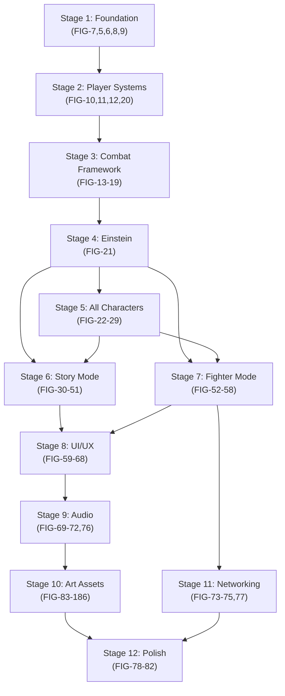

# Fighters Through Time - Godot V3 Development Plan

## Overview

A phased development plan for building "Fighters Through Time" in Godot 4.4+ (.NET/C#) across 12 stages, organized by Linear ticket priority (Urgent -> High -> Medium -> Low). All work targets `D:\Projects\Fighters Through Time - V3\`. Placeholder assets are used throughout development and replaced with final art in a dedicated asset production stage.

> **Design Reference:** The authoritative source of truth for all implementation details is [`design-godot.md`](./design-godot.md). When working on any ticket, consult the relevant section(s) of that document for exact specifications including data schemas, physics constants, animation frame counts, state transition tables, collision layer assignments, and all other technical parameters. The section references listed under each ticket below point to the specific areas of the design doc to review.

## Target Directory

`D:\Projects\Fighters Through Time - V3\` (currently empty -- project created from scratch)

## Ticket Inventory Summary (Linear: "Fighters Through Time" project)

- **Urgent (P1):** 5 tickets (FIG-5, FIG-6, FIG-7, FIG-8, FIG-9) -- Project foundation
- **High (P2):** 20 tickets (FIG-10 through FIG-29) -- Core systems + 9 character implementations
- **Medium (P3):** ~116 tickets (FIG-30 through FIG-186) -- Game modes, UI, audio, all assets
- **Low (P4):** 9 tickets (FIG-73 through FIG-82) -- Networking, polish, testing

---

## Stage 1: Project Foundation [Urgent]

**Linear Tickets:** FIG-7, FIG-5, FIG-6, FIG-8, FIG-9

Set up the Godot 4.4+ (.NET/C#) project with the complete folder structure defined in design-godot.md Section 4.

> **Design Doc Reference:** Consult `design-godot.md` **Section 4: Engine & Architecture (Godot 4)** for all project setup details including: Project Setup & Configuration, Godot Version & 2D Renderer, Required Addons & Dependencies table, Project Folder Structure, Namespace Conventions, Dependency & Reference Management, Scene Architecture & Loading Strategy, Persistent Managers (Autoload Singletons), Event Bus & Signal Architecture, Core Runtime Event Channels Registry, and Object Pooling System. Also consult **Section 5: Accessibility & Controls** for the Default Input Action Mapping Table.

### Tasks

1. **FIG-7 -- Godot Project Setup & Configuration**
   - Create `project.godot` with 2D CanvasItem renderer, 60Hz physics tick, 1920x1080 reference resolution
   - Create `FightersThroughTime.csproj` with .NET 8 and NuGet refs (Klotho, GdUnit4)
   - Build the full folder tree: `scripts/Core/`, `scripts/Characters/`, `scripts/Combat/`, `scripts/Enemies/`, `scripts/Environment/`, `scripts/UI/`, `resources/`, `scenes/`, `assets/`, `audio/`, `tests/`
   - Configure namespace root `FTT` with sub-namespaces (`FTT.Core`, `FTT.Combat`, etc.)
   - Pin addon versions in `addons/klotho/` and `addons/gdunit4/`

2. **FIG-5 -- Event Bus System**
   - Implement `EventBus.cs` autoload singleton under `scripts/Core/`
   - Wire up all 27 event channels from design doc (e.g., `OnPlayerDamaged`, `OnUltimateMeterFull`, `OnCheckpointReached`)
   - Use `Action` / `Action<T>` delegate pattern

3. **FIG-6 -- GameManager & SessionData Singleton**
   - Implement `GameManager.cs` autoload with `SessionData` struct, `MatchSettings` struct
   - Scene transition via `ResourceLoader.LoadThreadedRequest()` + `SceneTree.ChangeSceneToPacked()`
   - `LoadingScreen` CanvasLayer overlay (minimum 2.0s display)

4. **FIG-8 -- Object Pooling System**
   - `PoolManager.cs` autoload singleton with `IPoolable` interface
   - `ScenePoolConfig` Resource, `PoolDefinition` struct, overflow policies (Grow, RecycleOldest, Reject)
   - Reparenting-based pool pattern with `OnSpawn()` / `OnDespawn()` lifecycle

5. **FIG-9 -- InputManager & Input Action Schema**
   - `InputManager.cs` autoload wrapping Godot InputMap
   - Full action binding table from Section 5 (MoveLeft, MoveRight, Jump, Attack, Special1, Special2, Block, etc.)
   - Device assignment for local multiplayer via `Input.GetConnectedJoypads()`

### Placeholder Assets for Stage 1

- **No visual assets needed yet** -- this stage is pure infrastructure code
- Create a minimal test scene (`scenes/TestScene.tscn`) with a `ColorRect` background to verify autoloads initialize

---

## Stage 2: Core Player Systems [High]

**Linear Tickets:** FIG-10, FIG-11, FIG-12, FIG-20

Build the character controller foundation with FSM, movement physics, and data architecture.

> **Design Doc Reference:** Consult `design-godot.md` **Section 4** for: Character Data Architecture (Static Data -- CharacterData Resource table, Character Base Stat Values table for all 9 characters, Runtime Data -- PlayerController CharacterBody2D table), Core Systems -- State Machine, Canonical Character State Enum (15 states), State Transition Table (complete from/to/trigger), Movement Mechanics (Physics Constants & Unit Conventions, Horizontal Movement, Standard Jumping, Special Jump Abilities, Gravity & Fall Speed Physics Parameters), Player Movement & Feedback Defaults, Ledge Grabbing & Edge Recovery, One-Way Platforms (Drop-Through), Ledge Hanging Mechanics, and One-Way Platform Drop-Through Mechanics.

### Tasks

1. **FIG-20 -- CharacterData Resource & PlayerController**
   - `CharacterData : Resource` with all exported fields (characterID, displayName, maxHP, weight, moveSpeed, jumpForce, etc.)
   - `PlayerController : CharacterBody2D` with runtime variables (currentHP, facingDirection, comboCounter, etc.)
   - Create Einstein's `CharacterData.tres` as the first data asset

2. **FIG-10 -- Character State Machine (FSM)**
   - `CharacterState` enum (15 states: Idle, Running, Skidding, Crouching, Airborne, Attacking, etc.)
   - Full state transition table implementation (Section 4)
   - FSM drives `AnimatedSprite2D` animation selection

3. **FIG-11 -- Player Movement & Physics**
   - Horizontal acceleration/deceleration with skid turnaround (3-frame lag)
   - Variable-height jumping (short-hop / full-hop via button hold duration)
   - Double jump, coyote time (0.1s), jump buffer (0.1s)
   - Gravity scaling and terminal fall velocity

4. **FIG-12 -- Ledge Grab & One-Way Platforms**
   - Hand-level `Area2D` for ledge detection
   - Ledge hang (max 5s), pull-up, drop-down
   - One-way platform drop-through (double-tap down)

### Placeholder Assets for Stage 2

- **Character sprite:** Single-color 64x64 rectangle sprite (cyan) with distinct frames for each FSM state. Use Godot's built-in `Sprite2D` with colored rectangles or simple geometric shapes
- **Animations:** Create minimal `SpriteFrames` resource with 2-frame placeholder animations per state (idle bob, run cycle, jump, fall, crouch). Name animations to match final naming convention (`idle`, `run`, `jump_rise`, `jump_fall`, `crouch`, `skid`, `ledge_hang`, `ledge_pull_up`)
- **Test level:** Simple `TileMapLayer` scene with ground platforms, gaps, ledges, and one-way platforms using solid-color tile sprites (32x32 grey tiles for ground, semi-transparent blue for one-way platforms)
- **Collision shapes:** Use `CollisionShape2D` with `RectangleShape2D` / `CapsuleShape2D` matching placeholder sprite bounds

---

## Stage 3: Combat Framework [High]

**Linear Tickets:** FIG-13, FIG-14, FIG-15, FIG-16, FIG-17, FIG-18, FIG-19

Implement the complete combat system before any character-specific abilities.

> **Design Doc Reference:** Consult `design-godot.md` **Section 4** for: Combat Mechanics -- Hitbox & Hurtbox Geometry, Hitbox Activation Timing, Physics Layer Matrix, Basic Attack & 3-Hit Combo String, Aerial Combat & Aerial Attacks, Combo & Ability Cancel Rules, Special Attacks (Primary & Secondary), Ability Data Schema (AbilityData Resource full table), BaseSpecial Abstract Class, Ability Execution Flow (6-step pipeline), Ultimate Attack ("The History Maker") & Influence Meter, Defense Mechanics: Blocking, Status Effect Architecture (Status Data Structures, Status Type Enum, Status Effect Rules, Processing Architecture: Strategy Pattern, Visual Indicators System), Knockback & Launch Physics, Damage Calculation Formulas, Hyper-Armor Technical Specification, and Persistent Object System.

### Tasks

1. **FIG-13 -- Hitbox/Hurtbox System & Physics Layers**
   - `Area2D` + `CollisionShape2D` hurtboxes on characters
   - Hitbox activation via `AnimatedSprite2D` frame callbacks
   - Configure collision layer matrix (Player, Enemy, Projectile, Environment, Hazard, etc.)

2. **FIG-14 -- Basic Attack 3-Hit Combo**
   - Sequential Hit 1 (Starter) -> Hit 2 (Bridge) -> Hit 3 (Finisher)
   - Input buffer window (0.4s), combo counter reset on timeout
   - Aerial attack variants, landing cancel mechanics

3. **FIG-15 -- Special Ability Framework**
   - `BaseSpecial` abstract class, `AbilityData : Resource` schema
   - 6-step ability execution pipeline (Input -> Validation -> Startup -> Active -> Recovery -> Cleanup)
   - Flat 10-second cooldown system

4. **FIG-16 -- Ultimate Attack & Influence Meter**
   - `UltimateMeter` (0.0 to 100.0), build-up rules (+1.0/HP dealt, +0.25/HP taken)
   - Cinematic execution sequence with gameplay pause
   - Death carryover rules

5. **FIG-17 -- Blocking & Guard Break**
   - Front-facing energy barrier with block charges (default 3)
   - Shield regeneration (1 charge per 3s out of block)
   - Guard break -> 1.0s Dazed state with knockback vector

6. **FIG-18 -- Status Effect System**
   - Strategy Pattern with 5 types: TimeDilation, Energized, Weakened, Burning, Stunned
   - `StatusController` component, visual indicators (outline shader tints)
   - Duration tracking and expiry

7. **FIG-19 -- Knockback, Damage Calc, Hyper-Armor, Persistent Objects**
   - Knockback physics with weight-based resistance
   - Damage formula: `FinalDamage = BaseDamage * DamageMultiplier * (1 - TargetDefense)`
   - Hyper-Armor flag on abilities preventing hitstun
   - `PersistentObjectData` struct for stage objects

### Placeholder Assets for Stage 3

- **Hitbox visualization:** Red semi-transparent `ColorRect` or `Polygon2D` overlays toggled via a debug flag for hitbox/hurtbox areas
- **Attack animations:** Extend the placeholder `SpriteFrames` with simple frame sequences for attacks -- e.g., character rectangle shifts color (yellow on attack startup, red on active frames, return to cyan on recovery)
- **Block shield:** Simple blue circle `Sprite2D` spawned in front of the character
- **Status effect indicators:** Colored outline glow applied via the outline shader with placeholder colors (blue = TimeDilation, yellow = Energized, purple = Weakened, orange = Burning, white = Stunned)
- **Projectile placeholder:** Small colored circle (8x8 white dot) for any projectile testing
- **VFX placeholders:** Expanding ring particle (GPUParticles2D with simple circle texture) for impacts, double jump burst, etc.

---

## Stage 4: First Playable Character -- Albert Einstein [High]

**Linear Ticket:** FIG-21

Implement Einstein as the reference character that validates all Stage 2-3 systems end-to-end.

> **Design Doc Reference:** Consult `design-godot.md` **Section 5: Character Implementations** for Albert Einstein's complete specification including: archetype, base stats, standard attack combo details (frame data, hitbox dimensions, damage values), Special 1 (E=mc2 Blast), Special 2 (Relativity Rift), Movement Ability (Relativity Warp), and Ultimate Attack (Theory of Everything) with all AbilityData field values. Also consult the **Character Base Stat Values table** in Section 4 for runtime defaults.

### Tasks

- **Base stats:** HP 100, Weight 1.0, Speed 8.0, Double Jump
- **Standard Attack -- Quantum Strikes:** Chalk slash combo with kinetic shockwave finisher
- **Special 1 -- E=mc2 Blast:** Forward energy projectile
- **Special 2 -- Relativity Rift:** Area-of-effect time dilation zone
- **Movement Ability -- Relativity Warp:** Short-range teleport dash
- **Ultimate -- Theory of Everything:** Cinematic spacetime collapse
- Create `resources/Characters/einstein_data.tres` and `resources/Abilities/` for each ability
- Wire all abilities through the `BaseSpecial` framework
- Full integration test: movement + combo + specials + ultimate + blocking in test level

### Placeholder Assets for Einstein

- **Character sprite:** Styled placeholder -- white-haired figure silhouette (simple 2-3 color sprite), or continue using the colored rectangle with "E" label
- **Ability VFX:**
  - E=mc2 Blast: Yellow circle projectile moving forward
  - Relativity Rift: Purple expanding circle on ground (GPUParticles2D)
  - Relativity Warp: Brief cyan flash at origin + destination
  - Ultimate: Full-screen white flash overlay + screen shake
- **Sound:** No audio yet -- use `print()` debug logs for ability triggers

---

## Stage 5: Remaining Characters [High]

**Linear Tickets:** FIG-22 through FIG-29

Implement all 8 remaining characters using the same framework proven with Einstein.

> **Design Doc Reference:** Consult `design-godot.md` **Section 5: Character Implementations** for each character's complete specification. Each character entry contains: archetype, base stats, standard attack combo (frame data, hitbox dimensions, damage per hit), Special 1, Special 2, Movement Ability, Ultimate Attack, and all AbilityData field values. Characters are: Joan of Arc (The Radiant Vanguard), Leonardo da Vinci (The Universal Man), Abraham Lincoln (The Rail-Splitter), Cleopatra (The Serpent Queen), Nikola Tesla (The Storm Conductor), William Shakespeare (The Bard), Wolfgang Amadeus Mozart (The Sound Conductor), Pocahontas (The Peace Weaver).

### Characters (in ticket order)

1. **FIG-22 -- Joan of Arc** (Rushdown/Melee, HP 110, Weight 1.1, Speed 9.0)
2. **FIG-23 -- Leonardo da Vinci** (Gadget/Hybrid, HP 95, Weight 0.9, Speed 7.5)
3. **FIG-24 -- Abraham Lincoln** (Heavy/Juggernaut, HP 130, Weight 1.6, Speed 5.5)
4. **FIG-25 -- Cleopatra** (Puppeteer/Trapper, HP 80, Weight 0.7, Speed 8.5)
5. **FIG-26 -- Nikola Tesla** (Setup/Ranged, HP 90, Weight 0.85, Speed 7.0)
6. **FIG-27 -- William Shakespeare** (Puppeteer/Summoner, HP 95, Weight 0.9, Speed 7.5)
7. **FIG-28 -- Wolfgang Amadeus Mozart** (Ranged/Tempo, HP 85, Weight 0.75, Speed 8.0)
8. **FIG-29 -- Pocahontas** (Scout/Evasion, HP 90, Weight 0.8, Speed 9.0)

Each character requires: `CharacterData.tres`, 2 AbilityData resources, movement ability, ultimate, and wired FSM animations.

### Placeholder Assets for All Characters

- **Per character:** Distinctly colored rectangle/silhouette sprite with character initial label (J, L, A, C, T, S, M, P) -- each in a unique color to distinguish during testing
- **Ability VFX:** Color-coded geometric shapes matching the character's theme color:
  - Joan: Gold/white effects
  - Da Vinci: Brown/copper effects
  - Lincoln: Dark grey/brown effects
  - Cleopatra: Green/gold effects
  - Tesla: Electric blue/white effects
  - Shakespeare: Purple/ink effects
  - Mozart: Pink/musical note shapes
  - Pocahontas: Green/nature leaf shapes
- **SpriteFrames:** Clone Einstein's placeholder SpriteFrames structure, recolor per character

---

## Stage 6: Story Mode Core [Medium]

**Linear Tickets:** FIG-39, FIG-40, FIG-41, FIG-42, FIG-43, FIG-44, FIG-45, FIG-46, FIG-47, FIG-48, FIG-49, FIG-50, FIG-51, FIG-30 through FIG-38

Build the PvE campaign infrastructure.

> **Design Doc Reference:** Consult `design-godot.md` for the following sections:
> - **Section 2: Narrative & Worldbuilding** -- enemy faction descriptions, level & boss concepts for all 10 historical eras + special levels
> - **Section 3: Campaign Structure & Progression** -- campaign flow (Act I/II/III), Tutorial & Onboarding (Level 0), Hub World interactivity & systems, Temporal Resonance Grid (currency, node types, node data schema, costs, UI flow), campaign progression outline
> - **Section 4** -- enemy data architecture, boss phase system, checkpoint mechanics
> - **Section 6: Enemy & Boss Design** -- Standard Mob archetypes, Elite Mob abilities, Boss encounter specifications (15 bosses with phase breakdowns, attack patterns, HP values)
> - **Section 7: Level Design** -- per-level hazard and puzzle specifications

### Tasks (grouped by dependency)

**Enemy Systems:**

- FIG-39: Standard Mob AI (patrol, chase, attack states)
- FIG-40: Elite Mob AI (abilities, aggro, higher stats)
- FIG-41: Boss AI Framework (phase transitions, attack patterns)
- FIG-42: Era-Specific Enemy Implementations (per-level mob variants)
- FIG-43: Boss Encounter Implementations (15 bosses across campaign)

**Level Infrastructure:**

- FIG-44: Hub World -- Archive Time-Ship (navigable 2D hub with interactive terminals)
- FIG-45: Tutorial Level 0 (3-part onboarding: Fracture, Calibration, Advanced Mobility)
- FIG-49: Checkpoint System (Chronal Rift save points within levels)
- FIG-50: Level Completion & Hub Return Flow
- FIG-51: Campaign Progression & Dialogue System (NPC dialogue boxes, sequential portal activation)

**Progression Systems:**

- FIG-46: Temporal Resonance Grid System (constellation UI, node unlocking)
- FIG-47: Chronal Dust Economy & Pickup System (drop rates, visual pickup sprites)
- FIG-48: Chronal Rewind System (story mode death/respawn with rewind pool)
- FIG-30 through FIG-38: Per-character Resonance Grid data (9 grids, 9 nodes each)

### Placeholder Assets for Stage 6

- **Enemies:** Colored rectangles in red tones (standard mobs: small red, elites: medium dark red, bosses: large crimson) with simple 2-frame idle/attack animations
- **Hub World tileset:** Metallic grey/blue colored tiles (32x32) representing the Time-Ship interior. Simple room layouts connected by doorways
- **Campaign levels:** For initial testing, build 1-2 prototype levels using solid-color tile platforms with different color palettes per era (brown for Florence, grey-blue for Orleans, etc.)
- **NPC portraits:** Solid-color circles with text labels ("Commander Sarah", "Engineer", "Medic")
- **Dialogue boxes:** Simple dark semi-transparent panel with white text -- use Godot's built-in `PanelContainer` + `RichTextLabel`
- **Chronal Dust pickup:** Small glowing diamond shapes in three sizes (small=white, medium=cyan, large=gold) using `Sprite2D` with a simple glow shader
- **Resonance Grid:** Node circles connected by lines -- use Godot `Control` nodes (`TextureButton` circles + `Line2D` connections) with placeholder colors (grey=locked, cyan=unlocked)
- **Checkpoint markers:** Vertical cyan energy beam (simple `Line2D` or stretched `ColorRect`) with a pulsing glow

---

## Stage 7: Fighter Mode Core [Medium]

**Linear Tickets:** FIG-52, FIG-53, FIG-54, FIG-55, FIG-56, FIG-57, FIG-58

Build the 1v1 versus mode infrastructure.

> **Design Doc Reference:** Consult `design-godot.md` for:
> - **Section 4** -- Scene Architecture (FighterStage scene list), Camera System (Fighter Mode dual-focus tracking), Match Settings & SessionData structs, Chronal Rewind/Respawn (fighter mode stock deduction rules)
> - **Section 10: Fighter Mode Design** -- Stage layouts, stage hazard specifications per arena, Chronal Orb item system (spawn rates, pickup effects, orb types), Stock & Match rules, CPU AI behavior tiers, Post-Match flow, Match Settings configuration options
> - **Section 4** -- Physics Layer Matrix (fighter-specific collision rules)

### Tasks

- FIG-52: Fighter Camera Controller (dual-focus tracking, zoom based on player distance)
- FIG-53: Stage Hazard System (timer-triggered environmental hazards per stage)
- FIG-54: Chronal Orb Item System (spawn timers, pickup effects -- HP restore, meter boost, etc.)
- FIG-55: Stock & Match Systems (stock lives, KO tracking, win conditions, time limits)
- FIG-56: CPU Fighter AI (Holodeck Arena -- difficulty-tiered AI for single-player practice)
- FIG-57: Post-Match Flow & Win/Loss Screen (results display, rematch option)
- FIG-58: Match Settings & Online Lobby (local settings configuration UI)

### Placeholder Assets for Stage 7

- **Fighter stages:** Simple platform layouts using colored rectangles -- one main platform + 2-3 floating platforms, each in a distinct color representing the era. Stage boundaries as invisible `StaticBody2D` walls
- **Stage backgrounds:** Solid gradient `ColorRect` per stage (warm brown for Florence, cool blue for Orleans, etc.)
- **Chronal Orbs:** Small glowing orb sprites (colored circles with pulsing shader)
- **Stage hazards:** Simple red warning zones (`Area2D` + red semi-transparent overlay) that activate on timer
- **Win/Loss screen:** Text-only overlay (`"PLAYER 1 WINS!"`) on a dark panel
- **Stock icons:** Small character-colored circles in the HUD corner

---

## Stage 8: UI/UX Layer [Medium]

**Linear Tickets:** FIG-59, FIG-60, FIG-61, FIG-62, FIG-63, FIG-64, FIG-65, FIG-66, FIG-67, FIG-68

Build all menu screens and in-game UI.

> **Design Doc Reference:** Consult `design-godot.md` for:
> - **Section 4** -- Scene Loading Strategy (loading screen overlay, transition effects), Data Flow Between Scenes (SessionData struct)
> - **Section 11: UI/UX Design** -- Main Menu layout, Character Select Screen (grid layout, stats panel, selection flow), Stage Select Screen, Save Select Screen (3 slots, profile display), Story Mode HUD (HP bar, ultimate meter, cooldown icons, stock/rewind counter, dust count), Fighter Mode HUD (dual HP bars, stock icons, timer), Floating Damage Numbers, Pause Menu, Loading Screen visual specifications (Shimmering Portal Effect for Story, Dynamic VS Matchup Cards for Fighter)
> - **Section 3** -- Resonance Grid UI Flow (access point, navigation, purchase flow, visual states)

### Tasks

- FIG-59: Main Menu (Story Mode, Fighter Mode, Settings, Quit buttons)
- FIG-60: Story Mode HUD (HP bar, ultimate meter, ability cooldowns, stock/rewind counter, Chronal Dust count)
- FIG-61: Fighter Mode HUD (dual HP bars, stock icons, timer, ultimate meters)
- FIG-62: Character Select Screen (9-character grid, stats preview)
- FIG-63: Stage Select Screen (stage thumbnails, preview)
- FIG-64: Save Select Screen (3 save slots, character/progress display)
- FIG-65: Floating Damage Numbers & Health Bars (pooled floating text, enemy HP bars)
- FIG-66: Pause Menu (Resume, Settings, Quit to Hub/Main Menu)
- FIG-67: Loading Screen Transitions (portal effect for Story, VS cards for Fighter)
- FIG-68: Resonance Grid UI (constellation node map, purchase flow)

### Placeholder Assets for Stage 8

- **UI panels:** Godot's default `Theme` with custom colors (dark blue/cyan palette). Use `PanelContainer`, `VBoxContainer`, `Button`, `Label` nodes styled with a consistent color scheme
- **HP bars:** `TextureProgressBar` with solid fill colors (green->yellow->red gradient)
- **Character select portraits:** Character-colored squares with initial labels, arranged in a 3x3 grid
- **Stage thumbnails:** Small colored rectangles matching stage background colors with era name text
- **Damage numbers:** `Label` nodes with `BitmapFont` or default Godot font, spawned from pool with upward float + fade tween
- **Loading screens:** Simple full-screen `ColorRect` with centered "LOADING..." text and a spinning icon (Godot `TextureRect` with rotation tween)
- **Fonts:** Use a clean sans-serif system font initially; add custom `.ttf` fonts to `assets/fonts/` when available

---

## Stage 9: Audio & Feedback [Medium]

**Linear Tickets:** FIG-69, FIG-70, FIG-71, FIG-72, FIG-76

> **Design Doc Reference:** Consult `design-godot.md` for:
> - **Section 4** -- Audio System Architecture (AudioServer bus pipeline, AudioBusLayout)
> - **Section 8: Audio Design** -- Audio Mixer Pipeline & Snapshots (bus hierarchy, snapshot transitions), Dynamic Music System (3-stem vertical layering rules, horizontal transitions), Level BGM Track Specifications table (genre, key instruments per level), Surface-Specific Footstep System (surface types, RayCast2D detection), Required Sound Effects Asset List (6 SFX categories with detailed descriptions)
> - **Section 12: Save System** -- Secure Save System (AES-256 + HMAC, StorySaveData / GlobalSaveData schemas, file paths)
> - **Section 5** -- Controller Haptic Feedback (vibration event table, intensity/duration per event type)

### Tasks

- FIG-69: Secure Save System (AES-256 encrypted JSON, HMAC integrity, 3 save slots)
- FIG-70: Audio Mixer Pipeline (AudioServer bus layout: Master -> Music / SFX / UI / Ambient)
- FIG-71: Dynamic Music System (3-stem vertical layering: Ambient, Combat, Climax)
- FIG-72: Surface-Specific Footstep System (RayCast2D surface detection, material-based SFX)
- FIG-76: Controller Haptic Feedback Manager (event-driven vibration patterns)

### Placeholder Assets for Stage 9

- **Audio bus layout:** Create `audio/buses/default_bus_layout.tres` with the 4-bus hierarchy -- no actual audio files needed yet
- **BGM:** Use royalty-free placeholder music tracks (or silence) per level. Create empty `.tres` `AudioStream` resources to wire the music system without final tracks
- **SFX:** Use simple generated tones (Godot's `AudioStreamGenerator` or free CC0 sound packs) for: hit impact, jump, land, menu click, damage taken. One generic sound per category
- **Footsteps:** Single generic footstep sound reused across all surfaces initially
- **Save files:** Stored in `user://saves/` as encrypted JSON -- no visual assets needed

---

## Stage 10: Art Asset Production [Medium]

**Linear Tickets:** FIG-83 through FIG-186 (104 asset tickets total)

This is the dedicated phase where all placeholder assets from Stages 2-9 are replaced with final production art and audio. Assets are produced using the AI-assisted pipeline described in design-godot.md Section 9.

> **Design Doc Reference:** Consult `design-godot.md` for:
> - **Section 9: Art Direction & Animation System** -- Visual Art Style, Animation Pipeline & Asset Strategy (sprite sheet implementation), AI-Assisted Asset Generation Pipeline (3-step workflow: GPT Image base, frame-by-frame generation, Python sprite sheet assembly), Required Sprite Sheets Per Character table (16+ animations with frame count targets), Required Sprite Sheets Per Enemy table, Unified Outline & Glow Shader System (shader parameters, per-instance control)
> - **Section 8: Audio Design** -- Level BGM Track Specifications table (genre/instruments per level), Required Sound Effects Asset List (all 6 SFX categories)
> - **Section 6: Enemy & Boss Design** -- enemy visual descriptions per era for sprite art direction
> - **Section 11: UI/UX Design** -- UI art specifications (buttons, panels, HUD elements, portraits)

### Asset Categories

**Character Sprites (FIG-83 through FIG-91):** 9 characters x 16+ animation sheets each
- Follow the 3-step AI pipeline: GPT Image base -> frame-by-frame generation -> Python sprite sheet assembly
- Required sheets per character: Idle, Run, Jump Rise/Fall, Crouch, Block, Skid, 3-Hit Combo (ground + aerial), Special 1, Special 2, Movement Ability, Ultimate, Hitstun, Ledge Grab/Pull Up, Death

**Character VFX & Projectiles (FIG-92 through FIG-100):** 9 characters x ability-specific particle effects and projectile sprites

**Enemy Sprites (FIG-101 through FIG-113):** Future Cultist base set + 12 era-specific enemy variant sets (Idle, Walk, Attack, Hit, Death per enemy type)

**Boss Sprites (FIG-114 through FIG-128):** 15 unique boss sprite sets with phase-specific animations

**Environment Tilesets (FIG-129 through FIG-145):** 17 tilesets (Tutorial, Hub World, 15 campaign levels) -- each containing ground, wall, platform, decoration, and hazard tiles

**Fighter Stage Backgrounds (FIG-146 through FIG-155):** 10 parallax-scrolling multi-layer backgrounds for versus mode arenas

**UI Art (FIG-156 through FIG-161):** Menu backgrounds, button styles, HUD elements, dialogue box art, item sprites, character/NPC portraits

**BGM Tracks (FIG-162 through FIG-178):** 17 music tracks (each with 3 stems: Ambient, Combat, Climax) following the genre specifications in Section 8

**SFX (FIG-179 through FIG-186):** 8 SFX categories: Movement/Physics, Environmental Destruction, General Combat, Character-Specific Combat (9 characters), Environmental Hazards, Chronal Systems, Enemy/Boss, UI/Dialogue

### Placeholder-to-Final Swap Strategy

- All placeholder sprites are stored in `assets/sprites/placeholder/` -- final art goes directly into `assets/sprites/` organized by character/enemy/environment
- `SpriteFrames` resources reference sprite textures by path -- swapping art is a matter of replacing the `.png` files and updating `SpriteFrames` `.tres` resources
- Audio files placed in `audio/music/` and `audio/sfx/` with matching names automatically picked up by the AudioManager
- **No code changes required** when swapping placeholder to final assets -- only resource file updates

---

## Stage 11: Networking & Online [Low]

**Linear Tickets:** FIG-73, FIG-74, FIG-75, FIG-77

Deferred to post-core-gameplay. Requires all combat systems to be finalized.

> **Design Doc Reference:** Consult `design-godot.md` **Section 15: Online Multiplayer & Networking** for: Rollback Netcode Framework (Klotho/GGPO architecture, FP64 fixed-point math, tick rate, rollback depth), State Snapshot Serialization (PlayerSnapshot, PersistentObjectSnapshot, ProjectileSnapshot struct schemas), Online Lobby & Matchmaking (transport layer, queue types, region isolation, room codes), Desync Detection & Recovery (checksum intervals, reconnection protocol, result determination rules), and Latency Monitoring UI.

### Tasks

- FIG-73: Rollback Netcode Framework (Klotho GGPO, FP64 deterministic simulation, 60Hz tick, 7-frame max rollback)
- FIG-74: State Snapshot Serialization (PlayerSnapshot, PersistentObjectSnapshot, ProjectileSnapshot structs)
- FIG-75: Online Lobby & Matchmaking (Steam Networking Sockets, P2P rooms, casual queue, private lobby)
- FIG-77: Desync Detection & Recovery (checksum comparison, reconnection, result determination)

---

## Stage 12: Polish & QA [Low]

**Linear Tickets:** FIG-78, FIG-79, FIG-80, FIG-81, FIG-82

> **Design Doc Reference:** Consult `design-godot.md` for:
> - **Section 4** -- Camera Shake System (FastNoiseLite parameters, per-ability intensity/duration from AbilityData), Display & Viewport Enforcer (16:9 enforcement, ViewportEnforcer script, reference resolution)
> - **Section 5** -- Settings Menu (audio, display, controls, gameplay options with defaults and ranges)
> - **Section 13: Localization** -- TranslationServer key-based lookup architecture, string table format
> - **Section 14: Testing** -- GdUnit4/NUnit framework, test categories (FSM validation, status effects, rewind buffer, damage calc), test folder structure

### Tasks

- FIG-78: Camera Shake System (FastNoiseLite offset, exponential decay, per-ability intensity)
- FIG-79: Localization Framework (TranslationServer key-based lookups, `en.csv` default table)
- FIG-80: Settings Menu (Audio sliders, display options, input remapping, gameplay toggles)
- FIG-81: Display & Viewport Enforcer (16:9 letterbox/pillarbox, 1920x1080 reference)
- FIG-82: Automated Testing Framework (GdUnit4/NUnit, FSM tests, damage calc tests, status effect tests)

---

## Dependency Flow

Stages 6 and 7 can be developed in parallel after Stage 4, as Story Mode and Fighter Mode share the character/combat framework but are otherwise independent systems. Stage 10 (art) can begin asset production in parallel with any stage once the asset naming conventions and SpriteFrames structure are established.
